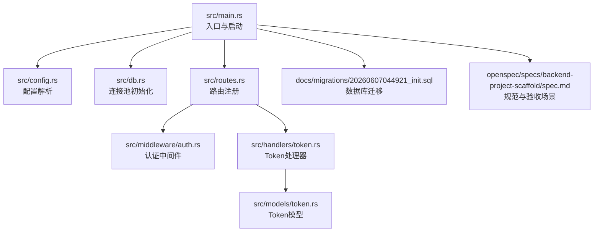
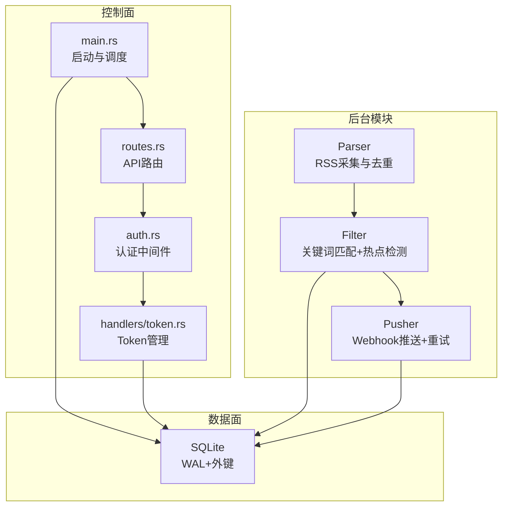
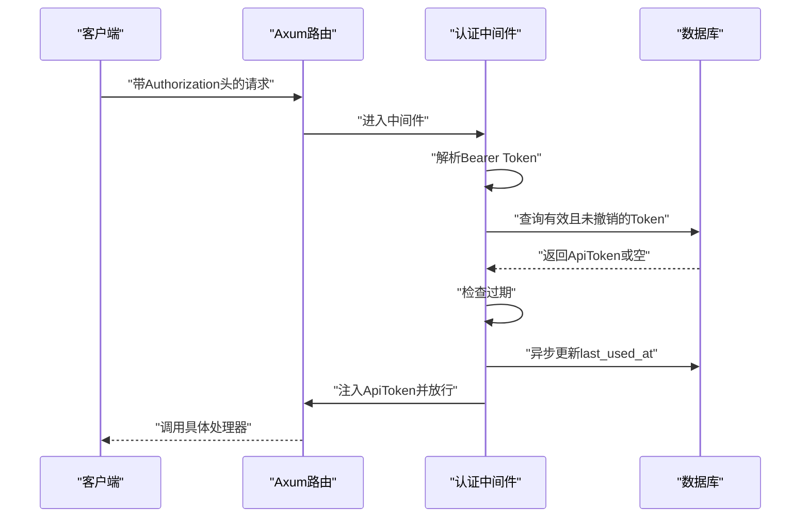
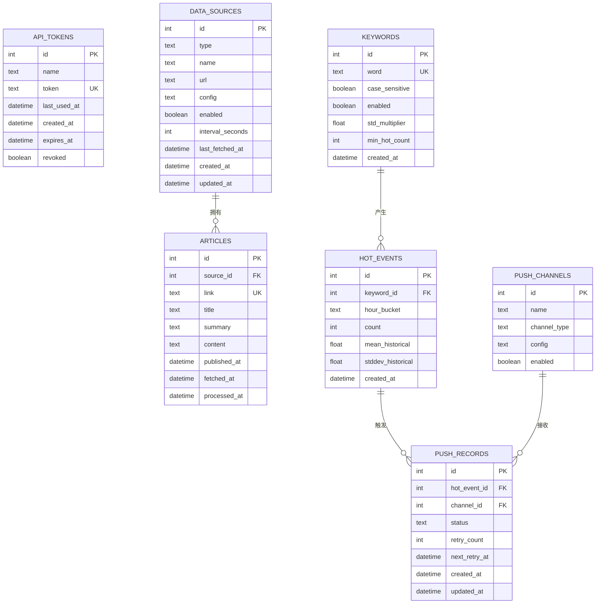
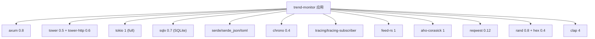

# 开发者指南

<cite>
**本文引用的文件**
- [README.md](file://README.md)
- [Cargo.toml](file://Cargo.toml)
- [src/main.rs](file://src/main.rs)
- [src/config.rs](file://src/config.rs)
- [src/error.rs](file://src/error.rs)
- [src/db.rs](file://src/db.rs)
- [src/routes.rs](file://src/routes.rs)
- [src/middleware/auth.rs](file://src/middleware/auth.rs)
- [src/handlers/token.rs](file://src/handlers/token.rs)
- [src/models/token.rs](file://src/models/token.rs)
- [src/models/article.rs](file://src/models/article.rs)
- [src/services.rs](file://src/services.rs)
- [docs/migrations/20260607044921_init.sql](file://docs/migrations/20260607044921_init.sql)
- [openspec/config.yaml](file://openspec/config.yaml)
- [openspec/specs/backend-project-scaffold/spec.md](file://openspec/specs/backend-project-scaffold/spec.md)
- [config.toml](file://config.toml)
- [CLAUDE.md](file://CLAUDE.md)
</cite>

## 目录
1. [简介](#简介)
2. [项目结构](#项目结构)
3. [核心组件](#核心组件)
4. [架构总览](#架构总览)
5. [详细组件分析](#详细组件分析)
6. [依赖关系分析](#依赖关系分析)
7. [性能考虑](#性能考虑)
8. [故障排查指南](#故障排查指南)
9. [结论](#结论)
10. [附录](#附录)

## 简介
本指南面向希望参与“AI趋势监控系统”（TrendAITool）开发的工程师，覆盖开发环境搭建、代码结构与组织、OpenSpec规范驱动的开发方法论、贡献流程、测试与质量保障、最佳实践与常见陷阱、以及扩展与插件开发指导。系统采用Rust语言与Axum框架构建，后端以SQLite存储为核心，支持Token认证、API路由、数据库迁移、以及未来逐步实现的Parser/Filter/Pusher后台模块。

## 项目结构
项目采用模块化分层组织，核心目录与职责如下：
- src：后端源代码
  - main.rs：入口点、CLI参数解析、配置加载、数据库连接池初始化、迁移执行、初始Token引导、HTTP服务器启动
  - config.rs：配置结构体与TOML解析
  - error.rs：统一错误与响应封装
  - db.rs：数据库连接池初始化（SQLite WAL + 外键）
  - routes.rs：路由注册、CORS、认证中间件挂载
  - middleware/auth.rs：Bearer Token认证中间件
  - handlers：API处理器（示例：token）
  - models：数据模型（示例：token、article）
  - services.rs：后台服务模块入口（Parser/Filter/Pusher预留）
- docs：文档与数据库迁移
  - migrations：SQLite迁移SQL
  - apis：API设计文档
  - plans：实施计划
  - data：SQLite数据文件
- openspec：OpenSpec规范与变更工作流
- config.toml：默认配置文件
- CLAUDE.md：开发规则与命令指引
- README.md：项目说明、架构概览、API与数据库表结构



图表来源
- [src/main.rs:1-96](file://src/main.rs#L1-L96)
- [src/config.rs:1-59](file://src/config.rs#L1-L59)
- [src/db.rs:1-26](file://src/db.rs#L1-L26)
- [src/routes.rs:1-61](file://src/routes.rs#L1-L61)
- [src/middleware/auth.rs:1-60](file://src/middleware/auth.rs#L1-L60)
- [src/handlers/token.rs:1-66](file://src/handlers/token.rs#L1-L66)
- [src/models/token.rs:1-46](file://src/models/token.rs#L1-L46)
- [docs/migrations/20260607044921_init.sql:1-118](file://docs/migrations/20260607044921_init.sql#L1-L118)
- [openspec/specs/backend-project-scaffold/spec.md:1-151](file://openspec/specs/backend-project-scaffold/spec.md#L1-L151)

章节来源
- [README.md:216-257](file://README.md#L216-L257)
- [src/main.rs:1-96](file://src/main.rs#L1-L96)
- [src/routes.rs:1-61](file://src/routes.rs#L1-L61)

## 核心组件
- 配置系统：通过TOML文件加载应用配置，包含server、database、auth、parser、filter、pusher等段落，提供类型安全的结构体解析。
- 数据库层：SQLite连接池初始化，启用WAL模式与外键约束；迁移由sqlx自动执行。
- 路由与中间件：Axum路由注册，挂载CORS与认证中间件；健康检查接口。
- 统一错误与响应：定义AppError枚举与ApiResponse辅助类，确保错误与成功响应格式一致。
- 认证中间件：从Authorization头提取Bearer Token，数据库校验（非撤销）、过期检查、最后使用时间异步更新、注入请求上下文。
- Token管理API：创建Token（返回明文一次）、列表（隐藏明文）、撤销（软删除）。
- 数据模型：如ApiToken、ApiTokenInfo、CreateTokenRequest、Article等，配合sqlx::FromRow与Serde序列化。

章节来源
- [src/config.rs:1-59](file://src/config.rs#L1-L59)
- [src/db.rs:1-26](file://src/db.rs#L1-L26)
- [src/routes.rs:1-61](file://src/routes.rs#L1-L61)
- [src/error.rs:1-79](file://src/error.rs#L1-L79)
- [src/middleware/auth.rs:1-60](file://src/middleware/auth.rs#L1-L60)
- [src/handlers/token.rs:1-66](file://src/handlers/token.rs#L1-L66)
- [src/models/token.rs:1-46](file://src/models/token.rs#L1-L46)
- [src/models/article.rs:1-25](file://src/models/article.rs#L1-L25)

## 架构总览
系统采用“管道模式（Pipeline）”，三个后台模块独立运行：
- Parser：按配置周期拉取RSS，去重写入articles表
- Filter：每5分钟运行，Aho-Corasick关键词匹配，小时桶计数，统计突发检测，生成hot_events与待推送记录
- Pusher：每10秒轮询push_records（status=pending），POST Webhook，指数退避重试（最多3次），乐观锁防重复



图表来源
- [README.md:7-23](file://README.md#L7-L23)
- [src/main.rs:63-96](file://src/main.rs#L63-L96)
- [src/routes.rs:14-50](file://src/routes.rs#L14-L50)
- [src/middleware/auth.rs:14-59](file://src/middleware/auth.rs#L14-L59)
- [src/handlers/token.rs:13-65](file://src/handlers/token.rs#L13-L65)
- [src/db.rs:11-25](file://src/db.rs#L11-L25)

## 详细组件分析

### 认证中间件（Bearer Token）
认证流程要点：
- 提取Authorization头中的Bearer Token
- 数据库查询有效且未撤销的Token
- 校验过期时间
- 异步更新last_used_at
- 将Token注入请求扩展供下游使用



图表来源
- [src/middleware/auth.rs:18-59](file://src/middleware/auth.rs#L18-L59)
- [src/handlers/token.rs:18-30](file://src/handlers/token.rs#L18-L30)

章节来源
- [src/middleware/auth.rs:1-60](file://src/middleware/auth.rs#L1-L60)
- [src/handlers/token.rs:1-66](file://src/handlers/token.rs#L1-L66)

### Token管理API
- 创建Token：生成64字符随机hex字符串，插入数据库并返回完整对象（明文仅返回一次）
- 列表Token：返回隐藏明文的ApiTokenInfo集合
- 撤销Token：软删除（revoked=1），不存在时返回404

```mermaid
flowchart TD
Start(["请求进入"]) --> Method{"HTTP方法"}
Method --> |POST /tokens| Create["生成随机Token并入库"]
Method --> |GET /tokens| List["查询所有Token并映射为Info"]
Method --> |POST /tokens/revoke/{id}| Revoke["软删除指定Token"]
Create --> Resp1["返回201 + {data: ApiToken}"]
List --> Resp2["返回200 + {data: ApiTokenInfo[]}"]
Revoke --> Exists{"是否存在该Token?"}
Exists --> |是| Resp3["返回204"]
Exists --> |否| Err404["返回404"]
```

图表来源
- [src/handlers/token.rs:18-65](file://src/handlers/token.rs#L18-L65)
- [src/models/token.rs:5-44](file://src/models/token.rs#L5-L44)

章节来源
- [src/handlers/token.rs:1-66](file://src/handlers/token.rs#L1-L66)
- [src/models/token.rs:1-46](file://src/models/token.rs#L1-L46)

### 数据库与迁移
- 连接池初始化：SQLite路径、最大连接数、WAL模式、外键约束
- 迁移：首次启动自动执行docs/migrations下的SQL
- 表结构：api_tokens、data_sources、articles、keywords、hot_events、push_channels、push_records



图表来源
- [docs/migrations/20260607044921_init.sql:4-118](file://docs/migrations/20260607044921_init.sql#L4-L118)

章节来源
- [src/db.rs:1-26](file://src/db.rs#L1-L26)
- [docs/migrations/20260607044921_init.sql:1-118](file://docs/migrations/20260607044921_init.sql#L1-L118)

### OpenSpec规范驱动的开发方法论
- 规范先行：每个功能变更先在openspec/specs或changes中形成规范与验收场景
- 验收场景：明确前置条件、行为与期望结果，作为测试与评审依据
- 变更归档：已实现的功能归档至archive，便于追溯
- 配置驱动：openspec/config.yaml可为AI助手提供上下文与规则


图表来源
- [openspec/specs/backend-project-scaffold/spec.md:1-151](file://openspec/specs/backend-project-scaffold/spec.md#L1-L151)
- [openspec/config.yaml:1-21](file://openspec/config.yaml#L1-L21)

章节来源
- [openspec/specs/backend-project-scaffold/spec.md:1-151](file://openspec/specs/backend-project-scaffold/spec.md#L1-L151)
- [openspec/config.yaml:1-21](file://openspec/config.yaml#L1-L21)

## 依赖关系分析
- 语言与框架：Rust 2021、Tokio全功能运行时、Axum 0.8、Tower、sqlx 0.7（SQLite）
- 序列化：Serde、serde_json、toml
- 时间与时序：chrono
- 日志：tracing、tracing-subscriber
- RSS解析：feed-rs
- 字符串匹配：aho-corasick
- HTTP客户端：reqwest
- 随机与编码：rand、hex
- CLI：clap



图表来源
- [Cargo.toml:6-44](file://Cargo.toml#L6-L44)

章节来源
- [Cargo.toml:1-44](file://Cargo.toml#L1-L44)

## 性能考虑
- 数据库连接池：最大连接数限制为5，建议根据部署环境与并发需求调整
- WAL模式与外键：提升并发读写与一致性，注意磁盘空间与checkpoint策略
- 过滤与推送：Filter按固定间隔运行，Pusher轮询间隔较短但带指数退避与乐观锁，避免重复推送
- 日志级别：生产环境建议使用info以上级别，减少开销

## 故障排查指南
- 无法启动或绑定失败：检查server.host与server.port是否被占用，确认config.toml路径正确
- 数据库问题：确认database.path存在且可写，首次启动会自动创建数据库文件并执行迁移
- 认证失败：确认Authorization头格式为Bearer <token>，Token未撤销且未过期
- API错误响应：统一格式包含错误码与消息，参考error.rs的映射规则
- 初始Token：首次启动若未配置auth.initial_token，系统会生成随机Token并通过warn日志提示

章节来源
- [src/main.rs:63-96](file://src/main.rs#L63-L96)
- [src/error.rs:8-50](file://src/error.rs#L8-L50)
- [src/middleware/auth.rs:18-59](file://src/middleware/auth.rs#L18-L59)

## 结论
本指南提供了从环境搭建到代码贡献、从架构理解到扩展开发的完整路径。建议在新增功能前先完成OpenSpec规范与验收场景，并严格遵循模块化与数据访问分离原则，确保系统可维护性与可演进性。

## 附录

### 开发环境搭建
- Rust工具链：1.75及以上版本
- SQLite 3
- 初始化步骤：构建、编辑配置、运行全部模块或单个模块

章节来源
- [README.md:40-72](file://README.md#L40-L72)

### 代码结构与组织
- 模块划分：src下按config、db、error、routes、middleware、handlers、models、services组织
- 文件命名规范：模块名小写，_分隔；模型与处理器对应db与models目录
- 代码注释标准：函数与公共结构体应有简要说明；复杂流程在关键节点添加注释
- SQL组织：所有SQL必须位于src/db/<module>.rs，禁止在handlers/middleware/services中直接嵌入SQL

章节来源
- [CLAUDE.md:60-85](file://CLAUDE.md#L60-L85)

### 贡献流程
- 分支管理：建议采用feature/<name>命名，主分支保护
- 提交规范：遵循约定式提交（如feat/fix/docs/chore），简明描述变更
- 代码审查：至少一名维护者审查，确保符合OpenSpec规范与既有约定
- 测试与质量：新增功能配套单元/集成测试，遵循error.rs与routes.rs的统一响应格式

章节来源
- [openspec/specs/backend-project-scaffold/spec.md:1-151](file://openspec/specs/backend-project-scaffold/spec.md#L1-L151)
- [CLAUDE.md:60-85](file://CLAUDE.md#L60-L85)

### 测试策略与质量保证
- 单元测试：针对db模块与业务逻辑（如Token生成、过滤阈值计算）编写测试
- 集成测试：启动最小化服务，验证路由、中间件、数据库交互与迁移
- API测试：基于docs/apis中的接口文档进行端到端验证
- 质量门禁：格式化、静态检查、覆盖率门槛（建议）

### 开发最佳实践
- 保持单一职责：handlers仅编排，db模块封装查询，业务逻辑放入services
- 统一错误处理：优先使用AppError与ApiResponse，避免裸错误传播
- 配置即代码：所有运行时行为通过config.toml控制，避免硬编码
- 幂等与重试：推送模块使用指数退避与乐观锁，确保幂等性

### 常见陷阱避免
- 在中间件或处理器中直接拼接SQL字符串
- 忽略Token过期与撤销状态导致的安全问题
- 不必要的阻塞操作，应使用异步与连接池
- 忽略数据库索引与查询计划，导致性能瓶颈

### OpenSpec规范驱动的开发方法论
- 在openspec/specs或changes中沉淀规范与验收场景
- 以场景为驱动进行实现与测试，确保交付质量
- 归档已完成的变更，便于回溯与知识沉淀

章节来源
- [openspec/specs/backend-project-scaffold/spec.md:1-151](file://openspec/specs/backend-project-scaffold/spec.md#L1-L151)

### 扩展开发与插件开发指导
- 新增API：在routes.rs注册路由，编写handlers与models，补充docs/apis文档
- 新增后台模块：在src/services.rs中添加子模块，按Parser/Filter/Pusher模式实现
- 插件化思路：将可替换的算法（如关键词匹配、推送通道）抽象为trait，通过配置切换实现

章节来源
- [src/routes.rs:14-50](file://src/routes.rs#L14-L50)
- [src/services.rs:1-6](file://src/services.rs#L1-L6)
- [README.md:7-23](file://README.md#L7-L23)