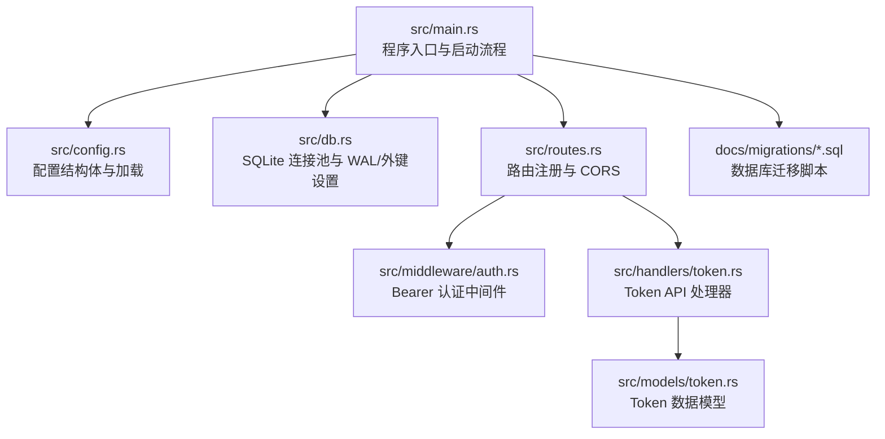
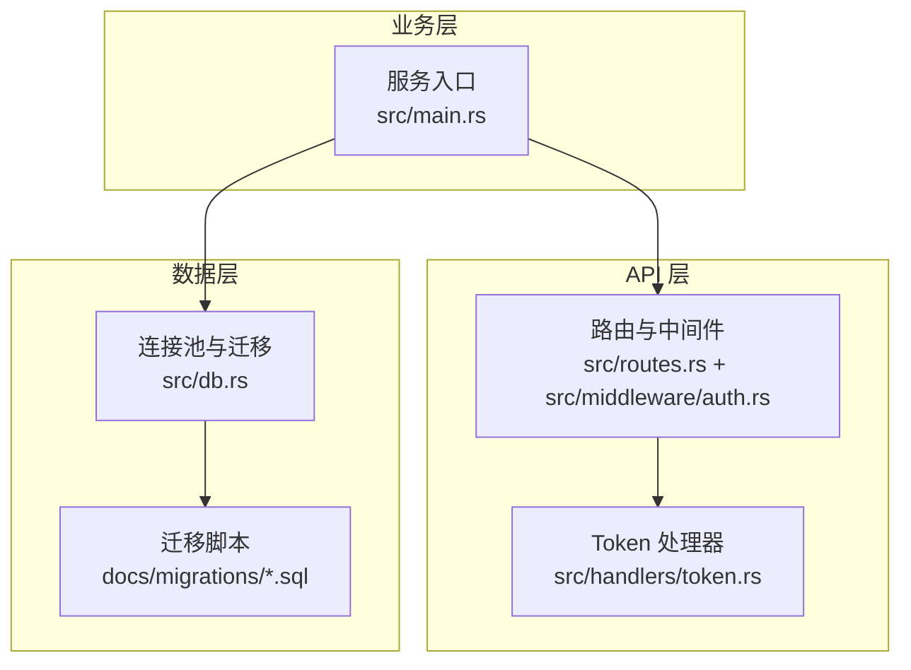
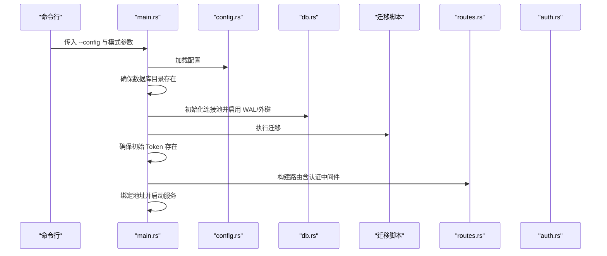
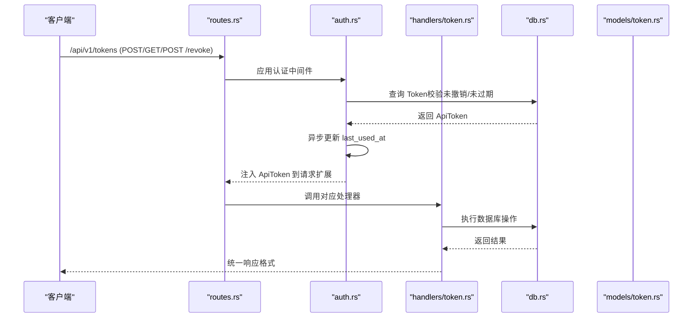
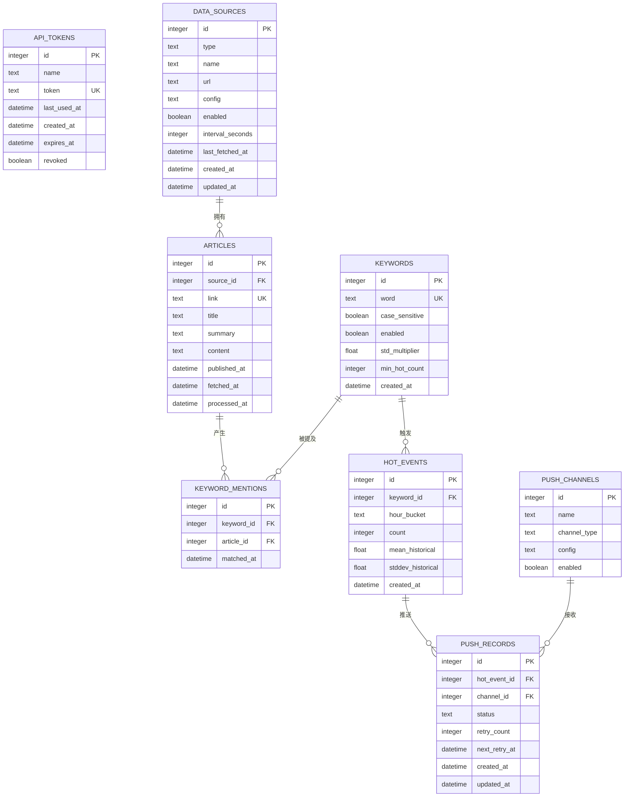
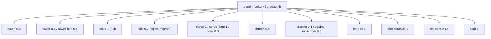

# 快速开始

<cite>
**本文引用的文件**
- [README.md](file://README.md)
- [Cargo.toml](file://Cargo.toml)
- [config.toml](file://config.toml)
- [src/main.rs](file://src/main.rs)
- [src/config.rs](file://src/config.rs)
- [src/db.rs](file://src/db.rs)
- [src/routes.rs](file://src/routes.rs)
- [src/middleware/auth.rs](file://src/middleware/auth.rs)
- [src/handlers/token.rs](file://src/handlers/token.rs)
- [src/models/token.rs](file://src/models/token.rs)
- [docs/migrations/20260607044921_init.sql](file://docs/migrations/20260607044921_init.sql)
- [docs/plans/02-database-migrations.md](file://docs/plans/02-database-migrations.md)
- [docs/apis/token-api.md](file://docs/apis/token-api.md)
</cite>

## 目录
1. [简介](#简介)
2. [项目结构](#项目结构)
3. [核心组件](#核心组件)
4. [架构总览](#架构总览)
5. [详细组件分析](#详细组件分析)
6. [依赖关系分析](#依赖关系分析)
7. [性能注意事项](#性能注意事项)
8. [故障排除指南](#故障排除指南)
9. [结论](#结论)
10. [附录](#附录)

## 简介
本指南面向首次接触 AI-Trend-Tool 的用户，帮助你在约 30 分钟内完成从环境准备到服务启动的全流程。你将学到：
- 如何安装 Rust 工具链与系统依赖
- 如何准备配置文件与数据库
- 如何构建并启动后端服务
- 如何验证服务健康状态与 API 认证
- 常见安装问题的排查方法

## 项目结构
该仓库采用典型的 Rust 项目布局，核心入口在 src/main.rs，配置解析在 src/config.rs，数据库连接与迁移在 src/db.rs，API 路由与认证中间件在 src/routes.rs 与 src/middleware/auth.rs，Token 管理 API 在 src/handlers/token.rs。

图表来源
- [src/main.rs:1-96](file://src/main.rs#L1-L96)
- [src/config.rs:1-59](file://src/config.rs#L1-L59)
- [src/db.rs:1-26](file://src/db.rs#L1-L26)
- [src/routes.rs:1-48](file://src/routes.rs#L1-L48)
- [src/middleware/auth.rs:1-60](file://src/middleware/auth.rs#L1-L60)
- [src/handlers/token.rs:1-66](file://src/handlers/token.rs#L1-L66)
- [src/models/token.rs:1-46](file://src/models/token.rs#L1-L46)
- [docs/migrations/20260607044921_init.sql:1-118](file://docs/migrations/20260607044921_init.sql#L1-L118)

章节来源
- [README.md:216-257](file://README.md#L216-L257)

## 核心组件
- 配置系统：通过 config.toml 加载服务、数据库、认证、采集、过滤、推送等模块的参数。
- 数据库：SQLite，使用 sqlx 连接池，自动执行迁移，启用 WAL 模式与外键约束。
- API 服务：基于 Axum，提供 /health 健康检查与 /api/v1/tokens Token 管理接口，并通过 Bearer Token 认证保护。
- 启动流程：读取配置 → 确保数据库目录存在 → 初始化连接池 → 执行迁移 → 确保初始 Token → 启动 HTTP 服务器。

章节来源
- [src/config.rs:1-59](file://src/config.rs#L1-L59)
- [src/db.rs:1-26](file://src/db.rs#L1-L26)
- [src/routes.rs:1-48](file://src/routes.rs#L1-L48)
- [src/middleware/auth.rs:1-60](file://src/middleware/auth.rs#L1-L60)
- [src/handlers/token.rs:1-66](file://src/handlers/token.rs#L1-L66)
- [src/main.rs:26-96](file://src/main.rs#L26-L96)

## 架构总览
系统采用“管道模式（Pipeline）”，三个后台模块独立运行：Parser（RSS 采集）、Filter（关键词匹配与热点检测）、Pusher（Webhook 推送）。API 服务负责健康检查与 Token 管理，所有 /api/v1/* 路由需要 Bearer Token 认证。

图表来源
- [src/main.rs:63-96](file://src/main.rs#L63-L96)
- [src/routes.rs:14-48](file://src/routes.rs#L14-L48)
- [src/middleware/auth.rs:14-60](file://src/middleware/auth.rs#L14-L60)
- [src/handlers/token.rs:13-66](file://src/handlers/token.rs#L13-L66)
- [src/db.rs:11-26](file://src/db.rs#L11-L26)
- [docs/migrations/20260607044921_init.sql:1-118](file://docs/migrations/20260607044921_init.sql#L1-L118)

## 详细组件分析

### 启动与初始化流程
启动时序展示了从命令行参数到服务监听的关键步骤，包括配置加载、数据库准备、迁移执行与初始 Token 确保。

图表来源
- [src/main.rs:63-96](file://src/main.rs#L63-L96)
- [src/config.rs:52-59](file://src/config.rs#L52-L59)
- [src/db.rs:11-26](file://src/db.rs#L11-L26)
- [src/routes.rs:14-48](file://src/routes.rs#L14-L48)
- [src/middleware/auth.rs:14-60](file://src/middleware/auth.rs#L14-L60)

章节来源
- [src/main.rs:26-96](file://src/main.rs#L26-L96)

### 认证中间件与 Token API
认证中间件从 Authorization 头提取 Bearer Token，查询数据库校验有效性与过期时间，更新最近使用时间，并将令牌信息注入请求上下文。Token API 提供创建、列表与撤销接口。

图表来源
- [src/routes.rs:20-36](file://src/routes.rs#L20-L36)
- [src/middleware/auth.rs:14-60](file://src/middleware/auth.rs#L14-L60)
- [src/handlers/token.rs:13-66](file://src/handlers/token.rs#L13-L66)
- [src/models/token.rs:5-46](file://src/models/token.rs#L5-L46)

章节来源
- [src/middleware/auth.rs:14-60](file://src/middleware/auth.rs#L14-L60)
- [src/handlers/token.rs:13-66](file://src/handlers/token.rs#L13-L66)
- [src/models/token.rs:5-46](file://src/models/token.rs#L5-L46)

### 数据库初始化与表结构
首次启动会自动执行迁移脚本，创建以下核心表：api_tokens、data_sources、articles、keywords、keyword_mentions、hot_events、push_channels、push_records，并建立必要的索引。

图表来源
- [docs/migrations/20260607044921_init.sql:1-118](file://docs/migrations/20260607044921_init.sql#L1-L118)

章节来源
- [docs/migrations/20260607044921_init.sql:1-118](file://docs/migrations/20260607044921_init.sql#L1-L118)
- [docs/plans/02-database-migrations.md:16-145](file://docs/plans/02-database-migrations.md#L16-L145)

## 依赖关系分析
项目依赖以 Rust 生态为主，关键依赖包括：
- Web 框架：Axum 0.8、Tower、Tokio
- 数据库：sqlx 0.7（SQLite、迁移）
- 序列化：serde、serde_json、toml
- 时间：chrono
- 日志：tracing、tracing-subscriber
- RSS 解析：feed-rs
- 字符串匹配：aho-corasick
- HTTP 客户端：reqwest
- CLI：clap 4

图表来源
- [Cargo.toml:6-44](file://Cargo.toml#L6-L44)

章节来源
- [Cargo.toml:1-44](file://Cargo.toml#L1-L44)

## 性能注意事项
- 数据库连接池：最大连接数为 5，适用于中小规模部署；如需更高吞吐，可在生产环境中调整连接池大小与数据库参数。
- WAL 模式与外键：启用 WAL 提升并发读写性能，开启外键约束保证数据一致性。
- 迁移执行：首次启动自动执行，建议在生产环境预执行以减少冷启动时间。
- 日志级别：默认 info 级别，可通过环境变量调整日志过滤。

章节来源
- [src/db.rs:11-26](file://src/db.rs#L11-L26)
- [src/main.rs:63-96](file://src/main.rs#L63-L96)

## 故障排除指南
- 无法找到 Rust 工具链
  - 确认已安装 Rust 1.75+，并使用稳定通道。
  - 使用包管理器或官方安装脚本进行安装。
- 无法连接 SQLite 或迁移失败
  - 确认数据库路径存在且可写；首次启动会自动创建目录。
  - 检查迁移脚本是否存在且可读。
- Token 认证失败
  - 确认使用正确的 Bearer Token（从日志或 /api/v1/tokens 获取）。
  - 检查 Token 是否已撤销或过期。
- 服务无法启动或端口占用
  - 修改 config.toml 中的 server.host 与 server.port，避免冲突。
  - 确认防火墙允许相应端口访问。

章节来源
- [src/main.rs:70-80](file://src/main.rs#L70-L80)
- [src/middleware/auth.rs:36-47](file://src/middleware/auth.rs#L36-L47)
- [config.toml:1-27](file://config.toml#L1-L27)

## 结论
通过本指南，你已经完成了环境准备、配置与数据库初始化、服务启动与基本验证。后续可继续实现 Parser、Filter、Pusher 三大后台模块以及 CRUD API 与前端界面，逐步完善整套热点监控系统。

## 附录

### 安装与运行步骤（30 分钟速通）
- 安装前置依赖
  - Rust 工具链（1.75+）
  - SQLite 3
- 克隆并构建
  - 克隆仓库并进入目录
  - 使用 cargo 构建发布版本
- 准备配置
  - 复制默认配置文件并根据需要修改
- 初始化数据库
  - 首次启动会自动执行迁移，创建所有表
- 启动服务
  - 运行全部模块或仅启动 API 服务
- 验证健康状态
  - 调用 /health 检查服务状态
- 获取初始 Token
  - 首次启动会在日志中打印初始管理员 Token

章节来源
- [README.md:38-90](file://README.md#L38-L90)
- [src/main.rs:26-96](file://src/main.rs#L26-L96)

### 配置文件说明（config.toml）
- server：监听地址与端口
- database：SQLite 数据库路径
- auth：初始管理员 Token（可选）
- parser：RSS 采集并发、默认 UA 与超时
- filter：批量处理、过滤间隔、历史窗口与最小历史数据
- pusher：推送轮询间隔、最大重试次数与退避基础秒数

章节来源
- [config.toml:1-27](file://config.toml#L1-L27)
- [src/config.rs:4-51](file://src/config.rs#L4-L51)

### API 接口速查
- 健康检查：GET /health
- 认证：Authorization: Bearer <token>
- Token 管理：
  - POST /api/v1/tokens：创建 Token（明文仅返回一次）
  - GET /api/v1/tokens：列出 Token（隐藏明文）
  - POST /api/v1/tokens/revoke/{id}：撤销 Token

章节来源
- [README.md:123-194](file://README.md#L123-L194)
- [docs/apis/token-api.md:40-198](file://docs/apis/token-api.md#L40-L198)