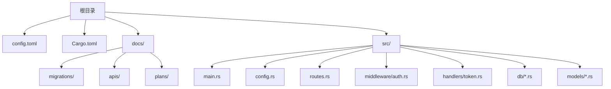
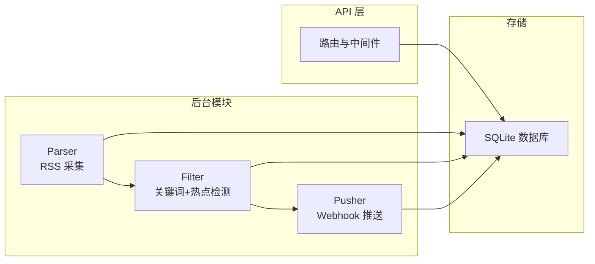
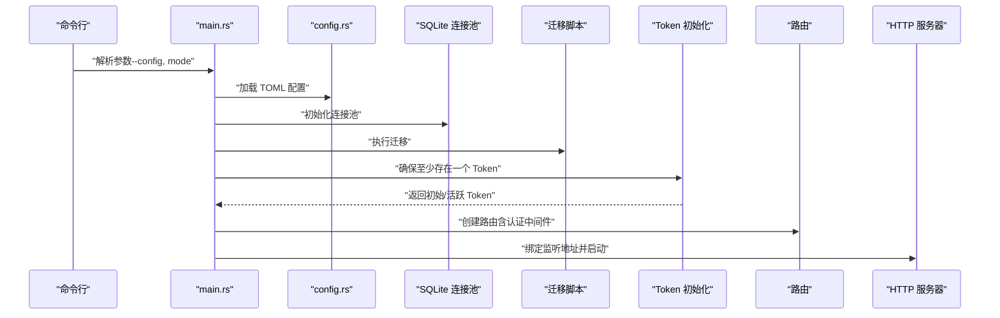

# 快速开始

<cite>
**本文引用的文件**
- [README.md](file://README.md)
- [Cargo.toml](file://Cargo.toml)
- [config.toml](file://config.toml)
- [src/main.rs](file://src/main.rs)
- [src/config.rs](file://src/config.rs)
- [src/routes.rs](file://src/routes.rs)
- [src/middleware/auth.rs](file://src/middleware/auth.rs)
- [src/handlers/token.rs](file://src/handlers/token.rs)
- [docs/migrations/20260607044921_init.sql](file://docs/migrations/20260607044921_init.sql)
- [docs/plans/05-query-apis-and-background-modules.md](file://docs/plans/05-query-apis-and-background-modules.md)
</cite>

## 目录
1. [简介](#简介)
2. [项目结构](#项目结构)
3. [核心组件](#核心组件)
4. [架构总览](#架构总览)
5. [详细组件分析](#详细组件分析)
6. [依赖关系分析](#依赖关系分析)
7. [性能考虑](#性能考虑)
8. [故障排查指南](#故障排查指南)
9. [结论](#结论)
10. [附录](#附录)

## 简介
本指南面向首次部署与运行 AI 趋势监控系统（TrendAITool）的用户，目标是帮助你在最短时间内完成环境准备、项目构建、配置与数据库初始化，并掌握多种运行模式与初始 Token 的生成与安全注意事项。系统采用 Rust 语言开发，基于 Axum Web 框架与 SQLite 数据库存储，支持后台采集、过滤与推送三大模块的独立或组合运行。

## 项目结构
- 顶层提供配置文件、迁移脚本、API 设计与实施计划等文档。
- 源码位于 src/ 目录，包含入口、配置解析、路由、中间件、处理器与数据库模型/操作等模块。
- 默认配置文件 config.toml 提供服务器、数据库、认证与各模块运行参数的设置项。

章节来源
- [README.md: 216-257:216-257](file://README.md#L216-L257)

## 核心组件
- 入口与 CLI：解析命令行参数（配置文件路径与运行模式），初始化日志、数据库连接池、迁移与初始 Token，并启动 HTTP 服务。
- 配置系统：从 TOML 文件加载服务器、数据库、认证与各模块参数。
- 路由与中间件：注册 API 路由并应用认证中间件；提供健康检查端点。
- 认证与 Token：支持创建、列举与撤销 Token；首次启动可自动生成初始管理员 Token。
- 数据库与迁移：首次启动自动执行迁移脚本，创建所有表结构与索引。

章节来源
- [src/main.rs: 16-96:16-96](file://src/main.rs#L16-L96)
- [src/config.rs: 4-59:4-59](file://src/config.rs#L4-L59)
- [src/routes.rs: 14-61:14-61](file://src/routes.rs#L14-L61)
- [src/middleware/auth.rs: 14-60:14-60](file://src/middleware/auth.rs#L14-L60)
- [src/handlers/token.rs: 13-66:13-66](file://src/handlers/token.rs#L13-L66)
- [docs/migrations/20260607044921_init.sql: 1-118:1-118](file://docs/migrations/20260607044921_init.sql#L1-L118)

## 架构总览
系统采用“管道模式（Pipeline）”，三个后台模块可独立运行：
- Parser：按配置周期拉取 RSS，去重写入文章表。
- Filter：每 5 分钟运行，关键词匹配与统计突发检测，生成热点事件与待推送记录。
- Pusher：每 10 秒轮询待推送记录，指数退避重试并乐观锁防重复。

章节来源
- [README.md: 7-24:7-24](file://README.md#L7-L24)
- [docs/plans/05-query-apis-and-background-modules.md: 741-959:741-959](file://docs/plans/05-query-apis-and-background-modules.md#L741-L959)

## 详细组件分析

### 环境与前置要求
- Rust 工具链（版本 1.75+）
- SQLite 3
- 项目使用 Cargo 管理依赖与构建

章节来源
- [README.md: 40-44:40-44](file://README.md#L40-L44)
- [Cargo.toml: 1-44:1-44](file://Cargo.toml#L1-L44)

### 构建与运行
- 克隆仓库后，在项目根目录执行构建与运行命令，支持多种运行模式：
  - 全部模块：hotspot all
  - 仅 API 服务：hotspot api
  - 仅采集模块：hotspot parser
  - 仅过滤模块：hotspot filter
  - 仅推送模块：hotspot pusher

章节来源
- [README.md: 45-72:45-72](file://README.md#L45-L72)
- [docs/plans/05-query-apis-and-background-modules.md: 921-959:921-959](file://docs/plans/05-query-apis-and-background-modules.md#L921-L959)

### 配置文件编辑
- 默认配置文件路径：config.toml
- 关键配置项：
  - [server]：host、port
  - [database]：path（SQLite 数据库文件路径）
  - [auth]：initial_token（可选，用于首次启动时的初始管理员 Token）
  - [parser]：max_concurrent_fetches、default_user_agent、default_timeout_seconds
  - [filter]：batch_size、interval_seconds、history_hours、min_history_hours
  - [pusher]：interval_seconds、max_retries、retry_base_seconds

章节来源
- [config.toml: 1-27:1-27](file://config.toml#L1-L27)
- [src/config.rs: 4-59:4-59](file://src/config.rs#L4-L59)

### 数据库初始化
- 首次启动会自动执行迁移脚本，创建以下表与索引：
  - api_tokens：Token 表（含名称、唯一 token、最后使用时间、创建/过期/撤销状态）
  - data_sources：数据源配置（类型、名称、URL、间隔、启用状态等）
  - articles：采集文章（来源、链接唯一、标题摘要内容、发布时间、抓取与处理时间）
  - keywords：关键词及其阈值参数
  - keyword_mentions：关键词命中明细
  - hot_events：热点事件（关键词、小时桶、历史均值与标准差）
  - push_channels：推送渠道（名称、类型、配置 JSON）
  - push_records：推送记录（状态、重试计数、下次重试时间）

章节来源
- [docs/migrations/20260607044921_init.sql: 1-118:1-118](file://docs/migrations/20260607044921_init.sql#L1-L118)

### 初始 Token 生成机制与安全注意事项
- 首次启动时，若 api_tokens 表为空：
  - 若配置了 auth.initial_token，则直接使用该值作为初始管理员 Token；
  - 若未配置，则自动生成 64 位随机十六进制字符串作为初始 Token；
- 系统会在日志中以警告级别打印初始 Token，请务必保存并妥善管理；
- 之后每次启动都会打印当前有效的活跃 Token（若存在）；
- 建议：
  - 在生产环境中显式配置 auth.initial_token 并替换为强随机 Token；
  - 仅在受信网络内暴露 API 端口，开启防火墙与反向代理；
  - 定期轮换 Token，及时撤销不再使用的 Token。

章节来源
- [src/main.rs: 26-61:26-61](file://src/main.rs#L26-L61)
- [README.md: 78-89:78-89](file://README.md#L78-L89)

### API 与认证
- 除 /health 外，所有 /api/v1/* 路由均需 Bearer Token 认证；
- 认证中间件流程：提取 Authorization 头 → 校验 Token 是否存在且未撤销 → 检查是否过期 → 异步更新 last_used_at → 注入请求上下文；
- Token 管理 API：
  - POST /api/v1/tokens：创建新 Token（返回明文一次）
  - GET /api/v1/tokens：列出所有 Token（不返回明文）
  - POST /api/v1/tokens/revoke/{id}：撤销 Token（软删除）

章节来源
- [README.md: 123-142:123-142](file://README.md#L123-L142)
- [src/middleware/auth.rs: 14-60:14-60](file://src/middleware/auth.rs#L14-L60)
- [src/handlers/token.rs: 13-66:13-66](file://src/handlers/token.rs#L13-L66)

### 后台模块运行与控制
- 支持的模式：
  - all：启动 API 服务并运行全部后台模块
  - api：仅启动 API 服务（仍可运行后台模块）
  - parser：仅运行采集模块
  - filter：仅运行过滤模块
  - pusher：仅运行推送模块
- 各模块运行周期与职责：
  - Parser：按数据源各自间隔抓取 RSS
  - Filter：每 5 分钟运行，关键词匹配与统计突发检测
  - Pusher：每 10 秒轮询待推送记录，指数退避重试

章节来源
- [README.md: 17-23:17-23](file://README.md#L17-L23)
- [docs/plans/05-query-apis-and-background-modules.md: 741-959:741-959](file://docs/plans/05-query-apis-and-background-modules.md#L741-L959)

### 启动流程时序图（代码级）

图表来源
- [src/main.rs: 63-96:63-96](file://src/main.rs#L63-L96)
- [src/config.rs: 52-59:52-59](file://src/config.rs#L52-L59)
- [docs/migrations/20260607044921_init.sql: 1-118:1-118](file://docs/migrations/20260607044921_init.sql#L1-L118)

## 依赖关系分析
- 语言与框架：Rust（2021 版）、Axum、Tokio、Tower、sqlx（SQLite）
- 序列化：serde、serde_json、toml
- 时间与时序：chrono
- 日志：tracing、tracing-subscriber
- 其他：feed-rs（RSS 解析）、aho-corasick（多模式匹配）、reqwest（HTTP/Webhook）

章节来源
- [Cargo.toml: 6-44:6-44](file://Cargo.toml#L6-L44)

## 性能考虑
- 数据库：SQLite 采用 WAL 模式与外键约束，适合中小规模数据；建议在生产环境评估磁盘 I/O 与并发写入压力。
- 并发与批处理：Parser 的并发抓取数、Filter 的批量处理大小与历史窗口会影响资源占用与延迟。
- 网络与重试：Pusher 的轮询间隔与指数退避参数需结合下游 Webhook 服务能力进行调优。
- 日志与观测：使用 tracing 输出关键事件，便于定位瓶颈与异常。

## 故障排查指南
- 无法启动或端口占用
  - 检查 server.host 与 server.port 设置，确认端口未被占用。
  - 参考：[config.toml: 1-11:1-11](file://config.toml#L1-L11)
- 数据库文件权限或路径问题
  - 确认 database.path 指向的目录存在且具备读写权限；首次启动会自动创建目录。
  - 参考：[src/main.rs: 70-75:70-75](file://src/main.rs#L70-L75)
- 初次启动无初始 Token
  - 若 api_tokens 表为空，系统会自动生成初始 Token 并以警告级别输出；请保存该 Token。
  - 参考：[src/main.rs: 26-61:26-61](file://src/main.rs#L26-L61)
- 认证失败（401）
  - 确认请求头 Authorization: Bearer <token> 是否正确；检查 Token 是否撤销或过期。
  - 参考：[src/middleware/auth.rs: 14-60:14-60](file://src/middleware/auth.rs#L14-L60)
- API 返回统一错误格式
  - 所有错误响应包含 error.code 与 error.message；常见错误码包括 UNAUTHORIZED、NOT_FOUND、DATABASE_ERROR 等。
  - 参考：[README.md: 173-194:173-194](file://README.md#L173-L194)
- 后台模块未运行
  - 确认运行模式参数是否正确（all、api、parser、filter、pusher）；不同模式下后台模块的启动行为不同。
  - 参考：[docs/plans/05-query-apis-and-background-modules.md: 921-959:921-959](file://docs/plans/05-query-apis-and-background-modules.md#L921-L959)

## 结论
通过本快速开始指南，你已完成环境准备、项目构建、配置与数据库初始化，并掌握了多种运行模式与初始 Token 的生成与安全注意事项。建议在本地验证健康检查与 Token 管理 API 后，逐步添加数据源与关键词，再接入 Webhook 渠道进行推送测试。

## 附录

### 常用命令示例
- 克隆与构建
  - cargo build --release
- 运行模式
  - hotspot all
  - hotspot api
  - hotspot parser
  - hotspot filter
  - hotspot pusher

章节来源
- [README.md: 45-72:45-72](file://README.md#L45-L72)

### 验证系统是否正常运行
- 健康检查
  - curl http://localhost:8080/health
- Token 管理
  - 创建 Token：POST /api/v1/tokens（返回明文一次）
  - 列举 Token：GET /api/v1/tokens
  - 撤销 Token：POST /api/v1/tokens/revoke/{id}

章节来源
- [README.md: 123-165:123-165](file://README.md#L123-L165)