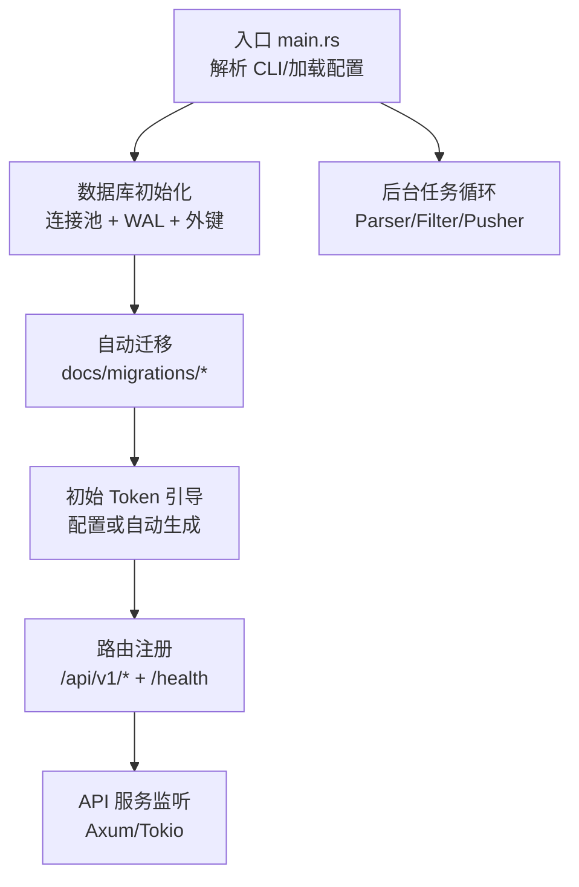
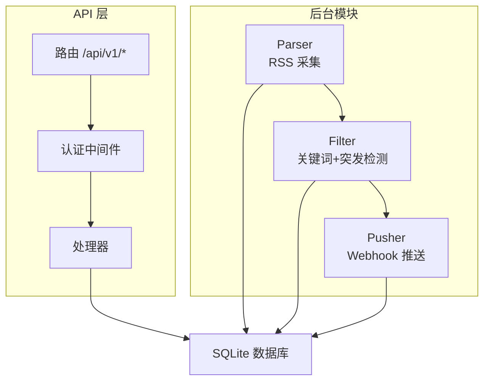
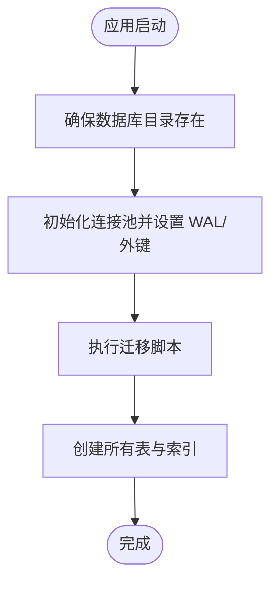
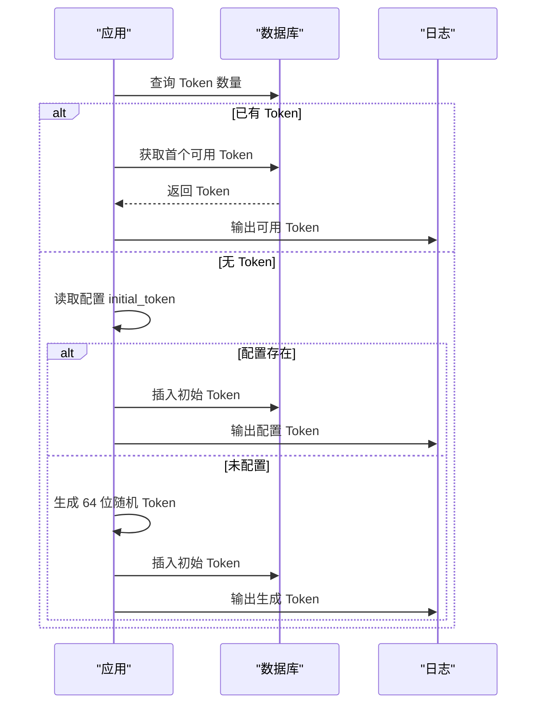
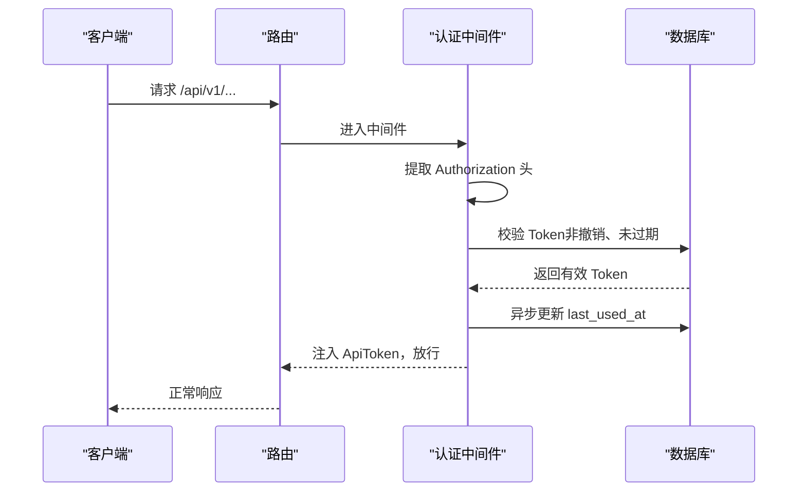
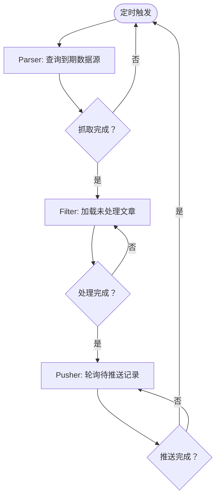
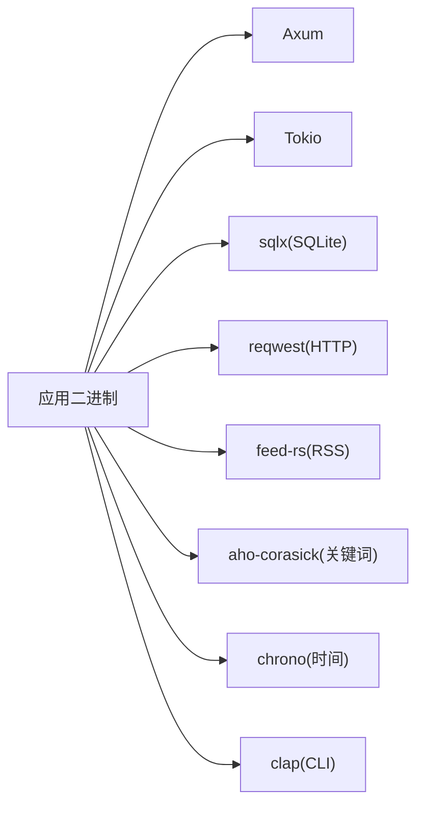

# 快速开始

<cite>
**本文引用的文件**
- [README.md](file://README.md)
- [Cargo.toml](file://Cargo.toml)
- [config.toml](file://config.toml)
- [src/main.rs](file://src/main.rs)
- [src/config.rs](file://src/config.rs)
- [src/db.rs](file://src/db.rs)
- [src/db/token.rs](file://src/db/token.rs)
- [docs/migrations/20260607044921_init.sql](file://docs/migrations/20260607044921_init.sql)
- [src/services/parser.rs](file://src/services/parser.rs)
- [src/services/filter.rs](file://src/services/filter.rs)
- [src/services/pusher.rs](file://src/services/pusher.rs)
- [src/routes.rs](file://src/routes.rs)
- [src/middleware/auth.rs](file://src/middleware/auth.rs)
</cite>

## 目录
1. [简介](#简介)
2. [项目结构](#项目结构)
3. [核心组件](#核心组件)
4. [架构总览](#架构总览)
5. [详细组件分析](#详细组件分析)
6. [依赖关系分析](#依赖关系分析)
7. [性能考虑](#性能考虑)
8. [故障排查指南](#故障排查指南)
9. [结论](#结论)
10. [附录](#附录)

## 简介
本指南面向首次部署 AI 趋势监控系统的新用户，帮助你在约 30 分钟内完成环境准备、构建运行、数据库初始化、初始 Token 生成与使用，并进行基本功能验证。系统采用 Rust 语言与 Axum 框架，后端数据库为 SQLite，支持多模块并行运行（API、Parser、Filter、Pusher）。

## 项目结构
- 顶层配置与文档：
  - 配置文件：config.toml
  - 数据库迁移：docs/migrations/20260607044921_init.sql
  - 项目说明：README.md
- 源代码组织：
  - 入口与 CLI：src/main.rs
  - 配置解析：src/config.rs
  - 数据库连接与迁移：src/db.rs
  - Token 数据访问：src/db/token.rs
  - 业务模块：src/services/parser.rs、src/services/filter.rs、src/services/pusher.rs
  - 路由与认证：src/routes.rs、src/middleware/auth.rs

图表来源
- [src/main.rs:64-164](file://src/main.rs#L64-L164)
- [src/db.rs:12-27](file://src/db.rs#L12-L27)
- [docs/migrations/20260607044921_init.sql:1-118](file://docs/migrations/20260607044921_init.sql#L1-L118)
- [src/routes.rs:14-63](file://src/routes.rs#L14-L63)

章节来源
- [README.md:38-72](file://README.md#L38-L72)
- [src/main.rs:64-164](file://src/main.rs#L64-L164)
- [src/db.rs:12-27](file://src/db.rs#L12-L27)
- [docs/migrations/20260607044921_init.sql:1-118](file://docs/migrations/20260607044921_init.sql#L1-L118)
- [src/routes.rs:14-63](file://src/routes.rs#L14-L63)

## 核心组件
- CLI 与运行模式
  - 支持模式：all、api、parser、filter、pusher
  - 默认模式为 all，同时启动 API 服务与三个后台模块
- 配置系统
  - TOML 配置文件，包含 server、database、auth、parser、filter、pusher 等段落
- 数据库
  - SQLite 连接池，启用 WAL 模式与外键约束
  - 自动迁移，首次启动时执行
- 认证与 Token
  - Bearer Token 中间件，支持过期与撤销
  - 首次启动时自动创建初始管理员 Token（可配置或自动生成）

章节来源
- [src/main.rs:17-25](file://src/main.rs#L17-L25)
- [src/main.rs:87-160](file://src/main.rs#L87-L160)
- [src/config.rs:51-57](file://src/config.rs#L51-L57)
- [src/db.rs:12-27](file://src/db.rs#L12-L27)
- [src/middleware/auth.rs:18-57](file://src/middleware/auth.rs#L18-L57)

## 架构总览
系统采用“管道模式”，三个后台模块独立运行：
- Parser：按配置周期拉取 RSS，去重写入文章表
- Filter：关键词匹配 + 统计突发检测，生成热点事件与推送记录
- Pusher：轮询待推送记录，指数退避重试，POST Webhook

图表来源
- [README.md:7-23](file://README.md#L7-L23)
- [src/services/parser.rs:94-184](file://src/services/parser.rs#L94-L184)
- [src/services/filter.rs:269-276](file://src/services/filter.rs#L269-L276)
- [src/services/pusher.rs:251-258](file://src/services/pusher.rs#L251-L258)
- [src/routes.rs:20-53](file://src/routes.rs#L20-L53)

## 详细组件分析

### 前置要求与安装步骤
- 前置要求
  - Rust 工具链 1.75 或更高版本
  - 系统已安装 SQLite3（用于 sqlx 的 sqlite 功能）
- 安装与构建
  - 克隆仓库后，使用 cargo 构建发布版本
  - 编辑配置文件（按需修改）
  - 运行全部模块或按需选择模块
- 常用命令
  - 构建：cargo build --release
  - 运行全部模块：cargo run -- --config config.toml all
  - 仅运行 API：cargo run -- --config config.toml api
  - 仅运行 Parser/Filter/Pusher：分别传入对应模式

章节来源
- [README.md:40-72](file://README.md#L40-L72)
- [Cargo.toml:1-67](file://Cargo.toml#L1-L67)

### 数据库初始化与自动迁移
- 初始化流程
  - 启动时创建数据库目录（如不存在）
  - 初始化 SQLite 连接池，启用 WAL 模式与外键约束
  - 执行 docs/migrations 下的迁移脚本，创建所有表
- 迁移脚本内容
  - 包含 api_tokens、data_sources、articles、keywords、hot_events、push_channels、push_records 等表
  - 建立必要的索引与外键约束

图表来源
- [src/main.rs:71-81](file://src/main.rs#L71-L81)
- [src/db.rs:12-27](file://src/db.rs#L12-L27)
- [docs/migrations/20260607044921_init.sql:1-118](file://docs/migrations/20260607044921_init.sql#L1-L118)

章节来源
- [src/main.rs:71-81](file://src/main.rs#L71-L81)
- [src/db.rs:12-27](file://src/db.rs#L12-L27)
- [docs/migrations/20260607044921_init.sql:1-118](file://docs/migrations/20260607044921_init.sql#L1-L118)

### 初始 Token 的生成与使用
- 生成策略
  - 若数据库中已有 Token，则打印首个可用 Token（便于复制）
  - 若为空，优先使用配置项中的 initial_token；若未配置则自动生成 64 位十六进制字符串
  - 首次启动会以警告级别输出初始 Token，请妥善保存
- 使用方法
  - 对除 /health 外的所有 /api/v1/* 路由，均需在 Authorization 头中携带 Bearer Token
  - 可通过 Token 管理 API 创建、列出、撤销 Token

图表来源
- [src/main.rs:27-62](file://src/main.rs#L27-L62)
- [src/db/token.rs:63-90](file://src/db/token.rs#L63-L90)

章节来源
- [README.md:78-89](file://README.md#L78-L89)
- [src/main.rs:27-62](file://src/main.rs#L27-L62)
- [src/db/token.rs:63-90](file://src/db/token.rs#L63-L90)

### API 与认证流程
- 路由与中间件
  - /health 健康检查无需认证
  - /api/v1/* 路由均受认证中间件保护
  - 认证中间件从 Authorization 头提取 Bearer Token，校验有效性、撤销状态与过期时间
  - 成功后注入 ApiToken 至请求扩展，后台异步更新 last_used_at
- Token 管理 API
  - 创建 Token（返回明文，仅一次）
  - 列出 Token（不返回明文）
  - 撤销 Token（软删除）

图表来源
- [src/routes.rs:20-53](file://src/routes.rs#L20-L53)
- [src/middleware/auth.rs:18-57](file://src/middleware/auth.rs#L18-L57)
- [src/db/token.rs:37-53](file://src/db/token.rs#L37-L53)

章节来源
- [README.md:123-194](file://README.md#L123-L194)
- [src/routes.rs:20-53](file://src/routes.rs#L20-L53)
- [src/middleware/auth.rs:18-57](file://src/middleware/auth.rs#L18-L57)

### 后台模块运行方式
- Parser 模块
  - 每 30 秒查询到期的数据源，按配置并发限制抓取 RSS
  - 成功插入文章并更新最后抓取时间
- Filter 模块
  - 每 5 分钟运行一次，批量处理未处理文章
  - Aho-Corasick 多模式匹配，小时桶统计，突发检测，生成热点事件与推送记录
- Pusher 模块
  - 每 10 秒轮询待推送记录，POST Webhook
  - 指数退避重试（最多 3 次），乐观锁防重复

图表来源
- [src/services/parser.rs:94-184](file://src/services/parser.rs#L94-L184)
- [src/services/filter.rs:269-276](file://src/services/filter.rs#L269-L276)
- [src/services/pusher.rs:251-258](file://src/services/pusher.rs#L251-L258)

章节来源
- [README.md:17-23](file://README.md#L17-L23)
- [src/services/parser.rs:94-184](file://src/services/parser.rs#L94-L184)
- [src/services/filter.rs:269-276](file://src/services/filter.rs#L269-L276)
- [src/services/pusher.rs:251-258](file://src/services/pusher.rs#L251-L258)

## 依赖关系分析
- 语言与框架
  - Rust 1.75+、Tokio、Axum、Tower、sqlx、chrono、reqwest、feed-rs、aho-corasick、clap
- 配置与构建
  - 通过 Cargo.toml 管理依赖与编译配置（Release 优化、符号裁剪等）
- 运行时依赖
  - SQLite3（sqlx sqlite runtime）
  - 日志与环境变量过滤（tracing/tracing-subscriber）

图表来源
- [Cargo.toml:6-46](file://Cargo.toml#L6-L46)

章节来源
- [Cargo.toml:1-67](file://Cargo.toml#L1-L67)

## 性能考虑
- 发布构建优化
  - Release 配置启用 LTO、单代码单元、符号剥离、panic abort，提升运行性能并减小二进制体积
- 数据库性能
  - WAL 模式提升并发读写性能
  - 外键约束保障数据一致性
- 并发与限流
  - Parser 使用信号量控制最大并发抓取
  - Filter/Parser/Pusher 采用独立循环，避免阻塞
- 网络与重试
  - Pusher 指数退避与乐观锁，降低重复推送风险

章节来源
- [Cargo.toml:48-56](file://Cargo.toml#L48-L56)
- [src/db.rs:19-23](file://src/db.rs#L19-L23)
- [src/services/parser.rs:96](file://src/services/parser.rs#L96)
- [src/services/pusher.rs:207-242](file://src/services/pusher.rs#L207-L242)

## 故障排查指南
- 构建失败（Rust 版本过低）
  - 现象：编译报错，提示最低版本不满足
  - 处理：升级 Rust 到 1.75+（使用 rustup）
- 数据库无法连接（SQLite3 未安装）
  - 现象：启动时报 sqlite 相关错误
  - 处理：安装系统级 SQLite3 开发包（如 sqlite3-dev 或相应包）
- 数据库迁移失败
  - 现象：首次启动无表或迁移异常
  - 处理：确认 docs/migrations 目录存在且可读；检查数据库路径权限
- Token 无效或过期
  - 现象：API 返回 401
  - 处理：使用 /api/v1/tokens 创建新 Token；或检查 Token 是否撤销/过期
- Parser 抓取失败
  - 现象：日志出现抓取错误
  - 处理：检查网络连通性、User-Agent、超时设置；确认数据源 URL 可达
- Pusher 推送失败
  - 现象：日志显示失败或重试
  - 处理：检查 Webhook URL、网络连通性；查看指数退避后的重试情况

章节来源
- [src/main.rs:71-81](file://src/main.rs#L71-L81)
- [src/middleware/auth.rs:34-44](file://src/middleware/auth.rs#L34-L44)
- [src/services/parser.rs:101-111](file://src/services/parser.rs#L101-L111)
- [src/services/pusher.rs:13-19](file://src/services/pusher.rs#L13-L19)

## 结论
通过本快速开始指南，你可以在 30 分钟内完成环境准备、构建运行、数据库初始化与初始 Token 设置，并验证健康检查与基本 API 访问。建议后续继续完善数据源、关键词与推送渠道配置，逐步上线 Parser/Filter/Pusher 三大模块，实现完整的趋势监控闭环。

## 附录

### 常用命令与预期行为
- 构建
  - cargo build --release
  - 产物位于 target/release/hotspot（Windows 下为 hotspot.exe）
- 运行
  - cargo run -- --config config.toml all
  - 启动 API 服务并后台运行 Parser/Filter/Pusher
- 健康检查
  - curl http://localhost:8080/health
  - 预期输出：{"status":"ok"}

章节来源
- [README.md:45-72](file://README.md#L45-L72)
- [src/routes.rs:61-63](file://src/routes.rs#L61-L63)

### 配置文件要点
- server：host、port
- database：path（SQLite 文件路径）
- auth：initial_token（可选）
- parser：max_concurrent_fetches、default_user_agent、default_timeout_seconds
- filter：batch_size、interval_seconds、history_hours、min_history_hours
- pusher：interval_seconds、max_retries、retry_base_seconds

章节来源
- [config.toml:1-27](file://config.toml#L1-L27)
- [src/config.rs:3-49](file://src/config.rs#L3-L49)