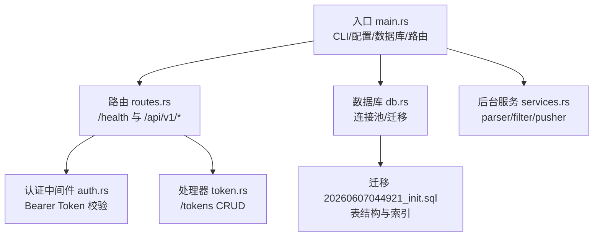
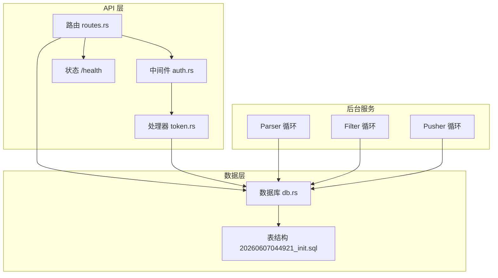
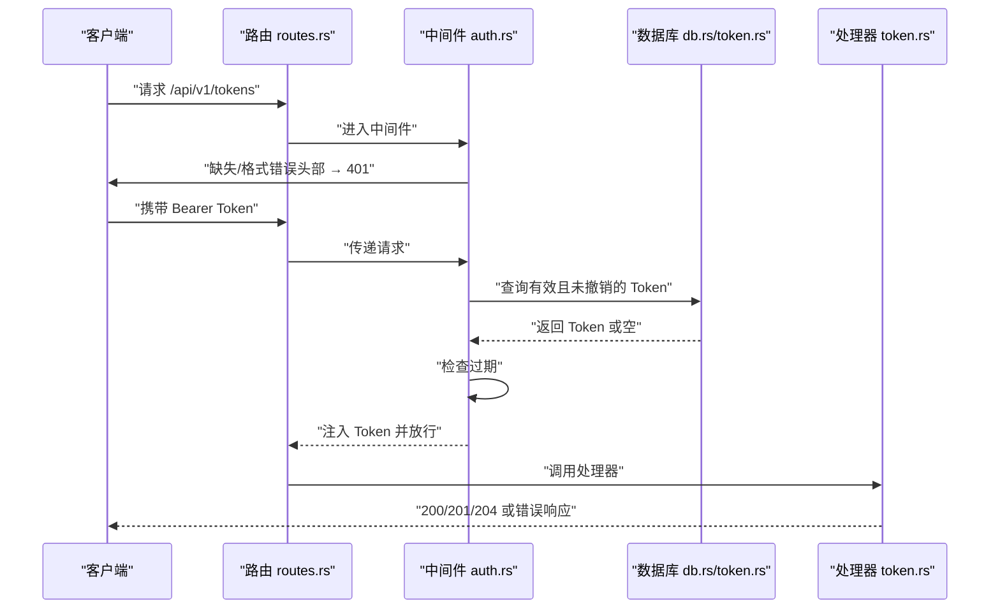
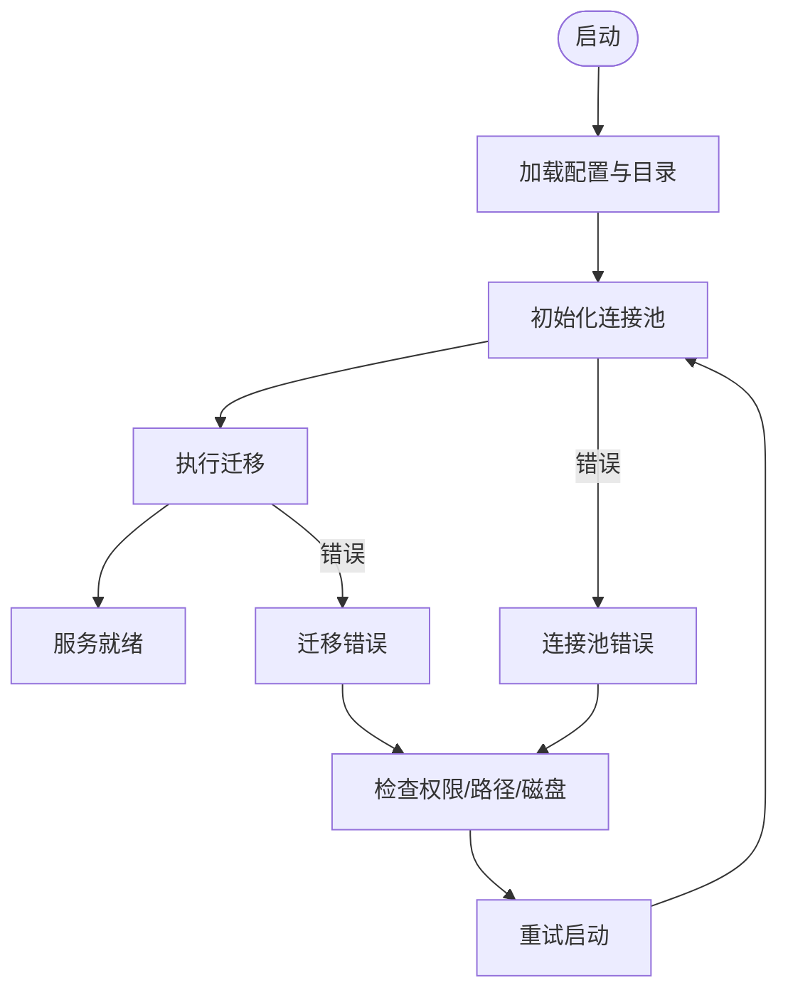
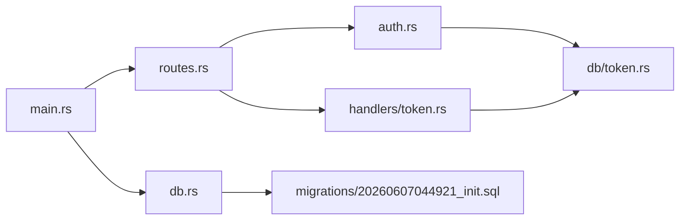

# 故障排除

<cite>
**本文引用的文件**
- [README.md](file://README.md)
- [main.rs](file://src/main.rs)
- [error.rs](file://src/error.rs)
- [config.rs](file://src/config.rs)
- [config.toml](file://config.toml)
- [db.rs](file://src/db.rs)
- [auth.rs](file://src/middleware/auth.rs)
- [routes.rs](file://src/routes.rs)
- [token.rs（处理器）](file://src/handlers/token.rs)
- [token.rs（数据库操作）](file://src/db/token.rs)
- [20260607044921_init.sql](file://docs/migrations/20260607044921_init.sql)
- [services.rs](file://src/services.rs)
- [05-query-apis-and-background-modules.md](file://docs/plans/05-query-apis-and-background-modules.md)
</cite>

## 目录
1. [简介](#简介)
2. [项目结构](#项目结构)
3. [核心组件](#核心组件)
4. [架构总览](#架构总览)
5. [详细组件分析](#详细组件分析)
6. [依赖分析](#依赖分析)
7. [性能考虑](#性能考虑)
8. [故障排除指南](#故障排除指南)
9. [结论](#结论)
10. [附录](#附录)

## 简介
本指南面向运维与开发人员，系统化梳理 AI-Trend-Tool 的常见问题与排障方法，覆盖启动失败、数据库连接问题、API 错误、性能瓶颈、网络连接问题、权限配置错误与资源限制等场景，并提供日志分析技巧、错误码含义、修复步骤、性能监控指标与优化建议，以及问题报告与反馈机制。

## 项目结构
系统采用模块化组织，入口负责 CLI、配置加载、数据库初始化与路由装配；中间件负责认证；处理器提供 Token 管理 API；数据库层封装连接池与迁移；后台服务模块（Parser/Filter/Pusher）按需运行。



图表来源
- [main.rs:63-96](file://src/main.rs#L63-L96)
- [routes.rs:14-48](file://src/routes.rs#L14-L48)
- [auth.rs:18-60](file://src/middleware/auth.rs#L18-L60)
- [token.rs（处理器）:18-66](file://src/handlers/token.rs#L18-L66)
- [db.rs:11-26](file://src/db.rs#L11-L26)
- [20260607044921_init.sql:1-118](file://docs/migrations/20260607044921_init.sql#L1-L118)
- [services.rs:1-6](file://src/services.rs#L1-L6)

章节来源
- [README.md:216-257](file://README.md#L216-L257)
- [main.rs:63-96](file://src/main.rs#L63-L96)
- [routes.rs:14-48](file://src/routes.rs#L14-L48)

## 核心组件
- 配置与环境
  - 配置文件解析与默认值：服务器监听、数据库路径、认证初始 Token、各模块运行参数。
  - 默认日志级别：应用启动时设置为 info。
- 数据库与迁移
  - 连接池初始化：SQLite，WAL 模式，外键约束开启，最大连接数固定。
  - 自动迁移：首次启动执行迁移脚本，确保表结构与索引存在。
- 认证与 API
  - Bearer Token 中间件：从请求头提取、数据库校验、过期检查、后台更新最近使用时间。
  - Token 管理 API：创建（返回明文一次）、列表（隐藏明文）、撤销（软删除）。
- 后台服务
  - 模块注册与启动：Parser/Filter/Pusher 可按模式独立或组合运行。

章节来源
- [config.rs:52-59](file://src/config.rs#L52-L59)
- [config.toml:1-27](file://config.toml#L1-L27)
- [db.rs:11-26](file://src/db.rs#L11-L26)
- [auth.rs:18-60](file://src/middleware/auth.rs#L18-L60)
- [token.rs（处理器）:18-66](file://src/handlers/token.rs#L18-L66)
- [token.rs（数据库操作）:6-107](file://src/db/token.rs#L6-L107)
- [services.rs:1-6](file://src/services.rs#L1-L6)

## 架构总览
系统采用“管道模式”的后台模块与 Web API 并行运行：Parser 拉取 RSS、Filter 进行关键词匹配与热点检测、Pusher 推送告警；API 层提供健康检查与 Token 管理。



图表来源
- [routes.rs:14-48](file://src/routes.rs#L14-L48)
- [auth.rs:18-60](file://src/middleware/auth.rs#L18-L60)
- [token.rs（处理器）:18-66](file://src/handlers/token.rs#L18-L66)
- [db.rs:11-26](file://src/db.rs#L11-L26)
- [20260607044921_init.sql:1-118](file://docs/migrations/20260607044921_init.sql#L1-L118)

## 详细组件分析

### 认证中间件与 API 错误处理
- 认证流程要点
  - 提取 Authorization 头并校验 Bearer 格式。
  - 数据库查询有效且未撤销的 Token。
  - 若配置了过期时间则进行过期检查。
  - 成功后在后台异步更新最近使用时间，并将 Token 注入请求扩展供后续处理器使用。
- 错误处理
  - 统一错误响应格式，包含 code 与 message。
  - 数据库错误自动映射为 500/DATABASE_ERROR，并记录日志。



图表来源
- [routes.rs:20-36](file://src/routes.rs#L20-L36)
- [auth.rs:18-60](file://src/middleware/auth.rs#L18-L60)
- [token.rs（处理器）:18-66](file://src/handlers/token.rs#L18-L66)
- [token.rs（数据库操作）:40-48](file://src/db/token.rs#L40-L48)

章节来源
- [auth.rs:18-60](file://src/middleware/auth.rs#L18-L60)
- [error.rs:23-50](file://src/error.rs#L23-L50)
- [routes.rs:20-36](file://src/routes.rs#L20-L36)

### 数据库连接与迁移
- 连接池
  - 使用 sqlite://<path>?mode=rwc，最大连接数固定，启用 WAL 与外键约束。
- 迁移
  - 首次启动自动执行迁移脚本，创建表与索引。
- 常见问题定位
  - 文件权限不足导致无法创建/写入数据库文件。
  - 数据库路径不存在或不可访问。
  - 迁移失败（如重复执行、权限不足、磁盘空间不足）。



图表来源
- [main.rs:70-84](file://src/main.rs#L70-L84)
- [db.rs:11-26](file://src/db.rs#L11-L26)
- [20260607044921_init.sql:1-118](file://docs/migrations/20260607044921_init.sql#L1-L118)

章节来源
- [db.rs:11-26](file://src/db.rs#L11-L26)
- [20260607044921_init.sql:1-118](file://docs/migrations/20260607044921_init.sql#L1-L118)

### 后台服务循环与重试机制
- 模块注册与启动
  - 支持 all、api、parser、filter、pusher 模式，按模式选择性启动后台任务。
- 重试策略
  - Pusher 模块按指数退避重试，乐观锁避免并发重复推送。
- 常见问题
  - 模式选择错误导致模块未运行。
  - 重试队列堆积导致延迟。
  - 资源限制导致循环卡顿。

```mermaid
sequenceDiagram
participant M as "main.rs"
participant S as "services.rs"
participant P as "Parser"
participant F as "Filter"
participant Pu as "Pusher"
M->>S : "根据模式启动循环"
S-->>P : "start_parser_loop"
S-->>F : "start_filter_loop"
S-->>Pu : "start_pusher_loop"
loop "Parser/Filter/Pusher 循环"
P->>P : "周期性执行"
F->>F : "周期性执行"
Pu->>Pu : "轮询并重试"
end
end
```

图表来源
- [services.rs:1-6](file://src/services.rs#L1-L6)
- [05-query-apis-and-background-modules.md:744-959](file://docs/plans/05-query-apis-and-background-modules.md#L744-L959)

章节来源
- [services.rs:1-6](file://src/services.rs#L1-L6)
- [05-query-apis-and-background-modules.md:744-959](file://docs/plans/05-query-apis-and-background-modules.md#L744-L959)

## 依赖分析
- 组件耦合
  - 路由依赖中间件与处理器；中间件依赖数据库；处理器依赖数据库；入口依赖路由与数据库。
- 外部依赖
  - Axum/Tower（Web）、sqlx（SQLite）、tracing（日志）、clap（CLI）、reqwest（Webhook，未来）。
- 潜在风险
  - 数据库连接池大小固定，高并发可能成为瓶颈。
  - 迁移脚本与数据库文件权限耦合。



图表来源
- [main.rs:63-96](file://src/main.rs#L63-L96)
- [routes.rs:14-48](file://src/routes.rs#L14-L48)
- [auth.rs:18-60](file://src/middleware/auth.rs#L18-L60)
- [token.rs（处理器）:18-66](file://src/handlers/token.rs#L18-L66)
- [token.rs（数据库操作）:6-107](file://src/db/token.rs#L6-L107)
- [db.rs:11-26](file://src/db.rs#L11-L26)
- [20260607044921_init.sql:1-118](file://docs/migrations/20260607044921_init.sql#L1-L118)

章节来源
- [main.rs:63-96](file://src/main.rs#L63-L96)
- [routes.rs:14-48](file://src/routes.rs#L14-L48)

## 性能考虑
- 日志级别
  - 默认 info，生产建议保持 info；调试时可临时提升至 debug。
- 数据库
  - 连接池最大连接数固定，建议结合实际并发调整（需重新编译配置）。
  - WAL 模式与外键约束已启用，注意磁盘 IO 与锁竞争。
- API
  - Token 列表与创建为轻量操作；注意高并发下的数据库争用。
- 后台服务
  - Parser/Filter/Pusher 的周期与批处理大小影响吞吐与延迟，建议结合数据量与硬件资源调优。

章节来源
- [main.rs:65-65](file://src/main.rs#L65-L65)
- [db.rs:14-16](file://src/db.rs#L14-L16)
- [config.toml:12-27](file://config.toml#L12-L27)

## 故障排除指南

### 启动失败
- 现象
  - 无法绑定端口、进程退出、无日志输出。
- 诊断步骤
  - 检查监听地址与端口是否被占用。
  - 确认配置文件路径正确，权限可读。
  - 查看日志级别是否正确设置。
- 修复步骤
  - 更换端口或释放占用端口。
  - 修正配置文件路径与权限。
  - 确保工作目录存在并可写。

章节来源
- [main.rs:88-92](file://src/main.rs#L88-L92)
- [config.rs:52-59](file://src/config.rs#L52-L59)

### 数据库连接问题
- 现象
  - 连接池初始化失败、迁移执行失败、数据库文件不可写。
- 诊断步骤
  - 检查数据库路径是否存在父目录，权限是否允许创建/写入。
  - 确认 SQLite 文件未被其他进程独占。
  - 查看迁移脚本是否完整、索引是否创建成功。
- 修复步骤
  - 创建父目录并赋予写权限。
  - 关闭占用数据库文件的进程。
  - 重新执行迁移或手动检查表结构。

章节来源
- [main.rs:70-84](file://src/main.rs#L70-L84)
- [db.rs:11-26](file://src/db.rs#L11-L26)
- [20260607044921_init.sql:1-118](file://docs/migrations/20260607044921_init.sql#L1-L118)

### API 错误与认证失败
- 错误码与含义
  - 400 BAD_REQUEST：请求参数无效。
  - 401 UNAUTHORIZED：缺少或无效的 Bearer Token，或已过期。
  - 404 NOT_FOUND：资源不存在。
  - 409 CONFLICT：资源冲突（如唯一约束）。
  - 500 INTERNAL_ERROR：内部错误。
  - 500 DATABASE_ERROR：数据库错误（自动转换）。
- 诊断步骤
  - 检查 Authorization 头格式是否为 Bearer。
  - 确认 Token 是否存在、未撤销、未过期。
  - 使用 /health 检查服务可用性。
- 修复步骤
  - 重新创建 Token 并妥善保存。
  - 更新过期时间或撤销失效 Token。
  - 检查 CORS 设置与路由挂载。

章节来源
- [error.rs:23-50](file://src/error.rs#L23-L50)
- [auth.rs:23-46](file://src/middleware/auth.rs#L23-L46)
- [routes.rs:39-41](file://src/routes.rs#L39-L41)

### 初始 Token 问题
- 现象
  - 首次启动未生成初始 Token，或日志中未显示提示。
- 诊断步骤
  - 检查 api_tokens 表是否为空。
  - 检查配置中的 auth.initial_token 是否存在且非空。
- 修复步骤
  - 如配置为空，系统会自动生成 64 位随机 Token 并以警告级别日志输出，请妥善保存。
  - 如配置存在，确认插入成功。

章节来源
- [main.rs:29-61](file://src/main.rs#L29-L61)
- [token.rs（数据库操作）:69-98](file://src/db/token.rs#L69-L98)

### 后台服务未运行或卡顿
- 现象
  - Parser/Filter/Pusher 未按预期运行或延迟严重。
- 诊断步骤
  - 检查启动模式参数是否正确。
  - 查看循环间隔与批处理大小配置。
  - 检查重试队列与推送目标可达性。
- 修复步骤
  - 使用 all 或 api 模式启动以包含后台循环。
  - 调整 config.toml 中对应模块的间隔与批大小。
  - 优化网络与外部服务可用性。

章节来源
- [config.toml:12-27](file://config.toml#L12-L27)
- [services.rs:1-6](file://src/services.rs#L1-L6)
- [05-query-apis-and-background-modules.md:744-959](file://docs/plans/05-query-apis-and-background-modules.md#L744-L959)

### 网络连接问题
- 现象
  - 外部 RSS 源拉取超时、Webhook 推送失败。
- 诊断步骤
  - 检查默认 User-Agent 与超时配置。
  - 测试目标 URL 可达性与证书有效性。
- 修复步骤
  - 调整默认超时与并发限制。
  - 配置代理或调整网络策略。

章节来源
- [config.toml:12-16](file://config.toml#L12-L16)

### 权限配置错误
- 现象
  - 无法读取配置、无法写入数据库、无法创建 Token。
- 诊断步骤
  - 检查运行用户对 config.toml 与数据库文件所在目录的读写权限。
  - 检查 SQLite 文件权限与 SELinux/AppArmor 等安全策略。
- 修复步骤
  - 赋予运行用户相应权限。
  - 临时关闭安全策略进行对比测试。

章节来源
- [main.rs:70-75](file://src/main.rs#L70-L75)
- [db.rs:12-12](file://src/db.rs#L12-L12)

### 资源限制
- 现象
  - 进程 OOM、CPU 占用过高、I/O 瓶颈。
- 诊断步骤
  - 监控内存、CPU、磁盘 IO。
  - 检查数据库 WAL 文件大小与磁盘空间。
- 修复步骤
  - 降低并发与批大小，增加磁盘空间。
  - 调整系统 ulimit 与 cgroup 限制。

章节来源
- [db.rs:14-16](file://src/db.rs#L14-L16)
- [config.toml:12-27](file://config.toml#L12-L27)

### 日志分析技巧
- 关键日志位置
  - 初始 Token 输出（info/warn）。
  - 数据库错误（error）。
  - 服务监听地址（info）。
- 分析方法
  - 使用日志聚合系统收集 info/warn/error。
  - 对比时间段内的错误码分布，定位高频错误。
  - 结合系统监控（CPU/内存/IO）与数据库慢查询日志。

章节来源
- [main.rs:37-60](file://src/main.rs#L37-L60)
- [error.rs:31-38](file://src/error.rs#L31-L38)
- [main.rs:88-89](file://src/main.rs#L88-L89)

### 性能监控指标与优化建议
- 指标建议
  - API 响应时间与错误率、数据库查询耗时、后台循环周期与延迟。
  - 数据库 WAL 文件大小、磁盘剩余空间。
- 优化建议
  - 调整 Parser/Filter/Pusher 的批大小与间隔。
  - 评估连接池大小与数据库索引覆盖情况。
  - 使用更高效的存储介质或分片策略（视规模而定）。

章节来源
- [config.toml:12-27](file://config.toml#L12-L27)
- [db.rs:18-22](file://src/db.rs#L18-L22)

### 问题报告与反馈机制
- 建议流程
  - 收集日志（含 info/warn/error）、配置文件、数据库状态快照。
  - 描述复现步骤、环境信息（操作系统、Rust 版本、SQLite 版本）。
  - 提交 Issue 时附上关键错误码与时间线。
- 参考文件
  - README 中的 API 错误码与统一响应格式。
  - 初始 Token 生成与日志输出规范。

章节来源
- [README.md:173-203](file://README.md#L173-L203)
- [README.md:78-89](file://README.md#L78-L89)

## 结论
通过系统化的启动检查、数据库与迁移验证、认证与 API 错误码解读、后台服务循环与重试策略、网络与权限排查、日志分析与性能监控，可快速定位并解决 AI-Trend-Tool 的常见问题。建议在生产环境中持续关注日志与性能指标，定期评估配置与资源分配，确保系统稳定高效运行。

## 附录

### 常用命令与路径
- 构建与运行
  - cargo build --release
  - cargo run -- --config config.toml all
- 配置文件
  - config.toml（默认路径）
- 数据库
  - docs/data/hotspot.db（默认路径）

章节来源
- [README.md:45-72](file://README.md#L45-L72)
- [config.toml:1-27](file://config.toml#L1-L27)