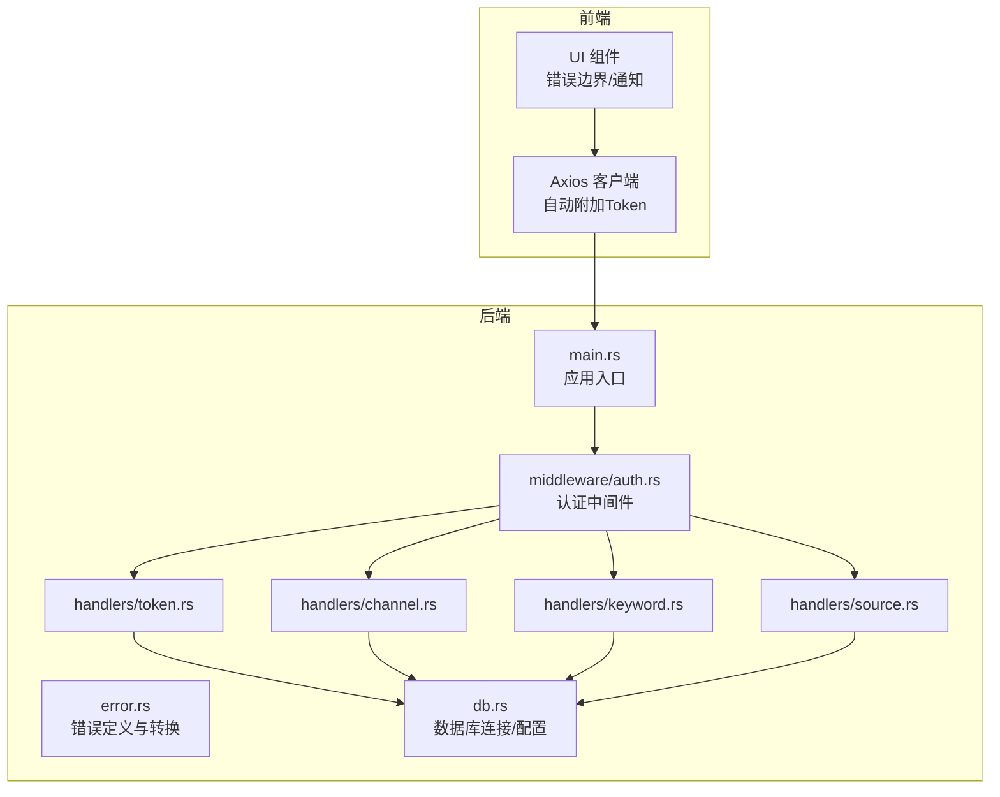
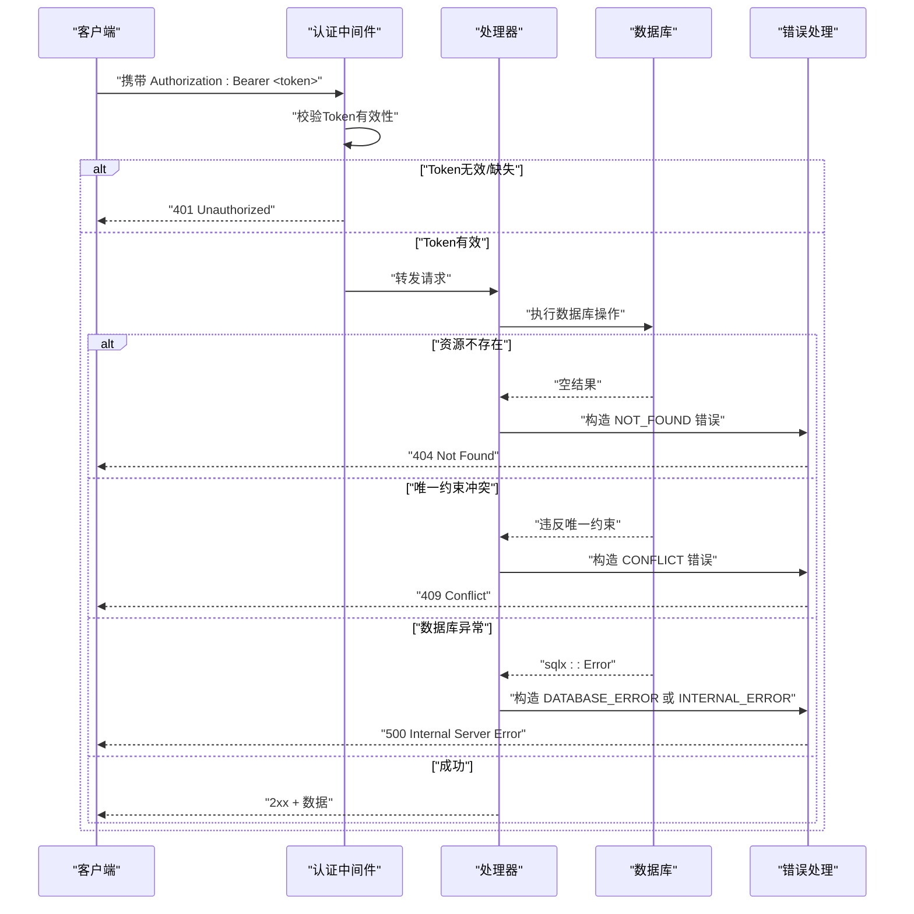
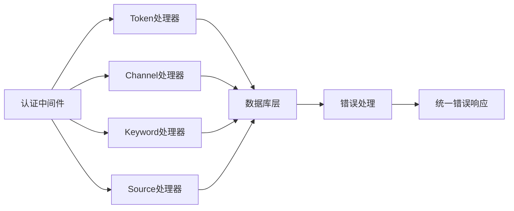

# 常见错误类型

<cite>
**本文引用的文件**
- [error.rs](file://src/error.rs)
- [auth.rs](file://src/middleware/auth.rs)
- [token.rs](file://src/handlers/token.rs)
- [channel.rs](file://src/handlers/channel.rs)
- [keyword.rs](file://src/handlers/keyword.rs)
- [source.rs](file://src/handlers/source.rs)
- [db.rs](file://src/db.rs)
- [main.rs](file://src/main.rs)
- [spec.md（后端项目脚手架）](file://openspec/specs/backend-project-scaffold/spec.md)
- [spec.md（前端项目脚手架）](file://openspec/changes/frontend-setup/specs/frontend-project-scaffold/spec.md)
- [spec.md（API 客户端层）](file://openspec/changes/frontend-setup/specs/api-client-layer/spec.md)
- [spec.md（共享组件）](file://openspec/changes/frontend-setup/specs/shared-components/spec.md)
</cite>

## 目录
1. [简介](#简介)
2. [项目结构](#项目结构)
3. [核心组件](#核心组件)
4. [架构总览](#架构总览)
5. [详细组件分析](#详细组件分析)
6. [依赖关系分析](#依赖关系分析)
7. [性能考量](#性能考量)
8. [故障排除指南](#故障排除指南)
9. [结论](#结论)
10. [附录](#附录)

## 简介
本文件面向AI趋势监控系统的使用者与维护者，聚焦于系统中的常见错误类型与排障流程。依据设计规范与代码实现，系统统一使用结构化错误响应格式，并在不同场景下返回400、401、404、409、500等HTTP状态码及对应错误码。本文将逐项解释AppError（由错误码映射而来）的触发条件、错误消息含义与解决建议，并给出错误代码对照表与最佳实践。

## 项目结构
系统采用Rust后端与OpenSpec规范驱动的前后端协作方式：
- 后端：统一错误处理、认证中间件、各领域处理器（token/channel/keyword/source/query）、数据库访问层
- 前端：基于Axios的API客户端、自动附加Bearer Token、401自动清理与重定向、网络错误友好提示

图表来源
- [main.rs](file://src/main.rs)
- [error.rs](file://src/error.rs)
- [auth.rs](file://src/middleware/auth.rs)
- [token.rs](file://src/handlers/token.rs)
- [channel.rs](file://src/handlers/channel.rs)
- [keyword.rs](file://src/handlers/keyword.rs)
- [source.rs](file://src/handlers/source.rs)
- [db.rs](file://src/db.rs)
- [spec.md（前端项目脚手架）](file://openspec/changes/frontend-setup/specs/frontend-project-scaffold/spec.md)

章节来源
- [main.rs](file://src/main.rs)
- [error.rs](file://src/error.rs)
- [auth.rs](file://src/middleware/auth.rs)
- [token.rs](file://src/handlers/token.rs)
- [channel.rs](file://src/handlers/channel.rs)
- [keyword.rs](file://src/handlers/keyword.rs)
- [source.rs](file://src/handlers/source.rs)
- [db.rs](file://src/db.rs)
- [spec.md（前端项目脚手架）](file://openspec/changes/frontend-setup/specs/frontend-project-scaffold/spec.md)

## 核心组件
- 错误定义与转换：统一错误响应格式，覆盖400、401、404、409、500与数据库错误自动转500
- 认证中间件：校验请求头中的Bearer Token，缺失或无效时返回401
- 处理器：按领域划分，查询不到资源返回404；唯一约束冲突返回409；其他异常返回500
- 数据库层：通过sqlx执行SQL，数据库错误自动转换为500
- 前端：Axios拦截器自动附加Token并处理401重定向与网络错误提示

章节来源
- [error.rs](file://src/error.rs)
- [auth.rs](file://src/middleware/auth.rs)
- [token.rs](file://src/handlers/token.rs)
- [channel.rs](file://src/handlers/channel.rs)
- [keyword.rs](file://src/handlers/keyword.rs)
- [source.rs](file://src/handlers/source.rs)
- [db.rs](file://src/db.rs)
- [spec.md（后端项目脚手架）](file://openspec/specs/backend-project-scaffold/spec.md)
- [spec.md（前端项目脚手架）](file://openspec/changes/frontend-setup/specs/frontend-project-scaffold/spec.md)
- [spec.md（API 客户端层）](file://openspec/changes/frontend-setup/specs/api-client-layer/spec.md)

## 架构总览
系统通过认证中间件统一鉴权，各处理器负责业务逻辑与数据访问，错误在统一出口被转换为标准JSON响应。前端通过Axios自动处理Token与401重定向。

图表来源
- [auth.rs](file://src/middleware/auth.rs)
- [token.rs](file://src/handlers/token.rs)
- [channel.rs](file://src/handlers/channel.rs)
- [keyword.rs](file://src/handlers/keyword.rs)
- [source.rs](file://src/handlers/source.rs)
- [db.rs](file://src/db.rs)
- [error.rs](file://src/error.rs)
- [spec.md（后端项目脚手架）](file://openspec/specs/backend-project-scaffold/spec.md)

## 详细组件分析

### AppError 错误类型与触发条件
- NOT_FOUND（404）
  - 触发条件：根据ID查询资源未命中；删除/更新/查询单个资源时目标不存在
  - 典型场景：访问不存在的数据源、关键词或频道
  - 解决方案：确认ID正确性、检查数据是否已被删除、核对查询参数
- BAD_REQUEST（400）
  - 触发条件：请求参数非法或格式不正确
  - 典型场景：必填字段缺失、数值越界、字符串长度超限
  - 解决方案：对照接口文档修正请求体字段与取值范围
- UNAUTHORIZED（401）
  - 触发条件：缺少Authorization头、Token无效或已过期
  - 典型场景：未登录访问受保护接口、Token被撤销
  - 解决方案：重新登录获取新Token、确保前端已正确存储与发送Token
- CONFLICT（409）
  - 触发条件：违反唯一约束（如重复关键词）
  - 典型场景：创建重复名称的关键词
  - 解决方案：修改名称或删除旧条目后再试
- INTERNAL_ERROR（500）
  - 触发条件：未捕获的运行时异常
  - 典型场景：业务逻辑分支遗漏、外部依赖异常
  - 解决方案：查看服务日志定位异常点、补充边界条件处理
- DATABASE_ERROR（500）
  - 触发条件：数据库操作失败（如连接异常、SQL语法错误）
  - 典型场景：数据库不可用、迁移未完成
  - 解决方案：检查数据库服务状态、确认迁移脚本已执行、查看数据库日志

章节来源
- [error.rs](file://src/error.rs)
- [spec.md（后端项目脚手架）](file://openspec/specs/backend-project-scaffold/spec.md)

### 认证失败与权限不足
- 触发条件：请求未携带有效Token或Token无效
- 前端表现：收到401后自动清除本地Token并跳转至认证页
- 排障步骤：
  1) 检查浏览器localStorage中是否存在api_token键
  2) 确认Token未过期且未被撤销
  3) 核对请求头Authorization是否为Bearer <token>
  4) 若仍失败，尝试重新登录获取新Token
- 解决方案：重新登录、确认Token来源可信、排查跨域与CORS设置

章节来源
- [auth.rs](file://src/middleware/auth.rs)
- [spec.md（前端项目脚手架）](file://openspec/changes/frontend-setup/specs/frontend-project-scaffold/spec.md)
- [spec.md（API 客户端层）](file://openspec/changes/frontend-setup/specs/api-client-layer/spec.md)

### 资源不存在（404）
- 触发条件：按ID查询单个资源返回空
- 典型场景：访问已删除的数据源/关键词/频道
- 排障步骤：
  1) 使用列表接口确认资源是否存在
  2) 核对ID是否正确（区分大小写、前缀/后缀）
  3) 检查软删除标记或过滤条件
- 解决方案：从列表恢复或重建资源

章节来源
- [channel.rs](file://src/handlers/channel.rs)
- [keyword.rs](file://src/handlers/keyword.rs)
- [source.rs](file://src/handlers/source.rs)
- [token.rs](file://src/handlers/token.rs)

### 冲突（409）
- 触发条件：唯一约束冲突（如重复关键词）
- 典型场景：重复创建同名关键词
- 排障步骤：
  1) 查询关键词列表确认是否已存在
  2) 修改名称或删除历史重复项
- 解决方案：避免重复提交、增加前端去重提示

章节来源
- [keyword.rs](file://src/handlers/keyword.rs)

### 数据库错误（500）
- 触发条件：数据库操作抛出异常（如连接失败、SQL错误）
- 典型场景：数据库未初始化、迁移未执行、并发写入冲突
- 排障步骤：
  1) 检查数据库服务是否正常
  2) 确认迁移脚本已执行
  3) 查看服务日志中的sqlx::Error详情
- 解决方案：修复数据库配置、执行迁移、优化并发控制

章节来源
- [db.rs](file://src/db.rs)
- [error.rs](file://src/error.rs)
- [spec.md（后端项目脚手架）](file://openspec/specs/backend-project-scaffold/spec.md)

## 依赖关系分析
- 认证中间件依赖Token模型与验证逻辑
- 处理器依赖数据库访问层与模型定义
- 错误处理模块统一转换底层异常为HTTP错误码
- 前端Axios客户端依赖后端统一错误格式与401重定向约定

图表来源
- [auth.rs](file://src/middleware/auth.rs)
- [token.rs](file://src/handlers/token.rs)
- [channel.rs](file://src/handlers/channel.rs)
- [keyword.rs](file://src/handlers/keyword.rs)
- [source.rs](file://src/handlers/source.rs)
- [db.rs](file://src/db.rs)
- [error.rs](file://src/error.rs)

章节来源
- [auth.rs](file://src/middleware/auth.rs)
- [token.rs](file://src/handlers/token.rs)
- [channel.rs](file://src/handlers/channel.rs)
- [keyword.rs](file://src/handlers/keyword.rs)
- [source.rs](file://src/handlers/source.rs)
- [db.rs](file://src/db.rs)
- [error.rs](file://src/error.rs)

## 性能考量
- 避免在高频路径上进行不必要的数据库查询，优先使用缓存或批量操作
- 对外暴露的接口应尽量减少序列化开销，统一返回结构
- 前端对401的处理应避免频繁重定向导致的抖动，可引入防抖策略

## 故障排除指南

### 错误代码对照表
- 400 BAD_REQUEST：请求参数非法
- 401 UNAUTHORIZED：缺少或无效Token
- 404 NOT_FOUND：资源不存在
- 409 CONFLICT：唯一约束冲突
- 500 INTERNAL_ERROR：服务器内部错误
- 500 DATABASE_ERROR：数据库错误（自动转换）

章节来源
- [error.rs](file://src/error.rs)
- [spec.md（后端项目脚手架）](file://openspec/specs/backend-project-scaffold/spec.md)

### 典型场景诊断步骤与修复方法
- 认证失败
  - 步骤：检查Authorization头、确认Token存在且未过期、核对登录状态
  - 修复：重新登录、更换Token、检查跨域设置
- 权限不足
  - 步骤：确认Token权限范围、检查接口访问控制
  - 修复：申请更高权限或使用具备权限的Token
- 资源不存在
  - 步骤：先调用列表接口确认、核对ID与过滤条件
  - 修复：从列表恢复或重建资源
- 冲突
  - 步骤：查询现有记录、修改名称或删除重复项
  - 修复：避免重复提交、前端去重提示
- 数据库错误
  - 步骤：检查数据库服务、确认迁移脚本、查看服务日志
  - 修复：修复配置、执行迁移、优化并发

章节来源
- [auth.rs](file://src/middleware/auth.rs)
- [channel.rs](file://src/handlers/channel.rs)
- [keyword.rs](file://src/handlers/keyword.rs)
- [source.rs](file://src/handlers/source.rs)
- [db.rs](file://src/db.rs)
- [error.rs](file://src/error.rs)
- [spec.md（前端项目脚手架）](file://openspec/changes/frontend-setup/specs/frontend-project-scaffold/spec.md)
- [spec.md（API 客户端层）](file://openspec/changes/frontend-setup/specs/api-client-layer/spec.md)

### 错误处理最佳实践
- 统一错误响应格式，便于前端一致化处理
- 将数据库错误自动转换为500，隐藏底层细节
- 在认证失败时，前端应自动清理Token并引导用户重新登录
- 对网络错误提供友好提示，帮助用户快速定位问题（如后端未启动）
- 对409冲突明确提示原因并给出修复建议

章节来源
- [spec.md（后端项目脚手架）](file://openspec/specs/backend-project-scaffold/spec.md)
- [spec.md（前端项目脚手架）](file://openspec/changes/frontend-setup/specs/frontend-project-scaffold/spec.md)
- [spec.md（API 客户端层）](file://openspec/changes/frontend-setup/specs/api-client-layer/spec.md)
- [spec.md（共享组件）](file://openspec/changes/frontend-setup/specs/shared-components/spec.md)

## 结论
通过统一的错误码体系与前后端协同的错误处理机制，系统能够在多数常见问题上提供清晰的诊断线索与修复路径。遵循本文的排障步骤与最佳实践，可显著降低运维成本并提升用户体验。

## 附录
- 前端错误处理要点：自动附加Token、401自动清理与重定向、网络错误友好提示
- 后端错误处理要点：统一响应格式、错误码映射、数据库错误自动转500

章节来源
- [spec.md（前端项目脚手架）](file://openspec/changes/frontend-setup/specs/frontend-project-scaffold/spec.md)
- [spec.md（API 客户端层）](file://openspec/changes/frontend-setup/specs/api-client-layer/spec.md)
- [spec.md（共享组件）](file://openspec/changes/frontend-setup/specs/shared-components/spec.md)
- [spec.md（后端项目脚手架）](file://openspec/specs/backend-project-scaffold/spec.md)