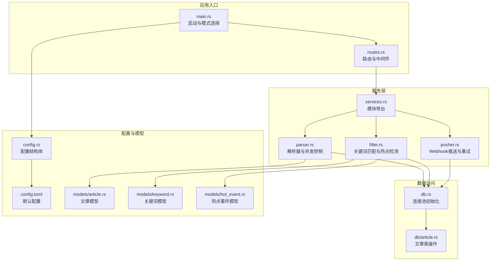
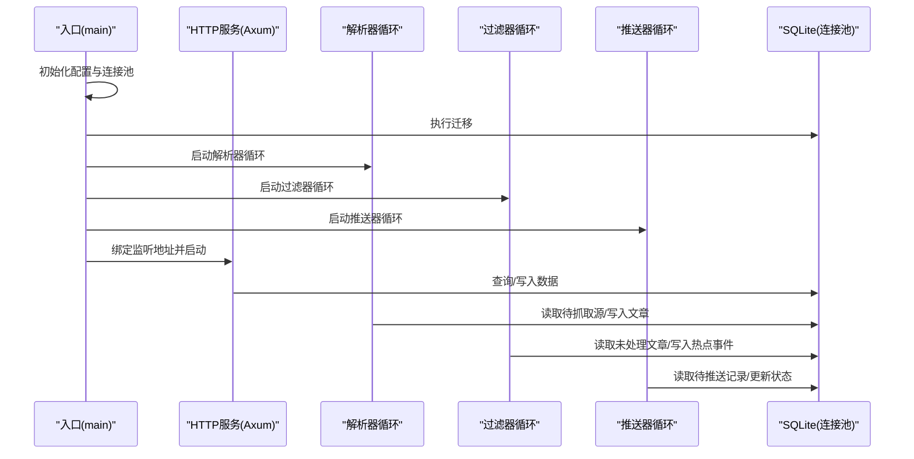
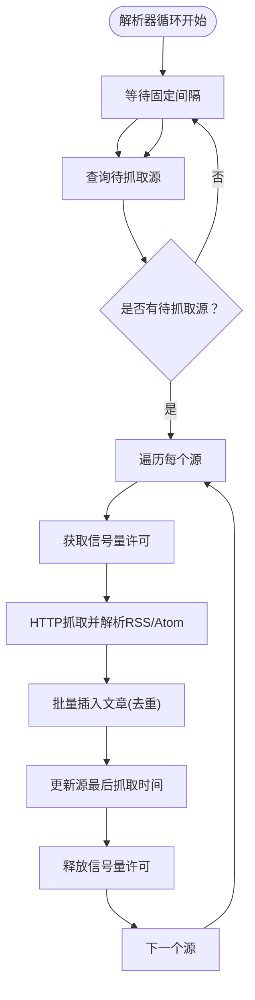
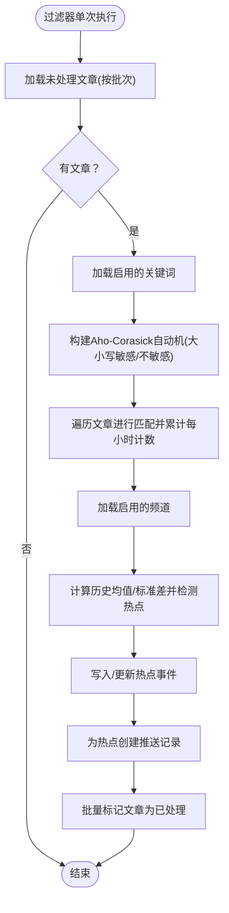
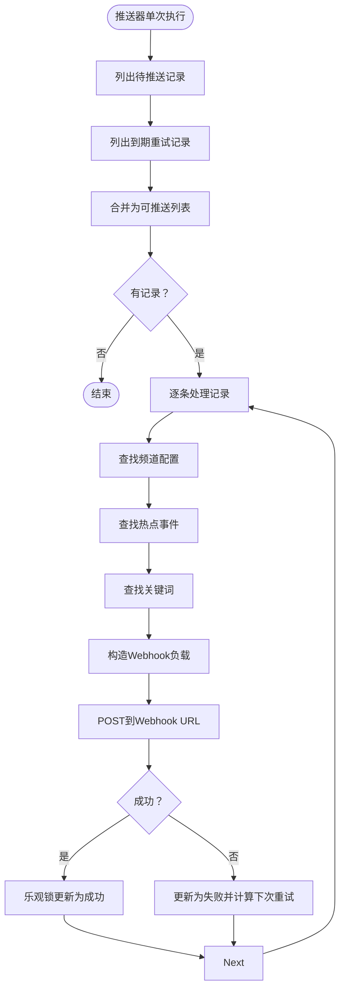
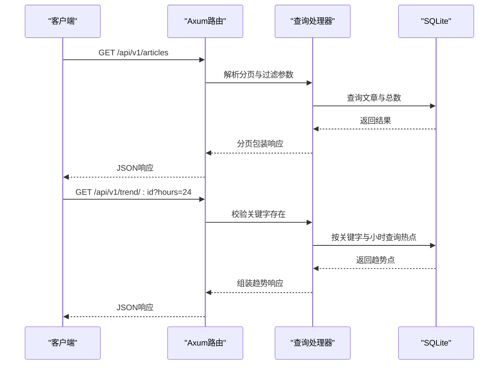
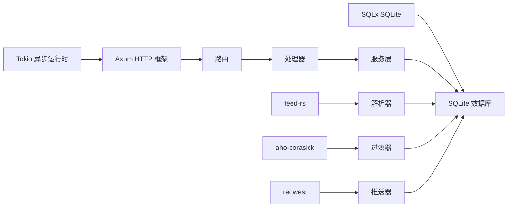

# 性能问题诊断

<cite>
**本文引用的文件**
- [src/main.rs](file://src/main.rs)
- [src/config.rs](file://src/config.rs)
- [src/db.rs](file://src/db.rs)
- [src/services.rs](file://src/services.rs)
- [src/services/parser.rs](file://src/services/parser.rs)
- [src/services/filter.rs](file://src/services/filter.rs)
- [src/services/pusher.rs](file://src/services/pusher.rs)
- [src/routes.rs](file://src/routes.rs)
- [src/handlers/query.rs](file://src/handlers/query.rs)
- [src/models/article.rs](file://src/models/article.rs)
- [src/models/keyword.rs](file://src/models/keyword.rs)
- [src/models/hot_event.rs](file://src/models/hot_event.rs)
- [src/db/article.rs](file://src/db/article.rs)
- [Cargo.toml](file://Cargo.toml)
- [config.toml](file://config.toml)
</cite>

## 目录
1. [简介](#简介)
2. [项目结构](#项目结构)
3. [核心组件](#核心组件)
4. [架构总览](#架构总览)
5. [详细组件分析](#详细组件分析)
6. [依赖关系分析](#依赖关系分析)
7. [性能考量与优化建议](#性能考量与优化建议)
8. [故障排查指南](#故障排查指南)
9. [结论](#结论)
10. [附录](#附录)

## 简介
本指南面向AI趋势监控系统的运维与开发人员，聚焦于性能问题的诊断与优化。内容覆盖内存泄漏识别、CPU占用过高、数据库查询缓慢等问题的定位方法；系统监控指标（响应时间、吞吐量、内存使用率）的解读；RSS采集延迟、关键词匹配耗时、热点检测计算量等性能瓶颈的定位与优化策略；以及数据库连接池配置、异步任务调度、缓存策略等优化技巧。

## 项目结构
系统采用模块化分层设计：入口与路由在顶层，服务层负责解析、过滤、推送三大后台循环，数据库访问封装在独立模块，模型定义清晰，配置集中管理。整体以Tokio异步运行时驱动，Axum提供HTTP接口，SQLx管理SQLite连接池。

**图示来源**
- [src/main.rs:64-164](file://src/main.rs#L64-L164)
- [src/routes.rs:14-70](file://src/routes.rs#L14-L70)
- [src/services.rs:1-4](file://src/services.rs#L1-L4)
- [src/services/parser.rs:94-185](file://src/services/parser.rs#L94-L185)
- [src/services/filter.rs:269-277](file://src/services/filter.rs#L269-L277)
- [src/services/pusher.rs:251-259](file://src/services/pusher.rs#L251-L259)
- [src/db.rs:12-27](file://src/db.rs#L12-L27)
- [src/db/article.rs:6-29](file://src/db/article.rs#L6-L29)
- [src/config.rs:51-58](file://src/config.rs#L51-L58)
- [config.toml:1-27](file://config.toml#L1-L27)
- [src/models/article.rs:5-25](file://src/models/article.rs#L5-L25)
- [src/models/keyword.rs:5-32](file://src/models/keyword.rs#L5-L32)
- [src/models/hot_event.rs:5-15](file://src/models/hot_event.rs#L5-L15)

**章节来源**
- [src/main.rs:64-164](file://src/main.rs#L64-L164)
- [src/routes.rs:14-70](file://src/routes.rs#L14-L70)
- [src/services.rs:1-4](file://src/services.rs#L1-L4)
- [src/db.rs:12-27](file://src/db.rs#L12-L27)
- [src/config.rs:51-58](file://src/config.rs#L51-L58)
- [config.toml:1-27](file://config.toml#L1-L27)

## 核心组件
- 入口与模式选择：根据命令行参数选择运行模式，初始化数据库连接池并执行迁移，随后按需启动解析、过滤、推送三个后台循环，并启动HTTP服务器。
- 配置系统：集中定义服务器、数据库、鉴权、解析器、过滤器、推送器的配置项，支持从配置文件加载。
- 数据库连接池：初始化SQLite连接池，启用WAL模式与外键约束，限制最大连接数。
- 异步服务循环：解析器按固定间隔查询待抓取源，受并发信号量控制；过滤器按固定间隔进行关键词匹配与热点检测；推送器按固定间隔轮询待推送记录并发送Webhook。
- API路由：提供令牌、源、关键词、频道、查询等REST接口，并内置健康检查与CORS支持。

**章节来源**
- [src/main.rs:64-164](file://src/main.rs#L64-L164)
- [src/config.rs:3-58](file://src/config.rs#L3-L58)
- [src/db.rs:12-27](file://src/db.rs#L12-L27)
- [src/services/parser.rs:94-185](file://src/services/parser.rs#L94-L185)
- [src/services/filter.rs:269-277](file://src/services/filter.rs#L269-L277)
- [src/services/pusher.rs:251-259](file://src/services/pusher.rs#L251-L259)
- [src/routes.rs:14-70](file://src/routes.rs#L14-L70)

## 架构总览
系统采用“后台循环 + HTTP API”的架构。后台循环通过Tokio任务并发执行，HTTP API提供系统控制与查询能力。数据库采用SQLite，通过SQLx连接池统一管理。

**图示来源**
- [src/main.rs:64-164](file://src/main.rs#L64-L164)
- [src/routes.rs:14-70](file://src/routes.rs#L14-L70)
- [src/services/parser.rs:94-185](file://src/services/parser.rs#L94-L185)
- [src/services/filter.rs:269-277](file://src/services/filter.rs#L269-L277)
- [src/services/pusher.rs:251-259](file://src/services/pusher.rs#L251-L259)
- [src/db.rs:12-27](file://src/db.rs#L12-L27)

## 详细组件分析

### 解析器组件（RSS采集与并发控制）
- 并发控制：使用信号量限制同时抓取的源数量，避免外部源限流或网络拥塞导致的资源争用。
- 抓取流程：按固定间隔查询待抓取源，每个源独立spawn任务，抓取后批量插入文章并更新最后抓取时间。
- 错误处理：抓取失败仍会更新最后抓取时间，避免频繁重试造成压力。

**图示来源**
- [src/services/parser.rs:94-185](file://src/services/parser.rs#L94-L185)

**章节来源**
- [src/services/parser.rs:94-185](file://src/services/parser.rs#L94-L185)
- [src/db/article.rs:6-29](file://src/db/article.rs#L6-L29)

### 过滤器组件（关键词匹配与热点检测）
- 关键词匹配：构建Aho-Corasick自动机，分别处理大小写敏感与不敏感的关键词集合，对标题与摘要进行多模式匹配，统计每小时关键词出现次数。
- 热点检测：基于历史均值与标准差计算阈值，结合最小历史小时数与最小热点计数进行爆发检测，生成热点事件并写入推送记录。
- 批量处理：按批次读取未处理文章，完成后批量标记为已处理，减少事务开销。

**图示来源**
- [src/services/filter.rs:13-208](file://src/services/filter.rs#L13-L208)

**章节来源**
- [src/services/filter.rs:13-208](file://src/services/filter.rs#L13-L208)
- [src/models/keyword.rs:5-32](file://src/models/keyword.rs#L5-L32)
- [src/models/hot_event.rs:5-15](file://src/models/hot_event.rs#L5-L15)

### 推送器组件（Webhook推送与指数退避）
- 轮询策略：合并“待推送”和“到期重试”的记录，逐条处理。
- 失败重试：采用线性递增的下次重试时间（基于重试次数与基础秒数），达到最大重试后放弃。
- 幂等更新：使用乐观锁更新推送记录状态，避免并发冲突导致的数据不一致。

**图示来源**
- [src/services/pusher.rs:11-259](file://src/services/pusher.rs#L11-L259)

**章节来源**
- [src/services/pusher.rs:11-259](file://src/services/pusher.rs#L11-L259)

### API与查询处理
- 分页与过滤：文章列表支持按来源与处理状态过滤，分页参数安全校验。
- 热点趋势：按关键字返回小时粒度的趋势点，支持限定小时范围。
- 手动触发：提供手动触发过滤与推送的端点，便于排障与验证。

**图示来源**
- [src/routes.rs:14-70](file://src/routes.rs#L14-L70)
- [src/handlers/query.rs:47-165](file://src/handlers/query.rs#L47-L165)
- [src/db/article.rs:31-161](file://src/db/article.rs#L31-L161)

**章节来源**
- [src/routes.rs:14-70](file://src/routes.rs#L14-L70)
- [src/handlers/query.rs:47-165](file://src/handlers/query.rs#L47-L165)
- [src/db/article.rs:31-161](file://src/db/article.rs#L31-L161)

## 依赖关系分析
- 运行时与库：Tokio提供异步运行时；Axum/Tower提供HTTP栈；SQLx管理SQLite连接池；feed-rs用于RSS解析；aho-corasick用于多模式字符串匹配；reqwest用于HTTP请求。
- 编译配置：发布版启用LTO、单代码生成单元、符号剥离、panic中止、禁用溢出检查，追求极致性能与体积。
- 模块耦合：服务层通过共享的SqlitePool与数据库交互，避免重复连接；路由与处理器通过AppState传递共享状态；配置结构体贯穿各层。

**图示来源**
- [Cargo.toml:6-47](file://Cargo.toml#L6-L47)
- [src/services/parser.rs:48-88](file://src/services/parser.rs#L48-L88)
- [src/services/filter.rs:1-10](file://src/services/filter.rs#L1-L10)
- [src/services/pusher.rs:38-42](file://src/services/pusher.rs#L38-L42)

**章节来源**
- [Cargo.toml:6-47](file://Cargo.toml#L6-L47)
- [src/services/parser.rs:48-88](file://src/services/parser.rs#L48-L88)
- [src/services/filter.rs:1-10](file://src/services/filter.rs#L1-L10)
- [src/services/pusher.rs:38-42](file://src/services/pusher.rs#L38-L42)

## 性能考量与优化建议

### 内存泄漏识别与防护
- 观察指标：持续增长的驻留集（RSS）、堆内存峰值、GC暂停时间（如启用）。Rust无GC时，关注堆分配与长生命周期对象。
- 建议措施：
  - 使用火焰图定位热点调用链，确认是否存在无限增长的Vec或HashMap。
  - 对高频分配的结构体（如文章、热点事件）考虑对象池或复用策略。
  - 定期清理临时数据结构，避免闭包捕获过大的上下文。

### CPU占用过高
- 可能原因：关键词匹配规模过大、热点检测统计计算密集、并发任务过多导致上下文切换开销。
- 建议措施：
  - 控制解析并发度与过滤批大小，避免同时处理过多源或文章。
  - 将大小写敏感与不敏感关键词拆分处理，减少自动机构建与匹配成本。
  - 降低过滤器执行频率或增加批大小，减少频繁的小事务开销。
  - 对热点检测中的统计计算进行缓存或增量更新。

### 数据库查询缓慢
- 可能原因：缺少索引、大事务、全表扫描、连接池饱和。
- 建议措施：
  - 为热点事件的keyword_id与hour_bucket建立复合索引，加速趋势查询与统计。
  - 将批量更新拆分为更小批次，避免SQLite变量上限与长事务阻塞。
  - 提升连接池最大连接数，确保WAL模式下并发读写性能。
  - 使用EXPLAIN QUERY PLAN分析慢查询，必要时调整WHERE条件与排序字段。

### 系统监控指标解读
- 响应时间：API端点的P50/P95/P99延迟。若解析/过滤阶段阻塞，延迟会显著上升。
- 吞吐量：单位时间内处理的文章数、关键词匹配次数、热点事件数、推送成功数。
- 内存使用率：RSS与堆内存占比。异常升高通常由未释放的缓冲区或缓存膨胀引起。
- 数据库指标：活跃连接数、等待队列长度、慢查询数、WAL写入速率。

### 性能瓶颈定位与优化策略
- RSS采集延迟
  - 优化：降低并发抓取数、设置合理超时、启用合理的User-Agent；对失败源快速退避。
  - 指标：抓取成功率、平均响应时间、失败重试次数。
- 关键词匹配耗时
  - 优化：拆分大小写敏感/不敏感匹配路径、预编译自动机、减少字符串拼接与拷贝。
  - 指标：匹配耗时分布、命中率、每文章匹配次数。
- 热点检测计算量
  - 优化：缓存历史统计、滑动窗口增量更新、降低批大小或提高间隔。
  - 指标：热点检测耗时、历史小时数、阈值计算耗时。
- 推送延迟
  - 优化：指数退避策略合理化、失败重试上限、并发推送数控制。
  - 指标：推送成功率、平均重试次数、失败原因分布。

### 数据库连接池配置
- 当前配置：最大连接数为5，启用WAL与外键约束。
- 建议：根据并发解析/过滤/推送任务数适当提升最大连接数；开启连接空闲回收；监控等待队列长度决定是否扩容。

**章节来源**
- [src/db.rs:12-27](file://src/db.rs#L12-L27)
- [src/config.rs:19-22](file://src/config.rs#L19-L22)
- [config.toml:5-6](file://config.toml#L5-L6)

### 异步任务调度
- 当前策略：解析器使用信号量控制并发；过滤器与推送器按固定间隔循环；API请求在Tokio任务中处理。
- 建议：为不同任务设置优先级队列；对高延迟外部依赖（如Webhook）单独限速；对失败重试引入抖动避免惊群。

**章节来源**
- [src/services/parser.rs:94-185](file://src/services/parser.rs#L94-L185)
- [src/services/filter.rs:269-277](file://src/services/filter.rs#L269-L277)
- [src/services/pusher.rs:251-259](file://src/services/pusher.rs#L251-L259)

### 缓存策略
- 建议：对热点事件的历史统计进行短期缓存；对关键词与频道配置进行本地缓存；对热门趋势查询结果进行轻量缓存。
- 注意：缓存一致性与失效策略，避免脏读。

## 故障排查指南
- 启动与初始化
  - 确认数据库目录存在且可写；迁移成功执行；初始令牌生成或读取正常。
- 解析器
  - 若RSS抓取失败增多，检查外部源可用性、User-Agent与超时设置；观察信号量是否被长时间占用。
- 过滤器
  - 若关键词匹配耗时上升，检查关键词数量与模式复杂度；确认自动机构建仅在配置变更时进行。
- 推送器
  - 若推送失败率高，检查目标Webhook可达性与认证；核对重试上限与退避策略；关注乐观锁更新冲突日志。
- API
  - 若查询响应慢，检查分页参数与过滤条件；确认热点趋势查询的索引是否生效。

**章节来源**
- [src/main.rs:27-62](file://src/main.rs#L27-L62)
- [src/services/parser.rs:101-182](file://src/services/parser.rs#L101-L182)
- [src/services/filter.rs:13-208](file://src/services/filter.rs#L13-L208)
- [src/services/pusher.rs:11-259](file://src/services/pusher.rs#L11-L259)
- [src/handlers/query.rs:47-165](file://src/handlers/query.rs#L47-L165)

## 结论
通过对入口、服务循环、数据库访问与API层的深入分析，可以系统地定位与缓解内存泄漏、CPU占用过高与数据库查询缓慢等性能问题。建议以监控指标为依据，结合并发控制、批处理优化、索引与缓存策略，持续迭代优化系统性能与稳定性。

## 附录
- 配置参考
  - 服务器：主机与端口
  - 数据库：路径
  - 认证：初始令牌
  - 解析器：最大并发抓取、默认User-Agent、默认超时
  - 过滤器：批大小、间隔、历史小时数、最小历史小时数
  - 推送器：间隔、最大重试、重试基础秒数

**章节来源**
- [config.toml:1-27](file://config.toml#L1-L27)
- [src/config.rs:3-58](file://src/config.rs#L3-L58)