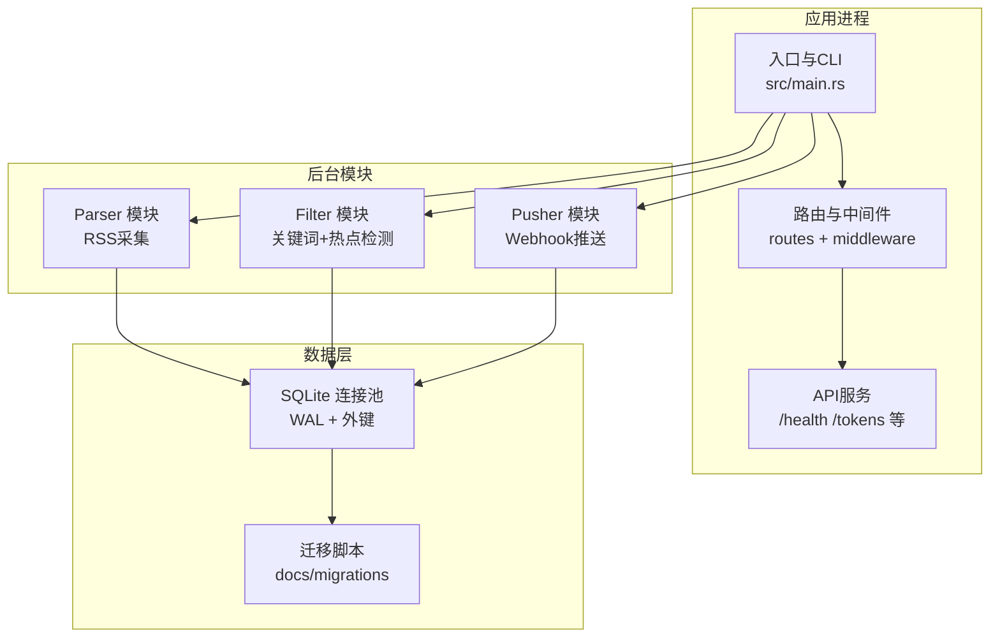
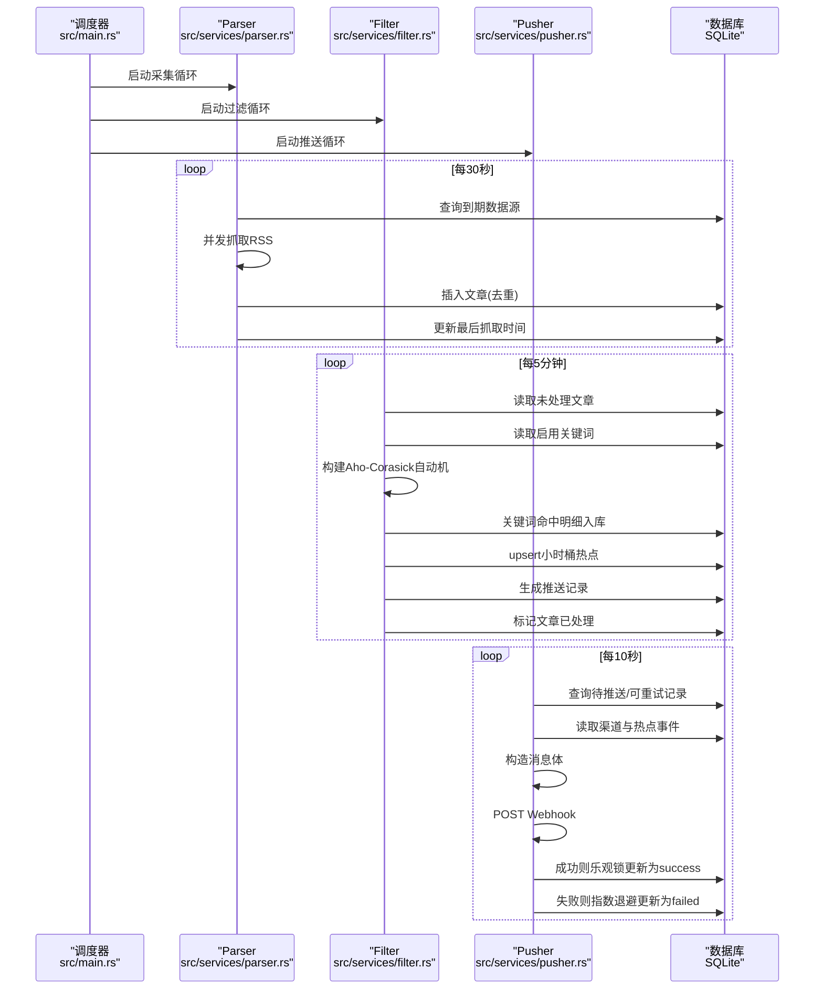
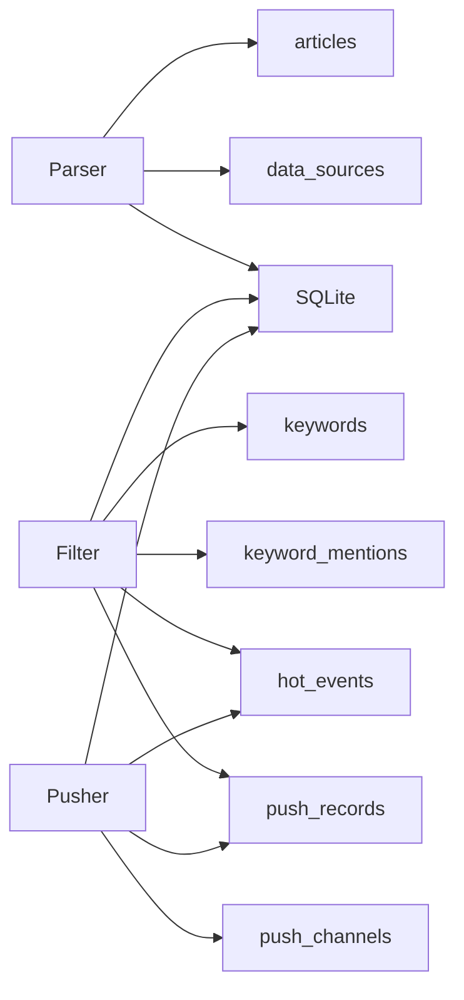

# 故障排除

<cite>
**本文引用的文件**
- [README.md](file://README.md)
- [config.toml](file://config.toml)
- [src/main.rs](file://src/main.rs)
- [src/error.rs](file://src/error.rs)
- [src/config.rs](file://src/config.rs)
- [src/db.rs](file://src/db.rs)
- [src/services/parser.rs](file://src/services/parser.rs)
- [src/services/filter.rs](file://src/services/filter.rs)
- [src/services/pusher.rs](file://src/services/pusher.rs)
- [src/db/source.rs](file://src/db/source.rs)
- [src/db/article.rs](file://src/db/article.rs)
- [src/db/push_record.rs](file://src/db/push_record.rs)
- [docs/migrations/20260607044921_init.sql](file://docs/migrations/20260607044921_init.sql)
</cite>

## 目录
1. [简介](#简介)
2. [项目结构](#项目结构)
3. [核心组件](#核心组件)
4. [架构总览](#架构总览)
5. [详细组件分析](#详细组件分析)
6. [依赖关系分析](#依赖关系分析)
7. [性能考虑](#性能考虑)
8. [故障排除指南](#故障排除指南)
9. [结论](#结论)
10. [附录](#附录)

## 简介
本指南面向运维与开发人员，围绕“AI趋势监控系统”在RSS采集、关键词匹配、热点检测、Webhook推送等环节中可能遇到的常见问题，提供系统化的诊断方法、日志分析要点、错误代码解读、调试技巧、性能优化建议、配置错误排查、系统监控指标与异常告警处理流程，以及数据恢复、数据库修复与系统重建的实操步骤，并给出紧急情况下的应急处理预案。

## 项目结构
系统采用模块化设计，核心由三类后台任务构成：Parser（RSS采集）、Filter（关键词匹配+热点检测）、Pusher（Webhook推送），并通过SQLite存储数据。API服务负责健康检查与令牌管理，统一错误响应与认证中间件贯穿全链路。

图表来源
- [src/main.rs:64-164](file://src/main.rs#L64-L164)
- [src/db.rs:12-27](file://src/db.rs#L12-L27)
- [docs/migrations/20260607044921_init.sql:1-118](file://docs/migrations/20260607044921_init.sql#L1-L118)

章节来源
- [README.md:5-293](file://README.md#L5-L293)
- [src/main.rs:64-164](file://src/main.rs#L64-L164)
- [src/db.rs:12-27](file://src/db.rs#L12-L27)

## 核心组件
- 配置系统：TOML解析为结构体，支持服务器、数据库、认证、Parser、Filter、Pusher各模块参数。
- 日志系统：使用tracing，按环境变量级别输出，便于快速定位问题。
- 错误体系：统一AppError枚举与ApiResponse封装，HTTP状态码与错误码映射清晰。
- 数据库：SQLite WAL模式、外键约束；迁移脚本定义完整表结构与索引。
- 业务模块：Parser负责RSS抓取与去重入库；Filter负责关键词匹配、小时桶统计与突发检测；Pusher负责按渠道推送与指数退避重试。

章节来源
- [src/config.rs:1-58](file://src/config.rs#L1-L58)
- [src/error.rs:1-79](file://src/error.rs#L1-L79)
- [src/db.rs:12-27](file://src/db.rs#L12-L27)
- [docs/migrations/20260607044921_init.sql:1-118](file://docs/migrations/20260607044921_init.sql#L1-L118)

## 架构总览
系统采用管道模式，三类后台任务独立运行，互不阻塞。Parser按数据源周期性抓取并去重写入articles；Filter每5分钟扫描未处理文章，构建Aho-Corasick自动机进行多模式匹配，统计小时桶计数并进行突发检测，生成hot_events与push_records；Pusher每10秒轮询待推送记录，POST Webhook并进行指数退避重试。

图表来源
- [src/main.rs:87-105](file://src/main.rs#L87-L105)
- [src/services/parser.rs:94-185](file://src/services/parser.rs#L94-L185)
- [src/services/filter.rs:269-277](file://src/services/filter.rs#L269-L277)
- [src/services/pusher.rs:251-259](file://src/services/pusher.rs#L251-L259)

## 详细组件分析

### Parser（RSS采集）
- 关键点
  - 使用信号量限制并发抓取数量，避免对上游RSS源造成压力。
  - 抓取失败时仍更新last_fetched_at，避免立即重试。
  - 插入文章采用ON CONFLICT(link) DO NOTHING，确保去重。
  - 错误日志包含源ID、名称与链接，便于定位。
- 常见问题
  - 网络超时/连接失败：检查默认超时与User-Agent配置。
  - RSS解析失败：确认feed-rs兼容性与内容编码。
  - 并发过高导致上游限流：降低max_concurrent_fetches。
- 诊断步骤
  - 查看Parser日志中的“failed to fetch”“failed to insert article”。
  - 检查数据源表中last_fetched_at是否持续更新。
  - 核对articles表link唯一索引是否触发去重。

章节来源
- [src/services/parser.rs:94-185](file://src/services/parser.rs#L94-L185)
- [src/db/article.rs:6-29](file://src/db/article.rs#L6-L29)
- [src/db/source.rs:119-133](file://src/db/source.rs#L119-L133)

### Filter（关键词匹配与热点检测）
- 关键点
  - Aho-Corasick自动机分别构建大小写敏感/不敏感两套模式。
  - 小时桶计数基于当前小时字符串，upsert保证幂等。
  - 历史统计从hot_events读取，滑动窗口计算均值与标准差。
  - 突发阈值=均值+std_multiplier×标准差，且不低于min_hot_count。
- 常见问题
  - 关键词未生效：检查keywords表enabled与case_sensitive设置。
  - 热点检测不触发：检查history_hours/min_history_hours是否满足。
  - 无推送记录：确认push_channels启用且push_records未被忽略。
- 诊断步骤
  - 查看Filter日志中的“loaded X unprocessed article(s)”“HOTSPOT detected”。
  - 检查hot_events小时桶是否存在，关键字计数是否增长。
  - 确认push_records是否生成且状态为pending。

章节来源
- [src/services/filter.rs:13-208](file://src/services/filter.rs#L13-L208)
- [src/services/filter.rs:210-267](file://src/services/filter.rs#L210-L267)

### Pusher（Webhook推送）
- 关键点
  - 轮询pending与retry_due两类记录，合并处理。
  - 提取渠道配置JSON中的url字段，构造文本消息体。
  - 成功后乐观锁更新为success，失败按max_retries与retry_base_seconds指数退避。
- 常见问题
  - Webhook 4xx/5xx：检查目标服务可用性与鉴权。
  - 网络异常：检查网络连通性与代理设置。
  - 无法解析渠道配置：确认push_channels.config包含url字段。
- 诊断步骤
  - 查看Pusher日志中的“channel ... not found”“network error”“success/failure”。
  - 检查push_records状态与retry_count、next_retry_at。
  - 验证渠道配置JSON格式与url字段存在。

章节来源
- [src/services/pusher.rs:11-202](file://src/services/pusher.rs#L11-L202)
- [src/services/pusher.rs:207-242](file://src/services/pusher.rs#L207-L242)

### 数据库与迁移
- 关键点
  - 初始化连接池并开启WAL模式与外键约束。
  - 迁移脚本定义完整表结构、索引与约束。
  - 关键表：api_tokens、data_sources、articles、keywords、keyword_mentions、hot_events、push_channels、push_records。
- 常见问题
  - 连接失败：检查数据库路径与权限。
  - 索引缺失影响查询：确认迁移执行成功。
  - 外键约束导致删除失败：先清理子表再删父表。
- 诊断步骤
  - 检查数据库文件是否存在与可写。
  - 使用SQLite命令查看表结构与索引。
  - 确认迁移版本与执行日志。

章节来源
- [src/db.rs:12-27](file://src/db.rs#L12-L27)
- [docs/migrations/20260607044921_init.sql:1-118](file://docs/migrations/20260607044921_init.sql#L1-L118)

## 依赖关系分析
- 组件耦合
  - Parser依赖数据源配置与articles表；Filter依赖keywords、hot_events、push_records；Pusher依赖push_channels、hot_events、push_records。
  - 三模块通过数据库解耦，互不影响。
- 外部依赖
  - feed-rs用于RSS解析；Aho-Corasick用于多模式匹配；reqwest用于Webhook推送；sqlx用于SQLite访问。
- 潜在风险
  - 并发抓取与批量插入可能导致数据库写入压力；热点检测窗口过小/过大影响准确性；推送重试策略不当导致资源浪费。

图表来源
- [src/services/parser.rs:101-107](file://src/services/parser.rs#L101-L107)
- [src/services/filter.rs:132-138](file://src/services/filter.rs#L132-L138)
- [src/services/pusher.rs:53-92](file://src/services/pusher.rs#L53-L92)
- [docs/migrations/20260607044921_init.sql:17-118](file://docs/migrations/20260607044921_init.sql#L17-L118)

## 性能考虑
- CPU占用过高
  - 检查Parser并发是否过高，适当降低max_concurrent_fetches。
  - Filter中Aho-Corasick构建与匹配开销较大，建议控制关键词数量与长度。
- 内存泄漏
  - 确保Tokio任务正确退出，避免长时间持有大对象；定期重启以回收内存。
- 数据库查询慢
  - 确认索引存在（articles、hot_events、push_records相关索引）。
  - 减少批量大小（batch_size）或分批处理，避免一次性加载过多数据。
- I/O瓶颈
  - 将数据库文件置于SSD；合理设置WAL模式；避免频繁fsync。
- 调优建议
  - Parser：增加抓取间隔或减少并发。
  - Filter：增大interval_seconds或减少历史窗口。
  - Pusher：调整max_retries与retry_base_seconds，避免频繁重试。

## 故障排除指南

### 通用诊断流程
- 步骤1：确认服务进程与端口
  - 检查监听地址与端口配置，确认API服务正常启动。
- 步骤2：查看日志
  - Parser：关注“failed to fetch”“failed to insert article”“source ... inserted/skipped”。
  - Filter：关注“loaded … unprocessed article(s)”“HOTSPOT detected”。
  - Pusher：关注“channel not found”“network error”“success/failure”。
- 步骤3：核对数据库
  - 确认迁移执行成功，表结构与索引完整。
  - 检查关键表数据是否按预期增长。

章节来源
- [src/main.rs:112-121](file://src/main.rs#L112-L121)
- [src/services/parser.rs:101-107](file://src/services/parser.rs#L101-L107)
- [src/services/filter.rs:13-28](file://src/services/filter.rs#L13-L28)
- [src/services/pusher.rs:13-19](file://src/services/pusher.rs#L13-L19)

### RSS采集失败
- 现象
  - Parser日志出现抓取错误；articles未增长；数据源last_fetched_at未更新。
- 可能原因
  - 上游RSS源不可达/限流；超时设置过短；User-Agent被拒绝。
- 处理步骤
  - 调整default_timeout_seconds与default_user_agent。
  - 降低max_concurrent_fetches，观察上游响应。
  - 手动curl测试RSS URL，确认返回内容与编码。
  - 若持续失败，临时禁用该数据源，避免阻塞其他源。

章节来源
- [src/services/parser.rs:53-60](file://src/services/parser.rs#L53-L60)
- [src/services/parser.rs:170-179](file://src/services/parser.rs#L170-L179)
- [src/db/source.rs:119-133](file://src/db/source.rs#L119-L133)

### 关键词匹配异常
- 现象
  - Filter日志显示未匹配或命中数异常；hot_events未增长。
- 可能原因
  - 关键词未启用或大小写敏感设置错误；关键词过多导致匹配效率低。
- 处理步骤
  - 检查keywords表enabled与case_sensitive字段。
  - 适当拆分关键词，减少单次匹配规模。
  - 验证Aho-Corasick自动机构建是否成功（日志中无“Failed to build…”）。

章节来源
- [src/services/filter.rs:30-46](file://src/services/filter.rs#L30-L46)
- [src/services/filter.rs:48-83](file://src/services/filter.rs#L48-L83)

### 热点检测不准确
- 现象
  - 热点未触发或频繁误报。
- 可能原因
  - 历史窗口过小/过大；std_multiplier与min_hot_count设置不合理。
- 处理步骤
  - 调整filter.history_hours与min_history_hours。
  - 依据hot_events小时桶统计数据，调整std_multiplier与min_hot_count。
  - 确认articles已标记processed，避免重复处理。

章节来源
- [src/services/filter.rs:167-178](file://src/services/filter.rs#L167-L178)
- [src/services/filter.rs:210-240](file://src/services/filter.rs#L210-L240)
- [src/db/article.rs:124-140](file://src/db/article.rs#L124-L140)

### Webhook推送失败
- 现象
  - Pusher日志出现“network error”“failed”；push_records状态长期为failed。
- 可能原因
  - 渠道配置JSON缺少url字段；目标服务不可用/鉴权失败；网络异常。
- 处理步骤
  - 检查push_channels.config是否包含有效url。
  - 使用curl手动验证Webhook URL可访问与返回状态。
  - 调整max_retries与retry_base_seconds，避免频繁重试。
  - 成功后检查乐观锁更新是否生效（status变为success）。

章节来源
- [src/services/pusher.rs:115-128](file://src/services/pusher.rs#L115-L128)
- [src/services/pusher.rs:192-201](file://src/services/pusher.rs#L192-L201)
- [src/services/pusher.rs:207-242](file://src/services/pusher.rs#L207-L242)

### 配置错误
- 常见问题
  - 服务器监听地址/端口冲突；数据库路径不存在；认证初始Token未配置。
- 修复方案
  - 检查config.toml中server.host/port、database.path、auth.initial_token。
  - 首次启动时若api_tokens为空，系统会自动生成初始Token并打印到日志。

章节来源
- [config.toml:1-27](file://config.toml#L1-L27)
- [src/config.rs:51-58](file://src/config.rs#L51-L58)
- [src/main.rs:27-62](file://src/main.rs#L27-L62)

### 统一日志分析方法
- 日志级别
  - info：常规运行信息（如“Parser: source ... inserted/skipped”）。
  - warn：警告（如“INITIAL TOKEN”、“record ... reached max retries”）。
  - error：错误（如“failed to fetch”“failed to insert”）。
- 分析要点
  - 按模块分段定位：Parser/Filter/Pusher分别对应不同错误类型。
  - 关注时间戳与上下文：抓取失败与推送失败通常伴随重试与退避。

章节来源
- [src/main.rs:66](file://src/main.rs#L66)
- [src/services/parser.rs:144-148](file://src/services/parser.rs#L144-L148)
- [src/services/pusher.rs:214-219](file://src/services/pusher.rs#L214-L219)

### 错误代码与响应解读
- 统一错误响应
  - 结构：{"error": {"code": "...", "message": "..."}}
  - 常见HTTP状态码与错误码：400(BAD_REQUEST)、401(UNAUTHORIZED)、404(NOT_FOUND)、409(CONFLICT)、500(INTERNAL_ERROR/DATABASE_ERROR)。
- 处理建议
  - UNAUTHORIZED：检查Bearer Token有效性与过期时间。
  - DATABASE_ERROR：查看数据库连接与迁移状态。

章节来源
- [src/error.rs:23-50](file://src/error.rs#L23-L50)
- [README.md:173-202](file://README.md#L173-L202)

### 系统监控指标与异常告警
- 指标建议
  - Parser：抓取成功率、去重率、并发数、平均耗时。
  - Filter：处理文章数、关键词命中数、热点事件数、处理耗时。
  - Pusher：推送成功率、失败率、重试次数、平均延迟。
- 告警规则
  - 抓取失败率>阈值；热点事件数异常波动；推送失败率>阈值；数据库连接数接近上限。
- 响应流程
  - 发现异常→查看对应模块日志→定位数据库/网络/配置问题→修复并验证→恢复监控。

章节来源
- [README.md:166-171](file://README.md#L166-L171)
- [src/services/parser.rs:162-168](file://src/services/parser.rs#L162-L168)
- [src/services/filter.rs:179-188](file://src/services/filter.rs#L179-L188)
- [src/services/pusher.rs:149-154](file://src/services/pusher.rs#L149-L154)

### 数据恢复与数据库修复
- 数据库文件损坏
  - 备份hotspot.db；使用SQLite工具检查完整性（pragma integrity_check）；必要时从备份恢复。
- 迁移问题
  - 确认迁移目录与SQL文件存在；重新执行迁移；检查版本号。
- 关键表修复
  - articles：检查link唯一性；必要时清理重复项。
  - hot_events：检查hour_bucket唯一性；必要时删除重复条目后重试。
  - push_records：检查status与重试计数；必要时重置为pending并调整next_retry_at。
- 重建流程
  - 停止服务→备份数据库→删除数据库文件→启动服务→等待迁移→导入配置→重启模块。

章节来源
- [src/db.rs:12-27](file://src/db.rs#L12-L27)
- [docs/migrations/20260607044921_init.sql:1-118](file://docs/migrations/20260607044921_init.sql#L1-L118)
- [src/db/article.rs:6-29](file://src/db/article.rs#L6-L29)
- [src/db/push_record.rs:65-109](file://src/db/push_record.rs#L65-L109)

### 紧急情况应急处理预案
- 立即措施
  - 停止高并发任务（降低Parser并发、延长Filter/ Pusher间隔）。
  - 临时禁用有问题的数据源/渠道，隔离故障。
- 诊断优先级
  - 网络连通性→上游服务可用性→数据库连接与索引→配置文件正确性。
- 恢复顺序
  - 修复配置→恢复数据库→恢复上游接口→恢复Parser/Filter/Pusher→恢复API服务→回归测试→解除告警。

## 结论
通过明确的日志分级、统一的错误响应、完善的数据库迁移与索引、以及模块化的后台任务设计，系统具备良好的可观测性与可维护性。按照本指南的诊断流程与修复步骤，可快速定位并解决RSS采集、关键词匹配、热点检测与Webhook推送中的常见问题，并在性能与稳定性之间取得平衡。

## 附录

### API与健康检查
- 健康检查：/health 返回{"status":"ok"}。
- 认证：除/health外，所有/api/v1/*需Bearer Token。
- Token管理：创建/列出/撤销Token（仅创建时返回明文Token一次）。

章节来源
- [README.md:166-171](file://README.md#L166-L171)
- [README.md:125-164](file://README.md#L125-L164)