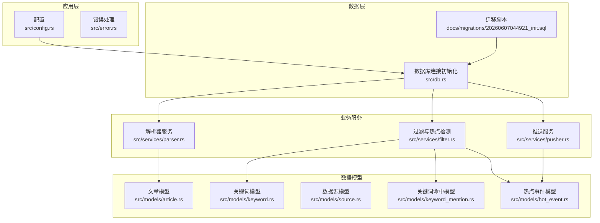
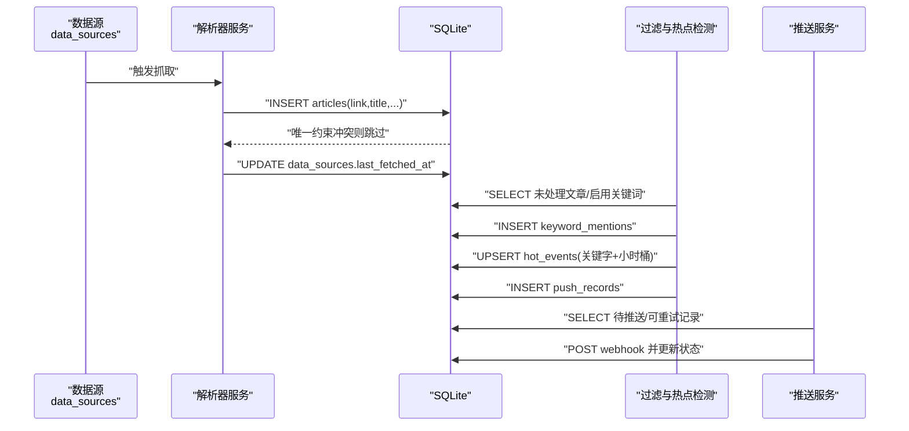
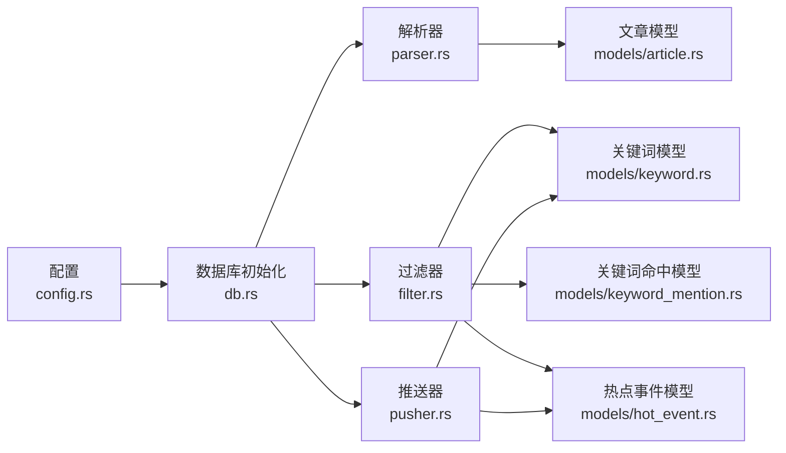

# 数据完整性问题

<cite>
**本文引用的文件**
- [src/db.rs](file://src/db.rs)
- [src/error.rs](file://src/error.rs)
- [docs/migrations/20260607044921_init.sql](file://docs/migrations/20260607044921_init.sql)
- [src/config.rs](file://src/config.rs)
- [src/models/article.rs](file://src/models/article.rs)
- [src/models/keyword.rs](file://src/models/keyword.rs)
- [src/models/source.rs](file://src/models/source.rs)
- [src/models/keyword_mention.rs](file://src/models/keyword_mention.rs)
- [src/models/hot_event.rs](file://src/models/hot_event.rs)
- [src/services/filter.rs](file://src/services/filter.rs)
- [src/services/parser.rs](file://src/services/parser.rs)
- [src/services/pusher.rs](file://src/services/pusher.rs)
- [Cargo.toml](file://Cargo.toml)
</cite>

## 目录
1. [简介](#简介)
2. [项目结构](#项目结构)
3. [核心组件](#核心组件)
4. [架构总览](#架构总览)
5. [详细组件分析](#详细组件分析)
6. [依赖关系分析](#依赖关系分析)
7. [性能考量](#性能考量)
8. [故障排查指南](#故障排查指南)
9. [结论](#结论)
10. [附录](#附录)

## 简介
本指南聚焦于AI趋势监控系统在SQLite上的数据完整性问题诊断与修复，覆盖以下主题：
- 数据库约束违反（唯一性、外键、非空）
- 数据重复与去重策略
- 字段缺失与默认值处理
- 表结构不一致的识别与修复
- 数据验证规则、业务逻辑检查与数据清理工具使用
- 数据库迁移失败、版本不兼容、数据丢失的恢复策略
- 备份与恢复流程及一致性检查最佳实践

## 项目结构
系统采用Rust后端，基于SQLite存储，通过SQLx进行数据库访问；数据模型定义在models目录，服务层负责解析、过滤与推送；迁移脚本位于docs/migrations。

图表来源
- [src/config.rs:1-58](file://src/config.rs#L1-L58)
- [src/db.rs:10-27](file://src/db.rs#L10-L27)
- [docs/migrations/20260607044921_init.sql:1-118](file://docs/migrations/20260607044921_init.sql#L1-L118)
- [src/services/parser.rs:90-185](file://src/services/parser.rs#L90-L185)
- [src/services/filter.rs:13-208](file://src/services/filter.rs#L13-L208)
- [src/services/pusher.rs:11-43](file://src/services/pusher.rs#L11-L43)
- [src/models/article.rs:1-25](file://src/models/article.rs#L1-L25)
- [src/models/keyword.rs:1-32](file://src/models/keyword.rs#L1-L32)
- [src/models/source.rs:1-39](file://src/models/source.rs#L1-L39)
- [src/models/keyword_mention.rs:1-12](file://src/models/keyword_mention.rs#L1-L12)
- [src/models/hot_event.rs:1-15](file://src/models/hot_event.rs#L1-L15)

章节来源
- [src/config.rs:1-58](file://src/config.rs#L1-L58)
- [src/db.rs:10-27](file://src/db.rs#L10-L27)
- [docs/migrations/20260607044921_init.sql:1-118](file://docs/migrations/20260607044921_init.sql#L1-L118)

## 核心组件
- 数据库连接与约束启用：初始化时开启WAL模式与外键强制校验，确保事务一致性与参照完整性。
- 迁移脚本：定义了API令牌、数据源、文章、关键词、关键词命中、热点事件、推送渠道、推送记录等表及其索引与约束。
- 错误处理：统一映射数据库异常为HTTP状态码，便于上层识别约束冲突、资源不存在等问题。
- 业务服务：
  - 解析器：并发抓取与解析RSS/Atom，插入文章并跳过重复。
  - 过滤器：匹配关键词、统计小时计数、计算历史均值与标准差、生成热点事件并写入推送记录。
  - 推送器：按状态与重试时间轮询推送记录，失败按指数退避重试。

章节来源
- [src/db.rs:10-27](file://src/db.rs#L10-L27)
- [docs/migrations/20260607044921_init.sql:1-118](file://docs/migrations/20260607044921_init.sql#L1-L118)
- [src/error.rs:8-59](file://src/error.rs#L8-L59)
- [src/services/parser.rs:90-185](file://src/services/parser.rs#L90-L185)
- [src/services/filter.rs:13-208](file://src/services/filter.rs#L13-L208)
- [src/services/pusher.rs:11-43](file://src/services/pusher.rs#L11-L43)

## 架构总览
下图展示从数据源到热点事件与推送的关键数据流，以及各层对数据完整性的保障机制。

图表来源
- [src/services/parser.rs:120-182](file://src/services/parser.rs#L120-L182)
- [src/services/filter.rs:13-208](file://src/services/filter.rs#L13-L208)
- [src/services/pusher.rs:11-43](file://src/services/pusher.rs#L11-L43)
- [docs/migrations/20260607044921_init.sql:33-43](file://docs/migrations/20260607044921_init.sql#L33-L43)
- [docs/migrations/20260607044921_init.sql:65-70](file://docs/migrations/20260607044921_init.sql#L65-L70)
- [docs/migrations/20260607044921_init.sql:78-86](file://docs/migrations/20260607044921_init.sql#L78-L86)
- [docs/migrations/20260607044921_init.sql:105-115](file://docs/migrations/20260607044921_init.sql#L105-L115)

## 详细组件分析

### 数据库约束与表结构
- 唯一性约束
  - API令牌表：令牌唯一，防止重复注册。
  - 文章表：链接唯一，避免重复抓取相同文章。
  - 关键词表：关键词唯一，保证匹配规则不重复。
  - 推送记录表：关键字+渠道组合唯一，避免重复推送。
- 外键约束与级联删除
  - 文章引用数据源，删除数据源时自动删除其文章。
  - 关键词命中引用关键词与文章，删除时级联清理。
  - 热点事件与推送记录引用对应实体，删除时级联清理。
- 非空与默认值
  - 多数字段设置默认值，减少空值带来的业务歧义。
  - 时间戳字段默认当前时间，便于排序与统计。
- 索引
  - 文章表：按处理时间、来源、抓取时间建立索引，提升查询效率。
  - 关键词命中：按关键词与文章建立索引，加速匹配统计。
  - 热点事件：按关键字与小时桶建立索引，支持高效聚合。
  - 推送记录：按状态建立索引，便于轮询待处理记录。

章节来源
- [docs/migrations/20260607044921_init.sql:4-12](file://docs/migrations/20260607044921_init.sql#L4-L12)
- [docs/migrations/20260607044921_init.sql:33-47](file://docs/migrations/20260607044921_init.sql#L33-L47)
- [docs/migrations/20260607044921_init.sql:52-60](file://docs/migrations/20260607044921_init.sql#L52-L60)
- [docs/migrations/20260607044921_init.sql:65-73](file://docs/migrations/20260607044921_init.sql#L65-L73)
- [docs/migrations/20260607044921_init.sql:78-89](file://docs/migrations/20260607044921_init.sql#L78-L89)
- [docs/migrations/20260607044921_init.sql:105-118](file://docs/migrations/20260607044921_init.sql#L105-L118)

### 数据模型与字段语义
- 文章模型：包含来源ID、链接、标题、摘要、内容、发布时间、抓取时间与处理时间。
- 关键词模型：包含关键词、大小写敏感标志、启用状态、阈值参数与创建时间。
- 数据源模型：包含类型、名称、URL、配置JSON、启用状态、抓取间隔与时间戳。
- 关键词命中模型：记录关键词与文章的关联及匹配时间。
- 热点事件模型：记录关键字在小时粒度的计数与历史统计。

章节来源
- [src/models/article.rs:5-16](file://src/models/article.rs#L5-L16)
- [src/models/keyword.rs:5-14](file://src/models/keyword.rs#L5-L14)
- [src/models/source.rs:5-19](file://src/models/source.rs#L5-L19)
- [src/models/keyword_mention.rs:5-11](file://src/models/keyword_mention.rs#L5-L11)
- [src/models/hot_event.rs:5-14](file://src/models/hot_event.rs#L5-L14)

### 业务流程与数据完整性
- 解析器插入文章时若遇到唯一约束冲突，则跳过重复项并记录日志，避免破坏一致性。
- 过滤器在生成热点事件前执行“先删后插”的UPSERT策略，确保同一小时桶仅保留一条记录，避免重复计数。
- 推送器在更新推送记录状态时采用乐观锁比较，避免并发更新导致的状态错乱。

章节来源
- [src/services/parser.rs:129-151](file://src/services/parser.rs#L129-L151)
- [src/services/filter.rs:242-267](file://src/services/filter.rs#L242-L267)
- [src/services/pusher.rs:155-181](file://src/services/pusher.rs#L155-L181)

### 数据验证规则与业务检查清单
- 入参校验
  - 关键词创建/更新请求包含必要字段与可选字段，建议在API层进行字段存在性与类型校验。
- 业务规则
  - 关键词命中必须同时存在有效关键词与文章。
  - 热点事件的小时桶格式需严格，过滤器以当前UTC小时字符串作为键。
  - 推送记录必须关联有效的热点事件与推送渠道。
- 默认值与空值
  - 对于可选时间字段，建议在入库前明确是否允许为空或使用默认时间戳。
  - 配置JSON字段应进行基本格式校验，确保后续解析不会失败。

章节来源
- [src/models/keyword.rs:16-31](file://src/models/keyword.rs#L16-L31)
- [src/services/filter.rs:86-129](file://src/services/filter.rs#L86-L129)
- [src/services/pusher.rs:52-113](file://src/services/pusher.rs#L52-L113)

### 数据清理工具与策略
- 清理重复文章
  - 基于文章链接唯一约束，重复插入会失败；可采用“插入失败即忽略”的策略，或在批量导入前先去重。
- 清理无效推送记录
  - 对已失效的热点事件或被删除的关键词，利用外键级联删除自动清理相关推送记录。
- 清理过期数据
  - 可定期清理超过保留周期的文章、关键词命中与热点事件，结合索引优化查询。

章节来源
- [docs/migrations/20260607044921_init.sql:33-43](file://docs/migrations/20260607044921_init.sql#L33-L43)
- [src/services/parser.rs:129-151](file://src/services/parser.rs#L129-L151)

## 依赖关系分析
- 组件耦合
  - 服务层通过SQLx访问数据库，模型层提供序列化/反序列化接口，配置层提供运行参数。
  - 过滤器依赖关键词、文章、热点事件与推送记录模块；推送器依赖热点事件与关键词模块。
- 外部依赖
  - SQLx用于SQLite访问与迁移；feed-rs用于RSS/Atom解析；reqwest用于Webhook推送；aho-corasick用于高性能多模式匹配。

图表来源
- [src/config.rs:1-58](file://src/config.rs#L1-L58)
- [src/db.rs:10-27](file://src/db.rs#L10-L27)
- [src/services/parser.rs:90-185](file://src/services/parser.rs#L90-L185)
- [src/services/filter.rs:13-208](file://src/services/filter.rs#L13-L208)
- [src/services/pusher.rs:11-43](file://src/services/pusher.rs#L11-L43)
- [src/models/article.rs:1-25](file://src/models/article.rs#L1-L25)
- [src/models/keyword.rs:1-32](file://src/models/keyword.rs#L1-L32)
- [src/models/keyword_mention.rs:1-12](file://src/models/keyword_mention.rs#L1-L12)
- [src/models/hot_event.rs:1-15](file://src/models/hot_event.rs#L1-L15)

章节来源
- [Cargo.toml:6-46](file://Cargo.toml#L6-L46)

## 性能考量
- 并发控制
  - 解析器使用信号量限制并发抓取数量，避免资源争用。
  - 推送器按状态与重试时间轮询，降低无效请求。
- 查询优化
  - 为高频查询字段建立索引，减少全表扫描。
- 写入策略
  - 过滤器采用UPSERT策略，避免重复写入；解析器跳过重复插入，减少写放大。

章节来源
- [src/services/parser.rs:94-185](file://src/services/parser.rs#L94-L185)
- [src/services/pusher.rs:11-43](file://src/services/pusher.rs#L11-L43)
- [docs/migrations/20260607044921_init.sql:45-47](file://docs/migrations/20260607044921_init.sql#L45-L47)
- [docs/migrations/20260607044921_init.sql:72-73](file://docs/migrations/20260607044921_init.sql#L72-L73)
- [docs/migrations/20260607044921_init.sql:88-89](file://docs/migrations/20260607044921_init.sql#L88-L89)
- [docs/migrations/20260607044921_init.sql:117](file://docs/migrations/20260607044921_init.sql#L117)

## 故障排查指南

### 1. 数据库约束违反（唯一性/外键/非空）
- 现象
  - 插入文章时报链接重复；创建关键词时报词重复；创建推送记录时报重复。
- 诊断
  - 检查唯一约束定义与输入数据是否满足唯一性。
  - 检查外键是否存在且未被删除。
  - 检查非空字段是否传入了空值。
- 修复
  - 去重后再插入，或使用UPSERT策略。
  - 修复缺失的引用实体，或删除无效引用。
  - 为缺失字段提供默认值或修正调用方。

章节来源
- [docs/migrations/20260607044921_init.sql:33-43](file://docs/migrations/20260607044921_init.sql#L33-L43)
- [docs/migrations/20260607044921_init.sql:52-60](file://docs/migrations/20260607044921_init.sql#L52-L60)
- [docs/migrations/20260607044921_init.sql:105-115](file://docs/migrations/20260607044921_init.sql#L105-L115)

### 2. 数据重复
- 现象
  - 同一链接的文章多次出现；同一小时桶的热点事件重复。
- 诊断
  - 查看唯一约束冲突日志；核对解析器的去重逻辑。
- 修复
  - 在解析器中跳过重复插入；在过滤器中使用UPSERT策略覆盖旧记录。

章节来源
- [src/services/parser.rs:129-151](file://src/services/parser.rs#L129-L151)
- [src/services/filter.rs:242-267](file://src/services/filter.rs#L242-L267)

### 3. 字段缺失与默认值
- 现象
  - 某些字段为空导致业务异常。
- 诊断
  - 核对模型字段与数据库列定义，确认默认值是否生效。
- 修复
  - 在API层补齐必填字段；在入库前填充默认值。

章节来源
- [src/models/article.rs:5-16](file://src/models/article.rs#L5-L16)
- [src/models/keyword.rs:5-14](file://src/models/keyword.rs#L5-L14)
- [src/models/source.rs:5-19](file://src/models/source.rs#L5-L19)

### 4. 表结构不一致
- 现象
  - 新增字段后查询报错；索引缺失导致慢查询。
- 诊断
  - 对比迁移脚本与实际表结构；检查索引是否存在。
- 修复
  - 使用迁移脚本补充缺失字段与索引；回滚/重放迁移确保所有节点一致。

章节来源
- [docs/migrations/20260607044921_init.sql:1-118](file://docs/migrations/20260607044921_init.sql#L1-L118)

### 5. 数据库迁移失败
- 现象
  - 迁移执行中断；不同节点版本不一致。
- 诊断
  - 查看迁移日志与数据库版本号；确认迁移顺序。
- 修复
  - 逐条重放失败的迁移；在测试环境验证后再上线；必要时回滚至上一个稳定版本。

章节来源
- [docs/migrations/20260607044921_init.sql:1-118](file://docs/migrations/20260607044921_init.sql#L1-L118)

### 6. 版本不兼容
- 现象
  - 新旧二进制在相同数据库上运行异常。
- 诊断
  - 比较二进制与迁移脚本版本；确认SQLx与SQLite版本兼容性。
- 修复
  - 升级数据库至最新迁移；确保所有实例使用相同版本。

章节来源
- [Cargo.toml:14-15](file://Cargo.toml#L14-L15)

### 7. 数据丢失
- 现象
  - 文章、关键词命中或热点事件数据消失。
- 诊断
  - 检查外键级联删除是否误触发；核对最近的删除操作与迁移。
- 修复
  - 通过备份恢复；在过滤器与解析器中增加幂等性保护；完善审计日志。

章节来源
- [docs/migrations/20260607044921_init.sql:35](file://docs/migrations/20260607044921_init.sql#L35)
- [docs/migrations/20260607044921_init.sql:67-68](file://docs/migrations/20260607044921_init.sql#L67-L68)
- [docs/migrations/20260607044921_init.sql:107-108](file://docs/migrations/20260607044921_init.sql#L107-L108)

### 8. 备份与恢复流程
- 备份
  - 复制SQLite文件；或导出SQL（含数据与DDL）。
- 恢复
  - 将备份文件还原到目标路径；执行迁移脚本；验证数据完整性。
- 一致性检查
  - 校验关键表的记录数与唯一约束；检查热点事件与关键词命中的一致性；验证推送记录状态。

章节来源
- [src/db.rs:12-26](file://src/db.rs#L12-L26)
- [docs/migrations/20260607044921_init.sql:1-118](file://docs/migrations/20260607044921_init.sql#L1-L118)

## 结论
通过严格的数据库约束、幂等的业务写入策略与完善的日志监控，系统能够在高并发场景下维持较好的数据一致性。建议持续完善自动化校验与回滚机制，并在每次变更前进行充分的迁移与回归测试。

## 附录

### A. 数据一致性检查清单
- 唯一性：文章链接、关键词词、API令牌、推送记录组合键。
- 外键：文章→数据源、关键词命中→关键词/文章、热点事件→关键词、推送记录→热点事件/渠道。
- 默认值：时间戳、布尔标志、数值阈值。
- 索引：高频查询字段与分组字段。

章节来源
- [docs/migrations/20260607044921_init.sql:33-43](file://docs/migrations/20260607044921_init.sql#L33-L43)
- [docs/migrations/20260607044921_init.sql:52-60](file://docs/migrations/20260607044921_init.sql#L52-L60)
- [docs/migrations/20260607044921_init.sql:65-73](file://docs/migrations/20260607044921_init.sql#L65-L73)
- [docs/migrations/20260607044921_init.sql:78-89](file://docs/migrations/20260607044921_init.sql#L78-L89)
- [docs/migrations/20260607044921_init.sql:105-115](file://docs/migrations/20260607044921_init.sql#L105-L115)