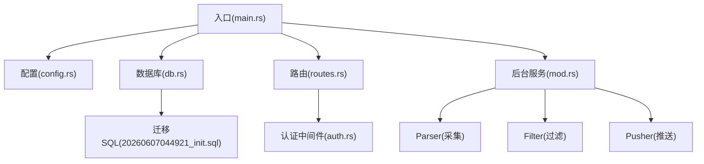
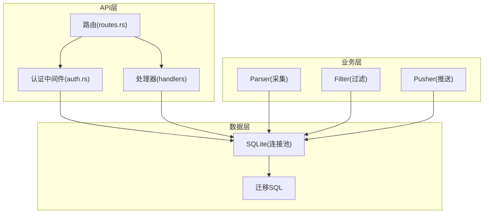
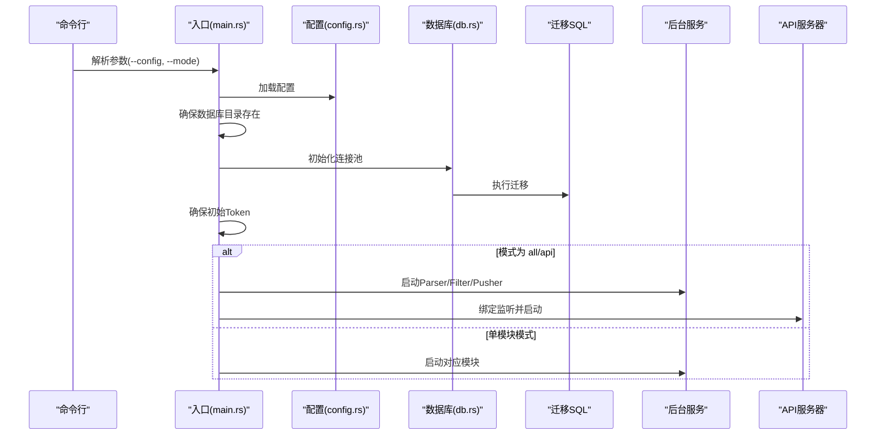
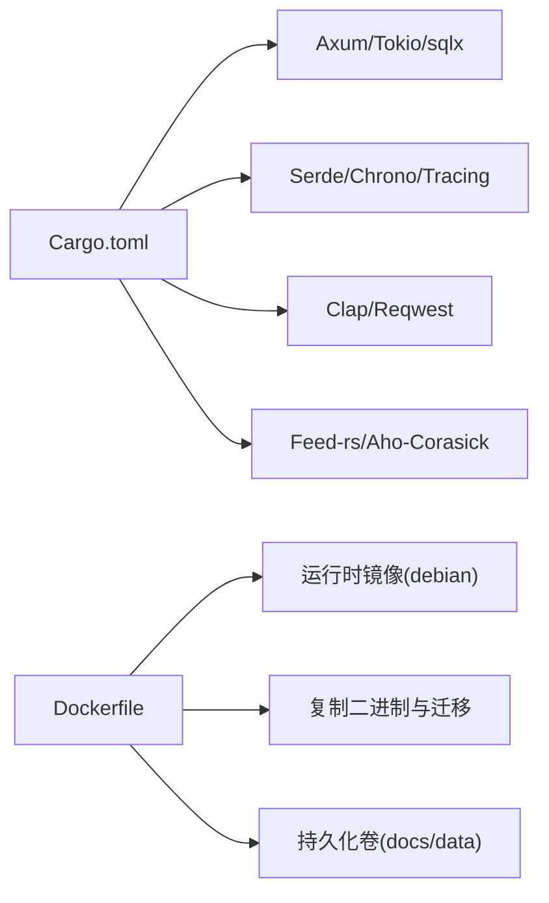
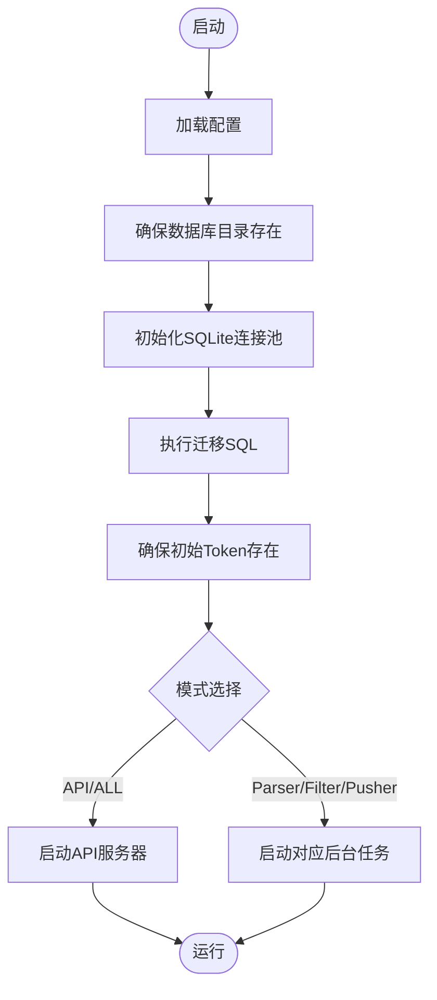

# 系统故障处理

<cite>
**本文引用的文件**
- [README.md](file://README.md)
- [main.rs](file://src/main.rs)
- [config.rs](file://src/config.rs)
- [error.rs](file://src/error.rs)
- [db.rs](file://src/db.rs)
- [routes.rs](file://src/routes.rs)
- [Dockerfile](file://Dockerfile)
- [Cargo.toml](file://Cargo.toml)
- [20260607044921_init.sql](file://docs/migrations/20260607044921_init.sql)
- [auth.rs](file://src/middleware/auth.rs)
- [query.rs](file://src/handlers/query.rs)
</cite>

## 目录
1. [简介](#简介)
2. [项目结构](#项目结构)
3. [核心组件](#核心组件)
4. [架构总览](#架构总览)
5. [详细组件分析](#详细组件分析)
6. [依赖关系分析](#依赖关系分析)
7. [性能考量](#性能考量)
8. [故障排查指南](#故障排查指南)
9. [结论](#结论)
10. [附录](#附录)

## 简介
本指南面向运维与开发人员，聚焦于AI趋势监控系统的系统级故障处理与应急响应。内容覆盖服务启动失败、配置加载错误、容器化部署问题、数据库连接失败、网络超时、文件权限问题等常见场景，并提供日志分析技巧、错误追踪方法以及紧急情况下的应急预案（如数据备份恢复、系统重启流程、服务降级策略）。

## 项目结构
系统采用Rust后端、Axum框架、SQLite数据库与三段式后台模块（Parser/Filter/Pusher）。入口程序负责解析命令行参数、加载配置、初始化数据库连接池与迁移、确保初始Token存在，并根据模式选择性启动API与后台任务；路由层提供健康检查与受保护的API；中间件负责认证；错误处理统一返回格式。

图表来源
- [main.rs:64-163](file://src/main.rs#L64-L163)
- [config.rs:51-58](file://src/config.rs#L51-L58)
- [db.rs:12-26](file://src/db.rs#L12-L26)
- [routes.rs:14-70](file://src/routes.rs#L14-L70)
- [Dockerfile:59-61](file://Dockerfile#L59-L61)
- [20260607044921_init.sql:1-118](file://docs/migrations/20260607044921_init.sql#L1-L118)

章节来源
- [README.md:216-257](file://README.md#L216-L257)
- [main.rs:64-163](file://src/main.rs#L64-L163)
- [routes.rs:14-70](file://src/routes.rs#L14-L70)

## 核心组件
- 入口与控制流：命令行解析、配置加载、数据库初始化与迁移、后台任务调度、API服务器启动。
- 配置系统：TOML配置文件映射为结构体，包含服务监听、数据库路径、认证初始Token、Parser/Filter/Pusher运行参数。
- 错误处理：统一错误枚举与响应格式，数据库错误自动转为500。
- 认证中间件：从Authorization头提取Bearer Token，数据库校验、过期检查、最后使用时间异步更新、注入请求上下文。
- 路由与触发：健康检查、受保护API、手动触发Filter/Pusher的接口。

章节来源
- [main.rs:17-25](file://src/main.rs#L17-L25)
- [config.rs:3-49](file://src/config.rs#L3-L49)
- [error.rs:8-50](file://src/error.rs#L8-L50)
- [auth.rs:18-57](file://src/middleware/auth.rs#L18-L57)
- [routes.rs:14-70](file://src/routes.rs#L14-L70)

## 架构总览
系统采用“管道模式”的后台模块协作：Parser负责RSS采集并写入文章表；Filter周期性进行关键词匹配与统计突发检测，生成热点事件与推送记录；Pusher周期性轮询待推送记录，通过Webhook推送并带指数退避重试。

图表来源
- [routes.rs:14-70](file://src/routes.rs#L14-L70)
- [auth.rs:18-57](file://src/middleware/auth.rs#L18-L57)
- [db.rs:12-26](file://src/db.rs#L12-L26)
- [20260607044921_init.sql:1-118](file://docs/migrations/20260607044921_init.sql#L1-L118)

## 详细组件分析

### 启动流程与模式控制
- 命令行参数：--config指定配置文件路径；--mode支持all/api/parser/filter/pusher。
- 模式行为：
  - all/api：启动三个后台任务并在前台运行API服务器。
  - parser/filter/pusher：仅运行对应模块。
- 初始化步骤：创建数据库目录、初始化连接池、执行迁移、确保至少一个API Token存在（首次启动自动生成并日志提示）。

图表来源
- [main.rs:64-163](file://src/main.rs#L64-L163)
- [config.rs:51-58](file://src/config.rs#L51-L58)
- [db.rs:12-26](file://src/db.rs#L12-L26)
- [20260607044921_init.sql:1-118](file://docs/migrations/20260607044921_init.sql#L1-L118)

章节来源
- [main.rs:64-163](file://src/main.rs#L64-L163)
- [README.md:38-84](file://README.md#L38-L84)

### 配置加载与环境变量
- 配置文件：默认路径config.toml，TOML格式映射到结构体。
- 关键字段：server.host/port、database.path、auth.initial_token、parser/filter/pusher运行参数。
- 环境变量：日志级别通过tracing-subscriber的环境过滤器设置。

章节来源
- [config.rs:51-58](file://src/config.rs#L51-L58)
- [main.rs:66](file://src/main.rs#L66)
- [Cargo.toml:25-27](file://Cargo.toml#L25-L27)

### 数据库连接与迁移
- 连接池：SQLite，最大连接数5，启用WAL模式与外键约束。
- 迁移：首次启动自动执行docs/migrations中的SQL。
- 表结构：包含api_tokens、data_sources、articles、keywords、hot_events、push_channels、push_records等。

章节来源
- [db.rs:12-26](file://src/db.rs#L12-L26)
- [20260607044921_init.sql:1-118](file://docs/migrations/20260607044921_init.sql#L1-L118)
- [README.md:204-215](file://README.md#L204-L215)

### 认证中间件与API安全
- 提取Authorization头中的Bearer Token。
- 数据库校验（非撤销）、过期检查。
- 成功后异步更新last_used_at，注入ApiToken到请求扩展。
- 仅/api/v1/*受保护，/health免认证。

章节来源
- [auth.rs:18-57](file://src/middleware/auth.rs#L18-L57)
- [routes.rs:14-70](file://src/routes.rs#L14-L70)
- [README.md:123-134](file://README.md#L123-L134)

### 错误处理与统一响应
- 错误类型：NotFound/BadRequest/Unauthorized/Conflict/Internal/Database。
- 响应格式：统一error.code与error.message，数据库错误映射为500/DATABASE_ERROR。
- 日志：数据库错误通过tracing::error记录。

章节来源
- [error.rs:8-50](file://src/error.rs#L8-L50)
- [README.md:173-202](file://README.md#L173-L202)

### 手动触发与健康检查
- 健康检查：/health返回{"status":"ok"}。
- 手动触发：/api/v1/trigger/filter与/api/v1/trigger/pusher分别执行一次Filter/Pusher迭代。

章节来源
- [routes.rs:61-63](file://src/routes.rs#L61-L63)
- [query.rs:150-164](file://src/handlers/query.rs#L150-L164)

## 依赖关系分析
- 运行时依赖：Axum/Tokio/sqlx/serde/chrono/tracing/clap等。
- 生产构建优化：Release配置启用LTO、单代码生成单元、符号剥离、panic abort。
- 容器镜像：多阶段构建，运行时仅包含必要证书与二进制，暴露3000端口，持久化卷/docs/data。

图表来源
- [Cargo.toml:6-67](file://Cargo.toml#L6-L67)
- [Dockerfile:32-61](file://Dockerfile#L32-L61)

章节来源
- [Cargo.toml:6-67](file://Cargo.toml#L6-L67)
- [Dockerfile:1-61](file://Dockerfile#L1-L61)

## 性能考量
- 连接池与WAL：SQLite连接池最大5，开启WAL提升并发读写能力。
- 任务调度：Parser/Filter/Pusher以独立Tokio任务运行，避免阻塞。
- 重试策略：Pusher指数退避，降低对下游Webhook服务的压力。
- 构建优化：Release配置最大化优化，适合生产部署。

章节来源
- [db.rs:12-26](file://src/db.rs#L12-L26)
- [main.rs:97-105](file://src/main.rs#L97-L105)
- [README.md:282-289](file://README.md#L282-L289)
- [Cargo.toml:48-56](file://Cargo.toml#L48-L56)

## 故障排查指南

### 一、服务启动失败
- 症状
  - 启动即退出或无法绑定端口。
  - 首次启动无初始Token日志。
- 常见原因
  - 端口被占用或权限不足。
  - 配置文件路径错误或不可读。
  - 数据库目录无写权限。
  - Docker容器未挂载持久化卷或端口映射错误。
- 诊断步骤
  - 检查日志：确认tracing::info/warn输出，定位初始化阶段。
  - 验证配置：--config指向正确路径，字段完整。
  - 验证数据库：数据库文件是否存在、目录可写。
  - Docker：确认端口映射、卷挂载、ENTRYPOINT/CMD参数。
- 修复建议
  - 更换端口或释放占用端口。
  - 使用绝对路径加载配置，修正权限。
  - 在容器内创建并授权docs/data目录。
  - 使用--mode api仅启动API，便于快速验证。

章节来源
- [main.rs:66-85](file://src/main.rs#L66-L85)
- [main.rs:115-121](file://src/main.rs#L115-L121)
- [Dockerfile:55-61](file://Dockerfile#L55-L61)

### 二、配置加载错误
- 症状
  - 启动时报错“配置加载失败”。
  - 配置项缺失导致默认值异常。
- 常见原因
  - config.toml格式错误（TOML语法）。
  - 关键字段缺失（如database.path为空）。
- 诊断步骤
  - 使用最小化配置文件，逐步增加字段定位问题。
  - 查看启动日志中配置加载调用位置。
- 修复建议
  - 对照README示例修正TOML格式。
  - 确保database.path存在且可写。

章节来源
- [config.rs:51-58](file://src/config.rs#L51-L58)
- [README.md:91-122](file://README.md#L91-L122)

### 三、容器化部署问题
- 症状
  - 容器启动后立即退出。
  - API无法访问或端口不通。
  - 数据未持久化。
- 常见原因
  - ENTRYPOINT/CMD参数错误。
  - 端口未映射或容器内端口不一致。
  - 未挂载持久化卷导致数据库文件丢失。
- 诊断步骤
  - 查看容器日志，确认是否执行迁移与监听。
  - 检查容器内端口与Dockerfile EXPOSE一致。
  - 验证卷挂载路径与docs/data权限。
- 修复建议
  - 使用默认ENTRYPOINT与CMD参数。
  - 映射容器端口至宿主机。
  - 挂载持久化卷并确保权限。

章节来源
- [Dockerfile:59-61](file://Dockerfile#L59-L61)
- [Dockerfile:55-56](file://Dockerfile#L55-L56)

### 四、数据库连接失败
- 症状
  - 启动时报数据库连接错误或迁移失败。
  - API调用出现500/DATABASE_ERROR。
- 常见原因
  - database.path指向不可写路径。
  - 文件权限不足或磁盘空间不足。
  - SQLite文件损坏或被其他进程锁定。
- 诊断步骤
  - 检查数据库目录与文件权限。
  - 查看迁移执行日志与tracing::error。
  - 使用SQLite命令行工具验证数据库一致性。
- 修复建议
  - 授权数据库目录与文件。
  - 清理磁盘空间或更换存储路径。
  - 备份后重建数据库（见“应急响应”）。

章节来源
- [db.rs:12-26](file://src/db.rs#L12-L26)
- [error.rs:31-38](file://src/error.rs#L31-L38)
- [README.md:74-77](file://README.md#L74-L77)

### 五、网络超时与外部服务异常
- 症状
  - Parser采集RSS超时或失败。
  - Pusher推送Webhook返回非2xx或超时。
- 常见原因
  - 网络不稳定或DNS解析失败。
  - 目标站点限流或防火墙拦截。
  - Webhook URL配置错误或服务不可达。
- 诊断步骤
  - 使用curl/浏览器验证RSS与Webhook可达性。
  - 检查parser/pusher超时与并发参数。
  - 查看日志中具体错误信息与重试记录。
- 修复建议
  - 调整default_timeout_seconds与max_concurrent_fetches。
  - 校正Webhook URL，确保网络连通。
  - 临时禁用部分数据源或渠道以隔离问题。

章节来源
- [config.rs:30-34](file://src/config.rs#L30-L34)
- [README.md:282-289](file://README.md#L282-L289)

### 六、文件权限问题
- 症状
  - 启动时报目录创建/打开失败。
  - 数据库文件无法写入。
- 常见原因
  - docs/data目录权限不足。
  - 容器内用户与宿主权限不匹配。
- 诊断步骤
  - 检查目录属主与权限。
  - 在容器内尝试创建测试文件。
- 修复建议
  - 修改目录权限或属主。
  - 使用正确的用户ID运行容器并映射卷。

章节来源
- [main.rs:71-75](file://src/main.rs#L71-L75)
- [Dockerfile:55-56](file://Dockerfile#L55-L56)

### 七、日志分析与错误追踪
- 日志级别：通过环境过滤器设置，建议在排障时设为更详细级别。
- 关键日志点
  - 初始化：数据库目录创建、连接池初始化、迁移执行。
  - 启动：监听地址绑定、API服务器启动。
  - 运行：Parser/Filter/Pusher循环日志。
  - 错误：tracing::error记录的数据库错误。
- 建议
  - 使用容器日志收集与集中化存储。
  - 对高频错误建立告警阈值。

章节来源
- [main.rs:66](file://src/main.rs#L66)
- [error.rs:32](file://src/error.rs#L32)
- [README.md:35](file://README.md#L35)

### 八、认证相关问题
- 症状
  - 401 UNAUTHORIZED：缺少或格式错误的Authorization头。
  - 401 UNAUTHORIZED：Token无效/已撤销/已过期。
- 诊断步骤
  - 检查Authorization头格式是否为Bearer。
  - 校验Token是否存在于api_tokens且未撤销、未过期。
- 修复建议
  - 重新创建有效Token并妥善保存。
  - 更新客户端请求头。

章节来源
- [auth.rs:23-44](file://src/middleware/auth.rs#L23-L44)
- [README.md:123-134](file://README.md#L123-L134)

### 九、应急响应预案

#### 1) 数据备份与恢复
- 备份
  - 停止服务后复制SQLite数据库文件与docs/data目录。
  - 记录当前配置文件与版本信息。
- 恢复
  - 将备份文件还原到相同路径。
  - 确认权限与SELinux/AppArmor策略。
  - 启动服务并验证API与后台任务正常。

章节来源
- [db.rs:12-26](file://src/db.rs#L12-L26)
- [Dockerfile:55-56](file://Dockerfile#L55-L56)

#### 2) 系统重启流程
- 步骤
  - 记录当前运行模式与配置。
  - 停止API与后台任务（优雅关闭）。
  - 检查配置与数据库状态。
  - 以相同模式重启服务。
- 注意
  - 单模块模式下需等待Ctrl+C信号或外部停止指令。

章节来源
- [main.rs:122-133](file://src/main.rs#L122-L133)
- [main.rs:134-160](file://src/main.rs#L134-L160)

#### 3) 服务降级策略
- 临时停用高风险模块
  - 停用Pusher以减少对外部Webhook的依赖。
  - 限制Parser并发与超时，避免资源耗尽。
- 降低日志级别
  - 临时降低日志详细程度，减少I/O开销。
- 人工干预
  - 使用/trigger/filter与/trigger/pusher手动执行一次，快速验证功能。

章节来源
- [query.rs:150-164](file://src/handlers/query.rs#L150-L164)
- [config.rs:30-49](file://src/config.rs#L30-L49)

## 结论
本指南提供了从启动、配置、数据库、网络到认证与容器化的全链路故障排查方法，并给出了应急响应预案。建议在生产环境中结合日志与监控体系，定期演练备份与恢复流程，确保系统在异常情况下能够快速收敛与恢复。

## 附录

### A. 常见错误码与响应格式
- 统一错误响应格式：{"error":{"code":"<ERROR_CODE>","message":"<description>"}}
- 错误码对照：400(BAD_REQUEST)、401(UNAUTHORIZED)、404(NOT_FOUND)、409(CONFLICT)、500(INTERNAL_ERROR/ DATABASE_ERROR)

章节来源
- [README.md:173-202](file://README.md#L173-L202)
- [error.rs:23-50](file://src/error.rs#L23-L50)

### B. 关键流程图：数据库初始化与迁移

图表来源
- [main.rs:66-85](file://src/main.rs#L66-L85)
- [db.rs:12-26](file://src/db.rs#L12-L26)
- [20260607044921_init.sql:1-118](file://docs/migrations/20260607044921_init.sql#L1-L118)