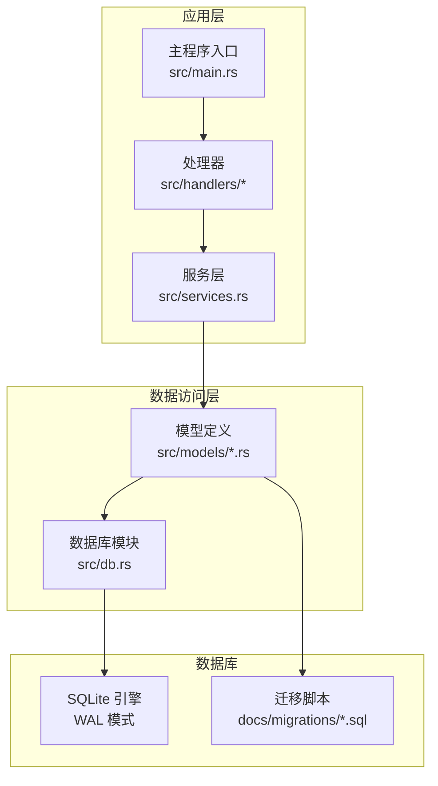
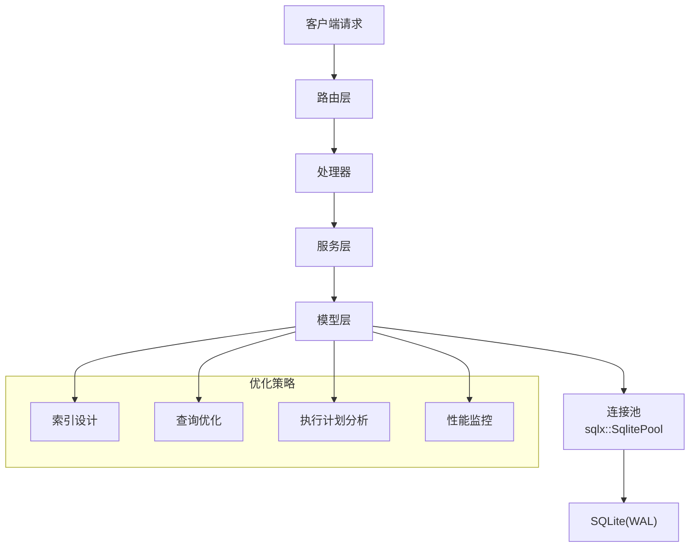
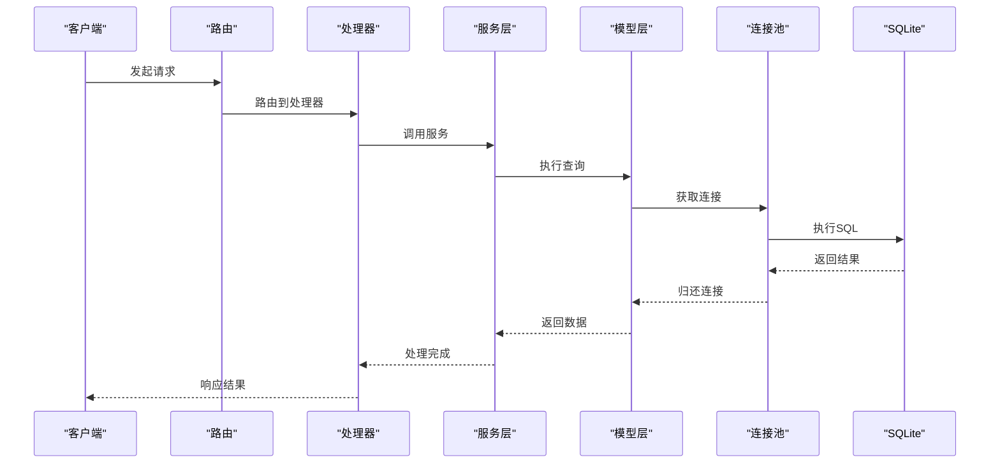
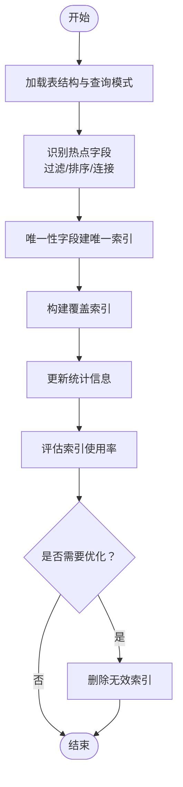
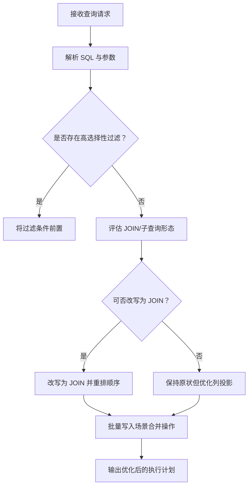
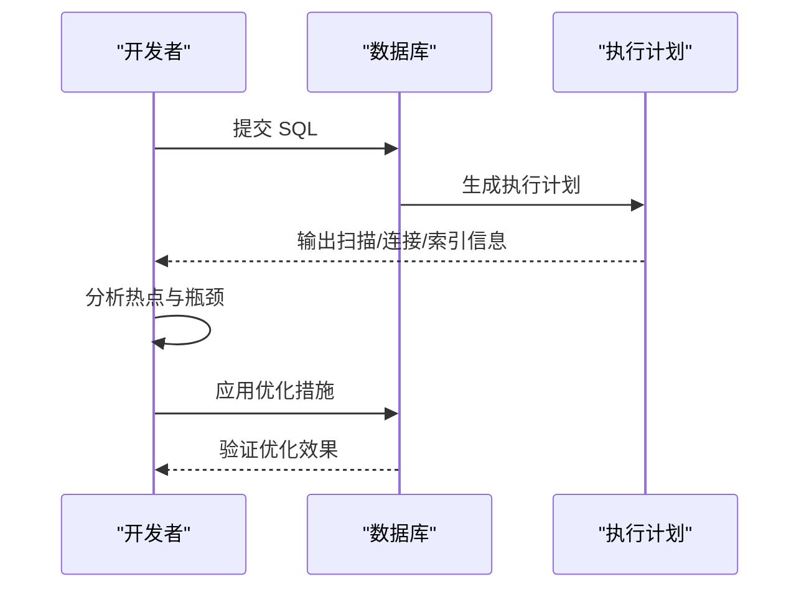
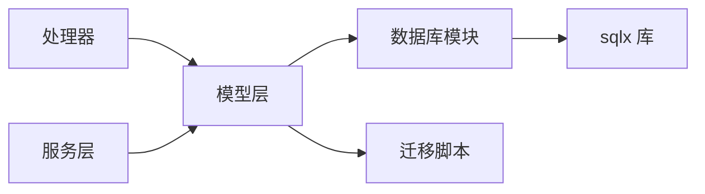

# 性能优化

<cite>
**本文引用的文件**
- [src/db.rs](file://src/db.rs)
- [src/models.rs](file://src/models.rs)
- [src/models/article.rs](file://src/models/article.rs)
- [src/models/channel.rs](file://src/models/channel.rs)
- [src/models/hot_event.rs](file://src/models/hot_event.rs)
- [src/models/keyword.rs](file://src/models/keyword.rs)
- [src/models/push_record.rs](file://src/models/push_record.rs)
- [src/models/source.rs](file://src/models/source.rs)
- [src/models/token.rs](file://src/models/token.rs)
- [docs/migrations/20260607044921_init.sql](file://docs/migrations/20260607044921_init.sql)
- [Cargo.toml](file://Cargo.toml)
- [config.toml](file://config.toml)
- [README.md](file://README.md)
- [openspec/specs/database-schema/spec.md](file://openspec/specs/database-schema/spec.md)
- [openspec/changes/archive/2026-06-07-db-migrations-and-models/specs/database-schema/spec.md](file://openspec/changes/archive/2026-06-07-db-migrations-and-models/specs/database-schema/spec.md)
</cite>

## 目录
1. [简介](#简介)
2. [项目结构](#项目结构)
3. [核心组件](#核心组件)
4. [架构总览](#架构总览)
5. [详细组件分析](#详细组件分析)
6. [依赖关系分析](#依赖关系分析)
7. [性能考量](#性能考量)
8. [故障排查指南](#故障排查指南)
9. [结论](#结论)
10. [附录](#附录)

## 简介
本文件面向 AI-Trend-Tool 的数据库层，系统化梳理索引设计原则、查询优化策略、执行计划分析方法，以及慢查询识别与性能监控指标。结合现有 SQLite/WAL 配置与 sqlx 连接池实践，给出连接池配置、查询缓存与批量处理优化建议，并扩展到数据库参数调优、存储引擎选择、分区策略、读写分离与高可用部署等层面，帮助在当前技术栈下实现稳定高效的数据库性能。

## 项目结构
- 数据库连接与配置集中在后端入口模块中，采用 sqlx 的 SQLite 后端与连接池管理。
- 模型定义位于 models 目录，每个实体对应一个模型文件，便于按表维度进行索引与查询优化分析。
- 初始化迁移脚本定义了基础表结构与约束，是索引与查询优化的依据来源。
- 配置文件提供数据库连接参数，可据此进行连接池与参数调优。

**图表来源**
- [src/db.rs](file://src/db.rs)
- [src/models.rs](file://src/models.rs)
- [docs/migrations/20260607044921_init.sql](file://docs/migrations/20260607044921_init.sql)

**章节来源**
- [src/db.rs](file://src/db.rs)
- [src/models.rs](file://src/models.rs)
- [docs/migrations/20260607044921_init.sql](file://docs/migrations/20260607044921_init.sql)

## 核心组件
- 连接池与初始化：通过统一的数据库模块初始化连接池，确保并发安全与资源复用。
- 模型与实体：每个业务实体对应一个模型文件，便于针对具体表进行索引与查询优化。
- 迁移脚本：定义表结构、主键、外键与约束，是索引设计与查询优化的基础。
- 配置项：数据库连接参数与运行时行为可通过配置文件调整。

**章节来源**
- [src/db.rs](file://src/db.rs)
- [src/models/article.rs](file://src/models/article.rs)
- [src/models/channel.rs](file://src/models/channel.rs)
- [src/models/hot_event.rs](file://src/models/hot_event.rs)
- [src/models/keyword.rs](file://src/models/keyword.rs)
- [src/models/push_record.rs](file://src/models/push_record.rs)
- [src/models/source.rs](file://src/models/source.rs)
- [src/models/token.rs](file://src/models/token.rs)
- [docs/migrations/20260607044921_init.sql](file://docs/migrations/20260607044921_init.sql)
- [config.toml](file://config.toml)

## 架构总览
数据库层采用 SQLite 作为存储后端，启用 WAL 模式以提升并发读写性能；通过 sqlx 的连接池管理实现高并发下的连接复用与超时控制；模型层对各业务实体进行封装，查询逻辑集中在数据访问层，便于统一优化。

**图表来源**
- [src/db.rs](file://src/db.rs)
- [src/models.rs](file://src/models.rs)
- [README.md](file://README.md)

## 详细组件分析

### 连接池与初始化
- 连接池初始化：集中于数据库模块，确保全局唯一且线程安全。
- 并发与超时：根据业务峰值并发与平均响应时间设定最大连接数与超时阈值。
- 连接健康检查：定期验证连接可用性，避免僵尸连接影响性能。
- 配置来源：从配置文件读取连接参数，支持运行时热更新或重启生效。

**图表来源**
- [src/db.rs](file://src/db.rs)
- [src/models.rs](file://src/models.rs)

**章节来源**
- [src/db.rs](file://src/db.rs)
- [config.toml](file://config.toml)

### 索引设计原则
- 唯一性与主键：优先保证主键唯一性，减少重复扫描与排序成本。
- 唯一键冲突：对于唯一约束字段，建立唯一索引以加速去重与冲突检测。
- 查询热点字段：对高频过滤、排序与连接字段建立复合索引，降低全表扫描概率。
- 覆盖索引：将查询所需列纳入索引，避免回表读取，显著提升点查与范围查询性能。
- 统计信息：定期更新统计信息，辅助查询优化器生成合理执行计划。
- 索引维护：避免过度索引导致写入放大，定期评估索引使用率并清理无效索引。

**图表来源**
- [docs/migrations/20260607044921_init.sql](file://docs/migrations/20260607044921_init.sql)
- [src/models.rs](file://src/models.rs)

**章节来源**
- [docs/migrations/20260607044921_init.sql](file://docs/migrations/20260607044921_init.sql)
- [src/models/article.rs](file://src/models/article.rs)
- [src/models/channel.rs](file://src/models/channel.rs)
- [src/models/hot_event.rs](file://src/models/hot_event.rs)
- [src/models/keyword.rs](file://src/models/keyword.rs)
- [src/models/push_record.rs](file://src/models/push_record.rs)
- [src/models/source.rs](file://src/models/source.rs)
- [src/models/token.rs](file://src/models/token.rs)

### 查询优化策略
- 避免 SELECT *：仅返回必要列，减少网络与解析开销。
- 分页与游标：使用 LIMIT/OFFSET 或基于游标的分页，避免大偏移量导致的跳页与排序成本。
- 子查询与 JOIN：优先使用 JOIN 替代嵌套子查询，减少临时结果集。
- 条件裁剪：将高选择性的过滤条件前置，缩小中间结果集规模。
- 批量操作：合并多次写入为批量 INSERT/UPDATE，降低事务开销与锁竞争。
- 参数化查询：统一使用参数绑定，提升缓存命中率与安全性。

**图表来源**
- [src/models.rs](file://src/models.rs)
- [src/db.rs](file://src/db.rs)

**章节来源**
- [src/models.rs](file://src/models.rs)
- [src/db.rs](file://src/db.rs)

### 执行计划分析
- 使用 EXPLAIN QUERY PLAN 或数据库自带的执行计划工具，观察扫描方式、连接顺序与索引使用情况。
- 关注关键指标：总耗时、CPU 时间、I/O 次数、临时表大小、排序与哈希冲突次数。
- 对比优化前后：记录执行计划差异，量化性能收益。
- 定期巡检：对慢查询与高负载时段的典型 SQL 进行计划审查。

**图表来源**
- [src/db.rs](file://src/db.rs)
- [src/models.rs](file://src/models.rs)

**章节来源**
- [src/db.rs](file://src/db.rs)
- [src/models.rs](file://src/models.rs)

### 慢查询识别与性能监控
- 慢查询日志：开启慢查询阈值，记录超过阈值的 SQL 及其执行时间。
- APM/指标：采集 QPS、P95/P99 延迟、连接池等待时间、锁等待与阻塞事件。
- 周期性巡检：对高频接口与报表类查询进行专项优化。
- 回归测试：在变更后对比关键指标，防止性能回退。

**章节来源**
- [src/db.rs](file://src/db.rs)
- [config.toml](file://config.toml)

### 连接池配置
- 最大连接数：根据 CPU 核数与 I/O 能力设置上限，避免过度并发导致上下文切换与锁争用。
- 连接生命周期：设置合理的空闲回收与最大存活时间，平衡内存占用与连接创建开销。
- 超时策略：为获取连接、执行与事务设置合理超时，防止线程池“饿死”。
- 健康检查：周期性探测连接可用性，剔除异常连接。
- 读写分离：在连接池上区分只读与写入连接，提升并发吞吐。

**章节来源**
- [src/db.rs](file://src/db.rs)
- [config.toml](file://config.toml)

### 查询缓存与批量处理
- 查询缓存：对静态或低频更新的数据建立缓存层，减少重复查询。
- 批量写入：合并多条写入为批量操作，减少事务提交次数与锁持有时间。
- 异步批处理：对非实时要求的操作采用队列异步处理，平滑突发流量。
- 缓存一致性：通过 TTL 与失效策略保证缓存与数据库的一致性。

**章节来源**
- [src/db.rs](file://src/db.rs)
- [src/models.rs](file://src/models.rs)

### 数据库参数调优、存储引擎与分区
- SQLite 参数：WAL 模式、页面大小、自动检查点间隔、同步级别等参数需结合工作负载调优。
- 存储引擎：SQLite 适合中小规模与单机部署；若扩展至多副本或多写节点，可考虑 PostgreSQL/MySQL。
- 分区策略：按时间维度对大表进行水平拆分，结合查询谓词进行路由，降低单表扫描范围。
- 统计与归档：定期归档历史数据，保持热数据表规模可控。

**章节来源**
- [README.md](file://README.md)
- [docs/migrations/20260607044921_init.sql](file://docs/migrations/20260607044921_init.sql)

### 读写分离、负载均衡与高可用
- 读写分离：写库承担写入与强一致场景，读库用于报表与查询，通过路由规则分流。
- 负载均衡：在多个读库间轮询或按权重分配，避免单点过载。
- 高可用：主从复制/集群 + 自动故障转移，保障服务连续性；连接池具备重试与熔断能力。
- 监控告警：对延迟、错误率、连接池饱和度与复制延迟进行监控与告警。

**章节来源**
- [src/db.rs](file://src/db.rs)
- [config.toml](file://config.toml)

## 依赖关系分析
- 模块耦合：模型层依赖数据库模块提供的连接池；处理器与服务层通过模型层间接访问数据库。
- 外部依赖：sqlx 作为 ORM/查询库，支持 SQLite/WAL；Cargo.toml 中声明了相关特性。
- 迁移依赖：迁移脚本定义表结构，直接影响索引设计与查询优化策略。

**图表来源**
- [src/db.rs](file://src/db.rs)
- [src/models.rs](file://src/models.rs)
- [Cargo.toml](file://Cargo.toml)
- [docs/migrations/20260607044921_init.sql](file://docs/migrations/20260607044921_init.sql)

**章节来源**
- [Cargo.toml](file://Cargo.toml)
- [src/db.rs](file://src/db.rs)
- [src/models.rs](file://src/models.rs)
- [docs/migrations/20260607044921_init.sql](file://docs/migrations/20260607044921_init.sql)

## 性能考量
- 写入优化：批量写入、减少不必要的触发器与约束检查、合理设置 WAL checkpoint 间隔。
- 读取优化：覆盖索引、避免 N+1 查询、分页与游标优化、参数化查询。
- 连接池：动态扩缩容、超时与健康检查、读写分离与熔断。
- 监控：端到端延迟、数据库侧 QPS/TPS、锁与阻塞、慢查询占比。
- 扩展：从 SQLite 单机向 PostgreSQL/MySQL 集群演进时，关注复制延迟与一致性策略。

## 故障排查指南
- 连接池耗尽：检查最大连接数与超时配置，确认是否存在长事务或未归还连接。
- 慢查询回归：启用慢查询日志，定位热点 SQL 并补充索引或改写查询。
- 锁与阻塞：分析锁等待与阻塞链路，优化事务粒度与访问顺序。
- WAL 写入压力：调整检查点间隔与页面大小，平衡写入吞吐与崩溃恢复时间。
- 配置漂移：核对配置文件中的连接参数，确保与生产环境一致。

**章节来源**
- [src/db.rs](file://src/db.rs)
- [config.toml](file://config.toml)

## 结论
通过对索引设计、查询优化、执行计划分析与连接池配置的系统化梳理，可在 SQLite/WAL 场景下获得稳定且可预期的性能表现。随着业务增长，建议逐步引入读写分离、负载均衡与高可用方案，并在适当时机迁移到更强大的数据库引擎，持续以监控与回归测试保障性能基线。

## 附录
- 开放规范中的数据库架构说明可作为索引与查询优化的背景参考。
- 迁移脚本定义了表结构与约束，是索引设计与查询优化的直接依据。

**章节来源**
- [openspec/specs/database-schema/spec.md](file://openspec/specs/database-schema/spec.md)
- [openspec/changes/archive/2026-06-07-db-migrations-and-models/specs/database-schema/spec.md](file://openspec/changes/archive/2026-06-07-db-migrations-and-models/specs/database-schema/spec.md)
- [docs/migrations/20260607044921_init.sql](file://docs/migrations/20260607044921_init.sql)