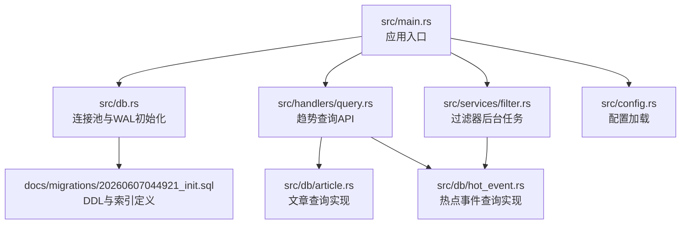
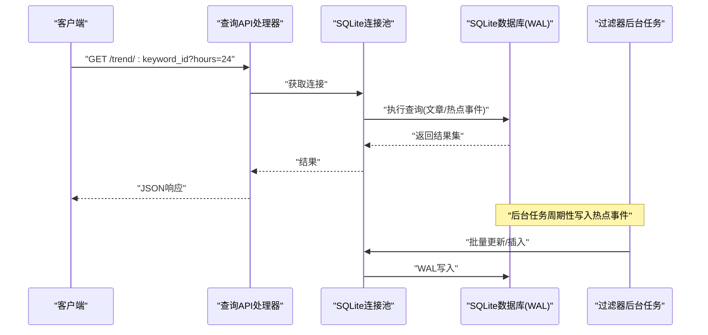
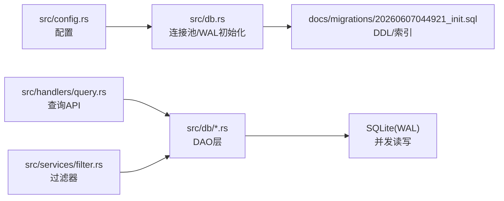
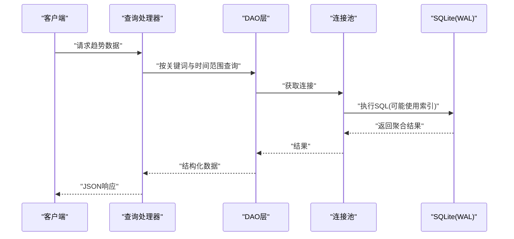

# 性能优化策略

<cite>
**本文引用的文件**
- [src/db.rs](file://src/db.rs)
- [src/config.rs](file://src/config.rs)
- [src/db/article.rs](file://src/db/article.rs)
- [src/db/hot_event.rs](file://src/db/hot_event.rs)
- [src/services/filter.rs](file://src/services/filter.rs)
- [src/handlers/query.rs](file://src/handlers/query.rs)
- [docs/migrations/20260607044921_init.sql](file://docs/migrations/20260607044921_init.sql)
- [openspec/specs/backend-project-scaffold/spec.md](file://openspec/specs/backend-project-scaffold/spec.md)
- [openspec/specs/database-schema/spec.md](file://openspec/specs/database-schema/spec.md)
- [openspec/specs/pusher-module/spec.md](file://openspec/specs/pusher-module/spec.md)
- [openspec/changes/archive/2026-06-07-query-apis-and-background-modules/design.md](file://openspec/changes/archive/2026-06-07-query-apis-and-background-modules/design.md)
- [openspec/changes/archive/2026-06-07-backend-project-setup/design.md](file://openspec/changes/archive/2026-06-07-backend-project-setup/design.md)
- [docs/plans/05-query-apis-and-background-modules.md](file://docs/plans/05-query-apis-and-background-modules.md)
</cite>

## 目录
1. [简介](#简介)
2. [项目结构](#项目结构)
3. [核心组件](#核心组件)
4. [架构总览](#架构总览)
5. [详细组件分析](#详细组件分析)
6. [依赖关系分析](#依赖关系分析)
7. [性能考量](#性能考量)
8. [故障排查指南](#故障排查指南)
9. [结论](#结论)
10. [附录](#附录)

## 简介
本文件面向“AI趋势监控系统”的数据库性能优化，聚焦以下主题：
- SQLite WAL模式的优势与配置要点
- 索引策略、复合索引与覆盖索引的使用建议
- 连接池配置与并发访问优化
- 慢查询分析与性能监控方法
- 数据分区与归档策略建议
- 内存使用优化与缓存策略
- 大数据量场景下的调优经验

目标是基于现有代码与设计文档，给出可落地的优化方案，并通过图示帮助读者快速理解关键流程。

## 项目结构
后端采用Rust + sqlx + SQLite架构，核心数据库初始化与迁移由启动流程负责；查询API与后台模块（解析、过滤、推送）共同构成主要负载。下图展示与数据库性能相关的关键文件与职责：

图表来源
- [src/db.rs](file://src/db.rs)
- [docs/migrations/20260607044921_init.sql](file://docs/migrations/20260607044921_init.sql)
- [src/handlers/query.rs](file://src/handlers/query.rs)
- [src/db/article.rs](file://src/db/article.rs)
- [src/db/hot_event.rs](file://src/db/hot_event.rs)
- [src/services/filter.rs](file://src/services/filter.rs)
- [src/config.rs](file://src/config.rs)

章节来源
- [openspec/specs/backend-project-scaffold/spec.md:38-54](file://openspec/specs/backend-project-scaffold/spec.md#L38-L54)
- [openspec/specs/database-schema/spec.md:1-35](file://openspec/specs/database-schema/spec.md#L1-L35)

## 核心组件
- 连接池与WAL初始化：在应用启动时建立SQLite连接池并启用WAL模式与外键校验，确保并发读写与数据一致性。
- 迁移与表结构：通过编译期嵌入的迁移机制自动应用DDL，包含8张主表及索引约束。
- 查询API与后台任务：趋势查询API与过滤器后台任务是数据库的主要负载来源，涉及高频读取与写入。

章节来源
- [openspec/specs/backend-project-scaffold/spec.md:38-54](file://openspec/specs/backend-project-scaffold/spec.md#L38-L54)
- [openspec/specs/database-schema/spec.md:1-35](file://openspec/specs/database-schema/spec.md#L1-L35)
- [openspec/changes/archive/2026-06-07-backend-project-setup/design.md:24-34](file://openspec/changes/archive/2026-06-07-backend-project-setup/design.md#L24-L34)

## 架构总览
下图展示从请求到数据库的典型路径，以及后台任务对数据库的影响：

图表来源
- [src/handlers/query.rs](file://src/handlers/query.rs)
- [src/db.rs](file://src/db.rs)
- [src/services/filter.rs](file://src/services/filter.rs)

## 详细组件分析

### SQLite WAL模式优势与配置
- 并发读写：WAL模式允许读操作与写操作并发进行，显著提升高并发场景下的吞吐。
- 自动回收：重写页在WAL文件中追加，空闲页可被VACUUM安全回收，减少锁争用。
- 配置要点：
  - 在连接池初始化时启用WAL与外键校验，确保每条连接的一致行为。
  - 对于高写入负载，建议结合合理的连接池大小与事务批处理，降低写放大。
  - 定期检查WAL文件大小，必要时执行VACUUM或切换到只读备份以压缩空间。

章节来源
- [openspec/specs/backend-project-scaffold/spec.md:38-54](file://openspec/specs/backend-project-scaffold/spec.md#L38-L54)
- [openspec/changes/archive/2026-06-07-backend-project-setup/design.md:24-34](file://openspec/changes/archive/2026-06-07-backend-project-setup/design.md#L24-L34)

### 索引策略与查询优化
- 基础原则
  - 为高频过滤字段建立单列索引，如文章来源ID、处理状态等。
  - 对组合过滤条件建立复合索引，遵循“最左前缀”原则，优先放置区分度高的列。
  - 覆盖索引用于避免回表：将查询所需的所有列纳入索引，减少随机I/O。
- 实战建议
  - 文章查询：针对来源ID与处理状态的组合过滤，建立复合索引；若存在时间范围过滤，考虑按小时/天的分区键参与复合索引。
  - 趋势查询：热点事件按关键词+小时桶聚合，建议在(关键词ID, 小时桶)上建立唯一索引或使用UPSERT，避免重复统计。
  - 关联查询：文章与关键词提及表JOIN时，确保关联键有索引；对时间过滤字段使用函数索引或存储派生列以避免函数导致的索引失效。
- 复杂度与成本
  - 索引会增加写入开销（INSERT/UPDATE/DELETE），需权衡读写比例与查询模式。
  - 定期评估索引选择性与使用率，清理低效索引。

章节来源
- [src/db/article.rs:45-75](file://src/db/article.rs#L45-L75)
- [src/db/hot_event.rs](file://src/db/hot_event.rs)
- [docs/plans/05-query-apis-and-background-modules.md:246-289](file://docs/plans/05-query-apis-and-background-modules.md#L246-L289)

### 连接池配置与并发访问优化
- 连接池规模
  - 设计文档指出SQLite在高并发写入场景下可能出现“忙碌”等待，建议将最大连接数控制在合理范围，配合重试与批处理缓解压力。
- 事务与批处理
  - 后台任务（过滤器）应采用批处理更新，减少事务次数与锁持有时间。
  - 对热点事件的插入/更新采用UPSERT，保证幂等且降低冲突概率。
- 乐观更新
  - 推送模块采用乐观更新策略，仅当当前状态匹配预期时才更新，避免竞态与不必要的写入。

章节来源
- [openspec/changes/archive/2026-06-07-query-apis-and-background-modules/design.md:70-76](file://openspec/changes/archive/2026-06-07-query-apis-and-background-modules/design.md#L70-L76)
- [openspec/specs/pusher-module/spec.md:91-100](file://openspec/specs/pusher-module/spec.md#L91-L100)
- [src/services/filter.rs:147-276](file://src/services/filter.rs#L147-L276)

### 慢查询分析与性能监控
- 分析手段
  - 使用SQLite内置的EXPLAIN QUERY PLAN查看执行计划，识别全表扫描与缺失索引。
  - 结合应用日志与数据库慢查询日志（如开启PRAGMA分析）定位热点SQL。
- 监控指标
  - 查询延迟分布、连接池排队长度、事务失败率（含“忙碌”重试）、热点事件写入QPS。
- 可视化与告警
  - 将关键指标接入监控面板，设置阈值告警，异常时触发自动降载或扩容。

[本节为通用实践指导，不直接分析具体文件]

### 数据分区与归档策略
- 分区建议
  - 时间维度：按月/季度对文章与热点事件表进行物理分区，便于维护与清理。
  - 关键词维度：对高活跃关键词单独分区，降低热点竞争。
- 归档策略
  - 将历史数据（如超过1年的文章）迁移到归档库或只读副本，保留必要的索引以支持历史查询。
  - 归档期间冻结写入，定期校验数据完整性。

[本节为通用实践指导，不直接分析具体文件]

### 内存使用优化与缓存策略
- 内存优化
  - 合理设置WAL参数（如WAL大小上限、checkpoint间隔），避免WAL无限增长。
  - 控制查询结果集大小，使用分页与LIMIT限制一次性传输的数据量。
- 缓存策略
  - 对热点趋势结果进行短期缓存（如Redis/TTL），降低重复查询压力。
  - 利用应用层缓存热点关键词元信息与最近N小时的趋势点，缩短热路径。

[本节为通用实践指导，不直接分析具体文件]

### 大数据量场景下的性能调优经验
- 写入侧
  - 批量化写入：后台任务按批次提交，减少事务开销。
  - UPSERT与幂等：热点事件写入采用UPSERT，避免重复统计与冲突。
- 读取侧
  - 覆盖索引与物化视图：对常用聚合查询构建覆盖索引或物化视图，减少计算与I/O。
  - 查询重写：将复杂表达式转为存储过程或派生列，避免函数导致的索引失效。
- 维护与治理
  - 定期重建索引、统计信息更新与WAL checkpoint，保持查询计划最优。
  - 对超大表进行分区裁剪与冷热分离，避免全局扫描。

[本节为通用实践指导，不直接分析具体文件]

## 依赖关系分析
数据库层依赖关系如下：

图表来源
- [src/config.rs](file://src/config.rs)
- [src/db.rs](file://src/db.rs)
- [docs/migrations/20260607044921_init.sql](file://docs/migrations/20260607044921_init.sql)
- [src/handlers/query.rs](file://src/handlers/query.rs)
- [src/db/article.rs](file://src/db/article.rs)
- [src/db/hot_event.rs](file://src/db/hot_event.rs)
- [src/services/filter.rs](file://src/services/filter.rs)

章节来源
- [openspec/specs/database-schema/spec.md:1-35](file://openspec/specs/database-schema/spec.md#L1-L35)
- [openspec/specs/backend-project-scaffold/spec.md:38-54](file://openspec/specs/backend-project-scaffold/spec.md#L38-L54)

## 性能考量
- 并发模型：WAL模式与连接池协同工作，读写并发提升明显，但需控制写入峰值，避免长时间长事务阻塞checkpoint。
- 查询模式：趋势查询以关键词+时间聚合为主，建议围绕(关键词ID, 小时桶)建立唯一索引或使用UPSERT，确保统计幂等。
- 写入模式：后台过滤器批量更新文章处理状态与热点事件，应采用批处理与UPSERT，减少锁竞争。
- 监控与告警：关注查询延迟、连接池排队、事务失败（含“忙碌”）与热点事件写入速率，异常时及时干预。

章节来源
- [src/services/filter.rs:147-276](file://src/services/filter.rs#L147-L276)
- [src/db/article.rs:45-75](file://src/db/article.rs#L45-L75)
- [docs/plans/05-query-apis-and-background-modules.md:246-289](file://docs/plans/05-query-apis-and-background-modules.md#L246-L289)

## 故障排查指南
- “忙碌”错误（SQLITE_BUSY）
  - 现象：高并发写入时出现临时锁等待。
  - 处理：降低单次事务大小、增加重试与退避、减少同时写入的连接数。
- 外键约束问题
  - 现象：删除/更新时出现约束失败。
  - 处理：确认每条连接已启用外键校验；检查级联规则与数据一致性。
- 查询性能下降
  - 现象：趋势查询变慢、热点事件统计延迟。
  - 处理：检查索引使用情况、是否发生全表扫描；评估是否需要新增复合索引或覆盖索引。
- WAL膨胀
  - 现象：WAL文件持续增大。
  - 处理：定期执行checkpoint或VACUUM；评估是否需要分区与归档。

章节来源
- [openspec/changes/archive/2026-06-07-query-apis-and-background-modules/design.md:70-76](file://openspec/changes/archive/2026-06-07-query-apis-and-background-modules/design.md#L70-L76)
- [openspec/specs/backend-project-scaffold/spec.md:38-54](file://openspec/specs/backend-project-scaffold/spec.md#L38-L54)

## 结论
通过启用WAL模式、合理设计索引与查询、优化连接池与并发策略、引入慢查询分析与监控，以及实施分区与归档，可以在SQLite上稳定支撑AI趋势监控系统的高并发读写需求。建议以“读多写少”的热点查询为优先优化对象，持续迭代索引与缓存策略，确保系统在数据规模增长过程中仍保持良好性能。

## 附录
- 关键流程时序（趋势查询）：

图表来源
- [src/handlers/query.rs](file://src/handlers/query.rs)
- [src/db/article.rs](file://src/db/article.rs)
- [src/db/hot_event.rs](file://src/db/hot_event.rs)