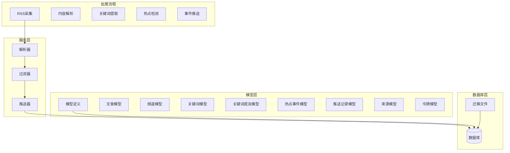
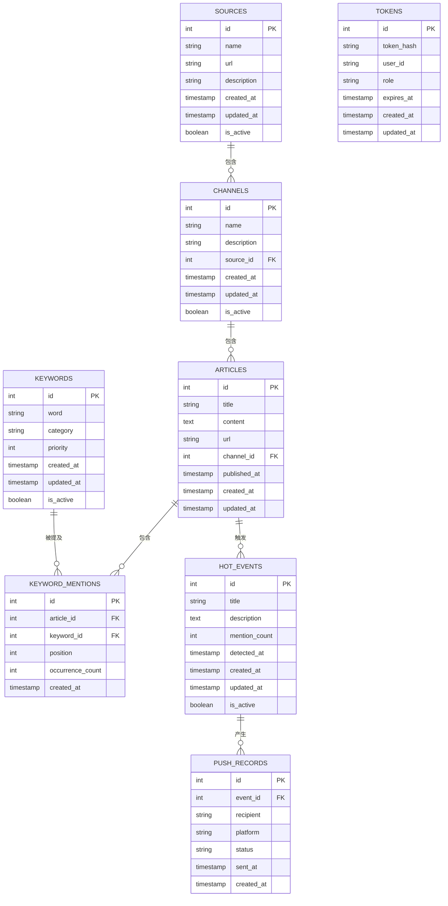
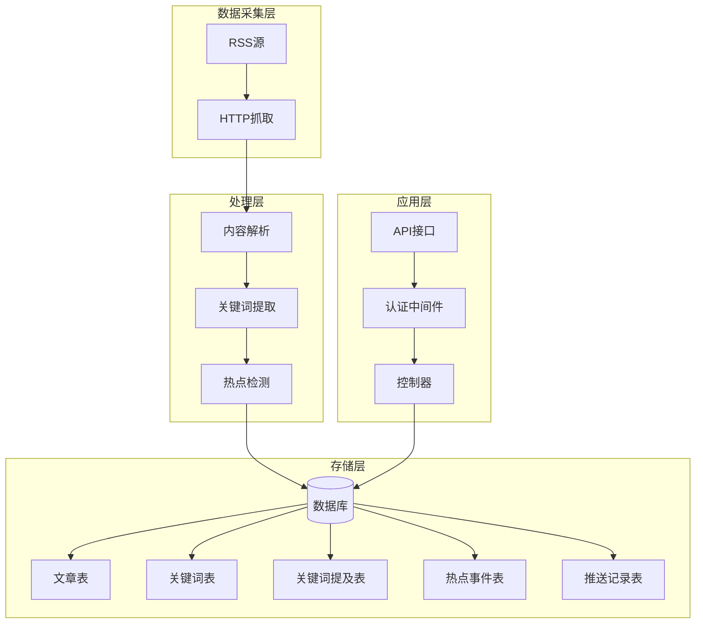
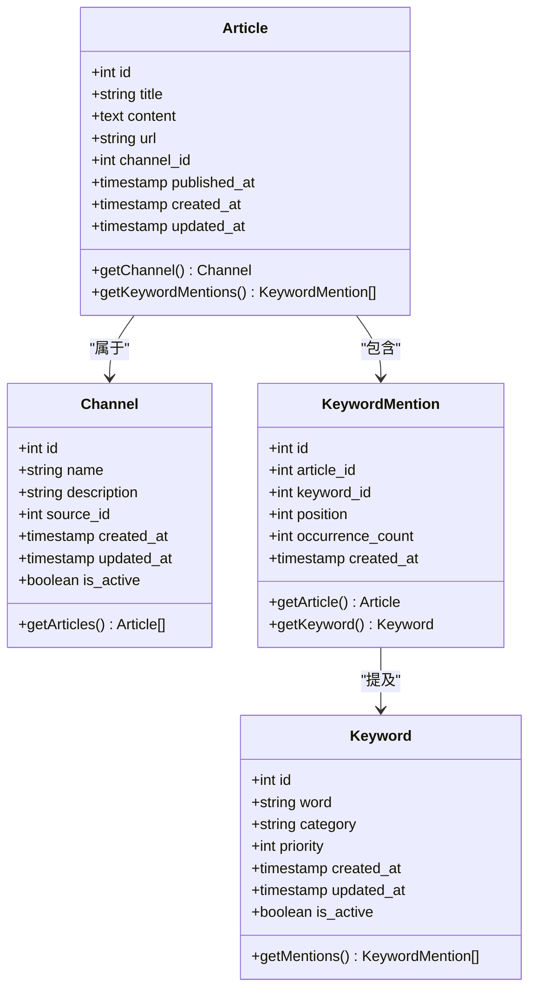
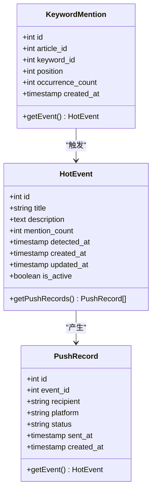
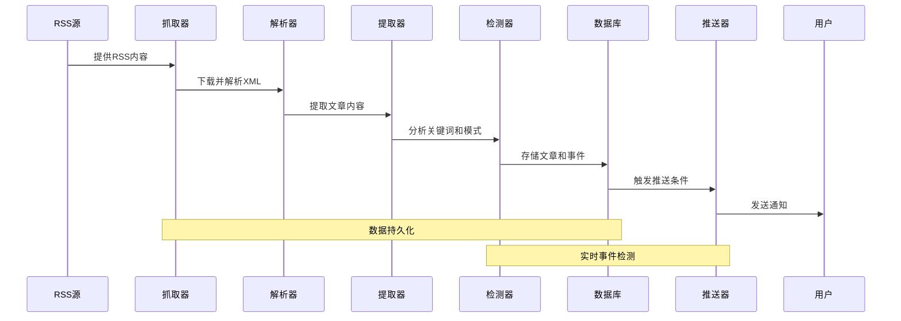
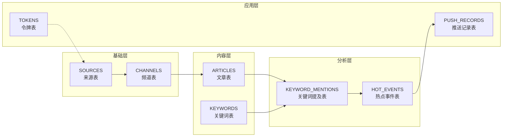
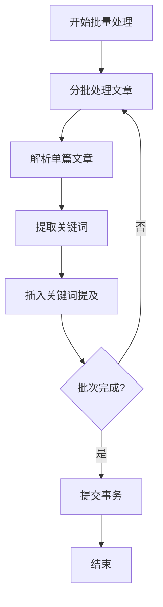

# 数据库关系图

<cite>
**本文档中引用的文件**
- [20260607044921_init.sql](file://docs/migrations/20260607044921_init.sql)
- [article.rs](file://src/models/article.rs)
- [channel.rs](file://src/models/channel.rs)
- [hot_event.rs](file://src/models/hot_event.rs)
- [keyword.rs](file://src/models/keyword.rs)
- [keyword_mention.rs](file://src/models/keyword_mention.rs)
- [push_record.rs](file://src/models/push_record.rs)
- [source.rs](file://src/models/source.rs)
- [token.rs](file://src/models/token.rs)
- [db.rs](file://src/db.rs)
- [parser.rs](file://src/services/parser.rs)
- [filter.rs](file://src/services/filter.rs)
- [pusher.rs](file://src/services/pusher.rs)
</cite>

## 目录
1. [简介](#简介)
2. [项目结构](#项目结构)
3. [核心组件](#核心组件)
4. [架构概览](#架构概览)
5. [详细组件分析](#详细组件分析)
6. [依赖分析](#依赖分析)
7. [性能考虑](#性能考虑)
8. [故障排除指南](#故障排除指南)
9. [结论](#结论)
10. [附录](#附录)

## 简介

AI趋势监控系统是一个基于RSS源的数据采集和热点事件检测平台。该系统通过自动化流程从多个RSS源获取AI相关新闻，进行内容解析、关键词提取、热点事件识别，并将结果推送给用户。本文档专注于系统的数据库关系设计，提供完整的ER图和实体关系说明。

## 项目结构

系统采用模块化架构，数据库层与业务逻辑层分离：

**图表来源**
- [db.rs](file://src/db.rs)
- [parser.rs](file://src/services/parser.rs)
- [filter.rs](file://src/services/filter.rs)
- [pusher.rs](file://src/services/pusher.rs)

**章节来源**
- [db.rs](file://src/db.rs)
- [parser.rs](file://src/services/parser.rs)
- [filter.rs](file://src/services/filter.rs)
- [pusher.rs](file://src/services/pusher.rs)

## 核心组件

系统包含以下核心数据库表：

### 主要实体表

1. **文章表 (articles)** - 存储从RSS源采集的具体文章信息
2. **频道表 (channels)** - 定义RSS源的分类和元数据
3. **关键词表 (keywords)** - 系统管理的AI相关关键词词典
4. **关键词提及表 (keyword_mentions)** - 记录文章中出现的关键词及其位置
5. **热点事件表 (hot_events)** - 存储识别出的热点事件
6. **推送记录表 (push_records)** - 跟踪推送通知的状态
7. **来源表 (sources)** - 管理RSS源的配置和状态
8. **令牌表 (tokens)** - 用户认证和访问控制

### 关系映射

**图表来源**
- [20260607044921_init.sql](file://docs/migrations/20260607044921_init.sql)
- [article.rs](file://src/models/article.rs)
- [channel.rs](file://src/models/channel.rs)
- [keyword.rs](file://src/models/keyword.rs)
- [keyword_mention.rs](file://src/models/keyword_mention.rs)
- [hot_event.rs](file://src/models/hot_event.rs)
- [push_record.rs](file://src/models/push_record.rs)
- [source.rs](file://src/models/source.rs)
- [token.rs](file://src/models/token.rs)

**章节来源**
- [20260607044921_init.sql](file://docs/migrations/20260607044921_init.sql)
- [article.rs](file://src/models/article.rs)
- [channel.rs](file://src/models/channel.rs)
- [keyword.rs](file://src/models/keyword.rs)
- [keyword_mention.rs](file://src/models/keyword_mention.rs)
- [hot_event.rs](file://src/models/hot_event.rs)
- [push_record.rs](file://src/models/push_record.rs)
- [source.rs](file://src/models/source.rs)
- [token.rs](file://src/models/token.rs)

## 架构概览

系统采用分层架构设计，确保数据流的清晰性和可维护性：

**图表来源**
- [parser.rs](file://src/services/parser.rs)
- [filter.rs](file://src/services/filter.rs)
- [pusher.rs](file://src/services/pusher.rs)
- [db.rs](file://src/db.rs)

## 详细组件分析

### 文章表 (Articles)

文章表是系统的核心数据表，存储从RSS源采集的具体文章信息：

**图表来源**
- [article.rs](file://src/models/article.rs)
- [channel.rs](file://src/models/channel.rs)
- [keyword_mention.rs](file://src/models/keyword_mention.rs)
- [keyword.rs](file://src/models/keyword.rs)

**章节来源**
- [article.rs](file://src/models/article.rs)
- [channel.rs](file://src/models/channel.rs)
- [keyword_mention.rs](file://src/models/keyword_mention.rs)
- [keyword.rs](file://src/models/keyword.rs)

### 热点事件表 (HotEvents)

热点事件表用于跟踪AI领域的热门话题和发展趋势：

**图表来源**
- [hot_event.rs](file://src/models/hot_event.rs)
- [push_record.rs](file://src/models/push_record.rs)
- [keyword_mention.rs](file://src/models/keyword_mention.rs)

**章节来源**
- [hot_event.rs](file://src/models/hot_event.rs)
- [push_record.rs](file://src/models/push_record.rs)
- [keyword_mention.rs](file://src/models/keyword_mention.rs)

### 数据流处理序列

系统的核心数据处理流程如下：

**图表来源**
- [parser.rs](file://src/services/parser.rs)
- [filter.rs](file://src/services/filter.rs)
- [pusher.rs](file://src/services/pusher.rs)
- [db.rs](file://src/db.rs)

**章节来源**
- [parser.rs](file://src/services/parser.rs)
- [filter.rs](file://src/services/filter.rs)
- [pusher.rs](file://src/services/pusher.rs)
- [db.rs](file://src/db.rs)

## 依赖分析

系统中的表间依赖关系体现了清晰的层次结构：

**图表来源**
- [20260607044921_init.sql](file://docs/migrations/20260607044921_init.sql)
- [source.rs](file://src/models/source.rs)
- [channel.rs](file://src/models/channel.rs)
- [article.rs](file://src/models/article.rs)
- [keyword.rs](file://src/models/keyword.rs)
- [keyword_mention.rs](file://src/models/keyword_mention.rs)
- [hot_event.rs](file://src/models/hot_event.rs)
- [push_record.rs](file://src/models/push_record.rs)
- [token.rs](file://src/models/token.rs)

### 外键约束和级联规则

系统实现了严格的外键约束以保证数据完整性：

1. **文章-频道关系**: 文章必须属于有效的频道，删除频道会级联删除其所有文章
2. **关键词提及-文章关系**: 关键词提及必须关联有效文章，删除文章会级联删除相关提及
3. **关键词提及-关键词关系**: 提及必须关联有效关键词，删除关键词会级联删除相关提及
4. **热点事件-关键词提及关系**: 热点事件由关键词提及触发，但删除事件不影响提及记录
5. **推送记录-热点事件关系**: 推送记录关联有效热点事件，删除事件会级联删除相关推送

**章节来源**
- [20260607044921_init.sql](file://docs/migrations/20260607044921_init.sql)

## 性能考虑

### 查询优化策略

1. **索引设计**
   - 文章表按发布日期建立索引，支持时间范围查询
   - 关键词提及表按文章ID和关键词ID建立复合索引，优化关联查询
   - 热点事件表按检测时间和活跃状态建立索引，支持实时查询

2. **分区策略**
   - 按月对文章表进行分区，提高历史数据查询性能
   - 对推送记录表按发送时间分区，便于清理过期记录

3. **缓存机制**
   - 热门关键词和事件结果进行缓存
   - 频道活跃度统计定期更新缓存

### 批处理优化

## 故障排除指南

### 常见问题诊断

1. **数据重复问题**
   - 检查文章URL唯一性约束
   - 验证RSS源去重逻辑
   - 查看重复数据的清理脚本

2. **性能下降问题**
   - 分析慢查询日志
   - 检查索引使用情况
   - 优化批量处理批次大小

3. **数据一致性问题**
   - 验证外键约束是否生效
   - 检查事务边界设置
   - 确认级联操作符合预期

**章节来源**
- [20260607044921_init.sql](file://docs/migrations/20260607044921_init.sql)

## 结论

AI趋势监控系统的数据库设计采用了规范化的ER模型，通过清晰的表关系和严格的约束保证了数据的一致性和完整性。系统支持高效的RSS内容采集、智能的关键词提取和实时的热点事件检测，为用户提供及时准确的AI领域趋势信息。

## 附录

### 维护和更新策略

1. **版本控制**
   - 使用迁移文件管理数据库结构变更
   - 保持迁移文件的顺序性和可逆性
   - 在生产环境执行前进行充分测试

2. **备份策略**
   - 定期备份数据库结构和数据
   - 测试恢复流程的有效性
   - 确保备份数据的完整性

3. **监控指标**
   - 监控表空间使用情况
   - 跟踪查询性能指标
   - 监控数据增长趋势

4. **扩展性考虑**
   - 设计水平扩展的架构
   - 支持读写分离
   - 考虑分布式部署方案