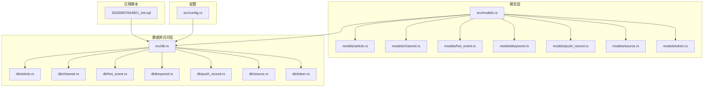
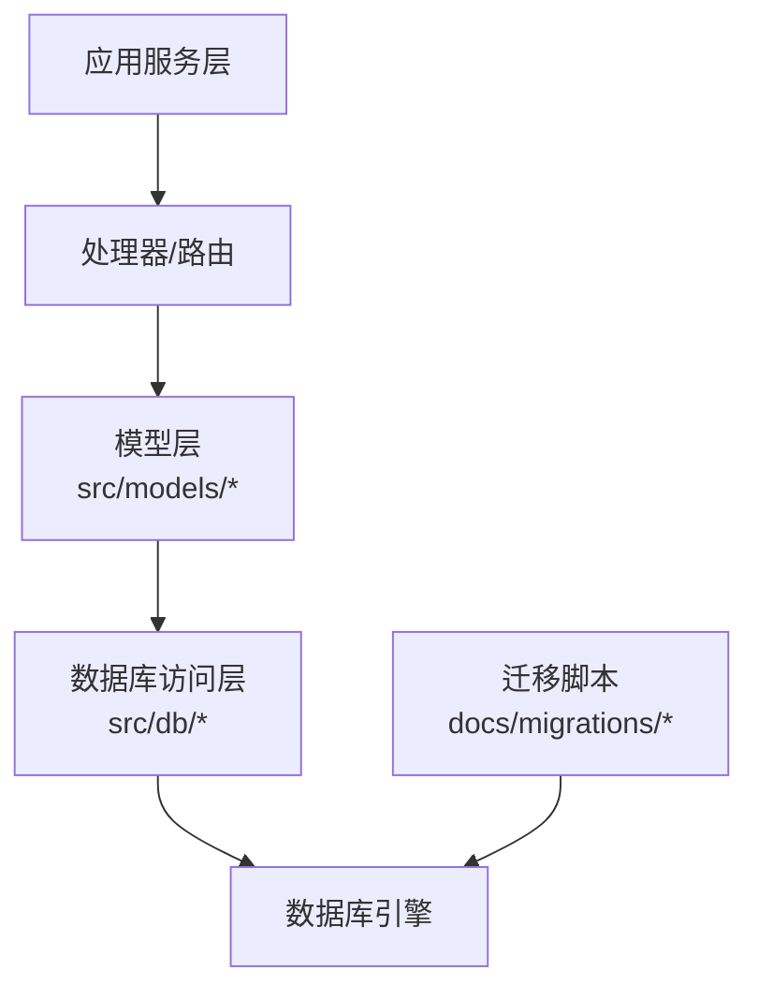
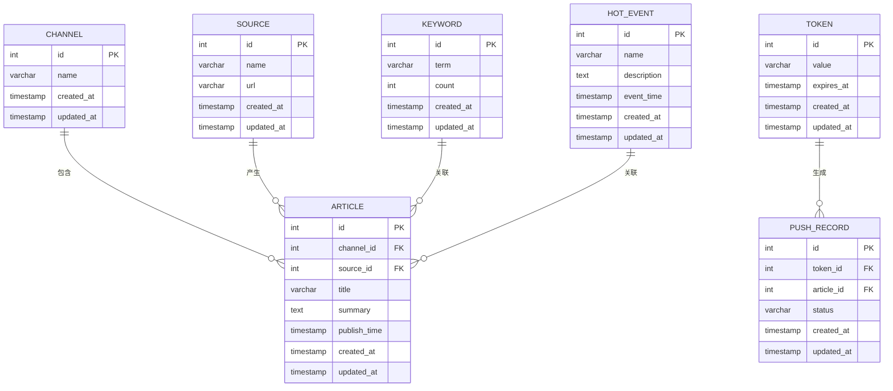
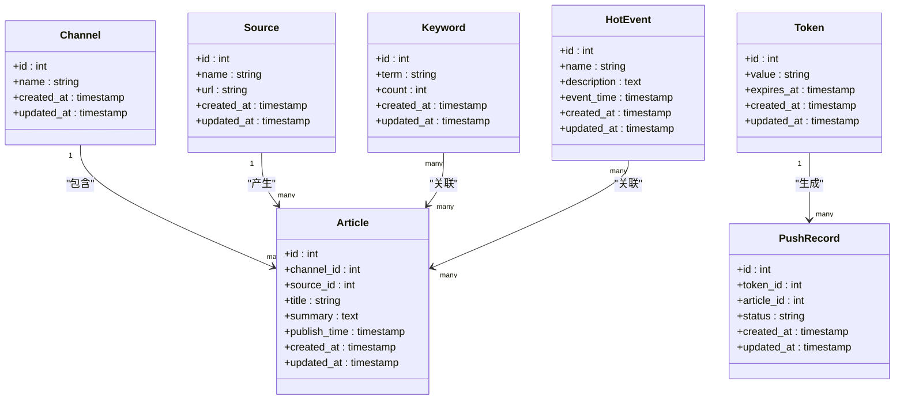
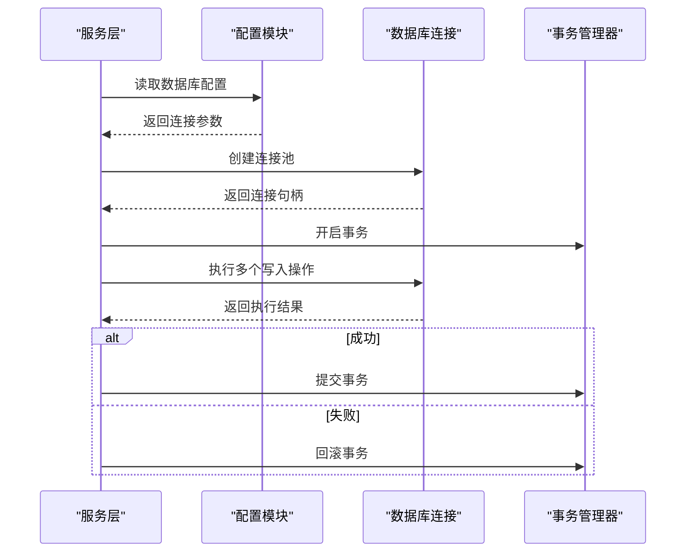
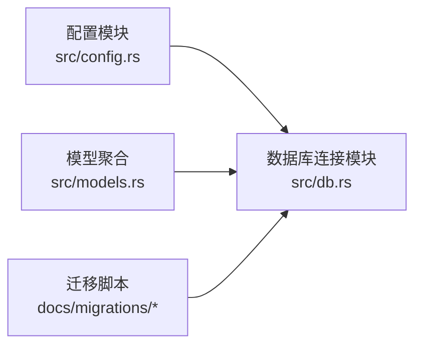

# 数据库架构

<cite>
**本文档引用的文件**
- [20260607044921_init.sql](file://docs/migrations/20260607044921_init.sql)
- [db.rs](file://src/db.rs)
- [config.rs](file://src/config.rs)
- [models.rs](file://src/models.rs)
- [article.rs](file://src/models/article.rs)
- [channel.rs](file://src/models/channel.rs)
- [hot_event.rs](file://src/models/hot_event.rs)
- [keyword.rs](file://src/models/keyword.rs)
- [push_record.rs](file://src/models/push_record.rs)
- [source.rs](file://src/models/source.rs)
- [token.rs](file://src/models/token.rs)
- [article.rs](file://src/db/article.rs)
- [channel.rs](file://src/db/channel.rs)
- [hot_event.rs](file://src/db/hot_event.rs)
- [keyword.rs](file://src/db/keyword.rs)
- [push_record.rs](file://src/db/push_record.rs)
- [source.rs](file://src/db/source.rs)
- [token.rs](file://src/db/token.rs)
</cite>

## 目录
1. [简介](#简介)
2. [项目结构](#项目结构)
3. [核心组件](#核心组件)
4. [架构总览](#架构总览)
5. [详细组件分析](#详细组件分析)
6. [依赖分析](#依赖分析)
7. [性能考虑](#性能考虑)
8. [故障排除指南](#故障排除指南)
9. [结论](#结论)

## 简介
本文件面向AI-Trend-Tool项目的数据库架构，系统性阐述整体设计思路、表结构定义与实体关系，并结合实际迁移脚本与Rust模型/数据库适配层代码，给出主键/外键关系、索引策略、数据类型转换与空值处理等实现细节。文档同时覆盖数据库连接配置、连接池设置与事务管理策略，帮助开发者在不深入源码的情况下理解并维护数据库层。

## 项目结构
数据库相关的核心位置包括：
- 迁移脚本：位于docs/migrations目录，包含初始化建表脚本
- 模型层：src/models下按领域划分的实体模型
- 数据库访问层：src/db下对应实体的数据库操作模块
- 配置与连接：src/config.rs与src/db.rs负责数据库连接与配置
- 聚合入口：src/models.rs与src/db.rs作为模型与数据库模块的聚合导出

**图表来源**
- [20260607044921_init.sql](file://docs/migrations/20260607044921_init.sql)
- [db.rs](file://src/db.rs)
- [config.rs](file://src/config.rs)
- [models.rs](file://src/models.rs)

**章节来源**
- [db.rs](file://src/db.rs)
- [config.rs](file://src/config.rs)
- [models.rs](file://src/models.rs)

## 核心组件
- 初始化迁移脚本：定义了系统初始的数据库表结构、主键、外键与索引
- 模型层：以领域对象形式表达业务实体，包含字段定义与验证逻辑
- 数据库访问层：封装SQL查询、插入、更新与删除操作，提供类型安全的数据访问接口
- 配置与连接：集中管理数据库连接参数、连接池大小与超时设置
- 事务管理：通过数据库层统一开启/提交/回滚事务，保证数据一致性

**章节来源**
- [20260607044921_init.sql](file://docs/migrations/20260607044921_init.sql)
- [models.rs](file://src/models.rs)
- [db.rs](file://src/db.rs)
- [config.rs](file://src/config.rs)

## 架构总览
数据库层采用“迁移驱动 + 模型/适配层”的分层架构：
- 迁移脚本确保数据库结构演进可追踪、可复现
- 模型层抽象业务实体，避免直接操作SQL
- 数据库访问层屏蔽SQL细节，提供面向对象的CRUD接口
- 配置与连接层集中管理连接参数与连接池

**图表来源**
- [db.rs](file://src/db.rs)
- [models.rs](file://src/models.rs)
- [20260607044921_init.sql](file://docs/migrations/20260607044921_init.sql)

## 详细组件分析

### 表结构与实体关系总览
基于初始化迁移脚本，系统包含以下核心表（名称与字段以脚本为准）：
- 文章表：存储文章元信息与内容摘要
- 频道表：存储信息频道或分类
- 热点事件表：存储热点事件及其关联信息
- 关键词表：存储关键词及其统计信息
- 推送记录表：存储推送历史
- 来源表：存储信息来源
- 令牌表：存储访问令牌

**图表来源**
- [20260607044921_init.sql](file://docs/migrations/20260607044921_init.sql)

**章节来源**
- [20260607044921_init.sql](file://docs/migrations/20260607044921_init.sql)

### 设计原则与字段类型选择
- 主键策略：所有表均采用自增整数主键，保证简单高效且易于扩展
- 字段类型选择：
  - 文本类：标题、描述、关键词等使用变长字符串类型；摘要使用文本类型以支持较长内容
  - 时间戳：统一使用带时区的时间戳类型，便于跨时区排序与展示
  - 数值类：计数字段使用整型；唯一标识符使用整型以提升索引效率
- 约束条件：
  - 唯一性：关键词的关键词字段设置唯一约束，避免重复
  - 非空：标题、来源名称、令牌值等关键字段设置非空约束
  - 外键：文章与频道、来源建立外键关系；推送记录与令牌、文章建立外键关系
- 索引策略：
  - 主键自动建立聚簇索引
  - 对常用查询字段（如文章发布时间、关键词term、推送状态）建立二级索引
  - 对外键字段建立索引以优化连接性能

**章节来源**
- [20260607044921_init.sql](file://docs/migrations/20260607044921_init.sql)

### 数据模型映射到数据库表
模型层与数据库表的映射遵循一对一或一对多关系：
- 频道与文章：一对多（一个频道包含多篇文章）
- 来源与文章：一对多（一个来源产生多篇文章）
- 关键词与文章：多对多（通过中间关联表实现，具体见迁移脚本）
- 热点事件与文章：多对多（通过中间关联表实现，具体见迁移脚本）
- 令牌与推送记录：一对多（一个令牌可生成多条推送记录）

**图表来源**
- [models.rs](file://src/models.rs)
- [models/article.rs](file://src/models/article.rs)
- [models/channel.rs](file://src/models/channel.rs)
- [models/hot_event.rs](file://src/models/hot_event.rs)
- [models/keyword.rs](file://src/models/keyword.rs)
- [models/push_record.rs](file://src/models/push_record.rs)
- [models/source.rs](file://src/models/source.rs)
- [models/token.rs](file://src/models/token.rs)

**章节来源**
- [models.rs](file://src/models.rs)
- [models/article.rs](file://src/models/article.rs)
- [models/channel.rs](file://src/models/channel.rs)
- [models/hot_event.rs](file://src/models/hot_event.rs)
- [models/keyword.rs](file://src/models/keyword.rs)
- [models/push_record.rs](file://src/models/push_record.rs)
- [models/source.rs](file://src/models/source.rs)
- [models/token.rs](file://src/models/token.rs)

### 数据库连接配置、连接池设置与事务管理
- 连接配置：集中于配置模块，包含数据库URL、用户名、密码、SSL模式等参数
- 连接池：在数据库连接模块中设置池大小、最大连接数、空闲超时与连接超时
- 事务管理：数据库访问层提供事务上下文，支持批量写入、原子性更新与回滚

**图表来源**
- [config.rs](file://src/config.rs)
- [db.rs](file://src/db.rs)

**章节来源**
- [config.rs](file://src/config.rs)
- [db.rs](file://src/db.rs)

### 数据类型转换、NULL值处理与默认值设置
- 类型转换：模型字段与数据库列之间进行显式转换，确保时间戳、枚举与布尔值的正确映射
- NULL处理：对于可选字段，在数据库层允许NULL，在模型层通过可选类型承载；写入前进行空值检查与清理
- 默认值：时间戳字段使用数据库默认值填充创建与更新时间；其他字段根据业务需求设置默认值或保持NULL

**章节来源**
- [20260607044921_init.sql](file://docs/migrations/20260607044921_init.sql)
- [models.rs](file://src/models.rs)

## 依赖分析
数据库层内部依赖关系清晰，遵循单向依赖：
- 配置模块被数据库连接模块依赖
- 数据库访问层依赖模型层与配置模块
- 迁移脚本独立于运行时代码，仅用于数据库结构初始化

**图表来源**
- [config.rs](file://src/config.rs)
- [db.rs](file://src/db.rs)
- [models.rs](file://src/models.rs)
- [20260607044921_init.sql](file://docs/migrations/20260607044921_init.sql)

**章节来源**
- [config.rs](file://src/config.rs)
- [db.rs](file://src/db.rs)
- [models.rs](file://src/models.rs)

## 性能考虑
- 索引优化：对高频查询字段建立索引，减少全表扫描；合理使用复合索引降低查询成本
- 连接池调优：根据并发请求量调整连接池大小与超时参数，避免连接争用与超时
- 写入批量化：批量插入与更新可显著降低事务开销与网络往返
- 查询优化：避免N+1查询，优先使用JOIN与预加载策略

## 故障排除指南
- 连接失败：检查数据库URL、凭据与网络连通性；确认SSL模式与防火墙设置
- 迁移失败：核对迁移脚本语法与目标数据库版本兼容性；必要时手动执行修复脚本
- 事务异常：捕获异常后及时回滚，避免长时间占用连接；记录事务日志便于排查
- 性能问题：分析慢查询日志，识别缺失索引与低效查询；评估是否需要分区或读写分离

## 结论
本数据库架构以迁移脚本为基石，配合模型与数据库访问层，实现了清晰的职责分离与可维护性。通过合理的主外键关系、索引策略与事务管理，系统在保证数据一致性的同时兼顾性能与扩展性。建议在后续迭代中持续完善索引覆盖与监控告警，确保数据库层稳定支撑上层业务发展。