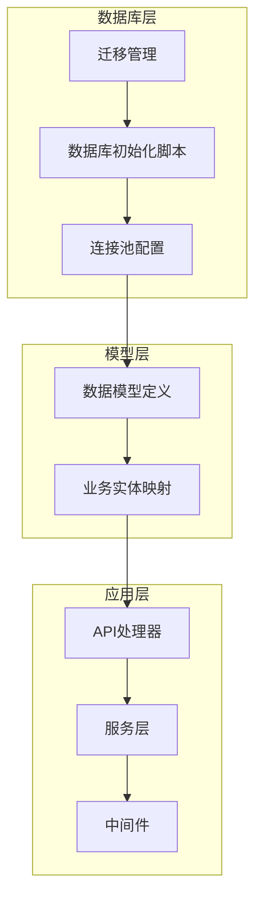
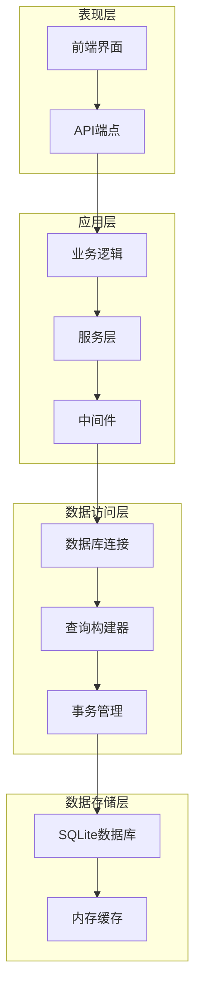
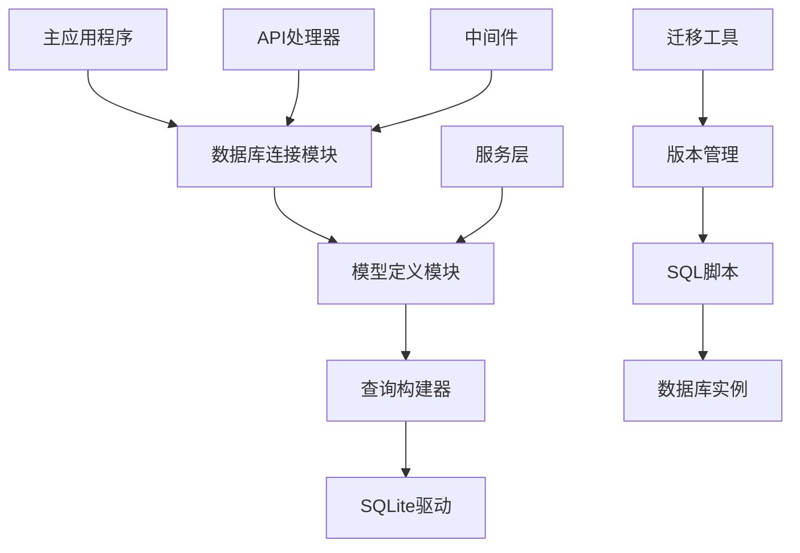

# 数据库架构

<cite>
**本文档引用的文件**
- [20260607044921_init.sql](file://docs/migrations/20260607044921_init.sql)
- [db.rs](file://src/db.rs)
- [models.rs](file://src/models.rs)
- [README.md](file://README.md)
</cite>

## 目录
1. [简介](#简介)
2. [项目结构](#项目结构)
3. [核心表设计](#核心表设计)
4. [架构概览](#架构概览)
5. [详细组件分析](#详细组件分析)
6. [依赖关系分析](#依赖关系分析)
7. [性能考虑](#性能考虑)
8. [故障排除指南](#故障排除指南)
9. [结论](#结论)

## 简介

AI趋势监控系统是一个基于Rust技术栈构建的实时新闻聚合和趋势分析平台。该系统专注于人工智能领域的新闻追踪、关键词监控和热点事件识别，通过多数据源聚合实现智能趋势分析。

系统采用SQLite作为主要数据库引擎，结合Rust的类型安全特性和异步编程能力，提供了高性能、可靠的数据库解决方案。SQLite的选择基于其轻量级特性、零配置部署和跨平台兼容性优势。

## 项目结构

系统采用模块化架构设计，数据库相关的核心组件分布如下：

**图表来源**
- [db.rs](file://src/db.rs)
- [models.rs](file://src/models.rs)

**章节来源**
- [db.rs](file://src/db.rs)
- [models.rs](file://src/models.rs)

## 核心表设计

### api_tokens 表

**设计理念**: 令牌管理表负责存储API访问令牌，支持系统认证和权限控制。

**字段定义**:
- `id`: 主键，自增整数
- `token`: 唯一令牌字符串，长度限制确保安全性
- `name`: 令牌名称，便于用户识别
- `created_at`: 创建时间戳，默认当前时间
- `updated_at`: 更新时间戳，默认当前时间

**约束条件**:
- 唯一性约束：token字段唯一
- 非空约束：token、name必须填写
- 时间戳自动更新：使用触发器维护更新时间

### data_sources 表

**设计理念**: 数据源管理表用于配置和管理各种新闻聚合源。

**字段定义**:
- `id`: 主键，自增整数
- `name`: 数据源名称
- `url`: 数据源URL地址
- `type`: 数据源类型标识
- `status`: 状态字段，控制启用/禁用
- `created_at`: 创建时间戳
- `updated_at`: 更新时间戳

**约束条件**:
- 非空约束：name、url、type必须填写
- 状态枚举：status字段限制有效值
- URL格式验证：确保数据源可访问性

### articles 表

**设计理念**: 文章内容表存储从各数据源抓取的新闻文章信息。

**字段定义**:
- `id`: 主键，自增整数
- `source_id`: 外键关联数据源
- `title`: 文章标题
- `content`: 文章正文内容
- `url`: 原文链接
- `published_at`: 发布时间
- `created_at`: 创建时间戳
- `updated_at`: 更新时间戳

**约束条件**:
- 外键约束：source_id引用data_sources表
- 唯一性：url字段唯一，避免重复抓取
- 时间排序：published_at用于查询优化

### keywords 表

**设计理念**: 关键词监控表用于跟踪特定主题和术语的出现频率。

**字段定义**:
- `id`: 主键，自增整数
- `keyword`: 关键词文本
- `category`: 关键词分类
- `priority`: 优先级权重
- `is_active`: 激活状态
- `created_at`: 创建时间戳
- `updated_at`: 更新时间戳

**约束条件**:
- 唯一性：keyword字段唯一
- 分类枚举：category限制有效分类
- 权重范围：priority字段范围限制

### hot_events 表

**设计理念**: 热点事件表用于识别和跟踪AI领域的重大事件。

**字段定义**:
- `id`: 主键，自增整数
- `title`: 事件标题
- `description`: 事件描述
- `event_time`: 事件发生时间
- `confidence_score`: 置信度分数
- `status`: 事件状态
- `created_at`: 创建时间戳
- `updated_at`: 更新时间戳

**约束条件**:
- 时间范围：event_time限制合理的时间范围
- 置信度验证：confidence_score在0-1范围内
- 状态管理：status字段控制事件生命周期

### push_channels 表

**设计理念**: 推送渠道表管理通知推送的各种渠道配置。

**字段定义**:
- `id`: 主键，自增整数
- `name`: 渠道名称
- `type`: 渠道类型（邮件、Webhook等）
- `config`: JSON配置对象
- `is_enabled`: 启用状态
- `created_at`: 创建时间戳
- `updated_at`: 更新时间戳

**约束条件**:
- 类型枚举：type字段限制有效渠道类型
- JSON验证：config字段确保JSON格式正确
- 状态控制：is_enabled管理渠道可用性

### push_records 表

**设计理念**: 推送记录表跟踪所有通知推送的历史记录。

**字段定义**:
- `id`: 主键，自增整数
- `channel_id`: 外键关联推送渠道
- `event_id`: 外键关联热点事件
- `recipient`: 接收者信息
- `message`: 推送消息内容
- `status`: 推送状态
- `sent_at`: 发送时间
- `created_at`: 创建时间戳

**约束条件**:
- 外键约束：channel_id和event_id引用相关表
- 状态枚举：status字段跟踪推送结果
- 时间戳：sent_at记录实际发送时间

**章节来源**
- [20260607044921_init.sql](file://docs/migrations/20260607044921_init.sql)

## 架构概览

系统采用分层架构设计，确保关注点分离和模块化开发：

**图表来源**
- [db.rs](file://src/db.rs)
- [models.rs](file://src/models.rs)

## 详细组件分析

### 数据库连接管理

系统使用Rust的Diesel ORM框架进行数据库操作，提供类型安全的查询接口。

**连接池配置**:
- 最大连接数：根据并发需求配置
- 连接超时：防止长时间占用连接
- 健康检查：定期验证连接有效性

**事务管理**:
- 自动提交：简单查询自动处理
- 手动事务：复杂操作支持事务回滚
- 并发控制：避免脏读和不可重复读

### 查询优化策略

**索引设计原则**:
- 主键自动建立聚簇索引
- 频繁查询字段建立普通索引
- 复合索引优化常用查询模式
- 唯一索引保证数据完整性

**查询优化**:
- 预编译语句防止SQL注入
- 分页查询处理大数据集
- 连接查询优化表关联顺序

### 错误处理机制

**异常分类**:
- 连接异常：数据库连接失败
- 事务异常：事务执行错误
- 约束异常：违反数据库约束
- 超时异常：查询或连接超时

**恢复策略**:
- 自动重连：网络异常时自动恢复
- 降级处理：部分功能降级运行
- 日志记录：详细记录错误信息

**章节来源**
- [db.rs](file://src/db.rs)

## 依赖关系分析

系统数据库层的依赖关系呈现清晰的层次结构：

**图表来源**
- [db.rs](file://src/db.rs)
- [models.rs](file://src/models.rs)

**章节来源**
- [models.rs](file://src/models.rs)

## 性能考虑

### 存储优化

**数据类型选择**:
- 整数类型：根据数值范围选择合适精度
- 文本类型：VARCHAR限制长度防止过度存储
- 时间类型：TIMESTAMP统一时间格式
- JSON类型：BLOB存储结构化配置

**存储空间优化**:
- 字符串截断：避免过长字段占用空间
- 空值处理：合理使用NULL值
- 数据压缩：对大文本内容考虑压缩存储

### 查询性能优化

**索引策略**:
- 主键索引：自动为所有主键建立索引
- 外键索引：为所有外键建立索引
- 组合索引：为常用查询组合建立复合索引
- 唯一索引：为唯一约束字段建立唯一索引

**查询优化**:
- 预编译语句：提高查询执行效率
- 连接池：复用数据库连接减少开销
- 分页查询：大数据集分批处理
- 缓存策略：热点数据缓存

## 故障排除指南

### 常见问题诊断

**连接问题**:
- 检查数据库文件权限
- 验证连接字符串格式
- 确认SQLite扩展加载

**性能问题**:
- 分析慢查询日志
- 检查索引使用情况
- 监控连接池状态

**数据一致性问题**:
- 验证外键约束
- 检查事务完整性
- 确认数据类型匹配

### 维护建议

**定期维护**:
- 数据库文件清理
- 索引重建优化
- 统计信息更新

**监控指标**:
- 连接数统计
- 查询响应时间
- 存储空间使用率

## 结论

AI趋势监控系统的数据库架构设计充分考虑了实时性、可扩展性和可靠性要求。通过合理的表结构设计、完善的索引策略和高效的查询优化，系统能够在高并发场景下保持稳定的性能表现。

SQLite作为底层存储引擎的选择，为系统提供了轻量级、易部署和跨平台的优势。配合Rust语言的类型安全特性和异步编程能力，构建了一个高性能、可维护的数据库解决方案。

未来的发展方向包括分布式扩展、高级分析功能集成和更精细的性能调优，以满足不断增长的业务需求。