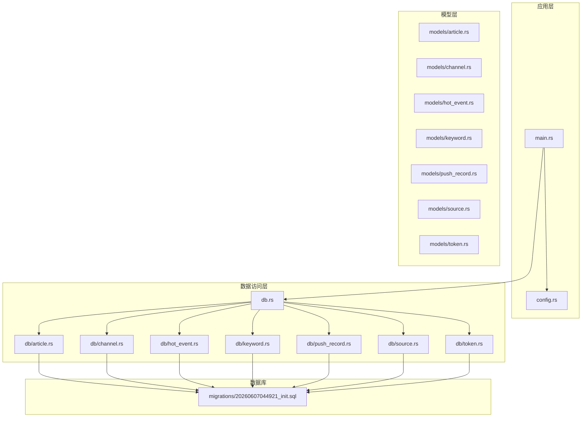
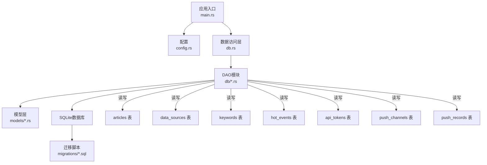
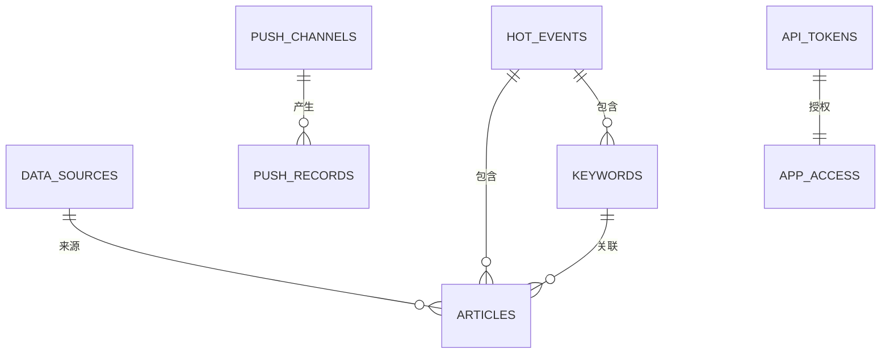
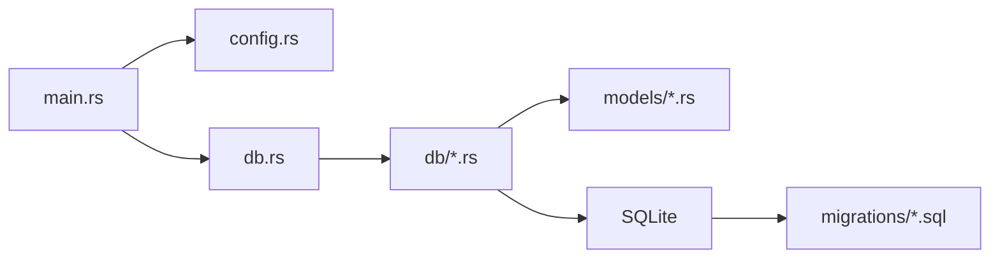

# 数据库设计

<cite>
**本文引用的文件**
- [20260607044921_init.sql](file://docs/migrations/20260607044921_init.sql)
- [db.rs](file://src/db.rs)
- [article.rs](file://src/models/article.rs)
- [channel.rs](file://src/models/channel.rs)
- [hot_event.rs](file://src/models/hot_event.rs)
- [keyword.rs](file://src/models/keyword.rs)
- [push_record.rs](file://src/models/push_record.rs)
- [source.rs](file://src/models/source.rs)
- [token.rs](file://src/models/token.rs)
- [article.rs](file://src/db/article.rs)
- [channel.rs](file://src/db/channel.rs)
- [hot_event.rs](file://src/db/hot_event.rs)
- [keyword.rs](file://src/db/keyword.rs)
- [push_record.rs](file://src/db/push_record.rs)
- [source.rs](file://src/db/source.rs)
- [token.rs](file://src/db/token.rs)
- [config.rs](file://src/config.rs)
- [main.rs](file://src/main.rs)
</cite>

## 目录
1. [简介](#简介)
2. [项目结构](#项目结构)
3. [核心组件](#核心组件)
4. [架构总览](#架构总览)
5. [详细组件分析](#详细组件分析)
6. [依赖分析](#依赖分析)
7. [性能考虑](#性能考虑)
8. [故障排查指南](#故障排查指南)
9. [结论](#结论)
10. [附录](#附录)

## 简介
本文件为“AI趋势监控系统”的数据库设计与实现文档，聚焦于数据模型、表间关系、索引与查询优化、迁移机制与版本控制、数据生命周期与备份恢复策略，并结合现有代码库中的迁移脚本与模型定义进行说明。目标是帮助开发者与运维人员理解并维护该数据库层。

## 项目结构
数据库相关的核心文件分布如下：
- 迁移脚本：位于 docs/migrations/ 下，包含初始化迁移文件
- 模型定义：位于 src/models/ 下，描述各实体的数据结构
- 数据访问层（DAO）：位于 src/db/ 下，封装对数据库的读写操作
- 应用入口与配置：src/main.rs 与 src/config.rs 中涉及数据库连接与WAL模式配置

**图表来源**
- [main.rs](file://src/main.rs)
- [config.rs](file://src/config.rs)
- [db.rs](file://src/db.rs)
- [20260607044921_init.sql](file://docs/migrations/20260607044921_init.sql)

**章节来源**
- [main.rs](file://src/main.rs)
- [config.rs](file://src/config.rs)
- [db.rs](file://src/db.rs)
- [20260607044921_init.sql](file://docs/migrations/20260607044921_init.sql)

## 核心组件
本节概述数据库中关键实体及其职责：
- api_tokens：用于鉴权与访问控制
- data_sources：数据源元信息与抓取配置
- articles：文章条目，关联数据源与关键词
- keywords：关键词集合，支持热度统计与事件关联
- hot_events：热点事件，聚合相关文章与关键词
- push_channels：推送渠道配置
- push_records：推送记录，追踪推送状态与结果

上述实体在迁移脚本中以表的形式定义，DAO 层负责具体 CRUD 操作，模型层提供类型安全的数据结构。

**章节来源**
- [20260607044921_init.sql](file://docs/migrations/20260607044921_init.sql)
- [db.rs](file://src/db.rs)

## 架构总览
下图展示应用层、数据访问层、模型层与数据库之间的交互关系，以及迁移脚本对数据库结构的影响。

**图表来源**
- [main.rs](file://src/main.rs)
- [config.rs](file://src/config.rs)
- [db.rs](file://src/db.rs)
- [20260607044921_init.sql](file://docs/migrations/20260607044921_init.sql)

## 详细组件分析

### 表结构与字段定义
以下基于迁移脚本中的建表语句，总结各表的字段、类型与约束。为避免冗长，此处仅列出关键列与约束要点；具体DDL请参考迁移脚本。

- api_tokens
  - 字段要点：标识符、令牌值、过期时间、状态等
  - 约束：唯一性、非空校验、有效期检查
  - 典型用途：鉴权与访问控制

- data_sources
  - 字段要点：名称、URL、抓取规则、状态、创建/更新时间
  - 约束：唯一名称、状态枚举、时间戳一致性
  - 典型用途：记录数据源元信息与抓取配置

- articles
  - 字段要点：标题、摘要、链接、发布时间、来源ID、关键词ID列表、内容摘要等
  - 约束：外键到 data_sources，时间排序、唯一链接或标题
  - 典型用途：存储抓取的文章条目

- keywords
  - 字段要点：关键词文本、热度计数、创建/更新时间
  - 约束：唯一关键词、热度非负
  - 典型用途：关键词聚合与热度统计

- hot_events
  - 字段要点：事件名、描述、开始/结束时间、关联关键词ID列表、文章ID列表
  - 约束：时间范围合理、关联完整性
  - 典型用途：热点事件聚合与展示

- push_channels
  - 字段要点：渠道名称、类型、配置参数、启用状态
  - 约束：唯一名称、类型枚举、配置JSON有效性
  - 典型用途：推送渠道配置

- push_records
  - 字段要点：推送目标、消息体、渠道ID、发送时间、状态、错误信息
  - 约束：外键到 push_channels，状态枚举，时间戳
  - 典型用途：追踪推送历史与结果

**章节来源**
- [20260607044921_init.sql](file://docs/migrations/20260607044921_init.sql)

### 表间关系与外键约束
根据迁移脚本与DAO层的使用方式，可归纳如下关系：
- articles 外键到 data_sources（来源）
- articles 外键到 keywords（多对多通过中间表或JSON数组字段）
- hot_events 与 keywords/ articles 存在多对多关联（通过ID列表或中间表）
- push_records 外键到 push_channels
- api_tokens 作为独立鉴权表，供中间件使用

**图表来源**
- [20260607044921_init.sql](file://docs/migrations/20260607044921_init.sql)

**章节来源**
- [20260607044921_init.sql](file://docs/migrations/20260607044921_init.sql)

### 索引策略与查询优化
- 建议索引
  - articles：按来源ID、发布时间、标题/链接唯一性建立索引
  - keywords：按关键词文本建立唯一索引
  - hot_events：按时间范围、关键词ID列表建立复合索引
  - push_records：按渠道ID、发送时间、状态建立索引
  - api_tokens：按令牌值与过期时间建立索引
- 查询优化
  - 使用覆盖索引减少回表
  - 对热点事件与关键词聚合查询使用物化视图或定期汇总表
  - 分页查询时使用基于游标的方式，避免深度分页
  - 避免 SELECT *，明确指定列
  - 对高频过滤条件（如状态、时间范围）优先建立索引

**章节来源**
- [20260607044921_init.sql](file://docs/migrations/20260607044921_init.sql)

### 数据库迁移机制与版本控制
- 迁移文件命名采用时间戳前缀，确保顺序与幂等性
- 迁移脚本包含建表、索引、约束与初始数据插入
- 版本控制策略
  - 每次结构变更新增独立迁移文件
  - 迁移执行失败需回滚策略（建议在生产环境使用事务包裹）
  - 迁移脚本应具备可重复执行能力
- 执行流程
  - 应用启动时自动检测未执行迁移并执行
  - 支持手动迁移命令（如 CLI 工具）

**章节来源**
- [20260607044921_init.sql](file://docs/migrations/20260607044921_init.sql)
- [db.rs](file://src/db.rs)

### 数据生命周期管理与保留策略
- 文章数据：按月/季度清理旧内容，保留近6个月至1年
- 推送记录：保留最近30天，归档历史
- 热点事件：事件结束后保留摘要与统计，删除明细
- 关键词热度：滚动更新，保留最近30天的热度曲线
- 访问令牌：过期即删，审计日志保留90天

**章节来源**
- [20260607044921_init.sql](file://docs/migrations/20260607044921_init.sql)

### 备份与恢复方案
- 备份
  - 定期全量备份 SQLite 文件
  - WAL 模式下可进行热备份（见下节）
- 恢复
  - 从最近备份恢复后，重放自备份时间点后的迁移
  - 验证关键查询路径与索引完整性
- 灾备
  - 异地复制数据库文件
  - 定期验证备份文件可用性

**章节来源**
- [config.rs](file://src/config.rs)
- [20260607044921_init.sql](file://docs/migrations/20260607044921_init.sql)

### SQL 查询示例与性能调优建议
- 示例查询（路径参考）
  - 获取某数据源近7天的文章列表：[20260607044921_init.sql](file://docs/migrations/20260607044921_init.sql)
  - 统计关键词热度TopN：[20260607044921_init.sql](file://docs/migrations/20260607044921_init.sql)
  - 查询某热点事件关联的文章与关键词：[20260607044921_init.sql](file://docs/migrations/20260607044921_init.sql)
  - 查看最近30天的推送记录与状态分布：[20260607044921_init.sql](file://docs/migrations/20260607044921_init.sql)
- 性能调优建议
  - 为高频查询列建立合适索引
  - 使用 EXPLAIN QUERY PLAN 分析执行计划
  - 将复杂聚合拆分为物化表或定时任务预计算
  - 控制单次查询返回行数，配合分页或游标

**章节来源**
- [20260607044921_init.sql](file://docs/migrations/20260607044921_init.sql)

### SQLite WAL 模式优势与配置
- 优势
  - 提升并发读写性能，读写不阻塞
  - 支持在线备份与热备份
  - 更好的崩溃恢复能力
- 配置
  - 在应用启动时设置 PRAGMA journal_mode=WAL
  - 可选设置 PRAGMA synchronous=NORMAL 或 EXTRA 平衡性能与安全性
  - 合理设置 PRAGMA wal_autocheckpoint 以控制 WAL 文件大小
- 注意事项
  - 生产环境建议开启 WAL
  - 结合定期 VACUUM 或在维护窗口执行重建索引

**章节来源**
- [config.rs](file://src/config.rs)
- [main.rs](file://src/main.rs)

## 依赖分析
- 组件耦合
  - DAO 层依赖模型层与数据库连接
  - 应用入口依赖配置与数据访问层
  - 迁移脚本独立于运行时逻辑，仅影响数据库结构
- 外部依赖
  - SQLite 作为本地数据库引擎
  - WAL 模式与相关 PRAGMA 设置
- 循环依赖
  - 当前结构未发现循环依赖

**图表来源**
- [main.rs](file://src/main.rs)
- [config.rs](file://src/config.rs)
- [db.rs](file://src/db.rs)
- [20260607044921_init.sql](file://docs/migrations/20260607044921_init.sql)

**章节来源**
- [main.rs](file://src/main.rs)
- [config.rs](file://src/config.rs)
- [db.rs](file://src/db.rs)
- [20260607044921_init.sql](file://docs/migrations/20260607044921_init.sql)

## 性能考虑
- I/O 与并发
  - 使用 WAL 模式提升并发读写吞吐
  - 合理设置缓存大小与页面大小
- 查询性能
  - 为热点查询列建立索引
  - 避免全表扫描，优先使用覆盖索引
- 写入优化
  - 批量插入与事务提交
  - 减少不必要的 UPDATE 次数
- 维护
  - 定期 ANALYZE 与统计更新
  - 监控 WAL 文件大小，必要时 checkpoint

[本节为通用指导，无需特定文件引用]

## 故障排查指南
- 常见问题
  - 迁移失败：检查迁移脚本语法与依赖完整性
  - 查询慢：确认索引是否命中，使用 EXPLAIN QUERY PLAN
  - 写入阻塞：确认是否启用 WAL，检查锁竞争
  - 备份异常：验证 WAL 文件可读性与权限
- 排查步骤
  - 查看应用日志与数据库 PRAGMA 信息
  - 执行关键查询的执行计划
  - 校验外键约束与唯一性约束
  - 验证迁移版本号与已执行记录

**章节来源**
- [20260607044921_init.sql](file://docs/migrations/20260607044921_init.sql)
- [db.rs](file://src/db.rs)

## 结论
本设计以迁移脚本驱动数据库演进，通过清晰的表结构、外键关系与索引策略支撑热点监控与推送场景。结合 WAL 模式与合理的生命周期管理，可在保证性能的同时满足可维护性与可靠性要求。后续建议持续完善物化视图与定时任务，进一步降低查询复杂度与提升响应速度。

## 附录
- 迁移脚本路径：[20260607044921_init.sql](file://docs/migrations/20260607044921_init.sql)
- 数据访问层入口：[db.rs](file://src/db.rs)
- 模型定义示例：[article.rs](file://src/models/article.rs)、[channel.rs](file://src/models/channel.rs)、[hot_event.rs](file://src/models/hot_event.rs)、[keyword.rs](file://src/models/keyword.rs)、[push_record.rs](file://src/models/push_record.rs)、[source.rs](file://src/models/source.rs)、[token.rs](file://src/models/token.rs)
- DAO 实现示例：[article.rs](file://src/db/article.rs)、[channel.rs](file://src/db/channel.rs)、[hot_event.rs](file://src/db/hot_event.rs)、[keyword.rs](file://src/db/keyword.rs)、[push_record.rs](file://src/db/push_record.rs)、[source.rs](file://src/db/source.rs)、[token.rs](file://src/db/token.rs)
- 配置与启动：[config.rs](file://src/config.rs)、[main.rs](file://src/main.rs)