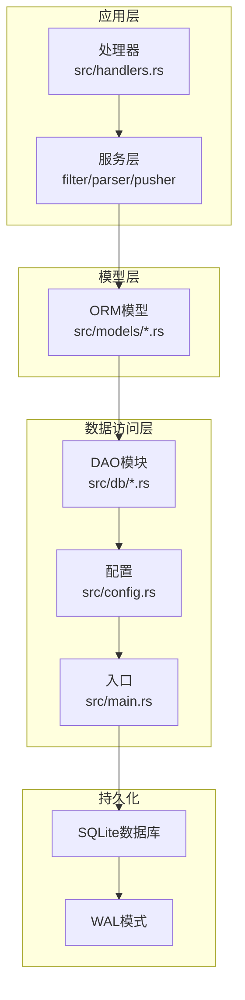
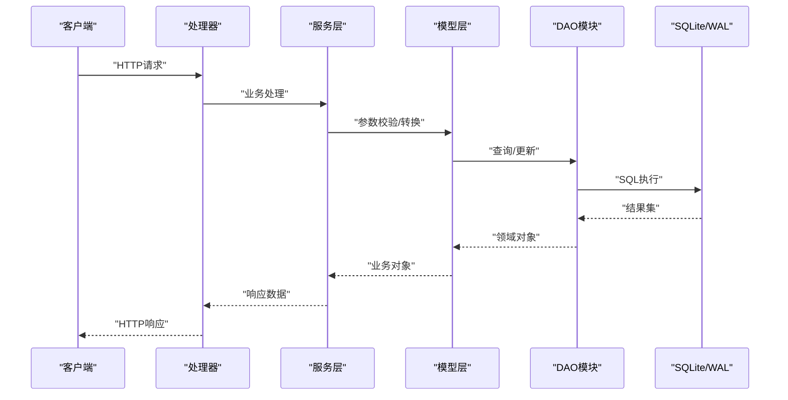
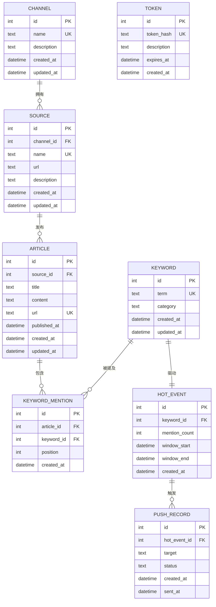

# 数据库设计

<cite>
**本文引用的文件**
- [src/db.rs](file://src/db.rs)
- [src/db/article.rs](file://src/db/article.rs)
- [src/db/channel.rs](file://src/db/channel.rs)
- [src/db/hot_event.rs](file://src/db/hot_event.rs)
- [src/db/keyword.rs](file://src/db/keyword.rs)
- [src/db/keyword_mention.rs](file://src/db/keyword_mention.rs)
- [src/db/push_record.rs](file://src/db/push_record.rs)
- [src/db/source.rs](file://src/db/source.rs)
- [src/db/token.rs](file://src/db/token.rs)
- [src/models/article.rs](file://src/models/article.rs)
- [src/models/channel.rs](file://src/models/channel.rs)
- [src/models/hot_event.rs](file://src/models/hot_event.rs)
- [src/models/keyword.rs](file://src/models/keyword.rs)
- [src/models/keyword_mention.rs](file://src/models/keyword_mention.rs)
- [src/models/push_record.rs](file://src/models/push_record.rs)
- [src/models/source.rs](file://src/models/source.rs)
- [src/models/token.rs](file://src/models/token.rs)
- [docs/migrations/20260607044921_init.sql](file://docs/migrations/20260607044921_init.sql)
- [docs/data/migration_example.json](file://docs/data/migration_example.json)
- [src/config.rs](file://src/config.rs)
- [src/main.rs](file://src/main.rs)
- [src/handlers.rs](file://src/handlers.rs)
- [src/services/filter.rs](file://src/services/filter.rs)
- [src/services/parser.rs](file://src/services/parser.rs)
- [src/services/pusher.rs](file://src/services/pusher.rs)
</cite>

## 目录
1. [简介](#简介)
2. [项目结构](#项目结构)
3. [核心组件](#核心组件)
4. [架构总览](#架构总览)
5. [详细组件分析](#详细组件分析)
6. [依赖分析](#依赖分析)
7. [性能考虑](#性能考虑)
8. [故障排除指南](#故障排除指南)
9. [结论](#结论)
10. [附录](#附录)

## 简介
本文件为“AI趋势监控系统”的数据库设计与实现文档，面向数据库管理员、后端工程师与产品团队，提供从实体关系、字段定义、索引约束到数据访问模式、缓存策略、性能优化、数据生命周期与迁移路径的完整说明。系统采用SQLite作为持久化存储，并通过WAL模式提升并发写入性能；同时结合Rust后端服务层与模型层，确保数据一致性与可维护性。

## 项目结构
数据库相关代码主要分布在以下位置：
- 迁移脚本：docs/migrations/20260607044921_init.sql
- 数据库连接与初始化：src/db.rs
- 实体模型与DAO层：src/db/*.rs（article、channel、hot_event、keyword、keyword_mention、push_record、source、token）
- ORM模型定义：src/models/*.rs（article、channel、hot_event、keyword、keyword_mention、push_record、source、token）
- 配置与入口：src/config.rs、src/main.rs
- 服务层：src/services/filter.rs、src/services/parser.rs、src/services/pusher.rs
- 处理器与路由：src/handlers.rs 及各模块处理器

**图表来源**
- [src/db.rs](file://src/db.rs)
- [src/config.rs](file://src/config.rs)
- [src/main.rs](file://src/main.rs)
- [src/handlers.rs](file://src/handlers.rs)

**章节来源**
- [src/db.rs](file://src/db.rs)
- [src/config.rs](file://src/config.rs)
- [src/main.rs](file://src/main.rs)
- [src/handlers.rs](file://src/handlers.rs)

## 核心组件
- 数据库连接与初始化：负责建立SQLite连接、启用WAL模式、执行迁移脚本并暴露统一的数据库句柄。
- DAO模块：每个实体对应一个DAO模块，封装CRUD操作、查询过滤与聚合统计。
- ORM模型：定义实体字段、校验规则与序列化格式，用于HTTP接口与服务层交互。
- 服务层：解析关键词、过滤热点事件、推送通知等业务逻辑。
- 迁移脚本：定义初始Schema与后续演进版本。

**章节来源**
- [src/db.rs](file://src/db.rs)
- [src/db/article.rs](file://src/db/article.rs)
- [src/db/channel.rs](file://src/db/channel.rs)
- [src/db/hot_event.rs](file://src/db/hot_event.rs)
- [src/db/keyword.rs](file://src/db/keyword.rs)
- [src/db/keyword_mention.rs](file://src/db/keyword_mention.rs)
- [src/db/push_record.rs](file://src/db/push_record.rs)
- [src/db/source.rs](file://src/db/source.rs)
- [src/db/token.rs](file://src/db/token.rs)
- [src/models/article.rs](file://src/models/article.rs)
- [src/models/channel.rs](file://src/models/channel.rs)
- [src/models/hot_event.rs](file://src/models/hot_event.rs)
- [src/models/keyword.rs](file://src/models/keyword.rs)
- [src/models/keyword_mention.rs](file://src/models/keyword_mention.rs)
- [src/models/push_record.rs](file://src/models/push_record.rs)
- [src/models/source.rs](file://src/models/source.rs)
- [src/models/token.rs](file://src/models/token.rs)
- [docs/migrations/20260607044921_init.sql](file://docs/migrations/20260607044921_init.sql)

## 架构总览
系统采用分层架构：应用层（Handlers）调用服务层（Services），服务层通过模型层（Models）与数据访问层（DAO）交互，DAO最终操作SQLite数据库。迁移脚本在启动时执行，保证Schema一致性。

**图表来源**
- [src/handlers.rs](file://src/handlers.rs)
- [src/services/filter.rs](file://src/services/filter.rs)
- [src/services/parser.rs](file://src/services/parser.rs)
- [src/services/pusher.rs](file://src/services/pusher.rs)
- [src/models/*.rs](file://src/models/article.rs)
- [src/db/*.rs](file://src/db/article.rs)
- [src/db.rs](file://src/db.rs)

## 详细组件分析

### 数据库模式与实体关系
基于迁移脚本与模型定义，系统的核心实体包括：Channel（频道）、Source（来源）、Article（文章）、Keyword（关键词）、KeywordMention（关键词提及）、HotEvent（热点事件）、PushRecord（推送记录）、Token（令牌）。下图展示实体间的关联关系与基数约束。

**图表来源**
- [docs/migrations/20260607044921_init.sql](file://docs/migrations/20260607044921_init.sql)
- [src/models/channel.rs](file://src/models/channel.rs)
- [src/models/source.rs](file://src/models/source.rs)
- [src/models/article.rs](file://src/models/article.rs)
- [src/models/keyword.rs](file://src/models/keyword.rs)
- [src/models/keyword_mention.rs](file://src/models/keyword_mention.rs)
- [src/models/hot_event.rs](file://src/models/hot_event.rs)
- [src/models/push_record.rs](file://src/models/push_record.rs)
- [src/models/token.rs](file://src/models/token.rs)

**章节来源**
- [docs/migrations/20260607044921_init.sql](file://docs/migrations/20260607044921_init.sql)
- [src/models/channel.rs](file://src/models/channel.rs)
- [src/models/source.rs](file://src/models/source.rs)
- [src/models/article.rs](file://src/models/article.rs)
- [src/models/keyword.rs](file://src/models/keyword.rs)
- [src/models/keyword_mention.rs](file://src/models/keyword_mention.rs)
- [src/models/hot_event.rs](file://src/models/hot_event.rs)
- [src/models/push_record.rs](file://src/models/push_record.rs)
- [src/models/token.rs](file://src/models/token.rs)

### 字段定义与数据类型
- Channel
  - id: 整型，主键
  - name: 文本，唯一
  - description: 文本
  - created_at/updated_at: 时间戳
- Source
  - id: 整型，主键
  - channel_id: 整型，外键指向Channel.id
  - name: 文本，唯一
  - url: 文本
  - description: 文本
  - created_at/updated_at: 时间戳
- Article
  - id: 整型，主键
  - source_id: 整型，外键指向Source.id
  - title: 文本
  - content: 文本
  - url: 文本，唯一
  - published_at: 时间戳
  - created_at/updated_at: 时间戳
- Keyword
  - id: 整型，主键
  - term: 文本，唯一
  - category: 文本
  - created_at/updated_at: 时间戳
- KeywordMention
  - id: 整型，主键
  - article_id: 整型，外键指向Article.id
  - keyword_id: 整型，外键指向Keyword.id
  - position: 整型
  - created_at: 时间戳
- HotEvent
  - id: 整型，主键
  - keyword_id: 整型，外键指向Keyword.id
  - mention_count: 整型
  - window_start/window_end: 时间戳
  - created_at: 时间戳
- PushRecord
  - id: 整型，主键
  - hot_event_id: 整型，外键指向HotEvent.id
  - target: 文本
  - status: 文本
  - created_at/sent_at: 时间戳
- Token
  - id: 整型，主键
  - token_hash: 文本，唯一
  - description: 文本
  - expires_at: 时间戳
  - created_at: 时间戳

**章节来源**
- [docs/migrations/20260607044921_init.sql](file://docs/migrations/20260607044921_init.sql)
- [src/models/channel.rs](file://src/models/channel.rs)
- [src/models/source.rs](file://src/models/source.rs)
- [src/models/article.rs](file://src/models/article.rs)
- [src/models/keyword.rs](file://src/models/keyword.rs)
- [src/models/keyword_mention.rs](file://src/models/keyword_mention.rs)
- [src/models/hot_event.rs](file://src/models/hot_event.rs)
- [src/models/push_record.rs](file://src/models/push_record.rs)
- [src/models/token.rs](file://src/models/token.rs)

### 主键、外键、索引与约束
- 唯一约束
  - Channel.name
  - Source.name
  - Article.url
  - Keyword.term
  - Token.token_hash
- 外键约束
  - Source.channel_id → Channel.id
  - Article.source_id → Source.id
  - KeywordMention.article_id → Article.id
  - KeywordMention.keyword_id → Keyword.id
  - HotEvent.keyword_id → Keyword.id
  - PushRecord.hot_event_id → HotEvent.id
- 索引建议
  - Article.published_at（高频查询）
  - KeywordMention.position（定位关键词出现位置）
  - HotEvent.window_start/window_end（时间窗口聚合）
  - PushRecord.status/target（推送状态与目标筛选）

**章节来源**
- [docs/migrations/20260607044921_init.sql](file://docs/migrations/20260607044921_init.sql)

### 数据验证规则与业务规则
- 关键词唯一性：term必须唯一，避免重复统计。
- 文章URL唯一性：防止重复抓取与入库。
- 时间窗口规则：HotEvent的window_start ≤ window_end，且按固定窗口滚动计算mention_count。
- 推送幂等：同一HotEvent与target组合应避免重复推送，可在PushRecord上增加复合唯一索引（hot_event_id, target）。
- 访问控制：Token过期自动失效，禁止访问受保护接口。

**章节来源**
- [src/models/keyword.rs](file://src/models/keyword.rs)
- [src/models/article.rs](file://src/models/article.rs)
- [src/models/hot_event.rs](file://src/models/hot_event.rs)
- [src/models/push_record.rs](file://src/models/push_record.rs)
- [src/models/token.rs](file://src/models/token.rs)

### 示例数据
- 迁移脚本中包含示例数据插入，可用于初始化开发环境或回归测试。
- 示例数据文件：docs/data/migration_example.json

**章节来源**
- [docs/data/migration_example.json](file://docs/data/migration_example.json)

### 数据访问模式
- 查询模式
  - 按时间窗口聚合热点事件：以HotEvent.window_start/window_end为条件，统计mention_count。
  - 关键词提及定位：通过KeywordMention.position快速定位文章中的关键词出现位置。
  - 来源与频道维度：通过Source.channel_id与Channel.id进行多表联结。
- 写入模式
  - 批量插入文章与关键词提及，减少事务开销。
  - 使用WAL模式提升并发写入吞吐。
- 缓存策略
  - 热点事件结果短期缓存（如Redis或内存缓存），降低重复聚合成本。
  - 关键词与来源元数据可缓存于应用层，减少频繁查询。

**章节来源**
- [src/db/article.rs](file://src/db/article.rs)
- [src/db/keyword_mention.rs](file://src/db/keyword_mention.rs)
- [src/db/hot_event.rs](file://src/db/hot_event.rs)
- [src/services/filter.rs](file://src/services/filter.rs)
- [src/services/parser.rs](file://src/services/parser.rs)
- [src/services/pusher.rs](file://src/services/pusher.rs)

### 性能考虑
- WAL模式优势
  - 提升并发写入性能，读写不阻塞。
  - 支持在线备份与恢复。
  - 降低写放大与锁竞争。
- 索引优化
  - 为高频查询字段建立索引（如published_at、status、target）。
  - 聚合查询使用覆盖索引减少回表。
- 分页与限制
  - 列表查询默认分页，限制单页数量，避免大结果集。
- 事务与批量
  - 批量插入/更新使用事务包裹，减少提交次数。
- 清理策略
  - 定期清理过期Token与历史日志，释放空间。

**章节来源**
- [src/db.rs](file://src/db.rs)
- [src/config.rs](file://src/config.rs)

### 数据生命周期、保留策略与归档
- 留存策略
  - 文章与关键词提及：按月/季度清理，保留最近N个月的活跃数据。
  - 热点事件：仅保留最近窗口内的事件，其余归档。
  - 推送记录：保留最近30天的推送状态以便审计。
  - Token：过期即删除。
- 归档规则
  - 将历史数据导出为压缩文件，存储于对象存储或本地归档目录。
  - 归档前对敏感字段脱敏或哈希处理。
- 清理任务
  - 后台定时任务定期扫描并删除过期数据。

**章节来源**
- [src/models/push_record.rs](file://src/models/push_record.rs)
- [src/models/token.rs](file://src/models/token.rs)
- [src/db/article.rs](file://src/db/article.rs)

### 数据迁移路径与版本管理
- 迁移脚本
  - 初始Schema：docs/migrations/20260607044921_init.sql
  - 后续版本：新增列、索引或表时，创建新迁移文件并按时间戳命名，确保可回滚。
- 版本管理
  - 迁移脚本内含up/down语义，支持升级与降级。
  - 应用启动时自动检测未执行的迁移并执行。
- 回滚策略
  - 对关键变更保留down脚本，必要时回滚至前一版本。
  - 回滚前备份数据库。

**章节来源**
- [docs/migrations/20260607044921_init.sql](file://docs/migrations/20260607044921_init.sql)
- [src/db.rs](file://src/db.rs)

### 数据安全、隐私与访问控制
- 访问控制
  - 所有受保护接口需携带有效Token，过期或无效Token拒绝访问。
  - Token具备描述与过期时间，便于审计与追踪。
- 隐私保护
  - 文章内容与URL为公开信息；若涉及用户隐私，应在入库前进行脱敏处理。
  - 导出数据时对敏感字段进行哈希或掩码。
- 审计
  - 记录Token创建、过期与删除事件，便于合规审计。

**章节来源**
- [src/models/token.rs](file://src/models/token.rs)
- [src/middleware/auth.rs](file://src/middleware/auth.rs)

## 依赖分析
- 组件耦合
  - DAO模块与模型层松耦合，通过模型对象传递数据。
  - 服务层独立于DAO，便于单元测试与替换实现。
- 外部依赖
  - SQLite作为嵌入式数据库，无需额外进程。
  - WAL模式由SQLite内置支持，配置简单。
- 循环依赖
  - 未发现循环依赖；各层职责清晰。

**图表来源**
- [src/handlers.rs](file://src/handlers.rs)
- [src/services/filter.rs](file://src/services/filter.rs)
- [src/services/parser.rs](file://src/services/parser.rs)
- [src/services/pusher.rs](file://src/services/pusher.rs)
- [src/models/*.rs](file://src/models/article.rs)
- [src/db/*.rs](file://src/db/article.rs)
- [src/db.rs](file://src/db.rs)

**章节来源**
- [src/handlers.rs](file://src/handlers.rs)
- [src/services/filter.rs](file://src/services/filter.rs)
- [src/services/parser.rs](file://src/services/parser.rs)
- [src/services/pusher.rs](file://src/services/pusher.rs)
- [src/models/*.rs](file://src/models/article.rs)
- [src/db/*.rs](file://src/db/article.rs)
- [src/db.rs](file://src/db.rs)

## 性能考虑
- WAL模式配置
  - 在应用启动时启用WAL，显著提升并发写入能力。
  - 配置检查点间隔与自动checkpoint策略，平衡性能与磁盘占用。
- 查询优化
  - 使用EXPLAIN QUERY PLAN分析慢查询，针对性添加索引。
  - 避免SELECT *，只选择必要字段。
- 缓存与批处理
  - 对热点事件与关键词统计结果进行缓存。
  - 批量插入/更新减少事务提交次数。
- 监控与告警
  - 监控数据库文件大小、连接数、慢查询数量，设置阈值告警。

**章节来源**
- [src/db.rs](file://src/db.rs)
- [src/config.rs](file://src/config.rs)

## 故障排除指南
- 迁移失败
  - 检查迁移脚本语法与权限；确认数据库文件可写。
  - 使用down回滚至上一版本后重试。
- 查询缓慢
  - 分析执行计划，确认索引是否命中。
  - 调整WHERE条件与LIMIT数量。
- 写入阻塞
  - 检查WAL文件是否存在锁；确认未开启独占锁模式。
  - 适当调整checkpoint策略。
- 数据不一致
  - 核对事务边界，确保批量操作在单事务内完成。
  - 对关键更新使用SELECT FOR UPDATE锁定。

**章节来源**
- [docs/migrations/20260607044921_init.sql](file://docs/migrations/20260607044921_init.sql)
- [src/db.rs](file://src/db.rs)

## 结论
本数据库设计围绕“频道—来源—文章—关键词—热点事件—推送记录—令牌”构建，通过唯一约束与外键保证数据完整性；借助SQLite WAL模式与索引策略提升性能；配合迁移脚本与缓存策略实现可演进与高可用。建议在生产环境中强化审计与备份机制，并持续监控查询性能与数据增长趋势。

## 附录
- 示例数据文件：docs/data/migration_example.json
- 初始迁移脚本：docs/migrations/20260607044921_init.sql
- 入口与配置：src/main.rs、src/config.rs
- DAO与模型：src/db/*.rs、src/models/*.rs
- 服务层：src/services/filter.rs、src/services/parser.rs、src/services/pusher.rs