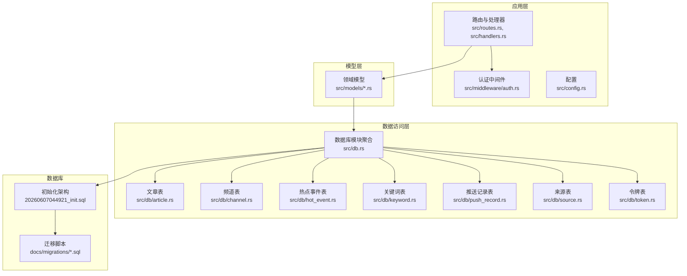
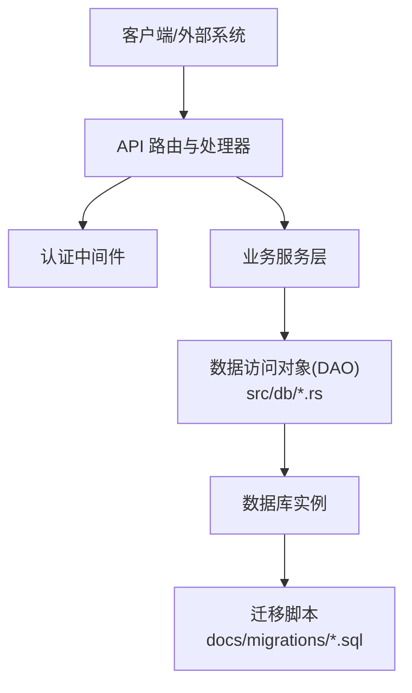
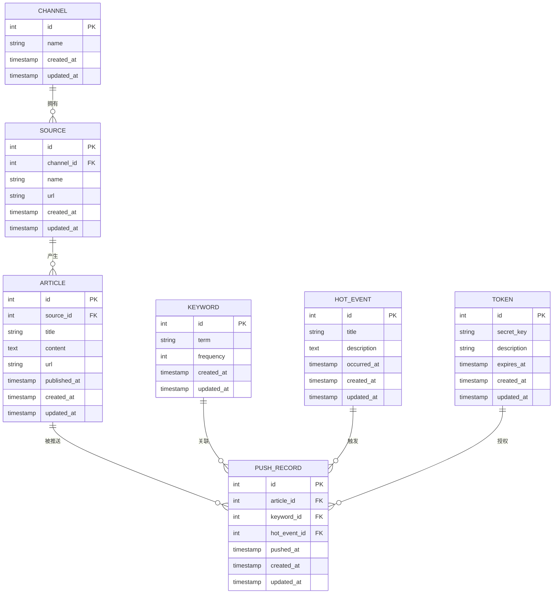
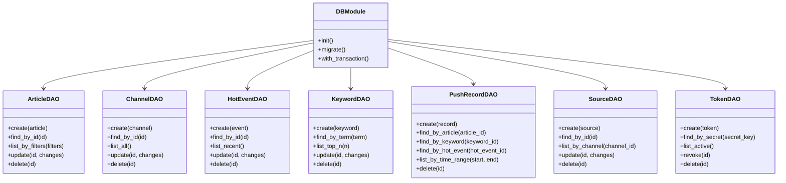
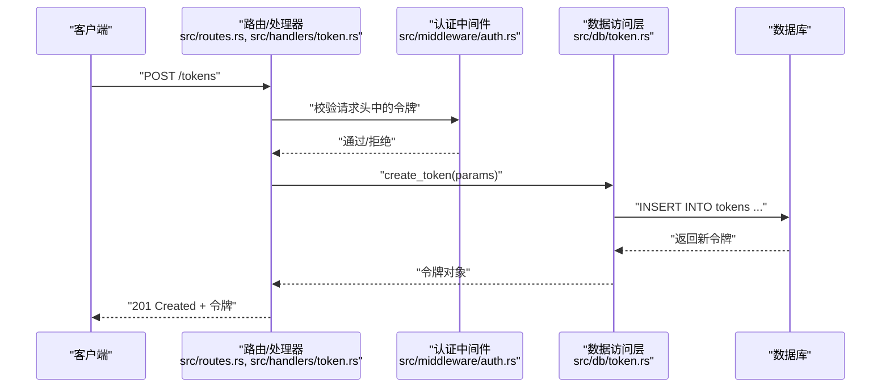
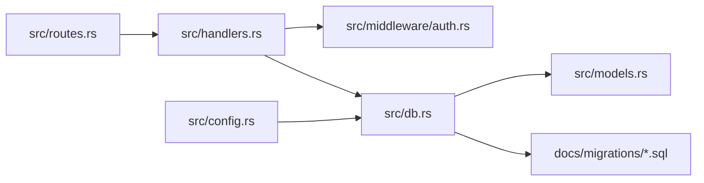

# 数据库设计

<cite>
**本文引用的文件**
- [20260607044921_init.sql](file://docs/migrations/20260607044921_init.sql)
- [article.rs](file://src/db/article.rs)
- [channel.rs](file://src/db/channel.rs)
- [hot_event.rs](file://src/db/hot_event.rs)
- [keyword.rs](file://src/db/keyword.rs)
- [push_record.rs](file://src/db/push_record.rs)
- [source.rs](file://src/db/source.rs)
- [token.rs](file://src/db/token.rs)
- [db.rs](file://src/db.rs)
- [models.rs](file://src/models.rs)
- [article.rs](file://src/models/article.rs)
- [channel.rs](file://src/models/channel.rs)
- [hot_event.rs](file://src/models/hot_event.rs)
- [keyword.rs](file://src/models/keyword.rs)
- [push_record.rs](file://src/models/push_record.rs)
- [source.rs](file://src/models/source.rs)
- [token.rs](file://src/models/token.rs)
- [routes.rs](file://src/routes.rs)
- [handlers.rs](file://src/handlers.rs)
- [token.rs](file://src/handlers/token.rs)
- [auth.rs](file://src/middleware/auth.rs)
- [config.rs](file://src/config.rs)
- [README.md](file://README.md)
- [02-database-migrations.md](file://docs/plans/02-database-migrations.md)
- [database-schema.spec.md](file://openspec/specs/database-schema/spec.md)
- [data-models.spec.md](file://openspec/specs/data-models/spec.md)
</cite>

## 目录
1. [简介](#简介)
2. [项目结构](#项目结构)
3. [核心组件](#核心组件)
4. [架构总览](#架构总览)
5. [详细组件分析](#详细组件分析)
6. [依赖分析](#依赖分析)
7. [性能考虑](#性能考虑)
8. [故障排查指南](#故障排查指南)
9. [结论](#结论)
10. [附录](#附录)

## 简介
本文件为 AI-Trend-Tool 的数据库设计文档，聚焦于数据库架构、表结构设计与关系映射，迁移脚本的执行顺序与版本管理，索引策略与查询优化，数据完整性约束、事务处理与并发控制，以及数据库部署、备份恢复与监控方案。同时说明与 ORM 层（基于 Rust 的数据库访问）的交互模式与数据访问抽象。

## 项目结构
数据库相关代码主要分布在以下位置：
- 迁移脚本：docs/migrations/20260607044921_init.sql
- 模型定义：src/models/*.rs
- 数据访问层：src/db/*.rs
- 应用入口与路由：src/main.rs、src/routes.rs、src/handlers.rs
- 中间件与配置：src/middleware/auth.rs、src/config.rs
- 规划与规范：docs/plans/02-database-migrations.md、openspec/specs/database-schema/spec.md、openspec/specs/data-models/spec.md

图表来源
- [db.rs](file://src/db.rs)
- [routes.rs](file://src/routes.rs)
- [handlers.rs](file://src/handlers.rs)
- [auth.rs](file://src/middleware/auth.rs)
- [config.rs](file://src/config.rs)
- [20260607044921_init.sql](file://docs/migrations/20260607044921_init.sql)

章节来源
- [README.md](file://README.md)
- [02-database-migrations.md](file://docs/plans/02-database-migrations.md)

## 核心组件
- 初始化迁移脚本：负责创建数据库表、索引、约束与初始数据。
- 数据访问模块：封装对各实体表的 CRUD 操作与查询。
- 领域模型：定义业务实体与字段约束，作为数据访问层的输入输出类型。
- 路由与处理器：对外暴露 API，驱动数据访问层完成业务操作。
- 认证中间件：在访问受保护资源前进行令牌校验与权限控制。
- 配置：提供数据库连接参数、事务隔离级别等运行时配置。

章节来源
- [20260607044921_init.sql](file://docs/migrations/20260607044921_init.sql)
- [db.rs](file://src/db.rs)
- [models.rs](file://src/models.rs)
- [routes.rs](file://src/routes.rs)
- [handlers.rs](file://src/handlers.rs)
- [auth.rs](file://src/middleware/auth.rs)
- [config.rs](file://src/config.rs)

## 架构总览
数据库层采用“模型-数据访问-应用层”分层架构：
- 模型层：定义业务实体与字段语义。
- 数据访问层：通过 SQL 或 ORM 抽象实现对表的增删改查。
- 应用层：路由与处理器协调业务流程，中间件保障安全与一致性。
- 迁移层：以版本化脚本管理数据库演进。

图表来源
- [routes.rs](file://src/routes.rs)
- [handlers.rs](file://src/handlers.rs)
- [auth.rs](file://src/middleware/auth.rs)
- [db.rs](file://src/db.rs)
- [20260607044921_init.sql](file://docs/migrations/20260607044921_init.sql)

## 详细组件分析

### 表结构与关系映射
根据初始化迁移脚本与模型定义，核心实体包括：
- 文章（Article）
- 频道（Channel）
- 热点事件（HotEvent）
- 关键词（Keyword）
- 推送记录（PushRecord）
- 来源（Source）
- 令牌（Token）

图表来源
- [20260607044921_init.sql](file://docs/migrations/20260607044921_init.sql)
- [article.rs](file://src/db/article.rs)
- [channel.rs](file://src/db/channel.rs)
- [hot_event.rs](file://src/db/hot_event.rs)
- [keyword.rs](file://src/db/keyword.rs)
- [push_record.rs](file://src/db/push_record.rs)
- [source.rs](file://src/db/source.rs)
- [token.rs](file://src/db/token.rs)

章节来源
- [20260607044921_init.sql](file://docs/migrations/20260607044921_init.sql)
- [article.rs](file://src/db/article.rs)
- [channel.rs](file://src/db/channel.rs)
- [hot_event.rs](file://src/db/hot_event.rs)
- [keyword.rs](file://src/db/keyword.rs)
- [push_record.rs](file://src/db/push_record.rs)
- [source.rs](file://src/db/source.rs)
- [token.rs](file://src/db/token.rs)

### 数据访问层（DAO）与 ORM 交互
- 数据访问模块聚合：src/db.rs 聚合各实体的数据访问实现，统一导出接口。
- 实体 DAO：每个实体对应一个模块（如 article.rs、channel.rs 等），封装 SQL 查询与写入。
- 模型绑定：模型层（src/models/*.rs）定义结构体与字段约束，DAO 将其作为输入/输出类型。
- 事务与并发：通过配置与中间件确保请求级事务边界与并发控制策略一致。

图表来源
- [db.rs](file://src/db.rs)
- [article.rs](file://src/db/article.rs)
- [channel.rs](file://src/db/channel.rs)
- [hot_event.rs](file://src/db/hot_event.rs)
- [keyword.rs](file://src/db/keyword.rs)
- [push_record.rs](file://src/db/push_record.rs)
- [source.rs](file://src/db/source.rs)
- [token.rs](file://src/db/token.rs)

章节来源
- [db.rs](file://src/db.rs)
- [article.rs](file://src/db/article.rs)
- [channel.rs](file://src/db/channel.rs)
- [hot_event.rs](file://src/db/hot_event.rs)
- [keyword.rs](file://src/db/keyword.rs)
- [push_record.rs](file://src/db/push_record.rs)
- [source.rs](file://src/db/source.rs)
- [token.rs](file://src/db/token.rs)

### API 工作流（以令牌 API 为例）

图表来源
- [routes.rs](file://src/routes.rs)
- [handlers.rs](file://src/handlers.rs)
- [token.rs](file://src/handlers/token.rs)
- [auth.rs](file://src/middleware/auth.rs)
- [token.rs](file://src/db/token.rs)

章节来源
- [routes.rs](file://src/routes.rs)
- [handlers.rs](file://src/handlers.rs)
- [token.rs](file://src/handlers/token.rs)
- [auth.rs](file://src/middleware/auth.rs)
- [token.rs](file://src/db/token.rs)

### 迁移脚本执行顺序与版本管理
- 版本命名：采用时间戳前缀（如 20260607044921）确保全局唯一且可排序。
- 执行顺序：按文件名升序执行，先执行较早版本，再执行更新版本。
- 版本回滚：建议在每次变更中新增迁移文件，避免直接修改已执行版本；如需回滚，新增逆向迁移文件。
- 自动化：在应用启动或运维脚本中集成迁移执行逻辑，确保数据库 schema 与应用版本一致。

章节来源
- [02-database-migrations.md](file://docs/plans/02-database-migrations.md)
- [20260607044921_init.sql](file://docs/migrations/20260607044921_init.sql)

### 索引策略与查询优化
- 唯一性索引：对需要去重的关键字段建立唯一索引（如频道名称、关键词词项、令牌密钥）。
- 范围查询索引：对时间字段（如文章发布时间、推送时间、令牌过期时间）建立索引以加速范围查询。
- 复合索引：对常用过滤组合（如频道-来源、来源-文章、热点事件-关键词）建立复合索引。
- 统计信息：定期更新统计信息以帮助查询优化器选择最优执行计划。
- 分页与限制：对列表查询设置合理分页大小与上限，避免一次性返回大量数据。

章节来源
- [20260607044921_init.sql](file://docs/migrations/20260607044921_init.sql)
- [article.rs](file://src/db/article.rs)
- [push_record.rs](file://src/db/push_record.rs)
- [hot_event.rs](file://src/db/hot_event.rs)
- [keyword.rs](file://src/db/keyword.rs)

### 数据完整性约束与事务处理
- 主外键约束：通过外键保证实体间引用完整性（如文章属于来源、推送记录关联文章/关键词/热点事件）。
- 非空与默认值：对关键字段设置非空与默认值，减少脏数据。
- 并发控制：使用行级锁与乐观/悲观锁策略，结合事务隔离级别（如读已提交或可重复读）降低并发冲突。
- 事务边界：在处理器中将一次业务操作封装为单个事务，失败时回滚，成功时提交。

章节来源
- [20260607044921_init.sql](file://docs/migrations/20260607044921_init.sql)
- [db.rs](file://src/db.rs)
- [auth.rs](file://src/middleware/auth.rs)

### 与 ORM 层的交互模式与数据访问抽象
- 模型到 DAO：模型层定义结构体，DAO 层负责将其映射为 SQL 查询与结果集。
- 抽象接口：通过 trait 或模块接口抽象数据库操作，便于替换底层实现或测试替身。
- 连接与会话：在应用启动时初始化连接池，DAO 在方法内获取会话并在事务中执行。
- 错误处理：将数据库错误转换为统一的业务错误类型，向上抛出以便路由层处理。

章节来源
- [models.rs](file://src/models.rs)
- [db.rs](file://src/db.rs)
- [article.rs](file://src/db/article.rs)
- [channel.rs](file://src/db/channel.rs)
- [hot_event.rs](file://src/db/hot_event.rs)
- [keyword.rs](file://src/db/keyword.rs)
- [push_record.rs](file://src/db/push_record.rs)
- [source.rs](file://src/db/source.rs)
- [token.rs](file://src/db/token.rs)

## 依赖分析
- 应用层依赖模型层与数据访问层；数据访问层依赖数据库与迁移脚本。
- 认证中间件在路由与数据访问之间提供安全边界。
- 配置模块为数据库连接与事务参数提供集中管理。

图表来源
- [routes.rs](file://src/routes.rs)
- [handlers.rs](file://src/handlers.rs)
- [auth.rs](file://src/middleware/auth.rs)
- [db.rs](file://src/db.rs)
- [models.rs](file://src/models.rs)
- [config.rs](file://src/config.rs)
- [20260607044921_init.sql](file://docs/migrations/20260607044921_init.sql)

章节来源
- [routes.rs](file://src/routes.rs)
- [handlers.rs](file://src/handlers.rs)
- [auth.rs](file://src/middleware/auth.rs)
- [db.rs](file://src/db.rs)
- [models.rs](file://src/models.rs)
- [config.rs](file://src/config.rs)
- [20260607044921_init.sql](file://docs/migrations/20260607044921_init.sql)

## 性能考虑
- 查询优化：为高频过滤与排序字段建立索引；避免 SELECT *，仅选择必要列；对大表使用分页与 LIMIT。
- 写入优化：批量插入与更新；合并频繁的小事务；使用只读副本承载报表类查询。
- 缓存策略：热点数据（如热门关键词、近期热点事件）引入缓存层，降低数据库压力。
- 监控指标：记录慢查询日志、事务等待时间、连接池利用率与锁等待次数。
- 定期维护：重建碎片索引、更新统计信息、清理过期数据。

## 故障排查指南
- 迁移失败：检查迁移脚本语法与依赖顺序；确认数据库用户权限；查看迁移执行日志。
- 查询缓慢：分析执行计划，确认索引是否命中；检查是否存在全表扫描；优化 WHERE 与 JOIN 条件。
- 并发冲突：调整事务隔离级别；减少长事务；对热点数据使用乐观锁或队列化写入。
- 连接池耗尽：增加最大连接数或缩短超时时间；检查未释放的事务或游标。
- 令牌失效：核对令牌过期时间与签名校验逻辑；检查中间件拦截规则。

章节来源
- [20260607044921_init.sql](file://docs/migrations/20260607044921_init.sql)
- [auth.rs](file://src/middleware/auth.rs)
- [db.rs](file://src/db.rs)

## 结论
本设计以版本化迁移脚本管理数据库演进，通过清晰的模型-数据访问-应用三层架构实现高内聚低耦合。配合完善的索引策略、事务与并发控制机制，以及可扩展的 ORM 抽象，能够支撑 AI-Trend-Tool 的数据需求。建议在生产环境中持续监控性能指标并定期优化索引与查询计划。

## 附录
- 数据库部署指南
  - 准备数据库实例与用户权限。
  - 执行迁移脚本，确保版本顺序正确。
  - 启动应用，验证连接与基本查询。
- 备份与恢复策略
  - 定期全量备份与增量日志备份。
  - 使用快照或复制技术实现多活或多副本。
  - 制定恢复演练计划，验证 RPO/RTO 指标。
- 监控方案
  - 关键指标：QPS、慢查询、连接数、锁等待、磁盘与内存使用。
  - 告警阈值：针对异常波动与资源瓶颈设定分级告警。
  - 日志采集：开启慢查询日志与错误日志，定期归档分析。