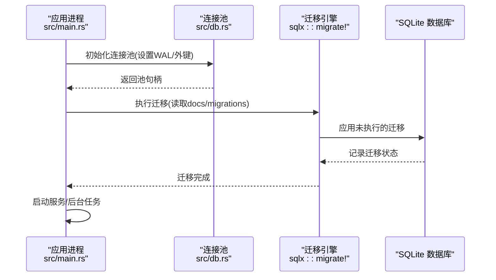
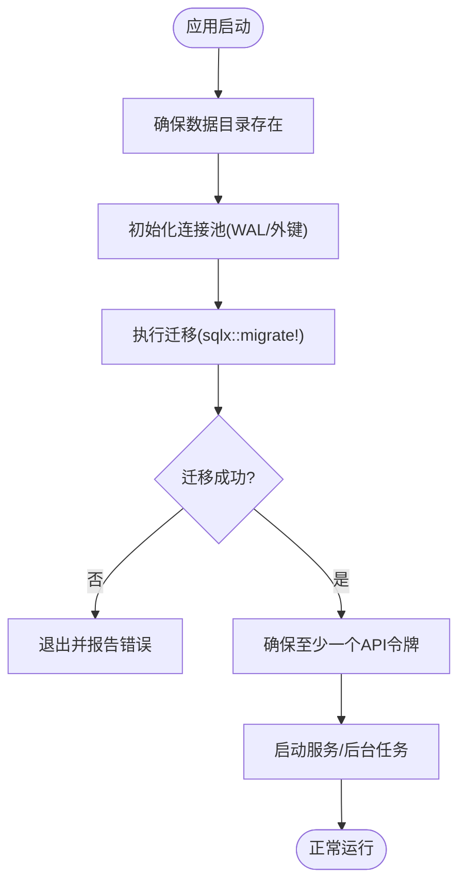
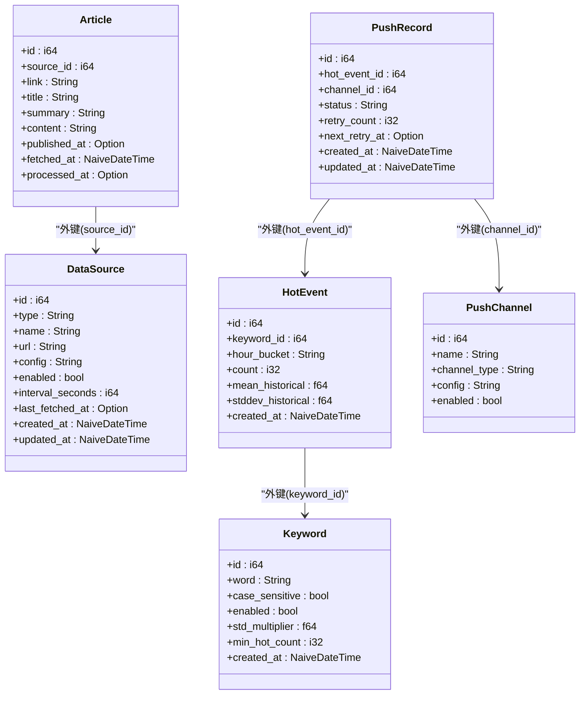
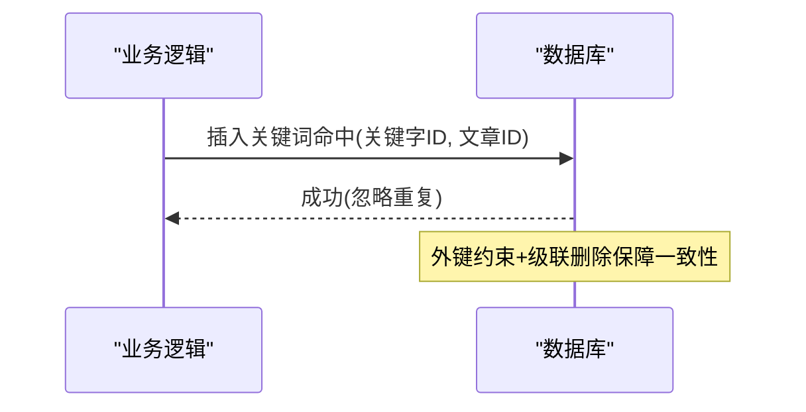
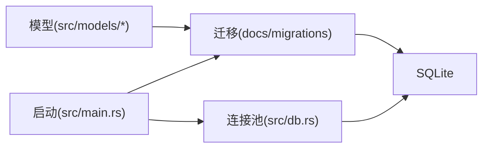

# 数据库迁移

<cite>
**本文引用的文件**
- [docs/migrations/20260607044921_init.sql](file://docs/migrations/20260607044921_init.sql)
- [docs/plans/02-database-migrations.md](file://docs/plans/02-database-migrations.md)
- [src/main.rs](file://src/main.rs)
- [src/db.rs](file://src/db.rs)
- [src/models/article.rs](file://src/models/article.rs)
- [src/models/keyword.rs](file://src/models/keyword.rs)
- [src/models/hot_event.rs](file://src/models/hot_event.rs)
- [src/models/channel.rs](file://src/models/channel.rs)
- [src/models/push_record.rs](file://src/models/push_record.rs)
- [src/db/keyword_mention.rs](file://src/db/keyword_mention.rs)
- [openspec/specs/database-schema/spec.md](file://openspec/specs/database-schema/spec.md)
- [openspec/changes/archive/2026-06-07-db-migrations-and-models/design.md](file://openspec/changes/archive/2026-06-07-db-migrations-and-models/design.md)
- [openspec/changes/archive/2026-06-07-db-migrations-and-models/proposal.md](file://openspec/changes/archive/2026-06-07-db-migrations-and-models/proposal.md)
- [openspec/changes/archive/2026-06-07-db-migrations-and-models/tasks.md](file://openspec/changes/archive/2026-06-07-db-migrations-and-models/tasks.md)
</cite>

## 目录
1. [简介](#简介)
2. [项目结构](#项目结构)
3. [核心组件](#核心组件)
4. [架构总览](#架构总览)
5. [详细组件分析](#详细组件分析)
6. [依赖分析](#依赖分析)
7. [性能考量](#性能考量)
8. [故障排除指南](#故障排除指南)
9. [结论](#结论)
10. [附录](#附录)

## 简介
本文件面向“AI趋势监控系统”的数据库迁移管理，系统采用 SQLite + sqlx 的迁移与模型绑定方案。核心目标包括：
- 解释 SQLite 迁移系统的实现机制与版本控制策略
- 说明初始迁移文件的结构与命名规范
- 阐述迁移脚本的执行顺序与依赖关系管理
- 提供数据库版本升级的安全策略与回滚机制建议
- 介绍迁移过程中的数据保护与一致性保证
- 给出迁移失败的故障排除与修复方法
- 总结生产环境迁移最佳实践与风险控制
- 说明迁移脚本编写规范与测试策略
- 说明如何添加新迁移版本与扩展数据库结构
- 提供迁移工具使用指南与自动化部署方案

## 项目结构
与数据库迁移直接相关的文件与职责如下：
- 迁移脚本：docs/migrations/20260607044921_init.sql（初始化 DDL）
- 迁移计划与验证：docs/plans/02-database-migrations.md
- 应用启动与迁移执行：src/main.rs（启动时自动运行迁移）
- 连接池与 SQLite 参数：src/db.rs（WAL 模式与外键强制）
- 数据模型（sqlx::FromRow）：src/models/*（与迁移列定义一一对应）
- 关键业务逻辑示例：src/db/keyword_mention.rs（关键词命中插入）

```mermaid
graph TB
A["应用入口<br/>src/main.rs"] --> B["迁移执行<br/>sqlx::migrate!(\"./docs/migrations\")"]
B --> C["迁移脚本<br/>docs/migrations/20260607044921_init.sql"]
A --> D["连接池初始化<br/>src/db.rs"]
D --> E["SQLite 参数<br/>WAL + 外键强制"]
A --> F["数据模型<br/>src/models/*.rs"]
F --> C
```

图表来源
- [src/main.rs:80-82](file://src/main.rs#L80-L82)
- [src/db.rs:12-26](file://src/db.rs#L12-L26)
- [docs/migrations/20260607044921_init.sql:1-118](file://docs/migrations/20260607044921_init.sql#L1-L118)

章节来源
- [src/main.rs:64-82](file://src/main.rs#L64-L82)
- [src/db.rs:10-26](file://src/db.rs#L10-L26)
- [docs/plans/02-database-migrations.md:16-421](file://docs/plans/02-database-migrations.md#L16-L421)

## 核心组件
- 迁移脚本与版本控制
  - 使用 sqlx 的编译时迁移嵌入机制，通过 sqlx::migrate! 在启动时自动执行未应用的迁移。
  - 初始迁移文件命名为时间戳前缀的单文件，便于一次性初始化所有表结构与索引。
- 连接池与 SQLite 参数
  - 初始化连接池时启用 WAL 模式与外键强制，确保并发写入与参照完整性。
- 数据模型与迁移一致性
  - 所有模型均实现 sqlx::FromRow，字段类型与迁移脚本保持一致，避免运行时映射错误。

章节来源
- [src/main.rs:80-82](file://src/main.rs#L80-L82)
- [src/db.rs:19-23](file://src/db.rs#L19-L23)
- [docs/plans/02-database-migrations.md:151-421](file://docs/plans/02-database-migrations.md#L151-L421)

## 架构总览
下图展示从应用启动到迁移执行、模型绑定与数据库访问的整体流程：



图表来源
- [src/main.rs:77-82](file://src/main.rs#L77-L82)
- [src/db.rs:12-26](file://src/db.rs#L12-L26)

## 详细组件分析

### 迁移脚本与版本控制
- 结构与命名
  - 初始迁移文件采用时间戳前缀命名，集中包含所有建表 DDL 与索引创建。
  - 文件内按模块分段注释，清晰标识各表结构与约束。
- 版本控制策略
  - 当前为单文件初始化；若后续演进，建议新增独立迁移文件以保持幂等与可追踪性。
  - sqlx::migrate! 在编译时嵌入迁移脚本，确保构建阶段即发现语法问题。
- 执行顺序与依赖
  - 迁移按文件名排序执行；由于是初始化脚本且为幂等建表，通常无需显式依赖声明。
  - 实际依赖由外键约束与删除级联体现（如文章与数据源、关键词与文章/事件等）。

章节来源
- [docs/migrations/20260607044921_init.sql:1-118](file://docs/migrations/20260607044921_init.sql#L1-L118)
- [docs/plans/02-database-migrations.md:16-421](file://docs/plans/02-database-migrations.md#L16-L421)
- [openspec/changes/archive/2026-06-07-db-migrations-and-models/design.md:79-90](file://openspec/changes/archive/2026-06-07-db-migrations-and-models/design.md#L79-L90)

### 迁移执行与启动流程
- 启动阶段
  - 创建数据目录、初始化连接池（WAL + 外键），随后执行迁移。
  - 迁移失败将导致进程退出，避免在不完整模式下运行。
- 验证节点
  - 编译检查确保模型与迁移匹配；
  - 启动后可通过 sqlite3 查看表是否存在；
  - 也可通过列出迁移状态进行核验。



图表来源
- [src/main.rs:71-84](file://src/main.rs#L71-L84)

章节来源
- [src/main.rs:64-84](file://src/main.rs#L64-L84)
- [openspec/changes/archive/2026-06-07-db-migrations-and-models/proposal.md:29-35](file://openspec/changes/archive/2026-06-07-db-migrations-and-models/proposal.md#L29-L35)
- [openspec/changes/archive/2026-06-07-db-migrations-and-models/tasks.md:24-29](file://openspec/changes/archive/2026-06-07-db-migrations-and-models/tasks.md#L24-L29)

### 数据模型与一致性保证
- 字段映射
  - 所有模型实现 sqlx::FromRow，字段类型与迁移脚本严格对应，避免运行时转换错误。
- 一致性与约束
  - 外键与 ON DELETE CASCADE 由连接池初始化时启用的 PRAGMA 保障；
  - 唯一约束（如文章链接、关键词词）在迁移中定义，防止重复数据。
- 时间字段
  - 默认时间使用 SQLite datetime('now')，统一为 UTC；模型使用无时区的 NaiveDateTime。



图表来源
- [docs/migrations/20260607044921_init.sql:33-47](file://docs/migrations/20260607044921_init.sql#L33-L47)
- [docs/migrations/20260607044921_init.sql:17-28](file://docs/migrations/20260607044921_init.sql#L17-L28)
- [docs/migrations/20260607044921_init.sql:52-60](file://docs/migrations/20260607044921_init.sql#L52-L60)
- [docs/migrations/20260607044921_init.sql:78-86](file://docs/migrations/20260607044921_init.sql#L78-L86)
- [docs/migrations/20260607044921_init.sql:94-100](file://docs/migrations/20260607044921_init.sql#L94-L100)
- [docs/migrations/20260607044921_init.sql:105-115](file://docs/migrations/20260607044921_init.sql#L105-L115)

章节来源
- [src/models/article.rs:1-25](file://src/models/article.rs#L1-L25)
- [src/models/keyword.rs:1-32](file://src/models/keyword.rs#L1-L32)
- [src/models/hot_event.rs:1-15](file://src/models/hot_event.rs#L1-L15)
- [src/models/channel.rs:1-26](file://src/models/channel.rs#L1-L26)
- [src/models/push_record.rs:1-16](file://src/models/push_record.rs#L1-L16)
- [openspec/specs/database-schema/spec.md:67-92](file://openspec/specs/database-schema/spec.md#L67-L92)

### 关键业务示例：关键词命中记录
- 插入逻辑
  - 使用 INSERT OR IGNORE 避免重复主键或唯一冲突；
  - 通过外键约束与级联删除保证数据一致性。
- 流程示意



图表来源
- [src/db/keyword_mention.rs:3-18](file://src/db/keyword_mention.rs#L3-L18)
- [docs/migrations/20260607044921_init.sql:65-73](file://docs/migrations/20260607044921_init.sql#L65-L73)

章节来源
- [src/db/keyword_mention.rs:1-18](file://src/db/keyword_mention.rs#L1-L18)

## 依赖分析
- 组件耦合与内聚
  - 迁移脚本与模型高度内聚：每个模型字段与迁移列一一对应；
  - 连接池参数影响所有查询：WAL 提升并发写入，外键强制保障参照完整性。
- 外部依赖
  - sqlx::migrate! 在编译时嵌入迁移脚本，构建失败即暴露迁移问题；
  - 运行时依赖 SQLite 文件系统与 WAL 日志。



图表来源
- [src/main.rs:77-82](file://src/main.rs#L77-L82)
- [src/db.rs:12-26](file://src/db.rs#L12-L26)
- [docs/migrations/20260607044921_init.sql:1-118](file://docs/migrations/20260607044921_init.sql#L1-L118)

章节来源
- [src/main.rs:77-82](file://src/main.rs#L77-L82)
- [src/db.rs:12-26](file://src/db.rs#L12-L26)
- [docs/plans/02-database-migrations.md:151-421](file://docs/plans/02-database-migrations.md#L151-L421)

## 性能考量
- WAL 模式
  - 提升并发写入吞吐，降低锁竞争，适合持续写入场景。
- 索引设计
  - 文章表的关键索引覆盖处理状态、来源与抓取时间，有利于查询优化。
- 时间字段
  - 默认时间来自 SQLite UTC，模型为无时区类型，适合单机部署；多时区需另行设计。

章节来源
- [src/db.rs:19-23](file://src/db.rs#L19-L23)
- [docs/migrations/20260607044921_init.sql:45-47](file://docs/migrations/20260607044921_init.sql#L45-L47)
- [openspec/changes/archive/2026-06-07-db-migrations-and-models/design.md:83](file://openspec/changes/archive/2026-06-07-db-migrations-and-models/design.md#L83)

## 故障排除指南
- 迁移失败
  - 现象：启动时报错，进程退出。
  - 排查：检查迁移脚本语法与列定义是否与模型匹配；确认构建阶段 sqlx 嵌入是否成功。
- 表不存在或数量不符
  - 现象：启动后 sqlite3 列表表名异常。
  - 排查：确认迁移目录路径正确；检查 WAL/外键是否生效；重新执行迁移。
- 数据重复或唯一约束冲突
  - 现象：插入关键词或文章报唯一约束错误。
  - 排查：确认去重逻辑（如文章链接唯一）；避免重复导入。
- 外键约束无效
  - 现象：删除父记录后子记录未级联删除。
  - 排查：确认连接池初始化已设置 PRAGMA foreign_keys=ON。

章节来源
- [src/main.rs:80-82](file://src/main.rs#L80-L82)
- [src/db.rs:19-23](file://src/db.rs#L19-L23)
- [openspec/changes/archive/2026-06-07-db-migrations-and-models/tasks.md:24-29](file://openspec/changes/archive/2026-06-07-db-migrations-and-models/tasks.md#L24-L29)

## 结论
本系统采用“编译时嵌入 + 运行时自动执行”的迁移策略，结合 WAL 与外键强制，确保了开发与生产环境的一致性与可靠性。通过严格的模型-迁移一致性校验与明确的验证节点，显著降低了迁移风险。未来演进建议采用多文件迁移与更细粒度的回滚策略，以进一步提升可维护性与安全性。

## 附录

### 迁移脚本编写规范
- 命名规范
  - 使用时间戳前缀，集中初始化脚本；后续演进拆分为独立迁移文件。
- 幂等性
  - 使用 IF NOT EXISTS 等幂等语句，避免重复执行导致错误。
- 约束与索引
  - 明确外键、唯一、索引定义，确保查询性能与数据完整性。
- 注释与模块化
  - 分段注释各表结构，便于阅读与审计。

章节来源
- [docs/migrations/20260607044921_init.sql:1-118](file://docs/migrations/20260607044921_init.sql#L1-L118)
- [docs/plans/02-database-migrations.md:16-421](file://docs/plans/02-database-migrations.md#L16-L421)

### 测试策略
- 编译期测试
  - cargo check 确保模型与迁移匹配。
- 运行期测试
  - 启动服务验证迁移成功；
  - 使用 sqlite3 验证表与索引存在；
  - 执行关键业务插入/查询验证约束与索引效果。

章节来源
- [docs/plans/02-database-migrations.md:408-421](file://docs/plans/02-database-migrations.md#L408-L421)
- [openspec/changes/archive/2026-06-07-db-migrations-and-models/tasks.md:24-29](file://openspec/changes/archive/2026-06-07-db-migrations-and-models/tasks.md#L24-L29)

### 生产环境迁移最佳实践
- 只读备份
  - 升级前对数据库文件进行备份。
- 低峰时段
  - 选择业务低峰期执行迁移，缩短停机窗口。
- 渐进式发布
  - 先在预生产验证，再灰度到生产。
- 回滚预案
  - 保留备份与迁移历史；必要时回退到上一版本数据库与二进制。
- 监控与告警
  - 启动后监控迁移日志与关键指标，快速发现异常。

章节来源
- [openspec/changes/archive/2026-06-07-db-migrations-and-models/design.md:79-90](file://openspec/changes/archive/2026-06-07-db-migrations-and-models/design.md#L79-L90)

### 如何添加新的迁移版本与扩展结构
- 新增迁移文件
  - 使用 sqlx migrate add <name> 创建新迁移；
  - 将变更拆分为独立文件，保持幂等与可追踪。
- 扩展数据库结构
  - 在新迁移中添加表/索引/约束；
  - 同步更新模型定义与序列化结构。
- 验证与回归
  - 本地验证迁移与模型匹配；
  - 预生产回归测试通过后再上线。

章节来源
- [docs/plans/02-database-migrations.md:16-421](file://docs/plans/02-database-migrations.md#L16-L421)
- [openspec/specs/database-schema/spec.md:67-123](file://openspec/specs/database-schema/spec.md#L67-L123)

### 迁移工具使用指南与自动化部署
- 工具命令
  - 初始化迁移目录与生成迁移文件；
  - 构建时自动嵌入迁移脚本，运行时自动应用。
- 自动化部署
  - CI/CD 在构建阶段执行 cargo check 与迁移验证；
  - 部署阶段先迁移再启动服务，失败即终止。

章节来源
- [docs/plans/02-database-migrations.md:16-421](file://docs/plans/02-database-migrations.md#L16-L421)
- [src/main.rs:77-82](file://src/main.rs#L77-L82)