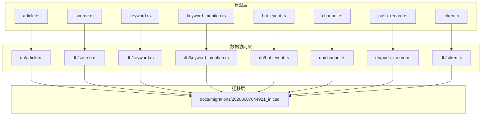
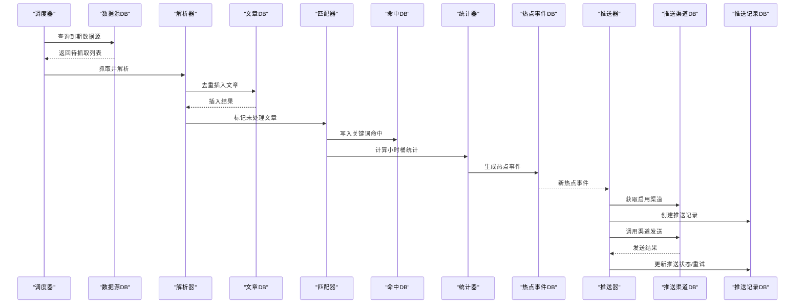
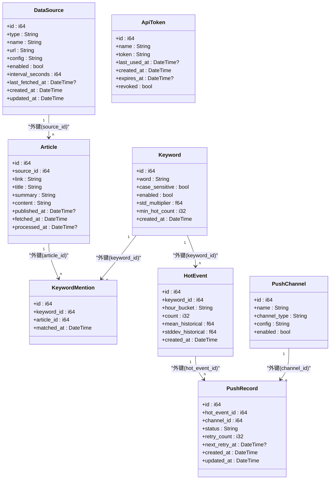
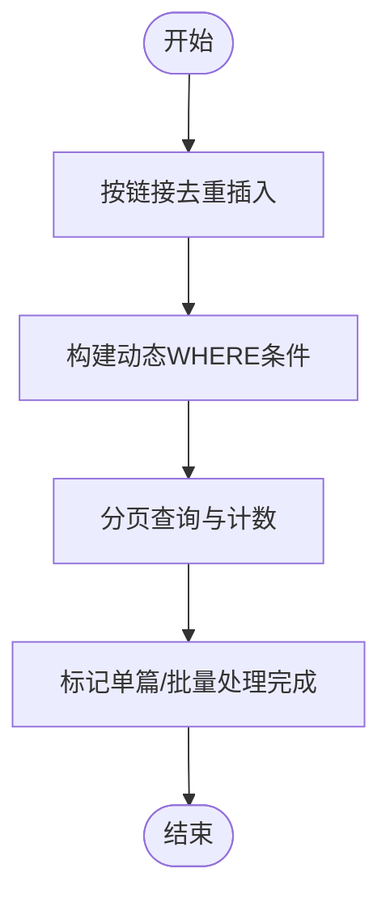

# 数据模型概览

<cite>
**本文档引用的文件**
- [models.rs](file://src/models.rs)
- [db.rs](file://src/db.rs)
- [article.rs](file://src/models/article.rs)
- [channel.rs](file://src/models/channel.rs)
- [source.rs](file://src/models/source.rs)
- [keyword.rs](file://src/models/keyword.rs)
- [hot_event.rs](file://src/models/hot_event.rs)
- [keyword_mention.rs](file://src/models/keyword_mention.rs)
- [push_record.rs](file://src/models/push_record.rs)
- [token.rs](file://src/models/token.rs)
- [article_db.rs](file://src/db/article.rs)
- [channel_db.rs](file://src/db/channel.rs)
- [source_db.rs](file://src/db/source.rs)
- [keyword_db.rs](file://src/db/keyword.rs)
- [hot_event_db.rs](file://src/db/hot_event.rs)
- [keyword_mention_db.rs](file://src/db/keyword_mention.rs)
- [push_record_db.rs](file://src/db/push_record.rs)
- [token_db.rs](file://src/db/token.rs)
- [init.sql](file://docs/migrations/20260607044921_init.sql)
</cite>

## 目录
1. [简介](#简介)
2. [项目结构](#项目结构)
3. [核心组件](#核心组件)
4. [架构总览](#架构总览)
5. [详细组件分析](#详细组件分析)
6. [依赖关系分析](#依赖关系分析)
7. [性能考量](#性能考量)
8. [故障排查指南](#故障排查指南)
9. [结论](#结论)

## 简介
本文件为 AI 趋势监控系统的数据模型概览文档，面向开发与运维人员，系统性阐述核心数据实体、实体间关系、数据流与关键设计决策。通过 ER 图与流程图直观展示“数据源采集 → 文章入库 → 关键词匹配 → 热点事件生成 → 推送通道分发”的完整链路，并给出命名规范、索引策略与并发控制要点。

## 项目结构
系统采用按领域模块划分的 Rust 结构：models 定义数据结构，db 层封装 SQLX 查询，迁移脚本定义数据库表结构与约束。核心模块如下：
- 模型层：文章、数据源、关键词、关键词命中、热点事件、推送渠道、推送记录、API Token
- 数据访问层：各实体对应的数据库操作模块
- 迁移层：SQLite 初始化建表与索引



图表来源
- [models.rs:1-9](file://src/models.rs#L1-L9)
- [db.rs:1-9](file://src/db.rs#L1-L9)
- [init.sql:1-118](file://docs/migrations/20260607044921_init.sql#L1-L118)

章节来源
- [models.rs:1-9](file://src/models.rs#L1-L9)
- [db.rs:1-9](file://src/db.rs#L1-L9)
- [init.sql:1-118](file://docs/migrations/20260607044921_init.sql#L1-L118)

## 核心组件
本系统围绕以下核心实体构建数据模型：
- 数据源（DataSource）：描述 RSS/Atom/JSON Feed 等来源的元信息与调度参数
- 文章（Article）：从数据源抓取到的具体条目，具备去重链接字段
- 关键词（Keyword）：用于趋势检测的检索词及统计阈值
- 关键词命中（KeywordMention）：文章与关键词的多对多关联明细
- 热点事件（HotEvent）：按小时聚合后的关键词热度统计
- 推送渠道（PushChannel）：Webhook 等通知通道配置
- 推送记录（PushRecord）：热点事件向各渠道的投递记录与重试控制
- API Token（ApiToken）：后端接口鉴权令牌

章节来源
- [article.rs:1-25](file://src/models/article.rs#L1-L25)
- [source.rs:1-39](file://src/models/source.rs#L1-L39)
- [keyword.rs:1-32](file://src/models/keyword.rs#L1-L32)
- [hot_event.rs:1-15](file://src/models/hot_event.rs#L1-L15)
- [keyword_mention.rs:1-12](file://src/models/keyword_mention.rs#L1-L12)
- [channel.rs:1-26](file://src/models/channel.rs#L1-L26)
- [push_record.rs:1-16](file://src/models/push_record.rs#L1-L16)
- [token.rs:1-45](file://src/models/token.rs#L1-L45)

## 架构总览
整体数据流分为四阶段：
1) 数据采集与入库：定时扫描待抓取数据源，去重插入文章
2) 内容处理与匹配：标记未处理文章，解析内容并建立关键词命中
3) 统计与热点检测：按小时桶聚合，计算均值与标准差，生成热点事件
4) 事件推送：为热点事件创建推送记录，按状态与重试策略投递



图表来源
- [source_db.rs:119-132](file://src/db/source.rs#L119-L132)
- [article_db.rs:6-29](file://src/db/article.rs#L6-L29)
- [keyword_mention_db.rs:1-17](file://src/db/keyword_mention.rs#L1-L17)
- [hot_event_db.rs:5-24](file://src/db/hot_event.rs#L5-L24)
- [push_record_db.rs:20-43](file://src/db/push_record.rs#L20-L43)
- [channel_db.rs:26-30](file://src/db/channel.rs#L26-L30)

## 详细组件分析

### 数据模型类图
下图展示核心实体的属性与关系，以及外键约束与唯一性约束。



图表来源
- [init.sql:17-43](file://docs/migrations/20260607044921_init.sql#L17-L43)
- [init.sql:52-70](file://docs/migrations/20260607044921_init.sql#L52-L70)
- [init.sql:78-86](file://docs/migrations/20260607044921_init.sql#L78-L86)
- [init.sql:94-100](file://docs/migrations/20260607044921_init.sql#L94-L100)
- [init.sql:105-115](file://docs/migrations/20260607044921_init.sql#L105-L115)

章节来源
- [article.rs:5-16](file://src/models/article.rs#L5-L16)
- [source.rs:5-19](file://src/models/source.rs#L5-L19)
- [keyword.rs:5-14](file://src/models/keyword.rs#L5-L14)
- [hot_event.rs:5-14](file://src/models/hot_event.rs#L5-L14)
- [keyword_mention.rs:5-11](file://src/models/keyword_mention.rs#L5-L11)
- [channel.rs:4-11](file://src/models/channel.rs#L4-L11)
- [push_record.rs:5-15](file://src/models/push_record.rs#L5-L15)
- [token.rs:5-14](file://src/models/token.rs#L5-L14)

### 数据库初始化与索引策略
- 初始化脚本定义了完整的表结构、主键、外键与唯一约束，确保数据一致性
- 关键查询路径建立了索引以优化常见过滤与排序：
  - 文章：processed_at、source_id、fetched_at
  - 关键词命中：keyword_id、article_id
  - 热点事件：keyword_id、hour_bucket
  - 推送记录：status

章节来源
- [init.sql:45-47](file://docs/migrations/20260607044921_init.sql#L45-L47)
- [init.sql:72-73](file://docs/migrations/20260607044921_init.sql#L72-L73)
- [init.sql:88-89](file://docs/migrations/20260607044921_init.sql#L88-L89)
- [init.sql:117-117](file://docs/migrations/20260607044921_init.sql#L117-L117)

### 文章实体与处理流程
- 去重策略：基于 link 字段的唯一约束，避免重复插入
- 分页与过滤：支持按 source_id 与 processed 状态过滤，限制每页最大 100 条
- 批量处理：提供批量标记 processed_at 的分片更新，规避 SQLite 参数上限



图表来源
- [article_db.rs:6-29](file://src/db/article.rs#L6-L29)
- [article_db.rs:31-75](file://src/db/article.rs#L31-L75)
- [article_db.rs:104-140](file://src/db/article.rs#L104-L140)

章节来源
- [article_db.rs:6-29](file://src/db/article.rs#L6-L29)
- [article_db.rs:31-75](file://src/db/article.rs#L31-L75)
- [article_db.rs:104-140](file://src/db/article.rs#L104-L140)

### 关键词与命中关系
- 关键词命中采用“插入忽略”策略，避免重复写入
- 多对多关系通过中间表 keyword_mentions 解耦，便于扩展匹配维度

章节来源
- [keyword_mention_db.rs:1-17](file://src/db/keyword_mention.rs#L1-L17)
- [keyword_mention.rs:5-11](file://src/models/keyword_mention.rs#L5-L11)

### 热点事件与统计逻辑
- 小时桶格式为字符串，便于按时间窗口聚合
- 提供按关键字与全局的分页查询与计数接口
- 支持按最近 N 小时聚合统计，辅助突发检测

章节来源
- [hot_event_db.rs:60-85](file://src/db/hot_event.rs#L60-L85)
- [hot_event_db.rs:88-103](file://src/db/hot_event.rs#L88-L103)
- [hot_event_db.rs:105-123](file://src/db/hot_event.rs#L105-L123)
- [hot_event.rs:5-14](file://src/models/hot_event.rs#L5-L14)

### 推送记录与重试机制
- 为每个热点事件为启用渠道创建推送记录，利用唯一约束避免重复
- 支持乐观锁更新，防止并发状态下状态错乱
- 提供“待重试”记录筛选与状态更新

章节来源
- [push_record_db.rs:20-43](file://src/db/push_record.rs#L20-L43)
- [push_record_db.rs:53-63](file://src/db/push_record.rs#L53-L63)
- [push_record_db.rs:87-109](file://src/db/push_record.rs#L87-L109)
- [push_record.rs:5-15](file://src/models/push_record.rs#L5-L15)

### API Token 管理
- 支持创建、查询、吊销与使用时间追踪
- 列表响应隐藏明文 token，仅返回摘要信息

章节来源
- [token_db.rs:6-28](file://src/db/token.rs#L6-L28)
- [token_db.rs:47-61](file://src/db/token.rs#L47-L61)
- [token.rs:17-38](file://src/models/token.rs#L17-L38)

## 依赖关系分析
- 模块内聚：每个实体的模型与数据库操作分别位于 models 与 db 子模块，职责清晰
- 外键约束：通过 SQLite 外键与 ON DELETE CASCADE 确保级联删除的一致性
- 唯一约束：如文章 link、API token token、推送记录 (hot_event_id, channel_id) 防止重复
- 查询路径：根据高频过滤条件建立索引，减少全表扫描

```mermaid
graph LR
DataSource["数据源"] --> Article["文章"]
Article --> KeywordMention["关键词命中"]
Keyword["关键词"] --> KeywordMention
Keyword --> HotEvent["热点事件"]
HotEvent --> PushRecord["推送记录"]
PushChannel["推送渠道"] --> PushRecord
ApiToken["API Token"] -.-> 所有DB ["各DB模块"]
```

图表来源
- [init.sql:35-43](file://docs/migrations/20260607044921_init.sql#L35-L43)
- [init.sql:67-70](file://docs/migrations/20260607044921_init.sql#L67-L70)
- [init.sql:80-86](file://docs/migrations/20260607044921_init.sql#L80-L86)
- [init.sql:107-115](file://docs/migrations/20260607044921_init.sql#L107-L115)

章节来源
- [init.sql:35-43](file://docs/migrations/20260607044921_init.sql#L35-L43)
- [init.sql:67-70](file://docs/migrations/20260607044921_init.sql#L67-L70)
- [init.sql:80-86](file://docs/migrations/20260607044921_init.sql#L80-L86)
- [init.sql:107-115](file://docs/migrations/20260607044921_init.sql#L107-L115)

## 性能考量
- SQLite 连接池：最大连接数限制为 5，适合单机部署与低并发场景
- WAL 模式与外键强制：提升并发读写稳定性与数据一致性
- 分页与索引：针对高频查询建立索引，避免大表全表扫描
- 批量更新：文章批量标记 processed_at 使用分片（每批最多 100），规避 SQLite 变量上限
- 动态 SQL：部分模块使用动态 WHERE 构造，注意参数绑定与 SQL 注入防护

章节来源
- [db.rs:10-26](file://src/db.rs#L10-L26)
- [article_db.rs:125-140](file://src/db/article.rs#L125-L140)

## 故障排查指南
- 文章未被处理：检查 processed_at 是否为空；确认未处理文章查询与标记流程
- 关键词未命中：确认命中记录是否已存在；检查大小写敏感与去重策略
- 热点事件缺失：核对小时桶格式与统计聚合逻辑；检查按关键字过滤参数
- 推送失败重试：查看推送记录状态与重试次数；确认乐观锁更新是否成功
- 数据源未抓取：检查 last_fetched_at 与 interval_seconds；必要时重置为 NULL 触发下次轮询

章节来源
- [article_db.rs:104-122](file://src/db/article.rs#L104-L122)
- [keyword_mention_db.rs:1-17](file://src/db/keyword_mention.rs#L1-L17)
- [hot_event_db.rs:105-123](file://src/db/hot_event.rs#L105-L123)
- [push_record_db.rs:53-63](file://src/db/push_record.rs#L53-L63)
- [source_db.rs:119-132](file://src/db/source.rs#L119-L132)

## 结论
本数据模型以 SQLite 为核心存储，围绕“数据源 → 文章 → 关键词命中 → 热点事件 → 推送记录”的链路构建，通过外键与唯一约束保障一致性，通过索引与分页优化查询性能。模型层与数据访问层分离，便于演进与维护。建议在生产环境中结合实际吞吐评估连接池与索引策略，并持续完善异常与重试治理。