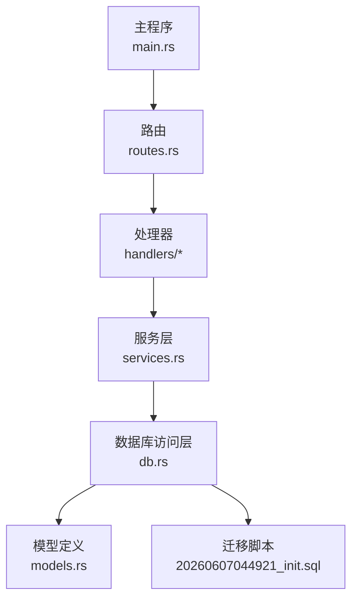
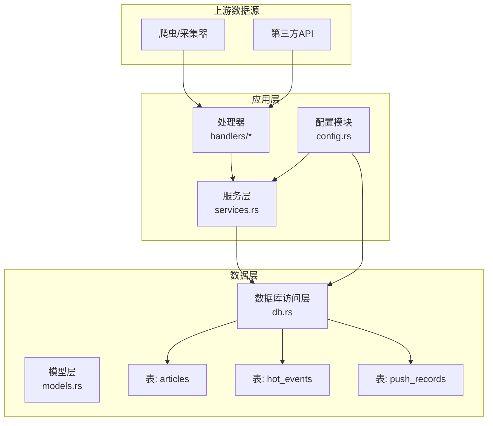
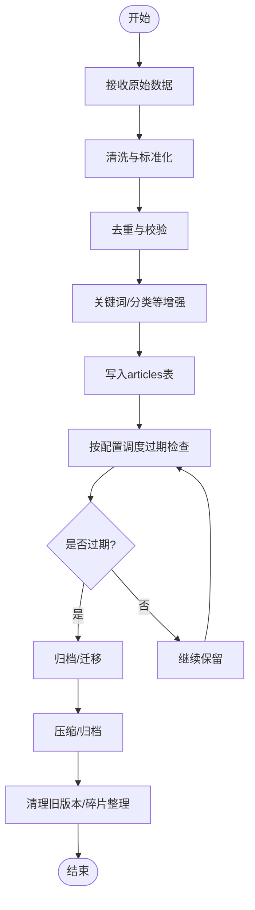
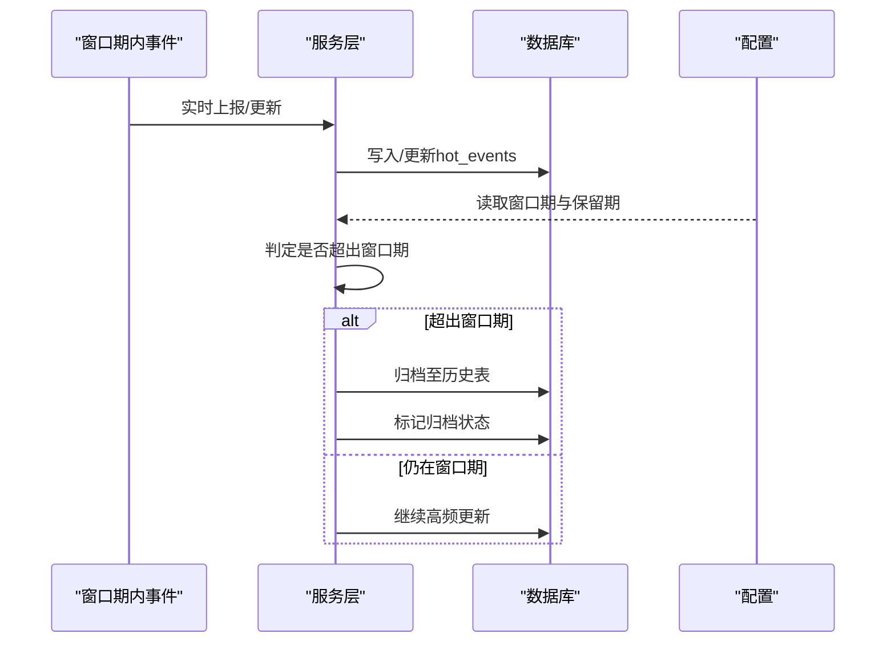
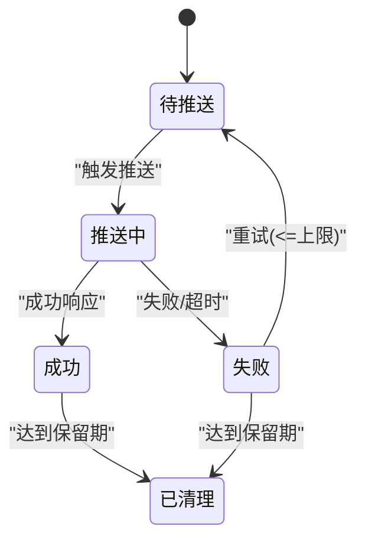
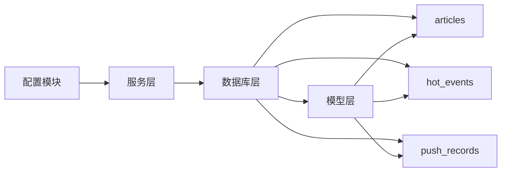

# 数据生命周期

<cite>
**本文引用的文件**
- [20260607044921_init.sql](file://docs/migrations/20260607044921_init.sql)
- [db.rs](file://src/db.rs)
- [models.rs](file://src/models.rs)
- [article.rs](file://src/db/article.rs)
- [hot_event.rs](file://src/db/hot_event.rs)
- [push_record.rs](file://src/db/push_record.rs)
- [services.rs](file://src/services.rs)
- [config.rs](file://src/config.rs)
- [README.md](file://README.md)
</cite>

## 目录
1. [简介](#简介)
2. [项目结构](#项目结构)
3. [核心组件](#核心组件)
4. [架构总览](#架构总览)
5. [详细组件分析](#详细组件分析)
6. [依赖关系分析](#依赖关系分析)
7. [性能与容量规划](#性能与容量规划)
8. [故障排查指南](#故障排查指南)
9. [结论](#结论)
10. [附录](#附录)

## 简介
本文件面向AI趋势监控系统的数据生命周期管理，围绕三类核心数据表（articles、hot_events、push_records）梳理其创建、存储、处理与销毁的全链路流程；解释文章数据从抓取、处理到过期清理的完整过程；阐述热点事件的时效性管理与历史归档策略；分析推送记录的状态流转与清理机制；给出数据保留策略配置项、业务影响评估、数据量增长预测与存储容量规划建议；并覆盖备份与灾难恢复、压缩与归档、数据质量监控与异常处理、以及数据清理脚本与批量删除操作指南。

## 项目结构
系统采用Rust后端工程，数据库迁移脚本定义了初始表结构；模型层与数据库层分离；服务层封装业务逻辑；配置模块集中管理运行参数；主入口负责路由与启动。

**图表来源**
- [db.rs](file://src/db.rs)
- [models.rs](file://src/models.rs)
- [services.rs](file://src/services.rs)
- [20260607044921_init.sql](file://docs/migrations/20260607044921_init.sql)

**章节来源**
- [README.md](file://README.md)
- [db.rs](file://src/db.rs)
- [models.rs](file://src/models.rs)
- [services.rs](file://src/services.rs)
- [20260607044921_init.sql](file://docs/migrations/20260607044921_init.sql)

## 核心组件
- 数据库层：封装连接、事务与SQL执行，提供对各实体表的增删改查能力。
- 模型层：定义数据结构与字段约束，承载业务规则与校验。
- 服务层：编排业务流程，如文章抓取与处理、热点事件聚合、推送状态管理等。
- 配置模块：集中管理数据保留时长、清理周期、压缩策略等参数。
- 迁移脚本：定义articles、hot_events、push_records等表的结构与索引。

**章节来源**
- [db.rs](file://src/db.rs)
- [models.rs](file://src/models.rs)
- [services.rs](file://src/services.rs)
- [config.rs](file://src/config.rs)
- [20260607044921_init.sql](file://docs/migrations/20260607044921_init.sql)

## 架构总览
下图展示数据生命周期在系统内的流转：外部抓取或导入产生原始数据，经由服务层进行清洗与聚合，写入数据库；随后通过定时任务或后台作业执行过期清理与归档；同时配置模块控制保留策略与压缩策略，保障系统稳定与成本可控。

**图表来源**
- [services.rs](file://src/services.rs)
- [db.rs](file://src/db.rs)
- [models.rs](file://src/models.rs)
- [config.rs](file://src/config.rs)
- [20260607044921_init.sql](file://docs/migrations/20260607044921_init.sql)

## 详细组件分析

### articles 表：文章数据生命周期
- 创建与入库
  - 来源：爬虫/采集器与第三方API导入。
  - 结构要点：包含标题、摘要、正文、来源、发布时间、关键词等字段；具备时间戳字段用于过期判断。
  - 写入：服务层统一清洗、去重、标准化后写入数据库。
- 处理与加工
  - 文本预处理：分词、关键词抽取、情感/主题分类（可选）。
  - 关联与聚合：与关键词、频道、来源表建立关联，便于查询与统计。
- 过期与清理
  - 基于配置的保留时长（如天数）定期扫描过期记录。
  - 清理策略：软删除标记或物理删除；删除前触发审计日志与容量统计。
- 归档与压缩
  - 对历史数据进行冷热分层：近期活跃数据驻留热存储，远期数据迁移到低成本存储。
  - 可启用列式压缩或归档格式，降低长期存储成本。

**图表来源**
- [20260607044921_init.sql](file://docs/migrations/20260607044921_init.sql)
- [services.rs](file://src/services.rs)
- [config.rs](file://src/config.rs)

**章节来源**
- [20260607044921_init.sql](file://docs/migrations/20260607044921_init.sql)
- [services.rs](file://src/services.rs)
- [config.rs](file://src/config.rs)

### hot_events 表：热点事件时效性管理与历史归档
- 时效性管理
  - 定义“窗口期”（如N小时/天）作为热点判定依据；窗口内事件聚合、评分与排序。
  - 超出窗口期的事件进入归档阶段，停止频繁更新，仅保留统计摘要。
- 历史归档策略
  - 将已归档事件迁移到历史表或独立存储，保留关键指标（如峰值强度、持续时间、关联文章数）。
  - 历史数据支持报表与趋势分析，但不参与实时热点计算。
- 清理机制
  - 历史归档后，根据配置的“历史保留时长”定期清理过期归档记录，释放存储空间。

**图表来源**
- [hot_event.rs](file://src/db/hot_event.rs)
- [services.rs](file://src/services.rs)
- [config.rs](file://src/config.rs)

**章节来源**
- [hot_event.rs](file://src/db/hot_event.rs)
- [services.rs](file://src/services.rs)
- [config.rs](file://src/config.rs)

### push_records 表：推送记录状态流转与清理
- 状态机
  - 待推送 → 推送中 → 成功/失败 → 已清理（或归档）
  - 每个状态变更需记录时间戳与原因，便于审计与重试。
- 清理机制
  - 成功/失败后，依据配置的“推送记录保留时长”进行清理。
  - 支持批量清理与按条件筛选（如超时未完成、失败次数阈值等）。
- 重试与补偿
  - 对失败状态进行指数退避重试；超过最大重试次数后转入异常队列，人工介入处理。

**图表来源**
- [push_record.rs](file://src/db/push_record.rs)
- [services.rs](file://src/services.rs)
- [config.rs](file://src/config.rs)

**章节来源**
- [push_record.rs](file://src/db/push_record.rs)
- [services.rs](file://src/services.rs)
- [config.rs](file://src/config.rs)

## 依赖关系分析
- 数据库层依赖模型层的结构定义与约束；服务层依赖数据库层提供的CRUD能力，并结合配置模块的策略参数。
- 迁移脚本定义了表结构、索引与外键关系，是数据生命周期策略落地的基础。
- 各业务表之间存在隐式依赖：articles与hot_events通过关键词/时间维度关联；push_records与articles通过事件/文章ID关联。

**图表来源**
- [db.rs](file://src/db.rs)
- [models.rs](file://src/models.rs)
- [services.rs](file://src/services.rs)
- [config.rs](file://src/config.rs)
- [20260607044921_init.sql](file://docs/migrations/20260607044921_init.sql)

**章节来源**
- [db.rs](file://src/db.rs)
- [models.rs](file://src/models.rs)
- [services.rs](file://src/services.rs)
- [config.rs](file://src/config.rs)
- [20260607044921_init.sql](file://docs/migrations/20260607044921_init.sql)

## 性能与容量规划
- 数据量增长预测
  - 基于日均新增文章数、热点事件数量、推送记录条数的历史趋势，估算未来12个月存储增长。
  - 考虑压缩比（建议≥2:1）、归档比例（如80%历史数据归档）与副本因子（如3），得出总容量需求。
- 存储容量规划
  - 热数据：近期30天，建议SSD/高性能存储。
  - 冷数据：历史数据，建议对象存储或低频存储，成本更低。
  - 留有30%冗余空间应对峰值与备份。
- 清理与压缩
  - 定期执行过期清理与归档，避免碎片化与膨胀。
  - 启用列式压缩与分区裁剪，提升查询效率与降低成本。

[本节为通用指导，无需具体文件引用]

## 故障排查指南
- 数据过期未清理
  - 检查清理任务调度与配置项（保留时长、清理周期）是否生效。
  - 查看日志中“过期扫描”与“批量删除”的执行结果。
- 热点事件异常
  - 核对窗口期设置与事件评分算法；确认归档与历史表的数据一致性。
- 推送失败堆积
  - 检查重试上限与退避策略；定位失败原因（网络/鉴权/目标服务限流）。
- 数据质量异常
  - 校验重复数据、缺失字段、时间戳异常；建立自动化校验规则与告警。

**章节来源**
- [services.rs](file://src/services.rs)
- [config.rs](file://src/config.rs)

## 结论
通过明确的数据生命周期策略与自动化执行机制，系统可在保证业务时效性的前提下，有效控制存储成本与运维复杂度。建议优先落实过期清理、归档与压缩策略，并配套完善的监控与告警体系，确保数据质量与系统稳定性。

[本节为总结，无需具体文件引用]

## 附录

### 数据保留策略配置项与业务影响
- articles
  - 新增字段：保留时长（天）、是否启用压缩、是否启用归档。
  - 业务影响：缩短保留期可降低存储成本，但可能影响回溯分析；开启压缩会增加CPU开销。
- hot_events
  - 新增字段：窗口期（小时/天）、历史保留期（天）、是否自动归档。
  - 业务影响：窗口期过短易误判热点，过长则延迟响应；历史保留期决定报表数据范围。
- push_records
  - 新增字段：保留期（天）、最大重试次数、重试退避系数。
  - 业务影响：重试次数过多导致积压，过少可能导致失败率上升。

**章节来源**
- [config.rs](file://src/config.rs)
- [20260607044921_init.sql](file://docs/migrations/20260607044921_init.sql)

### 数据备份与灾难恢复
- 备份策略
  - 全量备份：每周一次；增量备份：每日一次；事务日志：持续归档。
  - 跨区域复制：至少两副本，异地容灾。
- 恢复流程
  - 快速恢复：优先恢复核心表（articles、hot_events）；逐步恢复其他表。
  - 验证：恢复后执行一致性校验与关键查询验证。

[本节为通用指导，无需具体文件引用]

### 数据压缩与归档实现方式
- 压缩
  - 列式存储：适合分析型查询；支持字典编码与位图压缩。
  - 归档格式：Parquet/ORC，支持分区裁剪与谓词下推。
- 归档
  - 热/温/冷分层：近期数据热存储，历史数据归档至低成本存储。
  - 自动化：基于时间分区与生命周期策略自动迁移。

[本节为通用指导，无需具体文件引用]

### 数据质量监控与异常处理
- 质量监控
  - 字段完整性、唯一性、时间戳合理性、重复率等指标。
  - 异常告警：失败率、延迟、容量预警、清理任务失败。
- 异常处理
  - 自动重试与降级；人工干预队列；审计日志与追踪ID。

[本节为通用指导，无需具体文件引用]

### 数据清理脚本与批量删除操作指南
- 清理脚本
  - 按保留期扫描并删除过期记录；支持dry-run预演。
  - 批量删除：分批执行，避免锁竞争；记录删除前后计数。
- 操作指南
  - 步骤：确认配置→预演→执行→核验→归档日志。
  - 风险控制：只读窗口期禁止删除；删除前备份元数据。

[本节为通用指导，无需具体文件引用]