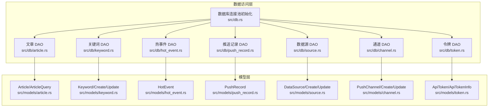
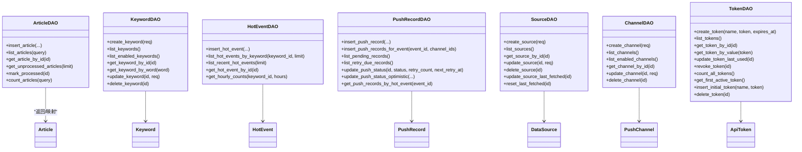
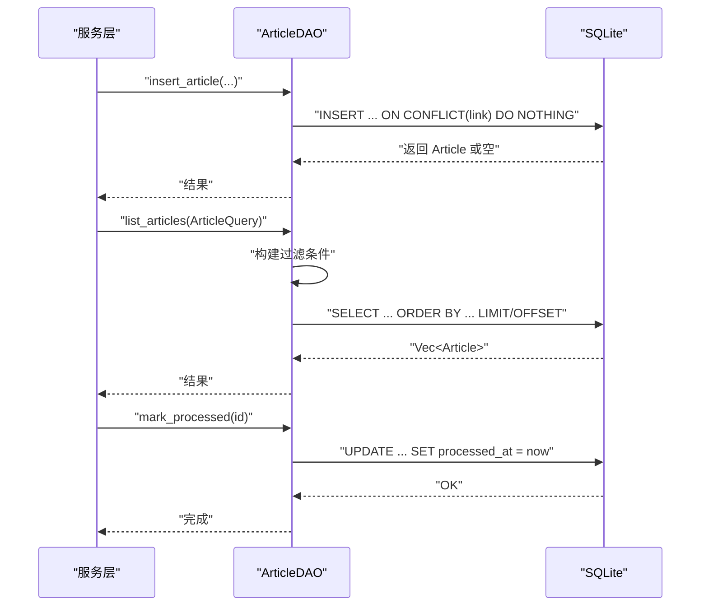
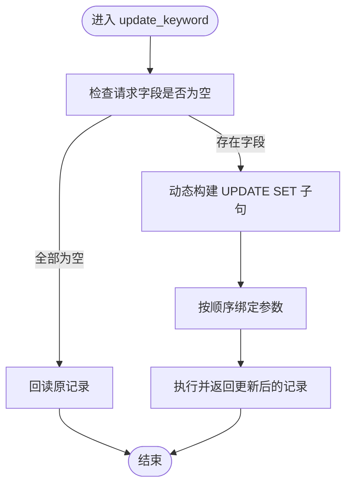
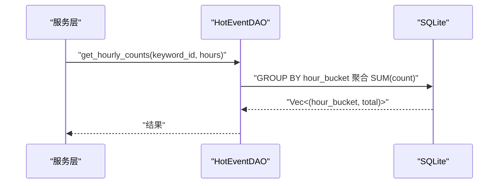
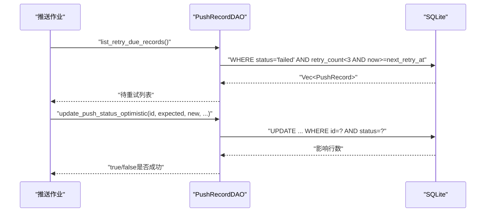
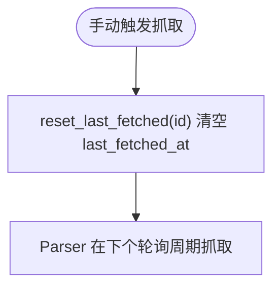
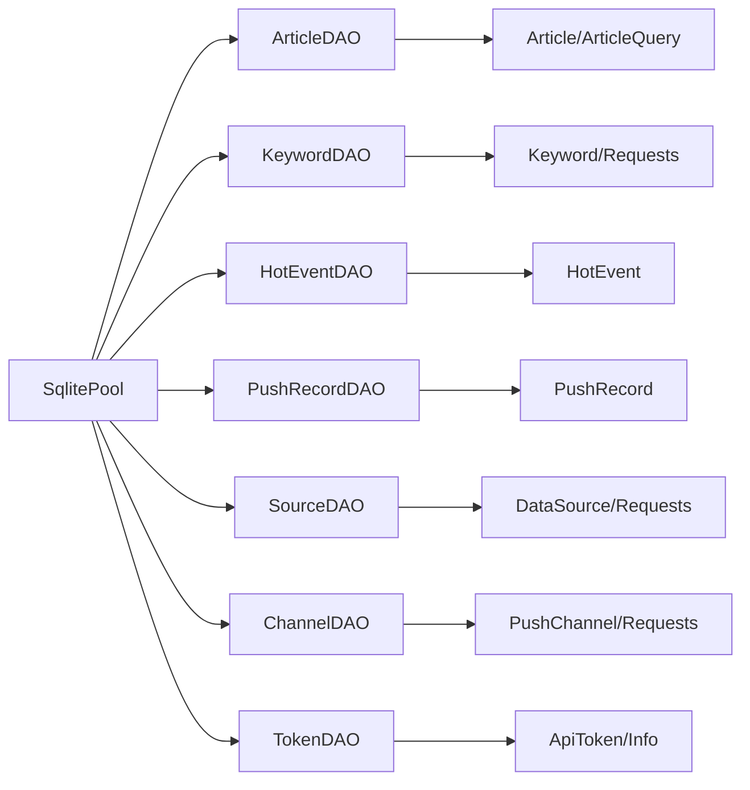

# 数据访问层

<cite>
**本文引用的文件**
- [src/db.rs](file://src/db.rs)
- [src/models.rs](file://src/models.rs)
- [src/db/article.rs](file://src/db/article.rs)
- [src/db/channel.rs](file://src/db/channel.rs)
- [src/db/hot_event.rs](file://src/db/hot_event.rs)
- [src/db/keyword.rs](file://src/db/keyword.rs)
- [src/db/push_record.rs](file://src/db/push_record.rs)
- [src/db/source.rs](file://src/db/source.rs)
- [src/db/token.rs](file://src/db/token.rs)
- [src/models/article.rs](file://src/models/article.rs)
- [src/models/channel.rs](file://src/models/channel.rs)
- [src/models/hot_event.rs](file://src/models/hot_event.rs)
- [src/models/keyword.rs](file://src/models/keyword.rs)
- [src/models/push_record.rs](file://src/models/push_record.rs)
- [src/models/source.rs](file://src/models/source.rs)
- [src/models/token.rs](file://src/models/token.rs)
</cite>

## 目录
1. [引言](#引言)
2. [项目结构](#项目结构)
3. [核心组件](#核心组件)
4. [架构总览](#架构总览)
5. [详细组件分析](#详细组件分析)
6. [依赖关系分析](#依赖关系分析)
7. [性能考虑](#性能考虑)
8. [故障排查指南](#故障排查指南)
9. [结论](#结论)
10. [附录](#附录)

## 引言
本文件聚焦于 AI-Trend-Tool 的数据访问层（Data Access Layer），系统性阐述 DAO 模式与 Repository 思想在代码中的落地方式、各实体的数据访问实现、查询方法与业务逻辑封装、数据传输对象（DTO）设计、查询优化策略、缓存机制与批量操作、错误处理与异常管理、事务边界控制以及性能监控与调优建议。目标是帮助开发者与运维人员快速理解并高效维护数据访问层。

## 项目结构
数据访问层采用按领域模块划分的组织方式：每个实体（文章、关键词、热事件、推送记录、数据源、通道、令牌）均拥有独立的数据库访问模块与对应的模型定义模块。数据库连接池由统一入口初始化，并通过参数注入到各 DAO 方法中。

图表来源
- [src/db.rs:11-25](file://src/db.rs#L11-L25)
- [src/db/article.rs:1-136](file://src/db/article.rs#L1-L136)
- [src/db/keyword.rs:1-115](file://src/db/keyword.rs#L1-L115)
- [src/db/hot_event.rs:1-81](file://src/db/hot_event.rs#L1-L81)
- [src/db/push_record.rs:1-126](file://src/db/push_record.rs#L1-L126)
- [src/db/source.rs:1-126](file://src/db/source.rs#L1-L126)
- [src/db/channel.rs:1-94](file://src/db/channel.rs#L1-L94)
- [src/db/token.rs:1-107](file://src/db/token.rs#L1-L107)
- [src/models/article.rs:1-25](file://src/models/article.rs#L1-L25)
- [src/models/keyword.rs:1-32](file://src/models/keyword.rs#L1-L32)
- [src/models/hot_event.rs:1-15](file://src/models/hot_event.rs#L1-L15)
- [src/models/push_record.rs:1-16](file://src/models/push_record.rs#L1-L16)
- [src/models/source.rs:1-38](file://src/models/source.rs#L1-L38)
- [src/models/channel.rs:1-26](file://src/models/channel.rs#L1-L26)
- [src/models/token.rs:1-46](file://src/models/token.rs#L1-L46)

章节来源
- [src/db.rs:1-26](file://src/db.rs#L1-L26)
- [src/models.rs:1-8](file://src/models.rs#L1-L8)

## 核心组件
- 连接池初始化：集中配置 SQLite 连接池、WAL 模式与外键约束，确保并发安全与一致性。
- 实体 DAO：每个实体提供一组 CRUD 与查询方法，遵循“按需绑定参数”的原则，避免 SQL 注入。
- 查询 DTO：如 ArticleQuery，用于分页与过滤条件的结构化输入。
- 模型映射：基于 sqlx::FromRow 自动映射，结合 serde 序列化输出，保证数据传输的一致性。
- 批量与幂等：部分写入采用 INSERT ... ON CONFLICT 或 INSERT OR IGNORE，减少重复与提升吞吐。
- 并发与锁：使用乐观锁（条件更新）保障状态机变更的原子性与一致性。

章节来源
- [src/db.rs:11-25](file://src/db.rs#L11-L25)
- [src/db/article.rs:6-29](file://src/db/article.rs#L6-L29)
- [src/db/push_record.rs:20-43](file://src/db/push_record.rs#L20-L43)
- [src/db/push_record.rs:90-113](file://src/db/push_record.rs#L90-L113)

## 架构总览
数据访问层遵循“DAO + 模型 + 查询 DTO”的分层设计，DAO 负责 SQL 组装与执行，模型负责数据结构与序列化，查询 DTO 负责输入参数的规范化。所有 DAO 方法以 SqlitePool 作为依赖注入点，便于测试与替换。

图表来源
- [src/db/article.rs:7-136](file://src/db/article.rs#L7-L136)
- [src/db/keyword.rs:5-115](file://src/db/keyword.rs#L5-L115)
- [src/db/hot_event.rs:5-81](file://src/db/hot_event.rs#L5-L81)
- [src/db/push_record.rs:6-126](file://src/db/push_record.rs#L6-L126)
- [src/db/source.rs:5-126](file://src/db/source.rs#L5-L126)
- [src/db/channel.rs:5-94](file://src/db/channel.rs#L5-L94)
- [src/db/token.rs:6-107](file://src/db/token.rs#L6-L107)
- [src/models/article.rs:5-24](file://src/models/article.rs#L5-L24)
- [src/models/keyword.rs:5-31](file://src/models/keyword.rs#L5-L31)
- [src/models/hot_event.rs:5-14](file://src/models/hot_event.rs#L5-L14)
- [src/models/push_record.rs:5-15](file://src/models/push_record.rs#L5-L15)
- [src/models/source.rs:5-17](file://src/models/source.rs#L5-L17)
- [src/models/channel.rs:4-11](file://src/models/channel.rs#L4-L11)
- [src/models/token.rs:5-14](file://src/models/token.rs#L5-L14)

## 详细组件分析

### 文章（Article）数据访问
- 插入去重：基于 link 唯一性冲突进行“插入或忽略”，返回新插入的记录或空值，避免重复抓取。
- 列表查询：支持分页与过滤（source_id、processed），动态拼接 WHERE 条件，限制每页最大 100。
- 状态标记：将 processed_at 设为当前时间，完成处理流程。
- 计数统计：根据过滤条件生成 COUNT 查询，返回总数。
- 未处理拉取：按 fetched_at 升序取出未处理文章，配合后台任务处理。

图表来源
- [src/db/article.rs:7-29](file://src/db/article.rs#L7-L29)
- [src/db/article.rs:31-75](file://src/db/article.rs#L31-L75)
- [src/db/article.rs:119-125](file://src/db/article.rs#L119-L125)

章节来源
- [src/db/article.rs:7-29](file://src/db/article.rs#L7-L29)
- [src/db/article.rs:31-75](file://src/db/article.rs#L31-L75)
- [src/db/article.rs:107-125](file://src/db/article.rs#L107-L125)
- [src/models/article.rs:5-24](file://src/models/article.rs#L5-L24)

### 关键词（Keyword）数据访问
- 创建：默认字段值处理（大小写敏感、阈值倍数、最小热度计数）。
- 列表：支持启用状态筛选与排序。
- 更新：动态组装 SET 子句，仅对提供字段更新；若无字段则回读。
- 删除：级联删除（由数据库约束保证）。

图表来源
- [src/db/keyword.rs:57-106](file://src/db/keyword.rs#L57-L106)

章节来源
- [src/db/keyword.rs:5-115](file://src/db/keyword.rs#L5-L115)
- [src/models/keyword.rs:5-31](file://src/models/keyword.rs#L5-L31)

### 热事件（HotEvent）数据访问
- 插入：记录关键词小时桶的统计信息。
- 查询：按关键词或全局最近时间倒序列出；按小时桶聚合统计。

图表来源
- [src/db/hot_event.rs:63-80](file://src/db/hot_event.rs#L63-L80)

章节来源
- [src/db/hot_event.rs:5-81](file://src/db/hot_event.rs#L5-L81)
- [src/models/hot_event.rs:5-14](file://src/models/hot_event.rs#L5-L14)

### 推送记录（PushRecord）数据访问
- 批量插入：对给定热事件为多个通道插入记录，使用 INSERT OR IGNORE 避免重复。
- 状态管理：支持乐观锁更新（基于期望状态的条件更新），防止竞态。
- 待处理与重试：分别列出待处理与到期可重试的记录，驱动后台推送任务。

图表来源
- [src/db/push_record.rs:55-67](file://src/db/push_record.rs#L55-L67)
- [src/db/push_record.rs:90-113](file://src/db/push_record.rs#L90-L113)

章节来源
- [src/db/push_record.rs:6-126](file://src/db/push_record.rs#L6-L126)
- [src/models/push_record.rs:5-15](file://src/models/push_record.rs#L5-L15)

### 数据源（DataSource）数据访问
- 创建：默认轮询间隔与配置处理。
- 更新：动态更新字段并自动更新更新时间。
- 触发：提供 last_fetched_at 置位与清零接口，用于手动触发抓取。

图表来源
- [src/db/source.rs:116-125](file://src/db/source.rs#L116-L125)

章节来源
- [src/db/source.rs:5-126](file://src/db/source.rs#L5-L126)
- [src/models/source.rs:5-17](file://src/models/source.rs#L5-L17)

### 通道（PushChannel）数据访问
- 创建：默认通道类型与配置处理。
- 列表：支持启用状态筛选。
- 更新：动态更新字段，若无字段则回读。

章节来源
- [src/db/channel.rs:5-94](file://src/db/channel.rs#L5-L94)
- [src/models/channel.rs:4-11](file://src/models/channel.rs#L4-L11)

### 令牌（ApiToken）数据访问
- 创建与撤销：支持创建、撤销、删除与计数。
- 使用追踪：记录最后使用时间。
- 启动提示：提供首个可用令牌查询，便于首次启动展示。

章节来源
- [src/db/token.rs:6-107](file://src/db/token.rs#L6-L107)
- [src/models/token.rs:5-14](file://src/models/token.rs#L5-L14)

## 依赖关系分析
- DAO 层依赖 sqlx::SqlitePool，通过参数注入实现解耦。
- DAO 层依赖对应模型模块，实现 FromRow 映射与 serde 序列化。
- 查询 DTO 仅在 DAO 层内使用，不暴露到上层服务，降低耦合。
- 所有写入操作均通过参数绑定执行，避免字符串拼接引发的安全问题。

图表来源
- [src/db.rs:11-25](file://src/db.rs#L11-L25)
- [src/db/article.rs:4](file://src/db/article.rs#L4)
- [src/db/keyword.rs:3](file://src/db/keyword.rs#L3)
- [src/db/hot_event.rs:3](file://src/db/hot_event.rs#L3)
- [src/db/push_record.rs:4](file://src/db/push_record.rs#L4)
- [src/db/source.rs:3](file://src/db/source.rs#L3)
- [src/db/channel.rs:3](file://src/db/channel.rs#L3)
- [src/db/token.rs:4](file://src/db/token.rs#L4)

章节来源
- [src/db.rs:11-25](file://src/db.rs#L11-L25)
- [src/db/article.rs:4](file://src/db/article.rs#L4)
- [src/db/keyword.rs:3](file://src/db/keyword.rs#L3)
- [src/db/hot_event.rs:3](file://src/db/hot_event.rs#L3)
- [src/db/push_record.rs:4](file://src/db/push_record.rs#L4)
- [src/db/source.rs:3](file://src/db/source.rs#L3)
- [src/db/channel.rs:3](file://src/db/channel.rs#L3)
- [src/db/token.rs:4](file://src/db/token.rs#L4)

## 性能考虑
- 连接池与模式
  - 使用 WAL 模式提升并发读写性能；开启外键约束保障一致性。
  - 连接池最大连接数为 5，适合单机 SQLite 场景；如需更高并发，可评估外部数据库或调整连接数。
- 查询优化
  - 分页与 LIMIT/OFFSET：文章列表已限制每页最大 100，避免超大结果集。
  - 动态 WHERE：关键词与数据源的更新采用动态 SET/WHERE，仅绑定必要参数，减少 SQL 复杂度。
  - 聚合查询：热事件按小时桶聚合，减少网络往返与上层计算开销。
- 写入优化
  - 去重写入：文章插入使用 ON CONFLICT DO NOTHING，避免重复写入。
  - 批量写入：推送记录对多通道插入使用 INSERT OR IGNORE，减少循环开销。
- 缓存机制
  - 当前未实现应用层缓存；可在高频只读查询（如令牌列表、通道列表）引入短期缓存，注意与数据库一致性的同步策略。
- 批量操作
  - 推送记录批量插入：遍历通道 ID，逐条尝试插入并收集结果，适合中小规模批量；大规模场景可考虑更高效的批量写入方案。
- 事务边界
  - 当前 DAO 方法均为单语句或简单事务；对于跨实体的复杂写入（如创建热事件并插入多条推送记录），应在服务层开启事务，确保原子性。
- 监控与调优
  - 建议在 DAO 层增加慢查询日志与执行时长埋点，定位热点查询。
  - 对高频过滤字段建立索引（如 articles.processed_at、push_records.status/retry）以提升查询性能。
  - 定期分析 WAL 文件大小与 VACUUM 需求，保持数据库健康。

## 故障排查指南
- 连接池问题
  - 症状：并发高时报错或超时。
  - 排查：确认连接池初始化参数与数据库路径权限；观察 WAL 模式是否生效。
- 唯一性冲突
  - 症状：插入文章报唯一约束冲突。
  - 排查：确认 link 唯一性；检查 ON CONFLICT 行为是否符合预期。
- 乐观锁失败
  - 症状：update_push_status_optimistic 返回 false。
  - 排查：检查并发更新是否导致状态变化；考虑重试策略与退避。
- 参数绑定错误
  - 症状：SQL 执行失败或返回空。
  - 排查：核对绑定参数数量与顺序；确保可选字段正确处理 None。
- 外键约束
  - 症状：删除/更新失败。
  - 排查：确认外键约束与级联规则；检查相关记录是否存在。

章节来源
- [src/db.rs:19-22](file://src/db.rs#L19-L22)
- [src/db/article.rs:19](file://src/db/article.rs#L19)
- [src/db/push_record.rs:102-112](file://src/db/push_record.rs#L102-L112)

## 结论
AI-Trend-Tool 的数据访问层以清晰的 DAO 模式与模型分离为核心，实现了良好的可维护性与安全性。通过参数绑定、动态 SQL、批量写入与乐观锁等手段，兼顾了性能与一致性。建议在后续迭代中引入应用层缓存、完善事务边界与监控埋点，并针对高频字段补充索引，持续优化整体性能与稳定性。

## 附录
- 数据传输对象（DTO）设计要点
  - 输入 DTO：仅承载业务输入，避免直接暴露到响应；如 ArticleQuery、Create/Update 请求。
  - 输出 DTO：对敏感字段进行脱敏（如 ApiTokenInfo 脱敏 token 明文）。
  - 模型映射：统一使用 FromRow 与 serde，确保数据结构稳定与序列化一致。
- 错误处理与异常管理
  - DAO 层统一返回 sqlx::Error，上层服务进行分类处理与用户友好提示。
  - 对幂等写入（去重、忽略）明确返回值语义，便于上层判断。
- 事务边界控制
  - 单 DAO 方法内尽量保持原子性；跨实体写入在服务层开启事务，失败回滚。
- 性能监控与调优建议
  - 增加 DAO 层执行时长与慢查询日志。
  - 针对高频查询建立索引，定期分析数据库健康状况。
  - 评估连接池大小与数据库后端迁移需求。