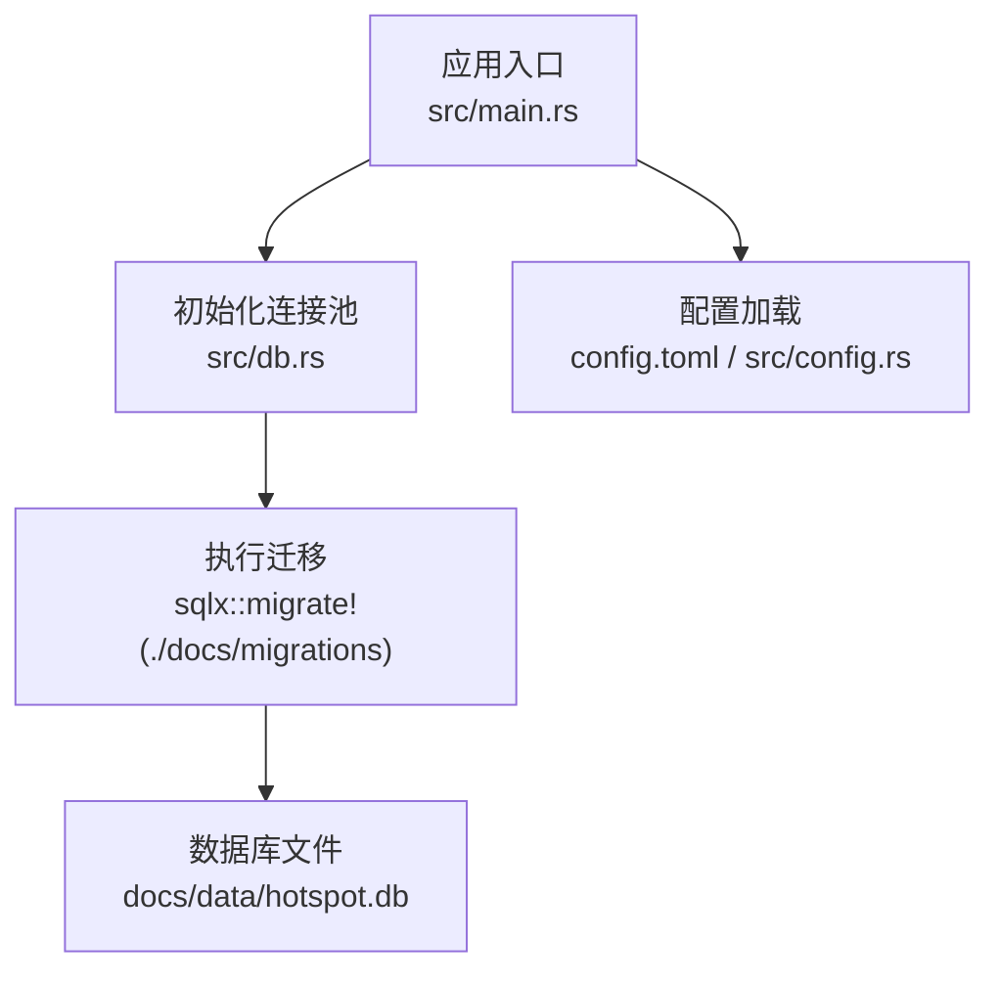
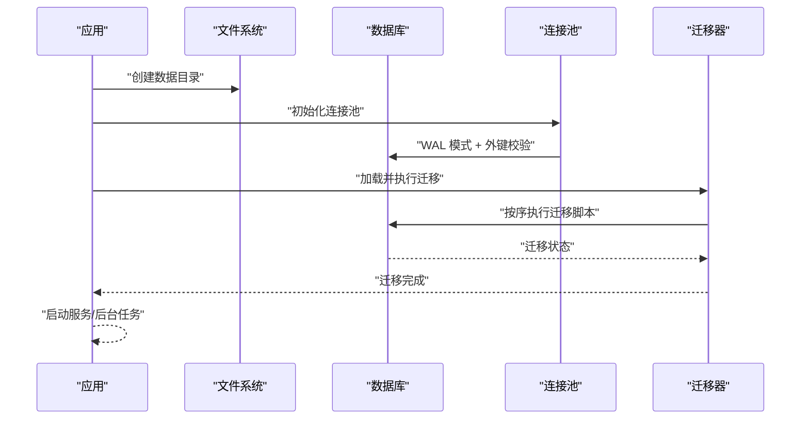
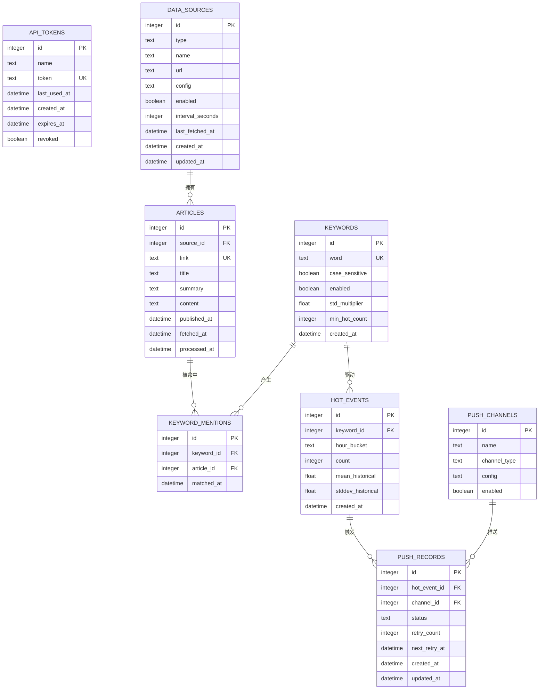
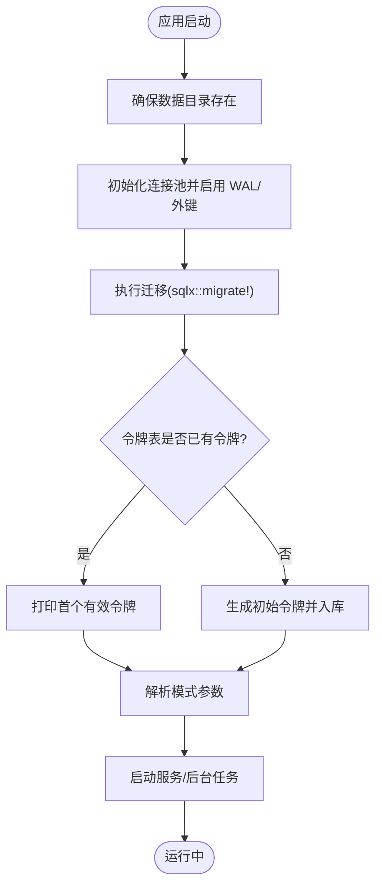
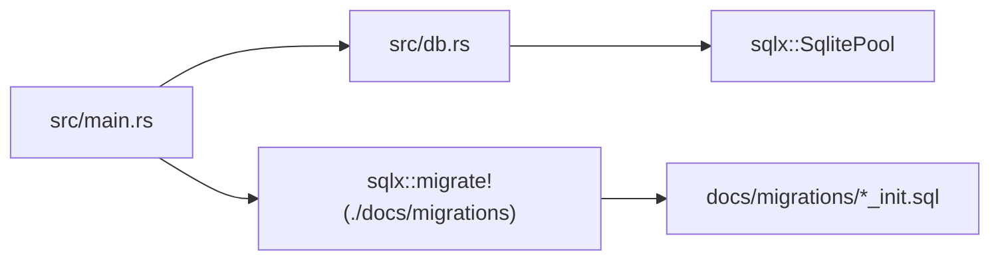

# 数据迁移管理

<cite>
**本文引用的文件**
- [docs/migrations/20260607044921_init.sql](file://docs/migrations/20260607044921_init.sql)
- [docs/plans/02-database-migrations.md](file://docs/plans/02-database-migrations.md)
- [src/main.rs](file://src/main.rs)
- [src/db.rs](file://src/db.rs)
- [src/models.rs](file://src/models.rs)
- [src/models/token.rs](file://src/models/token.rs)
- [src/models/source.rs](file://src/models/source.rs)
- [src/models/article.rs](file://src/models/article.rs)
- [src/models/keyword.rs](file://src/models/keyword.rs)
- [src/config.rs](file://src/config.rs)
- [config.toml](file://config.toml)
- [Cargo.toml](file://Cargo.toml)
</cite>

## 目录
1. [引言](#引言)
2. [项目结构](#项目结构)
3. [核心组件](#核心组件)
4. [架构总览](#架构总览)
5. [详细组件分析](#详细组件分析)
6. [依赖分析](#依赖分析)
7. [性能考量](#性能考量)
8. [故障排查指南](#故障排查指南)
9. [结论](#结论)
10. [附录](#附录)

## 引言
本文件面向“AI趋势监控系统”的数据迁移管理，系统采用 SQLite + sqlx 的方案，通过迁移脚本定义数据库 schema，并在应用启动时自动执行迁移。本文档覆盖初始迁移与后续版本升级策略、迁移脚本编写规范与最佳实践、schema 变更的安全性保障、迁移执行步骤与回滚策略、版本控制与迁移历史管理、以及生产环境迁移的风险控制与备份策略。

## 项目结构
- 迁移脚本集中于 docs/migrations，当前包含一个初始化脚本，定义了 8 张核心表及索引。
- 应用启动时通过 sqlx::migrate! 宏加载该目录下的迁移并执行。
- 数据库连接池在 src/db.rs 中初始化，启用 WAL 模式与外键约束，确保并发与一致性。
- 配置文件 config.toml 指定 SQLite 数据库存储路径；应用启动前会确保数据目录存在。

图表来源
- [src/main.rs:77-81](file://src/main.rs#L77-L81)
- [src/db.rs:12-26](file://src/db.rs#L12-L26)
- [config.toml:5-6](file://config.toml#L5-L6)

章节来源
- [docs/migrations/20260607044921_init.sql:1-118](file://docs/migrations/20260607044921_init.sql#L1-L118)
- [src/main.rs:77-81](file://src/main.rs#L77-L81)
- [src/db.rs:12-26](file://src/db.rs#L12-L26)
- [config.toml:5-6](file://config.toml#L5-L6)

## 核心组件
- 迁移脚本与计划
  - docs/migrations/20260607044921_init.sql：定义 8 张表与索引，包含 API Token、数据源、文章、关键词、关键词命中明细、热点事件、推送渠道、推送记录。
  - docs/plans/02-database-migrations.md：迁移目标、Rust 模型映射、验证步骤与预期文件清单。
- 运行时迁移执行
  - src/main.rs 在启动时调用 sqlx::migrate! 并执行迁移。
- 数据库连接与模式
  - src/db.rs 初始化 SqlitePool，启用 WAL 与外键校验。
- 数据模型
  - src/models/*.rs 定义与迁移表结构对应的 Rust 结构体，配合 sqlx::FromRow 使用。
- 配置
  - config.toml 指定数据库路径；src/config.rs 解析配置。

章节来源
- [docs/migrations/20260607044921_init.sql:1-118](file://docs/migrations/20260607044921_init.sql#L1-L118)
- [docs/plans/02-database-migrations.md:16-421](file://docs/plans/02-database-migrations.md#L16-L421)
- [src/main.rs:77-81](file://src/main.rs#L77-L81)
- [src/db.rs:12-26](file://src/db.rs#L12-L26)
- [src/models.rs:1-9](file://src/models.rs#L1-L9)
- [config.toml:5-6](file://config.toml#L5-L6)

## 架构总览
下图展示迁移生命周期：应用启动 → 创建数据目录 → 初始化连接池 → 执行迁移 → 启动服务或后台任务。

图表来源
- [src/main.rs:71-84](file://src/main.rs#L71-L84)
- [src/db.rs:19-23](file://src/db.rs#L19-L23)
- [src/main.rs:80-81](file://src/main.rs#L80-L81)

## 详细组件分析

### 迁移脚本与数据模型映射
- 迁移脚本定义了 8 张表，涵盖 API 认证、数据源、文章、关键词、命中明细、热点事件、推送渠道与推送记录。
- Rust 模型通过 sqlx::FromRow 与迁移表字段一一对应，确保编译期类型安全。
- 验证步骤建议先 cargo check，再启动服务并用 sqlite3 检查表是否存在。

图表来源
- [docs/migrations/20260607044921_init.sql:4-118](file://docs/migrations/20260607044921_init.sql#L4-L118)
- [src/models/token.rs:5-14](file://src/models/token.rs#L5-L14)
- [src/models/source.rs:5-19](file://src/models/source.rs#L5-L19)
- [src/models/article.rs:5-16](file://src/models/article.rs#L5-L16)
- [src/models/keyword.rs:5-14](file://src/models/keyword.rs#L5-L14)

章节来源
- [docs/migrations/20260607044921_init.sql:1-118](file://docs/migrations/20260607044921_init.sql#L1-L118)
- [docs/plans/02-database-migrations.md:151-421](file://docs/plans/02-database-migrations.md#L151-L421)
- [src/models/token.rs:1-45](file://src/models/token.rs#L1-L45)
- [src/models/source.rs:1-39](file://src/models/source.rs#L1-L39)
- [src/models/article.rs:1-25](file://src/models/article.rs#L1-L25)
- [src/models/keyword.rs:1-32](file://src/models/keyword.rs#L1-L32)

### 迁移执行流程与启动顺序
- 应用启动时，先确保数据目录存在，再初始化连接池并启用 WAL 与外键。
- 调用 sqlx::migrate! 执行迁移目录中的脚本。
- 迁移完成后，若令牌表为空则生成初始管理员令牌，随后根据模式参数启动 API 或后台任务。

图表来源
- [src/main.rs:71-84](file://src/main.rs#L71-L84)
- [src/main.rs:27-62](file://src/main.rs#L27-L62)
- [src/db.rs:19-23](file://src/db.rs#L19-L23)

章节来源
- [src/main.rs:64-164](file://src/main.rs#L64-L164)
- [src/db.rs:12-26](file://src/db.rs#L12-L26)

### 迁移脚本编写规范与最佳实践
- 命名规范
  - 使用时间戳前缀命名迁移文件，如 docs/migrations/<timestamp>_init.sql，确保有序执行。
- DDL 设计
  - 明确主键、唯一约束、外键与级联删除策略，保证参照完整性。
  - 为高频查询列建立索引，如文章表的 processed_at、source_id、fetched_at，热点事件表的 keyword_id、hour_bucket，推送记录表的 status。
- 默认值与时间字段
  - 使用 SQLite datetime('now') 设置默认时间；生产环境可考虑由应用层注入时间以避免时区问题。
- 可回滚性
  - 当前迁移脚本未包含回滚逻辑；建议后续版本在新增迁移时提供 down 脚本或回滚语句，以便回退。
- 版本控制
  - 将迁移脚本纳入版本控制，每次变更提交时附带迁移文件与变更说明。
- 测试与验证
  - 迁移后执行编译检查与数据库验证命令，确保模型与表结构一致。

章节来源
- [docs/plans/02-database-migrations.md:16-148](file://docs/plans/02-database-migrations.md#L16-L148)
- [docs/migrations/20260607044921_init.sql:45-47](file://docs/migrations/20260607044921_init.sql#L45-L47)
- [docs/migrations/20260607044921_init.sql:88-89](file://docs/migrations/20260607044921_init.sql#L88-L89)
- [docs/migrations/20260607044921_init.sql:117](file://docs/migrations/20260607044921_init.sql#L117)

### schema 变更的安全策略
- 不破坏现有数据
  - 新增列使用 DEFAULT 值；避免对既有列强制 NOT NULL 或删除列。
- 外键与约束
  - 保持外键关系与 ON DELETE CASCADE 的一致性，防止悬挂引用。
- 索引维护
  - 对新增查询列及时补充索引；避免在大表上频繁重建索引。
- 连接池与事务
  - 使用连接池执行迁移；对长事务分段处理，减少锁竞争。
- 回滚准备
  - 为每个迁移提供 down 脚本或回滚语句，确保可逆操作。

章节来源
- [src/db.rs:19-23](file://src/db.rs#L19-L23)
- [docs/migrations/20260607044921_init.sql:35](file://docs/migrations/20260607044921_init.sql#L35)
- [docs/migrations/20260607044921_init.sql:67-68](file://docs/migrations/20260607044921_init.sql#L67-L68)
- [docs/migrations/20260607044921_init.sql:114](file://docs/migrations/20260607044921_init.sql#L114)

### 迁移执行步骤与回滚策略
- 执行步骤
  - 确认 config.toml 中 database.path 指向正确位置。
  - 启动应用，迁移会在启动时自动执行。
  - 验证迁移结果：编译检查、启动日志、sqlite3 查看表列表。
- 回滚策略
  - 当前未提供回滚脚本；建议在新增迁移时补充 down 脚本。
  - 若必须回滚，可基于备份恢复到迁移前状态，再手动执行 down 脚本。

章节来源
- [src/main.rs:77-84](file://src/main.rs#L77-L84)
- [docs/plans/02-database-migrations.md:408-421](file://docs/plans/02-database-migrations.md#L408-L421)

### 版本控制与迁移历史管理
- 迁移历史
  - 通过 docs/migrations 下的文件名记录版本顺序；sqlx 会按文件名排序执行。
- 提交规范
  - 每次 schema 变更需配套迁移脚本与变更说明，纳入版本控制。
- 并发与协作
  - 避免多人同时修改同一迁移；如需并行开发，建议使用分支并在合并前统一迁移顺序。

章节来源
- [docs/migrations/20260607044921_init.sql:1-118](file://docs/migrations/20260607044921_init.sql#L1-L118)
- [docs/plans/02-database-migrations.md:16-23](file://docs/plans/02-database-migrations.md#L16-L23)

### 生产环境迁移风险控制与备份策略
- 风险控制
  - 在低峰时段执行迁移；提前评估迁移耗时与锁影响。
  - 使用只读副本或临时实例先行验证迁移脚本。
- 备份策略
  - 迁移前对数据库文件进行完整备份；迁移失败时立即回滚至备份。
  - 对关键业务表（如热点事件、推送记录）进行增量备份。
- 监控与告警
  - 迁移过程中监控数据库连接数、锁等待与慢查询；异常时立即中断并回滚。
- 回滚演练
  - 定期演练回滚流程，确保 down 脚本可用且可快速执行。

章节来源
- [src/db.rs:14-17](file://src/db.rs#L14-L17)
- [config.toml:5-6](file://config.toml#L5-L6)

## 依赖分析
- 运行时依赖
  - sqlx: features 包含 sqlite、migrate、chrono，支持迁移与时间类型。
- 启动流程依赖
  - src/main.rs 依赖 src/db.rs 初始化连接池并执行迁移。
  - 迁移脚本依赖 docs/migrations 目录结构与文件命名。

图表来源
- [src/main.rs:77-81](file://src/main.rs#L77-L81)
- [src/db.rs:10-26](file://src/db.rs#L10-L26)
- [Cargo.toml:14-15](file://Cargo.toml#L14-L15)

章节来源
- [src/main.rs:77-81](file://src/main.rs#L77-L81)
- [src/db.rs:10-26](file://src/db.rs#L10-L26)
- [Cargo.toml:14-15](file://Cargo.toml#L14-L15)

## 性能考量
- 连接池与并发
  - 连接池最大连接数为 5；在高并发场景下可适当调整。
- WAL 模式
  - 启用 WAL 模式提升读写并发能力，降低锁竞争。
- 索引优化
  - 为热点查询列建立索引，减少全表扫描；避免过度索引导致写入性能下降。
- 时间字段
  - 使用应用层注入时间可避免 SQLite 函数调用开销，提高批量写入性能。

章节来源
- [src/db.rs:14-23](file://src/db.rs#L14-L23)
- [docs/migrations/20260607044921_init.sql:45-47](file://docs/migrations/20260607044921_init.sql#L45-L47)
- [docs/migrations/20260607044921_init.sql:88-89](file://docs/migrations/20260607044921_init.sql#L88-L89)

## 故障排查指南
- 迁移失败
  - 检查 docs/migrations 目录是否存在且命名规范；确认数据库路径可写。
  - 查看启动日志中的 sqlx 错误信息，定位具体迁移脚本与语句。
- 表结构不匹配
  - 执行 cargo check 确保模型与迁移表字段一致；必要时更新迁移脚本或模型。
- 数据库不可写
  - 确认 config.toml 中 database.path 指向的数据库文件权限正确；确保父目录存在。
- 令牌问题
  - 若首次启动未生成令牌，检查配置项 auth.initial_token 是否为空；应用会自动生成初始令牌。

章节来源
- [src/main.rs:71-84](file://src/main.rs#L71-L84)
- [docs/plans/02-database-migrations.md:408-421](file://docs/plans/02-database-migrations.md#L408-L421)
- [config.toml:8-10](file://config.toml#L8-L10)

## 结论
本系统通过 sqlx 迁移机制实现数据库 schema 的自动化演进，结合 WAL 模式与外键约束保障数据一致性。建议在后续版本中为迁移脚本补充回滚能力，完善备份与回滚演练流程，并持续优化索引与时间字段策略以提升性能与稳定性。

## 附录
- 验证清单
  - 迁移脚本已纳入版本控制并命名规范。
  - 迁移后执行编译检查与数据库验证命令。
  - 生产环境具备备份与回滚预案。

章节来源
- [docs/plans/02-database-migrations.md:392-421](file://docs/plans/02-database-migrations.md#L392-L421)