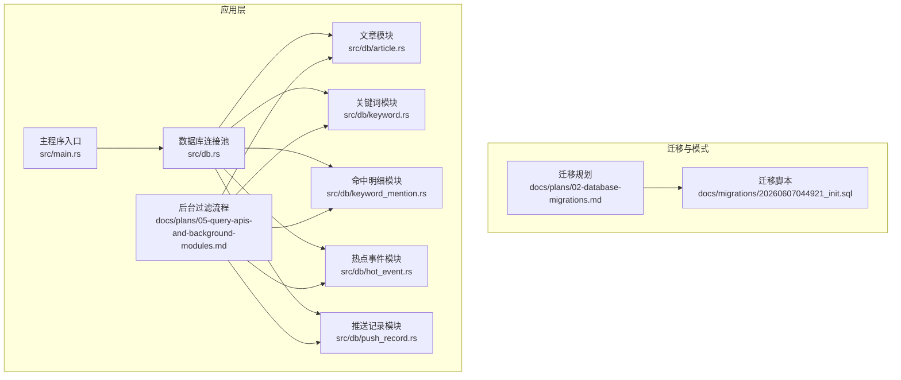
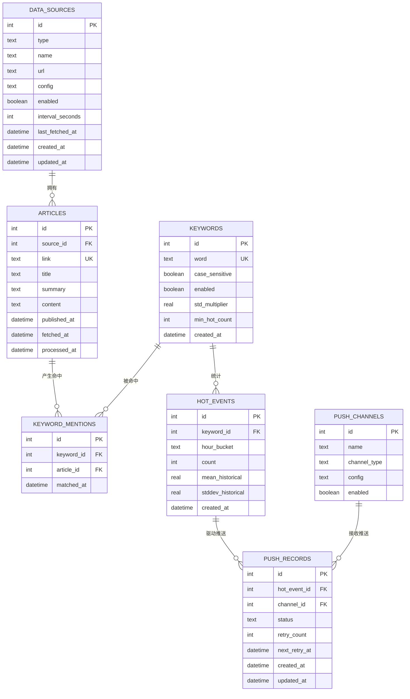
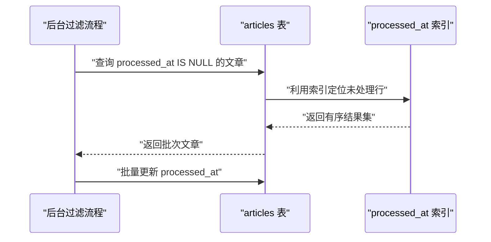
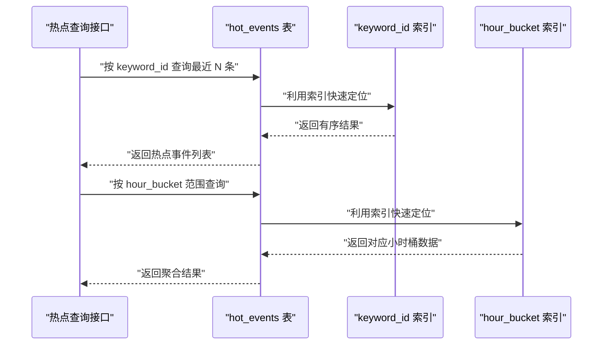
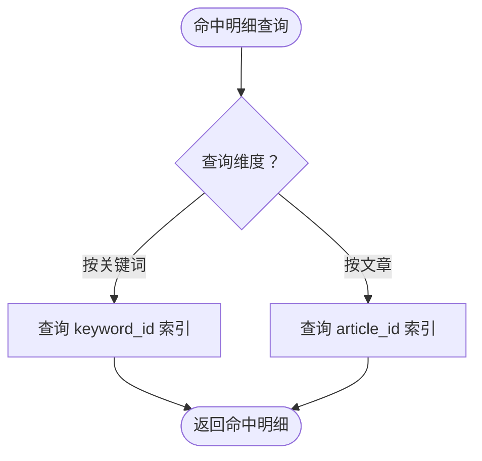
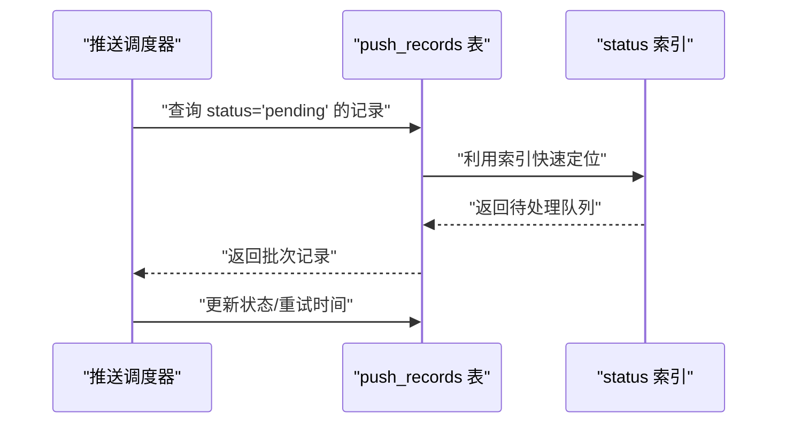
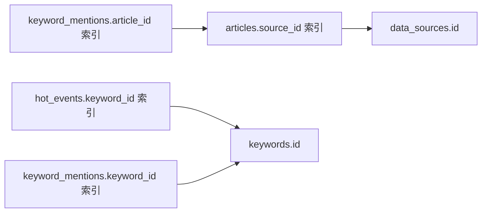

# 索引策略

<cite>
**本文引用的文件**
- [20260607044921_init.sql](file://docs/migrations/20260607044921_init.sql)
- [02-database-migrations.md](file://docs/plans/02-database-migrations.md)
- [05-query-apis-and-background-modules.md](file://docs/plans/05-query-apis-and-background-modules.md)
- [article.rs](file://src/db/article.rs)
- [hot_event.rs](file://src/db/hot_event.rs)
- [keyword.rs](file://src/db/keyword.rs)
- [keyword_mention.rs](file://src/db/keyword_mention.rs)
- [push_record.rs](file://src/db/push_record.rs)
- [db.rs](file://src/db.rs)
</cite>

## 目录
1. [简介](#简介)
2. [项目结构](#项目结构)
3. [核心组件](#核心组件)
4. [架构总览](#架构总览)
5. [详细组件分析](#详细组件分析)
6. [依赖关系分析](#依赖关系分析)
7. [性能考量](#性能考量)
8. [故障排查指南](#故障排查指南)
9. [结论](#结论)
10. [附录](#附录)

## 简介
本文件围绕 AI 趋势监控系统的数据库索引策略进行系统化梳理与优化建议，重点覆盖以下表的索引设计与查询场景：
- articles 表：processed_at、source_id、fetched_at 索引
- keywords 表：word 唯一索引
- hot_events 表：keyword_id、hour_bucket 复合索引
- keyword_mentions 表：双索引设计
- push_records 表：状态索引

同时提供索引使用监控方法、查询计划分析与 SQLite 特性下的优化建议，帮助在高吞吐的增量处理与热点检测场景中获得稳定且高效的查询性能。

## 项目结构
数据库模式与迁移脚本位于迁移文档中，应用层通过 sqlx 访问 SQLite，并在启动时自动执行迁移。查询逻辑集中在后台过滤流程与各模块的数据访问层。

图表来源
- [20260607044921_init.sql:59-88](file://docs/migrations/20260607044921_init.sql#L59-L88)
- [02-database-migrations.md:58-145](file://docs/plans/02-database-migrations.md#L58-L145)
- [05-query-apis-and-background-modules.md:531-740](file://docs/plans/05-query-apis-and-background-modules.md#L531-L740)
- [db.rs](file://src/db.rs)

章节来源
- [02-database-migrations.md:25-145](file://docs/plans/02-database-migrations.md#L25-L145)
- [20260607044921_init.sql:59-88](file://docs/migrations/20260607044921_init.sql#L59-L88)
- [db.rs](file://src/db.rs)

## 核心组件
- articles 表：存储抓取到的文章，关键字段包括 source_id、fetched_at、processed_at。其索引服务于“获取未处理文章”“按时间排序列表”等高频路径。
- keywords 表：存储待监控关键词，word 字段唯一，确保关键词去重与快速匹配。
- keyword_mentions 表：记录关键词与文章的命中关系，双索引分别支撑“按关键词聚合”和“按文章回溯命中”。
- hot_events 表：记录关键词的小时级统计与阈值计算结果，包含 keyword_id、hour_bucket、count、mean_historical、stddev_historical。
- push_records 表：记录热点事件向各推送渠道的投递状态，status 字段用于调度器筛选待处理任务。

章节来源
- [02-database-migrations.md:58-145](file://docs/plans/02-database-migrations.md#L58-L145)
- [20260607044921_init.sql:59-88](file://docs/migrations/20260607044921_init.sql#L59-L88)

## 架构总览
下图展示与索引相关的核心表之间的关系与典型查询路径。

图表来源
- [20260607044921_init.sql:59-88](file://docs/migrations/20260607044921_init.sql#L59-L88)
- [02-database-migrations.md:58-145](file://docs/plans/02-database-migrations.md#L58-L145)

## 详细组件分析

### articles 表索引策略
- processed_at 索引
  - 作用：加速“获取未处理文章”的扫描与排序，避免全表扫描。
  - 查询场景：后台过滤流程中按 fetched_at 升序取一批未处理文章，随后批量更新 processed_at。
- source_id 索引
  - 作用：加速按数据源维度的查询与统计，便于按来源聚合或清理。
- fetched_at 索引
  - 作用：支持按抓取时间排序的列表查询与分页。
- 性能影响
  - 在高并发写入场景下，索引会带来 INSERT/UPDATE 的维护开销；但对高频读取路径（如“未处理文章”）收益显著。
  - 建议：结合批量更新策略（分批 IN 子句）降低锁竞争。

图表来源
- [05-query-apis-and-background-modules.md:545-550](file://docs/plans/05-query-apis-and-background-modules.md#L545-L550)
- [05-query-apis-and-background-modules.md:709-721](file://docs/plans/05-query-apis-and-background-modules.md#L709-L721)
- [article.rs:106-120](file://src/db/article.rs#L106-L120)

章节来源
- [02-database-migrations.md:58-75](file://docs/plans/02-database-migrations.md#L58-L75)
- [05-query-apis-and-background-modules.md:545-550](file://docs/plans/05-query-apis-and-background-modules.md#L545-L550)
- [article.rs:106-120](file://src/db/article.rs#L106-L120)

### keywords 表索引策略
- word 唯一索引
  - 作用：保证关键词唯一性，避免重复配置；同时为按关键词精确查找提供高效路径。
  - 影响：在关键词加载与匹配阶段，可减少重复与冲突，提升整体匹配效率。
- 匹配性能
  - 与后台过滤流程中的 Aho-Corasick 自动机配合，先通过唯一索引确保关键词集合完整性，再进行文本匹配，可降低匹配前准备成本。

章节来源
- [02-database-migrations.md:77-88](file://docs/plans/02-database-migrations.md#L77-L88)
- [05-query-apis-and-background-modules.md:558-562](file://docs/plans/05-query-apis-and-background-modules.md#L558-L562)

### hot_events 表索引策略
- keyword_id 索引
  - 作用：支撑“按关键词查询热点事件列表”“按关键词统计”等查询。
  - 场景：热点事件列表接口与后台统计历史均依赖该索引。
- hour_bucket 索引
  - 作用：支撑按小时桶范围的查询与聚合，便于滚动窗口统计与可视化。
- 组合查询优化
  - 若存在“keyword_id + hour_bucket”联合过滤的查询，可考虑复合索引以进一步减少回表与排序成本。

图表来源
- [02-database-migrations.md:103-117](file://docs/plans/02-database-migrations.md#L103-L117)
- [hot_event.rs:25-44](file://src/db/hot_event.rs#L25-L44)

章节来源
- [02-database-migrations.md:103-117](file://docs/plans/02-database-migrations.md#L103-L117)
- [hot_event.rs:25-44](file://src/db/hot_event.rs#L25-L44)

### keyword_mentions 表索引策略
- idx_mentions_keyword
  - 作用：支撑“按关键词统计命中数量”“生成关键词维度报表”等查询。
- idx_mentions_article
  - 作用：支撑“按文章回溯命中详情”“删除文章时清理命中记录”等操作。
- 关联查询优化
  - 双索引设计使得“从关键词视角看文章”和“从文章视角看关键词”两类查询均可高效完成，避免多次 JOIN 或临时表排序。

图表来源
- [02-database-migrations.md:90-101](file://docs/plans/02-database-migrations.md#L90-L101)
- [keyword_mention.rs](file://src/db/keyword_mention.rs)

章节来源
- [02-database-migrations.md:90-101](file://docs/plans/02-database-migrations.md#L90-L101)
- [keyword_mention.rs](file://src/db/keyword_mention.rs)

### push_records 表索引策略
- status 索引
  - 作用：支撑“推送调度器”按状态筛选待处理任务，是推送队列调度的关键。
  - 场景：后台循环中按 status=pending 进行批量拉取与重试调度。
- 唯一约束
  - hot_event_id 与 channel_id 的组合唯一，避免重复投递同一事件到同一渠道。

图表来源
- [02-database-migrations.md:129-145](file://docs/plans/02-database-migrations.md#L129-L145)
- [push_record.rs](file://src/db/push_record.rs)

章节来源
- [02-database-migrations.md:129-145](file://docs/plans/02-database-migrations.md#L129-L145)
- [push_record.rs](file://src/db/push_record.rs)

## 依赖关系分析
- 外键与索引协同
  - articles.source_id 引用 data_sources.id，hot_events.keyword_id 引用 keywords.id，keyword_mentions.keyword_id/article_id 分别引用 keywords.id/articles.id。
  - 对应的外键列均具备索引，可显著提升 JOIN 与 ON 条件的匹配效率。
- 写入路径的耦合
  - 后台过滤流程在写入 keyword_mentions 与 hot_events 之后，再批量更新 articles.processed_at，索引在此过程中既保障读取效率，也需注意批量更新的锁粒度控制。

图表来源
- [02-database-migrations.md:58-145](file://docs/plans/02-database-migrations.md#L58-L145)
- [20260607044921_init.sql:59-88](file://docs/migrations/20260607044921_init.sql#L59-L88)

章节来源
- [02-database-migrations.md:58-145](file://docs/plans/02-database-migrations.md#L58-L145)
- [20260607044921_init.sql:59-88](file://docs/migrations/20260607044921_init.sql#L59-L88)

## 性能考量
- 索引选择原则
  - 高频过滤列优先建立单列索引；多维过滤条件可考虑复合索引（如 hot_events 的 keyword_id+hour_bucket）。
  - 唯一约束列（如 keywords.word、articles.link）天然具备唯一索引，有利于去重与快速查找。
- 写入放大与平衡
  - 索引越多，INSERT/UPDATE 的维护成本越高；应结合业务读写比例权衡。
- 批量操作优化
  - articles 批量更新采用分批 IN 子句，减少一次性大事务锁竞争。
- SQLite 特性与建议
  - SQLite 默认不强制外键，已在连接池初始化中开启 PRAGMA foreign_keys=ON，确保一致性。
  - SQLite 的 B-Tree 索引对等值与范围查询友好；对于超大表可考虑分区或归档策略（如按时间归档旧文章）。
  - 使用 EXPLAIN QUERY PLAN 分析查询计划，识别索引使用情况与潜在回表。

章节来源
- [02-database-migrations.md:79-86](file://docs/plans/02-database-migrations.md#L79-L86)
- [05-query-apis-and-background-modules.md:709-721](file://docs/plans/05-query-apis-and-background-modules.md#L709-L721)

## 故障排查指南
- 索引未生效
  - 使用 EXPLAIN QUERY PLAN 检查 SELECT/JOIN 是否走索引；若出现全表扫描，检查谓词是否可利用索引（如函数包裹导致的不可索引）。
- 写入性能下降
  - 检查是否存在大量并发写入导致的锁等待；适当调整批量大小与事务粒度。
- 推送调度延迟
  - 确认 status 索引存在并被使用；检查是否有长事务阻塞写入。
- 数据一致性问题
  - 确认连接池已设置 PRAGMA foreign_keys=ON；核对外键约束与 ON DELETE 行为。

章节来源
- [02-database-migrations.md:79-86](file://docs/plans/02-database-migrations.md#L79-L86)

## 结论
现有索引设计基本覆盖了后台过滤、热点统计与推送调度的关键查询路径。建议在保持读取效率的同时，持续通过 EXPLAIN QUERY PLAN 与性能监控评估索引有效性，并根据实际查询模式迭代优化（如引入复合索引、调整批量策略）。SQLite 的特性要求在设计层面兼顾一致性与性能，确保系统在高吞吐场景下稳定运行。

## 附录
- 监控与分析工具
  - 使用 EXPLAIN QUERY PLAN 分析 SQL 执行计划，确认索引使用与回表情况。
  - 结合应用日志与数据库慢查询日志（如开启 PRAGMA enable_profiler=ON）定位热点查询。
- 索引维护建议
  - 定期评估查询模式变化，必要时重建或新增索引。
  - 对于超大表，考虑分区或归档策略，减少热区扫描范围。