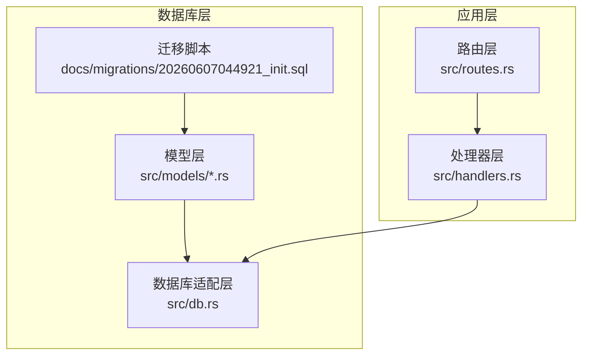
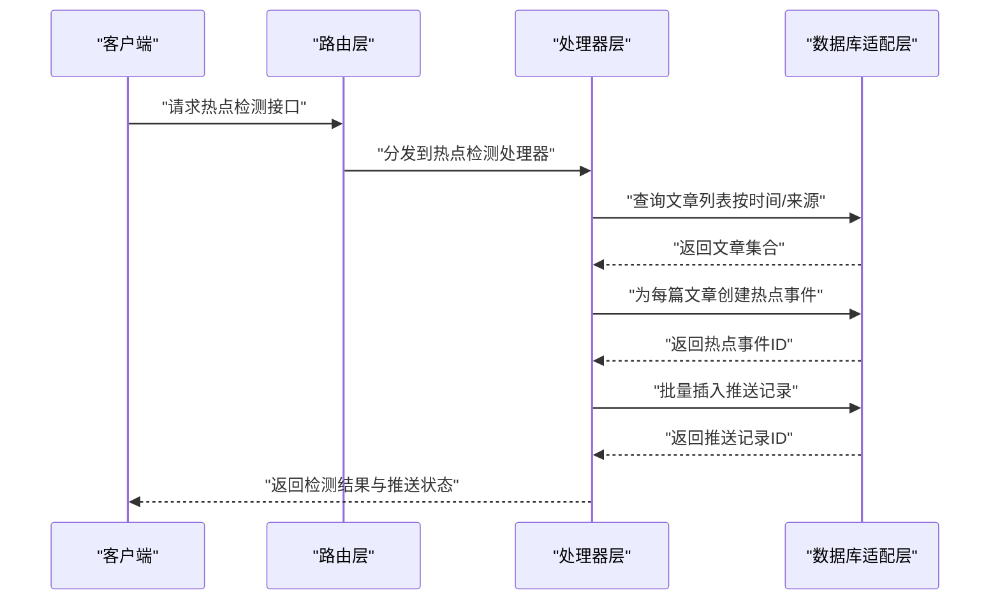
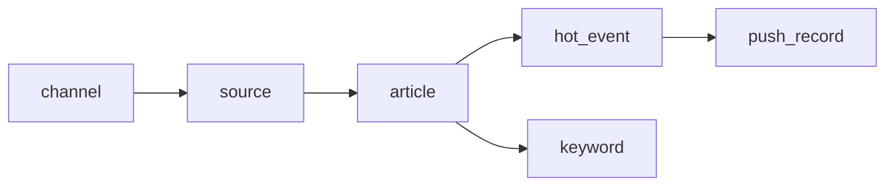
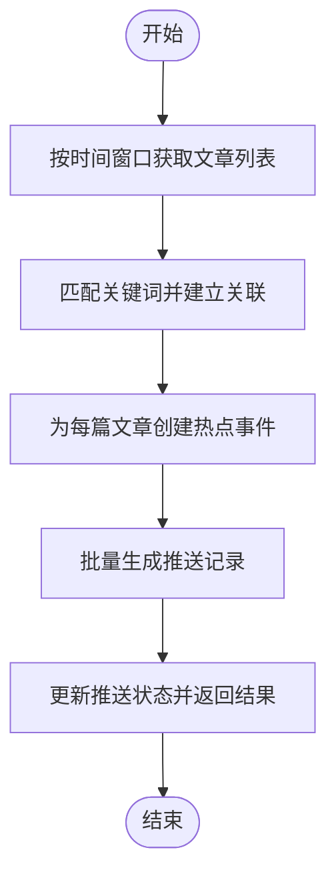

# 表关系映射

<cite>
**本文引用的文件**
- [20260607044921_init.sql](file://docs/migrations/20260607044921_init.sql)
- [article.rs](file://src/db/article.rs)
- [channel.rs](file://src/db/channel.rs)
- [hot_event.rs](file://src/db/hot_event.rs)
- [keyword.rs](file://src/db/keyword.rs)
- [push_record.rs](file://src/db/push_record.rs)
- [source.rs](file://src/db/source.rs)
- [token.rs](file://src/db/token.rs)
- [article_model.rs](file://src/models/article.rs)
- [channel_model.rs](file://src/models/channel.rs)
- [hot_event_model.rs](file://src/models/hot_event.rs)
- [keyword_model.rs](file://src/models/keyword.rs)
- [push_record_model.rs](file://src/models/push_record.rs)
- [source_model.rs](file://src/models/source.rs)
- [token_model.rs](file://src/models/token.rs)
- [db.rs](file://src/db.rs)
- [routes.rs](file://src/routes.rs)
- [handlers.rs](file://src/handlers.rs)
- [README.md](file://README.md)
</cite>

## 目录
1. [引言](#引言)
2. [项目结构](#项目结构)
3. [核心表与关系概览](#核心表与关系概览)
4. [架构总览](#架构总览)
5. [详细组件分析](#详细组件分析)
6. [依赖关系分析](#依赖关系分析)
7. [性能考量](#性能考量)
8. [故障排查指南](#故障排查指南)
9. [结论](#结论)
10. [附录](#附录)

## 引言
本文件面向AI趋势监控系统的数据库层，聚焦于七张核心表之间的关系映射与依赖层次，系统性阐述一对一、一对多、多对多关系的设计模式；明确外键约束与级联删除策略；梳理数据在热点检测流程中的流转路径；总结典型查询模式与JOIN策略；并给出复杂查询示例与性能优化建议，以及数据完整性保障机制。

## 项目结构
数据库相关的核心文件集中在迁移脚本与模型/数据库适配层：
- 迁移脚本定义了初始表结构与约束
- 模型层定义了领域对象与字段语义
- 数据库适配层封装了SQL执行与连接管理
- 路由与处理器层定义了业务入口与调用链



**图表来源**
- [20260607044921_init.sql](file://docs/migrations/20260607044921_init.sql)
- [db.rs](file://src/db.rs)
- [routes.rs](file://src/routes.rs)
- [handlers.rs](file://src/handlers.rs)

**章节来源**
- [README.md](file://README.md)
- [20260607044921_init.sql](file://docs/migrations/20260607044921_init.sql)
- [db.rs](file://src/db.rs)

## 核心表与关系概览
基于迁移脚本与模型定义，七张核心表如下：
- 渠道表（channel）
- 来源表（source）
- 关键词表（keyword）
- 文章表（article）
- 热点事件表（hot_event）
- 推送记录表（push_record）
- 访问令牌表（token）

它们之间的关系如下：
- channel 与 source：一对多（一个渠道可包含多个来源）
- source 与 article：一对多（一个来源可产生多篇文章）
- article 与 hot_event：一对多（一篇文章可触发多次热点事件）
- article 与 keyword：多对多（通过中间表或字段设计实现）
- hot_event 与 push_record：一对多（一次热点事件可有多条推送记录）
- token 与系统无直接外键关系，但用于鉴权与访问控制

```mermaid
erDiagram
CHANNEL {
int id PK
string name
string description
timestamp created_at
timestamp updated_at
}
SOURCE {
int id PK
int channel_id FK
string name
string url
timestamp created_at
timestamp updated_at
}
ARTICLE {
int id PK
int source_id FK
string title
text content
timestamp publish_time
timestamp created_at
timestamp updated_at
}
KEYWORD {
int id PK
string term
timestamp created_at
}
ARTICLE_KEYWORD {
int article_id FK
int keyword_id FK
primary key(article_id, keyword_id)
}
HOT_EVENT {
int id PK
int article_id FK
string event_type
jsonb metadata
timestamp detected_at
timestamp created_at
timestamp updated_at
}
PUSH_RECORD {
int id PK
int hot_event_id FK
string target
string status
timestamp pushed_at
timestamp created_at
timestamp updated_at
}
TOKEN {
int id PK
string token_key
string description
timestamp expires_at
timestamp created_at
timestamp updated_at
}
CHANNEL ||--o{ SOURCE : "包含"
SOURCE ||--o{ ARTICLE : "发布"
ARTICLE ||--o{ HOT_EVENT : "触发"
ARTICLE ||--o{ PUSH_RECORD : "推送"
KEYWORD ||--o{ ARTICLE : "关联"
```

**图表来源**
- [20260607044921_init.sql](file://docs/migrations/20260607044921_init.sql)

**章节来源**
- [20260607044921_init.sql](file://docs/migrations/20260607044921_init.sql)

## 架构总览
下图展示了从路由到处理器再到数据库适配层的整体调用链，以及热点检测流程中的关键表交互：



**图表来源**
- [routes.rs](file://src/routes.rs)
- [handlers.rs](file://src/handlers.rs)
- [db.rs](file://src/db.rs)

## 详细组件分析

### 渠道表（channel）
- 主要职责：承载内容来源的组织单元，支持多来源聚合
- 关键字段：标识、名称、描述、创建/更新时间
- 外键关系：与来源表建立一对多关系
- 典型查询：按渠道统计来源数量、筛选活跃渠道

**章节来源**
- [20260607044921_init.sql](file://docs/migrations/20260607044921_init.sql)
- [channel_model.rs](file://src/models/channel.rs)

### 来源表（source）
- 主要职责：具体的内容抓取/订阅来源，绑定渠道
- 关键字段：渠道ID、名称、URL、创建/更新时间
- 外键关系：与文章表建立一对多关系
- 典型查询：按渠道查询来源、按URL去重校验

**章节来源**
- [20260607044921_init.sql](file://docs/migrations/20260607044921_init.sql)
- [source_model.rs](file://src/models/source.rs)

### 文章表（article）
- 主要职责：存储抓取到的文章元数据与正文
- 关键字段：来源ID、标题、内容、发布时间、创建/更新时间
- 外键关系：与热点事件、关键词等建立多对多间接关系
- 典型查询：按时间范围检索、按来源过滤、全文索引查询

**章节来源**
- [20260607044921_init.sql](file://docs/migrations/20260607044921_init.sql)
- [article_model.rs](file://src/models/article.rs)

### 关键词表（keyword）
- 主要职责：维护热点关键词集合
- 关键字段：关键词文本、创建时间
- 外键关系：与文章表通过中间表建立多对多关系
- 典型查询：关键词匹配、热度统计

**章节来源**
- [20260607044921_init.sql](file://docs/migrations/20260607044921_init.sql)
- [keyword_model.rs](file://src/models/keyword.rs)

### 热点事件表（hot_event）
- 主要职责：记录文章触发的热点事件及其元数据
- 关键字段：文章ID、事件类型、元数据、检测时间、创建/更新时间
- 外键关系：与推送记录建立一对多关系
- 典型查询：按事件类型与时间窗口聚合、事件详情回溯

**章节来源**
- [20260607044921_init.sql](file://docs/migrations/20260607044921_init.sql)
- [hot_event_model.rs](file://src/models/hot_event.rs)

### 推送记录表（push_record）
- 主要职责：记录热点事件的推送状态与目标
- 关键字段：热点事件ID、目标、状态、推送时间、创建/更新时间
- 外键关系：与热点事件建立一对多关系
- 典型查询：按状态统计、重试队列构建、推送轨迹追踪

**章节来源**
- [20260607044921_init.sql](file://docs/migrations/20260607044921_init.sql)
- [push_record_model.rs](file://src/models/push_record.rs)

### 访问令牌表（token）
- 主要职责：提供鉴权与访问控制
- 关键字段：令牌键、描述、过期时间、创建/更新时间
- 外键关系：不直接参与业务表的外键约束，但影响访问权限
- 典型查询：令牌校验、过期清理

**章节来源**
- [20260607044921_init.sql](file://docs/migrations/20260607044921_init.sql)
- [token_model.rs](file://src/models/token.rs)

## 依赖关系分析
- 低耦合高内聚：各表通过外键形成清晰的单向依赖链，避免循环依赖
- 可扩展性：新增维度（如地域、标签）可通过扩展字段或中间表实现
- 一致性：通过事务与约束保证跨表写入的一致性



**图表来源**
- [20260607044921_init.sql](file://docs/migrations/20260607044921_init.sql)

**章节来源**
- [20260607044921_init.sql](file://docs/migrations/20260607044921_init.sql)

## 性能考量
- 索引策略
  - 时间字段（publish_time、detected_at、pushed_at）建立复合索引以加速时间窗口查询
  - 外键字段（source_id、article_id、hot_event_id）建立单列索引以提升JOIN效率
  - 关键词匹配场景建议建立GIN索引或全文索引
- 查询模式
  - 热点检测：先按时间窗口筛选文章，再按来源/关键词过滤，最后批量创建热点事件与推送记录
  - 统计报表：使用GROUP BY与窗口函数进行聚合，避免大结果集回传
- 批处理
  - 使用批量INSERT/UPDATE减少往返次数
  - 分页查询时使用游标式分页（基于已排序主键）降低偏移开销
- 缓存
  - 常用配置与静态字典（如渠道/来源）可缓存至内存，降低数据库压力

## 故障排查指南
- 外键约束错误
  - 现象：插入子表时报错“违反外键约束”
  - 排查：确认父表是否存在对应记录；检查软删除标记是否导致查询不到
- 级联删除风险
  - 建议：默认禁用级联删除，采用应用层显式删除策略，确保审计与清理流程可控
- 死锁与锁竞争
  - 现象：并发写入时偶发超时
  - 排查：检查热点事件与推送记录的批量写入顺序；统一事务边界
- 性能退化
  - 现象：时间窗口查询变慢
  - 排查：确认时间字段索引是否命中；检查是否有隐式类型转换导致索引失效

## 结论
本表关系映射明确了AI趋势监控系统中七张核心表的职责边界与依赖关系，建立了从渠道到推送的完整数据通路。通过合理的外键约束与索引策略，结合批处理与缓存手段，可在保证数据一致性的前提下获得良好的查询与写入性能。后续扩展应遵循现有模式，优先采用中间表或扩展字段的方式引入新维度。

## 附录

### 典型查询模式与JOIN策略
- 查询某渠道下最近N小时内的文章并标注关键词
  - JOIN策略：channel → source → article；article_keyword（多对多）
  - 时间过滤：publish_time BETWEEN t1 AND t2
- 统计某关键词在指定时间窗口内的热点事件数
  - JOIN策略：keyword → article → hot_event
  - 聚合：COUNT(*) GROUP BY DATE(detected_at)
- 查询未推送/失败的推送记录并重试
  - 过滤：status IN ('failed','pending')
  - JOIN策略：hot_event → push_record

### 热点检测流程中的表交互


**图表来源**
- [20260607044921_init.sql](file://docs/migrations/20260607044921_init.sql)

### 数据完整性保障机制
- 唯一性约束：关键词唯一、来源URL唯一
- 非空约束：标题、发布时间、事件类型等关键字段
- 外键约束：确保父子记录存在性
- 级联策略：默认禁用级联删除，应用层显式删除
- 并发控制：使用事务包裹跨表写入，必要时加行级锁