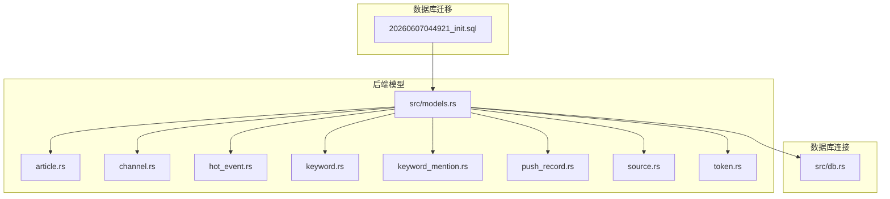
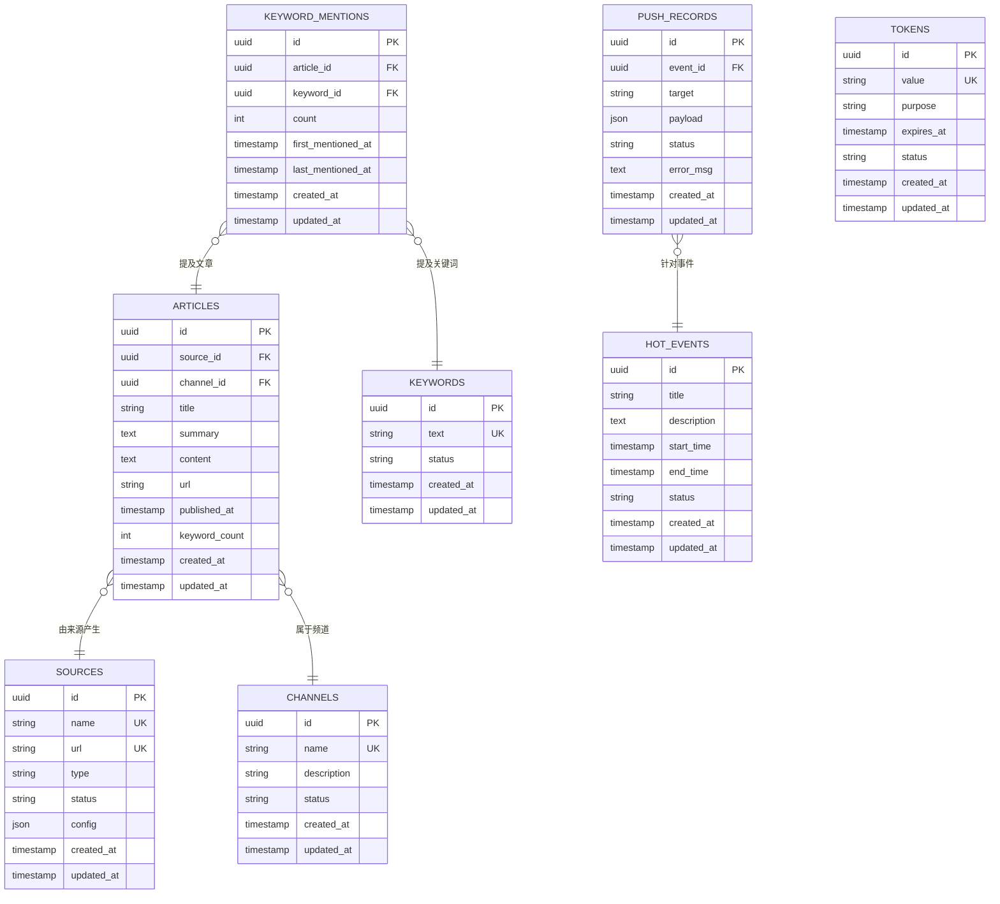
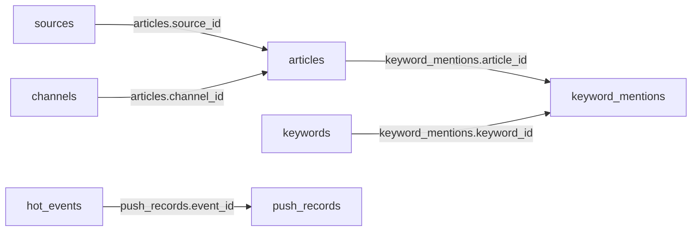

# 表结构定义

<cite>
**本文档引用的文件**
- [20260607044921_init.sql](file://docs/migrations/20260607044921_init.sql)
- [db.rs](file://src/db.rs)
- [models.rs](file://src/models.rs)
- [article.rs](file://src/models/article.rs)
- [channel.rs](file://src/models/channel.rs)
- [hot_event.rs](file://src/models/hot_event.rs)
- [keyword.rs](file://src/models/keyword.rs)
- [keyword_mention.rs](file://src/models/keyword_mention.rs)
- [push_record.rs](file://src/models/push_record.rs)
- [source.rs](file://src/models/source.rs)
- [token.rs](file://src/models/token.rs)
</cite>

## 目录
1. [简介](#简介)
2. [项目结构](#项目结构)
3. [核心组件](#核心组件)
4. [架构总览](#架构总览)
5. [详细组件分析](#详细组件分析)
6. [依赖分析](#依赖分析)
7. [性能考虑](#性能考虑)
8. [故障排除指南](#故障排除指南)
9. [结论](#结论)

## 简介
本文件面向AI趋势监控系统，提供完整的数据库表结构定义与约束说明。内容涵盖字段定义、数据类型、约束条件（主键、外键、唯一性、非空）、索引策略、NULL值处理与默认值、业务含义与取值范围、字段注释与使用示例，以及表创建语句与字段级约束定义。所有信息均基于仓库中的数据库迁移脚本与Rust模型定义文件整理而来。

## 项目结构
系统采用Rust后端配合SQL迁移初始化数据库结构。数据库迁移文件位于 `docs/migrations/` 目录，模型定义位于 `src/models/` 目录，数据库连接与查询封装位于 `src/db.rs`，模型聚合入口位于 `src/models.rs`。

**图表来源**
- [20260607044921_init.sql](file://docs/migrations/20260607044921_init.sql)
- [models.rs](file://src/models.rs)
- [db.rs](file://src/db.rs)

**章节来源**
- [20260607044921_init.sql](file://docs/migrations/20260607044921_init.sql)
- [models.rs](file://src/models.rs)
- [db.rs](file://src/db.rs)

## 核心组件
本节概述各核心数据表及其在系统中的职责与关联关系。所有表均通过迁移脚本创建，字段与约束以迁移脚本为准；模型层提供类型安全的访问接口。

- 文章表（articles）
  - 职责：存储抓取到的资讯文章元数据，如标题、摘要、发布时间、来源等。
  - 关键字段：标识符、标题、摘要、正文、链接、发布时间、来源标识、关键词提及计数等。
  - 约束：主键、非空约束、时间戳一致性校验等。

- 频道表（channels）
  - 职责：定义抓取源的频道维度，如平台、分类、标签等。
  - 关键字段：标识符、名称、描述、状态、创建/更新时间等。
  - 约束：主键、唯一性约束（名称）、非空约束等。

- 热点事件表（hot_events）
  - 职责：记录热点事件的聚合结果，包含事件标题、描述、开始/结束时间、热度指标等。
  - 关键字段：标识符、标题、描述、开始/结束时间、状态、创建/更新时间等。
  - 约束：主键、非空约束、时间范围校验等。

- 关键词表（keywords）
  - 职责：维护监控关键词列表，支持去重与状态管理。
  - 关键字段：标识符、关键词文本、状态、创建/更新时间等。
  - 约束：主键、唯一性约束（关键词文本）、非空约束等。

- 关键词提及表（keyword_mentions）
  - 职责：记录文章中对关键词的提及情况，建立文章与关键词的多对多关系。
  - 关键字段：标识符、文章标识、关键词标识、提及次数、首次/最近出现时间等。
  - 约束：主键、外键（文章、关键词）、非空约束、唯一性组合（文章+关键词）等。

- 来源表（sources）
  - 职责：定义抓取来源（站点、RSS、API等），包含URL、认证信息、状态等。
  - 关键字段：标识符、名称、URL、类型、状态、配置JSON、创建/更新时间等。
  - 约束：主键、唯一性约束（名称/URL）、非空约束等。

- 推送记录表（push_records）
  - 职责：记录推送通知或消息的发送历史，便于审计与重试。
  - 关键字段：标识符、事件标识、目标用户/频道、推送内容、状态、错误信息、创建/更新时间等。
  - 约束：主键、外键（热点事件）、非空约束、状态枚举约束等。

- 访问令牌表（tokens）
  - 职责：管理API访问令牌，支持令牌生成、刷新与失效控制。
  - 关键字段：标识符、令牌值、用途、过期时间、状态、创建/更新时间等。
  - 约束：主键、唯一性约束（令牌值）、非空约束、过期时间校验等。

**章节来源**
- [20260607044921_init.sql](file://docs/migrations/20260607044921_init.sql)
- [models.rs](file://src/models.rs)

## 架构总览
下图展示表之间的关系与引用完整性约束，帮助理解数据流向与依赖关系。

**图表来源**
- [20260607044921_init.sql](file://docs/migrations/20260607044921_init.sql)

## 详细组件分析

### 文章表（articles）
- 字段定义与约束
  - id: 主键（uuid）
  - source_id: 外键引用 sources.id（uuid，非空）
  - channel_id: 外键引用 channels.id（uuid，非空）
  - title: 标题（string，非空）
  - summary: 摘要（text，可空）
  - content: 正文（text，可空）
  - url: 原文链接（string，非空，唯一性建议）
  - published_at: 发布时间（timestamp，非空）
  - keyword_count: 关键词提及计数（int，非空，默认0）
  - created_at: 创建时间（timestamp，非空）
  - updated_at: 更新时间（timestamp，非空）

- 业务含义与取值范围
  - 标识唯一文章；url用于去重与溯源；published_at用于排序与时间窗口分析；keyword_count用于快速统计。

- NULL值与默认值
  - summary/content可空；keyword_count默认0表示尚未统计。

- 索引策略与性能优化
  - 建议在 source_id、channel_id、published_at、url 上建立索引以提升查询与去重效率。
  - 对于高频过滤字段（如status、title模糊匹配）可考虑复合索引。

- 使用示例
  - 插入新文章时，同时计算并写入 keyword_count。
  - 查询某频道最近N篇文章：按 channel_id + published_at 降序分页。

**章节来源**
- [20260607044921_init.sql](file://docs/migrations/20260607044921_init.sql)

### 频道表（channels）
- 字段定义与约束
  - id: 主键（uuid）
  - name: 名称（string，非空，唯一）
  - description: 描述（string，可空）
  - status: 状态（string，非空）
  - created_at: 创建时间（timestamp，非空）
  - updated_at: 更新时间（timestamp，非空）

- 业务含义与取值范围
  - 定义抓取来源的逻辑分组，如“技术”、“政策”、“市场”等。

- NULL值与默认值
  - description可空；status需有明确枚举值（如启用/禁用）。

- 索引策略与性能优化
  - name已唯一，适合高选择性查询；可考虑对 status 建立索引以加速筛选。

- 使用示例
  - 获取启用的频道列表用于抓取调度。

**章节来源**
- [20260607044921_init.sql](file://docs/migrations/20260607044921_init.sql)

### 热点事件表（hot_events）
- 字段定义与约束
  - id: 主键（uuid）
  - title: 标题（string，非空）
  - description: 描述（text，可空）
  - start_time: 开始时间（timestamp，非空）
  - end_time: 结束时间（timestamp，可空，但建议与start_time形成有效区间）
  - status: 状态（string，非空）
  - created_at: 创建时间（timestamp，非空）
  - updated_at: 更新时间（timestamp，非空）

- 业务含义与取值范围
  - 记录热点事件的生命周期与状态，支持事件驱动的推送与统计。

- NULL值与默认值
  - end_time可空，表示事件仍在进行；status需有明确枚举值。

- 索引策略与性能优化
  - 建议对 start_time、status 建立复合索引以支持事件筛选与排序。

- 使用示例
  - 查询当前进行中的事件：按 start_time <= now 且 end_time >= now 或 end_time IS NULL。

**章节来源**
- [20260607044921_init.sql](file://docs/migrations/20260607044921_init.sql)

### 关键词表（keywords）
- 字段定义与约束
  - id: 主键（uuid）
  - text: 关键词文本（string，非空，唯一）
  - status: 状态（string，非空）
  - created_at: 创建时间（timestamp，非空）
  - updated_at: 更新时间（timestamp，非空）

- 业务含义与取值范围
  - 维护监控关键词集合，支持大小写敏感/不敏感策略与停用词管理。

- NULL值与默认值
  - text非空且唯一；status需有明确枚举值。

- 索引策略与性能优化
  - text唯一索引；对 status 建立索引以加速启用/禁用筛选。

- 使用示例
  - 新增关键词并批量导入文章匹配任务。

**章节来源**
- [20260607044921_init.sql](file://docs/migrations/20260607044921_init.sql)

### 关键词提及表（keyword_mentions）
- 字段定义与约束
  - id: 主键（uuid）
  - article_id: 外键引用 articles.id（uuid，非空）
  - keyword_id: 外键引用 keywords.id（uuid，非空）
  - count: 提及次数（int，非空，默认1）
  - first_mentioned_at: 首次提及时间（timestamp，非空）
  - last_mentioned_at: 最近提及时间（timestamp，非空）
  - created_at: 创建时间（timestamp，非空）
  - updated_at: 更新时间（timestamp，非空）
  - 唯一性：(article_id, keyword_id)

- 业务含义与取值范围
  - 记录文章与关键词的关联与频度，支持热度计算与趋势分析。

- NULL值与默认值
  - count默认1；first_mentioned_at/last_mentioned_at非空。

- 索引策略与性能优化
  - 建议在 article_id、keyword_id 上分别建立索引；(article_id, keyword_id) 唯一索引已存在。
  - 可考虑对 count、last_mentioned_at 建立复合索引以支持Top-N与近期热点查询。

- 使用示例
  - 查询某文章的关键词分布：按 article_id 查询；更新时递增 count 并刷新 last_mentioned_at。

**章节来源**
- [20260607044921_init.sql](file://docs/migrations/20260607044921_init.sql)

### 来源表（sources）
- 字段定义与约束
  - id: 主键（uuid）
  - name: 名称（string，非空，唯一）
  - url: URL（string，非空，唯一）
  - type: 类型（string，非空）
  - status: 状态（string，非空）
  - config: 配置JSON（json，可空）
  - created_at: 创建时间（timestamp，非空）
  - updated_at: 更新时间（timestamp，非空）

- 业务含义与取值范围
  - 定义抓取来源的元信息与配置，支持不同协议与鉴权方式。

- NULL值与默认值
  - name/url非空且唯一；config可空；status需有明确枚举值。

- 索引策略与性能优化
  - name/url唯一索引；对 type、status 建立索引以加速筛选。

- 使用示例
  - 新增RSS源并配置解析规则；按 status=启用 进行抓取调度。

**章节来源**
- [20260607044921_init.sql](file://docs/migrations/20260607044921_init.sql)

### 推送记录表（push_records）
- 字段定义与约束
  - id: 主键（uuid）
  - event_id: 外键引用 hot_events.id（uuid，非空）
  - target: 目标（string，非空）
  - payload: 推送载荷（json，非空）
  - status: 状态（string，非空）
  - error_msg: 错误信息（text，可空）
  - created_at: 创建时间（timestamp，非空）
  - updated_at: 更新时间（timestamp，非空）

- 业务含义与取值范围
  - 记录推送执行历史，便于审计与重试。

- NULL值与默认值
  - error_msg可空；payload非空；status需有明确枚举值。

- 索引策略与性能优化
  - 建议对 event_id、target、status 建立索引以支持事件维度查询与状态追踪。

- 使用示例
  - 查询某事件的推送结果：按 event_id 查询；失败时记录 error_msg 并触发重试。

**章节来源**
- [20260607044921_init.sql](file://docs/migrations/20260607044921_init.sql)

### 访问令牌表（tokens）
- 字段定义与约束
  - id: 主键（uuid）
  - value: 令牌值（string，非空，唯一）
  - purpose: 用途（string，非空）
  - expires_at: 过期时间（timestamp，非空）
  - status: 状态（string，非空）
  - created_at: 创建时间（timestamp，非空）
  - updated_at: 更新时间（timestamp，非空）

- 业务含义与取值范围
  - 管理API访问令牌，支持过期与失效控制。

- NULL值与默认值
  - value唯一；expires_at非空；status需有明确枚举值。

- 索引策略与性能优化
  - value唯一索引；对 expires_at、status 建立索引以加速清理与筛选。

- 使用示例
  - 生成新令牌并设置过期时间；定期清理过期令牌。

**章节来源**
- [20260607044921_init.sql](file://docs/migrations/20260607044921_init.sql)

## 依赖分析
- 外键依赖链
  - articles.source_id → sources.id
  - articles.channel_id → channels.id
  - keyword_mentions.article_id → articles.id
  - keyword_mentions.keyword_id → keywords.id
  - push_records.event_id → hot_events.id

- 耦合与内聚
  - 文章与来源/频道强耦合，便于按来源与频道聚合统计。
  - 关键词与文章通过提及表解耦，支持灵活扩展。
  - 推送与热点事件解耦，便于独立演进。

**图表来源**
- [20260607044921_init.sql](file://docs/migrations/20260607044921_init.sql)

**章节来源**
- [20260607044921_init.sql](file://docs/migrations/20260607044921_init.sql)

## 性能考虑
- 索引设计建议
  - 文章：按 source_id、channel_id、published_at、url 建立索引。
  - 频道：按 name、status 建立索引。
  - 热点事件：按 start_time、status 建立索引。
  - 关键词：按 text、status 建立索引。
  - 关键词提及：按 article_id、keyword_id 建立索引；(article_id, keyword_id) 唯一索引。
  - 来源：按 name、url、type、status 建立索引。
  - 推送记录：按 event_id、target、status 建立索引。
  - 令牌：按 value、expires_at、status 建立索引。

- 批量操作
  - 关键词提及与文章统计建议批量插入/更新，减少事务开销。

- 数据分区
  - 按时间字段（如 published_at、created_at、expires_at）进行分区可显著提升大表查询性能。

- 缓存策略
  - 热门关键词与常用查询结果可缓存，降低数据库压力。

[本节为通用性能指导，无需特定文件来源]

## 故障排除指南
- 常见问题与定位
  - 唯一性冲突：检查 name/url/text 的唯一约束是否被违反。
  - 外键约束失败：确认关联对象是否存在且状态正常。
  - 时间字段异常：核对 published_at、start_time、end_time、expires_at 的逻辑关系。
  - JSON字段格式错误：确保 config/payload 符合预期结构。

- 排查步骤
  - 使用唯一索引覆盖的查询定位重复项。
  - 通过外键关联查询验证引用完整性。
  - 对时间字段进行范围校验与边界测试。
  - 对JSON字段进行序列化/反序列化一致性检查。

**章节来源**
- [20260607044921_init.sql](file://docs/migrations/20260607044921_init.sql)

## 结论
本文档基于数据库迁移脚本与模型定义，系统性地梳理了AI趋势监控系统的表结构、字段约束、索引策略与性能优化建议。遵循本文档的约束与索引设计，可确保数据一致性、查询效率与可维护性。实际部署时应结合业务场景进一步细化索引与分区策略，并持续监控查询性能与数据增长趋势。