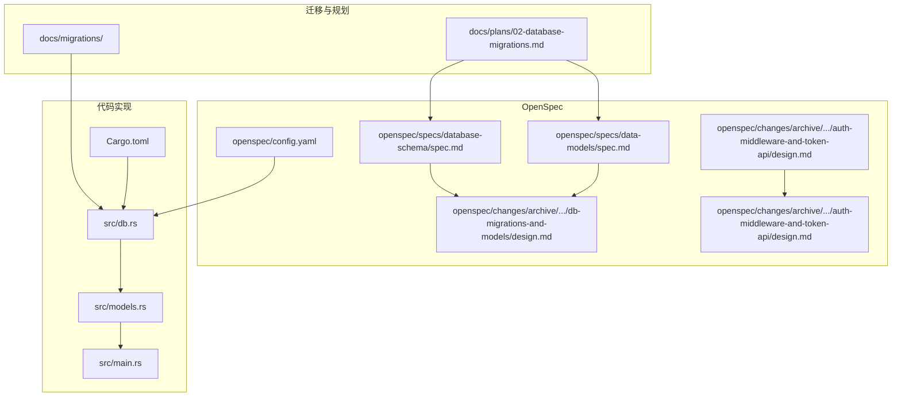
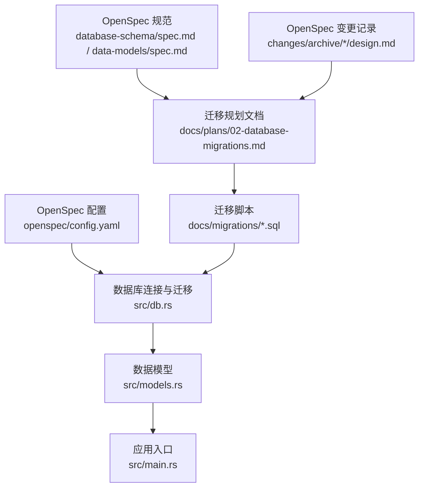
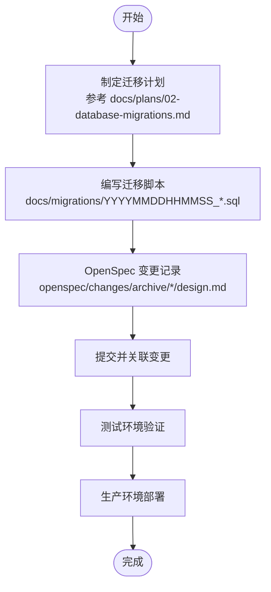
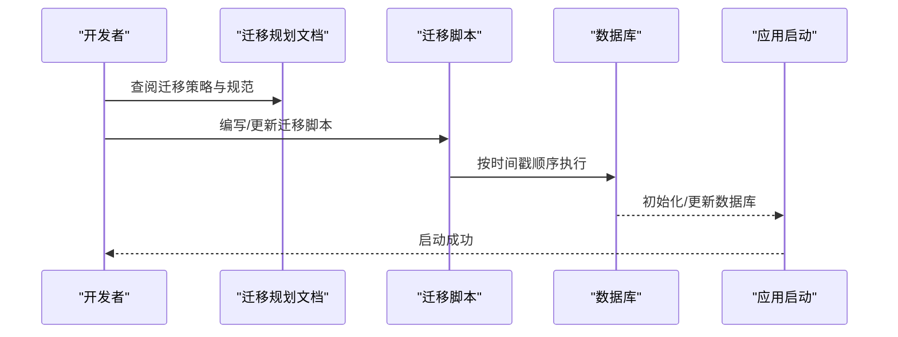
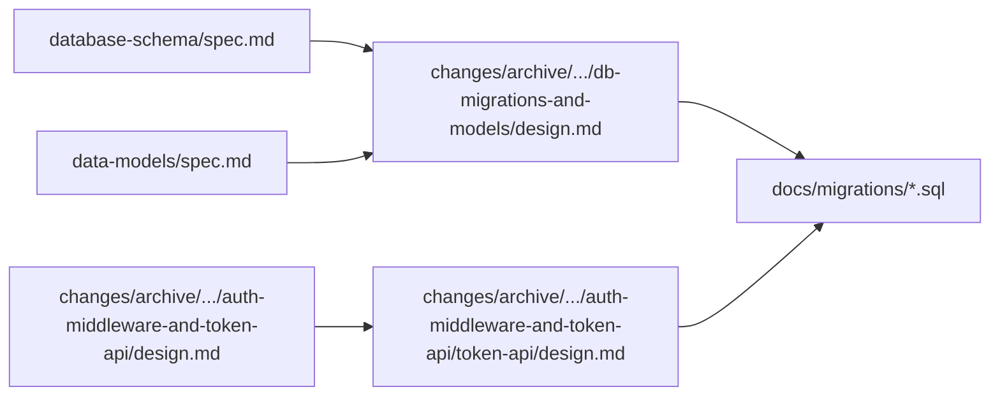
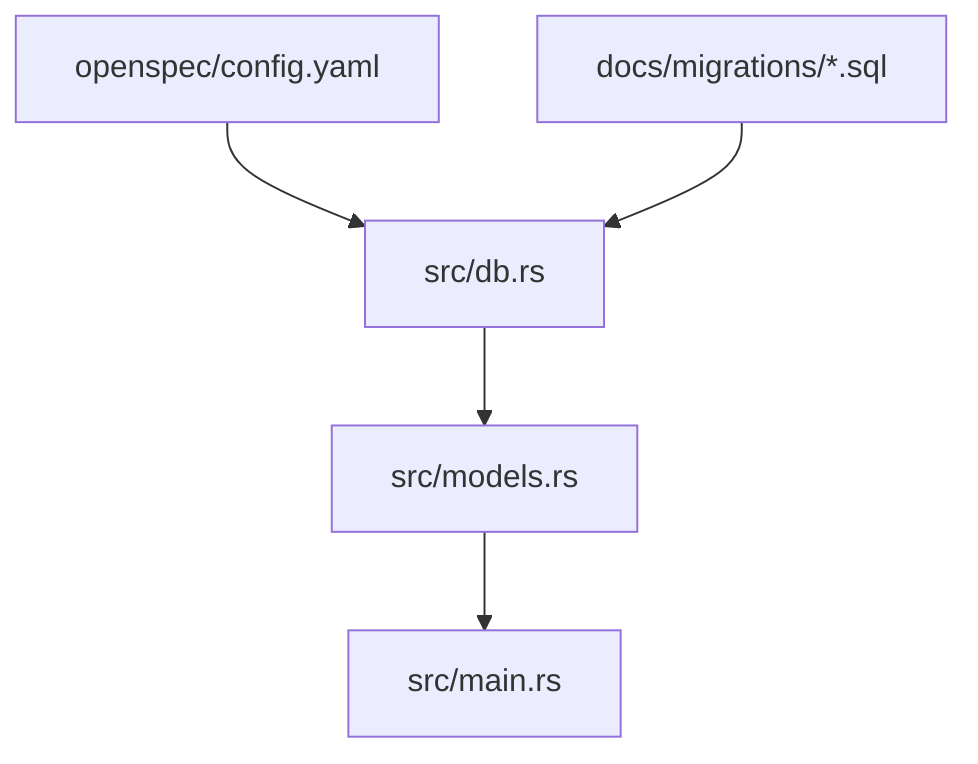

# 迁移管理

<cite>
**本文引用的文件**
- [20260607044921_init.sql](file://docs/migrations/20260607044921_init.sql)
- [02-database-migrations.md](file://docs/plans/02-database-migrations.md)
- [database-schema.spec.md](file://openspec/specs/database-schema/spec.md)
- [data-models.spec.md](file://openspec/specs/data-models/spec.md)
- [db-migrations-and-models.change.md](file://openspec/changes/archive/2026-06-07-db-migrations-and-models/design.md)
- [auth-middleware.change.md](file://openspec/changes/archive/2026-06-07-auth-middleware-and-token-api/design.md)
- [token-api.change.md](file://openspec/changes/archive/2026-06-07-auth-middleware-and-token-api/design.md)
- [backend-project-setup.change.md](file://openspec/changes/archive/2026-06-07-backend-project-setup/design.md)
- [config.yaml](file://openspec/config.yaml)
- [Cargo.toml](file://Cargo.toml)
- [src/db.rs](file://src/db.rs)
- [src/models.rs](file://src/models.rs)
- [src/main.rs](file://src/main.rs)
</cite>

## 目录
1. [简介](#简介)
2. [项目结构](#项目结构)
3. [核心组件](#核心组件)
4. [架构总览](#架构总览)
5. [详细组件分析](#详细组件分析)
6. [依赖关系分析](#依赖关系分析)
7. [性能考虑](#性能考虑)
8. [故障排除指南](#故障排除指南)
9. [结论](#结论)
10. [附录](#附录)

## 简介
本文件为 AI-Trend-Tool 的数据库迁移管理文档，聚焦于迁移脚本的组织结构、命名规范与版本控制策略，解释迁移执行顺序、回滚机制与冲突解决方法，并提供 OpenSpec 变更记录的管理与追踪方案。同时给出迁移脚本编写指南、最佳实践与常见问题解决方案，以及开发、测试、生产三类环境的迁移策略差异。

## 项目结构
AI-Trend-Tool 的迁移与数据模型相关文件主要分布在以下位置：
- 迁移脚本：docs/migrations/
- 迁移规划文档：docs/plans/02-database-migrations.md
- OpenSpec 规范与变更记录：openspec/specs/ 与 openspec/changes/archive/
- 数据库连接与模型定义：src/db.rs、src/models.rs、src/main.rs
- Rust 工程配置：Cargo.toml

**图表来源**
- [20260607044921_init.sql](file://docs/migrations/20260607044921_init.sql)
- [02-database-migrations.md](file://docs/plans/02-database-migrations.md)
- [database-schema.spec.md](file://openspec/specs/database-schema/spec.md)
- [data-models.spec.md](file://openspec/specs/data-models/spec.md)
- [db-migrations-and-models.change.md](file://openspec/changes/archive/2026-06-07-db-migrations-and-models/design.md)
- [auth-middleware.change.md](file://openspec/changes/archive/2026-06-07-auth-middleware-and-token-api/design.md)
- [token-api.change.md](file://openspec/changes/archive/2026-06-07-auth-middleware-and-token-api/design.md)
- [config.yaml](file://openspec/config.yaml)
- [src/db.rs](file://src/db.rs)
- [src/models.rs](file://src/models.rs)
- [src/main.rs](file://src/main.rs)
- [Cargo.toml](file://Cargo.toml)

**章节来源**
- [20260607044921_init.sql](file://docs/migrations/20260607044921_init.sql)
- [02-database-migrations.md](file://docs/plans/02-database-migrations.md)
- [config.yaml](file://openspec/config.yaml)
- [src/db.rs](file://src/db.rs)
- [src/models.rs](file://src/models.rs)
- [src/main.rs](file://src/main.rs)
- [Cargo.toml](file://Cargo.toml)

## 核心组件
- 迁移脚本仓库：位于 docs/migrations/，采用时间戳前缀命名（如 20260607044921_init.sql），确保自然排序即为执行顺序。
- 迁移规划文档：docs/plans/02-database-migrations.md 提供迁移策略、流程与规范说明。
- OpenSpec 规范与变更：openspec/specs/ 定义数据库模式与数据模型；openspec/changes/archive/ 记录每次变更的设计、提案与任务分解。
- 数据库连接与模型：src/db.rs 负责数据库连接与迁移执行；src/models.rs 定义数据模型；src/main.rs 启动时初始化数据库。
- 配置与依赖：openspec/config.yaml 提供 OpenSpec 配置；Cargo.toml 管理 Rust 依赖与工具链。

**章节来源**
- [20260607044921_init.sql](file://docs/migrations/20260607044921_init.sql)
- [02-database-migrations.md](file://docs/plans/02-database-migrations.md)
- [database-schema.spec.md](file://openspec/specs/database-schema/spec.md)
- [data-models.spec.md](file://openspec/specs/data-models/spec.md)
- [src/db.rs](file://src/db.rs)
- [src/models.rs](file://src/models.rs)
- [src/main.rs](file://src/main.rs)
- [config.yaml](file://openspec/config.yaml)
- [Cargo.toml](file://Cargo.toml)

## 架构总览
下图展示从 OpenSpec 规划到迁移脚本生成与执行的整体流程，以及代码层面对数据库的依赖关系。

**图表来源**
- [database-schema.spec.md](file://openspec/specs/database-schema/spec.md)
- [data-models.spec.md](file://openspec/specs/data-models/spec.md)
- [db-migrations-and-models.change.md](file://openspec/changes/archive/2026-06-07-db-migrations-and-models/design.md)
- [02-database-migrations.md](file://docs/plans/02-database-migrations.md)
- [20260607044921_init.sql](file://docs/migrations/20260607044921_init.sql)
- [config.yaml](file://openspec/config.yaml)
- [src/db.rs](file://src/db.rs)
- [src/models.rs](file://src/models.rs)
- [src/main.rs](file://src/main.rs)

## 详细组件分析

### 迁移脚本组织与命名规范
- 组织位置：docs/migrations/
- 命名规范：采用时间戳前缀（YYYYMMDDHHMMSS）+ 功能描述（如 _init.sql），保证按文件名自然排序即为执行顺序。
- 版本控制策略：每个迁移脚本独立提交，配合 OpenSpec 变更记录进行关联追踪；在合并到主分支前需通过评审与测试。

**图表来源**
- [02-database-migrations.md](file://docs/plans/02-database-migrations.md)
- [20260607044921_init.sql](file://docs/migrations/20260607044921_init.sql)
- [db-migrations-and-models.change.md](file://openspec/changes/archive/2026-06-07-db-migrations-and-models/design.md)

**章节来源**
- [20260607044921_init.sql](file://docs/migrations/20260607044921_init.sql)
- [02-database-migrations.md](file://docs/plans/02-database-migrations.md)

### 迁移执行顺序与回滚机制
- 执行顺序：以迁移脚本文件名的字典序为准，时间戳靠前的先执行。
- 回滚机制：建议为每个迁移脚本提供对应的回滚脚本（例如将 _init.sql 对应 _rollback.sql），并在执行回滚时同样遵循严格的顺序与幂等性校验。
- 幂等性：迁移脚本应具备幂等能力，避免重复执行导致的数据不一致或错误。

**图表来源**
- [02-database-migrations.md](file://docs/plans/02-database-migrations.md)
- [20260607044921_init.sql](file://docs/migrations/20260607044921_init.sql)
- [src/db.rs](file://src/db.rs)
- [src/main.rs](file://src/main.rs)

**章节来源**
- [02-database-migrations.md](file://docs/plans/02-database-migrations.md)
- [src/db.rs](file://src/db.rs)
- [src/main.rs](file://src/main.rs)

### 冲突解决方法
- 结构冲突：当多个迁移对同一对象进行修改时，优先通过合并迁移脚本或调整执行顺序解决；必要时引入中间态迁移。
- 数据冲突：在迁移中加入数据清洗与转换逻辑，确保新旧数据兼容；对关键字段提供默认值或迁移映射。
- 版本冲突：严格遵循时间戳命名与提交顺序，避免并行修改同一迁移文件；若发生冲突，回滚到最近一次稳定状态后重新设计迁移。

**章节来源**
- [02-database-migrations.md](file://docs/plans/02-database-migrations.md)

### OpenSpec 变更记录管理与追踪
- 规范来源：database-schema/spec.md 与 data-models/spec.md 定义数据库模式与数据模型。
- 变更归档：每次变更在 openspec/changes/archive/<date>-<topic>/ 下形成完整记录（design.md、proposal.md、tasks.md 等）。
- 关联追踪：迁移脚本与 OpenSpec 变更记录通过主题与日期建立映射，便于审计与回溯。

**图表来源**
- [database-schema.spec.md](file://openspec/specs/database-schema/spec.md)
- [data-models.spec.md](file://openspec/specs/data-models/spec.md)
- [db-migrations-and-models.change.md](file://openspec/changes/archive/2026-06-07-db-migrations-and-models/design.md)
- [auth-middleware.change.md](file://openspec/changes/archive/2026-06-07-auth-middleware-and-token-api/design.md)
- [token-api.change.md](file://openspec/changes/archive/2026-06-07-auth-middleware-and-token-api/design.md)
- [20260607044921_init.sql](file://docs/migrations/20260607044921_init.sql)

**章节来源**
- [database-schema.spec.md](file://openspec/specs/database-schema/spec.md)
- [data-models.spec.md](file://openspec/specs/data-models/spec.md)
- [db-migrations-and-models.change.md](file://openspec/changes/archive/2026-06-07-db-migrations-and-models/design.md)
- [auth-middleware.change.md](file://openspec/changes/archive/2026-06-07-auth-middleware-and-token-api/design.md)
- [token-api.change.md](file://openspec/changes/archive/2026-06-07-auth-middleware-and-token-api/design.md)

### 迁移脚本编写指南与最佳实践
- 设计阶段：基于 OpenSpec 的 database-schema/spec.md 与 data-models/spec.md 制定迁移目标，明确新增/修改/删除的对象与字段。
- 脚本编写：遵循幂等性原则，避免破坏性操作；对索引、约束、触发器等进行显式声明与版本化。
- 测试验证：在测试环境中执行迁移，验证数据完整性与查询性能；记录失败场景与修复步骤。
- 文档同步：每次迁移完成后更新 docs/plans/02-database-migrations.md 与 OpenSpec 变更记录，保持一致性。

**章节来源**
- [02-database-migrations.md](file://docs/plans/02-database-migrations.md)
- [database-schema.spec.md](file://openspec/specs/database-schema/spec.md)
- [data-models.spec.md](file://openspec/specs/data-models/spec.md)

### 开发、测试、生产环境迁移策略差异
- 开发环境：快速迭代，允许临时性破坏性迁移；建议使用本地数据库快照与回滚脚本。
- 测试环境：模拟生产环境，执行完整的迁移与回归测试；记录性能指标与异常日志。
- 生产环境：最小化停机时间，采用灰度发布与回滚预案；迁移窗口外进行预热与验证。

**章节来源**
- [02-database-migrations.md](file://docs/plans/02-database-migrations.md)

## 依赖关系分析
迁移系统与代码层的耦合关系如下：
- OpenSpec 配置 openspec/config.yaml 影响迁移工具与规范解析。
- src/db.rs 负责迁移执行与连接管理。
- src/models.rs 定义数据模型，与迁移脚本中的表结构保持一致。
- src/main.rs 在应用启动时初始化数据库与迁移。

**图表来源**
- [config.yaml](file://openspec/config.yaml)
- [src/db.rs](file://src/db.rs)
- [src/models.rs](file://src/models.rs)
- [src/main.rs](file://src/main.rs)
- [20260607044921_init.sql](file://docs/migrations/20260607044921_init.sql)

**章节来源**
- [config.yaml](file://openspec/config.yaml)
- [src/db.rs](file://src/db.rs)
- [src/models.rs](file://src/models.rs)
- [src/main.rs](file://src/main.rs)
- [20260607044921_init.sql](file://docs/migrations/20260607044921_init.sql)

## 性能考虑
- 迁移执行期间尽量减少锁竞争与长事务；对大表操作采用分批处理与索引优化。
- 在测试环境评估迁移对查询性能的影响，必要时补充或调整索引。
- 生产环境迁移窗口选择业务低峰时段，监控数据库资源占用与响应延迟。

## 故障排除指南
- 迁移失败：检查迁移脚本的幂等性与依赖顺序；查看数据库日志定位具体错误点。
- 数据不一致：核对 OpenSpec 变更记录与迁移脚本是否匹配；必要时手动修正或执行回滚脚本。
- 连接异常：确认 src/db.rs 中的连接参数与环境变量；验证数据库服务状态。
- 启动失败：检查 src/main.rs 的初始化流程与迁移执行结果；确保迁移脚本已正确应用。

**章节来源**
- [src/db.rs](file://src/db.rs)
- [src/main.rs](file://src/main.rs)

## 结论
通过规范化的迁移脚本命名与组织、严格的 OpenSpec 变更记录管理、清晰的执行顺序与回滚机制，以及针对不同环境的差异化策略，AI-Trend-Tool 能够安全、可追溯地演进数据库结构。建议持续完善迁移文档与自动化测试，确保团队协作效率与系统稳定性。

## 附录
- 迁移脚本示例路径：docs/migrations/20260607044921_init.sql
- 迁移规划文档：docs/plans/02-database-migrations.md
- OpenSpec 规范与变更：
  - database-schema/spec.md
  - data-models/spec.md
  - openspec/changes/archive/.../db-migrations-and-models/design.md
  - openspec/changes/archive/.../auth-middleware-and-token-api/design.md
  - openspec/changes/archive/.../auth-middleware-and-token-api/token-api/design.md
- 代码实现参考：
  - src/db.rs
  - src/models.rs
  - src/main.rs
  - openspec/config.yaml
  - Cargo.toml