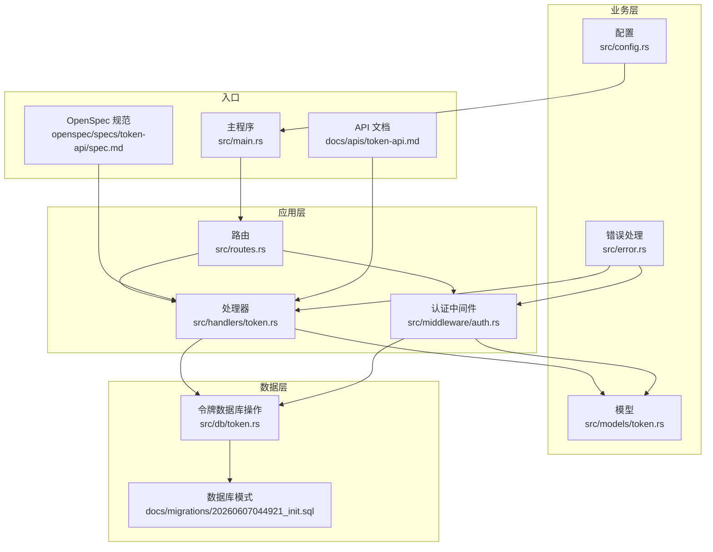
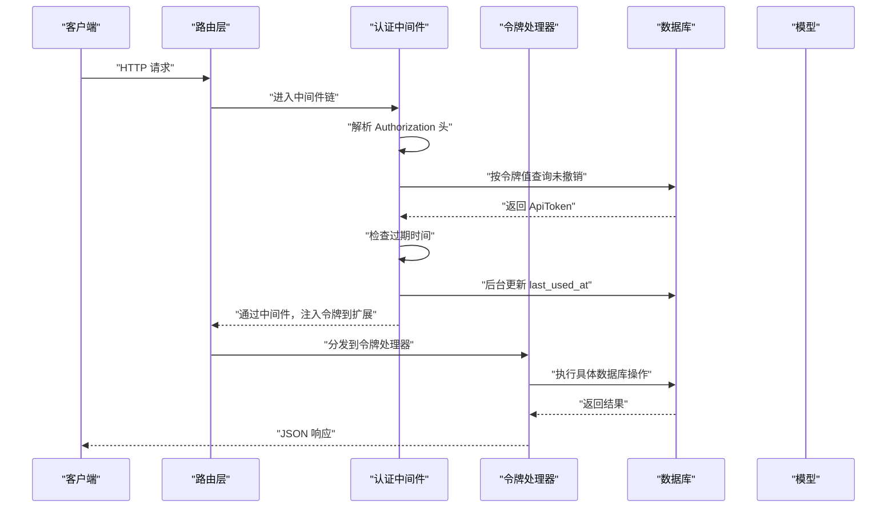
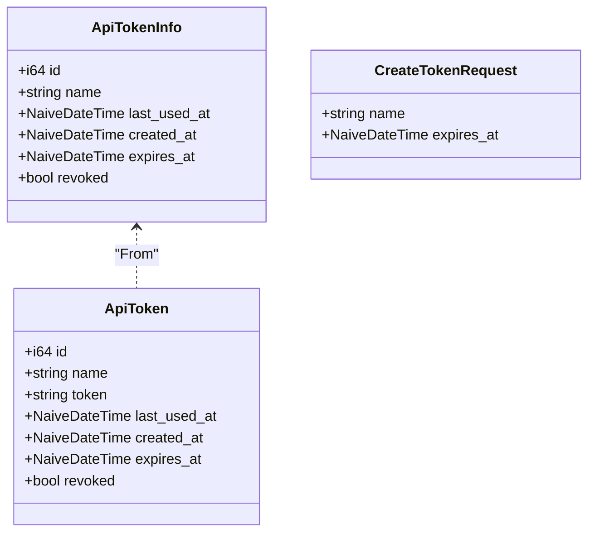
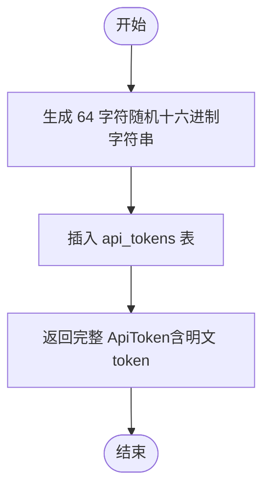
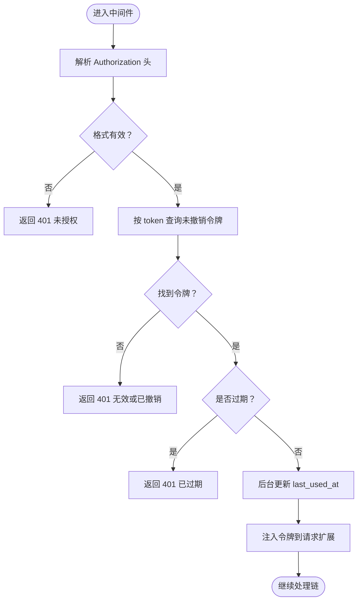
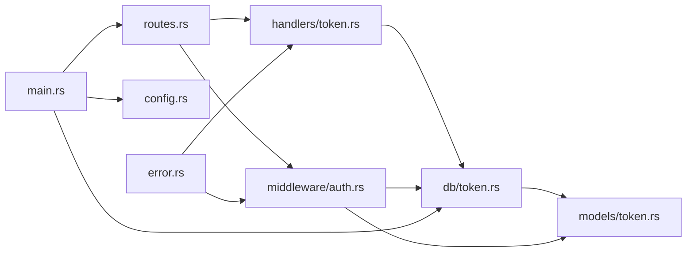

# 令牌模型

<cite>
**本文引用的文件**
- [src/models/token.rs](file://src/models/token.rs)
- [src/db/token.rs](file://src/db/token.rs)
- [src/handlers/token.rs](file://src/handlers/token.rs)
- [src/middleware/auth.rs](file://src/middleware/auth.rs)
- [src/routes.rs](file://src/routes.rs)
- [src/main.rs](file://src/main.rs)
- [docs/apis/token-api.md](file://docs/apis/token-api.md)
- [docs/migrations/20260607044921_init.sql](file://docs/migrations/20260607044921_init.sql)
- [src/config.rs](file://src/config.rs)
- [src/error.rs](file://src/error.rs)
- [openspec/specs/token-api/spec.md](file://openspec/specs/token-api/spec.md)
</cite>

## 目录
1. [简介](#简介)
2. [项目结构](#项目结构)
3. [核心组件](#核心组件)
4. [架构总览](#架构总览)
5. [详细组件分析](#详细组件分析)
6. [依赖分析](#依赖分析)
7. [性能考虑](#性能考虑)
8. [故障排查指南](#故障排查指南)
9. [结论](#结论)
10. [附录](#附录)

## 简介
本文件系统性地文档化了 AI 趋势监控系统中的“令牌模型”，涵盖令牌实体结构、生成/验证/撤销流程、与用户与 API 的关联关系、安全策略与防护措施、监控与审计能力，以及实际使用示例与最佳实践。该系统采用 SQLite 存储令牌，Axum 提供 REST API，中间件负责 Bearer 令牌认证与自动更新使用时间戳。

## 项目结构
围绕令牌模型的关键文件组织如下：
- 模型层：定义令牌数据结构与序列化/反序列化行为
- 数据访问层：封装对 api_tokens 表的 CRUD 与查询
- 处理器层：暴露 /api/v1/tokens 的 REST 接口
- 中间件层：统一从 Authorization 头提取并校验令牌
- 路由层：挂载令牌路由并应用全局认证中间件
- 启动流程：首次启动确保存在至少一个可用令牌
- 文档与规范：API 文档与 OpenSpec 规范

图表来源
- [src/routes.rs:14-50](file://src/routes.rs#L14-L50)
- [src/handlers/token.rs:13-66](file://src/handlers/token.rs#L13-L66)
- [src/middleware/auth.rs:14-60](file://src/middleware/auth.rs#L14-L60)
- [src/db/token.rs:1-107](file://src/db/token.rs#L1-L107)
- [src/models/token.rs:1-46](file://src/models/token.rs#L1-L46)
- [src/main.rs:26-61](file://src/main.rs#L26-L61)
- [docs/migrations/20260607044921_init.sql:1-118](file://docs/migrations/20260607044921_init.sql#L1-L118)
- [openspec/specs/token-api/spec.md:1-76](file://openspec/specs/token-api/spec.md#L1-L76)
- [docs/apis/token-api.md:1-198](file://docs/apis/token-api.md#L1-L198)

章节来源
- [src/routes.rs:14-50](file://src/routes.rs#L14-L50)
- [src/handlers/token.rs:13-66](file://src/handlers/token.rs#L13-L66)
- [src/middleware/auth.rs:14-60](file://src/middleware/auth.rs#L14-L60)
- [src/db/token.rs:1-107](file://src/db/token.rs#L1-L107)
- [src/models/token.rs:1-46](file://src/models/token.rs#L1-L46)
- [src/main.rs:26-61](file://src/main.rs#L26-L61)
- [docs/migrations/20260607044921_init.sql:1-118](file://docs/migrations/20260607044921_init.sql#L1-L118)
- [openspec/specs/token-api/spec.md:1-76](file://openspec/specs/token-api/spec.md#L1-L76)
- [docs/apis/token-api.md:1-198](file://docs/apis/token-api.md#L1-L198)

## 核心组件
- 令牌实体模型
  - 字段：id、name、token（仅创建时可见）、last_used_at、created_at、expires_at、revoked
  - 序列化：用于响应体；列表响应隐藏明文 token
- 数据库操作
  - 创建、查询、列表、撤销、统计、删除、首次激活令牌
- 处理器接口
  - POST /api/v1/tokens：创建令牌（返回明文 token）
  - GET /api/v1/tokens：列出令牌（隐藏明文 token）
  - POST /api/v1/tokens/revoke/{id}：撤销令牌
- 认证中间件
  - 从 Authorization 头解析 Bearer 令牌
  - 数据库校验（未撤销）
  - 过期检查
  - 异步更新 last_used_at
  - 将令牌注入请求扩展供下游使用

章节来源
- [src/models/token.rs:5-46](file://src/models/token.rs#L5-L46)
- [src/db/token.rs:6-107](file://src/db/token.rs#L6-L107)
- [src/handlers/token.rs:13-66](file://src/handlers/token.rs#L13-L66)
- [src/middleware/auth.rs:14-60](file://src/middleware/auth.rs#L14-L60)

## 架构总览
下图展示令牌系统在整体系统中的位置与交互：

图表来源
- [src/routes.rs:14-50](file://src/routes.rs#L14-L50)
- [src/middleware/auth.rs:18-59](file://src/middleware/auth.rs#L18-L59)
- [src/handlers/token.rs:18-66](file://src/handlers/token.rs#L18-L66)
- [src/db/token.rs:6-107](file://src/db/token.rs#L6-L107)
- [src/models/token.rs:5-46](file://src/models/token.rs#L5-L46)

## 详细组件分析

### 令牌实体与数据模型
- 结构要点
  - 明文 token 仅在创建时返回，后续列表响应隐藏该字段，降低泄露风险
  - 支持可选过期时间，便于短期令牌管理
  - 记录最后使用时间，便于审计与监控
  - 使用布尔字段表示是否撤销，支持软删除
- 序列化策略
  - ApiTokenInfo 用于列表响应，避免泄露敏感信息
  - CreateTokenRequest 用于创建请求体，支持可选过期时间

图表来源
- [src/models/token.rs:5-46](file://src/models/token.rs#L5-L46)

章节来源
- [src/models/token.rs:5-46](file://src/models/token.rs#L5-L46)

### 数据库模式与存储
- 表结构
  - api_tokens：包含唯一 token、名称、创建时间、过期时间、最后使用时间、撤销标志
  - 其他表与令牌无直接关联，但系统整体通过令牌进行访问控制
- 约束与索引
  - token 唯一约束，防止重复
  - created_at 默认值为当前时间
  - 查询时默认排除已撤销令牌

章节来源
- [docs/migrations/20260607044921_init.sql:4-12](file://docs/migrations/20260607044921_init.sql#L4-L12)

### 令牌生成与创建流程
- 流程概览
  - 生成 64 字符十六进制随机字符串作为令牌
  - 写入数据库并返回完整 ApiToken（含明文 token）
  - 列表响应使用 ApiTokenInfo 隐藏明文
- 安全注意
  - 明文 token 仅在创建响应中出现一次
  - 建议客户端妥善保存返回的明文 token

图表来源
- [src/handlers/token.rs:18-30](file://src/handlers/token.rs#L18-L30)

章节来源
- [src/handlers/token.rs:18-30](file://src/handlers/token.rs#L18-L30)
- [docs/apis/token-api.md:62-120](file://docs/apis/token-api.md#L62-L120)

### 令牌验证与中间件
- 验证步骤
  - 解析 Authorization 头，要求 Bearer 格式
  - 从数据库查询对应令牌且未撤销
  - 检查过期时间（若设置）
  - 异步更新 last_used_at
  - 将令牌对象注入请求扩展
- 错误处理
  - 缺失或格式不正确头：401
  - 无效或已撤销：401
  - 过期：401
  - 其他数据库异常：500

图表来源
- [src/middleware/auth.rs:18-59](file://src/middleware/auth.rs#L18-L59)

章节来源
- [src/middleware/auth.rs:18-59](file://src/middleware/auth.rs#L18-L59)
- [src/error.rs:8-50](file://src/error.rs#L8-L50)

### 令牌撤销与生命周期
- 撤销机制
  - PUT/DELETE 路径：POST /api/v1/tokens/revoke/{id}
  - 实现：将 revoked 设为 1
  - 返回：204 No Content；不存在时返回 404
- 生命周期
  - 创建：生成明文 token 并入库
  - 使用：每次请求更新 last_used_at
  - 撤销：标记 revoked=1，立即失效
  - 删除：物理删除（提供删除接口）

章节来源
- [src/handlers/token.rs:45-66](file://src/handlers/token.rs#L45-L66)
- [src/db/token.rs:61-107](file://src/db/token.rs#L61-L107)
- [docs/apis/token-api.md:168-198](file://docs/apis/token-api.md#L168-L198)

### 与用户与 API 的关联关系
- 用户角色
  - 初始管理员令牌：服务首次启动自动生成或从配置读取
  - 后续普通令牌：由具备权限的用户创建
- API 关联
  - 所有 /api/v1/* 路由均受认证中间件保护
  - 令牌与具体用户无直接绑定，而是通过权限范围的令牌进行访问控制

章节来源
- [src/main.rs:26-61](file://src/main.rs#L26-L61)
- [src/routes.rs:14-50](file://src/routes.rs#L14-L50)
- [docs/apis/token-api.md:5-14](file://docs/apis/token-api.md#L5-L14)

### 安全策略与防护措施
- 传输安全
  - 建议通过 HTTPS 传输，避免明文 token 在网络中被截获
- 存储安全
  - 仅在创建时返回明文 token；列表响应隐藏 token
  - 数据库层通过唯一约束保证 token 不重复
- 访问控制
  - 全局中间件强制 Bearer 认证
  - 未撤销与未过期检查
- 最佳实践
  - 为不同用途创建不同名称的令牌
  - 设置合理的过期时间
  - 及时撤销不再使用的令牌
  - 限制令牌的最小权限原则

章节来源
- [src/handlers/token.rs:18-30](file://src/handlers/token.rs#L18-L30)
- [src/middleware/auth.rs:18-59](file://src/middleware/auth.rs#L18-L59)
- [docs/migrations/20260607044921_init.sql:4-12](file://docs/migrations/20260607044921_init.sql#L4-L12)

### 监控与审计
- 自动记录
  - 每次成功认证后异步更新 last_used_at，便于追踪使用情况
- 可视化建议
  - 结合日志系统（tracing）输出访问与错误信息
  - 在管理端展示令牌列表（隐藏明文），包含创建时间、过期时间、最后使用时间、状态
- 审计要点
  - 记录创建、撤销、删除等关键动作
  - 对 401 未授权与过期事件进行告警

章节来源
- [src/middleware/auth.rs:48-53](file://src/middleware/auth.rs#L48-L53)
- [src/db/token.rs:50-59](file://src/db/token.rs#L50-L59)
- [src/main.rs:37-42](file://src/main.rs#L37-L42)

### 实际使用示例与最佳实践
- 获取初始令牌
  - 首次启动会打印初始管理员令牌，请妥善保存
- 创建新令牌
  - 使用现有有效令牌调用 POST /api/v1/tokens，携带 name 与可选 expires_at
- 列出令牌
  - 使用现有有效令牌调用 GET /api/v1/tokens，查看所有令牌（不包含明文 token）
- 撤销令牌
  - 使用现有有效令牌调用 POST /api/v1/tokens/revoke/{id}
- 最佳实践
  - 为不同环境与用途分别创建令牌
  - 设置合理的过期时间，到期后及时续期或重新创建
  - 严格保管明文 token，避免泄露

章节来源
- [src/main.rs:26-61](file://src/main.rs#L26-L61)
- [docs/apis/token-api.md:62-198](file://docs/apis/token-api.md#L62-L198)
- [openspec/specs/token-api/spec.md:9-76](file://openspec/specs/token-api/spec.md#L9-L76)

## 依赖分析
- 组件耦合
  - 路由层依赖中间件与处理器
  - 处理器依赖数据库模块与模型
  - 中间件依赖数据库模块与模型
  - 主程序负责初始化数据库与令牌
- 外部依赖
  - Axum/Tower 提供路由与中间件框架
  - SQLx 提供 SQLite 访问与迁移
  - Serde/Chrono/Hex/Rand 提供序列化、时间、编码与随机数
  - Tracing 日志

图表来源
- [src/routes.rs:14-50](file://src/routes.rs#L14-L50)
- [src/handlers/token.rs:13-66](file://src/handlers/token.rs#L13-L66)
- [src/middleware/auth.rs:14-60](file://src/middleware/auth.rs#L14-L60)
- [src/db/token.rs:1-107](file://src/db/token.rs#L1-L107)
- [src/models/token.rs:1-46](file://src/models/token.rs#L1-L46)
- [src/main.rs:26-61](file://src/main.rs#L26-L61)
- [src/config.rs:1-59](file://src/config.rs#L1-L59)
- [src/error.rs:1-79](file://src/error.rs#L1-L79)

章节来源
- [src/routes.rs:14-50](file://src/routes.rs#L14-L50)
- [src/handlers/token.rs:13-66](file://src/handlers/token.rs#L13-L66)
- [src/middleware/auth.rs:14-60](file://src/middleware/auth.rs#L14-L60)
- [src/db/token.rs:1-107](file://src/db/token.rs#L1-L107)
- [src/models/token.rs:1-46](file://src/models/token.rs#L1-L46)
- [src/main.rs:26-61](file://src/main.rs#L26-L61)
- [src/config.rs:1-59](file://src/config.rs#L1-L59)
- [src/error.rs:1-79](file://src/error.rs#L1-L79)

## 性能考虑
- 异步更新 last_used_at
  - 使用 fire-and-forget 方式在后台更新，避免阻塞请求路径
- 查询优化
  - 查询时默认过滤已撤销令牌，减少无效匹配
  - 列表默认按创建时间倒序，便于快速定位最新令牌
- 并发与连接池
  - 使用 SQLx 连接池，合理配置并发与超时
- 建议
  - 对高频访问场景，可在数据库层面增加必要的索引（如按 token 查询）
  - 控制令牌数量，定期清理长期未使用或过期的令牌

章节来源
- [src/middleware/auth.rs:48-53](file://src/middleware/auth.rs#L48-L53)
- [src/db/token.rs:22-28](file://src/db/token.rs#L22-L28)

## 故障排查指南
- 常见问题
  - 401 未授权：检查 Authorization 头格式与令牌有效性；确认未过期且未撤销
  - 404 令牌不存在：确认令牌 ID 正确；检查数据库中是否存在
  - 500 数据库错误：查看日志定位具体错误；检查连接池与迁移是否完成
- 排查步骤
  - 确认服务已运行并完成数据库迁移
  - 使用健康检查端点 /health 验证服务可用性
  - 通过 GET /api/v1/tokens 查看令牌状态
  - 检查日志输出，关注认证失败与数据库异常

章节来源
- [src/error.rs:8-50](file://src/error.rs#L8-L50)
- [src/middleware/auth.rs:18-59](file://src/middleware/auth.rs#L18-L59)
- [docs/apis/token-api.md:17-37](file://docs/apis/token-api.md#L17-L37)

## 结论
该令牌模型以简洁、安全为核心设计目标：明文 token 仅在创建时出现，列表响应隐藏敏感字段；通过中间件统一校验与审计；支持过期与撤销机制；配合日志与监控可实现完整的审计与运维能力。遵循本文的最佳实践与安全建议，可有效提升系统的安全性与可维护性。

## 附录
- API 参考
  - POST /api/v1/tokens：创建令牌
  - GET /api/v1/tokens：列出令牌
  - POST /api/v1/tokens/revoke/{id}：撤销令牌
- 相关文件
  - 数据库模式：docs/migrations/20260607044921_init.sql
  - OpenSpec 规范：openspec/specs/token-api/spec.md
  - API 文档：docs/apis/token-api.md