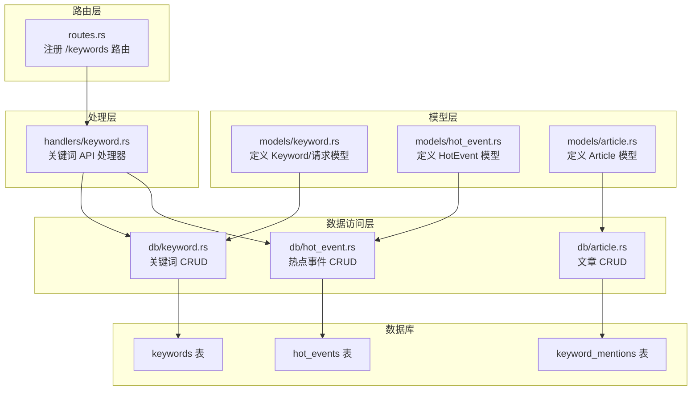
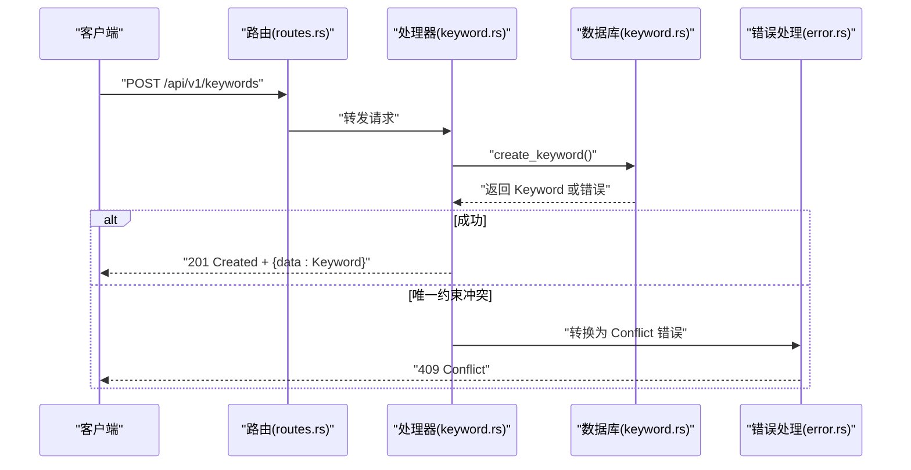
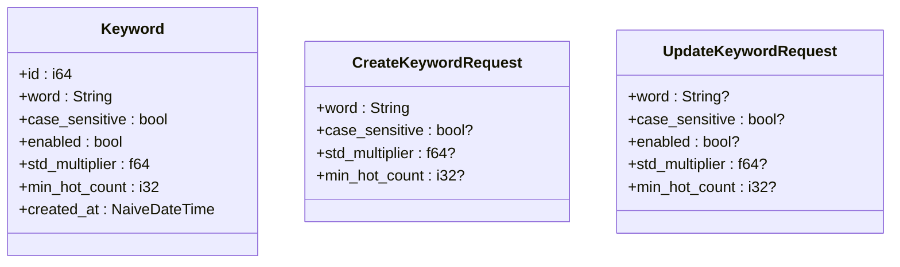
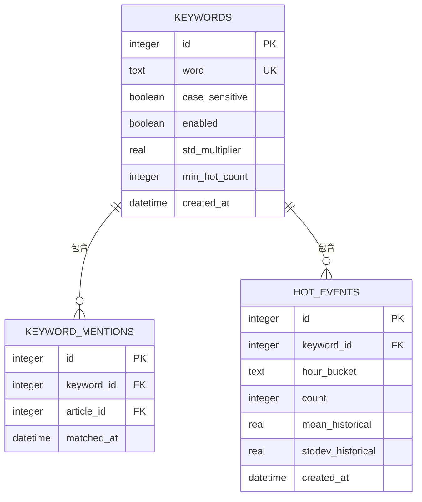
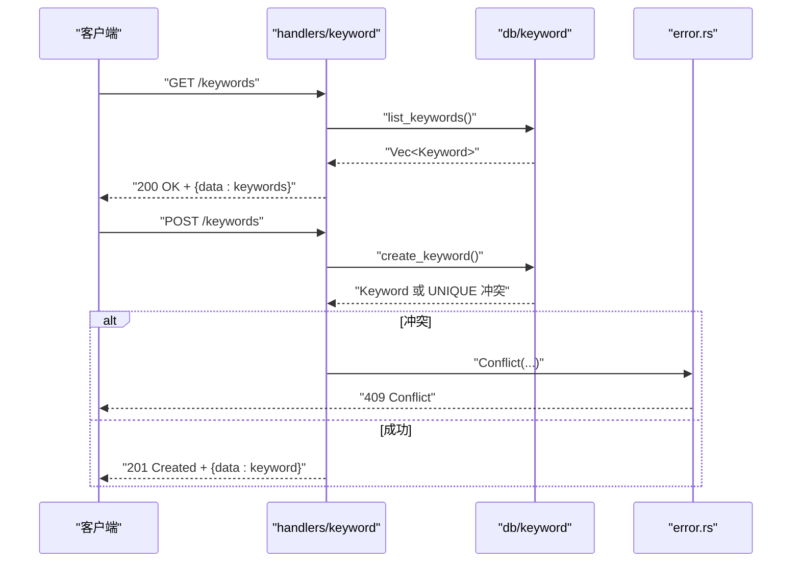
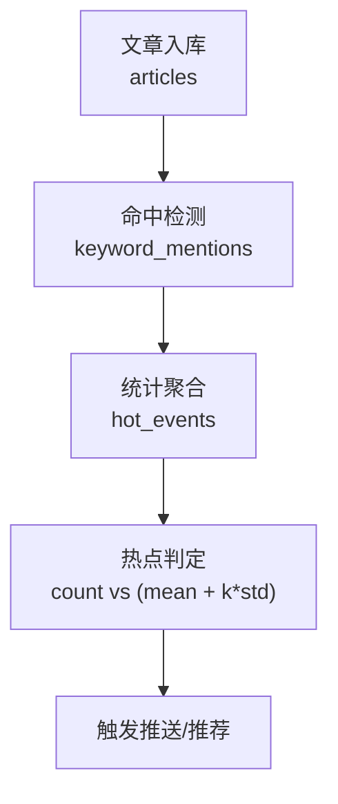
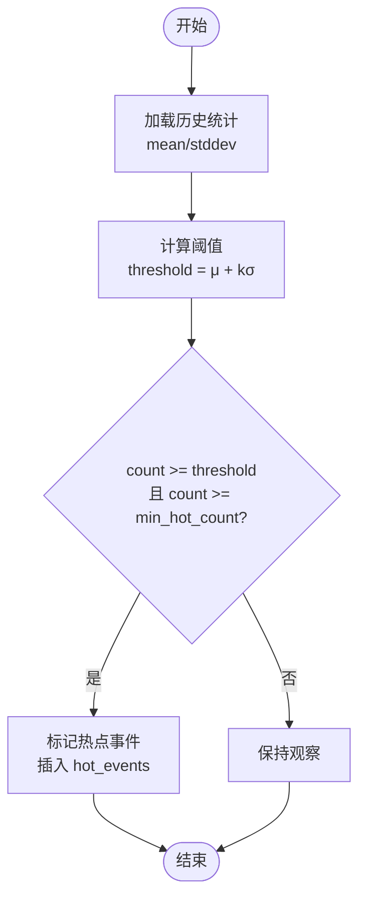
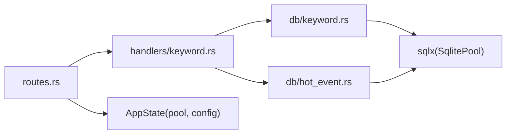

# 关键词模型

<cite>
**本文引用的文件**
- [src/models/keyword.rs](file://src/models/keyword.rs)
- [src/db/keyword.rs](file://src/db/keyword.rs)
- [src/handlers/keyword.rs](file://src/handlers/keyword.rs)
- [src/routes.rs](file://src/routes.rs)
- [docs/migrations/20260607044921_init.sql](file://docs/migrations/20260607044921_init.sql)
- [src/db/hot_event.rs](file://src/db/hot_event.rs)
- [src/models/hot_event.rs](file://src/models/hot_event.rs)
- [src/db/article.rs](file://src/db/article.rs)
- [src/models/article.rs](file://src/models/article.rs)
- [src/error.rs](file://src/error.rs)
- [src/main.rs](file://src/main.rs)
- [src/db.rs](file://src/db.rs)
</cite>

## 目录
1. [引言](#引言)
2. [项目结构](#项目结构)
3. [核心组件](#核心组件)
4. [架构总览](#架构总览)
5. [详细组件分析](#详细组件分析)
6. [依赖分析](#依赖分析)
7. [性能考虑](#性能考虑)
8. [故障排查指南](#故障排查指南)
9. [结论](#结论)
10. [附录](#附录)

## 引言
本文件围绕关键词模型进行系统性文档化，覆盖关键词实体结构、数据库表设计、API 处理流程、与文章与热点事件的关联关系、统计分析与趋势预测能力，并提供关键词搜索与过滤的使用路径与最佳实践。关键词模型是 AI 趋势监控系统的核心数据模型之一，用于识别和追踪热点话题。

## 项目结构
关键词模型由以下层次组成：
- 模型层：定义关键词实体及其请求/更新载荷
- 数据访问层：封装 SQL 查询与更新逻辑
- 处理器层：Axum 路由处理器，负责请求解析与响应包装
- 路由层：注册关键词相关 API
- 数据库迁移：定义 keywords、keyword_mentions、hot_events 等表及索引
- 关联模块：文章与热点事件模块，支撑关键词的命中与趋势统计

图表来源
- [src/models/keyword.rs:1-32](file://src/models/keyword.rs#L1-L32)
- [src/db/keyword.rs:1-115](file://src/db/keyword.rs#L1-L115)
- [src/handlers/keyword.rs:1-82](file://src/handlers/keyword.rs#L1-L82)
- [src/routes.rs:1-61](file://src/routes.rs#L1-L61)
- [docs/migrations/20260607044921_init.sql:50-90](file://docs/migrations/20260607044921_init.sql#L50-L90)

章节来源
- [src/models/keyword.rs:1-32](file://src/models/keyword.rs#L1-L32)
- [src/db/keyword.rs:1-115](file://src/db/keyword.rs#L1-L115)
- [src/handlers/keyword.rs:1-82](file://src/handlers/keyword.rs#L1-L82)
- [src/routes.rs:1-61](file://src/routes.rs#L1-L61)
- [docs/migrations/20260607044921_init.sql:50-90](file://docs/migrations/20260607044921_init.sql#L50-L90)

## 核心组件
- 关键词实体（Keyword）：标识唯一关键词，包含大小写敏感开关、启用状态、标准差倍数阈值、最小热点计数阈值、创建时间等字段。
- 请求/更新载荷：CreateKeywordRequest 与 UpdateKeywordRequest 定义了创建与更新时可选的参数集合。
- 数据库表：keywords 表承载关键词元数据；keyword_mentions 表记录关键词与文章的命中关系；hot_events 表记录按小时粒度的事件统计与历史均值/标准差。
- API 层：提供关键词的增删改查接口，返回统一的响应结构。
- 统计与趋势：通过 hot_events 的均值与标准差计算，结合最小热点计数阈值，实现热点检测与趋势分析。

章节来源
- [src/models/keyword.rs:5-31](file://src/models/keyword.rs#L5-L31)
- [docs/migrations/20260607044921_init.sql:50-90](file://docs/migrations/20260607044921_init.sql#L50-L90)
- [src/handlers/keyword.rs:12-82](file://src/handlers/keyword.rs#L12-L82)

## 架构总览
关键词模型在系统中的位置如下：
- 入口：main 初始化数据库连接池并执行迁移
- 路由：routes 注册 /api/v1/keywords 相关端点
- 处理器：handlers/keyword 将请求映射到 db/keyword 的数据库操作
- 数据库：keywords、keyword_mentions、hot_events 三张表支撑关键词管理、命中与趋势

图表来源
- [src/routes.rs:31-35](file://src/routes.rs#L31-L35)
- [src/handlers/keyword.rs:27-43](file://src/handlers/keyword.rs#L27-L43)
- [src/db/keyword.rs:5-19](file://src/db/keyword.rs#L5-L19)
- [src/error.rs:8-59](file://src/error.rs#L8-L59)

章节来源
- [src/main.rs:76-80](file://src/main.rs#L76-L80)
- [src/routes.rs:14-50](file://src/routes.rs#L14-L50)
- [src/handlers/keyword.rs:12-82](file://src/handlers/keyword.rs#L12-L82)
- [src/db/keyword.rs:1-115](file://src/db/keyword.rs#L1-L115)
- [src/error.rs:1-79](file://src/error.rs#L1-L79)

## 详细组件分析

### 关键词实体与请求模型
- 实体字段
  - id：自增主键
  - word：关键词文本（唯一）
  - case_sensitive：是否区分大小写
  - enabled：是否启用
  - std_multiplier：热点判定的标准差倍数
  - min_hot_count：最小热点计数阈值
  - created_at：创建时间
- 请求模型
  - CreateKeywordRequest：创建时需提供 word，其余为可选默认值
  - UpdateKeywordRequest：全部字段可选，仅更新提供的字段

图表来源
- [src/models/keyword.rs:5-31](file://src/models/keyword.rs#L5-L31)

章节来源
- [src/models/keyword.rs:1-32](file://src/models/keyword.rs#L1-L32)

### 数据库表设计与关系
- keywords：存储关键词元数据，含唯一约束 word
- keyword_mentions：关键词与文章的多对多中间表，记录命中时间
- hot_events：按小时聚合的热点事件，包含 count、mean_historical、stddev_historical

图表来源
- [docs/migrations/20260607044921_init.sql:50-90](file://docs/migrations/20260607044921_init.sql#L50-L90)

章节来源
- [docs/migrations/20260607044921_init.sql:50-90](file://docs/migrations/20260607044921_init.sql#L50-L90)

### API 处理流程与错误处理
- 列表/创建/更新/删除：handlers/keyword 提供四个核心端点，分别调用 db/keyword 的对应函数
- 错误处理：统一转换为 AppError，冲突场景（如重复 word）返回 409
- 响应格式：统一使用 ApiResponse 包裹 { data: ... }

图表来源
- [src/handlers/keyword.rs:12-82](file://src/handlers/keyword.rs#L12-L82)
- [src/db/keyword.rs:21-19](file://src/db/keyword.rs#L21-L19)
- [src/error.rs:8-59](file://src/error.rs#L8-L59)

章节来源
- [src/handlers/keyword.rs:12-82](file://src/handlers/keyword.rs#L12-L82)
- [src/error.rs:1-79](file://src/error.rs#L1-L79)

### 关键词与文章、热点事件的关联
- 关联关系
  - keyword_mentions：记录某关键词在某文章中被命中的事实
  - hot_events：按小时统计某关键词的事件数量，并保存历史均值与标准差
- 应用价值
  - 内容分析：通过 keyword_mentions 可统计关键词在不同文章中的分布与趋势
  - 推荐系统：基于关键词热度与文章相似度进行协同或基于内容的推荐

图表来源
- [docs/migrations/20260607044921_init.sql:65-86](file://docs/migrations/20260607044921_init.sql#L65-L86)
- [src/db/hot_event.rs:5-81](file://src/db/hot_event.rs#L5-L81)

章节来源
- [docs/migrations/20260607044921_init.sql:65-86](file://docs/migrations/20260607044921_init.sql#L65-L86)
- [src/db/hot_event.rs:1-81](file://src/db/hot_event.rs#L1-L81)

### 统计分析与趋势预测
- 统计指标
  - count：当前小时内的事件计数
  - mean_historical：历史均值
  - stddev_historical：历史标准差
- 阈值策略
  - 使用 std_multiplier 与 min_hot_count 进行热点判定
  - 触发条件：count >= mean_historical + std_multiplier * stddev_historical 且 count >= min_hot_count
- 时间序列
  - 通过 get_hourly_counts 获取最近 N 小时的计数序列，支持趋势可视化与进一步建模

图表来源
- [src/db/hot_event.rs:63-80](file://src/db/hot_event.rs#L63-L80)
- [src/models/hot_event.rs:5-14](file://src/models/hot_event.rs#L5-L14)

章节来源
- [src/db/hot_event.rs:1-81](file://src/db/hot_event.rs#L1-L81)
- [src/models/hot_event.rs:1-15](file://src/models/hot_event.rs#L1-L15)

### 关键词搜索与过滤
- 列表查询
  - GET /api/v1/keywords：返回按创建时间倒序的所有关键词
  - GET /api/v1/keywords/{id}/update：先校验存在性再更新
  - GET /api/v1/keywords/{id}/delete：先校验存在性再删除
- 过滤建议
  - 可扩展：在 handlers 层增加查询参数（如 enabled、case_sensitive），在 db 层构建动态 WHERE 子句
  - 示例路径
    - [src/handlers/keyword.rs:12-20](file://src/handlers/keyword.rs#L12-L20)
    - [src/db/keyword.rs:21-35](file://src/db/keyword.rs#L21-L35)

章节来源
- [src/handlers/keyword.rs:12-82](file://src/handlers/keyword.rs#L12-L82)
- [src/db/keyword.rs:21-35](file://src/db/keyword.rs#L21-L35)

### 在内容分析与推荐系统中的应用
- 内容分析
  - 基于 keyword_mentions 的词频统计，生成关键词热度图谱
  - 结合文章内容（title/summary/content）进行主题聚类与情感分析
- 推荐系统
  - 协同过滤：基于用户浏览行为与关键词偏好
  - 基于内容：根据文章关键词与用户历史偏好匹配
  - 实时预警：热点事件触发后，向用户推送相关内容

[本节为概念性说明，不直接分析具体文件]

## 依赖分析
- 模块耦合
  - handlers 依赖 models 与 db，db 依赖 sqlx
  - routes 依赖 handlers 并注入 AppState（包含 SqlitePool 与配置）
- 外部依赖
  - sqlx：SQLite 连接池与查询
  - serde/chrono：序列化与时间类型
  - axum/tower_http：Web 框架与 CORS

图表来源
- [src/routes.rs:14-61](file://src/routes.rs#L14-L61)
- [src/handlers/keyword.rs:1-10](file://src/handlers/keyword.rs#L1-L10)
- [src/db/keyword.rs:1-3](file://src/db/keyword.rs#L1-L3)
- [src/db/hot_event.rs:1-3](file://src/db/hot_event.rs#L1-L3)

章节来源
- [src/routes.rs:14-61](file://src/routes.rs#L14-L61)
- [src/db.rs:9-25](file://src/db.rs#L9-L25)

## 性能考虑
- 连接池与模式
  - 使用 WAL 模式与外键强制，提升并发与一致性
  - 最大连接数限制为 5，适合轻量级服务
- 索引策略
  - articles：processed_at/source_id/fetched_at 索引，支持分页与过滤
  - keyword_mentions：keyword_id/article_id 索引，加速命中查询
  - hot_events：keyword_id/hour_bucket 索引，加速按关键字与时间聚合
- 建议
  - 对高频查询添加复合索引
  - 控制分页大小与查询范围，避免全表扫描
  - 合理设置 std_multiplier 与 min_hot_count，平衡误报与漏报

章节来源
- [src/db.rs:11-25](file://src/db.rs#L11-L25)
- [docs/migrations/20260607044921_init.sql:45-89](file://docs/migrations/20260607044921_init.sql#L45-L89)

## 故障排查指南
- 常见错误
  - 409 Conflict：关键词重复（UNIQUE 冲突）
  - 404 Not Found：关键词不存在（更新/删除前校验）
  - 500 Database：数据库异常，统一包装为内部错误
- 排查步骤
  - 确认数据库迁移是否成功执行
  - 检查关键词唯一性与启用状态
  - 查看日志输出，定位具体 SQL 错误
- 相关实现
  - 错误枚举与响应包装
  - handlers 中的错误转换与状态码返回

章节来源
- [src/error.rs:8-79](file://src/error.rs#L8-L79)
- [src/handlers/keyword.rs:33-42](file://src/handlers/keyword.rs#L33-L42)
- [src/handlers/keyword.rs:54-63](file://src/handlers/keyword.rs#L54-L63)

## 结论
关键词模型以简洁的数据结构与清晰的 API 流程，支撑了从关键词管理、文章命中到热点事件统计与趋势预测的完整链路。通过合理的阈值策略与索引设计，系统能够在中小规模场景下高效运行，并为内容分析与推荐系统提供可靠的数据基础。

## 附录
- 启动与初始化
  - 初始化数据库连接池并执行迁移
  - 首次启动确保存在初始令牌
- API 路由注册
  - /api/v1/keywords：关键词 CRUD
  - 支持鉴权中间件与跨域

章节来源
- [src/main.rs:76-80](file://src/main.rs#L76-L80)
- [src/main.rs:29-61](file://src/main.rs#L29-L61)
- [src/routes.rs:20-50](file://src/routes.rs#L20-L50)