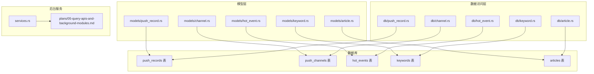
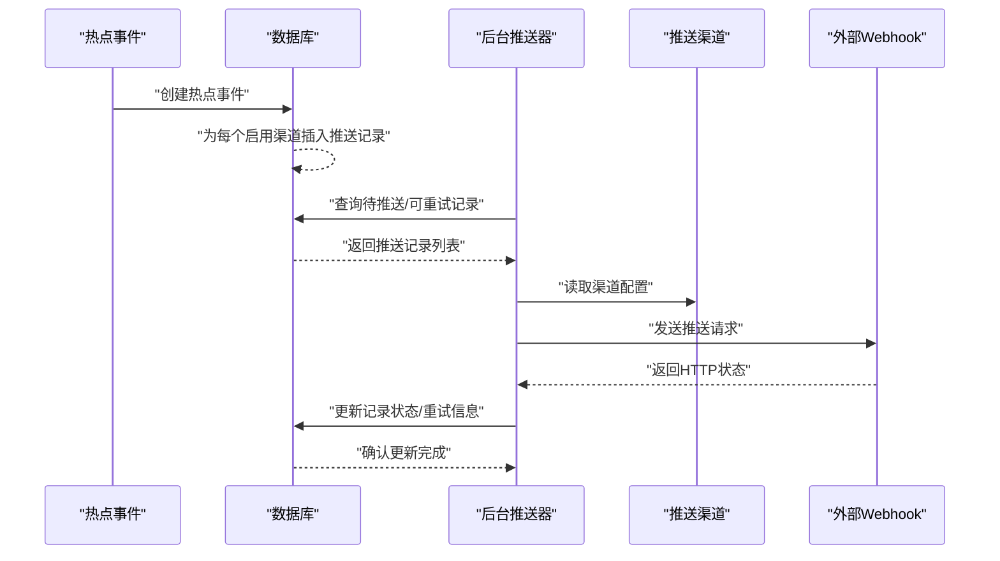
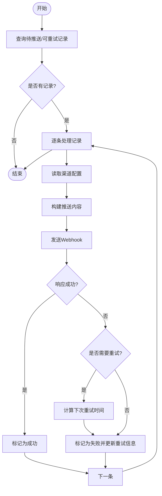
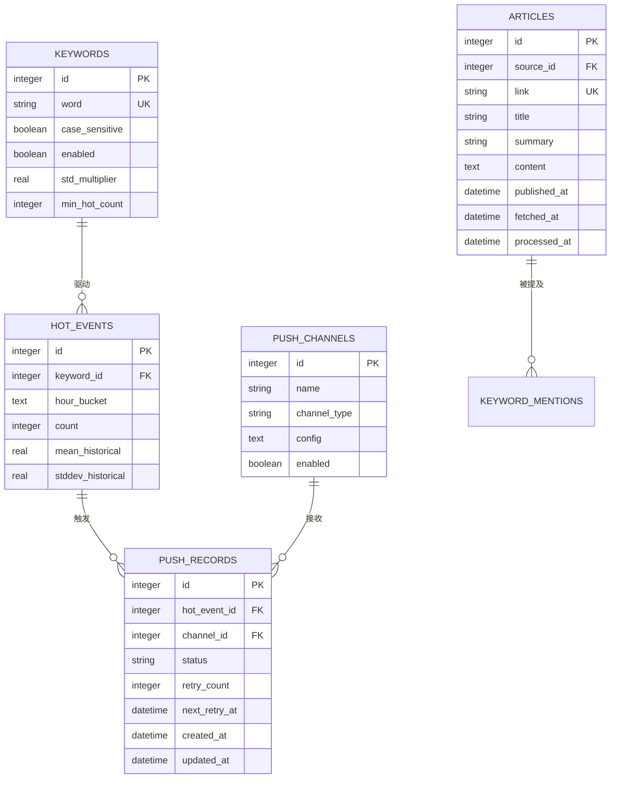
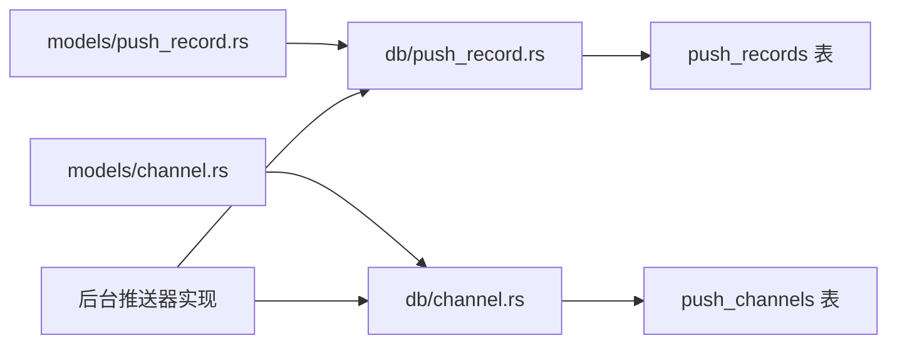

# 推送记录模型

<cite>
**本文档引用的文件**
- [src/models/push_record.rs](file://src/models/push_record.rs)
- [src/db/push_record.rs](file://src/db/push_record.rs)
- [docs/migrations/20260607044921_init.sql](file://docs/migrations/20260607044921_init.sql)
- [src/services.rs](file://src/services.rs)
- [docs/plans/05-query-apis-and-background-modules.md](file://docs/plans/05-query-apis-and-background-modules.md)
- [src/db/channel.rs](file://src/db/channel.rs)
- [src/models/channel.rs](file://src/models/channel.rs)
- [src/db/article.rs](file://src/db/article.rs)
- [src/models/article.rs](file://src/models/article.rs)
- [src/db/hot_event.rs](file://src/db/hot_event.rs)
- [src/models/hot_event.rs](file://src/models/hot_event.rs)
- [src/db/keyword.rs](file://src/db/keyword.rs)
- [src/models/keyword.rs](file://src/models/keyword.rs)
</cite>

## 目录
1. [简介](#简介)
2. [项目结构](#项目结构)
3. [核心组件](#核心组件)
4. [架构概览](#架构概览)
5. [详细组件分析](#详细组件分析)
6. [依赖关系分析](#依赖关系分析)
7. [性能考虑](#性能考虑)
8. [故障排查指南](#故障排查指南)
9. [结论](#结论)
10. [附录](#附录)

## 简介
本文件系统性地文档化了推送记录模型及其相关架构与工作流程。重点涵盖：
- 推送记录实体的结构与字段语义（推送目标、推送内容、推送状态、推送时间等）
- 推送系统的整体架构与工作流（事件检测、渠道管理、后台推送器、重试与追踪）
- 推送记录与用户、文章之间的关联关系（通过热点事件与关键词间接关联）
- 推送策略、失败重试与结果追踪机制
- 推送记录的查询与统计方法
- 推送系统的监控与优化建议

## 项目结构
推送系统围绕 SQLite 数据库中的表结构展开，并通过 Rust 模块提供数据访问层、模型定义与后台服务。

**图表来源**
- [docs/migrations/20260607044921_init.sql:103-118](file://docs/migrations/20260607044921_init.sql#L103-L118)
- [src/models/push_record.rs:5-15](file://src/models/push_record.rs#L5-L15)
- [src/models/channel.rs:4-11](file://src/models/channel.rs#L4-L11)
- [src/db/push_record.rs:6-18](file://src/db/push_record.rs#L6-L18)
- [src/db/channel.rs:5-18](file://src/db/channel.rs#L5-L18)
- [src/services.rs:1-6](file://src/services.rs#L1-L6)
- [docs/plans/05-query-apis-and-background-modules.md:756-909](file://docs/plans/05-query-apis-and-background-modules.md#L756-L909)

**章节来源**
- [docs/migrations/20260607044921_init.sql:103-118](file://docs/migrations/20260607044921_init.sql#L103-L118)
- [src/models/push_record.rs:5-15](file://src/models/push_record.rs#L5-L15)
- [src/db/push_record.rs:6-18](file://src/db/push_record.rs#L6-L18)
- [src/services.rs:1-6](file://src/services.rs#L1-L6)

## 核心组件
- 推送记录模型：定义推送记录的字段与序列化特性，用于数据库读写与 API 响应。
- 推送记录数据库操作：提供插入、查询待推送、查询可重试、更新状态等操作。
- 渠道模型与数据库操作：管理推送渠道（如 Webhook）的增删改查与启用状态。
- 后台推送器：周期性扫描待推送与可重试记录，调用渠道配置进行推送，并处理成功/失败与重试逻辑。
- 相关实体：热点事件与关键词用于生成推送内容；文章作为上游数据源。

**章节来源**
- [src/models/push_record.rs:5-15](file://src/models/push_record.rs#L5-L15)
- [src/db/push_record.rs:6-18](file://src/db/push_record.rs#L6-L18)
- [src/models/channel.rs:4-11](file://src/models/channel.rs#L4-L11)
- [src/db/channel.rs:5-18](file://src/db/channel.rs#L5-L18)
- [docs/plans/05-query-apis-and-background-modules.md:756-909](file://docs/plans/05-query-apis-and-background-modules.md#L756-L909)

## 架构概览
推送系统采用“事件驱动 + 后台轮询”的架构：
- 事件检测：上游模块（解析器/过滤器）产生热点事件，系统为每个事件在所有启用渠道上创建推送记录。
- 后台推送器：定时扫描数据库，取出待推送或可重试的记录，按渠道配置发送通知。
- 结果追踪：根据响应状态更新记录状态、重试次数与下次重试时间，支持乐观锁避免并发冲突。
- 查询统计：提供按状态、按事件维度的查询接口，便于监控与审计。

**图表来源**
- [docs/migrations/20260607044921_init.sql:103-118](file://docs/migrations/20260607044921_init.sql#L103-L118)
- [src/db/push_record.rs:45-88](file://src/db/push_record.rs#L45-L88)
- [docs/plans/05-query-apis-and-background-modules.md:756-909](file://docs/plans/05-query-apis-and-background-modules.md#L756-L909)

## 详细组件分析

### 推送记录实体结构
推送记录用于跟踪一次热点事件向某个渠道的推送过程，包含以下关键字段：
- id：记录唯一标识
- hot_event_id：关联的热点事件标识
- channel_id：关联的推送渠道标识
- status：推送状态（pending、success、failed）
- retry_count：已尝试重试次数
- next_retry_at：下次重试时间（可为空）
- created_at / updated_at：创建与更新时间戳

这些字段共同构成推送生命周期的完整追踪。

**章节来源**
- [src/models/push_record.rs:5-15](file://src/models/push_record.rs#L5-L15)
- [docs/migrations/20260607044921_init.sql:105-115](file://docs/migrations/20260607044921_init.sql#L105-L115)

### 推送记录数据库操作
- 插入单条记录：为指定热点事件与渠道创建一条初始状态为 pending 的记录。
- 批量插入（去重）：为给定热点事件批量创建记录，跳过已存在的组合（基于唯一约束）。
- 查询待推送：按状态筛选 pending 记录，按创建时间排序。
- 查询可重试：筛选 failed 且未超过最大重试次数、且到达下次重试时间的记录。
- 更新状态：常规更新（更新时间戳、状态、重试计数与下次重试时间）。
- 乐观更新：仅当当前状态与期望状态一致时才更新，避免并发覆盖。

**图表来源**
- [src/db/push_record.rs:45-88](file://src/db/push_record.rs#L45-L88)
- [docs/plans/05-query-apis-and-background-modules.md:756-909](file://docs/plans/05-query-apis-and-background-modules.md#L756-L909)

**章节来源**
- [src/db/push_record.rs:6-18](file://src/db/push_record.rs#L6-L18)
- [src/db/push_record.rs:20-43](file://src/db/push_record.rs#L20-L43)
- [src/db/push_record.rs:45-88](file://src/db/push_record.rs#L45-L88)
- [src/db/push_record.rs:90-113](file://src/db/push_record.rs#L90-L113)

### 推送策略、失败重试与结果追踪
- 状态机：pending → success 或 failed。失败后根据重试次数与指数退避策略设置下次重试时间。
- 重试上限：配置中限制最大重试次数，超过则不再自动重试。
- 乐观锁：更新状态时检查当前状态是否匹配预期，避免并发更新导致的状态错乱。
- 结果追踪：每次推送后更新 updated_at、status、retry_count 以及 next_retry_at，便于后续轮询与监控。

**章节来源**
- [docs/plans/05-query-apis-and-background-modules.md:870-894](file://docs/plans/05-query-apis-and-background-modules.md#L870-L894)
- [src/db/push_record.rs:90-113](file://src/db/push_record.rs#L90-L113)

### 推送记录与用户、文章的关联关系
- 直接关联：推送记录直接关联热点事件与推送渠道。
- 间接关联：推送内容由热点事件与关键词生成；文章作为上游数据源参与热点事件的形成。
- 用户关系：当前模型未直接存储用户字段，可通过渠道配置中的鉴权信息或外部系统映射实现用户级订阅。

**图表来源**
- [docs/migrations/20260607044921_init.sql:30-118](file://docs/migrations/20260607044921_init.sql#L30-L118)
- [src/db/push_record.rs:115-125](file://src/db/push_record.rs#L115-L125)

**章节来源**
- [docs/migrations/20260607044921_init.sql:30-118](file://docs/migrations/20260607044921_init.sql#L30-L118)
- [src/db/push_record.rs:115-125](file://src/db/push_record.rs#L115-L125)

### 推送内容生成与渠道配置
- 内容生成：从热点事件中提取关键词与计数，拼装成文本消息内容。
- 渠道配置：从渠道表的 JSON 配置中读取 webhook URL，若缺失则直接标记失败。
- 发送与日志：使用 HTTP 客户端发送请求，记录成功/失败与状态码，便于问题定位。

**章节来源**
- [docs/plans/05-query-apis-and-background-modules.md:756-909](file://docs/plans/05-query-apis-and-background-modules.md#L756-L909)
- [src/db/channel.rs:5-18](file://src/db/channel.rs#L5-L18)
- [src/models/channel.rs:4-11](file://src/models/channel.rs#L4-L11)

## 依赖关系分析
- 模型到数据库：各模型通过 FromRow 实现与 SQL 查询结果的映射。
- 数据库到业务：数据访问层封装 SQL 查询，后台服务通过这些接口进行业务操作。
- 后台服务：通过 services.rs 暴露子模块入口，后台推送器在计划文档中实现具体逻辑。

**图表来源**
- [src/models/push_record.rs:5-15](file://src/models/push_record.rs#L5-L15)
- [src/db/push_record.rs:6-18](file://src/db/push_record.rs#L6-L18)
- [src/models/channel.rs:4-11](file://src/models/channel.rs#L4-L11)
- [src/db/channel.rs:5-18](file://src/db/channel.rs#L5-L18)
- [docs/plans/05-query-apis-and-background-modules.md:756-909](file://docs/plans/05-query-apis-and-background-modules.md#L756-L909)

**章节来源**
- [src/models/push_record.rs:5-15](file://src/models/push_record.rs#L5-L15)
- [src/db/push_record.rs:6-18](file://src/db/push_record.rs#L6-L18)
- [src/models/channel.rs:4-11](file://src/models/channel.rs#L4-L11)
- [src/db/channel.rs:5-18](file://src/db/channel.rs#L5-L18)
- [src/services.rs:1-6](file://src/services.rs#L1-L6)

## 性能考虑
- 索引优化：为 push_records.status 建立索引，加速待推送与可重试查询。
- 批量插入：批量创建推送记录时使用 INSERT OR IGNORE 并跳过重复，减少冲突与回滚。
- 乐观锁：在高并发场景下使用乐观更新，避免不必要的阻塞与死锁。
- 轮询间隔：后台推送器采用固定间隔轮询，可根据负载调整间隔以平衡实时性与资源消耗。
- 日志与监控：结合 tracing 输出关键事件，便于性能瓶颈定位与异常追踪。

**章节来源**
- [docs/migrations/20260607044921_init.sql:117-118](file://docs/migrations/20260607044921_init.sql#L117-L118)
- [src/db/push_record.rs:20-43](file://src/db/push_record.rs#L20-L43)
- [src/db/push_record.rs:90-113](file://src/db/push_record.rs#L90-L113)
- [docs/plans/05-query-apis-and-background-modules.md:896-909](file://docs/plans/05-query-apis-and-background-modules.md#L896-L909)

## 故障排查指南
- 记录状态异常：使用乐观更新接口检查当前状态是否与预期一致，避免并发覆盖。
- 渠道配置缺失：若 webhook URL 为空，推送器会直接标记失败并记录错误日志，需检查渠道配置。
- 重试超限：超过最大重试次数后不再自动重试，需人工介入或调整配置。
- 查询验证：通过 list_pending_records 与 list_retry_due_records 验证待处理与可重试队列是否正常。

**章节来源**
- [src/db/push_record.rs:90-113](file://src/db/push_record.rs#L90-L113)
- [docs/plans/05-query-apis-and-background-modules.md:832-864](file://docs/plans/05-query-apis-and-background-modules.md#L832-L864)
- [src/db/push_record.rs:45-67](file://src/db/push_record.rs#L45-L67)

## 结论
推送记录模型通过简洁而完整的字段设计，配合数据库索引与乐观锁机制，在高并发场景下实现了可靠的推送追踪。后台推送器以轮询方式处理待推送与可重试任务，结合指数退避与最大重试限制，确保系统在失败情况下具备自愈能力。通过与热点事件、关键词与文章的数据关联，推送内容具备明确的业务上下文，便于用户理解与后续扩展。

## 附录

### 推送记录查询与统计示例
- 查询待推送记录：按状态筛选 pending，按创建时间升序排列，便于优先处理。
- 查询可重试记录：筛选 failed 且未超限、到达下次重试时间的记录，按下次重试时间升序排列。
- 按热点事件查询：根据 hot_event_id 查询该事件的所有推送记录，按渠道 ID 排序。
- 统计维度：可按状态分布统计（pending/success/failed）、按渠道统计推送成功率、按小时统计推送吞吐量。

**章节来源**
- [src/db/push_record.rs:45-67](file://src/db/push_record.rs#L45-L67)
- [src/db/push_record.rs:115-125](file://src/db/push_record.rs#L115-L125)