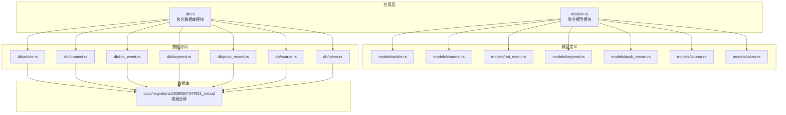
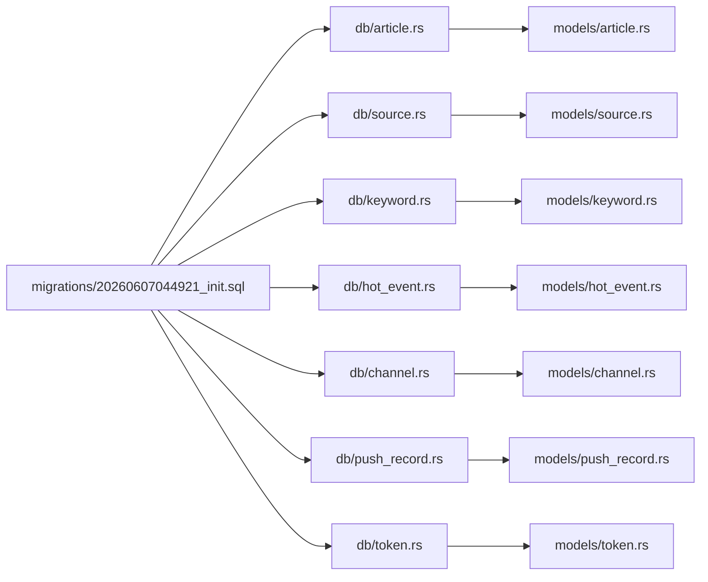
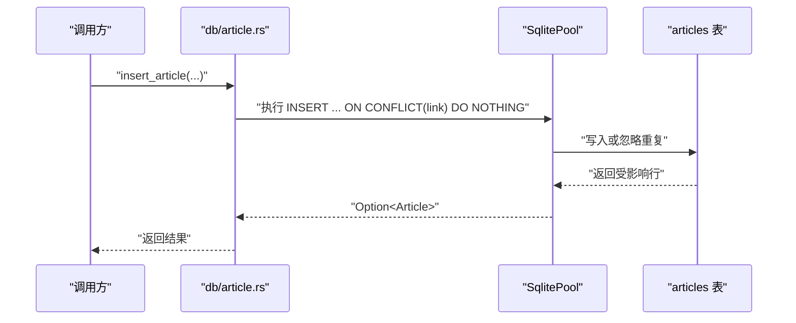
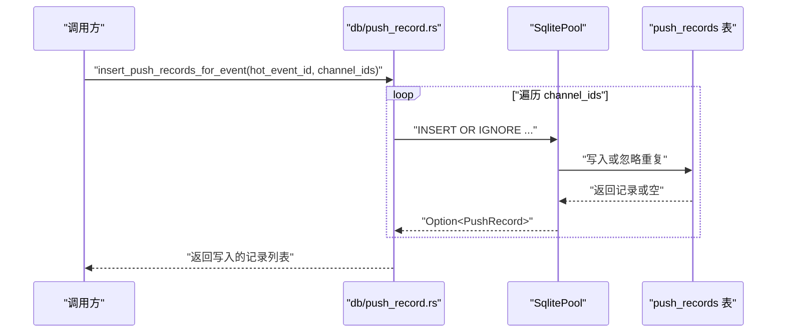

# 数据模型

<cite>
**本文引用的文件**
- [docs/migrations/20260607044921_init.sql](file://docs/migrations/20260607044921_init.sql)
- [src/db.rs](file://src/db.rs)
- [src/models.rs](file://src/models.rs)
- [src/models/article.rs](file://src/models/article.rs)
- [src/models/channel.rs](file://src/models/channel.rs)
- [src/models/hot_event.rs](file://src/models/hot_event.rs)
- [src/models/keyword.rs](file://src/models/keyword.rs)
- [src/models/push_record.rs](file://src/models/push_record.rs)
- [src/models/source.rs](file://src/models/source.rs)
- [src/models/token.rs](file://src/models/token.rs)
- [src/db/article.rs](file://src/db/article.rs)
- [src/db/channel.rs](file://src/db/channel.rs)
- [src/db/hot_event.rs](file://src/db/hot_event.rs)
- [src/db/keyword.rs](file://src/db/keyword.rs)
- [src/db/push_record.rs](file://src/db/push_record.rs)
- [src/db/source.rs](file://src/db/source.rs)
- [src/db/token.rs](file://src/db/token.rs)
</cite>

## 目录
1. [简介](#简介)
2. [项目结构](#项目结构)
3. [核心组件](#核心组件)
4. [架构总览](#架构总览)
5. [详细组件分析](#详细组件分析)
6. [依赖分析](#依赖分析)
7. [性能考虑](#性能考虑)
8. [故障排查指南](#故障排查指南)
9. [结论](#结论)
10. [附录](#附录)

## 简介
本文件系统性梳理 AI-Trend-Tool 的数据模型与实现，覆盖实体关系、字段定义、主外键与索引、约束、数据访问模式、缓存策略、性能考量、数据生命周期与归档、以及迁移与版本管理。目标是帮助开发者与运维人员快速理解并高效维护该数据库方案。

## 项目结构
- 数据库初始化与连接池：通过统一入口初始化 SQLite 连接池，并启用 WAL 模式与外键强制。
- 迁移脚本：集中定义初始数据库结构（含表、索引、约束）。
- 模型层：Rust 结构体映射数据库表，用于序列化/反序列化与查询结果映射。
- 数据访问层（DB 模块）：围绕每个实体提供 CRUD 与查询方法，封装 SQL 与参数绑定。



图表来源
- [src/db.rs:1-26](file://src/db.rs#L1-L26)
- [src/models.rs:1-8](file://src/models.rs#L1-L8)
- [docs/migrations/20260607044921_init.sql:1-118](file://docs/migrations/20260607044921_init.sql#L1-L118)

章节来源
- [src/db.rs:1-26](file://src/db.rs#L1-L26)
- [src/models.rs:1-8](file://src/models.rs#L1-L8)
- [docs/migrations/20260607044921_init.sql:1-118](file://docs/migrations/20260607044921_init.sql#L1-L118)

## 核心组件
- API 令牌表：存储 API 访问令牌及其状态（过期、吊销）。
- 数据源表：采集来源配置（类型、URL、调度间隔等）。
- 文章表：采集到的文章，支持去重（按链接）与处理标记。
- 关键词表：关键词与阈值参数（标准差倍数、最小热点计数等）。
- 关键词命中明细表：文章与关键词的多对多关联。
- 热点事件表：按小时桶统计关键词热度，包含历史均值与标准差。
- 推送渠道表：通知渠道（默认 webhook），配置为 JSON 字符串。
- 推送记录表：热点事件向各渠道的推送任务，带重试控制与乐观锁更新。

章节来源
- [docs/migrations/20260607044921_init.sql:4-118](file://docs/migrations/20260607044921_init.sql#L4-L118)

## 架构总览
下图展示实体间的关系、主外键约束与典型查询路径。

```mermaid
erDiagram
API_TOKENS ||--o{ PUSH_RECORDS : "由创建者拥有"
DATA_SOURCES ||--o{ ARTICLES : "被采集"
ARTICLES ||--o{ KEYWORD_MENTIONS : "被命中"
KEYWORDS ||--o{ KEYWORD_MENTIONS : "被匹配"
KEYWORDS ||--o{ HOT_EVENTS : "驱动统计"
HOT_EVENTS ||--o{ PUSH_RECORDS : "触发推送"
PUSH_CHANNELS ||--o{ PUSH_RECORDS : "接收推送"
API_TOKENS {
integer id PK
text name
text token UK
datetime last_used_at
datetime created_at
datetime expires_at
boolean revoked
}
DATA_SOURCES {
integer id PK
text type
text name
text url
text config
boolean enabled
integer interval_seconds
datetime last_fetched_at
datetime created_at
datetime updated_at
}
ARTICLES {
integer id PK
integer source_id FK
text link UK
text title
text summary
text content
datetime published_at
datetime fetched_at
datetime processed_at
}
KEYWORDS {
integer id PK
text word UK
boolean case_sensitive
boolean enabled
real std_multiplier
integer min_hot_count
datetime created_at
}
KEYWORD_MENTIONS {
integer id PK
integer keyword_id FK
integer article_id FK
datetime matched_at
}
HOT_EVENTS {
integer id PK
integer keyword_id FK
text hour_bucket
integer count
real mean_historical
real stddev_historical
datetime created_at
}
PUSH_CHANNELS {
integer id PK
text name
text channel_type
text config
boolean enabled
}
PUSH_RECORDS {
integer id PK
integer hot_event_id FK
integer channel_id FK
text status
integer retry_count
datetime next_retry_at
datetime created_at
datetime updated_at
UNQ hot_event_id+channel_id
}
```

图表来源
- [docs/migrations/20260607044921_init.sql:4-118](file://docs/migrations/20260607044921_init.sql#L4-L118)

## 详细组件分析

### API 令牌（ApiToken）
- 字段与类型
  - id: 整型，主键，自增
  - name: 文本，非空
  - token: 文本，非空且唯一
  - last_used_at: 时间戳（可空）
  - created_at: 时间戳，默认当前时间
  - expires_at: 时间戳（可空）
  - revoked: 布尔，默认 0（未吊销）
- 约束与索引
  - 唯一约束：token
  - 查询优化：列表时按 created_at 降序；按 token 查询时使用唯一索引
- 业务规则
  - 列表默认过滤已吊销（revoked=0）
  - 使用后更新 last_used_at
- 数据访问模式
  - 创建、列表、按 id/值查询、更新最后使用时间、吊销、删除
- 示例数据
  - name="console", token="...", expires_at=null, revoked=false

章节来源
- [docs/migrations/20260607044921_init.sql:4-12](file://docs/migrations/20260607044921_init.sql#L4-L12)
- [src/models/token.rs:5-14](file://src/models/token.rs#L5-L14)
- [src/db/token.rs:6-74](file://src/db/token.rs#L6-L74)

### 数据源（DataSource）
- 字段与类型
  - id: 整型，主键，自增
  - type: 文本，非空（rss/atom/json_feed 等）
  - name/url: 文本，非空
  - config: 文本，默认 '{}'（JSON 扩展配置）
  - enabled: 布尔，默认 1
  - interval_seconds: 整型，默认 300
  - last_fetched_at: 时间戳（可空）
  - created_at/updated_at: 时间戳，默认当前时间
- 约束与索引
  - 无显式索引（按需查询）
- 业务规则
  - 更新时自动刷新 updated_at
  - 可设置拉取间隔与开关
- 数据访问模式
  - 创建、列表、按 id 查询、部分更新、删除、更新最后抓取时间
- 示例数据
  - type="rss", name="开源资讯", url="https://feed.example.com/rss", interval_seconds=300

章节来源
- [docs/migrations/20260607044921_init.sql:17-28](file://docs/migrations/20260607044921_init.sql#L17-L28)
- [src/models/source.rs:5-18](file://src/models/source.rs#L5-L18)
- [src/db/source.rs:5-112](file://src/db/source.rs#L5-L112)

### 文章（Article）
- 字段与类型
  - id: 整型，主键，自增
  - source_id: 整型，外键引用 data_sources(id)，级联删除
  - link: 文本，非空且唯一（去重）
  - title/summary/content: 文本，默认空字符串
  - published_at/fetched_at/processed_at: 时间戳（可空/默认当前时间）
- 约束与索引
  - 唯一约束：link
  - 复合索引：processed_at、source_id、fetched_at
- 业务规则
  - 插入时按 link 去重（忽略重复）
  - 处理完成后标记 processed_at
- 数据访问模式
  - 插入（去重）、分页列表（支持 source_id 与 processed 过滤）、按 id 查询、获取未处理文章、计数、标记处理完成
- 示例数据
  - source_id=1, link="https://example.com/post/123", title="..."

章节来源
- [docs/migrations/20260607044921_init.sql:33-43](file://docs/migrations/20260607044921_init.sql#L33-L43)
- [src/models/article.rs:5-16](file://src/models/article.rs#L5-L16)
- [src/db/article.rs:6-135](file://src/db/article.rs#L6-L135)

### 关键词（Keyword）
- 字段与类型
  - id: 整型，主键，自增
  - word: 文本，非空且唯一
  - case_sensitive: 布尔，默认 0
  - enabled: 布尔，默认 1
  - std_multiplier: 实数，默认 2.0
  - min_hot_count: 整型，默认 3
  - created_at: 时间戳，默认当前时间
- 约束与索引
  - 唯一约束：word
- 业务规则
  - 启用/禁用控制
  - 参数影响热点检测阈值
- 数据访问模式
  - 创建、列表、列出启用项、按 id/word 查询、部分更新、删除
- 示例数据
  - word="AI", case_sensitive=0, std_multiplier=2.0, min_hot_count=3

章节来源
- [docs/migrations/20260607044921_init.sql:52-60](file://docs/migrations/20260607044921_init.sql#L52-L60)
- [src/models/keyword.rs:5-14](file://src/models/keyword.rs#L5-L14)
- [src/db/keyword.rs:5-114](file://src/db/keyword.rs#L5-L114)

### 关键词命中明细（KeywordMentions）
- 字段与类型
  - id: 整型，主键，自增
  - keyword_id: 整型，外键引用 keywords(id)，级联删除
  - article_id: 整型，外键引用 articles(id)，级联删除
  - matched_at: 时间戳，默认当前时间
- 约束与索引
  - 复合索引：keyword_id、article_id
- 业务规则
  - 多对多关联，记录命中时间
- 数据访问模式
  - 无直接 CRUD 方法（由业务流程写入）
- 示例数据
  - keyword_id=1, article_id=100, matched_at=...

章节来源
- [docs/migrations/20260607044921_init.sql:65-70](file://docs/migrations/20260607044921_init.sql#L65-L70)
- [src/db/keyword.rs:5-114](file://src/db/keyword.rs#L5-L114)

### 热点事件（HotEvent）
- 字段与类型
  - id: 整型，主键，自增
  - keyword_id: 整型，外键引用 keywords(id)，级联删除
  - hour_bucket: 文本，格式 YYYYMMDDHH
  - count: 整型，默认 0
  - mean_historical/stddev_historical: 实数，默认 0.0
  - created_at: 时间戳，默认当前时间
- 约束与索引
  - 复合索引：keyword_id、hour_bucket
- 业务规则
  - 按小时聚合统计，结合历史均值/方差判断异常
- 数据访问模式
  - 插入、按关键词/最近列表查询、按 id 查询、按关键词获取小时汇总
- 示例数据
  - keyword_id=1, hour_bucket="2026060704", count=5, mean_historical=2.1, stddev_historical=0.8

章节来源
- [docs/migrations/20260607044921_init.sql:78-86](file://docs/migrations/20260607044921_init.sql#L78-L86)
- [src/models/hot_event.rs:5-14](file://src/models/hot_event.rs#L5-L14)
- [src/db/hot_event.rs:5-80](file://src/db/hot_event.rs#L5-L80)

### 推送渠道（PushChannel）
- 字段与类型
  - id: 整型，主键，自增
  - name: 文本，非空
  - channel_type: 文本，默认 "webhook"
  - config: 文本，默认 '{}'（JSON 配置，如 url）
  - enabled: 布尔，默认 1
- 约束与索引
  - 无显式索引
- 业务规则
  - 启用/禁用控制
- 数据访问模式
  - 创建、列表、列出启用项、按 id 查询、部分更新、删除
- 示例数据
  - name="Slack 通知", channel_type="webhook", config="{\"url\":\"https://hooks.slack.com/...\"}"

章节来源
- [docs/migrations/20260607044921_init.sql:94-100](file://docs/migrations/20260607044921_init.sql#L94-L100)
- [src/models/channel.rs:4-11](file://src/models/channel.rs#L4-L11)
- [src/db/channel.rs:5-93](file://src/db/channel.rs#L5-L93)

### 推送记录（PushRecord）
- 字段与类型
  - id: 整型，主键，自增
  - hot_event_id: 整型，外键引用 hot_events(id)，级联删除
  - channel_id: 整型，外键引用 push_channels(id)，级联删除
  - status: 文本，默认 "pending"（枚举：pending/success/failed）
  - retry_count: 整型，默认 0
  - next_retry_at: 时间戳（可空）
  - created_at/updated_at: 时间戳，默认当前时间
  - 联合唯一：(hot_event_id, channel_id)
- 约束与索引
  - 复合索引：status
- 业务规则
  - 幂等插入（UNIQUE 约束）
  - 失败重试上限与下次重试时间控制
  - 支持乐观锁更新（基于当前状态）
- 数据访问模式
  - 插入、批量插入（跳过已存在）、列出待处理/可重试、更新状态与重试信息、按热点事件查询
- 示例数据
  - hot_event_id=1, channel_id=2, status="pending", retry_count=0, next_retry_at=null

章节来源
- [docs/migrations/20260607044921_init.sql:105-115](file://docs/migrations/20260607044921_init.sql#L105-L115)
- [src/models/push_record.rs:5-15](file://src/models/push_record.rs#L5-L15)
- [src/db/push_record.rs:6-125](file://src/db/push_record.rs#L6-L125)

## 依赖分析
- 组件耦合
  - 文章与数据源：一对多，文章删除受外键约束影响
  - 关键词与文章：多对多，通过命中明细表关联
  - 热点事件与关键词：一对多，驱动推送
  - 推送记录与热点事件/渠道：一对多，联合唯一保证幂等
- 外部依赖
  - SQLite 连接池（WAL 模式、外键强制）
  - Rust 类型映射（FromRow、Serialize、Deserialize）



图表来源
- [src/db/token.rs:1-107](file://src/db/token.rs#L1-L107)
- [src/db/source.rs:1-113](file://src/db/source.rs#L1-L113)
- [src/db/article.rs:1-136](file://src/db/article.rs#L1-L136)
- [src/db/keyword.rs:1-115](file://src/db/keyword.rs#L1-L115)
- [src/db/hot_event.rs:1-81](file://src/db/hot_event.rs#L1-L81)
- [src/db/channel.rs:1-94](file://src/db/channel.rs#L1-L94)
- [src/db/push_record.rs:1-126](file://src/db/push_record.rs#L1-L126)
- [docs/migrations/20260607044921_init.sql:1-118](file://docs/migrations/20260607044921_init.sql#L1-L118)

章节来源
- [src/db.rs:1-26](file://src/db.rs#L1-L26)
- [src/models.rs:1-8](file://src/models.rs#L1-L8)

## 性能考虑
- 连接池与事务
  - 初始化连接池并启用 WAL 模式，提升并发读写吞吐
  - 外键强制确保参照完整性，避免脏数据
- 索引策略
  - 文章：processed_at、source_id、fetched_at 三索引，支撑高频查询与排序
  - 关键词命中：keyword_id、article_id 两索引，支撑多对多检索
  - 热点事件：keyword_id、hour_bucket 两索引，支撑按关键词与时序查询
  - 推送记录：status 单列索引，支撑待处理/可重试筛选
- 查询优化
  - 动态拼接 WHERE 条件，避免不必要的过滤
  - 分页限制（最大每页 100），防止大结果集
- 写入去重
  - 文章按 link 去重，避免重复写入
- 重试与幂等
  - 推送记录联合唯一约束，保证幂等插入
  - 乐观锁更新，减少并发冲突

章节来源
- [src/db.rs:11-25](file://src/db.rs#L11-L25)
- [docs/migrations/20260607044921_init.sql:45-47](file://docs/migrations/20260607044921_init.sql#L45-L47)
- [docs/migrations/20260607044921_init.sql:72-73](file://docs/migrations/20260607044921_init.sql#L72-L73)
- [docs/migrations/20260607044921_init.sql:88-89](file://docs/migrations/20260607044921_init.sql#L88-L89)
- [docs/migrations/20260607044921_init.sql:117](file://docs/migrations/20260607044921_init.sql#L117)
- [src/db/article.rs:31-75](file://src/db/article.rs#L31-L75)
- [src/db/push_record.rs:20-43](file://src/db/push_record.rs#L20-L43)

## 故障排查指南
- 外键约束错误
  - 删除/更新被引用记录时触发约束，检查关联实体是否已清理
- 唯一约束冲突
  - 文章 link 重复或推送记录 (hot_event_id, channel_id) 重复，确认幂等逻辑
- 查询性能问题
  - 确认是否命中预期索引；必要时调整过滤条件或分页参数
- 重试机制异常
  - 检查 status、retry_count、next_retry_at 是否符合预期；乐观锁更新失败时重试

章节来源
- [docs/migrations/20260607044921_init.sql:35](file://docs/migrations/20260607044921_init.sql#L35)
- [docs/migrations/20260607044921_init.sql:114](file://docs/migrations/20260607044921_init.sql#L114)
- [src/db/push_record.rs:91-113](file://src/db/push_record.rs#L91-L113)

## 结论
本数据模型以 SQLite 为核心，采用 WAL 模式与外键强制保障一致性与并发性能。通过合理的索引与查询策略，满足热点检测与推送场景的高吞吐需求。建议在生产环境中配合定期归档与监控，确保长期稳定运行。

## 附录

### 数据访问序列图（插入文章并去重）


图表来源
- [src/db/article.rs:6-29](file://src/db/article.rs#L6-L29)
- [docs/migrations/20260607044921_init.sql:33-43](file://docs/migrations/20260607044921_init.sql#L33-L43)

### 数据访问序列图（批量插入推送记录）


图表来源
- [src/db/push_record.rs:20-43](file://src/db/push_record.rs#L20-L43)
- [docs/migrations/20260607044921_init.sql:105-115](file://docs/migrations/20260607044921_init.sql#L105-L115)

### 数据生命周期与保留策略
- 文章与关键词命中明细：按业务需要定期归档至冷存储，保留最近 N 天用于热点计算
- 热点事件：仅保留最近 7 天小时粒度统计，用于异常检测
- 推送记录：成功后可短期保留日志，失败重试超过阈值后归档
- API 令牌：吊销即失效，建议定期审计与轮换

[本节为通用实践建议，不直接对应具体文件]

### 数据迁移与版本管理
- 初始迁移：集中于单一 SQL 文件，定义完整数据库结构
- 版本演进：后续新增/变更表结构时，遵循“新增迁移文件 + 升级脚本”的方式，保持向后兼容
- 回滚策略：针对破坏性变更准备回滚脚本，测试后再上线

章节来源
- [docs/migrations/20260607044921_init.sql:1-118](file://docs/migrations/20260607044921_init.sql#L1-L118)