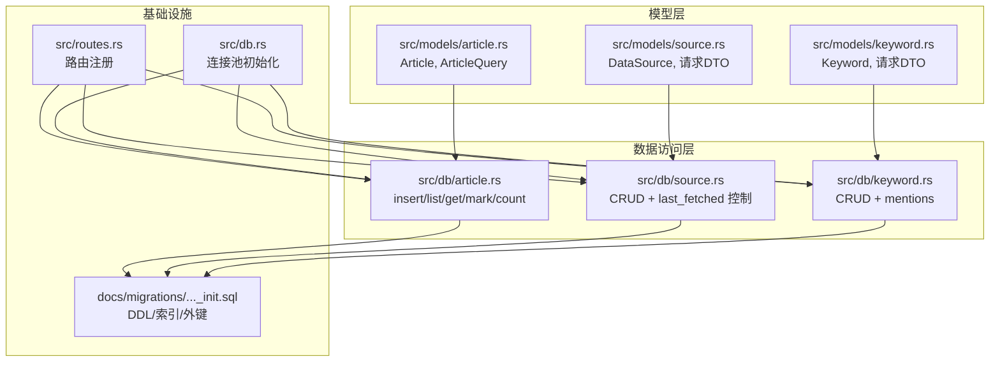
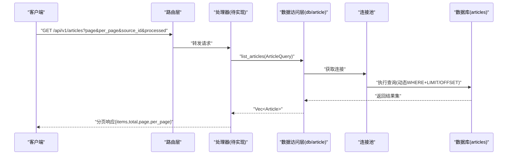
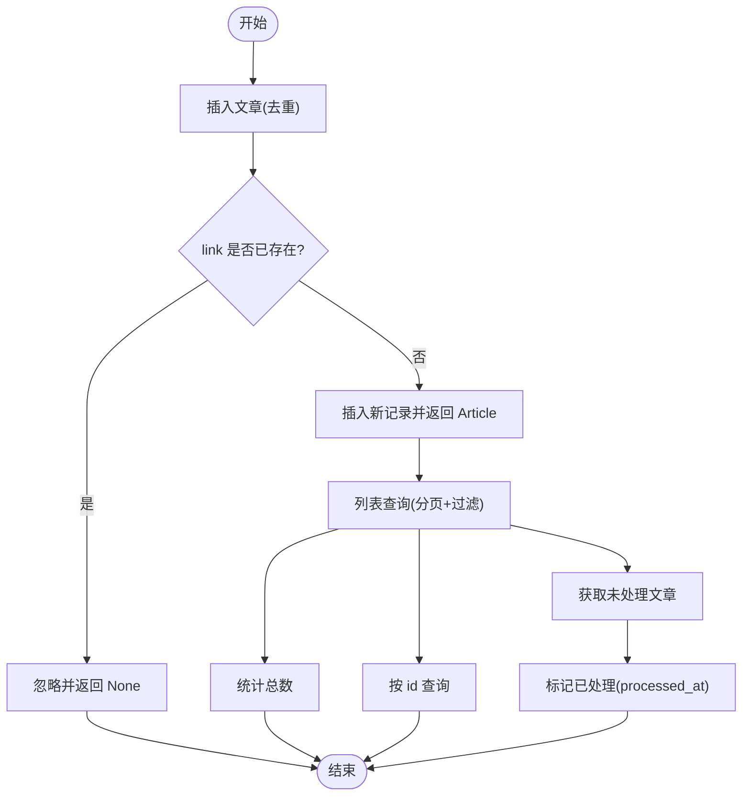
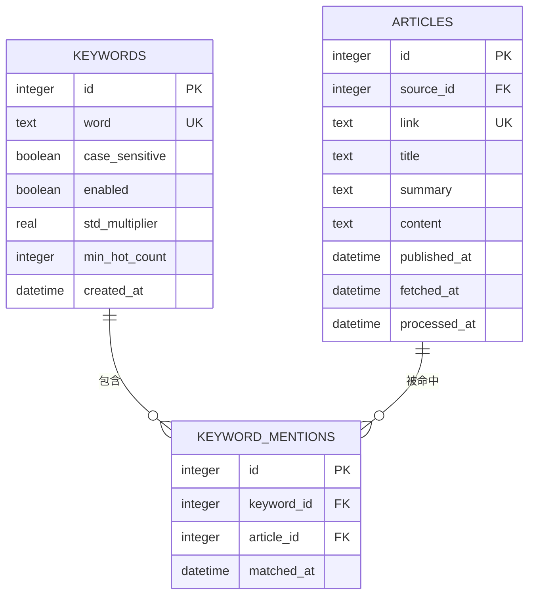
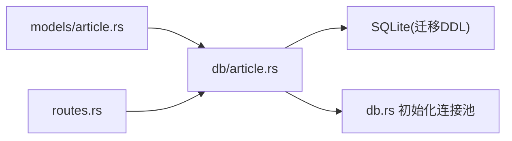

# 文章模型

<cite>
**本文档引用的文件**
- [src/models/article.rs](file://src/models/article.rs)
- [src/db/article.rs](file://src/db/article.rs)
- [docs/migrations/20260607044921_init.sql](file://docs/migrations/20260607044921_init.sql)
- [openspec/specs/database-schema/spec.md](file://openspec/specs/database-schema/spec.md)
- [docs/plans/05-query-apis-and-background-modules.md](file://docs/plans/05-query-apis-and-background-modules.md)
- [src/models/source.rs](file://src/models/source.rs)
- [src/db/source.rs](file://src/db/source.rs)
- [src/models/keyword.rs](file://src/models/keyword.rs)
- [src/db/keyword.rs](file://src/db/keyword.rs)
- [src/db.rs](file://src/db.rs)
- [src/routes.rs](file://src/routes.rs)
</cite>

## 目录
1. [简介](#简介)
2. [项目结构](#项目结构)
3. [核心组件](#核心组件)
4. [架构总览](#架构总览)
5. [详细组件分析](#详细组件分析)
6. [依赖关系分析](#依赖关系分析)
7. [性能考虑](#性能考虑)
8. [故障排除指南](#故障排除指南)
9. [结论](#结论)

## 简介
本文件系统性地文档化“文章模型”，涵盖其字段定义、数据类型、约束条件、设计理念、与频道/关键词的关联关系、验证规则、业务逻辑、操作接口以及在系统中的作用与交互方式。目标是帮助开发者与产品人员快速理解文章实体在数据层、服务层与接口层的完整生命周期。

## 项目结构
文章模型位于 Rust 后端代码中，采用清晰的分层组织：
- 模型层：定义数据库实体与请求/响应 DTO
- 数据访问层：封装 SQL 查询、插入、计数与更新
- 迁移与规范：数据库表结构与约束定义
- 路由与计划：查询 API 的设计与端点规划

图表来源
- [src/models/article.rs:1-25](file://src/models/article.rs#L1-L25)
- [src/db/article.rs:1-136](file://src/db/article.rs#L1-L136)
- [docs/migrations/20260607044921_init.sql:1-118](file://docs/migrations/20260607044921_init.sql#L1-L118)
- [src/routes.rs:1-48](file://src/routes.rs#L1-L48)
- [src/db.rs:1-26](file://src/db.rs#L1-L26)

章节来源
- [src/models/article.rs:1-25](file://src/models/article.rs#L1-L25)
- [src/db/article.rs:1-136](file://src/db/article.rs#L1-L136)
- [docs/migrations/20260607044921_init.sql:1-118](file://docs/migrations/20260607044921_init.sql#L1-L118)
- [src/routes.rs:1-48](file://src/routes.rs#L1-L48)
- [src/db.rs:1-26](file://src/db.rs#L1-L26)

## 核心组件
- 文章实体（Article）：承载单条抓取到的文章数据，包含去重键、标题、摘要、正文、发布时间、抓取时间、处理状态等。
- 文章查询参数（ArticleQuery）：支持分页、按来源过滤、按处理状态过滤。
- 文章数据访问函数：插入（带去重）、列表查询（含过滤与分页）、按 ID 获取、获取未处理文章、标记为已处理、统计数量。

章节来源
- [src/models/article.rs:5-25](file://src/models/article.rs#L5-L25)
- [src/db/article.rs:6-136](file://src/db/article.rs#L6-L136)

## 架构总览
文章模型在系统中的职责与交互如下：
- 数据模型：Article 描述数据库表结构；ArticleQuery 用于查询端点的参数解析。
- 数据访问：db/article 提供 CRUD 与统计能力，遵循去重策略与过滤规则。
- 外键关系：文章通过 source_id 关联数据源；关键词命中通过 keyword_mentions 关联文章与关键词。
- 查询 API：计划文档定义了文章列表查询端点与参数规范，当前路由文件预留了扩展位置。
- 连接池：统一初始化 SQLite 连接池并启用 WAL 与外键校验。

图表来源
- [docs/plans/05-query-apis-and-background-modules.md:18-100](file://docs/plans/05-query-apis-and-background-modules.md#L18-L100)
- [src/db/article.rs:31-75](file://src/db/article.rs#L31-L75)
- [src/db.rs:11-25](file://src/db.rs#L11-L25)

## 详细组件分析

### 文章实体与字段定义
- 字段与类型
  - id: 整型主键
  - source_id: 整型，外键引用数据源
  - link: 文本，唯一键，用于去重
  - title: 文本，默认空字符串
  - summary: 文本，默认空字符串
  - content: 文本，默认空字符串
  - published_at: 时间戳（可空）
  - fetched_at: 时间戳，默认当前时间
  - processed_at: 时间戳（可空，NULL 表示未处理）

- 约束与索引
  - 唯一键：link（数据库级去重）
  - 外键：source_id 引用 data_sources(id)，删除时级联删除文章
  - 索引：processed_at、source_id、fetched_at

- 设计理念
  - link 作为去重键，确保同链接不会重复入库
  - fetched_at 记录抓取时间，processed_at 标识是否完成后续处理
  - 可空的 published_at 支持来源未提供发布时间的情况
  - 默认空字符串的文本字段便于显示与检索

章节来源
- [docs/migrations/20260607044921_init.sql:33-47](file://docs/migrations/20260607044921_init.sql#L33-L47)
- [openspec/specs/database-schema/spec.md:67-87](file://openspec/specs/database-schema/spec.md#L67-L87)

### 文章查询参数与过滤
- 参数
  - page: 页码，默认 1，最小 1
  - per_page: 每页条数，默认 20，最大 100
  - source_id: 按来源过滤
  - processed: true 表示已处理（processed_at 非空），false 表示未处理（processed_at 为空）

- 实现要点
  - 动态构建 WHERE 条件，支持 source_id 与 processed 组合
  - 分页使用 LIMIT/OFFSET，排序按 fetched_at 降序
  - 统计总数与列表查询共享过滤条件

章节来源
- [src/models/article.rs:18-25](file://src/models/article.rs#L18-L25)
- [src/db/article.rs:31-95](file://src/db/article.rs#L31-L95)
- [docs/plans/05-query-apis-and-background-modules.md:20-40](file://docs/plans/05-query-apis-and-background-modules.md#L20-L40)

### 数据访问函数与业务逻辑
- 插入（去重）
  - 语义：若 link 不存在则插入，否则忽略
  - 返回：Some(Article) 表示新插入，None 表示重复被去重
  - 适用场景：定时抓取器批量入库

- 列表查询
  - 支持分页与过滤（来源、处理状态）
  - 排序：fetched_at 降序
  - 返回：文章列表与总数

- 单条查询
  - 按 id 查询，返回可选项

- 未处理文章
  - 查询 processed_at 为空的记录，按 fetched_at 升序，用于处理队列

- 标记已处理
  - 将 processed_at 更新为当前时间

- 统计
  - 根据过滤条件统计总数

图表来源
- [src/db/article.rs:6-136](file://src/db/article.rs#L6-L136)

章节来源
- [src/db/article.rs:6-136](file://src/db/article.rs#L6-L136)

### 与数据源的关系
- 外键约束：articles.source_id 引用 data_sources.id，并设置删除级联
- 用途：每篇文章属于一个数据源，删除数据源会自动清理对应文章
- 控制：提供 last_fetched_at 字段用于抓取调度控制

章节来源
- [docs/migrations/20260607044921_init.sql:35](file://docs/migrations/20260607044921_init.sql#L35)
- [src/models/source.rs:5-18](file://src/models/source.rs#L5-L18)
- [src/db/source.rs:103-125](file://src/db/source.rs#L103-L125)

### 与关键词的关联关系
- 关联表：keyword_mentions 记录关键词与文章的匹配事件
- 字段：keyword_id、article_id、matched_at
- 约束：两个外键均设置删除级联
- 用途：热点检测与关键词追踪的基础

图表来源
- [docs/migrations/20260607044921_init.sql:65-73](file://docs/migrations/20260607044921_init.sql#L65-L73)

章节来源
- [docs/migrations/20260607044921_init.sql:65-73](file://docs/migrations/20260607044921_init.sql#L65-L73)

### 验证规则与业务逻辑
- 去重规则
  - link 唯一，重复插入将被忽略（返回 None）
  - 适合抓取器幂等入库

- 处理状态
  - 新入库文章 processed_at 为空
  - 处理完成后调用标记接口更新为当前时间

- 查询过滤
  - processed=true：仅返回 processed_at 非空
  - processed=false：仅返回 processed_at 为空
  - source_id：按来源过滤

- 分页与范围
  - page 最小为 1
  - per_page 最大为 100
  - offset = (page - 1) * per_page

章节来源
- [src/db/article.rs:6-29](file://src/db/article.rs#L6-L29)
- [src/db/article.rs:31-75](file://src/db/article.rs#L31-L75)
- [docs/plans/05-query-apis-and-background-modules.md:20-40](file://docs/plans/05-query-apis-and-background-modules.md#L20-L40)

### 操作接口与使用示例
- 创建文章（去重）
  - 入口：insert_article
  - 输入：source_id、link、title、summary、content、published_at
  - 输出：Option<Article>，None 表示重复
  - 示例路径：[src/db/article.rs:7-29](file://src/db/article.rs#L7-L29)

- 查询文章列表（分页+过滤）
  - 端点：GET /api/v1/articles（计划中）
  - 参数：page、per_page、source_id、processed
  - 示例路径：[docs/plans/05-query-apis-and-background-modules.md:59-99](file://docs/plans/05-query-apis-and-background-modules.md#L59-L99)

- 获取单篇文章
  - 入口：get_article_by_id
  - 示例路径：[src/db/article.rs:97-105](file://src/db/article.rs#L97-L105)

- 获取未处理文章
  - 入口：get_unprocessed_articles
  - 示例路径：[src/db/article.rs:107-117](file://src/db/article.rs#L107-L117)

- 标记已处理
  - 入口：mark_processed
  - 示例路径：[src/db/article.rs:119-125](file://src/db/article.rs#L119-L125)

- 统计文章数量
  - 入口：count_articles
  - 示例路径：[src/db/article.rs:127-135](file://src/db/article.rs#L127-L135)

章节来源
- [src/db/article.rs:6-136](file://src/db/article.rs#L6-L136)
- [docs/plans/05-query-apis-and-background-modules.md:18-100](file://docs/plans/05-query-apis-and-background-modules.md#L18-L100)

## 依赖关系分析
- 模块耦合
  - models 与 db 层通过结构体与函数边界清晰分离
  - db 层依赖 sqlx 进行数据库操作
  - 路由层通过 AppState 注入连接池与配置

- 外部依赖
  - sqlx：SQL 查询、事务、连接池
  - serde：序列化/反序列化
  - chrono：时间类型

图表来源
- [src/models/article.rs:1-25](file://src/models/article.rs#L1-L25)
- [src/db/article.rs:1-136](file://src/db/article.rs#L1-L136)
- [src/db.rs:11-25](file://src/db.rs#L11-L25)
- [src/routes.rs:14-37](file://src/routes.rs#L14-L37)

章节来源
- [src/models/article.rs:1-25](file://src/models/article.rs#L1-L25)
- [src/db/article.rs:1-136](file://src/db/article.rs#L1-L136)
- [src/db.rs:11-25](file://src/db.rs#L11-L25)
- [src/routes.rs:14-37](file://src/routes.rs#L14-L37)

## 性能考虑
- 索引优化
  - processed_at：支持按处理状态筛选
  - source_id：支持按来源筛选
  - fetched_at：支持按抓取时间排序与分页
- 分页限制
  - per_page 最大 100，避免超大数据量扫描
- 去重策略
  - 数据库唯一键保证 link 唯一，避免应用层重复判断
- 连接池
  - 初始化时启用 WAL 与外键校验，提升并发与一致性

章节来源
- [docs/migrations/20260607044921_init.sql:45-47](file://docs/migrations/20260607044921_init.sql#L45-L47)
- [src/db.rs:18-22](file://src/db.rs#L18-L22)
- [src/db/article.rs:35-36](file://src/db/article.rs#L35-L36)

## 故障排除指南
- 插入失败（UNIQUE 冲突）
  - 现象：重复 link 导致唯一约束冲突
  - 处理：检查上游抓取是否正确去重，或改用不同 link
  - 参考：[src/db/article.rs:16-29](file://src/db/article.rs#L16-L29)

- 查询无结果
  - 检查过滤参数：source_id、processed 是否与数据匹配
  - 检查分页：page 与 per_page 设置是否合理
  - 参考：[src/db/article.rs:31-75](file://src/db/article.rs#L31-L75)

- 未处理文章为空
  - 确认处理流程是否调用标记接口
  - 参考：[src/db/article.rs:107-125](file://src/db/article.rs#L107-L125)

- 外键约束错误
  - 删除数据源前确认是否仍有文章引用
  - 参考：[docs/migrations/20260607044921_init.sql:35](file://docs/migrations/20260607044921_init.sql#L35)

章节来源
- [src/db/article.rs:6-136](file://src/db/article.rs#L6-L136)
- [docs/migrations/20260607044921_init.sql:35](file://docs/migrations/20260607044921_init.sql#L35)

## 结论
文章模型以 link 为核心去重键，结合 processed_at 状态位与多维索引，提供了高效稳定的抓取与处理基础。通过清晰的分层设计与严格的约束定义，系统能够在高并发场景下保持一致性与可维护性。未来可基于现有接口扩展文章详情、全文检索与热点聚合等功能。