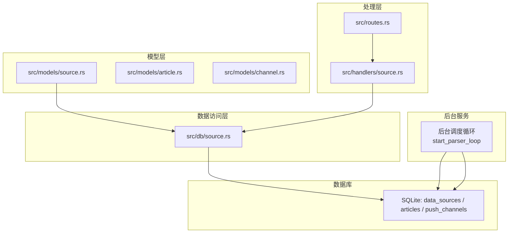
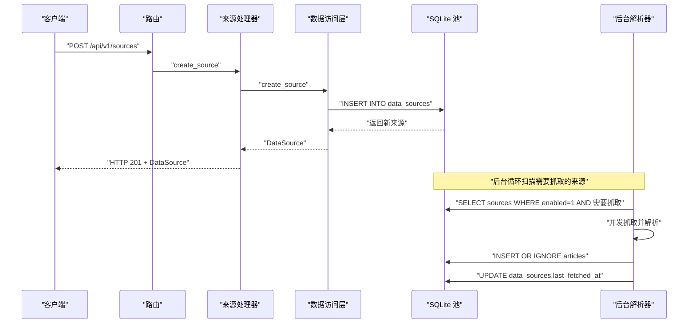
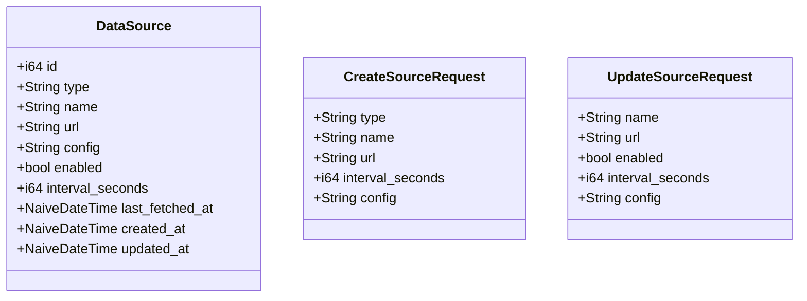
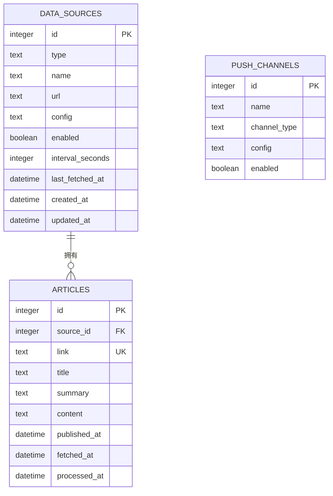
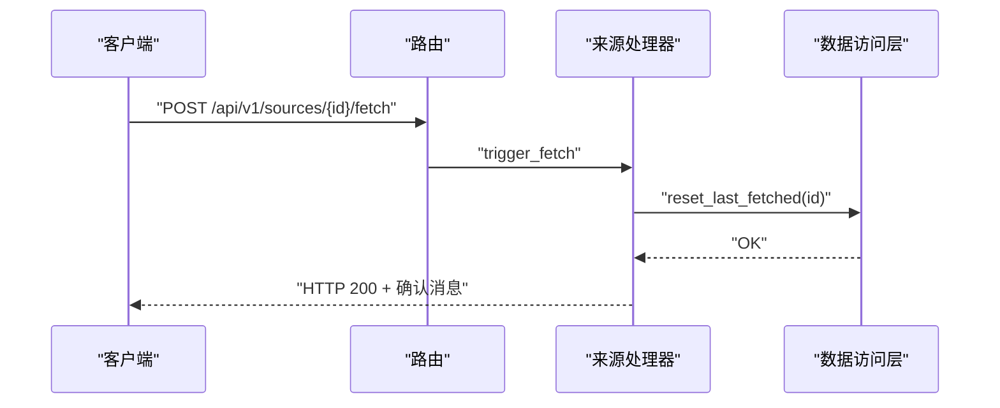
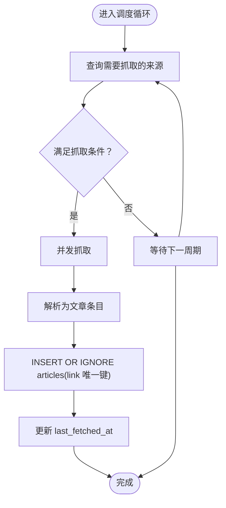
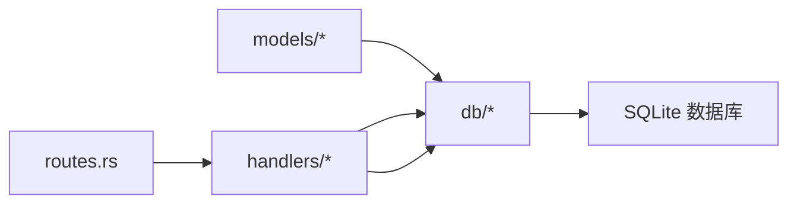

# 来源模型

<cite>
**本文引用的文件**
- [src/models/source.rs](file://src/models/source.rs)
- [src/db/source.rs](file://src/db/source.rs)
- [docs/migrations/20260607044921_init.sql](file://docs/migrations/20260607044921_init.sql)
- [src/handlers/source.rs](file://src/handlers/source.rs)
- [src/routes.rs](file://src/routes.rs)
- [src/models/article.rs](file://src/models/article.rs)
- [src/models/channel.rs](file://src/models/channel.rs)
- [docs/plans/05-query-apis-and-background-modules.md](file://docs/plans/05-query-apis-and-background-modules.md)
- [openspec/changes/implement-crud-apis/specs/source-crud-api/spec.md](file://openspec/changes/implement-crud-apis/specs/source-crud-api/spec.md)
</cite>

## 目录
1. [简介](#简介)
2. [项目结构](#项目结构)
3. [核心组件](#核心组件)
4. [架构总览](#架构总览)
5. [详细组件分析](#详细组件分析)
6. [依赖分析](#依赖分析)
7. [性能考量](#性能考量)
8. [故障排查指南](#故障排查指南)
9. [结论](#结论)
10. [附录](#附录)

## 简介
本文件系统性地阐述“来源模型”的设计与实现，覆盖以下方面：
- 来源实体的数据结构与字段语义（来源名称、URL、类型、认证信息、配置、启用状态、抓取周期、最近抓取时间等）
- 来源的管理与配置流程（创建、查询、更新、删除、手动触发抓取）
- 来源与文章、推送渠道之间的关联关系
- 来源的爬取策略与数据处理规则（基于后台调度循环的定时抓取、并发控制、去重插入）
- 安全性与可靠性考虑（认证中间件、幂等与去重、错误日志与重试策略建议）

## 项目结构
围绕来源模型的关键文件组织如下：
- 模型层：定义来源、文章、推送渠道的结构体与请求载荷
- 数据访问层：封装来源的增删改查与状态更新
- 处理层：提供来源的 HTTP API 路由与处理器
- 迁移脚本：定义数据库表结构及索引
- 后台服务：解析器的后台调度循环与抓取策略
- 规范与计划：CRUD API 的需求与后台模块的实现规划

**图表来源**
- [src/models/source.rs:1-39](file://src/models/source.rs#L1-L39)
- [src/db/source.rs:1-126](file://src/db/source.rs#L1-L126)
- [src/handlers/source.rs:1-71](file://src/handlers/source.rs#L1-L71)
- [src/routes.rs:14-50](file://src/routes.rs#L14-L50)
- [docs/migrations/20260607044921_init.sql:17-28](file://docs/migrations/20260607044921_init.sql#L17-L28)
- [docs/plans/05-query-apis-and-background-modules.md:429-502](file://docs/plans/05-query-apis-and-background-modules.md#L429-L502)

**章节来源**
- [src/models/source.rs:1-39](file://src/models/source.rs#L1-L39)
- [src/db/source.rs:1-126](file://src/db/source.rs#L1-L126)
- [src/handlers/source.rs:1-71](file://src/handlers/source.rs#L1-L71)
- [src/routes.rs:14-50](file://src/routes.rs#L14-L50)
- [docs/migrations/20260607044921_init.sql:17-28](file://docs/migrations/20260607044921_init.sql#L17-L28)
- [docs/plans/05-query-apis-and-background-modules.md:429-502](file://docs/plans/05-query-apis-and-background-modules.md#L429-L502)

## 核心组件
- 来源实体（DataSource）：承载来源的标识、类型、名称、地址、启用状态、抓取周期、配置、时间戳等
- 请求载荷：
  - 创建来源：CreateSourceRequest（type/name/url 必填；interval_seconds 可选，默认 300；config 可选，默认空 JSON）
  - 更新来源：UpdateSourceRequest（所有字段可选，支持部分更新）
- 数据库操作：创建、列表、按 ID 获取、部分更新、删除、更新 last_fetched_at、重置 last_fetched_at（用于手动触发）
- API 路由：列出来源、创建来源、更新来源、删除来源、手动触发抓取
- 后台解析器：定时扫描来源、并发限流、抓取并去重插入文章、更新来源最后抓取时间

**章节来源**
- [src/models/source.rs:5-39](file://src/models/source.rs#L5-L39)
- [src/db/source.rs:5-126](file://src/db/source.rs#L5-L126)
- [src/handlers/source.rs:12-71](file://src/handlers/source.rs#L12-L71)
- [src/routes.rs:25-31](file://src/routes.rs#L25-L31)
- [docs/plans/05-query-apis-and-background-modules.md:429-502](file://docs/plans/05-query-apis-and-background-modules.md#L429-L502)

## 架构总览
来源模型贯穿“模型 → 数据库 → 处理器 → API → 后台服务”的完整链路，并通过数据库表结构建立与文章、推送渠道的关联。

**图表来源**
- [src/routes.rs:25-31](file://src/routes.rs#L25-L31)
- [src/handlers/source.rs:27-33](file://src/handlers/source.rs#L27-L33)
- [src/db/source.rs:5-22](file://src/db/source.rs#L5-L22)
- [docs/plans/05-query-apis-and-background-modules.md:429-502](file://docs/plans/05-query-apis-and-background-modules.md#L429-L502)

## 详细组件分析

### 数据模型与字段语义
- 来源实体（DataSource）
  - id：自增主键
  - type：来源类型（如 rss、atom、json_feed 等）
  - name：来源名称
  - url：来源地址
  - config：JSON 字符串，扩展配置（默认空对象）
  - enabled：是否启用（默认启用）
  - interval_seconds：抓取周期（秒，默认 300）
  - last_fetched_at：最近抓取时间（可为空，用于调度判断）
  - created_at / updated_at：创建与更新时间戳
- 创建来源请求（CreateSourceRequest）
  - type/name/url 必填；interval_seconds 默认 300；config 默认空 JSON
- 更新来源请求（UpdateSourceRequest）
  - 支持部分更新，所有字段可选

**图表来源**
- [src/models/source.rs:5-39](file://src/models/source.rs#L5-L39)

**章节来源**
- [src/models/source.rs:5-39](file://src/models/source.rs#L5-L39)
- [docs/migrations/20260607044921_init.sql:17-28](file://docs/migrations/20260607044921_init.sql#L17-L28)

### 数据库表结构与关联
- data_sources 表
  - 主键 id，类型 type，名称 name，地址 url，配置 config（默认空 JSON），启用 enabled（默认启用），抓取周期 interval_seconds（默认 300），最近抓取时间 last_fetched_at，时间戳 created_at/updated_at
- articles 表
  - 外键 source_id 引用 data_sources(id)，唯一 link，标题、摘要、内容、发布时间、抓取时间、处理时间
- push_channels 表
  - 名称 name，类型 channel_type（默认 webhook），配置 config（默认空 JSON），启用 enabled
- 关联关系
  - 一个来源可对应多篇文章（一对多）
  - 推送渠道与热点事件之间存在独立的一对多关系（与来源无直接外键约束）

**图表来源**
- [docs/migrations/20260607044921_init.sql:17-43](file://docs/migrations/20260607044921_init.sql#L17-L43)
- [src/models/channel.rs:4-11](file://src/models/channel.rs#L4-L11)

**章节来源**
- [docs/migrations/20260607044921_init.sql:17-43](file://docs/migrations/20260607044921_init.sql#L17-L43)
- [src/models/article.rs:5-16](file://src/models/article.rs#L5-L16)
- [src/models/channel.rs:4-11](file://src/models/channel.rs#L4-L11)

### 管理与配置流程
- 列出来源：GET /api/v1/sources（按创建时间倒序）
- 创建来源：POST /api/v1/sources（type/name/url 必填；interval_seconds/config 可选）
- 更新来源：POST /api/v1/sources/{id}/update（支持部分更新）
- 删除来源：POST /api/v1/sources/{id}/delete（不存在时返回 404）
- 手动触发抓取：POST /api/v1/sources/{id}/fetch（将 last_fetched_at 置空，使解析器在下次轮询中优先处理）

**图表来源**
- [src/routes.rs:25-31](file://src/routes.rs#L25-L31)
- [src/handlers/source.rs:56-71](file://src/handlers/source.rs#L56-L71)
- [src/db/source.rs:114-125](file://src/db/source.rs#L114-L125)

**章节来源**
- [src/routes.rs:25-31](file://src/routes.rs#L25-L31)
- [src/handlers/source.rs:12-71](file://src/handlers/source.rs#L12-L71)
- [src/db/source.rs:114-125](file://src/db/source.rs#L114-L125)
- [openspec/changes/implement-crud-apis/specs/source-crud-api/spec.md:81-95](file://openspec/changes/implement-crud-apis/specs/source-crud-api/spec.md#L81-L95)

### 爬取策略与数据处理规则
- 调度策略
  - 后台循环每 30 秒扫描一次
  - 仅选择 enabled=true 的来源
  - 当 last_fetched_at 为空 或 距离上次抓取已超过 interval_seconds 秒时，判定为“需要抓取”
- 并发控制
  - 使用信号量限制最大并发抓取数
- 抓取与入库
  - 对每个来源并发抓取并解析
  - 将解析到的文章以“去重”方式插入 articles（依据 link 唯一）
  - 成功后更新 data_sources.last_fetched_at
- 错误处理
  - 抓取失败时记录错误日志，不影响其他来源的处理

**图表来源**
- [docs/plans/05-query-apis-and-background-modules.md:429-502](file://docs/plans/05-query-apis-and-background-modules.md#L429-L502)

**章节来源**
- [docs/plans/05-query-apis-and-background-modules.md:429-502](file://docs/plans/05-query-apis-and-background-modules.md#L429-L502)

### 认证与安全
- 路由层统一应用认证中间件，所有来源相关 API 均需有效 Bearer Token
- 规范要求：来源 CRUD 与手动触发抓取均需认证

**章节来源**
- [src/routes.rs:44](file://src/routes.rs#L44)
- [openspec/changes/implement-crud-apis/specs/source-crud-api/spec.md:5](file://openspec/changes/implement-crud-apis/specs/source-crud-api/spec.md#L5)

### 配置与维护示例
- 创建来源
  - 必填：type、name、url
  - 可选：interval_seconds（默认 300）、config（默认空 JSON）
- 更新来源
  - 支持部分更新（name/url/enabled/interval_seconds/config 均可选）
- 手动触发抓取
  - 调用 /api/v1/sources/{id}/fetch，将使该来源在下个轮询周期被优先处理

**章节来源**
- [openspec/changes/implement-crud-apis/specs/source-crud-api/spec.md:24-37](file://openspec/changes/implement-crud-apis/specs/source-crud-api/spec.md#L24-L37)
- [openspec/changes/implement-crud-apis/specs/source-crud-api/spec.md:48-53](file://openspec/changes/implement-crud-apis/specs/source-crud-api/spec.md#L48-L53)
- [openspec/changes/implement-crud-apis/specs/source-crud-api/spec.md:81-95](file://openspec/changes/implement-crud-apis/specs/source-crud-api/spec.md#L81-L95)

## 依赖分析
- 组件耦合
  - 模型层与数据库层通过 FromRow/Serde 序列化/反序列化解耦
  - 处理器仅依赖数据访问层函数，不直接写 SQL
  - 路由层集中声明 API，统一接入认证中间件
- 外部依赖
  - 解析器使用 feed_rs 解析 RSS/Atom
  - HTTP 客户端使用 reqwest，支持超时与 UA 设置
- 潜在环依赖
  - 当前模块划分清晰，未发现循环导入

**图表来源**
- [src/models/source.rs:1-39](file://src/models/source.rs#L1-L39)
- [src/db/source.rs:1-126](file://src/db/source.rs#L1-L126)
- [src/handlers/source.rs:1-71](file://src/handlers/source.rs#L1-L71)
- [src/routes.rs:14-50](file://src/routes.rs#L14-L50)

**章节来源**
- [src/models/source.rs:1-39](file://src/models/source.rs#L1-L39)
- [src/db/source.rs:1-126](file://src/db/source.rs#L1-L126)
- [src/handlers/source.rs:1-71](file://src/handlers/source.rs#L1-L71)
- [src/routes.rs:14-50](file://src/routes.rs#L14-L50)

## 性能考量
- 并发抓取
  - 使用信号量限制最大并发，避免对上游源造成过大压力
- 去重插入
  - 采用 INSERT OR IGNORE + link 唯一键，避免重复入库
- 调度频率
  - 固定 30 秒轮询，平衡实时性与资源消耗
- 索引优化
  - articles 表包含 processed_at/source_id/fetched_at 索引，有利于查询与统计
- I/O 与 CPU
  - 解析与网络 I/O 为主要瓶颈，建议根据上游限速与自身资源调优并发数

**章节来源**
- [docs/plans/05-query-apis-and-background-modules.md:429-502](file://docs/plans/05-query-apis-and-background-modules.md#L429-L502)
- [docs/migrations/20260607044921_init.sql:45-47](file://docs/migrations/20260607044921_init.sql#L45-L47)

## 故障排查指南
- 401 未授权
  - 确认请求头携带有效的 Bearer Token
- 404 未找到来源
  - 检查来源 ID 是否正确；确认来源未被删除
- 抓取未生效
  - 若手动触发后仍无新文章，检查来源的 interval_seconds 是否过大；确认 last_fetched_at 已被置空
- 重复文章
  - 确认 articles.link 唯一键约束；若出现重复，检查解析逻辑是否正确提取 link
- 抓取失败
  - 查看后台日志中的错误堆栈；检查网络连通性与上游源可用性

**章节来源**
- [openspec/changes/implement-crud-apis/specs/source-crud-api/spec.md:39-42](file://openspec/changes/implement-crud-apis/specs/source-crud-api/spec.md#L39-L42)
- [openspec/changes/implement-crud-apis/specs/source-crud-api/spec.md:55-58](file://openspec/changes/implement-crud-apis/specs/source-crud-api/spec.md#L55-L58)
- [src/db/source.rs:114-125](file://src/db/source.rs#L114-L125)
- [docs/plans/05-query-apis-and-background-modules.md:495-497](file://docs/plans/05-query-apis-and-background-modules.md#L495-L497)

## 结论
来源模型以简洁的数据结构与清晰的分层设计支撑了 RSS/Atom 等来源的自动化采集。通过认证中间件、并发控制、去重插入与后台调度循环，系统在保证可靠性的同时兼顾性能。建议在生产环境中结合上游限速策略与监控告警进一步提升稳定性。

## 附录
- API 列表（节选）
  - GET /api/v1/sources：列出来源（按创建时间倒序）
  - POST /api/v1/sources：创建来源（必填 type/name/url；可选 interval_seconds/config）
  - POST /api/v1/sources/{id}/update：部分更新来源
  - POST /api/v1/sources/{id}/delete：删除来源
  - POST /api/v1/sources/{id}/fetch：手动触发抓取

**章节来源**
- [src/routes.rs:25-31](file://src/routes.rs#L25-L31)
- [openspec/changes/implement-crud-apis/specs/source-crud-api/spec.md:9-17](file://openspec/changes/implement-crud-apis/specs/source-crud-api/spec.md#L9-L17)
- [openspec/changes/implement-crud-apis/specs/source-crud-api/spec.md:24-37](file://openspec/changes/implement-crud-apis/specs/source-crud-api/spec.md#L24-L37)
- [openspec/changes/implement-crud-apis/specs/source-crud-api/spec.md:44-53](file://openspec/changes/implement-crud-apis/specs/source-crud-api/spec.md#L44-L53)
- [openspec/changes/implement-crud-apis/specs/source-crud-api/spec.md:66-79](file://openspec/changes/implement-crud-apis/specs/source-crud-api/spec.md#L66-L79)
- [openspec/changes/implement-crud-apis/specs/source-crud-api/spec.md:81-95](file://openspec/changes/implement-crud-apis/specs/source-crud-api/spec.md#L81-L95)