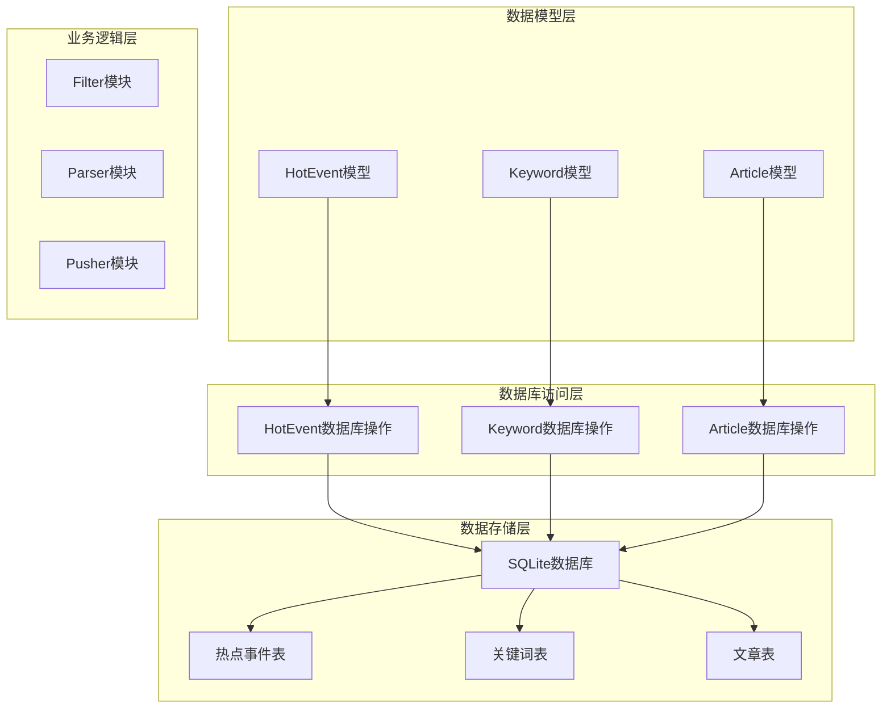
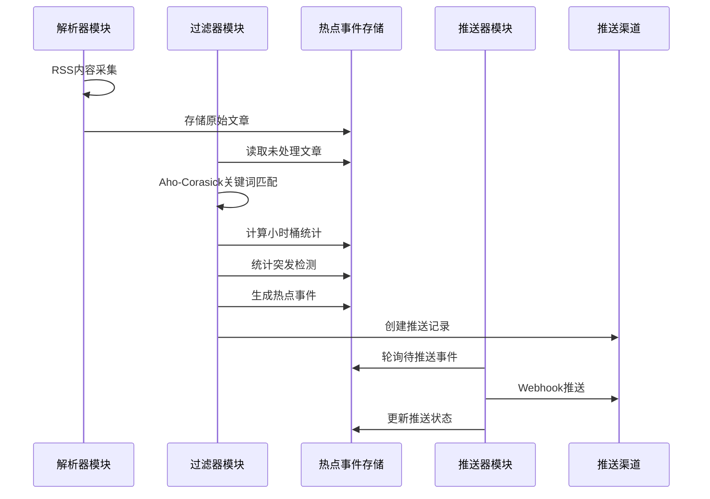
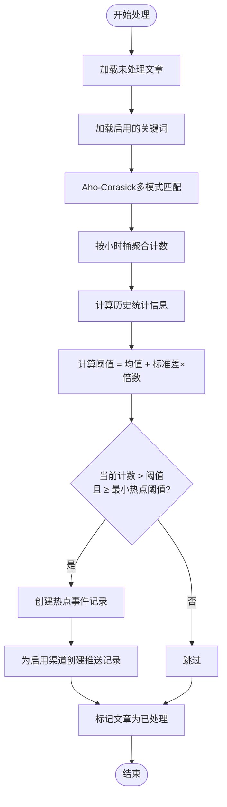
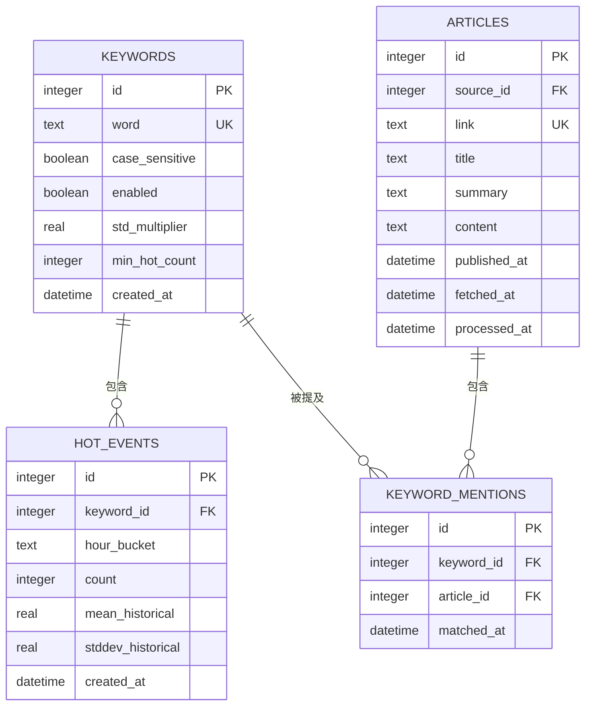
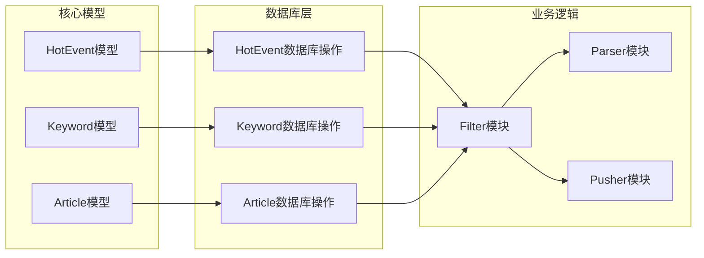

# 热点事件模型

<cite>
**本文档引用的文件**
- [hot_event.rs](file://src/models/hot_event.rs)
- [hot_event.rs](file://src/db/hot_event.rs)
- [keyword.rs](file://src/models/keyword.rs)
- [keyword.rs](file://src/db/keyword.rs)
- [article.rs](file://src/models/article.rs)
- [article.rs](file://src/db/article.rs)
- [20260607044921_init.sql](file://docs/migrations/20260607044921_init.sql)
- [README.md](file://README.md)
- [filter.rs](file://docs/plans/05-query-apis-and-background-modules.md)
</cite>

## 目录
1. [简介](#简介)
2. [项目结构](#项目结构)
3. [核心组件](#核心组件)
4. [架构概览](#架构概览)
5. [详细组件分析](#详细组件分析)
6. [依赖关系分析](#依赖关系分析)
7. [性能考虑](#性能考虑)
8. [故障排除指南](#故障排除指南)
9. [结论](#结论)
10. [附录](#附录)

## 简介

热点事件模型是 AI-Trend-Tool 系统中的核心数据结构，用于追踪和管理关键词相关的热点事件。该模型通过统计分析方法识别异常的关键词使用模式，并为后续的推送和推荐系统提供基础数据。

系统采用管道模式（Pipeline）架构，包含三个独立运行的后台模块：Parser（RSS采集）、Filter（关键词匹配+热点检测）、Pusher（Webhook推送）。热点事件模型作为核心数据存储，在整个系统中发挥着关键作用。

## 项目结构

系统采用模块化的 Rust 项目结构，主要包含以下层次：

**图表来源**
- [hot_event.rs:1-15](file://src/models/hot_event.rs#L1-L15)
- [keyword.rs:1-32](file://src/models/keyword.rs#L1-L32)
- [article.rs:1-25](file://src/models/article.rs#L1-L25)

**章节来源**
- [hot_event.rs:1-15](file://src/models/hot_event.rs#L1-L15)
- [hot_event.rs:1-81](file://src/db/hot_event.rs#L1-L81)
- [keyword.rs:1-32](file://src/models/keyword.rs#L1-L32)
- [article.rs:1-25](file://src/models/article.rs#L1-L25)

## 核心组件

### 热点事件实体结构

热点事件模型采用简洁而高效的数据结构设计，包含以下关键字段：

| 字段名 | 类型 | 描述 | 约束条件 |
|--------|------|------|----------|
| id | i64 | 主键标识符 | 自增主键 |
| keyword_id | i64 | 关联的关键词ID | 外键引用keywords表 |
| hour_bucket | String | 小时桶标识 | 格式: YYYYMMDDHH |
| count | i32 | 当前小时的命中次数 | 非负整数 |
| mean_historical | f64 | 历史均值 | 浮点数 |
| stddev_historical | f64 | 历史标准差 | 非负浮点数 |
| created_at | NaiveDateTime | 创建时间戳 | 默认当前时间 |

### 关键词实体结构

关键词模型定义了热点检测的基础配置参数：

| 字段名 | 类型 | 描述 | 默认值 |
|--------|------|------|--------|
| id | i64 | 主键标识符 | 自增 |
| word | String | 关键词文本 | 唯一约束 |
| case_sensitive | bool | 是否区分大小写 | false |
| enabled | bool | 是否启用 | true |
| std_multiplier | f64 | 标准差倍数阈值 | 2.0 |
| min_hot_count | i32 | 最小热点阈值 | 3 |
| created_at | NaiveDateTime | 创建时间 | 默认当前时间 |

**章节来源**
- [hot_event.rs:5-14](file://src/models/hot_event.rs#L5-L14)
- [keyword.rs:5-14](file://src/models/keyword.rs#L5-L14)

## 架构概览

系统采用管道模式（Pipeline）架构，三个后台模块独立运行：

**图表来源**
- [README.md:17-21](file://README.md#L17-L21)
- [filter.rs:507-740](file://docs/plans/05-query-apis-and-background-modules.md#L507-L740)

## 详细组件分析

### 热点事件生成机制

热点事件的生成过程遵循严格的统计分析流程：

**图表来源**
- [filter.rs:514-529](file://docs/plans/05-query-apis-and-background-modules.md#L514-L529)
- [filter.rs:617-704](file://docs/plans/05-query-apis-and-background-modules.md#L617-L704)

### 热点检测算法

系统采用统计突发检测算法，具体实现如下：

1. **关键词匹配**：使用 Aho-Corasick 算法进行多关键词模式匹配
2. **小时桶计数**：按关键词 + 小时窗口聚合文章数量
3. **历史统计**：计算过去 N 小时的历史均值和标准差
4. **阈值计算**：阈值 = 历史均值 + (标准差倍数 × 历史标准差)
5. **热点判定**：当前小时计数 > 阈值 且 计数 ≥ 最小热点阈值

### 数据库模式设计

**图表来源**
- [20260607044921_init.sql:52-97](file://docs/migrations/20260607044921_init.sql#L52-L97)
- [20260607044921_init.sql:105-113](file://docs/migrations/20260607044921_init.sql#L105-L113)

**章节来源**
- [20260607044921_init.sql:76-89](file://docs/migrations/20260607044921_init.sql#L76-L89)
- [filter.rs:522-527](file://docs/plans/05-query-apis-and-background-modules.md#L522-L527)

### 查询和分析接口

系统提供了多种查询接口来支持热点事件的数据分析：

#### 基础查询操作

| 操作类型 | 函数名 | 功能描述 | 参数说明 |
|----------|--------|----------|----------|
| 插入 | insert_hot_event | 创建新的热点事件 | keyword_id, hour_bucket, count, mean_historical, stddev_historical |
| 查询 | list_hot_events_by_keyword | 按关键词查询热点事件 | keyword_id, limit |
| 查询 | list_recent_hot_events | 查询最近热点事件 | limit |
| 查询 | get_hot_event_by_id | 按ID查询热点事件 | id |
| 查询 | get_hourly_counts | 获取小时级计数 | keyword_id, hours |

#### 高级分析功能

系统支持基于历史数据的统计分析，包括：
- 小时级趋势分析
- 标准差计算和异常检测
- 多关键词对比分析
- 时间序列模式识别

**章节来源**
- [hot_event.rs:5-80](file://src/db/hot_event.rs#L5-L80)

## 依赖关系分析

### 组件耦合度分析

**图表来源**
- [hot_event.rs:1-15](file://src/models/hot_event.rs#L1-L15)
- [keyword.rs:1-32](file://src/models/keyword.rs#L1-L32)
- [article.rs:1-25](file://src/models/article.rs#L1-L25)

### 外部依赖关系

系统主要依赖以下外部组件：
- **sqlx**：异步数据库连接和查询执行
- **chrono**：日期时间处理
- **serde**：数据序列化和反序列化
- **aho-corasick**：高性能多模式字符串匹配

**章节来源**
- [hot_event.rs:1-3](file://src/models/hot_event.rs#L1-L3)
- [keyword.rs:1-3](file://src/models/keyword.rs#L1-L3)

## 性能考虑

### 查询优化策略

1. **索引优化**：为热点事件表的关键字段建立适当索引
   - `keyword_id` 索引：支持按关键词查询
   - `hour_bucket` 索引：支持时间序列查询
   - `created_at` 索引：支持时间排序

2. **批量操作**：支持批量插入和更新操作
3. **分页查询**：提供分页机制避免大数据集查询
4. **缓存策略**：对频繁查询的结果进行缓存

### 内存管理

- 使用 `Option<T>` 类型处理可空值
- 合理使用 `Vec<T>` 进行批量数据处理
- 避免不必要的数据复制

## 故障排除指南

### 常见问题及解决方案

1. **热点事件未生成**
   - 检查关键词是否启用
   - 验证历史数据是否充足
   - 确认标准差倍数设置合理

2. **查询性能问题**
   - 确保相关索引存在
   - 检查查询参数限制
   - 考虑使用分页查询

3. **数据一致性问题**
   - 验证外键约束
   - 检查事务处理
   - 确认并发访问控制

**章节来源**
- [README.md:273-289](file://README.md#L273-L289)

## 结论

热点事件模型通过简洁而强大的数据结构设计，为 AI-Trend-Tool 系统提供了可靠的热点检测能力。模型采用统计分析方法，能够有效识别异常的关键词使用模式，并为后续的推送和推荐系统提供基础数据支持。

系统的管道架构设计确保了各模块的独立性和可扩展性，而完善的数据库模式设计则保证了数据的一致性和查询效率。通过合理的性能优化和故障排除策略，系统能够在生产环境中稳定运行。

## 附录

### 推荐系统应用场景

热点事件模型在推荐系统中有以下应用价值：

1. **内容推荐**：基于热点事件的相关性进行内容推荐
2. **个性化定制**：根据用户关注的关键词热点提供个性化内容
3. **实时更新**：利用热点事件的实时特性提供最新的推荐内容
4. **趋势预测**：通过历史热点数据分析未来趋势

### 扩展建议

1. **机器学习集成**：结合机器学习算法提升热点检测准确性
2. **多维度分析**：增加地理位置、用户行为等维度的分析
3. **可视化展示**：提供热点事件的可视化展示界面
4. **API接口**：提供标准化的API接口供其他系统调用