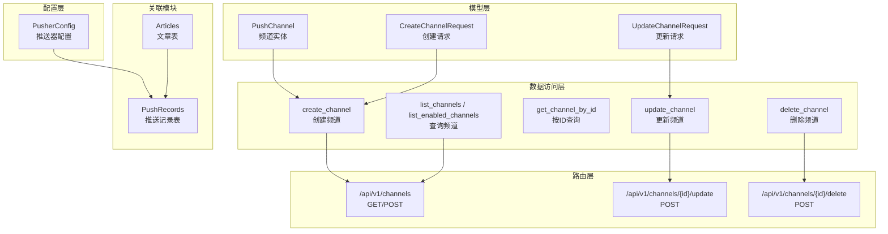
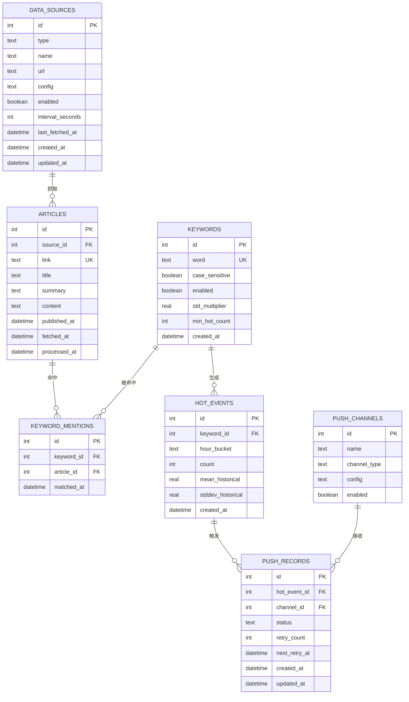
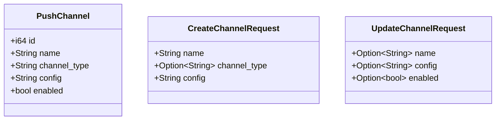
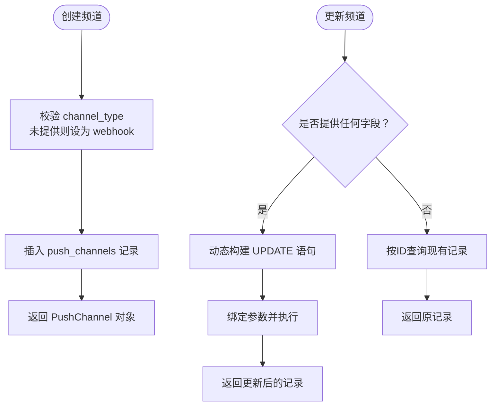
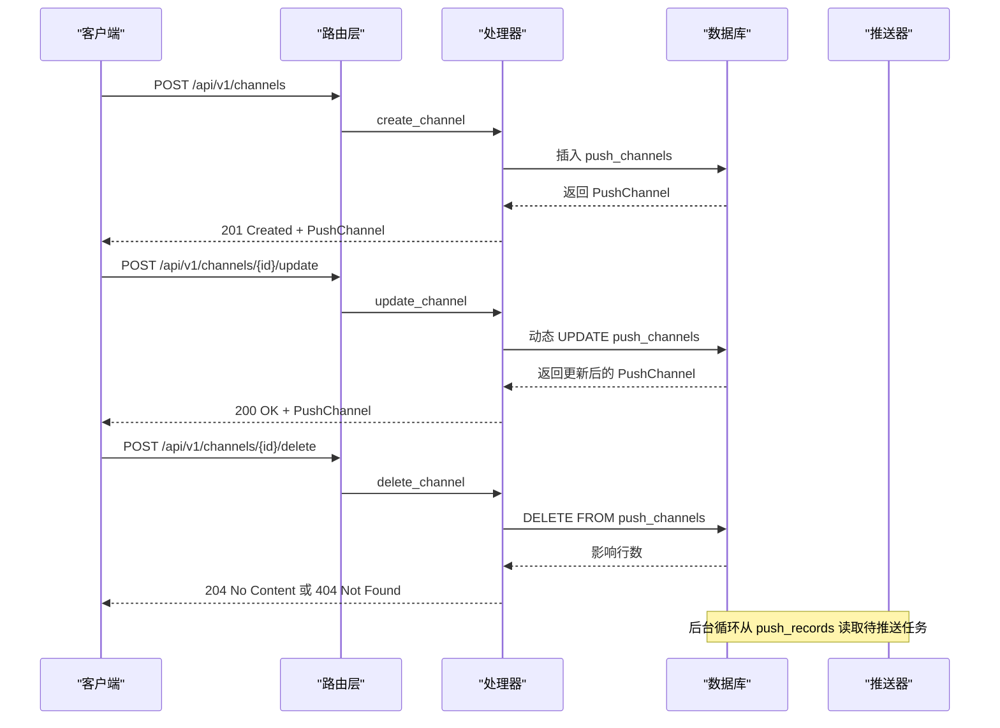
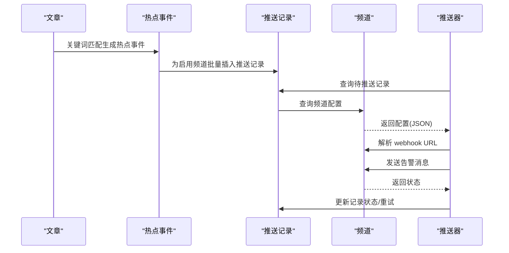
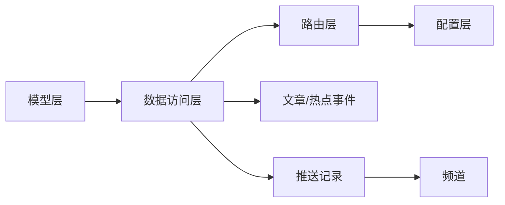

# 频道模型

<cite>
**本文档引用的文件**
- [src/models/channel.rs](file://src/models/channel.rs)
- [src/db/channel.rs](file://src/db/channel.rs)
- [docs/migrations/20260607044921_init.sql](file://docs/migrations/20260607044921_init.sql)
- [src/route.rs](file://src/routes.rs)
- [src/config.rs](file://src/config.rs)
- [src/db/push_record.rs](file://src/db/push_record.rs)
- [src/models/push_record.rs](file://src/models/push_record.rs)
- [src/models/article.rs](file://src/models/article.rs)
- [docs/plans/05-query-apis-and-background-modules.md](file://docs/plans/05-query-apis-and-background-modules.md)
- [openspec/changes/implement-crud-apis/specs/channel-crud-api/spec.md](file://openspec/changes/implement-crud-apis/specs/channel-crud-api/spec.md)
</cite>

## 目录
1. [简介](#简介)
2. [项目结构](#项目结构)
3. [核心组件](#核心组件)
4. [架构概览](#架构概览)
5. [详细组件分析](#详细组件分析)
6. [依赖分析](#依赖分析)
7. [性能考虑](#性能考虑)
8. [故障排除指南](#故障排除指南)
9. [结论](#结论)
10. [附录](#附录)

## 简介
本文件系统性地阐述频道模型的设计与实现，涵盖频道实体的结构、层级关系、与文章和推送记录的关联、创建与管理流程、验证规则与业务约束，并提供实际使用示例与最佳实践。频道模型在系统中承担"推送通道"的角色，支持通过 Webhook 等方式向外部系统推送热点事件告警。

## 项目结构
频道模型位于后端服务的分层架构中，遵循清晰的职责分离：
- 模型层：定义频道的数据结构与请求/响应载体
- 数据访问层：封装数据库操作，提供 CRUD 能力
- 路由层：暴露 REST API，统一鉴权与中间件
- 配置层：提供推送器等运行时参数
- 关联模块：与文章、推送记录建立外键关联，支撑完整的推送流水线

**图表来源**
- [src/models/channel.rs:4-25](file://src/models/channel.rs#L4-L25)
- [src/db/channel.rs:5-93](file://src/db/channel.rs#L5-L93)
- [src/routes.rs:36-44](file://src/routes.rs#L36-L44)
- [src/config.rs:45-50](file://src/config.rs#L45-L50)
- [docs/migrations/20260607044921_init.sql:92-118](file://docs/migrations/20260607044921_init.sql#L92-L118)

**章节来源**
- [src/models/channel.rs:1-26](file://src/models/channel.rs#L1-L26)
- [src/db/channel.rs:1-94](file://src/db/channel.rs#L1-L94)
- [src/routes.rs:14-61](file://src/routes.rs#L14-L61)
- [src/config.rs:1-59](file://src/config.rs#L1-L59)
- [docs/migrations/20260607044921_init.sql:92-118](file://docs/migrations/20260607044921_init.sql#L92-L118)

## 核心组件
- 频道实体 PushChannel：包含标识、名称、类型、配置、启用状态等字段
- 创建请求 CreateChannelRequest：包含名称、可选类型、配置（JSON 字符串）
- 更新请求 UpdateChannelRequest：包含可选的名称、配置、启用状态
- 数据库操作：提供创建、查询、更新、删除频道的能力
- 路由接口：统一暴露频道的 CRUD API，受鉴权中间件保护
- 配置参数：推送器的轮询间隔、最大重试次数、基础重试秒数等

**章节来源**
- [src/models/channel.rs:4-25](file://src/models/channel.rs#L4-L25)
- [src/db/channel.rs:5-93](file://src/db/channel.rs#L5-L93)
- [src/routes.rs:36-44](file://src/routes.rs#L36-L44)
- [src/config.rs:45-50](file://src/config.rs#L45-L50)

## 架构概览
频道模型与文章、推送记录形成完整的推送流水线：
- 文章表承载数据源抓取结果
- 热点事件表基于关键词统计生成
- 推送记录表记录每次推送的状态与重试
- 频道表定义推送目标与配置
- 推送器根据配置解析频道配置，向外部 Webhook 发送告警消息

**图表来源**
- [docs/migrations/20260607044921_init.sql:17-118](file://docs/migrations/20260607044921_init.sql#L17-L118)
- [src/models/article.rs:5-16](file://src/models/article.rs#L5-L16)
- [src/models/push_record.rs:5-15](file://src/models/push_record.rs#L5-L15)

## 详细组件分析

### 频道实体与请求模型
- PushChannel：包含自增 ID、名称、类型、配置（JSON 字符串）、启用状态
- CreateChannelRequest：创建时需要名称与配置，类型可选，默认为 Webhook
- UpdateChannelRequest：更新时各字段均为可选，仅提供字段会被修改

**图表来源**
- [src/models/channel.rs:4-25](file://src/models/channel.rs#L4-L25)

**章节来源**
- [src/models/channel.rs:1-26](file://src/models/channel.rs#L1-L26)

### 数据库模式与约束
- push_channels 表：主键自增、名称必填、类型默认 Webhook、配置默认空 JSON、启用默认开启
- push_records 表：唯一约束 (hot_event_id, channel_id)，状态枚举 pending/success/failed，包含重试计数与下次重试时间
- 外键约束：推送记录引用热点事件与频道，级联删除保证数据一致性

**图表来源**
- [docs/migrations/20260607044921_init.sql:92-118](file://docs/migrations/20260607044921_init.sql#L92-L118)
- [src/db/channel.rs:5-93](file://src/db/channel.rs#L5-L93)

**章节来源**
- [docs/migrations/20260607044921_init.sql:92-118](file://docs/migrations/20260607044921_init.sql#L92-L118)
- [src/db/channel.rs:5-93](file://src/db/channel.rs#L5-L93)

### API 流程与控制流
- 路由注册：/api/v1/channels 及其子路径，统一应用鉴权中间件
- 创建频道：POST /api/v1/channels，若未提供类型则默认 webhook
- 更新频道：POST /api/v1/channels/{id}/update，支持部分更新
- 删除频道：POST /api/v1/channels/{id}/delete，不存在时返回 404
- 查询频道：GET /api/v1/channels，支持列出全部与仅启用的频道

**图表来源**
- [src/routes.rs:36-44](file://src/routes.rs#L36-L44)
- [src/db/channel.rs:5-93](file://src/db/channel.rs#L5-L93)
- [openspec/changes/implement-crud-apis/specs/channel-crud-api/spec.md:39-89](file://openspec/changes/implement-crud-apis/specs/channel-crud-api/spec.md#L39-L89)

**章节来源**
- [src/routes.rs:14-61](file://src/routes.rs#L14-L61)
- [src/db/channel.rs:5-93](file://src/db/channel.rs#L5-L93)
- [openspec/changes/implement-crud-apis/specs/channel-crud-api/spec.md:39-89](file://openspec/changes/implement-crud-apis/specs/channel-crud-api/spec.md#L39-L89)

### 与文章和推送记录的关联
- 文章到热点事件：文章经关键词匹配后生成热点事件
- 热点事件到推送记录：为每个热点事件为启用的频道插入一条推送记录
- 推送记录到频道：推送器按记录查询对应频道，解析配置中的 Webhook URL 并发送告警

**图表来源**
- [src/db/push_record.rs:6-47](file://src/db/push_record.rs#L6-L47)
- [docs/plans/05-query-apis-and-background-modules.md:756-909](file://docs/plans/05-query-apis-and-background-modules.md#L756-L909)
- [docs/migrations/20260607044921_init.sql:92-118](file://docs/migrations/20260607044921_init.sql#L92-L118)

**章节来源**
- [src/db/push_record.rs:1-47](file://src/db/push_record.rs#L1-L47)
- [src/models/push_record.rs:1-16](file://src/models/push_record.rs#L1-L16)
- [docs/plans/05-query-apis-and-background-modules.md:756-909](file://docs/plans/05-query-apis-and-background-modules.md#L756-L909)

### 验证规则与业务约束
- 名称：创建时必填；更新时可选
- 类型：创建时可选，默认 webhook；更新时可选
- 配置：必须为合法 JSON 字符串；Webhook 场景下应包含 URL 键
- 启用状态：布尔值，默认开启；可用于临时禁用频道
- 唯一性：推送记录对 (热点事件, 频道) 唯一，避免重复推送
- 状态枚举：推送记录状态限定为 pending、success、failed
- 重试策略：按指数退避计算下次重试时间，超过最大重试次数后停止

**章节来源**
- [src/models/channel.rs:14-25](file://src/models/channel.rs#L14-L25)
- [docs/migrations/20260607044921_init.sql:92-118](file://docs/migrations/20260607044921_init.sql#L92-L118)
- [docs/plans/05-query-apis-and-background-modules.md:870-894](file://docs/plans/05-query-apis-and-background-modules.md#L870-L894)

## 依赖分析
- 模型依赖：频道模型依赖序列化/反序列化与数据库映射
- 数据访问依赖：频道 DAO 依赖 SQLite 连接池与模型类型
- 路由依赖：频道 API 依赖路由注册与鉴权中间件
- 配置依赖：推送器依赖配置参数控制轮询与重试行为
- 关联依赖：推送记录依赖频道与热点事件，形成闭环

**图表来源**
- [src/models/channel.rs:1-26](file://src/models/channel.rs#L1-L26)
- [src/db/channel.rs:1-94](file://src/db/channel.rs#L1-L94)
- [src/routes.rs:14-61](file://src/routes.rs#L14-L61)
- [src/config.rs:45-50](file://src/config.rs#L45-L50)
- [src/db/push_record.rs:1-47](file://src/db/push_record.rs#L1-L47)

**章节来源**
- [src/models/channel.rs:1-26](file://src/models/channel.rs#L1-L26)
- [src/db/channel.rs:1-94](file://src/db/channel.rs#L1-L94)
- [src/routes.rs:14-61](file://src/routes.rs#L14-L61)
- [src/config.rs:1-59](file://src/config.rs#L1-L59)
- [src/db/push_record.rs:1-47](file://src/db/push_record.rs#L1-L47)

## 性能考虑
- 查询优化：按 ID 查询频道与推送记录具备索引支持；列表查询按 ID 排序便于分页
- 写入优化：批量插入推送记录时利用 OR IGNORE 与唯一约束减少冲突
- 推送器轮询：通过配置的间隔参数平衡实时性与资源消耗
- JSON 解析：频道配置为字符串存储，解析发生在推送阶段，建议在写入前进行格式校验以降低运行时开销

## 故障排除指南
- 401 未授权：确认请求携带有效 Bearer Token
- 404 未找到：检查频道 ID 是否存在
- 400 请求错误：检查请求体格式，确保配置为合法 JSON
- 推送失败：检查频道配置中的 URL 是否正确，网络连通性与外部服务可用性
- 重试过多：调整推送器配置中的最大重试次数与基础重试秒数

**章节来源**
- [openspec/changes/implement-crud-apis/specs/channel-crud-api/spec.md:39-89](file://openspec/changes/implement-crud-apis/specs/channel-crud-api/spec.md#L39-L89)
- [docs/plans/05-query-apis-and-background-modules.md:870-894](file://docs/plans/05-query-apis-and-background-modules.md#L870-L894)

## 结论
频道模型通过简洁的实体结构与完善的 CRUD 能力，为系统提供了灵活的推送通道管理能力。配合推送记录与推送器，实现了从热点事件到外部系统的自动化告警。通过合理的验证规则、唯一约束与重试机制，保障了系统的可靠性与可维护性。

## 附录

### 实际使用示例与最佳实践
- 创建频道
  - 使用默认类型（webhook）时，配置需包含 URL 键
  - 建议为不同平台（如 Slack、飞书、钉钉）分别创建独立频道
- 更新频道
  - 采用部分更新策略，仅变更必要的字段
  - 修改配置后建议先进行测试推送
- 管理频道
  - 对于不再使用的频道，优先禁用而非删除，便于审计与恢复
  - 为关键业务场景保留多个备用频道，提升可用性
- 最佳实践
  - 在写入前校验配置 JSON 的合法性
  - 为推送器设置合理的轮询间隔与重试策略
  - 监控推送记录状态，及时发现并处理异常

**章节来源**
- [src/models/channel.rs:14-25](file://src/models/channel.rs#L14-L25)
- [docs/plans/05-query-apis-and-background-modules.md:756-909](file://docs/plans/05-query-apis-and-background-modules.md#L756-L909)