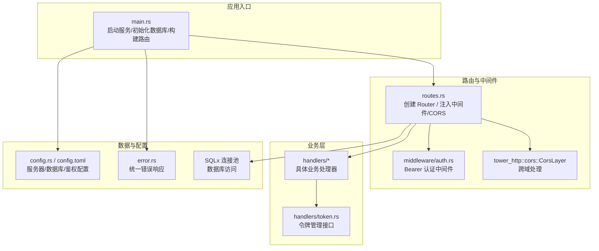
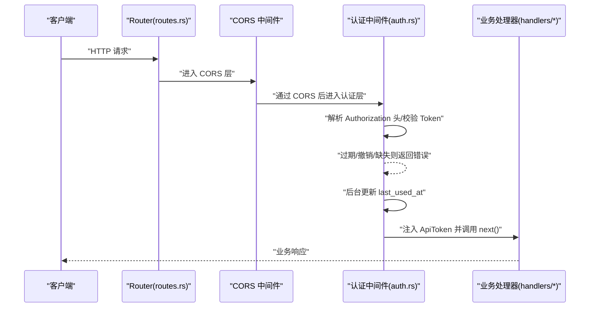
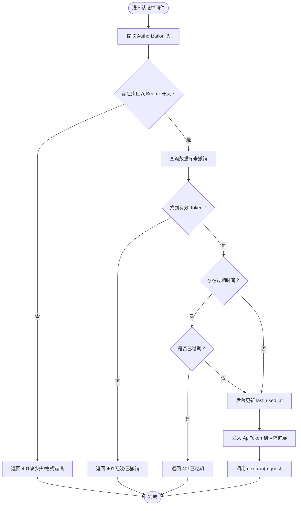
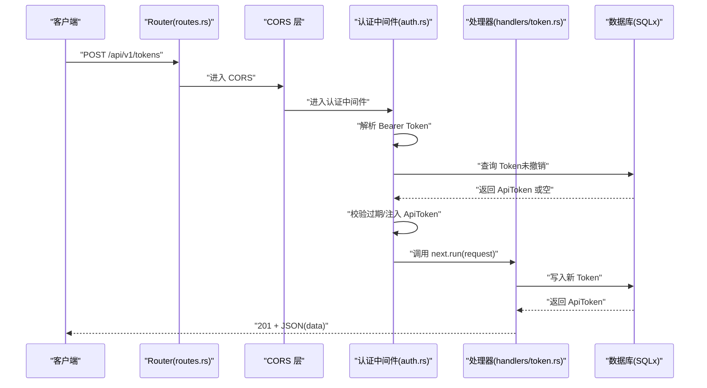
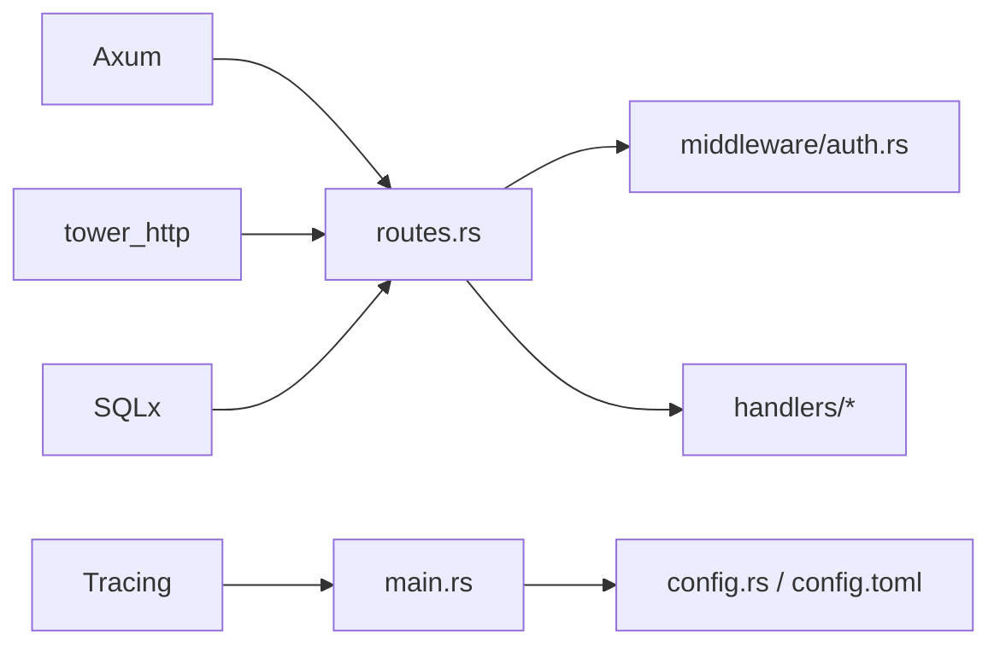

# 中间件设计模式

<cite>
**本文引用的文件**
- [src/middleware.rs](file://src/middleware.rs)
- [src/middleware/auth.rs](file://src/middleware/auth.rs)
- [src/routes.rs](file://src/routes.rs)
- [src/main.rs](file://src/main.rs)
- [src/error.rs](file://src/error.rs)
- [src/config.rs](file://src/config.rs)
- [config.toml](file://config.toml)
- [Cargo.toml](file://Cargo.toml)
- [openspec/specs/auth-middleware/spec.md](file://openspec/specs/auth-middleware/spec.md)
- [openspec/specs/token-api/spec.md](file://openspec/specs/token-api/spec.md)
- [src/handlers/token.rs](file://src/handlers/token.rs)
</cite>

## 目录
1. [引言](#引言)
2. [项目结构](#项目结构)
3. [核心组件](#核心组件)
4. [架构总览](#架构总览)
5. [详细组件分析](#详细组件分析)
6. [依赖关系分析](#依赖关系分析)
7. [性能考量](#性能考量)
8. [故障排查指南](#故障排查指南)
9. [结论](#结论)
10. [附录](#附录)

## 引言
本文件围绕 AI 趋势监控系统中的中间件设计模式展开，重点阐述认证中间件的 Bearer Token 验证机制、路由层的 CORS 跨域处理、以及通过统一中间件链实现的安全性、性能监控与错误处理等横切关注点。文档将给出中间件链的执行流程图、关键实现路径与最佳实践，并讨论设计原则、性能优化策略与调试技巧。

## 项目结构
该系统采用 Rust + Axum 框架，使用 Tower/Tower-HTTP 实现中间件链与 CORS；数据库访问通过 SQLx；日志使用 Tracing。认证中间件位于独立模块中，路由在构建时注入到特定前缀的 API 路由上，健康检查端点不经过认证。

图表来源
- [src/main.rs:63-96](file://src/main.rs#L63-L96)
- [src/routes.rs:14-56](file://src/routes.rs#L14-L56)
- [src/middleware/auth.rs:18-59](file://src/middleware/auth.rs#L18-L59)
- [src/error.rs:8-50](file://src/error.rs#L8-L50)
- [src/config.rs:52-59](file://src/config.rs#L52-L59)
- [config.toml:1-27](file://config.toml#L1-L27)

章节来源
- [src/main.rs:63-96](file://src/main.rs#L63-L96)
- [src/routes.rs:14-56](file://src/routes.rs#L14-L56)
- [src/middleware.rs:1-3](file://src/middleware.rs#L1-L3)
- [Cargo.toml:1-47](file://Cargo.toml#L1-L47)

## 核心组件
- 认证中间件（Bearer Token）
  - 功能：从 Authorization 头提取 Bearer Token，校验数据库存在性与未撤销状态，检查过期时间，后台更新最近使用时间，将完整 ApiToken 注入请求扩展供下游处理器使用。
  - 关键实现路径：[src/middleware/auth.rs:18-59](file://src/middleware/auth.rs#L18-L59)
- 路由与中间件装配
  - 功能：在 /api/v1 前缀下启用认证中间件，在根路由启用 CORS；健康检查端点不需认证。
  - 关键实现路径：[src/routes.rs:14-56](file://src/routes.rs#L14-L56)
- 统一错误处理
  - 功能：将业务错误映射为标准 HTTP 状态码与 JSON 错误体，支持数据库错误自动转换。
  - 关键实现路径：[src/error.rs:8-50](file://src/error.rs#L8-L50)
- 应用配置与启动
  - 功能：加载配置、初始化数据库连接池、运行迁移、确保初始令牌存在、构建并启动服务。
  - 关键实现路径：[src/main.rs:26-96](file://src/main.rs#L26-L96)，[src/config.rs:52-59](file://src/config.rs#L52-L59)，[config.toml:1-27](file://config.toml#L1-L27)

章节来源
- [src/middleware/auth.rs:18-59](file://src/middleware/auth.rs#L18-L59)
- [src/routes.rs:14-56](file://src/routes.rs#L14-L56)
- [src/error.rs:8-50](file://src/error.rs#L8-L50)
- [src/main.rs:26-96](file://src/main.rs#L26-L96)
- [src/config.rs:52-59](file://src/config.rs#L52-L59)
- [config.toml:1-27](file://config.toml#L1-L27)

## 架构总览
下图展示了中间件链在请求生命周期中的位置与调用顺序：CORS 在最外层，随后是认证中间件，最后到达具体业务处理器。认证中间件在成功后将 ApiToken 注入请求扩展，供处理器读取。

图表来源
- [src/routes.rs:14-56](file://src/routes.rs#L14-L56)
- [src/middleware/auth.rs:18-59](file://src/middleware/auth.rs#L18-L59)

## 详细组件分析

### 认证中间件（Bearer Token）设计与实现
- 执行顺序与生命周期
  - 提取阶段：从 Authorization 头解析 Bearer Token。
  - 校验阶段：查询数据库确认未撤销且存在；若存在过期时间则比较当前时间。
  - 后台更新：使用 tokio::spawn 异步更新 last_used_at，避免阻塞响应。
  - 注入阶段：将 ApiToken 插入请求扩展，供下游处理器读取。
  - 传递阶段：调用 next.run(request) 将请求交给下一个中间件或处理器。
- 错误处理
  - 缺失头、格式错误、无效/已撤销、过期均返回 401，并通过统一错误类型转换为标准 JSON。
- 可观测性
  - 使用 Tracing 输出初始令牌与数据库操作日志，便于运维与审计。

图表来源
- [src/middleware/auth.rs:18-59](file://src/middleware/auth.rs#L18-L59)
- [src/error.rs:23-49](file://src/error.rs#L23-L49)

章节来源
- [src/middleware/auth.rs:18-59](file://src/middleware/auth.rs#L18-L59)
- [src/error.rs:8-50](file://src/error.rs#L8-L50)
- [openspec/specs/auth-middleware/spec.md:1-88](file://openspec/specs/auth-middleware/spec.md#L1-L88)

### CORS 中间件与跨域处理
- 装配方式：在根路由层添加 CorsLayer::permissive()，允许任意来源、方法与头进行跨域访问。
- 生效范围：对所有路由开放跨域，但不影响认证中间件对 /api/v1 的保护。
- 注意事项：生产环境建议收紧 CORS 策略，仅允许受信来源。

章节来源
- [src/routes.rs:55](file://src/routes.rs#L55)
- [Cargo.toml:10-11](file://Cargo.toml#L10-L11)

### 日志与追踪（Tracing）
- 初始化：通过 tracing-subscriber 在 main 中初始化，按环境过滤输出级别。
- 使用场景：输出初始令牌、数据库错误、服务启动信息等，便于问题定位与审计。

章节来源
- [src/main.rs:63-96](file://src/main.rs#L63-L96)
- [src/error.rs:31-38](file://src/error.rs#L31-L38)

### 统一错误处理与响应格式
- 错误类型覆盖常见业务错误（未找到、参数错误、未授权、冲突、内部错误、数据库错误）。
- 统一响应体包含错误码与消息字段，便于前端与自动化工具消费。
- 数据库错误自动转换为 500 并记录日志。

章节来源
- [src/error.rs:8-50](file://src/error.rs#L8-L50)

### 中间件链执行流程（代码级）
以下序列图映射到实际代码路径，展示从请求进入、CORS、认证、处理器到响应返回的完整链路。

图表来源
- [src/routes.rs:14-56](file://src/routes.rs#L14-L56)
- [src/middleware/auth.rs:18-59](file://src/middleware/auth.rs#L18-L59)
- [src/handlers/token.rs:18-30](file://src/handlers/token.rs#L18-L30)

## 依赖关系分析
- 框架与库
  - Axum 用于路由与中间件模型；tower-http 提供 CORS 与可选 trace；SQLx 提供异步数据库访问；Tracing 提供日志。
- 模块耦合
  - 认证中间件依赖 AppState（包含数据库连接池与配置），并通过请求扩展注入 ApiToken。
  - 路由模块负责装配中间件与 CORS，不直接参与业务逻辑。
- 外部集成点
  - 数据库迁移在启动时执行；初始令牌在首次启动时生成或从配置读取。

图表来源
- [Cargo.toml:6-47](file://Cargo.toml#L6-L47)
- [src/routes.rs:14-56](file://src/routes.rs#L14-L56)
- [src/main.rs:63-96](file://src/main.rs#L63-L96)

章节来源
- [Cargo.toml:6-47](file://Cargo.toml#L6-L47)
- [src/routes.rs:14-56](file://src/routes.rs#L14-L56)
- [src/main.rs:63-96](file://src/main.rs#L63-L96)

## 性能考量
- 异步后台更新
  - 使用 tokio::spawn 更新 last_used_at，避免阻塞主响应路径，降低认证延迟。
- 数据库访问
  - 查询与更新均在异步上下文中执行；建议在数据库层面建立必要索引（如 token 值与撤销标志）。
- CORS 策略
  - permissive 模式便于开发，生产应限制允许的来源、方法与头，减少预检请求与不必要的开销。
- 日志级别
  - 使用环境过滤控制日志量，避免高频请求导致 IO 抖动。

## 故障排查指南
- 401 未授权
  - 检查请求头是否包含正确的 Bearer Token；确认 Token 未被撤销且未过期。
  - 参考规范与实现路径：[src/middleware/auth.rs:18-59](file://src/middleware/auth.rs#L18-L59)，[openspec/specs/auth-middleware/spec.md:1-88](file://openspec/specs/auth-middleware/spec.md#L1-L88)
- 数据库错误
  - 查看日志中的数据库错误条目，确认迁移是否成功、表结构是否匹配。
  - 参考错误映射：[src/error.rs:52-59](file://src/error.rs#L52-L59)
- CORS 问题
  - 若浏览器提示跨域失败，检查服务端是否正确装配了 CORS 层。
  - 参考装配位置：[src/routes.rs](file://src/routes.rs#L55)
- 初始令牌
  - 首次启动会打印初始令牌，请妥善保存；可通过配置指定初始令牌值。
  - 参考启动逻辑与配置：[src/main.rs:29-61](file://src/main.rs#L29-L61)，[config.toml:8-10](file://config.toml#L8-L10)

章节来源
- [src/middleware/auth.rs:18-59](file://src/middleware/auth.rs#L18-L59)
- [src/error.rs:52-59](file://src/error.rs#L52-L59)
- [src/routes.rs:55](file://src/routes.rs#L55)
- [src/main.rs:29-61](file://src/main.rs#L29-L61)
- [config.toml:8-10](file://config.toml#L8-L10)

## 结论
本系统通过 Tower 中间件链实现了清晰的横切关注点分离：认证中间件统一处理 Bearer Token 校验与上下文注入，CORS 中间件统一处理跨域，错误处理模块统一响应格式与日志记录。该设计具备良好的可维护性与扩展性，适合在多业务处理器场景下复用与演进。

## 附录
- 设计原则
  - 单一职责：每个中间件只负责一个横切关注点。
  - 可组合：通过 Router.layer 与 next.run 实现链式调用。
  - 不侵入业务：通过请求扩展传递上下文，业务处理器无需感知中间件细节。
- 调试技巧
  - 使用较低日志级别快速定位问题；在认证中间件前后打印关键信息。
  - 对比规范与实现，逐项核验错误分支与边界条件。
- 规范参考
  - 认证中间件需求与场景：[openspec/specs/auth-middleware/spec.md:1-88](file://openspec/specs/auth-middleware/spec.md#L1-L88)
  - 令牌管理 API 需求与场景：[openspec/specs/token-api/spec.md:1-69](file://openspec/specs/token-api/spec.md#L1-L69)