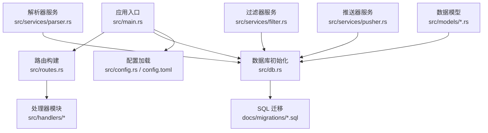
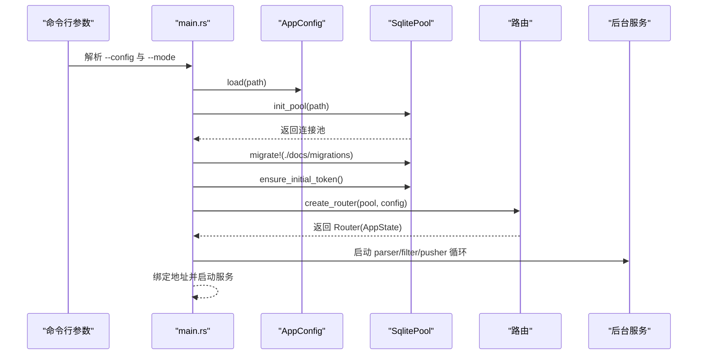
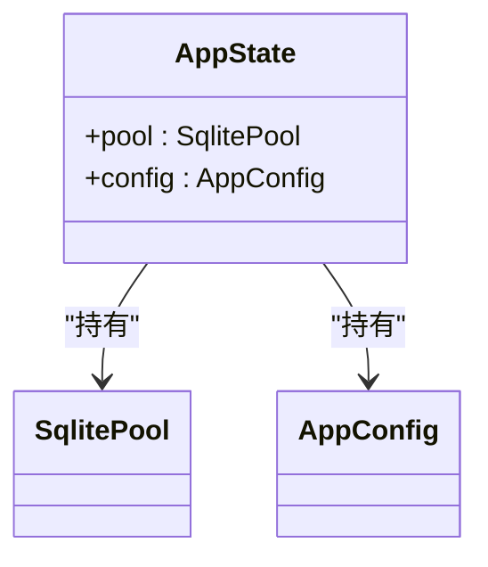
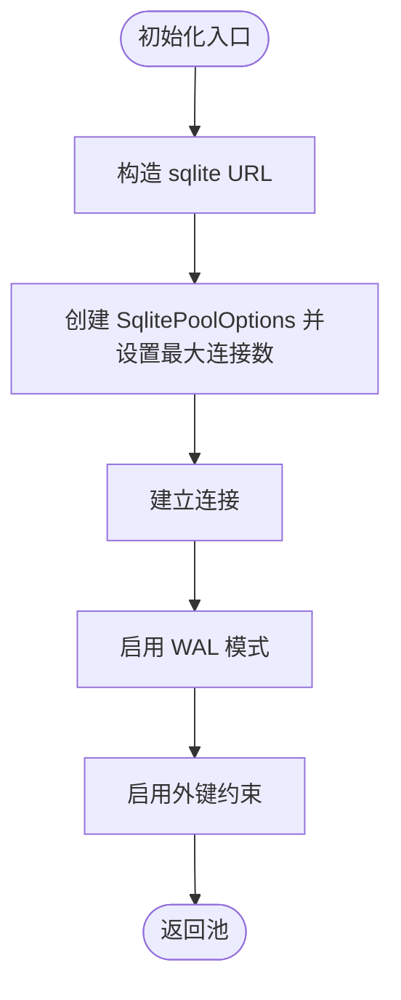
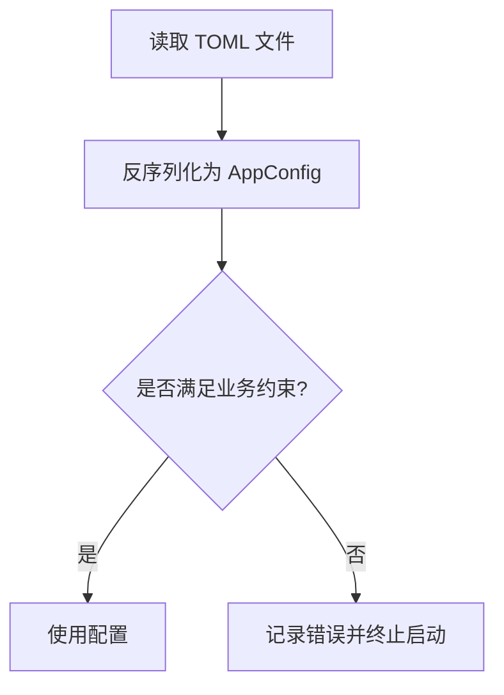
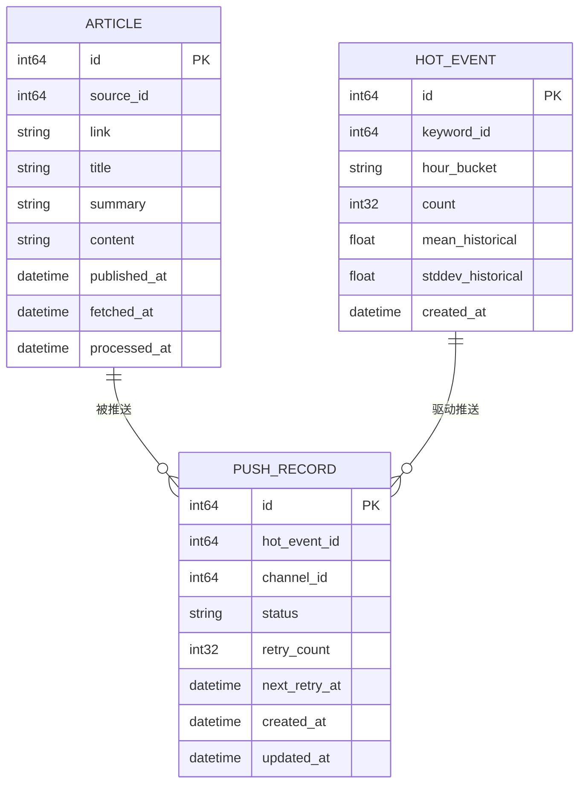
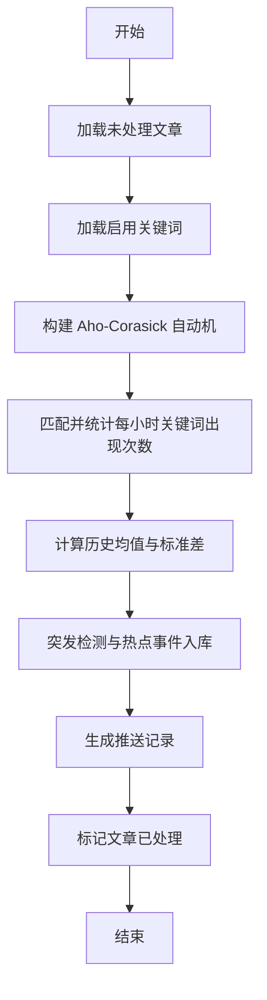
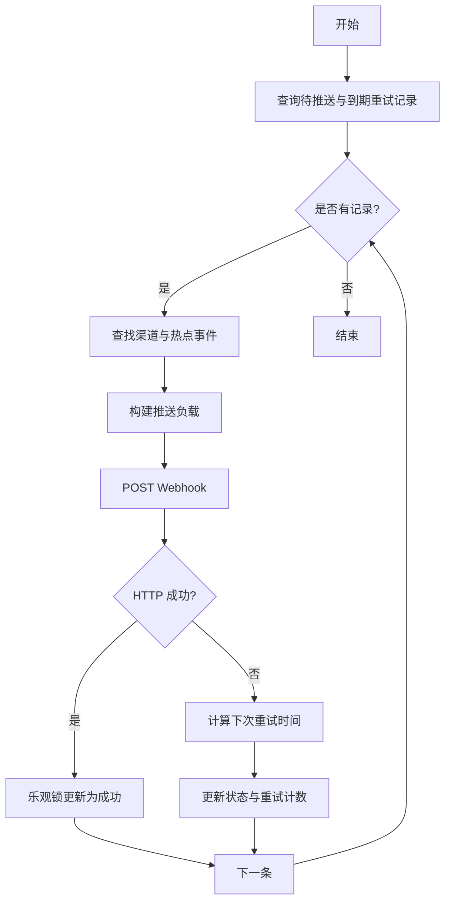
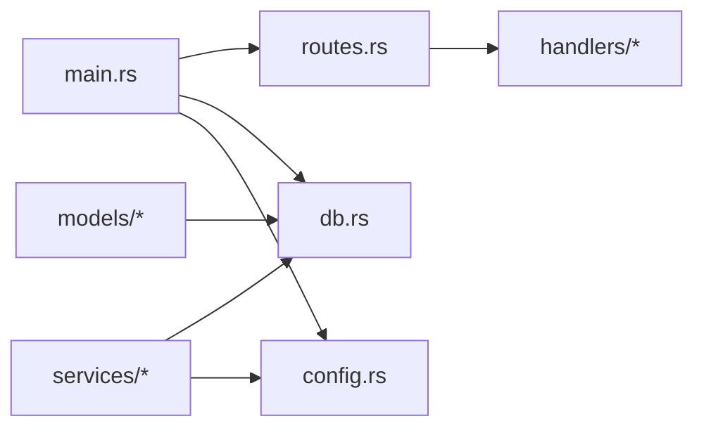

# 全局状态管理

<cite>
**本文引用的文件**
- [src/main.rs](file://src/main.rs)
- [src/db.rs](file://src/db.rs)
- [src/config.rs](file://src/config.rs)
- [src/routes.rs](file://src/routes.rs)
- [src/services/filter.rs](file://src/services/filter.rs)
- [src/services/parser.rs](file://src/services/parser.rs)
- [src/services/pusher.rs](file://src/services/pusher.rs)
- [src/models/hot_event.rs](file://src/models/hot_event.rs)
- [src/models/article.rs](file://src/models/article.rs)
- [src/models/push_record.rs](file://src/models/push_record.rs)
- [config.toml](file://config.toml)
- [Cargo.toml](file://Cargo.toml)
</cite>

## 目录
1. [引言](#引言)
2. [项目结构](#项目结构)
3. [核心组件](#核心组件)
4. [架构总览](#架构总览)
5. [详细组件分析](#详细组件分析)
6. [依赖关系分析](#依赖关系分析)
7. [性能考量](#性能考量)
8. [故障排查指南](#故障排查指南)
9. [结论](#结论)
10. [附录](#附录)

## 引言
本文件聚焦于 AI 趋势监控系统的“全局状态管理”。我们将从以下维度展开：AppState 结构体的设计理念与生命周期、SqlitePool 连接池的初始化与复用、AppConfig 配置系统（加载、校验、热更新）以及全局状态在各模块间的共享方式、线程安全与内存管理策略；并提供状态监控、性能调优与故障恢复的实现方案与最佳实践。

## 项目结构
系统采用模块化分层设计：
- 应用入口负责解析 CLI、加载配置、初始化数据库连接池、执行迁移、确保初始令牌、构建路由并启动服务。
- 路由层通过 AppState 向各处理器注入共享状态（SqlitePool 与 AppConfig）。
- 业务服务层（解析器、过滤器、推送器）以独立后台任务形式运行，均持有池句柄进行数据库操作。
- 数据模型与数据库访问层通过 sqlx 提供类型安全的查询与迁移能力。



图表来源
- [src/main.rs:64-96](file://src/main.rs#L64-L96)
- [src/routes.rs:14-66](file://src/routes.rs#L14-L66)
- [src/db.rs:12-26](file://src/db.rs#L12-L26)
- [src/config.rs:52-58](file://src/config.rs#L52-L58)

章节来源
- [src/main.rs:1-97](file://src/main.rs#L1-L97)
- [src/routes.rs:14-66](file://src/routes.rs#L14-L66)
- [src/db.rs:12-26](file://src/db.rs#L12-L26)
- [src/config.rs:52-58](file://src/config.rs#L52-L58)
- [config.toml:1-27](file://config.toml#L1-L27)

## 核心组件
- AppState：承载全局共享状态，包含 SqlitePool 与 AppConfig，通过 with_state 注入到路由，供所有处理器使用。
- SqlitePool：统一的数据库连接池，初始化时启用 WAL 模式与外键约束，限制最大连接数。
- AppConfig：集中式配置对象，支持从 TOML 文件加载，包含服务器、数据库、鉴权、解析器、过滤器、推送器等子配置。
- 业务服务：解析器、过滤器、推送器作为后台任务，各自维护循环调度与并发控制。

章节来源
- [src/routes.rs:62-66](file://src/routes.rs#L62-L66)
- [src/db.rs:12-26](file://src/db.rs#L12-L26)
- [src/config.rs:4-58](file://src/config.rs#L4-L58)
- [src/services/parser.rs:105-193](file://src/services/parser.rs#L105-L193)
- [src/services/filter.rs:277-283](file://src/services/filter.rs#L277-L283)
- [src/services/pusher.rs:235-242](file://src/services/pusher.rs#L235-L242)

## 架构总览
全局状态在应用生命周期内的流转如下：
- 启动阶段：解析 CLI → 加载配置 → 初始化数据库池 → 执行迁移 → 确保初始令牌 → 构建路由（注入 AppState）→ 启动服务监听。
- 运行阶段：处理器通过 AppState 获取池与配置；后台服务周期性执行解析、过滤、推送任务；数据库事务与 WAL 提升并发与可靠性。



图表来源
- [src/main.rs:64-96](file://src/main.rs#L64-L96)
- [src/config.rs:52-58](file://src/config.rs#L52-L58)
- [src/db.rs:12-26](file://src/db.rs#L12-L26)
- [src/routes.rs:14-50](file://src/routes.rs#L14-L50)

## 详细组件分析

### AppState 设计与生命周期
- 设计理念
  - 将“可变状态”与“不可变配置”分离，避免在处理器中重复构造或传递相同对象。
  - 使用 Clone 的 AppState，确保在中间件与处理器之间安全传递。
- 生命周期
  - 创建：在路由构建时一次性创建并注入。
  - 使用：处理器与后台服务通过引用池与配置执行业务逻辑。
  - 销毁：随应用进程结束而销毁，无显式释放逻辑（池由 sqlx 管理）。
- 线程安全
  - AppState 本身仅包含 Clone 类型字段；SqlitePool 与 AppConfig 均为线程安全类型，可在多任务间共享。
- 内存管理
  - 通过 clone 复制引用，避免昂贵的对象拷贝；池与配置均为轻量级句柄/结构体。



图表来源
- [src/routes.rs:62-66](file://src/routes.rs#L62-L66)

章节来源
- [src/routes.rs:14-50](file://src/routes.rs#L14-L50)
- [src/routes.rs:62-66](file://src/routes.rs#L62-L66)

### SqlitePool 初始化、配置与连接复用
- 初始化流程
  - 构造 sqlite URL（模式 rwc），设置最大连接数，建立连接池。
  - 启用 WAL 模式与外键约束，提升并发写入与一致性。
- 连接复用机制
  - 池内连接按需分配与回收；后台服务与处理器共享同一池实例，减少连接开销。
  - 通过池句柄执行查询与事务，sqlx 自动处理连接生命周期。
- 并发与可靠性
  - WAL 模式降低写入冲突；外键开启保证参照完整性。
  - 最大连接数限制防止资源耗尽。



图表来源
- [src/db.rs:12-26](file://src/db.rs#L12-L26)

章节来源
- [src/db.rs:12-26](file://src/db.rs#L12-L26)

### AppConfig 配置管理系统
- 配置加载
  - 从 TOML 文件读取内容并反序列化为 AppConfig 对象。
- 配置结构
  - 包含 server、database、auth、parser、filter、pusher 子配置，覆盖网络、存储、鉴权、解析、过滤、推送等维度。
- 验证与默认值
  - 当前实现未显式校验字段范围；建议在加载后增加范围与必填项校验。
- 热更新机制
  - 当前未实现热更新；建议引入配置变更检测与重新加载策略（如文件监控或信号触发）。



图表来源
- [src/config.rs:52-58](file://src/config.rs#L52-L58)
- [config.toml:1-27](file://config.toml#L1-L27)

章节来源
- [src/config.rs:4-58](file://src/config.rs#L4-L58)
- [config.toml:1-27](file://config.toml#L1-L27)

### 全局状态在模块间的共享与线程安全
- 路由与处理器
  - 通过 with_state 注入 AppState，处理器可直接访问池与配置。
- 中间件
  - 可通过 with_state_with_request 访问 AppState，实现鉴权等横切逻辑。
- 后台服务
  - 解析器、过滤器、推送器各自持有池与配置副本，独立运行。
- 线程安全
  - SqlitePool 与 Clone 配置天然线程安全；注意避免在业务逻辑中对共享可变状态进行竞态修改。

章节来源
- [src/routes.rs:14-50](file://src/routes.rs#L14-L50)
- [src/services/parser.rs:105-193](file://src/services/parser.rs#L105-L193)
- [src/services/filter.rs:277-283](file://src/services/filter.rs#L277-L283)
- [src/services/pusher.rs:235-242](file://src/services/pusher.rs#L235-L242)

### 数据模型与状态持久化
- 关键实体
  - 文章、热点事件、推送记录等模型定义了字段与序列化行为，配合数据库表结构实现状态持久化。
- 状态流转
  - 文章入库 → 过滤匹配关键词 → 生成热点事件 → 生成推送记录 → 推送成功/失败状态更新。



图表来源
- [src/models/article.rs:5-16](file://src/models/article.rs#L5-L16)
- [src/models/hot_event.rs:5-14](file://src/models/hot_event.rs#L5-L14)
- [src/models/push_record.rs:5-15](file://src/models/push_record.rs#L5-L15)

章节来源
- [src/models/article.rs:5-16](file://src/models/article.rs#L5-L16)
- [src/models/hot_event.rs:5-14](file://src/models/hot_event.rs#L5-L14)
- [src/models/push_record.rs:5-15](file://src/models/push_record.rs#L5-L15)

### 过滤器（Filter）状态与流程
- 核心职责
  - 加载未处理文章 → 加载启用关键词 → 构建 Aho-Corasick 自动机 → 匹配统计 → 历史统计与突发检测 → 生成热点事件与推送记录 → 标记文章已处理。
- 并发与批处理
  - 支持批量处理与历史窗口统计，避免一次性处理过多数据导致阻塞。
- 线程安全
  - 仅使用只读配置与池句柄，无共享可变状态。



图表来源
- [src/services/filter.rs:13-219](file://src/services/filter.rs#L13-L219)

章节来源
- [src/services/filter.rs:13-219](file://src/services/filter.rs#L13-L219)

### 解析器（Parser）并发与限流
- 并发控制
  - 使用信号量限制最大并发抓取数量，避免对上游源造成压力。
- 错误处理
  - 单个源抓取失败不影响其他源；更新最后抓取时间以避免立即重试。
- 线程安全
  - 解析器与信号量通过 Arc 共享，Tokio 任务间安全传递。

```mermaid
sequenceDiagram
participant Loop as "解析器循环"
participant Sem as "信号量"
participant Src as "源"
participant Pool as "SqlitePool"
Loop->>Loop : 查询到期源
Loop->>Sem : acquire()
Sem-->>Loop : 获得许可
Loop->>Src : 抓取与解析
Src-->>Loop : 返回文章列表
Loop->>Pool : 插入文章/更新最后抓取时间
Loop-->>Sem : release()
```

图表来源
- [src/services/parser.rs:105-193](file://src/services/parser.rs#L105-L193)

章节来源
- [src/services/parser.rs:105-193](file://src/services/parser.rs#L105-L193)

### 推送器（Pusher）重试与幂等
- 状态机
  - pending/retry_due → 发送 → 成功/失败；失败按指数退避重试，超过上限放弃。
- 幂等与乐观锁
  - 更新状态时携带期望状态，避免并发更新冲突。
- 线程安全
  - 仅使用只读配置与池句柄，无共享可变状态。



图表来源
- [src/services/pusher.rs:11-242](file://src/services/pusher.rs#L11-L242)

章节来源
- [src/services/pusher.rs:11-242](file://src/services/pusher.rs#L11-L242)

## 依赖关系分析
- 外部依赖
  - Web 框架与中间件：Axum、Tower、Tower-http
  - 数据库：sqlx（SQLite）
  - 时间与时序：chrono
  - 日志：tracing/tracing-subscriber
  - 字符串匹配：aho-corasick
  - HTTP 客户端：reqwest
  - CLI：clap
  - 序列化：serde、serde_json、toml
- 内部模块耦合
  - 路由依赖 AppState；处理器依赖池与配置；后台服务依赖池与配置；数据库层依赖 sqlx。



图表来源
- [Cargo.toml:6-47](file://Cargo.toml#L6-L47)
- [src/main.rs:64-96](file://src/main.rs#L64-L96)
- [src/routes.rs:14-50](file://src/routes.rs#L14-L50)

章节来源
- [Cargo.toml:6-47](file://Cargo.toml#L6-L47)

## 性能考量
- 连接池与并发
  - 当前最大连接数较小，适合单机小规模场景；若并发较高，应评估增加 max_connections 并结合 WAL 模式优化写入。
- 批处理与窗口
  - 过滤器使用批大小与历史窗口，避免一次性处理大量数据；建议根据 CPU 与 IO 能力动态调整。
- 并发抓取
  - 解析器通过信号量限制并发，建议根据上游源限速策略动态调节。
- 指数退避
  - 推送器采用线性递增的退避间隔，可考虑指数退避以减少抖动。
- 监控指标
  - 建议增加池使用率、队列长度、处理耗时等指标，便于容量规划与性能调优。

## 故障排查指南
- 初始令牌问题
  - 若数据库中无令牌，首次启动会自动创建或使用配置中的初始令牌；检查日志输出的令牌信息。
- 数据库连接失败
  - 检查数据库路径是否存在、权限是否正确；确认 WAL 与外键设置是否生效。
- 过滤器无输出
  - 确认存在启用关键词与未处理文章；检查历史窗口与阈值设置。
- 推送失败
  - 查看通道配置 JSON 是否包含有效 URL；关注重试计数与下次重试时间；检查网络异常与目标服务状态码。
- 线程安全与死锁
  - 确保不跨任务共享可变状态；避免在处理器中长时间持有数据库事务；必要时拆分长事务。

章节来源
- [src/main.rs:30-62](file://src/main.rs#L30-L62)
- [src/db.rs:12-26](file://src/db.rs#L12-L26)
- [src/services/filter.rs:13-219](file://src/services/filter.rs#L13-L219)
- [src/services/pusher.rs:11-242](file://src/services/pusher.rs#L11-L242)

## 结论
本系统通过 AppState 将池与配置统一注入至路由与后台服务，形成清晰的全局状态管理模式。SqlitePool 在 WAL 与外键保障下具备良好的并发与一致性；AppConfig 以 TOML 驱动，结构清晰但缺少运行时热更新。建议后续增强配置校验、热更新与可观测性指标，以进一步提升稳定性与可运维性。

## 附录
- 配置示例与字段说明
  - server：主机与端口
  - database：数据库文件路径
  - auth：初始令牌（可选）
  - parser：并发抓取、用户代理、超时
  - filter：批大小、间隔、历史窗口、最小历史窗口
  - pusher：推送间隔、最大重试次数、基础重试秒数

章节来源
- [config.toml:1-27](file://config.toml#L1-L27)