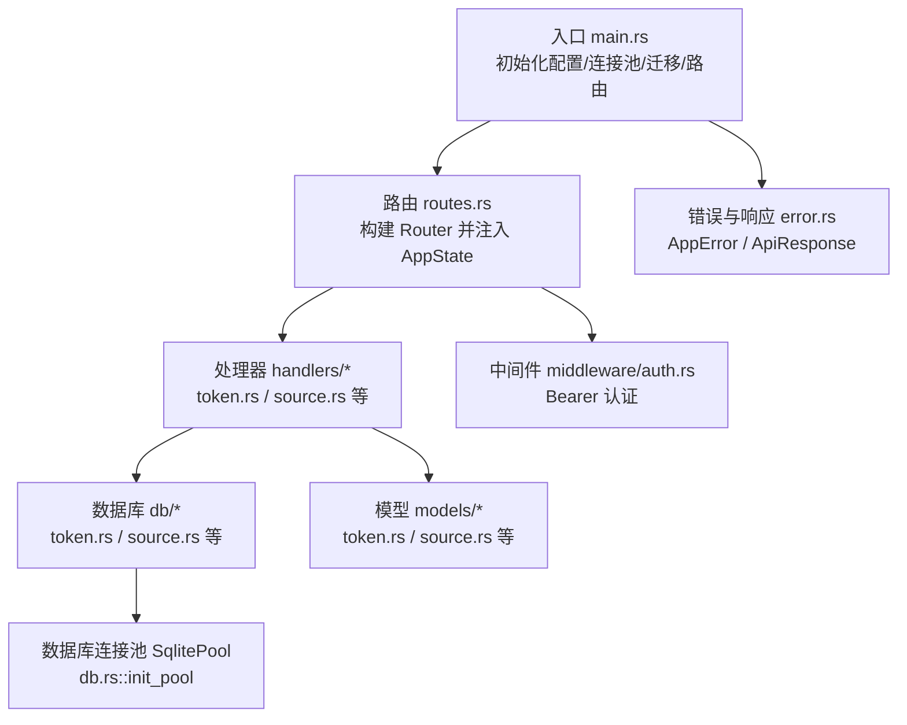
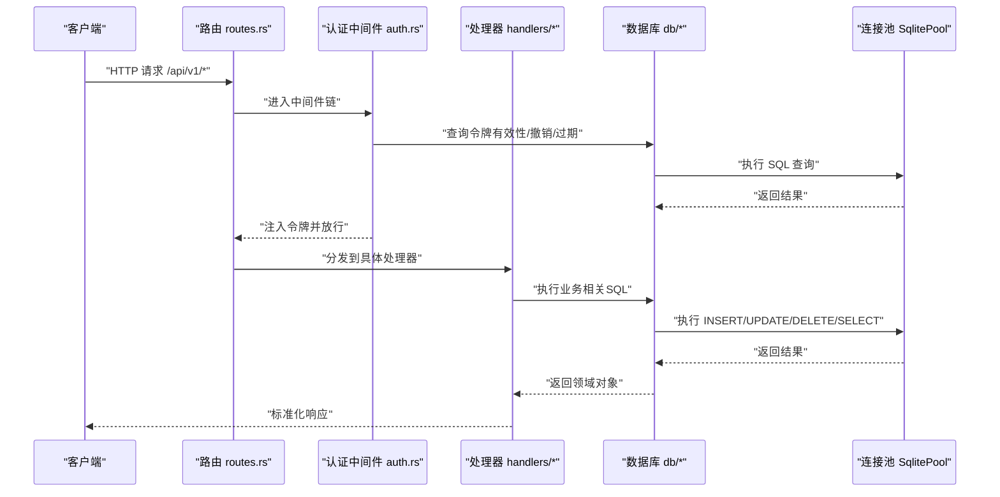
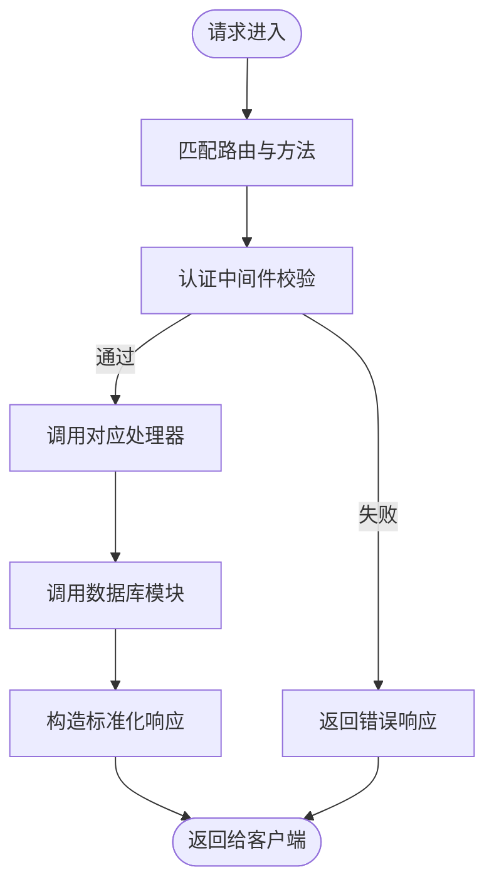
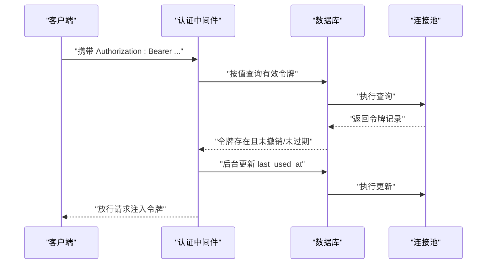
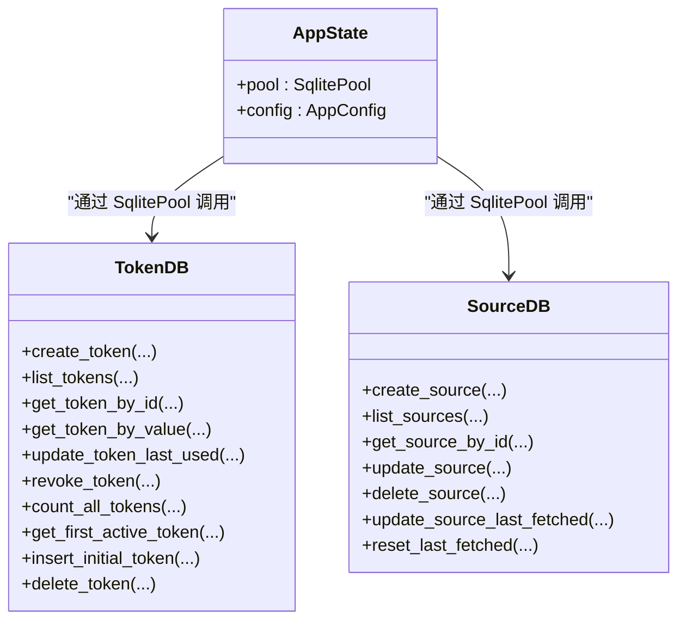
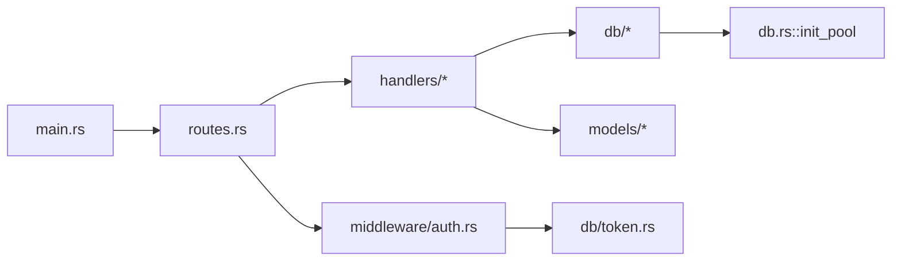

# 分层架构设计

<cite>
**本文引用的文件**
- [src/main.rs](file://src/main.rs)
- [src/routes.rs](file://src/routes.rs)
- [src/db.rs](file://src/db.rs)
- [src/error.rs](file://src/error.rs)
- [src/handlers.rs](file://src/handlers.rs)
- [src/middleware.rs](file://src/middleware.rs)
- [src/services.rs](file://src/services.rs)
- [src/models.rs](file://src/models.rs)
- [src/handlers/token.rs](file://src/handlers/token.rs)
- [src/handlers/source.rs](file://src/handlers/source.rs)
- [src/middleware/auth.rs](file://src/middleware/auth.rs)
- [src/db/token.rs](file://src/db/token.rs)
- [src/db/source.rs](file://src/db/source.rs)
- [src/models/token.rs](file://src/models/token.rs)
- [src/models/source.rs](file://src/models/source.rs)
</cite>

## 目录
1. [引言](#引言)
2. [项目结构](#项目结构)
3. [核心组件](#核心组件)
4. [架构总览](#架构总览)
5. [详细组件分析](#详细组件分析)
6. [依赖分析](#依赖分析)
7. [性能考虑](#性能考虑)
8. [故障排查指南](#故障排查指南)
9. [结论](#结论)
10. [附录](#附录)

## 引言
本文件面向“AI趋势监控系统”的后端分层架构，围绕表示层（API路由与处理器）、业务层（中间件与服务）、数据访问层（数据库操作）进行职责划分与实现细节说明。重点阐述：
- 各层边界与接口定义
- 数据在层间的传递方式
- 如何通过分层实现关注点分离、提升可维护性与可测试性
- 常见反模式与改进建议
- 以实际源码路径为依据的最佳实践与示例定位

## 项目结构
系统采用模块化组织，按职责划分为：入口与配置、路由与状态、错误与响应封装、中间件、处理器、模型、数据库访问等。核心入口负责初始化数据库连接池、运行迁移、确保初始令牌，并构建Axum路由；路由层统一挂载各资源API并注入应用状态；处理器层承接HTTP请求，调用数据库模块完成持久化；中间件层提供认证与授权；数据库模块封装SQL交互；模型模块承载数据结构。

图表来源
- [src/main.rs:63-96](file://src/main.rs#L63-L96)
- [src/routes.rs:14-50](file://src/routes.rs#L14-L50)
- [src/db.rs:11-25](file://src/db.rs#L11-L25)
- [src/error.rs:8-79](file://src/error.rs#L8-L79)

章节来源
- [src/main.rs:1-96](file://src/main.rs#L1-L96)
- [src/routes.rs:1-61](file://src/routes.rs#L1-L61)
- [src/db.rs:1-26](file://src/db.rs#L1-L26)
- [src/error.rs:1-79](file://src/error.rs#L1-L79)

## 核心组件
- 入口与启动流程：解析CLI参数、加载配置、创建数据库目录、初始化连接池、执行迁移、确保初始令牌、构建路由并启动服务。
- 路由与状态：集中定义REST端点，使用AppState携带SqlitePool与AppConfig，统一挂载认证中间件。
- 处理器：每个资源（token、source、keyword、channel）对应独立模块，处理请求参数、调用数据库模块、返回标准化响应。
- 中间件：认证中间件从Authorization头提取Bearer令牌，校验有效性、过期与撤销状态，更新最近使用时间，并将令牌注入请求扩展供下游使用。
- 数据库模块：每个实体（token、source等）提供CRUD与辅助查询方法，屏蔽SQL细节。
- 模型模块：定义实体结构体与请求/响应DTO，用于序列化/反序列化与数据库映射。
- 错误与响应：统一错误类型与HTTP状态码映射，提供成功响应封装工具类。

章节来源
- [src/main.rs:26-61](file://src/main.rs#L26-L61)
- [src/routes.rs:14-61](file://src/routes.rs#L14-L61)
- [src/middleware/auth.rs:18-59](file://src/middleware/auth.rs#L18-L59)
- [src/db/token.rs:6-107](file://src/db/token.rs#L6-L107)
- [src/db/source.rs:5-126](file://src/db/source.rs#L5-L126)
- [src/models/token.rs:5-46](file://src/models/token.rs#L5-L46)
- [src/models/source.rs:5-39](file://src/models/source.rs#L5-L39)
- [src/error.rs:8-79](file://src/error.rs#L8-L79)

## 架构总览
下图展示了从客户端到数据库的完整调用链路，体现三层职责与依赖方向：

图表来源
- [src/routes.rs:14-50](file://src/routes.rs#L14-L50)
- [src/middleware/auth.rs:18-59](file://src/middleware/auth.rs#L18-L59)
- [src/handlers/token.rs:18-30](file://src/handlers/token.rs#L18-L30)
- [src/handlers/source.rs:27-33](file://src/handlers/source.rs#L27-L33)
- [src/db/token.rs:40-48](file://src/db/token.rs#L40-L48)
- [src/db/source.rs:5-22](file://src/db/source.rs#L5-L22)
- [src/db.rs:11-25](file://src/db.rs#L11-L25)

## 详细组件分析

### 表示层（API路由与处理器）
- 路由组织：集中定义资源API（如 /tokens、/sources、/keywords、/channels），统一挂载认证中间件与CORS层，使用AppState传递共享状态。
- 处理器职责：接收请求参数（Path/Json/State），调用数据库模块执行业务操作，返回标准化响应或HTTP状态码。
- 示例定位：
  - 创建令牌处理器：[src/handlers/token.rs:18-30](file://src/handlers/token.rs#L18-L30)
  - 列表与删除数据源处理器：[src/handlers/source.rs:15-20](file://src/handlers/source.rs#L15-L20)、[src/handlers/source.rs:59-71](file://src/handlers/source.rs#L59-L71)
  - 手动触发抓取处理器：[src/handlers/source.rs:77-90](file://src/handlers/source.rs#L77-L90)
  - 路由注册与中间件挂载：[src/routes.rs:20-44](file://src/routes.rs#L20-L44)

图表来源
- [src/routes.rs:20-44](file://src/routes.rs#L20-L44)
- [src/middleware/auth.rs:18-59](file://src/middleware/auth.rs#L18-L59)
- [src/handlers/token.rs:18-30](file://src/handlers/token.rs#L18-L30)
- [src/handlers/source.rs:27-33](file://src/handlers/source.rs#L27-L33)

章节来源
- [src/routes.rs:14-61](file://src/routes.rs#L14-L61)
- [src/handlers.rs:1-6](file://src/handlers.rs#L1-L6)
- [src/handlers/token.rs:13-66](file://src/handlers/token.rs#L13-L66)
- [src/handlers/source.rs:12-91](file://src/handlers/source.rs#L12-L91)

### 业务层（中间件与服务）
- 认证中间件：从Authorization头解析Bearer令牌，查询数据库验证非撤销与未过期，后台异步更新最近使用时间，并将令牌注入请求扩展。
- 服务模块：预留背景服务入口（parser/filter/pusher），当前阶段由路由与处理器直接调用数据库模块，后续可在此层抽象业务编排。
- 示例定位：
  - 认证中间件主流程：[src/middleware/auth.rs:18-59](file://src/middleware/auth.rs#L18-L59)
  - 服务模块入口占位：[src/services.rs:1-6](file://src/services.rs#L1-L6)

图表来源
- [src/middleware/auth.rs:18-59](file://src/middleware/auth.rs#L18-L59)
- [src/db/token.rs:40-48](file://src/db/token.rs#L40-L48)
- [src/db/token.rs:50-58](file://src/db/token.rs#L50-L58)

章节来源
- [src/middleware.rs:1-3](file://src/middleware.rs#L1-L3)
- [src/middleware/auth.rs:14-60](file://src/middleware/auth.rs#L14-L60)
- [src/services.rs:1-6](file://src/services.rs#L1-L6)

### 数据访问层（数据库操作）
- 连接池初始化：设置最大连接数、启用WAL模式与外键约束，保证并发与一致性。
- 实体模块：每个实体提供创建、查询、更新、删除、辅助统计与引导数据插入等方法。
- 示例定位：
  - 初始化连接池：[src/db.rs:11-25](file://src/db.rs#L11-L25)
  - 令牌CRUD与统计：[src/db/token.rs:6-107](file://src/db/token.rs#L6-L107)
  - 数据源CRUD与动态更新：[src/db/source.rs:5-126](file://src/db/source.rs#L5-L126)

图表来源
- [src/routes.rs:56-61](file://src/routes.rs#L56-L61)
- [src/db.rs:11-25](file://src/db.rs#L11-L25)
- [src/db/token.rs:6-107](file://src/db/token.rs#L6-L107)
- [src/db/source.rs:5-126](file://src/db/source.rs#L5-L126)

章节来源
- [src/db.rs:1-26](file://src/db.rs#L1-L26)
- [src/db/token.rs:1-107](file://src/db/token.rs#L1-L107)
- [src/db/source.rs:1-126](file://src/db/source.rs#L1-L126)

### 数据模型与接口契约
- 模型定义：实体结构体（FromRow/Serde）与请求/响应DTO，确保序列化一致性与数据库映射。
- 示例定位：
  - 令牌模型与列表信息转换：[src/models/token.rs:5-46](file://src/models/token.rs#L5-L46)
  - 数据源模型与请求DTO：[src/models/source.rs:5-39](file://src/models/source.rs#L5-L39)

章节来源
- [src/models.rs:1-8](file://src/models.rs#L1-L8)
- [src/models/token.rs:1-46](file://src/models/token.rs#L1-L46)
- [src/models/source.rs:1-39](file://src/models/source.rs#L1-L39)

### 错误处理与响应封装
- 统一错误类型：涵盖未找到、请求错误、未授权、冲突、内部错误与数据库错误。
- 响应封装：提供ok/created/no_content等静态方法，确保一致的JSON结构。
- 示例定位：
  - 错误枚举与IntoResponse实现：[src/error.rs:8-50](file://src/error.rs#L8-L50)
  - 成功响应封装工具：[src/error.rs:61-79](file://src/error.rs#L61-L79)

章节来源
- [src/error.rs:1-79](file://src/error.rs#L1-L79)

## 依赖分析
- 层内高内聚、跨层低耦合：路由仅负责分发与中间件装配；处理器仅依赖数据库模块；数据库模块仅依赖模型与连接池。
- 关键依赖链：
  - main.rs → routes.rs → handlers/* → db/* → db.rs::init_pool
  - routes.rs → middleware/auth.rs → db/token.rs
  - handlers/* → models/* → db/*

图表来源
- [src/main.rs:63-96](file://src/main.rs#L63-L96)
- [src/routes.rs:14-50](file://src/routes.rs#L14-L50)
- [src/db.rs:11-25](file://src/db.rs#L11-L25)
- [src/middleware/auth.rs:18-59](file://src/middleware/auth.rs#L18-L59)
- [src/db/token.rs:6-107](file://src/db/token.rs#L6-L107)

章节来源
- [src/main.rs:1-96](file://src/main.rs#L1-L96)
- [src/routes.rs:1-61](file://src/routes.rs#L1-L61)
- [src/db.rs:1-26](file://src/db.rs#L1-L26)

## 性能考虑
- 连接池与并发：初始化时限制最大连接数，避免过度并发导致SQLite写入竞争。
- 异步更新：认证中间件对last_used_at的更新采用fire-and-forget，降低请求路径延迟。
- 动态SQL：部分更新采用拼接SET子句，减少不必要的字段写入。
- 建议优化：
  - 对高频查询建立索引（如令牌值、数据源ID、创建时间等）
  - 将热点数据缓存至内存（如活跃令牌列表）
  - 在处理器层增加速率限制与幂等控制

## 故障排查指南
- 未授权/无效令牌
  - 现象：返回未授权错误
  - 排查：确认Authorization头格式、令牌是否撤销、是否过期
  - 参考：[src/middleware/auth.rs:23-46](file://src/middleware/auth.rs#L23-L46)
- 资源不存在
  - 现象：返回404
  - 排查：检查ID是否存在、软/硬删除状态
  - 参考：[src/handlers/source.rs:44-47](file://src/handlers/source.rs#L44-L47)
- 数据库异常
  - 现象：统一转为500并记录日志
  - 排查：查看迁移是否执行、连接URL是否正确
  - 参考：[src/error.rs:31-38](file://src/error.rs#L31-L38)，[src/main.rs:80](file://src/main.rs#L80)

章节来源
- [src/middleware/auth.rs:18-59](file://src/middleware/auth.rs#L18-L59)
- [src/handlers/source.rs:44-71](file://src/handlers/source.rs#L44-L71)
- [src/error.rs:23-50](file://src/error.rs#L23-L50)
- [src/main.rs:80](file://src/main.rs#L80)

## 结论
该系统通过清晰的三层划分实现了职责分离：路由与中间件负责接入与横切关注点，处理器聚焦业务编排，数据库模块专注数据持久化。配合统一的错误与响应封装，提升了可维护性与可测试性。建议在后续迭代中引入业务服务层以进一步解耦处理器与数据库调用，并完善缓存与索引策略以提升性能。

## 附录
- 最佳实践清单
  - 处理器只做参数校验与调用，不做复杂业务逻辑
  - 数据库模块保持纯SQL封装，避免在模块内做业务判断
  - 使用AppState统一注入共享资源，避免全局变量
  - 对外部依赖（如数据库）进行单元测试隔离
- 常见反模式与对策
  - 反模式：处理器直接拼接SQL
    - 对策：将SQL下沉至db模块，提供明确函数签名
  - 反模式：在中间件中做重业务计算
    - 对策：将业务逻辑迁移到服务层或处理器内，中间件仅做鉴权/限流
  - 反模式：错误类型分散
    - 对策：统一使用AppError并实现IntoResponse