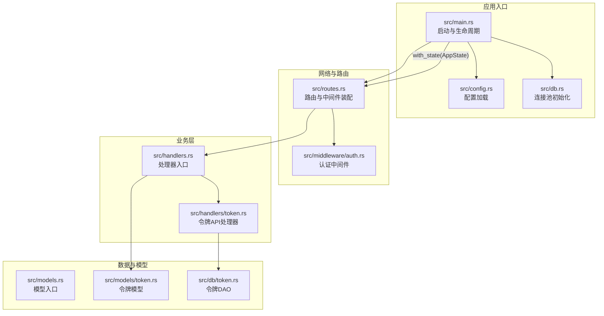
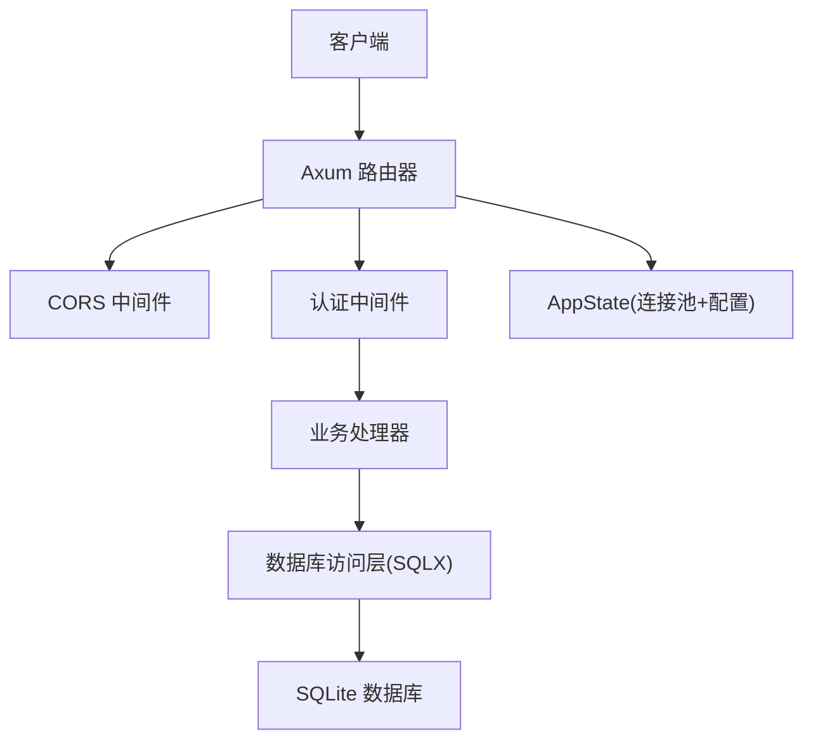
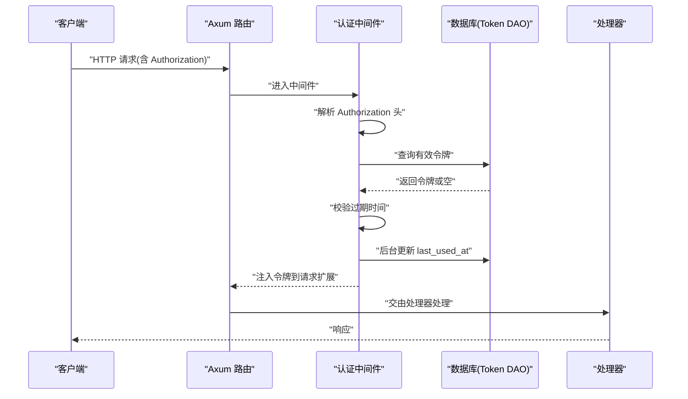
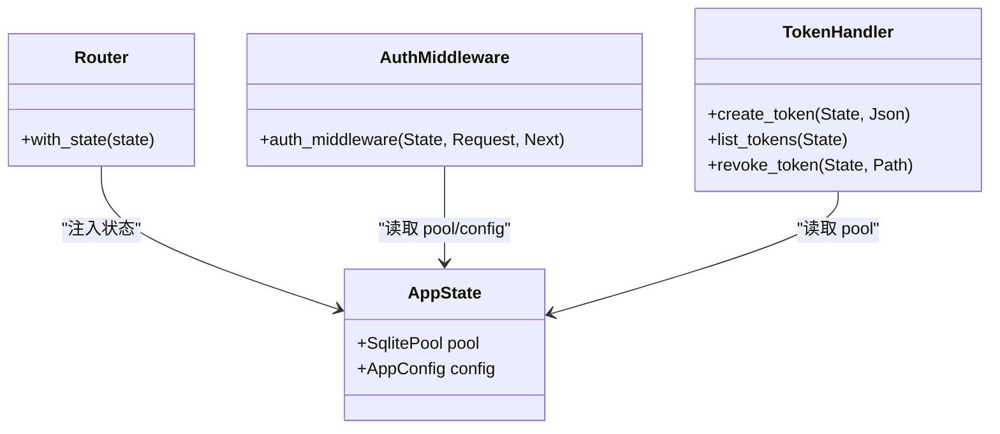
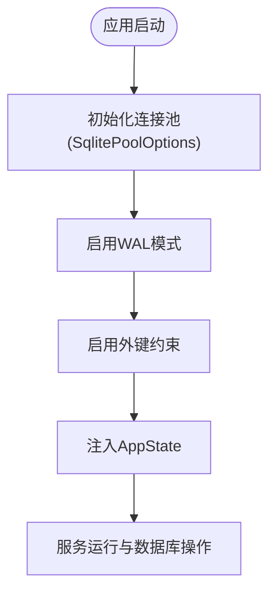
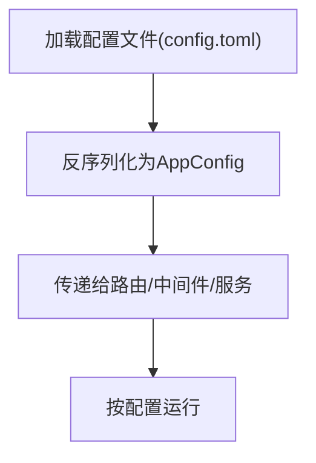
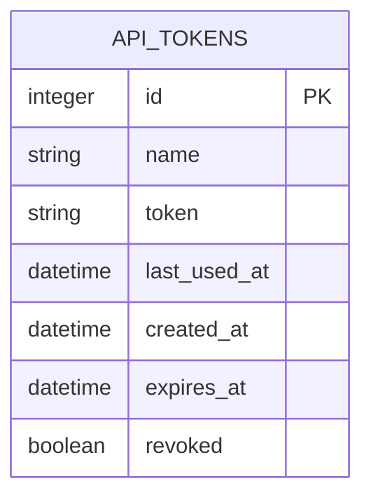
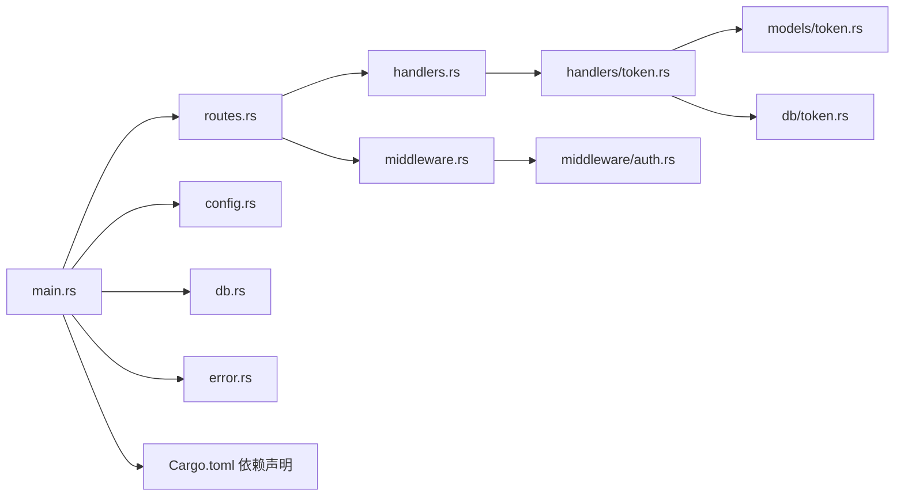

# 架构设计

<cite>
**本文引用的文件**
- [src/main.rs](file://src/main.rs)
- [src/routes.rs](file://src/routes.rs)
- [src/db.rs](file://src/db.rs)
- [src/config.rs](file://src/config.rs)
- [src/middleware.rs](file://src/middleware.rs)
- [src/middleware/auth.rs](file://src/middleware/auth.rs)
- [src/error.rs](file://src/error.rs)
- [src/handlers.rs](file://src/handlers.rs)
- [src/handlers/token.rs](file://src/handlers/token.rs)
- [src/models.rs](file://src/models.rs)
- [src/models/token.rs](file://src/models/token.rs)
- [src/db/token.rs](file://src/db/token.rs)
- [src/services.rs](file://src/services.rs)
- [config.toml](file://config.toml)
- [Cargo.toml](file://Cargo.toml)
</cite>

## 目录
1. [引言](#引言)
2. [项目结构](#项目结构)
3. [核心组件](#核心组件)
4. [架构总览](#架构总览)
5. [详细组件分析](#详细组件分析)
6. [依赖分析](#依赖分析)
7. [性能考量](#性能考量)
8. [故障排查指南](#故障排查指南)
9. [结论](#结论)
10. [附录](#附录)

## 引言
本项目为“AI趋势监控系统”，采用模块化与分层架构设计，围绕表示层（API路由）、业务层（处理器）、数据访问层（数据库操作）构建REST服务，并通过中间件实现认证控制。系统支持后台任务模块（Parser、Filter、Pusher），通过命令行参数选择运行模式，以满足不同场景下的部署需求。

## 项目结构
项目采用按功能域划分的模块组织方式：入口程序负责初始化配置、数据库连接池、迁移与启动HTTP服务器；路由模块定义API路径与中间件；处理器模块处理具体业务逻辑；模型与数据库模块提供数据结构与SQL操作；中间件模块提供认证能力；配置模块提供运行时参数；服务模块预留后台任务扩展点。

图表来源
- [src/main.rs:63-96](file://src/main.rs#L63-L96)
- [src/routes.rs:14-61](file://src/routes.rs#L14-L61)
- [src/db.rs:11-26](file://src/db.rs#L11-L26)
- [src/config.rs:52-59](file://src/config.rs#L52-L59)
- [src/middleware/auth.rs:18-60](file://src/middleware/auth.rs#L18-L60)
- [src/handlers/token.rs:18-66](file://src/handlers/token.rs#L18-L66)
- [src/models/token.rs:5-46](file://src/models/token.rs#L5-L46)
- [src/db/token.rs:6-107](file://src/db/token.rs#L6-L107)

章节来源
- [src/main.rs:1-96](file://src/main.rs#L1-L96)
- [src/routes.rs:1-61](file://src/routes.rs#L1-L61)
- [src/db.rs:1-26](file://src/db.rs#L1-L26)
- [src/config.rs:1-59](file://src/config.rs#L1-L59)
- [src/middleware.rs:1-3](file://src/middleware.rs#L1-L3)
- [src/middleware/auth.rs:1-60](file://src/middleware/auth.rs#L1-L60)
- [src/error.rs:1-79](file://src/error.rs#L1-L79)
- [src/handlers.rs:1-6](file://src/handlers.rs#L1-L6)
- [src/handlers/token.rs:1-66](file://src/handlers/token.rs#L1-L66)
- [src/models.rs:1-8](file://src/models.rs#L1-L8)
- [src/models/token.rs:1-46](file://src/models/token.rs#L1-L46)
- [src/db/token.rs:1-107](file://src/db/token.rs#L1-L107)
- [src/services.rs:1-6](file://src/services.rs#L1-L6)
- [config.toml:1-27](file://config.toml#L1-L27)
- [Cargo.toml:1-44](file://Cargo.toml#L1-L44)

## 核心组件
- 应用入口与生命周期
  - 解析CLI参数，加载配置，初始化SQLite连接池，执行数据库迁移，确保初始令牌存在，构建路由并启动HTTP服务。
- 路由与中间件
  - 定义REST端点与嵌套路由，注入AppState，挂载认证中间件，启用CORS。
- 认证中间件
  - 提取Authorization头中的Bearer令牌，校验有效性与未撤销状态，检查过期时间，异步更新最近使用时间，并将令牌信息注入请求扩展供后续处理器使用。
- 处理器与模型
  - 令牌相关API处理器负责创建、列出、吊销令牌；模型定义令牌实体及列表展示结构；DAO封装数据库读写。
- 配置管理
  - 支持服务器、数据库、认证、Parser、Filter、Pusher等子配置段，从本地配置文件加载。
- 错误与响应
  - 统一错误类型映射HTTP状态码，提供标准JSON响应体；数据库异常统一转换为内部错误。

章节来源
- [src/main.rs:16-96](file://src/main.rs#L16-L96)
- [src/routes.rs:14-61](file://src/routes.rs#L14-L61)
- [src/middleware/auth.rs:18-60](file://src/middleware/auth.rs#L18-L60)
- [src/handlers/token.rs:18-66](file://src/handlers/token.rs#L18-L66)
- [src/models/token.rs:5-46](file://src/models/token.rs#L5-L46)
- [src/db/token.rs:6-107](file://src/db/token.rs#L6-L107)
- [src/config.rs:52-59](file://src/config.rs#L52-L59)
- [src/error.rs:8-79](file://src/error.rs#L8-L79)

## 架构总览
系统采用三层架构与中间件模式：
- 表示层（API路由）：Axum Router定义端点，CORS与中间件层装配。
- 业务层（处理器）：各资源处理器实现业务逻辑，调用数据访问层。
- 数据访问层（数据库）：SQLX连接池与DAO模块封装SQL操作。
- 中间件层（认证）：统一鉴权与令牌校验，贯穿所有受保护路由。

图表来源
- [src/routes.rs:14-61](file://src/routes.rs#L14-L61)
- [src/middleware/auth.rs:18-60](file://src/middleware/auth.rs#L18-L60)
- [src/db.rs:11-26](file://src/db.rs#L11-L26)
- [src/main.rs:76-83](file://src/main.rs#L76-L83)

## 详细组件分析

### 管道模式与后台任务模块（Parser/Filter/Pusher）
- 设计意图
  - 将采集、过滤与推送流程拆分为独立模块，便于扩展与维护；通过配置项控制并发、批大小、间隔与重试策略。
- 运行模式
  - CLI提供运行模式参数，可选择仅启动API或同时启动后台任务模块；当前代码已预留服务模块入口，用于后续实现Parser、Filter、Pusher。
- 数据流
  - Parser负责抓取与解析；Filter进行关键词匹配与去重；Pusher负责向外部Webhook推送结果。三者通过共享状态与数据库进行解耦协作。
- 关键配置
  - Parser：最大并发抓取数、默认User-Agent、默认超时秒数。
  - Filter：批处理大小、轮询间隔、历史小时数、最小历史小时数。
  - Pusher：轮询间隔、最大重试次数、重试基础等待秒数。

章节来源
- [src/main.rs:18-24](file://src/main.rs#L18-L24)
- [src/services.rs:1-6](file://src/services.rs#L1-L6)
- [config.toml:12-27](file://config.toml#L12-L27)
- [src/config.rs:30-50](file://src/config.rs#L30-L50)

### 认证中间件实现机制
- 流程
  1) 从请求头提取Bearer令牌；
  2) 查询数据库验证令牌存在且未撤销；
  3) 检查过期时间；
  4) 后台异步更新最近使用时间；
  5) 将令牌对象注入请求扩展，供下游处理器使用。
- 错误处理
  - 缺失或格式不正确、无效或已撤销、已过期均返回401。
- 性能与可靠性
  - 使用fire-and-forget更新最近使用时间，避免阻塞主请求链路。

图表来源
- [src/middleware/auth.rs:18-60](file://src/middleware/auth.rs#L18-L60)
- [src/db/token.rs:40-59](file://src/db/token.rs#L40-L59)

章节来源
- [src/middleware/auth.rs:18-60](file://src/middleware/auth.rs#L18-L60)
- [src/db/token.rs:40-59](file://src/db/token.rs#L40-L59)

### 全局状态管理（AppState）
- 结构
  - 包含SqlitePool与AppConfig，通过with_state注入到路由，供中间件与处理器使用。
- 作用
  - 在整个请求生命周期内共享数据库连接池与运行配置，避免重复初始化与分散配置。

图表来源
- [src/routes.rs:56-61](file://src/routes.rs#L56-L61)
- [src/routes.rs:14-44](file://src/routes.rs#L14-L44)
- [src/middleware/auth.rs:18-22](file://src/middleware/auth.rs#L18-L22)
- [src/handlers/token.rs:18-66](file://src/handlers/token.rs#L18-L66)

章节来源
- [src/routes.rs:56-61](file://src/routes.rs#L56-L61)
- [src/routes.rs:14-44](file://src/routes.rs#L14-L44)

### SqlitePool连接池设计
- 初始化
  - 通过SqlitePoolOptions创建连接池，设置最大连接数；启用WAL模式与外键约束。
- 使用
  - 在应用启动阶段初始化并注入AppState；所有数据库操作通过该池执行。
- 约束与权衡
  - SQLite为单进程/单线程写入受限，WAL模式提升并发读取能力；连接数限制需结合实际负载评估。

图表来源
- [src/db.rs:11-26](file://src/db.rs#L11-L26)
- [src/main.rs:76-83](file://src/main.rs#L76-L83)

章节来源
- [src/db.rs:11-26](file://src/db.rs#L11-L26)
- [src/main.rs:76-83](file://src/main.rs#L76-L83)

### 配置管理系统
- 结构
  - AppConfig聚合多个子配置：Server、Database、Auth、Parser、Filter、Pusher。
- 加载
  - 从本地配置文件加载并反序列化为结构化配置。
- 使用
  - 在入口处加载后传递给路由与后台任务模块，确保一致的运行参数。

图表来源
- [src/config.rs:52-59](file://src/config.rs#L52-L59)
- [config.toml:1-27](file://config.toml#L1-L27)

章节来源
- [src/config.rs:1-59](file://src/config.rs#L1-L59)
- [config.toml:1-27](file://config.toml#L1-L27)

### 令牌API与数据模型
- 处理器职责
  - 创建令牌：生成随机令牌字符串，入库并返回完整令牌（明文仅在创建时可见）。
  - 列出令牌：返回精简信息（隐藏明文）。
  - 吊销令牌：软删除标记，返回204或404。
- 数据模型
  - ApiToken包含标识、名称、令牌值、最近使用时间、创建时间、过期时间与撤销标志；ApiTokenInfo用于列表响应，排除明文字段。
- 数据访问
  - DAO提供创建、查询、更新、吊销、统计、插入初始令牌等操作。

图表来源
- [src/models/token.rs:5-46](file://src/models/token.rs#L5-L46)
- [src/db/token.rs:6-107](file://src/db/token.rs#L6-L107)

章节来源
- [src/handlers/token.rs:18-66](file://src/handlers/token.rs#L18-L66)
- [src/models/token.rs:5-46](file://src/models/token.rs#L5-L46)
- [src/db/token.rs:6-107](file://src/db/token.rs#L6-L107)

### 错误处理与统一响应
- 错误类型
  - 统一映射为常见HTTP状态码：404、400、401、409、500。
- 数据库异常
  - 自动转换为内部错误，屏蔽底层细节。
- 响应体
  - 标准JSON包含错误码与消息，便于前端与集成方消费。

章节来源
- [src/error.rs:8-79](file://src/error.rs#L8-L79)

## 依赖分析
- 框架与运行时
  - Web框架：Axum、tower、tower-http
  - 并发：Tokio
  - 序列化：Serde、Serde_json、Toml
  - 时间：Chrono
  - 日志：Tracing、Tracing-subscriber
  - 数据库：SQLX(SQLite)
  - 工具：Clap、Rand、Hex、feed-rs、reqwest、aho-corasick
- 内部模块耦合
  - 路由依赖中间件与处理器；处理器依赖模型与数据库DAO；中间件依赖数据库DAO与错误类型；入口依赖配置与路由。

图表来源
- [src/main.rs:1-14](file://src/main.rs#L1-L14)
- [src/routes.rs:1-12](file://src/routes.rs#L1-L12)
- [src/handlers.rs:1-6](file://src/handlers.rs#L1-L6)
- [src/middleware.rs:1-3](file://src/middleware.rs#L1-L3)
- [src/handlers/token.rs:1-11](file://src/handlers/token.rs#L1-L11)
- [src/models/token.rs:1-4](file://src/models/token.rs#L1-L4)
- [src/db/token.rs:1-4](file://src/db/token.rs#L1-L4)
- [src/middleware/auth.rs:1-12](file://src/middleware/auth.rs#L1-L12)
- [src/error.rs:1-7](file://src/error.rs#L1-L7)
- [Cargo.toml:6-44](file://Cargo.toml#L6-L44)

章节来源
- [src/main.rs:1-14](file://src/main.rs#L1-L14)
- [src/routes.rs:1-12](file://src/routes.rs#L1-L12)
- [src/handlers.rs:1-6](file://src/handlers.rs#L1-L6)
- [src/middleware.rs:1-3](file://src/middleware.rs#L1-L3)
- [src/handlers/token.rs:1-11](file://src/handlers/token.rs#L1-L11)
- [src/models/token.rs:1-4](file://src/models/token.rs#L1-L4)
- [src/db/token.rs:1-4](file://src/db/token.rs#L1-L4)
- [src/middleware/auth.rs:1-12](file://src/middleware/auth.rs#L1-L12)
- [src/error.rs:1-7](file://src/error.rs#L1-L7)
- [Cargo.toml:6-44](file://Cargo.toml#L6-L44)

## 性能考量
- 连接池与并发
  - 当前连接池最大连接数为5，适合轻量级服务；若并发较高，建议根据QPS与I/O特性调整。
- 中间件开销
  - 认证中间件每次请求均需查询数据库，建议配合缓存或限流策略，减少热点令牌的查询压力。
- 数据库模式
  - WAL模式提升并发读取，但写入仍受SQLite单进程写入限制；建议合理规划写入峰值与批量提交。
- 后台任务
  - Parser/Filter/Pusher的批大小、间隔与重试策略需结合上游源速率与下游Webhook稳定性进行调优。

## 故障排查指南
- 401未授权
  - 检查请求头是否包含正确的Bearer令牌格式；确认令牌未撤销且未过期；查看控制台输出的初始令牌。
- 404资源不存在
  - 确认资源ID有效；部分操作会返回404以指示资源不存在。
- 数据库错误
  - 查看日志中的数据库错误信息；确认数据库文件路径与权限；检查迁移是否成功执行。
- 启动失败
  - 检查配置文件路径与内容；确认数据库目录存在；核对主机与端口占用情况。

章节来源
- [src/middleware/auth.rs:23-46](file://src/middleware/auth.rs#L23-L46)
- [src/error.rs:23-50](file://src/error.rs#L23-L50)
- [src/main.rs:70-83](file://src/main.rs#L70-L83)

## 结论
本系统通过清晰的分层架构与中间件模式实现了高内聚低耦合的服务设计。入口模块负责生命周期管理，路由与中间件提供统一的鉴权与跨域支持，业务层与数据访问层职责明确。配置驱动的设计使系统具备良好的可运维性与可扩展性。后台任务模块（Parser/Filter/Pusher）预留完善，可按需扩展实现采集、过滤与推送的流水线处理。

## 附录
- 系统边界
  - 表示层：Axum路由与中间件
  - 业务层：各资源处理器
  - 数据访问层：SQLX与DAO
  - 外部接口：SQLite数据库、Webhook推送（可选）
- 技术决策权衡
  - 使用SQLite适配轻量部署与开发环境；如需更高吞吐，可替换为PostgreSQL并调整连接池与索引策略。
  - 中间件采用同步校验与异步更新，平衡了安全性与延迟；在高并发下可引入令牌缓存与限流。
  - 配置文件与命令行参数分离，兼顾易用性与灵活性。