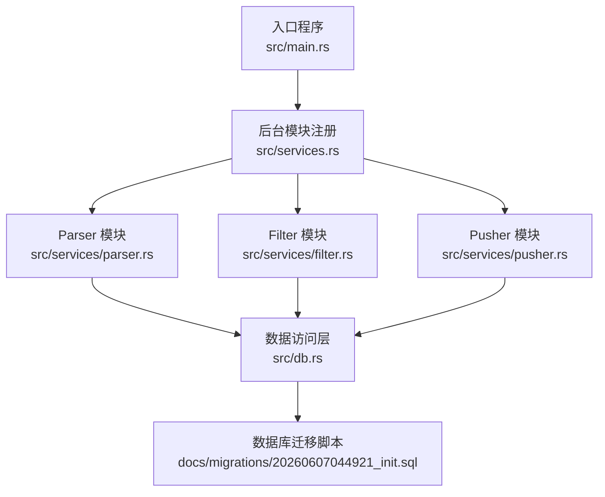
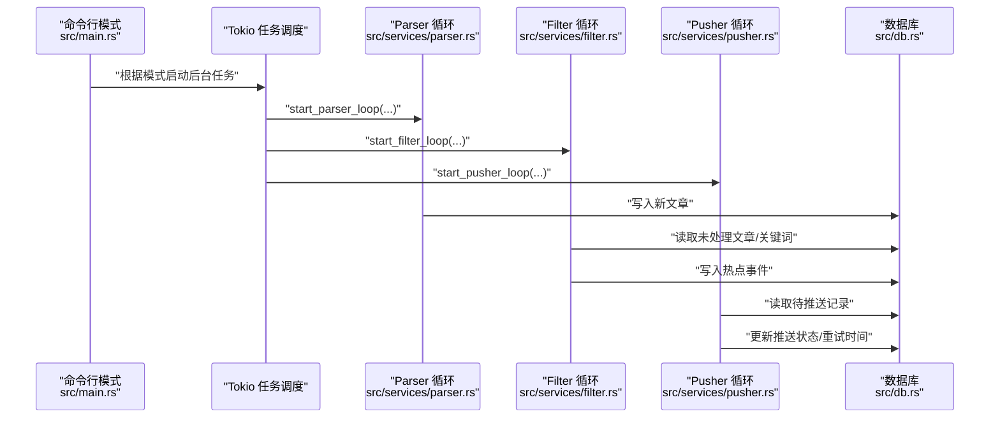
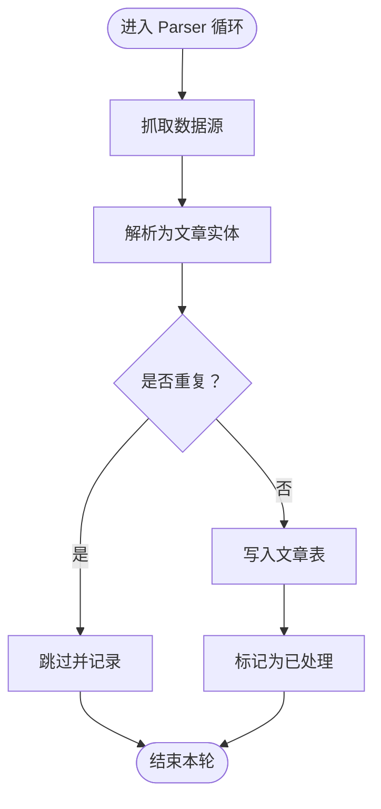
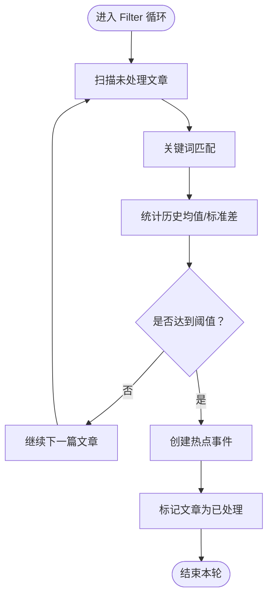
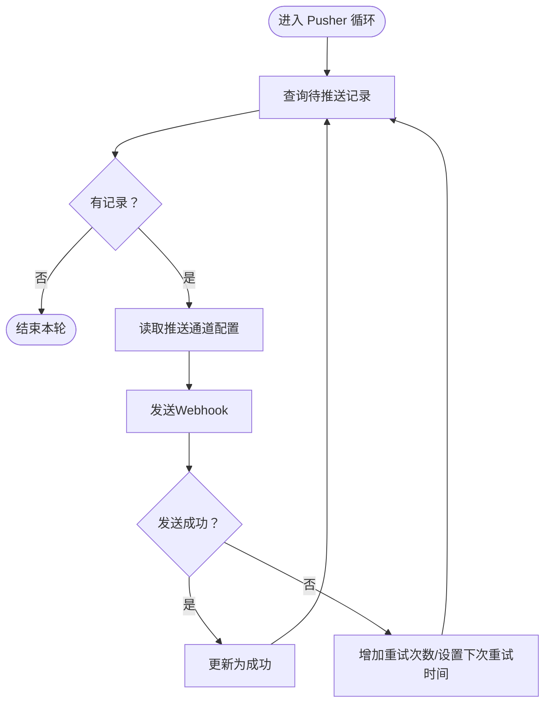
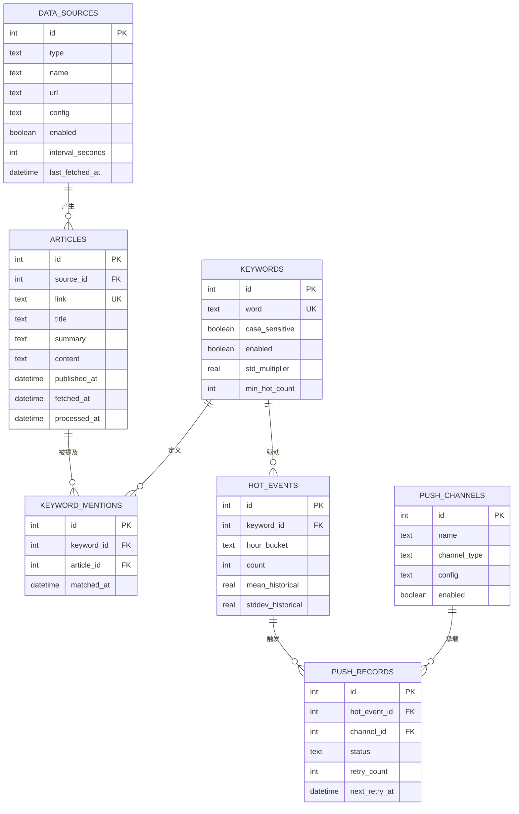
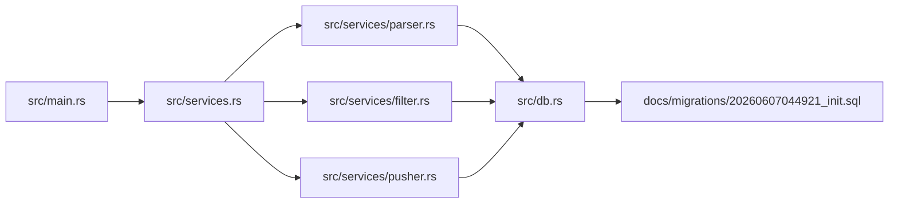

# 管道模式设计

<cite>
**本文引用的文件**
- [src/main.rs](file://src/main.rs)
- [src/services.rs](file://src/services.rs)
- [src/config.rs](file://src/config.rs)
- [src/db.rs](file://src/db.rs)
- [src/models/article.rs](file://src/models/article.rs)
- [src/models/hot_event.rs](file://src/models/hot_event.rs)
- [src/models/push_record.rs](file://src/models/push_record.rs)
- [src/db/article.rs](file://src/db/article.rs)
- [src/db/hot_event.rs](file://src/db/hot_event.rs)
- [src/db/push_record.rs](file://src/db/push_record.rs)
- [docs/plans/05-query-apis-and-background-modules.md](file://docs/plans/05-query-apis-and-background-modules.md)
- [docs/plans/02-database-migrations.md](file://docs/plans/02-database-migrations.md)
- [openspec/changes/query-apis-and-background-modules/design.md](file://openspec/changes/query-apis-and-background-modules/design.md)
- [openspec/changes/query-apis-and-background-modules/specs/trigger-apis/spec.md](file://openspec/changes/query-apis-and-background-modules/specs/trigger-apis/spec.md)
</cite>

## 目录
1. [引言](#引言)
2. [项目结构](#项目结构)
3. [核心组件](#核心组件)
4. [架构总览](#架构总览)
5. [详细组件分析](#详细组件分析)
6. [依赖分析](#依赖分析)
7. [性能考虑](#性能考虑)
8. [故障排查指南](#故障排查指南)
9. [结论](#结论)
10. [附录](#附录)

## 引言
本文件围绕“AI趋势监控系统”的管道模式设计展开，重点阐述Parser（解析器）、Filter（过滤器）、Pusher（推送器）三大后台模块的职责、运行机制与协作流程。系统通过定时循环任务从数据源抓取RSS/Atom等源的内容，基于关键词进行匹配，统计生成热点事件，并将结果以Webhook形式推送到配置的通道中。每个模块独立运行，支持手动触发与独立调试，具备清晰的任务调度、错误处理与重试策略。

## 项目结构
系统采用分层+模块化组织，核心后台模块位于services目录，数据库模型与查询封装在db与models目录，入口程序负责启动与调度，配置集中于config.rs，数据库迁移脚本位于docs/migrations。

图表来源
- [src/main.rs:1-120](file://src/main.rs#L1-L120)
- [src/services.rs:1-10](file://src/services.rs#L1-L10)
- [docs/plans/05-query-apis-and-background-modules.md:913-959](file://docs/plans/05-query-apis-and-background-modules.md#L913-L959)

章节来源
- [src/main.rs:1-120](file://src/main.rs#L1-L120)
- [src/services.rs:1-10](file://src/services.rs#L1-L10)
- [docs/plans/05-query-apis-and-background-modules.md:913-959](file://docs/plans/05-query-apis-and-background-modules.md#L913-L959)

## 核心组件
- Parser（解析器）：周期性抓取数据源（RSS/Atom/JSON Feed等），解析为文章实体，入库并标记为已抓取。
- Filter（过滤器）：周期性扫描未处理文章，按关键词规则匹配，计算统计指标，生成热点事件。
- Pusher（推送器）：周期性扫描待推送记录，按通道类型发送Webhook，支持指数退避重试。

章节来源
- [docs/plans/05-query-apis-and-background-modules.md:744-760](file://docs/plans/05-query-apis-and-background-modules.md#L744-L760)
- [docs/plans/05-query-apis-and-background-modules.md:761-800](file://docs/plans/05-query-apis-and-background-modules.md#L761-L800)
- [docs/plans/05-query-apis-and-background-modules.md:801-860](file://docs/plans/05-query-apis-and-background-modules.md#L801-L860)
- [docs/plans/05-query-apis-and-background-modules.md:861-912](file://docs/plans/05-query-apis-and-background-modules.md#L861-L912)

## 架构总览
后台模块通过Tokio并发执行，各自维护独立的循环任务；模块间通过数据库作为共享状态存储，实现无耦合的数据交换。入口程序根据CLI模式选择性启动模块，支持“all”“api”“parser”“filter”“pusher”五种模式。

图表来源
- [src/main.rs:921-959](file://src/main.rs#L921-L959)
- [src/services.rs:1-10](file://src/services.rs#L1-L10)

章节来源
- [src/main.rs:921-959](file://src/main.rs#L921-L959)
- [src/services.rs:1-10](file://src/services.rs#L1-L10)

## 详细组件分析

### Parser（解析器）模块
- 职责：周期性抓取数据源，解析为文章实体，去重入库，记录抓取时间。
- 运行机制：每config.parser.interval_seconds秒执行一次；支持扩展新的解析器类型（如JSON Feed、Atom），通过trait抽象避免调度循环改动。
- 数据流：抓取→解析→入库→标记processed_at。
- 错误处理：抓取失败或解析异常时记录错误并跳过该轮；不阻塞后续任务。

图表来源
- [docs/plans/05-query-apis-and-background-modules.md:744-760](file://docs/plans/05-query-apis-and-background-modules.md#L744-L760)
- [openspec/changes/query-apis-and-background-modules/design.md:56-68](file://openspec/changes/query-apis-and-background-modules/design.md#L56-L68)

章节来源
- [docs/plans/05-query-apis-and-background-modules.md:744-760](file://docs/plans/05-query-apis-and-background-modules.md#L744-L760)
- [openspec/changes/query-apis-and-background-modules/design.md:56-68](file://openspec/changes/query-apis-and-background-modules/design.md#L56-L68)

### Filter（过滤器）模块
- 职责：扫描未处理文章，按关键词规则匹配，统计历史均值与标准差，生成热点事件。
- 运行机制：每config.filter.interval_seconds秒执行一次；暴露run_filter_once供手动触发。
- 数据流：读取未处理文章→关键词匹配→统计计算→写入热点事件→标记processed_at。
- 错误处理：单篇文章处理失败不影响整体；异常计入日志并继续处理。

图表来源
- [docs/plans/05-query-apis-and-background-modules.md:761-800](file://docs/plans/05-query-apis-and-background-modules.md#L761-L800)
- [docs/plans/05-query-apis-and-background-modules.md:801-860](file://docs/plans/05-query-apis-and-background-modules.md#L801-L860)

章节来源
- [docs/plans/05-query-apis-and-background-modules.md:761-800](file://docs/plans/05-query-apis-and-background-modules.md#L761-L800)
- [docs/plans/05-query-apis-and-background-modules.md:801-860](file://docs/plans/05-query-apis-and-background-modules.md#L801-L860)

### Pusher（推送器）模块
- 职责：扫描待推送记录，按通道类型发送Webhook，支持指数退避重试。
- 运行机制：每config.pusher.interval_seconds秒执行一次；暴露run_pusher_once供手动触发。
- 数据流：读取待推送记录→选择通道→发送Webhook→更新状态/重试时间。
- 错误处理：失败记录递增retry_count并设置下次重试时间；超过重试上限后置为failed。

图表来源
- [docs/plans/05-query-apis-and-background-modules.md:861-912](file://docs/plans/05-query-apis-and-background-modules.md#L861-L912)

章节来源
- [docs/plans/05-query-apis-and-background-modules.md:861-912](file://docs/plans/05-query-apis-and-background-modules.md#L861-L912)

### 模块间协作与数据传递
- Parser写入articles表，Filter读取未处理文章并写入hot_events，Pusher读取push_records并写回状态。
- 三者通过数据库共享状态，无需直接通信，降低耦合度。
- 配置通过config.rs注入到各模块，支持独立调整运行间隔与行为。

图表来源
- [docs/plans/02-database-migrations.md:25-145](file://docs/plans/02-database-migrations.md#L25-L145)

章节来源
- [docs/plans/02-database-migrations.md:25-145](file://docs/plans/02-database-migrations.md#L25-L145)

## 依赖分析
- 入口程序依赖Tokio并发调度，按模式启动对应后台任务。
- 各模块依赖数据库层进行读写，数据库层依赖迁移脚本定义schema。
- 模块间无直接依赖，仅通过数据库交互，耦合度低，便于独立演进。

图表来源
- [src/main.rs:921-959](file://src/main.rs#L921-L959)
- [src/services.rs:1-10](file://src/services.rs#L1-L10)
- [docs/plans/02-database-migrations.md:25-145](file://docs/plans/02-database-migrations.md#L25-L145)

章节来源
- [src/main.rs:921-959](file://src/main.rs#L921-L959)
- [src/services.rs:1-10](file://src/services.rs#L1-L10)
- [docs/plans/02-database-migrations.md:25-145](file://docs/plans/02-database-migrations.md#L25-L145)

## 性能考虑
- 并发模型：使用Tokio多任务并发，Parser/Filter/Pusher互不阻塞，提升吞吐。
- 调度粒度：模块按独立间隔运行，避免长耗时操作影响其他模块。
- 数据库索引：为高频查询字段建立索引（如articles.processed_at、hot_events.keyword_id/hour_bucket、push_records.status），减少查询延迟。
- 扩展性：新增解析器类型通过trait抽象，无需修改调度循环；新增通道类型通过统一接口扩展。
- I/O优化：抓取与网络请求应设置超时与重试，避免阻塞循环。

## 故障排查指南
- Parser抓取失败：检查数据源URL与网络连通性；查看日志定位具体源；确认去重逻辑与入库异常。
- Filter未生成热点事件：核对关键词配置（大小写敏感、阈值、最小热度数）；确认文章是否标记为已处理；检查统计窗口与历史数据。
- Pusher推送失败：检查通道配置（URL、鉴权）；查看重试次数与下次重试时间；确认HTTP响应码与超时设置。
- 手动触发：通过POST /api/v1/trigger/filter与POST /api/v1/trigger/pusher立即执行一次对应模块，验证功能正常后再恢复定时任务。

章节来源
- [openspec/changes/query-apis-and-background-modules/specs/trigger-apis/spec.md:1-30](file://openspec/changes/query-apis-and-background-modules/specs/trigger-apis/spec.md#L1-L30)

## 结论
该管道模式通过Parser、Filter、Pusher三段式流水线，实现了从内容抓取、关键词匹配、热点生成到Webhook推送的完整链路。模块独立运行、任务解耦、数据共享，具备良好的可维护性与扩展性。配合手动触发与独立调试能力，能够快速定位问题并保障线上稳定性。

## 附录
- 配置项参考：Parser/Filter/Pusher分别具有各自的interval_seconds等配置，可在config.rs中调整。
- 数据模型参考：详见docs/migrations/20260607044921_init.sql中的DDL定义。
- 启动模式参考：main.rs中支持all、api、parser、filter、pusher五种模式，按需选择。