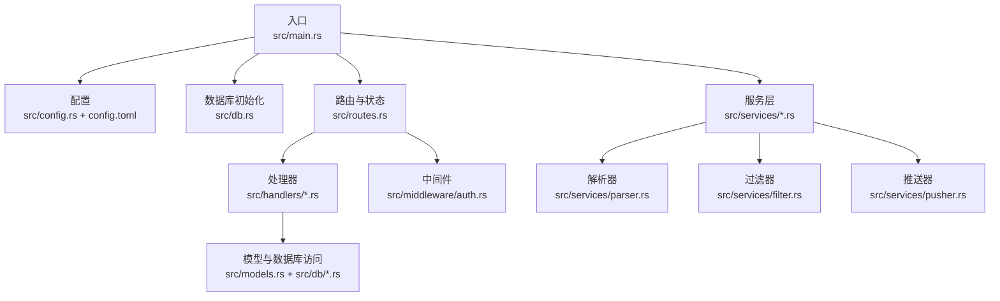
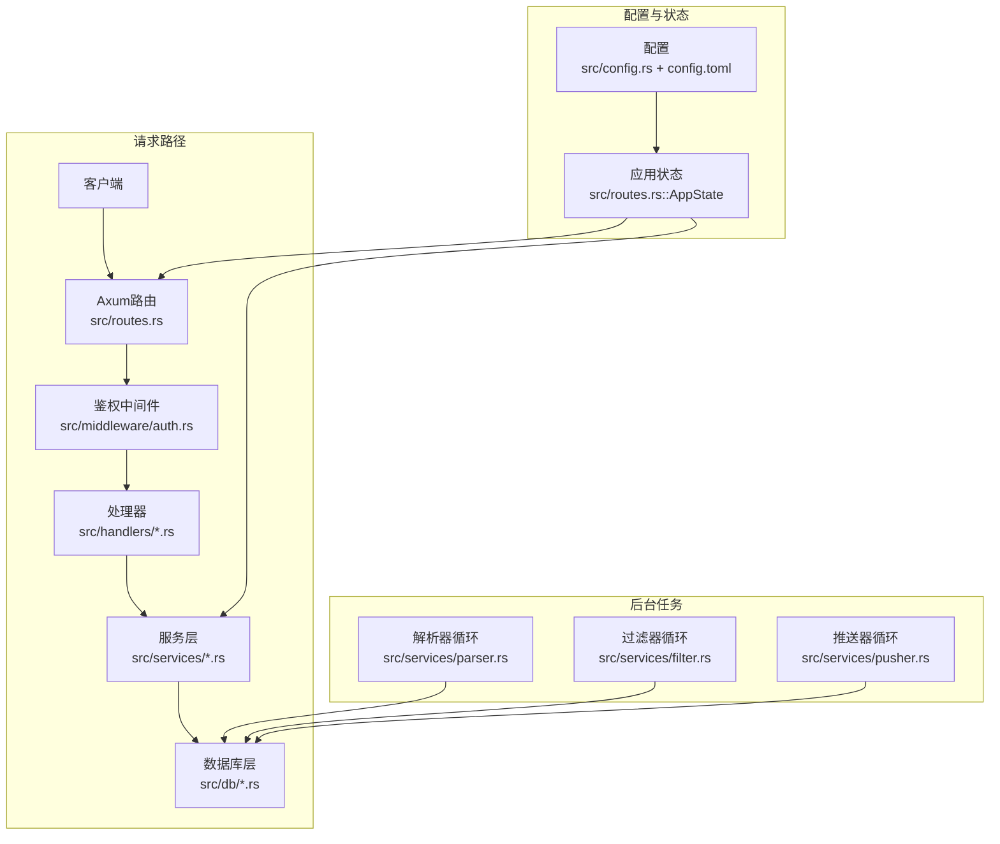
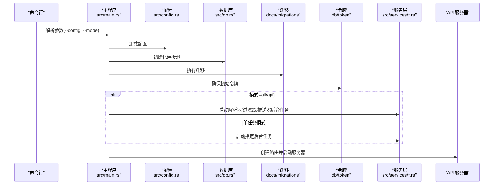
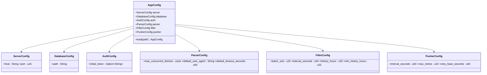
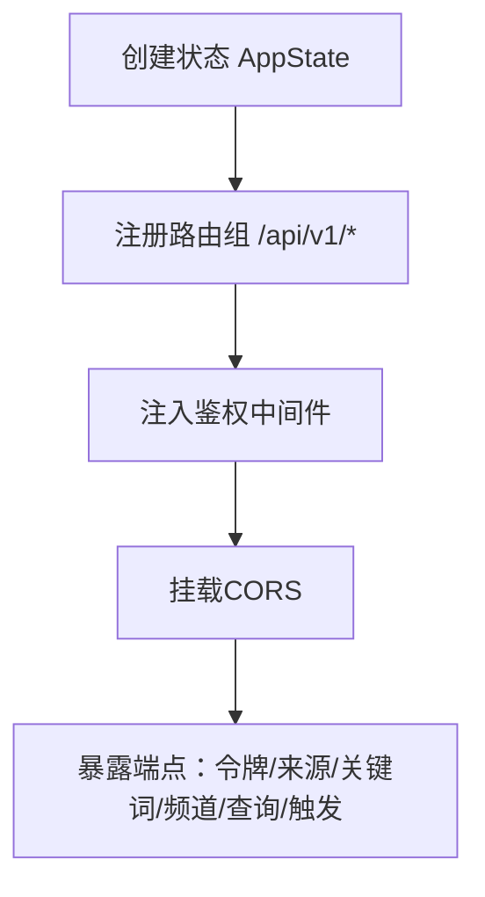
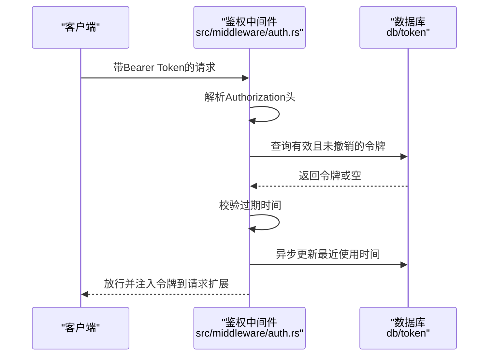
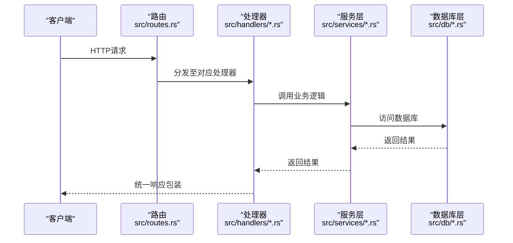
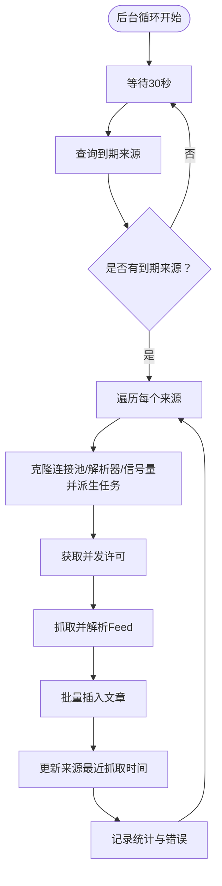
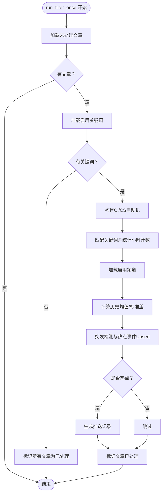
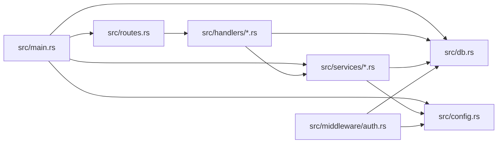

# 组件交互与集成

<cite>
**本文引用的文件**
- [src/main.rs](file://src/main.rs)
- [src/config.rs](file://src/config.rs)
- [src/db.rs](file://src/db.rs)
- [src/routes.rs](file://src/routes.rs)
- [src/services.rs](file://src/services.rs)
- [src/services/parser.rs](file://src/services/parser.rs)
- [src/services/filter.rs](file://src/services/filter.rs)
- [src/services/pusher.rs](file://src/services/pusher.rs)
- [src/handlers.rs](file://src/handlers.rs)
- [src/handlers/channel.rs](file://src/handlers/channel.rs)
- [src/handlers/query.rs](file://src/handlers/query.rs)
- [src/middleware/auth.rs](file://src/middleware/auth.rs)
- [src/models.rs](file://src/models.rs)
- [Cargo.toml](file://Cargo.toml)
- [config.toml](file://config.toml)
</cite>

## 目录
1. [引言](#引言)
2. [项目结构](#项目结构)
3. [核心组件](#核心组件)
4. [架构总览](#架构总览)
5. [详细组件分析](#详细组件分析)
6. [依赖关系分析](#依赖关系分析)
7. [性能考量](#性能考量)
8. [故障排查指南](#故障排查指南)
9. [结论](#结论)
10. [附录](#附录)

## 引言
本文件面向“AI趋势监控系统”的组件交互与集成，系统通过解析RSS/Atom源、关键词过滤与突发检测、Webhook推送三阶段流水线完成从数据采集到告警通知的闭环。主程序负责配置加载、数据库初始化与迁移、初始令牌校验、API服务器启动以及后台任务（解析器、过滤器、推送器）的调度；API层提供REST接口与鉴权中间件；服务层封装业务逻辑；处理器层承接HTTP请求并调用服务层；数据库层通过SQLx访问SQLite。

## 项目结构
系统采用按职责分层的模块化组织：入口与配置、路由与中间件、处理器、服务、模型与数据库访问、以及配置文件与迁移脚本。核心文件如下：
- 入口与控制流：src/main.rs
- 配置：src/config.rs、config.toml
- 数据库：src/db.rs、docs/migrations/*（迁移）
- 路由与状态：src/routes.rs
- 中间件：src/middleware/auth.rs
- 处理器：src/handlers.rs 及其子模块
- 服务：src/services.rs 及其子模块（parser、filter、pusher）
- 模型：src/models.rs 及其子模块
- 依赖：Cargo.toml



图表来源
- [src/main.rs:64-164](file://src/main.rs#L64-L164)
- [src/routes.rs:14-67](file://src/routes.rs#L14-L67)
- [src/services.rs:1-4](file://src/services.rs#L1-L4)

章节来源
- [src/main.rs:1-164](file://src/main.rs#L1-L164)
- [src/config.rs:1-58](file://src/config.rs#L1-L58)
- [src/db.rs:1-27](file://src/db.rs#L1-L27)
- [src/routes.rs:1-67](file://src/routes.rs#L1-L67)
- [src/services.rs:1-4](file://src/services.rs#L1-L4)
- [Cargo.toml:1-47](file://Cargo.toml#L1-L47)
- [config.toml:1-27](file://config.toml#L1-L27)

## 核心组件
- 主程序与控制流：负责日志初始化、CLI参数解析、配置加载、数据库连接池初始化与迁移、首次令牌确保、模式选择与后台任务调度、API服务器启动。
- 配置系统：集中管理服务器、数据库、鉴权、解析器、过滤器、推送器等配置项，并支持从文件加载。
- 数据库层：统一的SQLite连接池初始化、WAL模式与外键约束启用、迁移执行。
- 路由与状态：Axum路由注册、CORS、认证中间件注入、应用状态（数据库连接池与配置）传递。
- 处理器：提供令牌、来源、关键词、频道、查询等API端点，返回统一响应包装。
- 服务层：解析器（RSS/Atom）、过滤器（关键词匹配、突发检测、热点记录、推送记录生成）、推送器（Webhook发送、重试与乐观锁更新）。
- 中间件：基于Bearer Token的鉴权，校验令牌有效性、过期时间，异步更新最近使用时间，并在请求扩展中注入令牌信息。

章节来源
- [src/main.rs:64-164](file://src/main.rs#L64-L164)
- [src/config.rs:51-58](file://src/config.rs#L51-L58)
- [src/db.rs:12-27](file://src/db.rs#L12-L27)
- [src/routes.rs:14-67](file://src/routes.rs#L14-L67)
- [src/middleware/auth.rs:18-60](file://src/middleware/auth.rs#L18-L60)
- [src/services/parser.rs:103-192](file://src/services/parser.rs#L103-L192)
- [src/services/filter.rs:13-284](file://src/services/filter.rs#L13-L284)
- [src/services/pusher.rs:11-243](file://src/services/pusher.rs#L11-L243)

## 架构总览
系统采用“请求驱动 + 后台任务”混合架构：
- 请求驱动：API请求经中间件鉴权后进入处理器，处理器调用服务层，服务层访问数据库层。
- 后台任务：解析器周期性抓取RSS/Atom源并入库；过滤器周期性扫描未处理文章，进行关键词匹配与突发检测，生成推送记录；推送器周期性拉取待推送记录并通过Webhook发送。



图表来源
- [src/main.rs:86-121](file://src/main.rs#L86-L121)
- [src/routes.rs:14-67](file://src/routes.rs#L14-L67)
- [src/services/parser.rs:103-192](file://src/services/parser.rs#L103-L192)
- [src/services/filter.rs:277-284](file://src/services/filter.rs#L277-L284)
- [src/services/pusher.rs:236-243](file://src/services/pusher.rs#L236-L243)

## 详细组件分析

### 主程序与启动流程
- 日志初始化：基于环境变量设置日志级别。
- CLI参数：支持配置文件路径与运行模式（all/api/parser/filter/pusher）。
- 配置加载：从指定文件加载配置。
- 数据目录与连接池：确保数据目录存在，初始化SQLite连接池并启用WAL与外键。
- 迁移执行：应用数据库迁移脚本。
- 初始令牌：若无有效令牌则自动生成或使用配置中的初始令牌。
- 模式分支：
  - all/api：启动解析器、过滤器、推送器三个后台任务，随后启动API服务器。
  - parser/filter/pusher：仅启动对应单个后台任务。
  - 其他：回退到默认all模式。
- API服务器：绑定地址与端口，启动Axum服务。



图表来源
- [src/main.rs:64-164](file://src/main.rs#L64-L164)
- [src/config.rs:51-58](file://src/config.rs#L51-L58)
- [src/db.rs:12-27](file://src/db.rs#L12-L27)

章节来源
- [src/main.rs:64-164](file://src/main.rs#L64-L164)

### 配置系统
- 结构化配置：包含服务器、数据库、鉴权、解析器、过滤器、推送器各段。
- 文件加载：以TOML格式读取配置文件。
- 运行时使用：主程序与服务层均直接消费配置，避免额外注入。



图表来源
- [src/config.rs:3-58](file://src/config.rs#L3-L58)

章节来源
- [src/config.rs:1-58](file://src/config.rs#L1-L58)
- [config.toml:1-27](file://config.toml#L1-L27)

### 路由与状态
- 应用状态：包含数据库连接池与配置对象，通过State在中间件与处理器之间共享。
- 路由注册：统一挂载健康检查、版本前缀、CORS与鉴权中间件。
- API覆盖：令牌管理、来源管理、关键词管理、频道管理、查询接口、手动触发过滤与推送。



图表来源
- [src/routes.rs:14-67](file://src/routes.rs#L14-L67)

章节来源
- [src/routes.rs:14-67](file://src/routes.rs#L14-L67)

### 鉴权中间件
- 提取Authorization头，校验Bearer格式。
- 查询数据库验证令牌存在且未撤销。
- 校验过期时间。
- 异步更新最近使用时间。
- 将令牌写入请求扩展供下游使用。



图表来源
- [src/middleware/auth.rs:18-60](file://src/middleware/auth.rs#L18-L60)

章节来源
- [src/middleware/auth.rs:18-60](file://src/middleware/auth.rs#L18-L60)

### 处理器与API契约
- 令牌：创建、列表、撤销。
- 来源：列表、创建、更新、删除、触发抓取。
- 关键词：列表、创建、更新、删除。
- 频道：列表、创建、更新、删除。
- 查询：文章列表、热点列表、热点详情、趋势曲线、手动触发过滤与推送。
- 统一响应包装：处理器返回统一的响应体结构。



图表来源
- [src/routes.rs:20-50](file://src/routes.rs#L20-L50)
- [src/handlers/channel.rs:15-71](file://src/handlers/channel.rs#L15-L71)
- [src/handlers/query.rs:47-169](file://src/handlers/query.rs#L47-L169)

章节来源
- [src/handlers.rs:1-7](file://src/handlers.rs#L1-L7)
- [src/handlers/channel.rs:1-71](file://src/handlers/channel.rs#L1-L71)
- [src/handlers/query.rs:1-169](file://src/handlers/query.rs#L1-L169)

### 解析器（Parser）
- 抽象接口：Parser trait，支持不同Feed类型扩展。
- 默认实现：RssParser，基于feed-rs解析RSS/Atom，使用reqwest按配置限制超时与UA。
- 后台循环：每30秒查询到期来源，使用信号量限制并发，插入文章并更新来源最近抓取时间。



图表来源
- [src/services/parser.rs:103-192](file://src/services/parser.rs#L103-L192)

章节来源
- [src/services/parser.rs:11-97](file://src/services/parser.rs#L11-L97)
- [src/services/parser.rs:103-192](file://src/services/parser.rs#L103-L192)

### 过滤器（Filter）
- 单次执行：加载未处理文章、加载启用关键词、构建Aho-Corasick自动机、匹配关键词并统计小时计数、计算历史均值与标准差、突发检测、生成热点事件与推送记录、标记文章已处理。
- 后台循环：按配置间隔执行单次过滤。



图表来源
- [src/services/filter.rs:13-284](file://src/services/filter.rs#L13-L284)

章节来源
- [src/services/filter.rs:13-284](file://src/services/filter.rs#L13-L284)

### 推送器（Pusher）
- 单次执行：合并待推送与到期重试记录，逐条处理。
- 单条处理：查找频道与热点事件及关键词，提取Webhook URL，构造消息体，POST发送，成功则乐观锁更新为成功，失败则指数回退并更新下次重试时间。
- 后台循环：按配置间隔执行单次推送。

```mermaid
sequenceDiagram
participant Loop as "推送器循环<br/>src/services/pusher.rs"
participant DB as "数据库"
participant CH as "频道"
participant HE as "热点事件"
participant KW as "关键词"
participant HTTP as "Webhook服务"
Loop->>DB : 查询待推送/到期重试记录
DB-->>Loop : 返回可推送记录
loop 对每条记录
Loop->>CH : 获取频道配置
CH-->>Loop : 返回频道
Loop->>HE : 获取热点事件
HE-->>Loop : 返回热点事件
Loop->>KW : 获取关键词
KW-->>Loop : 返回关键词
Loop->>HTTP : POST Webhook
alt 成功
Loop->>DB : 乐观锁更新为成功
else 失败
Loop->>DB : 指数回退并更新下次重试
end
end
```

图表来源
- [src/services/pusher.rs:11-243](file://src/services/pusher.rs#L11-L243)

章节来源
- [src/services/pusher.rs:11-243](file://src/services/pusher.rs#L11-L243)

### 数据模型与数据库交互
- 模块化模型：article、channel、hot_event、keyword、keyword_mention、push_record、source、token。
- 数据库访问：各模块提供CRUD与查询方法，配合事务与错误处理。
- 连接池：统一初始化与WAL/外键配置。

章节来源
- [src/models.rs:1-9](file://src/models.rs#L1-L9)
- [src/db.rs:12-27](file://src/db.rs#L12-L27)

## 依赖关系分析
- 运行时依赖：Tokio（异步运行时）、Axum（Web框架）、SQLx（数据库ORM）、reqwest（HTTP客户端）、feed-rs（RSS解析）、aho-corasick（多模式匹配）、chrono（时间）、clap（CLI）、tracing（日志）。
- 模块内聚与耦合：
  - 主程序对配置、数据库、服务层、路由有强依赖，但通过状态与池传递，降低重复初始化。
  - 服务层内部解耦良好，通过trait与配置驱动。
  - 处理器仅依赖服务层与数据库访问，不直接操作底层细节。
  - 中间件仅依赖数据库与配置，职责单一。



图表来源
- [src/main.rs:64-164](file://src/main.rs#L64-L164)
- [src/routes.rs:14-67](file://src/routes.rs#L14-L67)
- [src/services.rs:1-4](file://src/services.rs#L1-L4)
- [src/middleware/auth.rs:18-60](file://src/middleware/auth.rs#L18-L60)

章节来源
- [Cargo.toml:6-47](file://Cargo.toml#L6-L47)

## 性能考量
- 并发控制：解析器使用信号量限制并发抓取，避免资源争用。
- 批量处理：过滤器按批次处理未处理文章，减少频繁查询开销。
- 历史统计：热点检测基于滑动窗口的历史均值与方差，避免全表扫描。
- 重试策略：推送器采用指数回退与最大重试次数，平衡可靠性与资源消耗。
- 数据库优化：WAL模式提升并发写入性能，外键约束保证一致性。

## 故障排查指南
- 启动阶段
  - 配置文件路径错误：确认--config参数指向正确文件。
  - 数据库路径不存在：确保父目录存在或允许自动创建。
  - 迁移失败：检查迁移脚本与数据库权限。
  - 初始令牌：若无令牌，系统会输出一次性令牌，请妥善保存。
- API阶段
  - 鉴权失败：确认Authorization头格式为Bearer Token，令牌未撤销且未过期。
  - CORS问题：确认前端域名与CORS策略。
- 后台任务
  - 解析器：检查来源URL可达性、User-Agent与超时配置。
  - 过滤器：确认关键词启用状态与历史小时数满足阈值。
  - 推送器：检查频道配置JSON包含有效URL，网络连通性与目标服务可用性。

章节来源
- [src/main.rs:27-62](file://src/main.rs#L27-L62)
- [src/middleware/auth.rs:18-60](file://src/middleware/auth.rs#L18-L60)
- [src/services/parser.rs:107-190](file://src/services/parser.rs#L107-L190)
- [src/services/filter.rs:13-284](file://src/services/filter.rs#L13-L284)
- [src/services/pusher.rs:11-243](file://src/services/pusher.rs#L11-L243)

## 结论
本系统通过清晰的分层设计与模块化组件实现了从数据采集、内容过滤、突发检测到告警推送的完整链路。主程序负责启动与编排，服务层封装核心算法，处理器与中间件提供安全可控的API入口，数据库层保障数据一致性与性能。通过配置驱动与后台任务，系统具备良好的可运维性与扩展性。

## 附录
- 系统边界
  - 内部：主程序、配置、路由、中间件、处理器、服务、数据库。
  - 外部：RSS/Atom源、Webhook目标服务、SQLite文件。
- 第三方服务对接
  - RSS/Atom源：通过feed-rs解析，受User-Agent与超时配置影响。
  - Webhook推送：从频道配置JSON中提取URL，使用reqwest发送JSON负载。
- 集成示例
  - 创建频道：POST /api/v1/channels，Body包含name与config（JSON字符串，需包含url字段）。
  - 触发过滤：POST /api/v1/trigger/filter。
  - 触发推送：POST /api/v1/trigger/pusher。

章节来源
- [src/services/pusher.rs:228-233](file://src/services/pusher.rs#L228-L233)
- [src/handlers/channel.rs:26-53](file://src/handlers/channel.rs#L26-L53)
- [src/handlers/query.rs:154-168](file://src/handlers/query.rs#L154-L168)