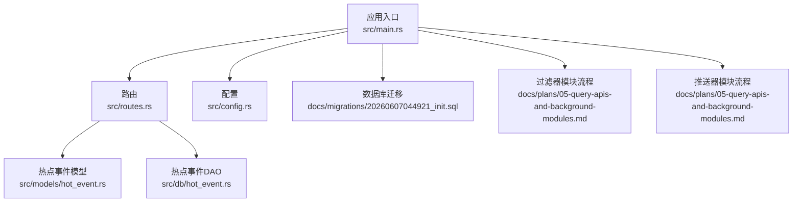
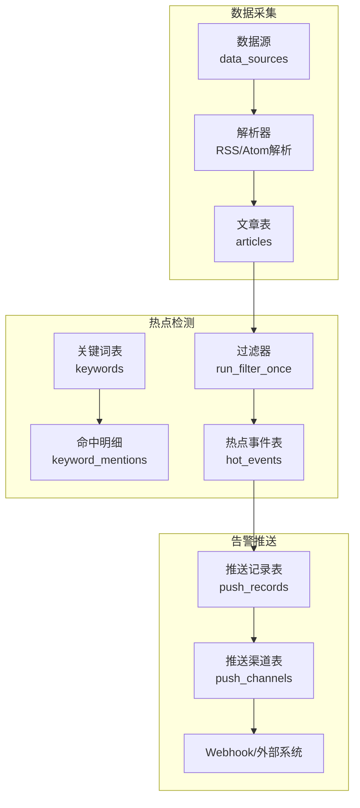
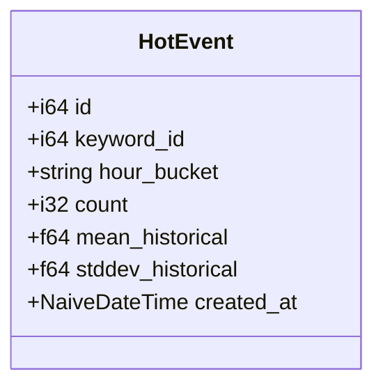
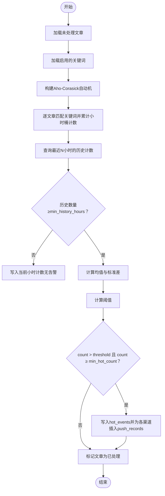
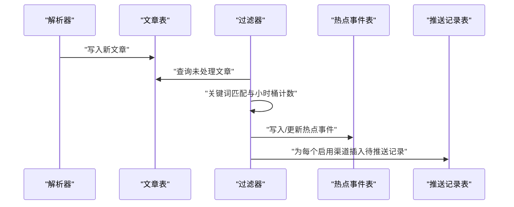
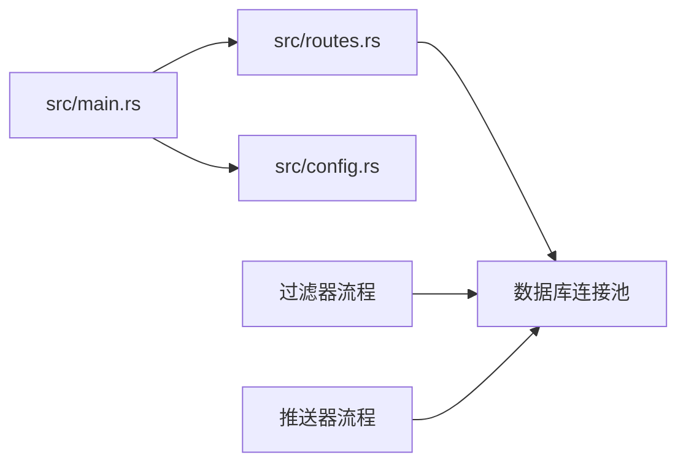

# AI热点事件监测

<cite>
**本文档引用的文件**
- [src/main.rs](file://src/main.rs)
- [src/config.rs](file://src/config.rs)
- [src/routes.rs](file://src/routes.rs)
- [src/models/hot_event.rs](file://src/models/hot_event.rs)
- [src/db/hot_event.rs](file://src/db/hot_event.rs)
- [src/models/article.rs](file://src/models/article.rs)
- [src/models/keyword.rs](file://src/models/keyword.rs)
- [docs/migrations/20260607044921_init.sql](file://docs/migrations/20260607044921_init.sql)
- [docs/plans/05-query-apis-and-background-modules.md](file://docs/plans/05-query-apis-and-background-modules.md)
</cite>

## 目录
1. [简介](#简介)
2. [项目结构](#项目结构)
3. [核心组件](#核心组件)
4. [架构总览](#架构总览)
5. [详细组件分析](#详细组件分析)
6. [依赖关系分析](#依赖关系分析)
7. [性能考量](#性能考量)
8. [故障排查指南](#故障排查指南)
9. [结论](#结论)
10. [附录](#附录)

## 简介
本项目是一个基于Rust的AI热点事件监测系统，核心目标是围绕关键词进行实时热点检测与告警。系统通过定时抓取文章、关键词匹配、统计分析与阈值判断，生成热点事件并推送到配置的推送渠道。本文档将深入解析热点事件的定义、检测算法与实时监控机制，详述HotEvent数据模型设计，以及与文章聚合、关键词分析的集成关系，并提供性能优化与扩展性建议。

## 项目结构
系统采用模块化组织，主要目录与职责如下：
- src/main.rs：应用入口，初始化数据库、迁移、路由与服务循环
- src/config.rs：应用配置结构体，包含服务器、数据库、认证、解析器、过滤器、推送器等配置
- src/routes.rs：路由定义，挂载API与中间件
- src/models/*：数据模型定义（HotEvent、Article、Keyword等）
- src/db/*：数据库访问层（DAO），封装SQL操作
- docs/migrations/*：数据库初始化迁移脚本
- docs/plans/*：背景模块与流程设计文档（解析、过滤、推送）

**图表来源**
- [src/main.rs:63-96](file://src/main.rs#L63-L96)
- [src/routes.rs:14-48](file://src/routes.rs#L14-L48)
- [src/config.rs:52-59](file://src/config.rs#L52-L59)
- [docs/migrations/20260607044921_init.sql:75-118](file://docs/migrations/20260607044921_init.sql#L75-L118)
- [docs/plans/05-query-apis-and-background-modules.md:531-740](file://docs/plans/05-query-apis-and-background-modules.md#L531-L740)

**章节来源**
- [src/main.rs:63-96](file://src/main.rs#L63-L96)
- [src/routes.rs:14-48](file://src/routes.rs#L14-L48)
- [src/config.rs:52-59](file://src/config.rs#L52-L59)
- [docs/migrations/20260607044921_init.sql:75-118](file://docs/migrations/20260607044921_init.sql#L75-L118)

## 核心组件
- 热点事件模型（HotEvent）：承载关键词、小时桶、计数、历史均值与标准差、创建时间等字段
- 数据库表（hot_events）：持久化热点事件，带关键词索引与小时桶索引
- 过滤器（Filter）：周期性扫描未处理文章，构建关键词自动机，按小时桶统计命中，计算均值与标准差，判定热点并写入hot_events
- 推送器（Pusher）：周期性扫描待推送记录，按渠道类型发送告警消息
- 路由与中间件：提供健康检查与受保护的API端点

**章节来源**
- [src/models/hot_event.rs:5-14](file://src/models/hot_event.rs#L5-L14)
- [docs/migrations/20260607044921_init.sql:75-89](file://docs/migrations/20260607044921_init.sql#L75-L89)
- [docs/plans/05-query-apis-and-background-modules.md:531-740](file://docs/plans/05-query-apis-and-background-modules.md#L531-L740)
- [docs/plans/05-query-apis-and-background-modules.md:744-909](file://docs/plans/05-query-apis-and-background-modules.md#L744-L909)

## 架构总览
系统采用“抓取-过滤-推送”的流水线架构。解析器负责从数据源抓取文章；过滤器负责关键词匹配与热点检测；推送器负责将热点事件推送到配置的渠道。

**图表来源**
- [docs/migrations/20260607044921_init.sql:14-48](file://docs/migrations/20260607044921_init.sql#L14-L48)
- [docs/migrations/20260607044921_init.sql:50-74](file://docs/migrations/20260607044921_init.sql#L50-L74)
- [docs/migrations/20260607044921_init.sql:75-118](file://docs/migrations/20260607044921_init.sql#L75-L118)
- [docs/plans/05-query-apis-and-background-modules.md:531-740](file://docs/plans/05-query-apis-and-background-modules.md#L531-L740)
- [docs/plans/05-query-apis-and-background-modules.md:744-909](file://docs/plans/05-query-apis-and-background-modules.md#L744-L909)

## 详细组件分析

### HotEvent数据模型设计
HotEvent用于描述一个关键词在某个小时桶内的热点状态，包含以下字段：
- id：主键
- keyword_id：关联关键词
- hour_bucket：小时桶，格式为YYYYMMDDHH
- count：当前小时命中计数
- mean_historical：历史均值
- stddev_historical：历史标准差
- created_at：创建时间

该模型映射到hot_events表，具备：
- keyword_id索引：加速按关键词查询
- hour_bucket索引：加速按小时桶范围查询

**图表来源**
- [src/models/hot_event.rs:5-14](file://src/models/hot_event.rs#L5-L14)

**章节来源**
- [src/models/hot_event.rs:5-14](file://src/models/hot_event.rs#L5-L14)
- [docs/migrations/20260607044921_init.sql:75-89](file://docs/migrations/20260607044921_init.sql#L75-L89)

### 热点检测算法与实时监控
热点检测的核心流程如下：
- 时间窗口：以UTC小时为单位划分hour_bucket
- 统计：对最近history_hours个完整小时的count求均值mean与标准差stddev
- 阈值：threshold = mean + std_multiplier × stddev
- 触发条件：当前小时count > threshold 且 count ≥ min_hot_count
- 写入：若满足阈值，插入或替换hot_events记录，并为每个启用的推送渠道插入push_records

**图表来源**
- [docs/plans/05-query-apis-and-background-modules.md:531-740](file://docs/plans/05-query-apis-and-background-modules.md#L531-L740)

**章节来源**
- [docs/plans/05-query-apis-and-background-modules.md:531-740](file://docs/plans/05-query-apis-and-background-modules.md#L531-L740)

### 数据库表结构与索引
hot_events表的关键列与索引：
- 关键列：keyword_id、hour_bucket、count、mean_historical、stddev_historical、created_at
- 索引：idx_hot_events_keyword、idx_hot_events_bucket

这些索引确保了按关键词与按小时桶的高效查询，支撑热点检测与趋势分析。

**章节来源**
- [docs/migrations/20260607044921_init.sql:75-89](file://docs/migrations/20260607044921_init.sql#L75-L89)

### 业务逻辑：数据采集、热度计算、趋势分析与异常检测
- 数据采集：解析器周期性抓取RSS/Atom源，去重插入articles，更新last_fetched_at
- 热度计算：过滤器按小时桶统计关键词命中，计算历史均值与标准差
- 趋势分析：通过get_hourly_counts按关键词聚合最近N小时的总量，用于趋势可视化
- 异常检测：当当前小时计数超过阈值且达到最小阈值时，判定为热点事件

**章节来源**
- [docs/plans/05-query-apis-and-background-modules.md:419-503](file://docs/plans/05-query-apis-and-background-modules.md#L419-L503)
- [docs/plans/05-query-apis-and-background-modules.md:531-740](file://docs/plans/05-query-apis-and-background-modules.md#L531-L740)
- [src/db/hot_event.rs:62-80](file://src/db/hot_event.rs#L62-L80)

### 代码示例：创建、查询与更新热点事件
以下示例展示热点事件相关的典型操作（以路径代替具体代码）：
- 创建热点事件
  - DAO调用：[src/db/hot_event.rs:5-24](file://src/db/hot_event.rs#L5-L24)
  - 过滤器写入：[docs/plans/05-query-apis-and-background-modules.md:658-668](file://docs/plans/05-query-apis-and-background-modules.md#L658-L668)
- 查询热点事件
  - 按关键词查询：[src/db/hot_event.rs:26-38](file://src/db/hot_event.rs#L26-L38)
  - 最近热点查询：[src/db/hot_event.rs:40-50](file://src/db/hot_event.rs#L40-L50)
  - 按ID查询：[src/db/hot_event.rs:52-60](file://src/db/hot_event.rs#L52-L60)
  - 小时粒度聚合：[src/db/hot_event.rs:62-80](file://src/db/hot_event.rs#L62-L80)
- 更新热点事件
  - 过滤器中使用INSERT OR REPLACE更新历史统计与当前小时计数：[docs/plans/05-query-apis-and-background-modules.md:658-668](file://docs/plans/05-query-apis-and-background-modules.md#L658-L668)

**章节来源**
- [src/db/hot_event.rs:5-80](file://src/db/hot_event.rs#L5-L80)
- [docs/plans/05-query-apis-and-background-modules.md:658-668](file://docs/plans/05-query-apis-and-background-modules.md#L658-L668)

### 与其他模块的集成
- 与文章聚合的集成：解析器将新文章写入articles，过滤器读取未处理文章进行关键词匹配
- 与关键词分析的集成：过滤器加载keywords，构建Aho-Corasick自动机，按关键词统计命中
- 与推送模块的集成：热点事件触发后，为每个启用的推送渠道插入push_records，推送器轮询并发送告警

**图表来源**
- [docs/plans/05-query-apis-and-background-modules.md:531-740](file://docs/plans/05-query-apis-and-background-modules.md#L531-L740)
- [docs/plans/05-query-apis-and-background-modules.md:744-909](file://docs/plans/05-query-apis-and-background-modules.md#L744-L909)

**章节来源**
- [docs/plans/05-query-apis-and-background-modules.md:531-740](file://docs/plans/05-query-apis-and-background-modules.md#L531-L740)
- [docs/plans/05-query-apis-and-background-modules.md:744-909](file://docs/plans/05-query-apis-and-background-modules.md#L744-L909)

## 依赖关系分析
- 应用入口依赖配置、路由与数据库池
- 路由依赖中间件与状态对象（包含数据库池与配置）
- 过滤器与推送器依赖数据库池与配置
- 数据模型与数据库层通过SQLX进行交互

**图表来源**
- [src/main.rs:63-96](file://src/main.rs#L63-L96)
- [src/routes.rs:14-48](file://src/routes.rs#L14-L48)
- [src/config.rs:52-59](file://src/config.rs#L52-L59)

**章节来源**
- [src/main.rs:63-96](file://src/main.rs#L63-L96)
- [src/routes.rs:14-48](file://src/routes.rs#L14-L48)
- [src/config.rs:52-59](file://src/config.rs#L52-L59)

## 性能考量
- 索引优化：hot_events表的keyword_id与hour_bucket索引可显著提升查询效率
- 批量处理：过滤器在批量更新articles.processed_at时采用分批IN子句，避免大参数列表
- 并发控制：解析器使用信号量限制并发抓取，避免资源争用
- 周期调度：过滤器与推送器采用固定间隔轮询，可根据负载调整间隔
- 存储选择：SQLite适合轻量场景，若需更高吞吐，可评估其他数据库并调整索引与查询

**章节来源**
- [docs/migrations/20260607044921_init.sql:88-89](file://docs/migrations/20260607044921_init.sql#L88-L89)
- [docs/plans/05-query-apis-and-background-modules.md:708-721](file://docs/plans/05-query-apis-and-background-modules.md#L708-L721)
- [docs/plans/05-query-apis-and-background-modules.md:429-503](file://docs/plans/05-query-apis-and-background-modules.md#L429-L503)

## 故障排查指南
- 热点未触发：检查关键词配置（std_multiplier、min_hot_count）、历史小时数量是否满足min_history_hours、当前小时计数是否超过阈值
- 告警未推送：检查push_channels是否启用、push_records状态是否为pending或可重试、webhook URL是否有效
- 数据库异常：确认数据库迁移已执行、索引是否存在、查询语句是否正确
- 日志定位：过滤器与推送器均输出详细日志，可通过日志级别与上下文定位问题

**章节来源**
- [docs/plans/05-query-apis-and-background-modules.md:633-646](file://docs/plans/05-query-apis-and-background-modules.md#L633-L646)
- [docs/plans/05-query-apis-and-background-modules.md:744-909](file://docs/plans/05-query-apis-and-background-modules.md#L744-L909)

## 结论
本系统通过清晰的数据模型与模块化设计，实现了从数据采集、关键词匹配、热点检测到告警推送的完整闭环。HotEvent模型简洁而完备，配合历史统计与阈值判断，能够稳定地识别热点事件。通过索引优化、批量处理与并发控制，系统在轻量部署场景下具备良好性能。未来可考虑引入更丰富的统计模型与更灵活的阈值策略，以适应更复杂的热点检测需求。

## 附录
- 配置项参考：服务器、数据库、认证、解析器、过滤器、推送器配置结构
- API端点：健康检查与令牌管理端点（受认证中间件保护）

**章节来源**
- [src/config.rs:52-59](file://src/config.rs#L52-L59)
- [src/routes.rs:14-48](file://src/routes.rs#L14-L48)