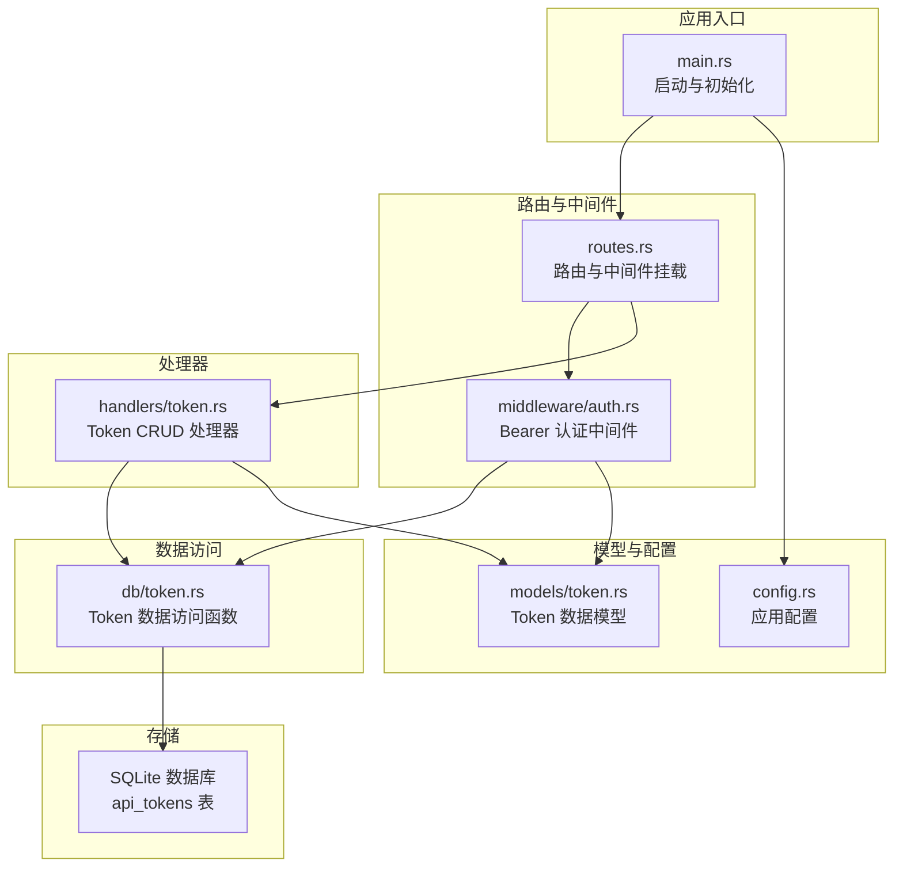
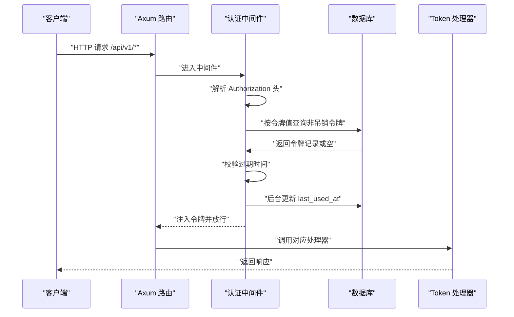
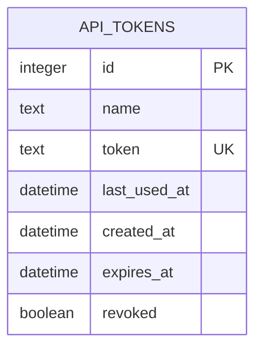
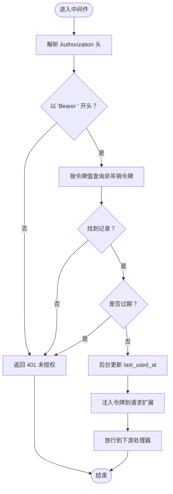
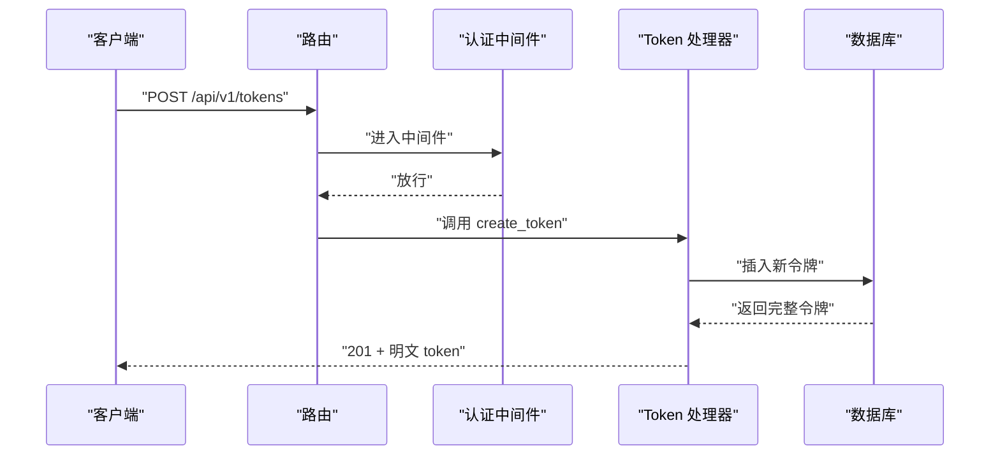
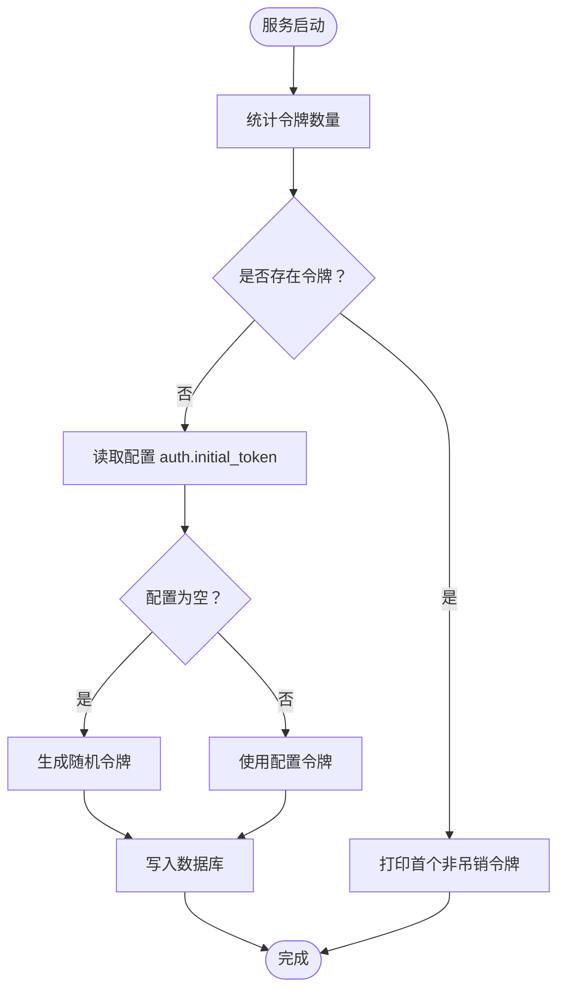
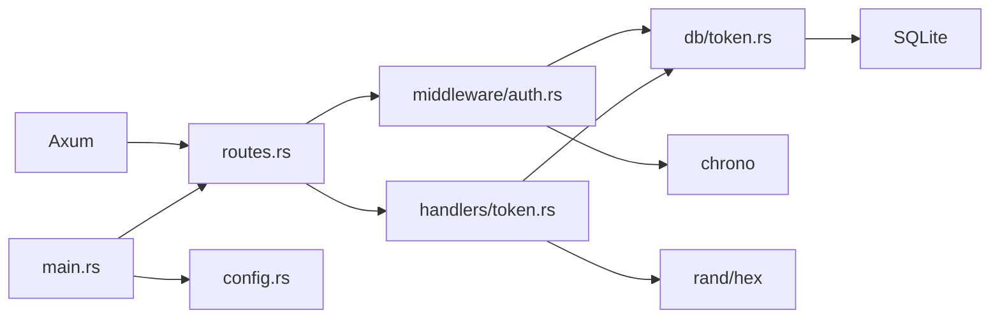

# 令牌认证系统

<cite>
**本文档引用的文件**
- [src/models/token.rs](file://src/models/token.rs)
- [src/db/token.rs](file://src/db/token.rs)
- [src/handlers/token.rs](file://src/handlers/token.rs)
- [src/middleware/auth.rs](file://src/middleware/auth.rs)
- [src/routes.rs](file://src/routes.rs)
- [src/error.rs](file://src/error.rs)
- [src/main.rs](file://src/main.rs)
- [docs/apis/token-api.md](file://docs/apis/token-api.md)
- [docs/plans/03-auth-and-token-api.md](file://docs/plans/03-auth-and-token-api.md)
- [docs/migrations/20260607044921_init.sql](file://docs/migrations/20260607044921_init.sql)
- [src/config.rs](file://src/config.rs)
- [Cargo.toml](file://Cargo.toml)
</cite>

## 目录
1. [简介](#简介)
2. [项目结构](#项目结构)
3. [核心组件](#核心组件)
4. [架构总览](#架构总览)
5. [详细组件分析](#详细组件分析)
6. [依赖关系分析](#依赖关系分析)
7. [性能考虑](#性能考虑)
8. [故障排除指南](#故障排除指南)
9. [结论](#结论)
10. [附录](#附录)

## 简介
本文件为“令牌认证系统”的技术文档，聚焦于基于 Bearer Token 的认证机制与 Token API 的实现。系统采用 SQLite 存储 API Token，并通过中间件在请求进入业务处理器前进行校验；支持令牌创建、列表查询、吊销等操作；提供健康检查端点与统一错误格式。本文将从数据模型、JWT 兼容性设计、中间件工作流、API 规范、权限与安全最佳实践等方面进行全面阐述。

## 项目结构
后端采用 Rust + Axum 架构，按职责分层组织：
- models 层：定义数据模型与序列化结构
- db 层：封装数据库访问函数
- handlers 层：HTTP 请求处理器
- middleware 层：认证中间件
- routes 层：路由注册与中间件挂载
- config 层：应用配置加载
- docs：API 文档与迁移脚本

图表来源
- [src/main.rs:63-96](file://src/main.rs#L63-L96)
- [src/routes.rs:14-61](file://src/routes.rs#L14-L61)
- [src/middleware/auth.rs:18-60](file://src/middleware/auth.rs#L18-L60)
- [src/handlers/token.rs:13-66](file://src/handlers/token.rs#L13-L66)
- [src/db/token.rs:6-107](file://src/db/token.rs#L6-L107)
- [src/models/token.rs:5-46](file://src/models/token.rs#L5-L46)
- [src/config.rs:26-28](file://src/config.rs#L26-L28)

章节来源
- [src/main.rs:63-96](file://src/main.rs#L63-L96)
- [src/routes.rs:14-61](file://src/routes.rs#L14-L61)
- [src/middleware/auth.rs:18-60](file://src/middleware/auth.rs#L18-L60)
- [src/handlers/token.rs:13-66](file://src/handlers/token.rs#L13-L66)
- [src/db/token.rs:6-107](file://src/db/token.rs#L6-L107)
- [src/models/token.rs:5-46](file://src/models/token.rs#L5-L46)
- [src/config.rs:26-28](file://src/config.rs#L26-L28)

## 核心组件
- Token 数据模型：包含标识、名称、令牌值、最后使用时间、创建时间、过期时间、是否吊销等字段；提供列表响应时隐藏明文的包装结构。
- 数据访问层：提供创建、列表、按 ID/值查询、更新最后使用时间、吊销、统计、删除等方法。
- 认证中间件：从 Authorization 头提取 Bearer 令牌，查询数据库校验有效性与过期状态，异步更新最后使用时间，并将令牌信息注入请求扩展。
- Token API 处理器：负责创建新令牌（生成 64 字节十六进制字符串）、列出令牌（隐藏明文）、吊销令牌。
- 路由与状态：统一挂载认证中间件到 /api/v1 路由组，提供健康检查端点。
- 错误与响应：统一错误类型与响应格式，支持标准 HTTP 状态码与错误码。
- 初始化引导：首次启动时确保至少存在一个有效令牌，可来自配置或自动生成并在日志中提示。

章节来源
- [src/models/token.rs:5-46](file://src/models/token.rs#L5-L46)
- [src/db/token.rs:6-107](file://src/db/token.rs#L6-L107)
- [src/middleware/auth.rs:18-60](file://src/middleware/auth.rs#L18-L60)
- [src/handlers/token.rs:13-66](file://src/handlers/token.rs#L13-L66)
- [src/routes.rs:14-61](file://src/routes.rs#L14-L61)
- [src/error.rs:8-79](file://src/error.rs#L8-L79)
- [src/main.rs:29-61](file://src/main.rs#L29-L61)

## 架构总览
下图展示从客户端请求到数据库校验再到业务处理的整体流程，以及认证中间件如何在请求链路中拦截并校验令牌。

图表来源
- [src/middleware/auth.rs:18-60](file://src/middleware/auth.rs#L18-L60)
- [src/db/token.rs:40-48](file://src/db/token.rs#L40-L48)
- [src/handlers/token.rs:18-30](file://src/handlers/token.rs#L18-L30)
- [src/routes.rs:44-44](file://src/routes.rs#L44-L44)

## 详细组件分析

### 数据模型与存储设计
- 表结构：api_tokens 表包含唯一令牌值、名称、创建时间、过期时间、最后使用时间、是否吊销等字段；索引覆盖常用查询场景。
- 模型映射：ApiToken 用于完整令牌信息（含明文），ApiTokenInfo 用于列表响应（隐藏明文）。
- 请求模型：CreateTokenRequest 仅包含名称与可选过期时间。

图表来源
- [docs/migrations/20260607044921_init.sql:4-12](file://docs/migrations/20260607044921_init.sql#L4-L12)
- [src/models/token.rs:5-25](file://src/models/token.rs#L5-L25)

章节来源
- [docs/migrations/20260607044921_init.sql:4-12](file://docs/migrations/20260607044921_init.sql#L4-L12)
- [src/models/token.rs:5-46](file://src/models/token.rs#L5-L46)

### 认证中间件工作原理
- 请求拦截：在 /api/v1 路由组上挂载中间件，拦截所有子请求。
- 令牌提取：从 Authorization 头解析 Bearer 令牌。
- 数据库校验：按令牌值查询非吊销令牌，不存在或已吊销则拒绝。
- 过期检查：若设置过期时间且已过期则拒绝。
- 异步更新：在后台协程中更新 last_used_at，避免阻塞主响应。
- 上下文注入：将令牌对象放入请求扩展，供后续处理器读取。

图表来源
- [src/middleware/auth.rs:18-60](file://src/middleware/auth.rs#L18-L60)
- [src/db/token.rs:40-48](file://src/db/token.rs#L40-L48)

章节来源
- [src/middleware/auth.rs:18-60](file://src/middleware/auth.rs#L18-L60)
- [src/db/token.rs:40-48](file://src/db/token.rs#L40-L48)

### Token API 设计与实现
- POST /api/v1/tokens：创建新令牌，生成 64 字节十六进制字符串，仅在创建响应中返回明文令牌。
- GET /api/v1/tokens：列出所有令牌，返回隐藏明文的 ApiTokenInfo 结构，按创建时间倒序。
- POST /api/v1/tokens/revoke/{id}：吊销指定令牌（软删除），设置 revoked=1。
- 路由挂载：在 /api/v1 下统一应用认证中间件，除健康检查外均需认证。

图表来源
- [src/handlers/token.rs:18-30](file://src/handlers/token.rs#L18-L30)
- [src/db/token.rs:6-20](file://src/db/token.rs#L6-L20)
- [src/routes.rs:21-24](file://src/routes.rs#L21-L24)

章节来源
- [src/handlers/token.rs:13-66](file://src/handlers/token.rs#L13-L66)
- [src/routes.rs:14-61](file://src/routes.rs#L14-L61)
- [docs/apis/token-api.md:62-198](file://docs/apis/token-api.md#L62-L198)

### 初始化引导与配置
- 首次启动：若 api_tokens 表为空，优先使用配置中的初始令牌，否则自动生成并打印到日志，同时写入数据库。
- 运行时提示：启动后会打印当前可用的首个非吊销令牌，便于复制使用。
- 配置项：auth.initial_token 支持外部注入初始令牌。

图表来源
- [src/main.rs:29-61](file://src/main.rs#L29-L61)
- [src/db/token.rs:69-98](file://src/db/token.rs#L69-L98)
- [src/config.rs:26-28](file://src/config.rs#L26-L28)

章节来源
- [src/main.rs:29-61](file://src/main.rs#L29-L61)
- [src/config.rs:26-28](file://src/config.rs#L26-L28)
- [src/db/token.rs:69-98](file://src/db/token.rs#L69-L98)

### 权限控制与角色管理
- 当前实现：系统采用单层令牌访问控制，所有 /api/v1/* 路由均需有效令牌；未实现细粒度角色/权限位。
- 扩展建议：可在 ApiToken 模型中增加 role/permissions 字段，中间件在放行前根据角色判定访问权限；或引入独立的角色/权限表并通过中间件进行授权决策。

章节来源
- [src/middleware/auth.rs:18-60](file://src/middleware/auth.rs#L18-L60)
- [src/models/token.rs:5-46](file://src/models/token.rs#L5-L46)

### JWT 令牌生成、验证与刷新机制
- 生成：当前实现使用 32 字节随机数生成 64 字节十六进制令牌字符串，作为“API 密钥式”令牌。
- 验证：中间件从头中提取令牌，查询数据库确认非吊销且未过期。
- 刷新：当前未实现刷新机制；如需支持，建议引入 refresh_token 表与刷新端点，或采用短期 access_token + 刷新令牌的模式。
- 兼容性：当前为 Bearer API Key 模式，非标准 JWT；如需兼容 OAuth2.0 或 JWT，可在中间件中增加 JWT 解析与声明校验逻辑，并在处理器中读取上下文中的用户身份。

章节来源
- [src/handlers/token.rs:22-24](file://src/handlers/token.rs#L22-L24)
- [src/middleware/auth.rs:36-46](file://src/middleware/auth.rs#L36-L46)
- [docs/plans/03-auth-and-token-api.md:211-346](file://docs/plans/03-auth-and-token-api.md#L211-L346)

### API 端点规范
- 基础信息
  - Base URL: http://localhost:8080
  - 认证方式: Bearer Token
  - 所有 /api/v1/* 路由均需认证
- 错误格式
  - 统一错误体包含 code 与 message
  - 支持 400/401/404/409/500 等状态码
- 端点清单
  - GET /health：健康检查，无需认证
  - POST /api/v1/tokens：创建令牌（返回明文）
  - GET /api/v1/tokens：列出令牌（隐藏明文）
  - POST /api/v1/tokens/revoke/{id}：吊销令牌

章节来源
- [docs/apis/token-api.md:1-198](file://docs/apis/token-api.md#L1-L198)
- [src/routes.rs:46-54](file://src/routes.rs#L46-L54)
- [src/error.rs:23-50](file://src/error.rs#L23-L50)

### 审计日志与追踪
- 启动日志：打印初始令牌或首个可用令牌，便于运维复制与记录。
- 数据库日志：错误处理中记录数据库异常，便于定位问题。
- 建议增强：在中间件中增加请求级追踪 ID 与访问日志，记录认证结果、IP、User-Agent、耗时等。

章节来源
- [src/main.rs:57-60](file://src/main.rs#L57-L60)
- [src/error.rs:32-38](file://src/error.rs#L32-L38)

### 客户端集成示例
- 获取初始令牌：启动后从日志复制 INITIAL TOKEN
- 创建新令牌：使用初始令牌调用 POST /api/v1/tokens，保存返回的明文 token
- 访问受保护端点：在 Authorization 头中携带 Bearer <token>
- 列出与吊销：使用初始令牌调用 GET /api/v1/tokens 与 POST /api/v1/tokens/revoke/{id}

章节来源
- [docs/apis/token-api.md:62-198](file://docs/apis/token-api.md#L62-L198)
- [src/main.rs:57-60](file://src/main.rs#L57-L60)

## 依赖关系分析
- 组件耦合
  - 中间件依赖数据库查询与时间库，耦合度适中
  - 处理器依赖中间件注入的令牌信息与数据库访问函数
  - 路由层统一挂载中间件，降低各处理器重复逻辑
- 外部依赖
  - Axum/Tower：Web 框架与中间件生态
  - SQLx/SQLite：数据库访问与迁移
  - Chrono：时间与时区处理
  - Rand/Hex：随机令牌生成
  - Tracing：日志与追踪

图表来源
- [Cargo.toml:8-43](file://Cargo.toml#L8-L43)
- [src/routes.rs:14-61](file://src/routes.rs#L14-L61)
- [src/middleware/auth.rs:18-60](file://src/middleware/auth.rs#L18-L60)
- [src/handlers/token.rs:18-30](file://src/handlers/token.rs#L18-L30)
- [src/db/token.rs:6-107](file://src/db/token.rs#L6-L107)
- [src/main.rs:63-96](file://src/main.rs#L63-L96)
- [src/config.rs:26-28](file://src/config.rs#L26-L28)

章节来源
- [Cargo.toml:8-43](file://Cargo.toml#L8-L43)
- [src/routes.rs:14-61](file://src/routes.rs#L14-L61)
- [src/middleware/auth.rs:18-60](file://src/middleware/auth.rs#L18-L60)
- [src/handlers/token.rs:18-30](file://src/handlers/token.rs#L18-L30)
- [src/db/token.rs:6-107](file://src/db/token.rs#L6-L107)
- [src/main.rs:63-96](file://src/main.rs#L63-L96)
- [src/config.rs:26-28](file://src/config.rs#L26-L28)

## 性能考虑
- 异步更新：中间件在后台协程中更新 last_used_at，避免阻塞主响应路径
- 数据库访问：查询按令牌值与非吊销条件进行，建议保持索引与查询简洁
- 并发与连接池：SQLx 连接池默认配置满足小规模并发；高并发场景建议调整池大小与超时参数
- 序列化开销：列表接口返回隐藏明文的结构，减少敏感信息传输

章节来源
- [src/middleware/auth.rs:48-53](file://src/middleware/auth.rs#L48-L53)
- [src/db/token.rs:22-28](file://src/db/token.rs#L22-L28)
- [src/models/token.rs:17-38](file://src/models/token.rs#L17-L38)

## 故障排除指南
- 401 未授权
  - 缺失 Authorization 头或格式错误
  - 令牌无效或已被吊销
  - 令牌已过期
- 404 未找到
  - 吊销接口传入不存在的令牌 ID
- 500 内部错误
  - 数据库异常会被捕获并转换为统一错误响应
- 常见排查步骤
  - 确认请求头 Authorization: Bearer <token>
  - 使用 GET /api/v1/tokens 核对令牌状态
  - 检查系统日志中的初始令牌提示
  - 如需吊销，确认令牌 ID 正确

章节来源
- [src/middleware/auth.rs:23-46](file://src/middleware/auth.rs#L23-L46)
- [src/handlers/token.rs:49-65](file://src/handlers/token.rs#L49-L65)
- [src/error.rs:23-50](file://src/error.rs#L23-L50)

## 结论
本系统以最小实现提供了可靠的 Bearer Token 认证能力：安全的令牌生成、严格的数据库校验、统一的错误处理与清晰的 API 规范。当前未实现 JWT 与角色权限，但具备良好的扩展空间：可在模型中引入角色字段、在中间件中增加 JWT 解析与声明校验，并通过配置与迁移逐步演进为更复杂的认证体系。

## 附录
- 安全最佳实践
  - 严格隐藏明文令牌，仅在创建时返回一次
  - 合理设置过期时间，定期轮换令牌
  - 使用 HTTPS 传输，限制 CORS 策略
  - 对高频失败请求实施速率限制
- OAuth2.0 兼容性与扩展
  - 引入 JWT：在中间件中解析并验证签名与声明
  - 引入授权范围：在令牌模型中增加 scopes 字段
  - 引入刷新令牌：新增 refresh_token 表与刷新端点
  - 引入客户端与授权码：配合 OAuth2.0 授权流程

章节来源
- [docs/plans/03-auth-and-token-api.md:211-346](file://docs/plans/03-auth-and-token-api.md#L211-L346)
- [src/models/token.rs:5-46](file://src/models/token.rs#L5-L46)
- [src/middleware/auth.rs:18-60](file://src/middleware/auth.rs#L18-L60)