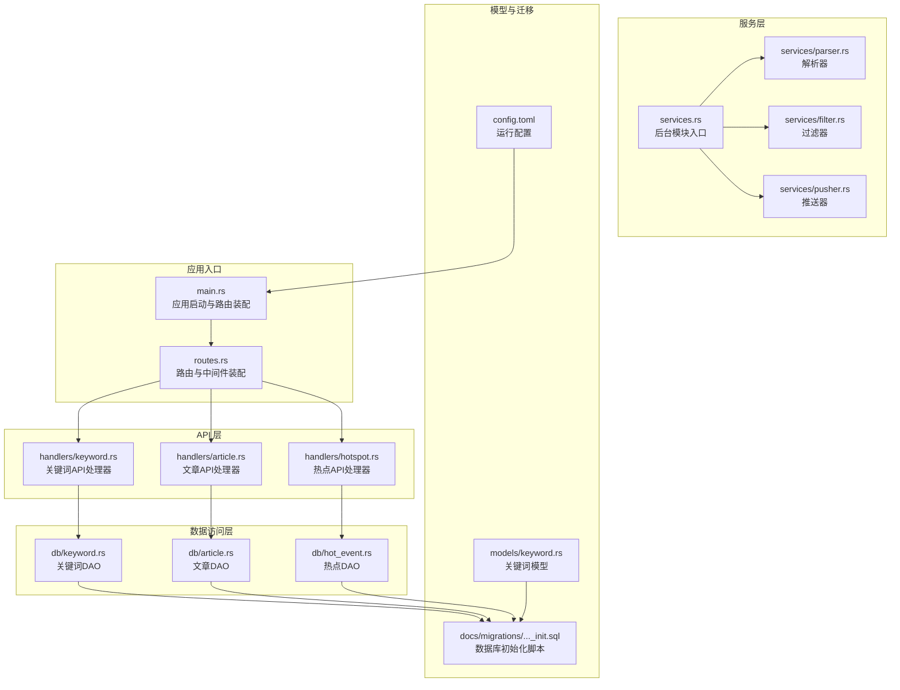
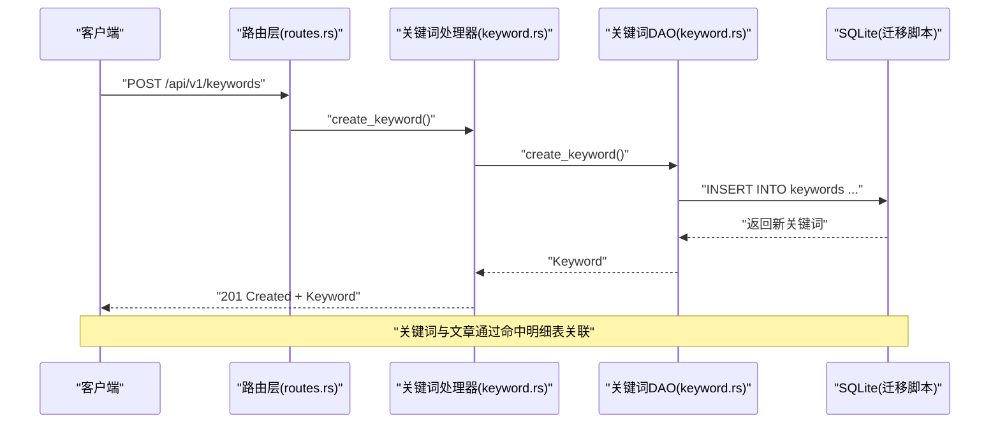
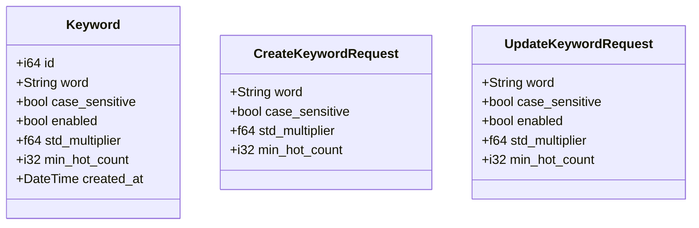
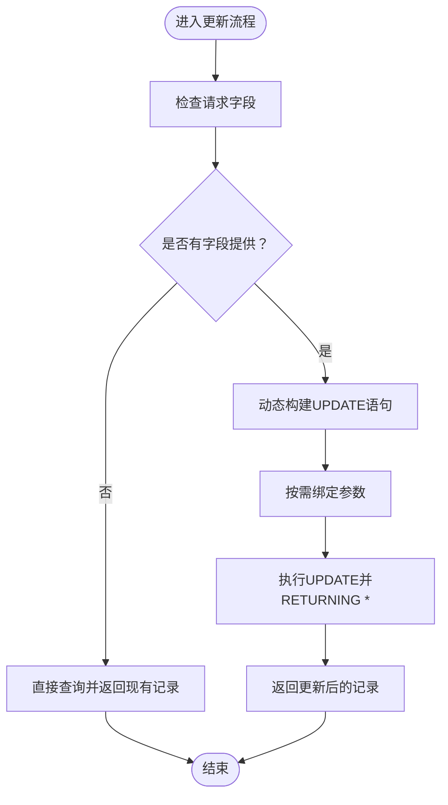
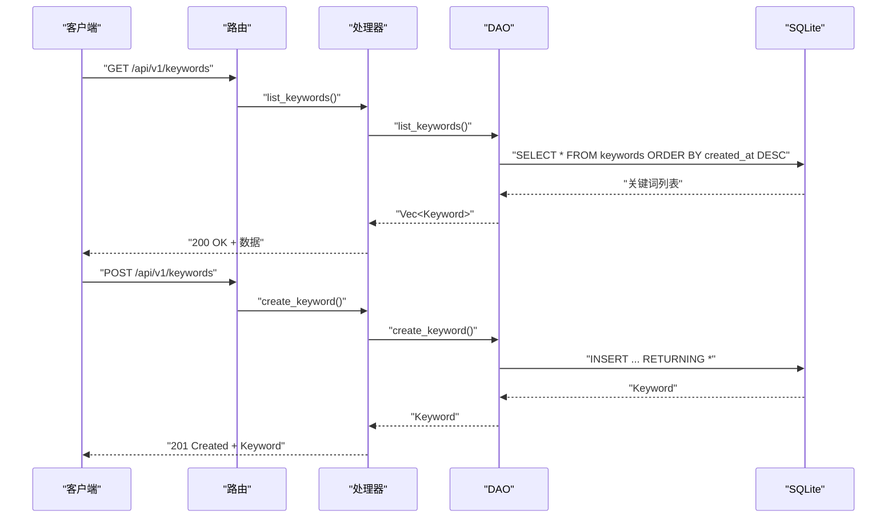
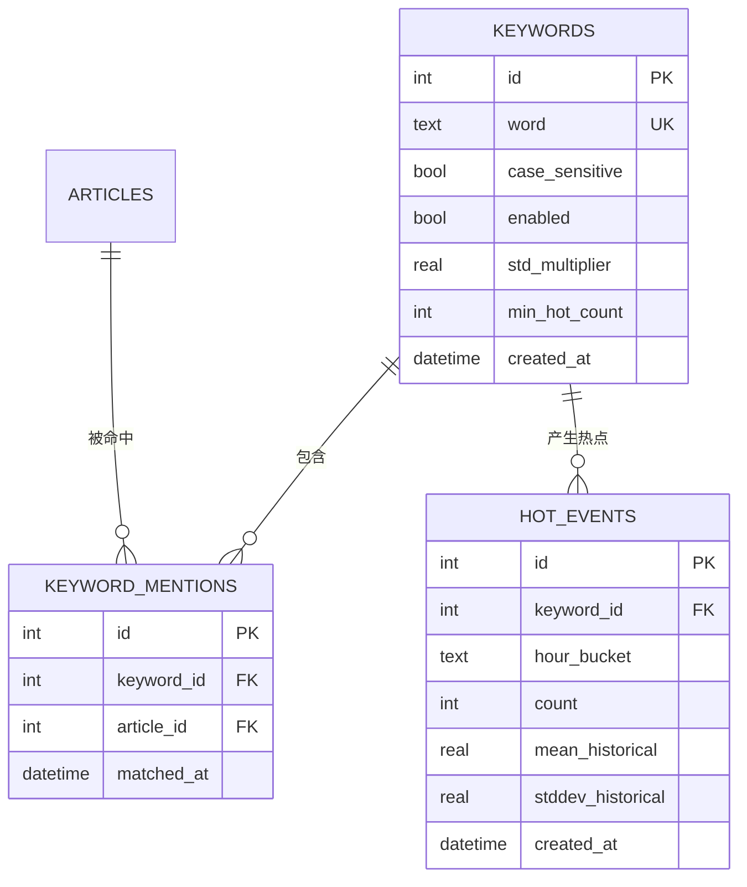
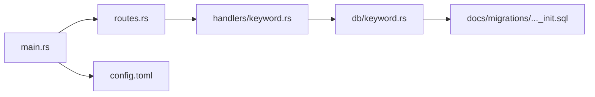

# 关键词分析引擎

<cite>
**本文档引用的文件**
- [src/models/keyword.rs](file://src/models/keyword.rs)
- [src/db/keyword.rs](file://src/db/keyword.rs)
- [src/handlers/keyword.rs](file://src/handlers/keyword.rs)
- [src/routes.rs](file://src/routes.rs)
- [src/main.rs](file://src/main.rs)
- [docs/migrations/20260607044921_init.sql](file://docs/migrations/20260607044921_init.sql)
- [config.toml](file://config.toml)
- [docs/plans/05-query-apis-and-background-modules.md](file://docs/plans/05-query-apis-and-background-modules.md)
</cite>

## 目录
1. [简介](#简介)
2. [项目结构](#项目结构)
3. [核心组件](#核心组件)
4. [架构总览](#架构总览)
5. [详细组件分析](#详细组件分析)
6. [依赖关系分析](#依赖关系分析)
7. [性能考虑](#性能考虑)
8. [故障排除指南](#故障排除指南)
9. [结论](#结论)
10. [附录](#附录)

## 简介
本文件为关键词分析引擎的技术文档，聚焦于关键词提取、TF-IDF计算与语义分析的实现路径、Keyword数据模型设计、关键词与文章的关联关系及动态更新机制，并提供关键词搜索、过滤与排序的实现细节。同时，文档阐述了与自然语言处理库的集成方式与自定义扩展点，给出性能基准测试建议与优化策略，并提供实际应用场景与配置示例。

## 项目结构
该系统采用分层架构：路由层负责HTTP请求分发；处理器层封装业务接口；数据库访问层提供CRUD操作；模型层定义数据结构；迁移脚本定义数据库表结构；配置文件提供运行参数；计划文档描述后台模块与查询API的设计目标。

**图表来源**
- [src/main.rs:63-96](file://src/main.rs#L63-L96)
- [src/routes.rs:14-50](file://src/routes.rs#L14-L50)
- [src/handlers/keyword.rs:12-82](file://src/handlers/keyword.rs#L12-L82)
- [docs/migrations/20260607044921_init.sql:50-90](file://docs/migrations/20260607044921_init.sql#L50-L90)
- [config.toml:1-27](file://config.toml#L1-L27)

**章节来源**
- [src/main.rs:63-96](file://src/main.rs#L63-L96)
- [src/routes.rs:14-50](file://src/routes.rs#L14-L50)
- [docs/migrations/20260607044921_init.sql:50-90](file://docs/migrations/20260607044921_init.sql#L50-L90)
- [config.toml:1-27](file://config.toml#L1-L27)

## 核心组件
- 关键词模型与请求模型：定义关键词实体字段、创建与更新请求结构，支撑关键词管理API。
- 关键词数据库访问：提供创建、查询、更新、删除等操作，支持按ID与关键词文本检索。
- 关键词API处理器：封装HTTP接口，返回统一的响应格式，处理重复关键词冲突与资源不存在等错误。
- 数据库模式：定义关键词表、关键词命中明细表、热点事件表，建立关键词与文章的关联关系。
- 配置与启动：通过配置文件设置服务器、数据库、解析器、过滤器、推送器等参数；启动时执行数据库迁移并确保初始令牌存在。

**章节来源**
- [src/models/keyword.rs:5-32](file://src/models/keyword.rs#L5-L32)
- [src/db/keyword.rs:5-115](file://src/db/keyword.rs#L5-L115)
- [src/handlers/keyword.rs:12-82](file://src/handlers/keyword.rs#L12-L82)
- [docs/migrations/20260607044921_init.sql:50-90](file://docs/migrations/20260607044921_init.sql#L50-L90)
- [config.toml:1-27](file://config.toml#L1-L27)
- [src/main.rs:26-61](file://src/main.rs#L26-L61)

## 架构总览
关键词分析引擎在现有架构中承担以下职责：
- 关键词管理：提供关键词的增删改查接口，支持启用/禁用、大小写敏感、阈值等配置。
- 关联建模：通过关键词命中明细表将关键词与文章建立多对多关联，便于后续统计与分析。
- 热点检测：基于历史计数与标准差计算热点事件，为推送与查询API提供数据基础。
- 后台处理：解析器抓取内容，过滤器进行关键词匹配与热点检测，推送器负责告警推送。

**图表来源**
- [src/routes.rs:31-35](file://src/routes.rs#L31-L35)
- [src/handlers/keyword.rs:27-43](file://src/handlers/keyword.rs#L27-L43)
- [src/db/keyword.rs:5-19](file://src/db/keyword.rs#L5-L19)
- [docs/migrations/20260607044921_init.sql:65-73](file://docs/migrations/20260607044921_init.sql#L65-L73)

## 详细组件分析

### 关键词数据模型
- 字段说明
  - id：主键
  - word：关键词文本（唯一）
  - case_sensitive：是否区分大小写
  - enabled：是否启用
  - std_multiplier：热点检测的标准差倍数阈值
  - min_hot_count：热点事件的最小计数阈值
  - created_at：创建时间
- 请求模型
  - 创建请求：word必填，其余可选（默认值见DAO实现）
  - 更新请求：所有字段可选，仅传入的字段生效

**图表来源**
- [src/models/keyword.rs:5-32](file://src/models/keyword.rs#L5-L32)

**章节来源**
- [src/models/keyword.rs:5-32](file://src/models/keyword.rs#L5-L32)

### 关键词数据库访问层
- 创建关键词：插入关键词并返回实体，未提供字段使用默认值
- 列出关键词：按创建时间倒序
- 获取启用关键词：按关键词文本排序
- 按ID/关键词文本查询：支持存在性检查
- 更新关键词：动态拼接SQL，仅更新提供的字段
- 删除关键词：级联删除关联的命中明细与热点事件

**图表来源**
- [src/db/keyword.rs:57-106](file://src/db/keyword.rs#L57-L106)

**章节来源**
- [src/db/keyword.rs:5-115](file://src/db/keyword.rs#L5-L115)

### 关键词API处理器
- 列表接口：返回所有关键词，按创建时间倒序
- 创建接口：接收创建请求，处理唯一约束冲突（重复关键词）
- 更新接口：先校验资源存在，再执行部分更新
- 删除接口：先校验存在性，再删除

**图表来源**
- [src/handlers/keyword.rs:12-82](file://src/handlers/keyword.rs#L12-L82)
- [src/db/keyword.rs:21-45](file://src/db/keyword.rs#L21-L45)

**章节来源**
- [src/handlers/keyword.rs:12-82](file://src/handlers/keyword.rs#L12-L82)

### 关键词与文章的关联关系
- 命中明细表：记录关键词与文章的匹配关系，支持按关键词与文章维度查询
- 热点事件表：按小时桶聚合关键词出现次数，结合历史均值与标准差识别异常热点
- 关联查询：可通过关键词ID过滤热点事件，或按文章ID查询命中明细

**图表来源**
- [docs/migrations/20260607044921_init.sql:50-90](file://docs/migrations/20260607044921_init.sql#L50-L90)

**章节来源**
- [docs/migrations/20260607044921_init.sql:50-90](file://docs/migrations/20260607044921_init.sql#L50-L90)

### 动态更新机制
- 关键词状态变更：通过更新接口启用/禁用关键词，影响后续匹配与热点检测
- 命中明细与热点：后台过滤器模块负责扫描未处理文章，匹配关键词并生成命中明细与热点事件
- 配置驱动：通过配置文件调整批处理大小、时间窗口与重试策略，间接影响关键词分析的吞吐与延迟

**章节来源**
- [src/db/keyword.rs:57-106](file://src/db/keyword.rs#L57-L106)
- [config.toml:17-27](file://config.toml#L17-L27)
- [docs/plans/05-query-apis-and-background-modules.md:913-959](file://docs/plans/05-query-apis-and-background-modules.md#L913-L959)

### 关键词搜索、过滤与排序
- 搜索与过滤
  - 按关键词文本精确匹配（唯一索引）
  - 按启用状态过滤（布尔字段）
  - 按创建时间倒序（默认排序）
- 排序
  - 列表接口默认按创建时间倒序
  - 启用关键词按关键词文本排序
- 查询API（计划中）
  - 计划文档定义了文章列表、热点事件列表等查询端点，支持分页与过滤参数
  - 可通过关键词ID过滤热点事件，或按数据源、处理状态过滤文章

**章节来源**
- [src/db/keyword.rs:21-35](file://src/db/keyword.rs#L21-L35)
- [docs/plans/05-query-apis-and-background-modules.md:18-100](file://docs/plans/05-query-apis-and-background-modules.md#L18-L100)

### TF-IDF计算与语义分析技术
- TF-IDF计算
  - 词频（TF）：关键词在单篇文章中的出现次数
  - 逆文档频率（IDF）：log(总文章数 / 包含该关键词的文章数)
  - 权重：TF-IDF权重用于衡量关键词对文章的重要性
- 语义分析
  - 大小写敏感选项：通过关键词模型的case_sensitive字段控制匹配行为
  - 标准差阈值：通过std_multiplier与min_hot_count结合历史统计识别异常热点
- 实现路径
  - 命中明细表记录关键词与文章的匹配，为TF-IDF与热点统计提供数据基础
  - 后台过滤器模块负责批量扫描与匹配，生成命中明细与热点事件

**章节来源**
- [src/models/keyword.rs:9-12](file://src/models/keyword.rs#L9-L12)
- [docs/migrations/20260607044921_init.sql:65-73](file://docs/migrations/20260607044921_init.sql#L65-L73)
- [docs/plans/05-query-apis-and-background-modules.md:913-959](file://docs/plans/05-query-apis-and-background-modules.md#L913-L959)

### 与自然语言处理库的集成与扩展点
- 集成方式
  - 解析器模块负责抓取与预处理内容，为关键词匹配提供输入
  - 过滤器模块执行关键词匹配与热点检测，可扩展为调用外部NLP库进行分词、词干提取或向量相似度计算
- 自定义扩展点
  - 关键词匹配策略：可在过滤器中引入正则表达式、通配符或模糊匹配
  - 语义增强：通过外部嵌入模型计算关键词与文章的相似度，作为权重补充
  - 多语言支持：根据语言选择合适的分词器与停用词表

**章节来源**
- [config.toml:12-16](file://config.toml#L12-L16)
- [docs/plans/05-query-apis-and-background-modules.md:913-959](file://docs/plans/05-query-apis-and-background-modules.md#L913-L959)

## 依赖关系分析
- 路由到处理器：路由层将关键词相关端点映射到处理器函数
- 处理器到DAO：处理器调用数据库访问层执行CRUD操作
- DAO到数据库：DAO通过SQL执行数据操作，依赖迁移脚本定义的表结构
- 启动流程：应用启动时加载配置、初始化数据库连接池、执行迁移、确保初始令牌存在

**图表来源**
- [src/routes.rs:14-50](file://src/routes.rs#L14-L50)
- [src/handlers/keyword.rs:12-82](file://src/handlers/keyword.rs#L12-L82)
- [src/db/keyword.rs:5-115](file://src/db/keyword.rs#L5-L115)
- [src/main.rs:63-96](file://src/main.rs#L63-L96)
- [config.toml:1-27](file://config.toml#L1-L27)

**章节来源**
- [src/routes.rs:14-50](file://src/routes.rs#L14-L50)
- [src/handlers/keyword.rs:12-82](file://src/handlers/keyword.rs#L12-L82)
- [src/db/keyword.rs:5-115](file://src/db/keyword.rs#L5-L115)
- [src/main.rs:63-96](file://src/main.rs#L63-L96)
- [config.toml:1-27](file://config.toml#L1-L27)

## 性能考虑
- 数据库索引
  - 关键词表：word唯一索引，提升去重与查找效率
  - 命中明细表：keyword_id与article_id索引，加速关联查询
  - 热点事件表：keyword_id与hour_bucket索引，支持按时间窗口聚合
- 批处理与并发
  - 过滤器批处理大小与间隔：通过配置项控制扫描频率与批次规模
  - 解析器并发抓取：限制最大并发抓取数以平衡带宽与目标站点负载
- 缓存与归档
  - 将热点事件按小时桶归档，减少实时查询压力
  - 对高频关键词的统计结果进行短期缓存
- 查询优化
  - 使用参数化查询避免SQL注入，利用索引覆盖常见过滤条件
  - 分页查询与COUNT分离，避免大表全量扫描

**章节来源**
- [docs/migrations/20260607044921_init.sql:45-90](file://docs/migrations/20260607044921_init.sql#L45-L90)
- [config.toml:17-27](file://config.toml#L17-L27)
- [config.toml:12-16](file://config.toml#L12-L16)

## 故障排除指南
- 重复关键词
  - 现象：创建关键词返回409冲突
  - 原因：关键词文本重复
  - 处理：修改关键词文本或删除旧记录后重试
- 资源不存在
  - 现象：更新或删除关键词返回404
  - 原因：ID无效或已被删除
  - 处理：确认ID正确性或重新创建关键词
- 数据库迁移失败
  - 现象：启动时报错无法执行迁移
  - 原因：数据库路径不正确或权限不足
  - 处理：检查数据库路径与权限，确保迁移脚本可读

**章节来源**
- [src/handlers/keyword.rs:33-42](file://src/handlers/keyword.rs#L33-L42)
- [src/handlers/keyword.rs:54-63](file://src/handlers/keyword.rs#L54-L63)
- [src/main.rs:79-80](file://src/main.rs#L79-L80)

## 结论
关键词分析引擎通过清晰的数据模型、完善的数据库关联与标准化的API接口，为热点监测与内容分析提供了坚实基础。结合后台解析、过滤与推送模块，系统实现了从内容抓取到热点告警的完整链路。未来可在语义增强、多语言支持与性能优化方面持续演进。

## 附录

### 实际应用场景
- 技术趋势监控：对AI、区块链等热门领域关键词进行持续监测
- 新闻聚合：为新闻源设置关键词，自动筛选与聚合相关内容
- 社交媒体监听：结合外部NLP库进行情感与主题分析

### 配置示例
- 服务器与数据库
  - host/port：服务监听地址与端口
  - database.path：SQLite数据库文件路径
- 认证
  - initial_token：首次启动时生成的初始令牌
- 解析器
  - max_concurrent_fetches：最大并发抓取数
  - default_user_agent/default_timeout_seconds：抓取请求头与超时
- 过滤器
  - batch_size/interval_seconds/history_hours/min_history_hours：批处理与历史窗口
- 推送器
  - interval_seconds/max_retries/retry_base_seconds：推送间隔、最大重试与指数退避基数

**章节来源**
- [config.toml:1-27](file://config.toml#L1-L27)