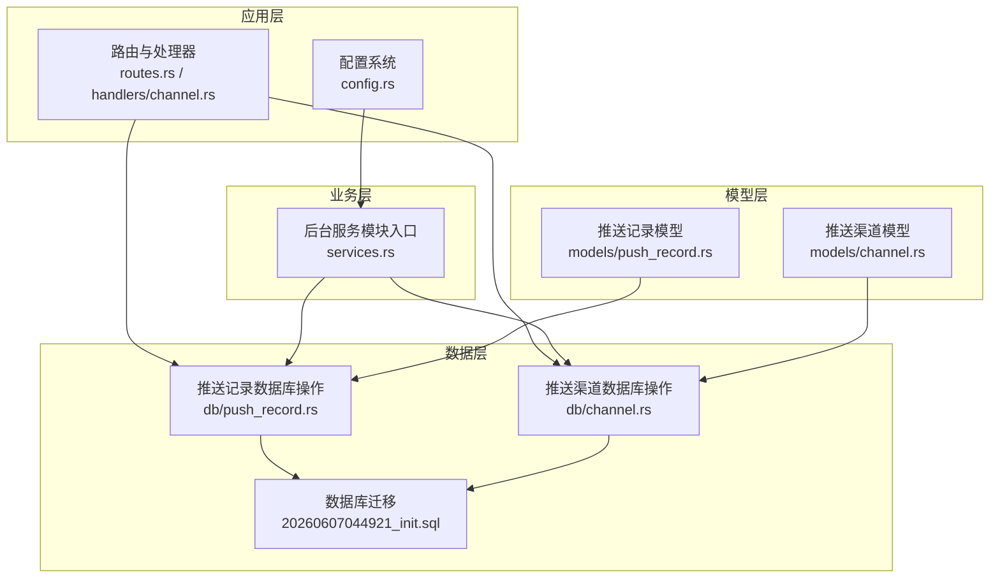
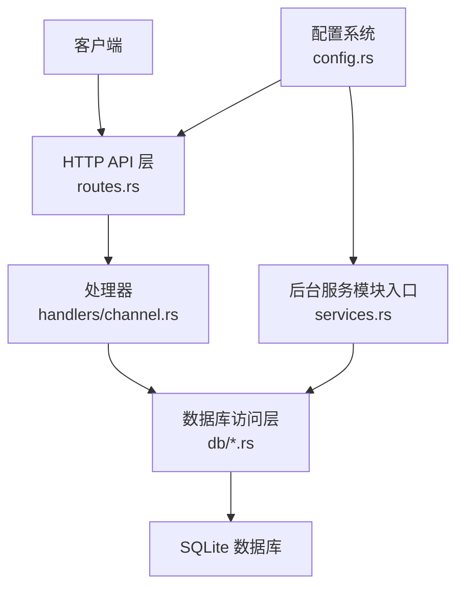
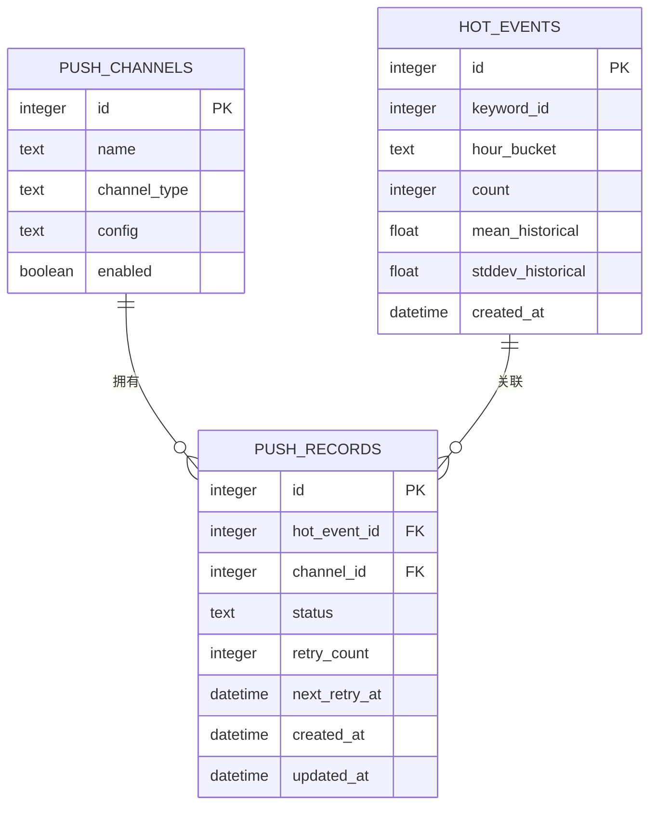
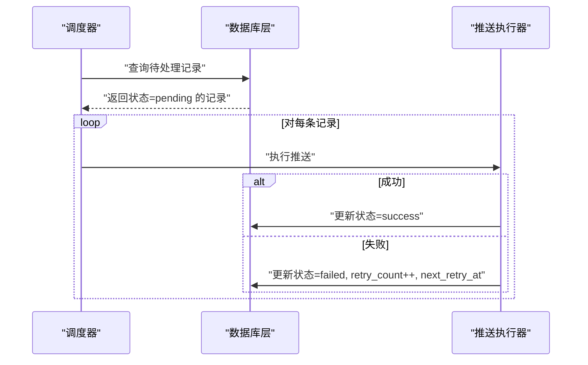
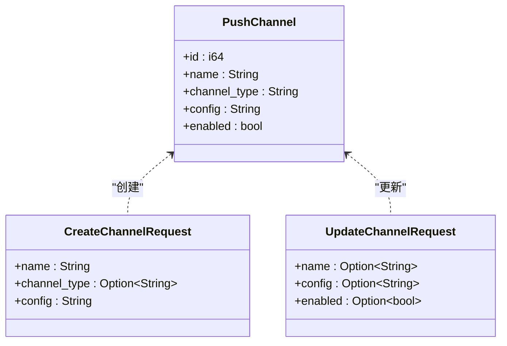
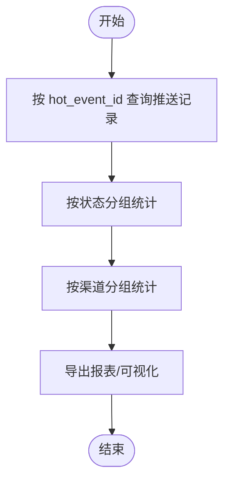
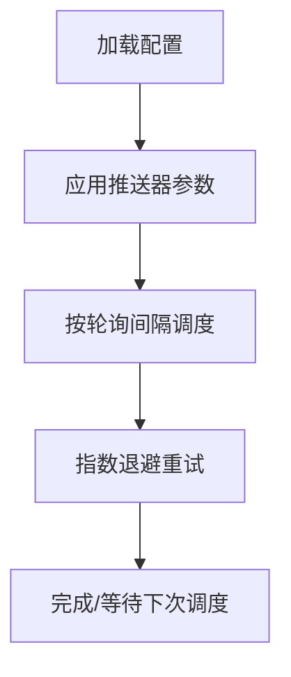
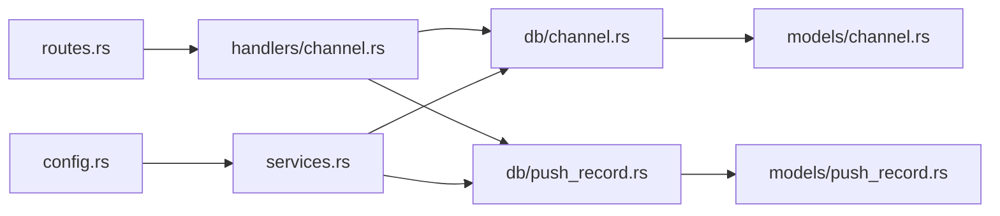

# 推送通知系统

<cite>
**本文引用的文件**
- [src/models/push_record.rs](file://src/models/push_record.rs)
- [src/db/push_record.rs](file://src/db/push_record.rs)
- [docs/migrations/20260607044921_init.sql](file://docs/migrations/20260607044921_init.sql)
- [src/config.rs](file://src/config.rs)
- [src/services.rs](file://src/services.rs)
- [src/routes.rs](file://src/routes.rs)
- [src/main.rs](file://src/main.rs)
- [src/models/channel.rs](file://src/models/channel.rs)
- [src/db/channel.rs](file://src/db/channel.rs)
- [src/handlers/channel.rs](file://src/handlers/channel.rs)
</cite>

## 目录
1. [简介](#简介)
2. [项目结构](#项目结构)
3. [核心组件](#核心组件)
4. [架构总览](#架构总览)
5. [详细组件分析](#详细组件分析)
6. [依赖关系分析](#依赖关系分析)
7. [性能考虑](#性能考虑)
8. [故障排查指南](#故障排查指南)
9. [结论](#结论)
10. [附录](#附录)

## 简介
本文件为“推送通知系统”的完整技术文档，聚焦于以下目标：
- 深入解析 PushRecord 数据模型（用户标识、推送内容、状态跟踪、时间戳）
- 解释推送触发机制（基于热点事件、关键词匹配、用户偏好策略）
- 文档化推送队列管理、重试机制与失败处理
- 提供推送历史记录查询与统计分析能力
- 说明与第三方推送服务的集成方式与配置项
- 覆盖推送效果追踪、用户反馈收集与个性化推荐算法
- 给出完整的 API 接口与使用示例

当前代码库已实现推送记录的数据模型与数据库迁移、推送渠道的 CRUD 能力，以及与后台模块的组织结构。推送触发器与推送执行器（parser/filter/pusher）尚处于模块化规划阶段，尚未在仓库中提供具体实现文件。

## 项目结构
推送通知系统由以下关键部分组成：
- 数据模型与数据库：PushRecord、PushChannel 及其对应的数据库迁移
- 配置系统：包含推送器配置项（轮询间隔、最大重试次数、指数退避基础秒数）
- 后台服务模块：按步骤划分的模块入口（parser/filter/pusher），用于后续扩展
- 路由与处理器：提供推送渠道的 API（列表、创建、更新、删除）

图表来源
- [src/routes.rs:14-61](file://src/routes.rs#L14-L61)
- [src/handlers/channel.rs:12-71](file://src/handlers/channel.rs#L12-L71)
- [src/db/push_record.rs:6-126](file://src/db/push_record.rs#L6-L126)
- [src/db/channel.rs:5-94](file://src/db/channel.rs#L5-L94)
- [docs/migrations/20260607044921_init.sql:103-118](file://docs/migrations/20260607044921_init.sql#L103-L118)
- [src/config.rs:45-50](file://src/config.rs#L45-L50)

章节来源
- [src/routes.rs:14-61](file://src/routes.rs#L14-L61)
- [src/services.rs:1-6](file://src/services.rs#L1-L6)
- [src/config.rs:45-50](file://src/config.rs#L45-L50)

## 核心组件
- PushRecord 数据模型：描述一次推送任务的生命周期与状态
- PushChannel 数据模型：描述推送渠道类型与配置（如 webhook 的目标 URL）
- 数据库迁移：定义 push_records 与 push_channels 表结构及索引
- 配置项：控制推送器的轮询频率、最大重试次数与退避策略
- 后台服务模块入口：为 parser/filter/pusher 留出扩展空间

章节来源
- [src/models/push_record.rs:5-16](file://src/models/push_record.rs#L5-L16)
- [src/models/channel.rs:4-11](file://src/models/channel.rs#L4-L11)
- [docs/migrations/20260607044921_init.sql:103-118](file://docs/migrations/20260607044921_init.sql#L103-L118)
- [src/config.rs:45-50](file://src/config.rs#L45-L50)
- [src/services.rs:1-6](file://src/services.rs#L1-L6)

## 架构总览
推送通知系统采用分层架构：
- 应用层：Axum 路由与处理器，负责接收请求并调用数据库层
- 业务层：后台服务模块入口，承载 parser/filter/pusher 的后续实现
- 数据层：SQLx 访问 SQLite，提供 CRUD 与查询能力
- 配置层：TOML 配置文件驱动运行时行为

图表来源
- [src/routes.rs:14-61](file://src/routes.rs#L14-L61)
- [src/handlers/channel.rs:12-71](file://src/handlers/channel.rs#L12-L71)
- [src/db/channel.rs:5-94](file://src/db/channel.rs#L5-L94)
- [src/services.rs:1-6](file://src/services.rs#L1-L6)
- [src/config.rs:52-59](file://src/config.rs#L52-L59)

## 详细组件分析

### PushRecord 数据模型与数据库设计
PushRecord 描述一次推送任务的关键信息：
- 关联字段：hot_event_id、channel_id
- 状态字段：status（枚举值：pending/success/failed）
- 重试控制：retry_count、next_retry_at
- 时间戳：created_at、updated_at

数据库迁移定义了 push_records 表的主键、外键约束、唯一约束（hot_event_id, channel_id）与索引（status），确保幂等插入与高效查询。

图表来源
- [docs/migrations/20260607044921_init.sql:103-118](file://docs/migrations/20260607044921_init.sql#L103-L118)
- [docs/migrations/20260607044921_init.sql:92-101](file://docs/migrations/20260607044921_init.sql#L92-L101)
- [docs/migrations/20260607044921_init.sql:76-87](file://docs/migrations/20260607044921_init.sql#L76-L87)

章节来源
- [src/models/push_record.rs:5-16](file://src/models/push_record.rs#L5-L16)
- [docs/migrations/20260607044921_init.sql:103-118](file://docs/migrations/20260607044921_init.sql#L103-L118)

### 推送队列管理与重试机制
数据库层提供了以下关键操作：
- 批量为热点事件生成推送记录（幂等插入）
- 查询待处理记录
- 查询到期可重试记录
- 更新推送状态（乐观锁与非乐观锁两种实现）

图表来源
- [src/db/push_record.rs:45-88](file://src/db/push_record.rs#L45-L88)
- [src/db/push_record.rs:89-113](file://src/db/push_record.rs#L89-L113)

章节来源
- [src/db/push_record.rs:20-43](file://src/db/push_record.rs#L20-L43)
- [src/db/push_record.rs:45-67](file://src/db/push_record.rs#L45-L67)
- [src/db/push_record.rs:69-88](file://src/db/push_record.rs#L69-L88)
- [src/db/push_record.rs:89-113](file://src/db/push_record.rs#L89-L113)

### 推送触发机制与策略
当前仓库未提供具体的触发器实现（parser/filter/pusher）。根据现有数据模型与配置，建议的触发策略如下：
- 基于热点事件：当 hot_events 中的事件达到阈值（均值+N×标准差）时，为该事件生成推送记录
- 基于关键词匹配：文章经关键词命中后形成热点事件，再触发推送
- 用户偏好：通过用户订阅的关键词或频道，筛选需要推送的事件

由于 parser/filter/pusher 尚未实现，本节为概念性说明，不直接对应具体文件。

### 第三方推送服务集成
- 渠道类型：channel_type 默认为 webhook，便于对接外部服务
- 渠道配置：config 字段存储 JSON，例如包含目标 URL
- API：提供 CRUD 接口管理推送渠道

图表来源
- [src/models/channel.rs:4-25](file://src/models/channel.rs#L4-L25)
- [src/db/channel.rs:5-94](file://src/db/channel.rs#L5-L94)
- [src/handlers/channel.rs:12-71](file://src/handlers/channel.rs#L12-L71)

章节来源
- [src/models/channel.rs:4-25](file://src/models/channel.rs#L4-L25)
- [src/db/channel.rs:5-94](file://src/db/channel.rs#L5-L94)
- [src/handlers/channel.rs:12-71](file://src/handlers/channel.rs#L12-L71)

### 推送历史记录查询与统计分析
- 历史记录查询：按热点事件 ID 查询所有推送记录，便于回溯与审计
- 统计维度：可按状态分布、时间窗口、渠道类型进行聚合统计（需在上层实现）

图表来源
- [src/db/push_record.rs:115-125](file://src/db/push_record.rs#L115-L125)

章节来源
- [src/db/push_record.rs:115-125](file://src/db/push_record.rs#L115-L125)

### 配置与运行时参数
- 推送器配置项：interval_seconds、max_retries、retry_base_seconds
- 运行模式：命令行支持 all | api | parser | filter | pusher，便于按需启动模块

图表来源
- [src/config.rs:45-50](file://src/config.rs#L45-L50)
- [src/main.rs:22-24](file://src/main.rs#L22-L24)

章节来源
- [src/config.rs:45-50](file://src/config.rs#L45-L50)
- [src/main.rs:22-24](file://src/main.rs#L22-L24)

### API 接口清单与使用示例
- 列表推送渠道
  - 方法与路径：GET /api/v1/channels
  - 返回：推送渠道数组
- 创建推送渠道
  - 方法与路径：POST /api/v1/channels
  - 请求体：包含 name、channel_type（可选）、config（JSON 字符串）
  - 返回：新建的推送渠道对象
- 更新推送渠道
  - 方法与路径：POST /api/v1/channels/{id}/update
  - 请求体：name、config、enabled（可选）
  - 返回：更新后的推送渠道对象
- 删除推送渠道
  - 方法与路径：POST /api/v1/channels/{id}/delete
  - 返回：204 No Content 或 404 Not Found

章节来源
- [src/handlers/channel.rs:12-71](file://src/handlers/channel.rs#L12-L71)

## 依赖关系分析
- 模块耦合
  - 路由与处理器依赖数据库层；数据库层依赖模型与迁移
  - 后台服务模块入口与数据库层解耦，便于后续扩展 parser/filter/pusher
- 外部依赖
  - SQLx 用于 SQLite 访问
  - Axum 用于 HTTP 路由与中间件
  - TOML 配置解析

图表来源
- [src/routes.rs:14-61](file://src/routes.rs#L14-L61)
- [src/handlers/channel.rs:12-71](file://src/handlers/channel.rs#L12-L71)
- [src/db/channel.rs:5-94](file://src/db/channel.rs#L5-L94)
- [src/db/push_record.rs:6-18](file://src/db/push_record.rs#L6-L18)
- [src/models/channel.rs:4-11](file://src/models/channel.rs#L4-L11)
- [src/models/push_record.rs:5-16](file://src/models/push_record.rs#L5-L16)
- [src/services.rs:1-6](file://src/services.rs#L1-L6)
- [src/config.rs:52-59](file://src/config.rs#L52-L59)

## 性能考虑
- 数据库层面
  - 使用索引加速按状态查询与排序
  - 幂等插入避免重复推送记录
- 业务层面
  - 乐观锁更新减少并发冲突
  - 指数退避与最大重试次数限制抖动
- 运行层面
  - 按需启动模块，降低资源占用

## 故障排查指南
- 常见问题
  - 无法连接数据库：检查数据库路径与权限
  - 渠道配置错误：确认 config JSON 结构与目标服务可用性
  - 推送失败堆积：检查重试上限与退避策略是否合理
- 定位手段
  - 查看待处理与可重试记录集合
  - 核对推送记录状态与时间戳
  - 检查日志输出与健康检查端点

章节来源
- [src/db/push_record.rs:45-67](file://src/db/push_record.rs#L45-L67)
- [src/db/push_record.rs:69-88](file://src/db/push_record.rs#L69-L88)
- [src/main.rs:52-54](file://src/main.rs#L52-L54)

## 结论
推送通知系统在数据模型、数据库迁移与渠道管理方面已具备清晰的实现基础。后续可在 parser/filter/pusher 模块中实现推送触发与执行逻辑，并结合配置参数完善重试与退避策略。建议优先完成以下工作：
- 实现 parser/filter/pusher 模块
- 补充推送效果追踪与用户反馈收集接口
- 增加个性化推荐算法与用户偏好管理

## 附录
- 命令行参数
  - --config：指定配置文件路径
  - --mode：运行模式（all | api | parser | filter | pusher）
- 健康检查
  - GET /health 返回服务状态

章节来源
- [src/main.rs:18-24](file://src/main.rs#L18-L24)
- [src/main.rs:52-54](file://src/main.rs#L52-L54)