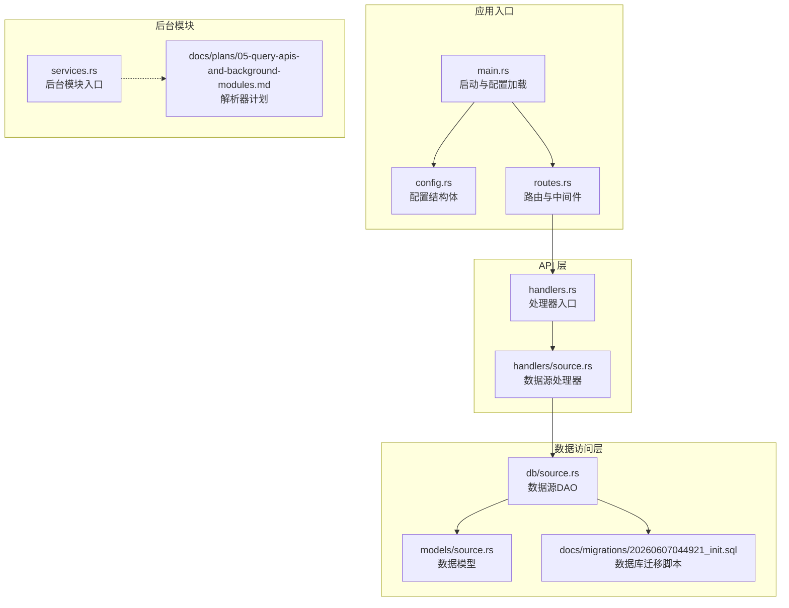
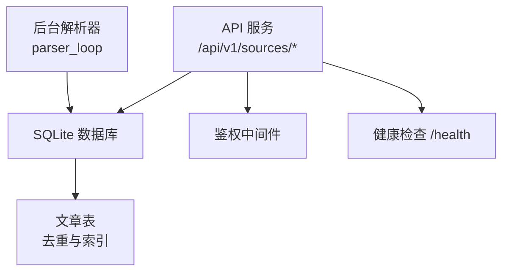
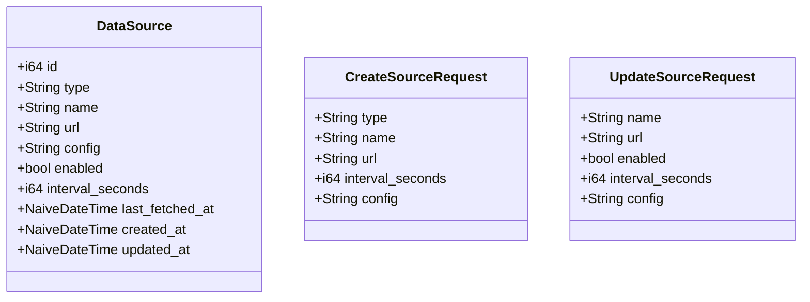
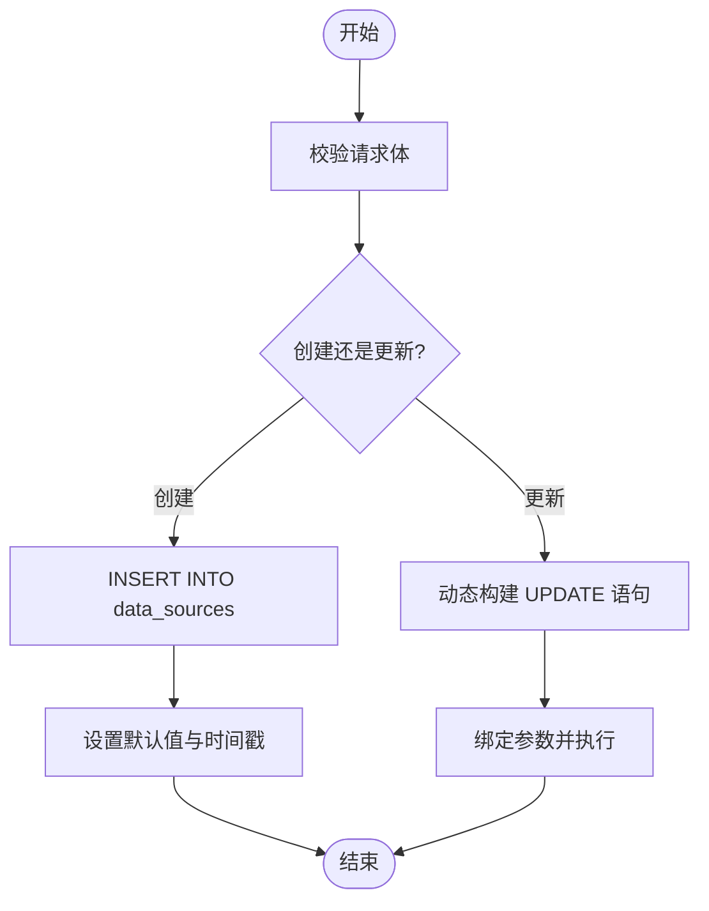
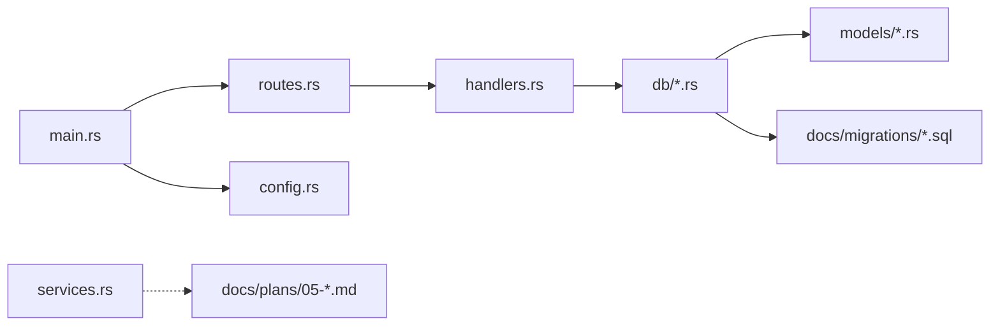

# 数据源管理

<cite>
**本文档引用的文件**
- [src/models/source.rs](file://src/models/source.rs)
- [src/db/source.rs](file://src/db/source.rs)
- [src/route.rs](file://src/routes.rs)
- [src/main.rs](file://src/main.rs)
- [src/config.rs](file://src/config.rs)
- [src/services.rs](file://src/services.rs)
- [Cargo.toml](file://Cargo.toml)
- [docs/migrations/20260607044921_init.sql](file://docs/migrations/20260607044921_init.sql)
- [docs/plans/05-query-apis-and-background-modules.md](file://docs/plans/05-query-apis-and-background-modules.md)
- [README.md](file://README.md)
</cite>

## 目录
1. [简介](#简介)
2. [项目结构](#项目结构)
3. [核心组件](#核心组件)
4. [架构总览](#架构总览)
5. [详细组件分析](#详细组件分析)
6. [依赖关系分析](#依赖关系分析)
7. [性能考量](#性能考量)
8. [故障排查指南](#故障排查指南)
9. [结论](#结论)
10. [附录](#附录)

## 简介
本文件为“数据源管理系统”的综合技术文档，围绕数据源的建模、注册、验证与维护、爬虫调度与增量更新、健康检查与故障处理、以及对不同数据格式（RSS、JSON、HTML）的适配策略进行系统化阐述。同时给出数据质量监控、清洗规则、异常处理建议，并提供配置模板与集成示例，以及扩展新数据源类型的开发指南。

## 项目结构
该系统采用分层架构：应用入口负责初始化配置、数据库连接与路由装配；API 层通过路由暴露数据源 CRUD 与触发接口；数据访问层封装数据库操作；后台模块（解析器、过滤器、推送器）在独立子进程模式下运行，负责周期性抓取与处理。



图表来源
- [src/main.rs:63-96](file://src/main.rs#L63-L96)
- [src/config.rs:52-59](file://src/config.rs#L52-L59)
- [src/routes.rs:14-50](file://src/routes.rs#L14-L50)
- [src/handlers.rs:1-6](file://src/handlers.rs#L1-L6)
- [src/models/source.rs:5-19](file://src/models/source.rs#L5-L19)
- [src/db/source.rs:3-39](file://src/db/source.rs#L3-L39)
- [docs/migrations/20260607044921_init.sql:17-28](file://docs/migrations/20260607044921_init.sql#L17-L28)
- [src/services.rs:1-6](file://src/services.rs#L1-L6)
- [docs/plans/05-query-apis-and-background-modules.md:429-503](file://docs/plans/05-query-apis-and-background-modules.md#L429-L503)

章节来源
- [src/main.rs:63-96](file://src/main.rs#L63-L96)
- [src/config.rs:52-59](file://src/config.rs#L52-L59)
- [src/routes.rs:14-50](file://src/routes.rs#L14-L50)
- [src/handlers.rs:1-6](file://src/handlers.rs#L1-L6)
- [src/models/source.rs:5-19](file://src/models/source.rs#L5-L19)
- [src/db/source.rs:3-39](file://src/db/source.rs#L3-L39)
- [docs/migrations/20260607044921_init.sql:17-28](file://docs/migrations/20260607044921_init.sql#L17-L28)
- [src/services.rs:1-6](file://src/services.rs#L1-L6)
- [docs/plans/05-query-apis-and-background-modules.md:429-503](file://docs/plans/05-query-apis-and-background-modules.md#L429-L503)

## 核心组件
- 数据源模型：定义数据源的标识、名称、URL、类型、配置、启用状态、抓取间隔、最近抓取时间等字段，并提供创建与更新请求体。
- 数据源 DAO：提供创建、查询列表、按 ID 查询、部分更新、删除、更新最后抓取时间、重置最后抓取时间等数据库操作。
- 配置结构：包含服务器、数据库、鉴权、解析器、过滤器、推送器等配置项，用于控制后台模块行为。
- 路由与处理器：暴露数据源的 CRUD 与手动触发抓取接口，并统一鉴权中间件。
- 后台模块：解析器计划定义了基于时间轮询的抓取循环、并发限制、去重插入与最后抓取时间更新。

章节来源
- [src/models/source.rs:5-19](file://src/models/source.rs#L5-L19)
- [src/db/source.rs:5-126](file://src/db/source.rs#L5-L126)
- [src/config.rs:30-50](file://src/config.rs#L30-L50)
- [src/routes.rs:25-30](file://src/routes.rs#L25-L30)
- [docs/plans/05-query-apis-and-background-modules.md:429-503](file://docs/plans/05-query-apis-and-background-modules.md#L429-L503)

## 架构总览
系统采用“API + 后台模块”分离的架构。API 侧负责数据源配置与触发；后台模块负责周期性抓取与入库。数据库迁移脚本定义了数据源表、文章表及索引，确保去重与高效查询。



图表来源
- [src/routes.rs:14-50](file://src/routes.rs#L14-L50)
- [docs/migrations/20260607044921_init.sql:17-47](file://docs/migrations/20260607044921_init.sql#L17-L47)
- [docs/plans/05-query-apis-and-background-modules.md:429-503](file://docs/plans/05-query-apis-and-background-modules.md#L429-L503)

## 详细组件分析

### 数据源模型与请求体
- 字段设计
  - 类型标识：type，支持 rss、atom、json_feed 等。
  - 名称与地址：name、url。
  - 配置参数：config 以 JSON 字符串存储，便于扩展。
  - 控制字段：enabled、interval_seconds、last_fetched_at。
  - 时间戳：created_at、updated_at。
- 请求体
  - 创建：包含 type、name、url、可选 interval_seconds、可选 config。
  - 更新：name、url、enabled、interval_seconds、config 均为可选字段，支持部分更新。



图表来源
- [src/models/source.rs:5-38](file://src/models/source.rs#L5-L38)

章节来源
- [src/models/source.rs:5-38](file://src/models/source.rs#L5-L38)

### 数据源 DAO 与数据库交互
- 创建：默认 interval_seconds 为 300 秒，config 默认 "{}"。
- 列表：按创建时间倒序查询。
- 按 ID 查询：返回单个数据源。
- 部分更新：动态拼接 SET 子句，仅更新提供的字段，并自动更新 updated_at。
- 删除：按 id 删除。
- 最后抓取时间更新：成功抓取后更新 last_fetched_at。
- 重置最后抓取时间：用于手动触发抓取，将 last_fetched_at 设为 NULL。



图表来源
- [src/db/source.rs:5-126](file://src/db/source.rs#L5-L126)

章节来源
- [src/db/source.rs:5-126](file://src/db/source.rs#L5-L126)

### 路由与鉴权
- 路由
  - GET/POST /api/v1/sources：列出与创建数据源。
  - POST /api/v1/sources/{id}/update：更新指定数据源。
  - POST /api/v1/sources/{id}/delete：删除数据源。
  - POST /api/v1/sources/{id}/fetch：手动触发抓取（重置 last_fetched_at）。
  - GET /health：健康检查。
- 中间件：统一鉴权中间件保护 API。

章节来源
- [src/routes.rs:25-30](file://src/routes.rs#L25-L30)
- [src/routes.rs:47-54](file://src/routes.rs#L47-L54)

### 后台解析器与调度
- 解析器计划
  - 使用时间间隔 tick 定期扫描待抓取的数据源。
  - 条件：enabled 为真，且满足首次抓取或超过 interval_seconds 的阈值。
  - 并发控制：使用信号量限制最大并发抓取数。
  - 抓取与入库：对每个源异步抓取，解析为文章实体，使用 INSERT OR IGNORE 去重插入，成功后更新 last_fetched_at。
  - 日志：记录每次抓取结果与新增文章数量。

```mermaid
sequenceDiagram
participant Loop as "调度循环"
participant DB as "数据库"
participant Parser as "解析器"
participant Articles as "文章表"
Loop->>DB : 查询待抓取数据源
DB-->>Loop : 返回候选列表
loop 对每个候选源
Loop->>Parser : 异步抓取与解析
Parser-->>Loop : 返回文章列表
Loop->>Articles : INSERT OR IGNORE 去重插入
Articles-->>Loop : 插入计数
Loop->>DB : 更新 last_fetched_at
end
```

图表来源
- [docs/plans/05-query-apis-and-background-modules.md:429-503](file://docs/plans/05-query-apis-and-background-modules.md#L429-L503)

章节来源
- [docs/plans/05-query-apis-and-background-modules.md:429-503](file://docs/plans/05-query-apis-and-background-modules.md#L429-L503)

### 数据格式适配器设计
- RSS/Atom 适配器
  - 使用 feed-rs 解析 RSS/Atom 流，提取标题、摘要、链接与发布时间，生成文章实体。
- JSON 适配器
  - 建议从 source.config 中读取 JSON 字段映射规则（如 title_field、content_field、date_field），按需扩展。
- HTML 适配器
  - 建议从 source.config 中读取 HTML 解析规则（如选择器、编码、日期格式化），按需扩展。
- 扩展原则
  - 在解析器中根据 source.type 分派到对应适配器。
  - 保持统一的 ParsedArticle 结构，便于后续过滤与推送。

章节来源
- [Cargo.toml:29-30](file://Cargo.toml#L29-L30)
- [docs/plans/05-query-apis-and-background-modules.md:357-417](file://docs/plans/05-query-apis-and-background-modules.md#L357-L417)

### 数据质量监控、清洗与异常处理
- 去重策略
  - 文章表 link 字段唯一约束，入库时使用 INSERT OR IGNORE，避免重复。
- 清洗规则
  - 标题/摘要/内容的空值填充默认空字符串，确保非空一致性。
  - 发布时间优先取 published，其次取 updated，缺失则为空。
- 异常处理
  - 抓取失败时记录错误日志，不影响其他源的抓取。
  - 数据库错误通过统一错误响应返回，便于前端处理。

章节来源
- [docs/migrations/20260607044921_init.sql:33-43](file://docs/migrations/20260607044921_init.sql#L33-L43)
- [docs/plans/05-query-apis-and-background-modules.md:380-415](file://docs/plans/05-query-apis-and-background-modules.md#L380-L415)

### 健康检查、故障转移与负载均衡
- 健康检查
  - 提供 /health 接口返回状态，便于容器编排与负载均衡探活。
- 故障转移
  - 单源抓取失败不阻塞其他源；可通过手动触发 /api/v1/sources/{id}/fetch 重试。
- 负载均衡
  - 多实例部署时，建议通过反向代理或容器编排实现水平扩展；后台解析器各自扫描数据库，避免共享状态。

章节来源
- [src/routes.rs:52-54](file://src/routes.rs#L52-L54)
- [src/db/source.rs:116-125](file://src/db/source.rs#L116-L125)

### 配置模板与集成示例
- 应用配置（config.toml）
  - 包含 server、database、auth、parser、filter、pusher 等节，用于控制后台行为。
- 数据源配置（source.config）
  - JSON 字符串，用于承载各数据源的适配器参数（如 JSON 字段映射、HTML 选择器、用户代理、超时等）。
- 集成示例
  - 参考 README 中的 curl 示例，调用 /api/v1/sources 进行增删改查与手动触发。

章节来源
- [src/config.rs:52-59](file://src/config.rs#L52-L59)
- [src/models/source.rs:13](file://src/models/source.rs#L13)
- [README.md:143-202](file://README.md#L143-L202)

### 扩展新数据源类型的开发指南
- 步骤
  - 在数据库迁移中确认数据源表字段满足需求（type、config 等）。
  - 在解析器计划中新增适配器分支，根据 source.type 调度。
  - 在 source.config 中定义必要的解析参数（字段映射、选择器、编码等）。
  - 编写单元测试与集成测试，覆盖正常与异常路径。
  - 在 API 层保持现有 CRUD 与触发接口不变，确保兼容性。
- 注意事项
  - 保持解析输出结构一致，便于后续过滤与推送。
  - 严格控制并发与超时，避免对上游造成压力。
  - 记录详细的日志以便问题定位。

章节来源
- [docs/migrations/20260607044921_init.sql:17-28](file://docs/migrations/20260607044921_init.sql#L17-L28)
- [docs/plans/05-query-apis-and-background-modules.md:357-417](file://docs/plans/05-query-apis-and-background-modules.md#L357-L417)
- [src/models/source.rs:13](file://src/models/source.rs#L13)

## 依赖关系分析
- 外部依赖
  - web：axum、tower、tokio
  - 数据库：sqlx（SQLite）
  - 序列化：serde、serde_json、toml
  - 时间：chrono
  - 日志：tracing、tracing-subscriber
  - RSS 解析：feed-rs
  - HTTP 客户端：reqwest
  - 字符串匹配：aho-corasick
- 内部模块
  - main 初始化配置、数据库池与迁移，装配路由。
  - routes 定义 API 路由与中间件。
  - db 封装数据源与文章等表的 CRUD。
  - models 定义数据结构。
  - services 作为后台模块入口（parser/filter/pusher）。



图表来源
- [src/main.rs:63-96](file://src/main.rs#L63-L96)
- [src/routes.rs:14-50](file://src/routes.rs#L14-L50)
- [src/handlers.rs:1-6](file://src/handlers.rs#L1-L6)
- [src/db/source.rs:3-39](file://src/db/source.rs#L3-L39)
- [src/models/source.rs:5-19](file://src/models/source.rs#L5-L19)
- [src/services.rs:1-6](file://src/services.rs#L1-L6)
- [docs/plans/05-query-apis-and-background-modules.md:429-503](file://docs/plans/05-query-apis-and-background-modules.md#L429-L503)

章节来源
- [Cargo.toml:6-44](file://Cargo.toml#L6-L44)
- [src/main.rs:63-96](file://src/main.rs#L63-L96)
- [src/routes.rs:14-50](file://src/routes.rs#L14-L50)
- [src/handlers.rs:1-6](file://src/handlers.rs#L1-L6)
- [src/db/source.rs:3-39](file://src/db/source.rs#L3-L39)
- [src/models/source.rs:5-19](file://src/models/source.rs#L5-L19)
- [src/services.rs:1-6](file://src/services.rs#L1-L6)
- [docs/plans/05-query-apis-and-background-modules.md:429-503](file://docs/plans/05-query-apis-and-background-modules.md#L429-L503)

## 性能考量
- 并发控制：通过信号量限制最大并发抓取数，避免资源争用。
- 去重与索引：文章表 link 唯一键与多索引提升查询与插入性能。
- 轮询策略：基于时间轮询与间隔阈值，减少无效请求。
- 超时与重试：HTTP 客户端超时与后台模块重试策略平衡可靠性与性能。

## 故障排查指南
- 常见问题
  - 数据源未被扫描：检查 enabled 与 interval_seconds 是否合理，确认 last_fetched_at 是否被正确更新。
  - 重复文章：确认 link 唯一约束是否生效，排查上游链接重复。
  - 抓取失败：查看后台日志中的错误信息，确认网络连通性与上游限流。
- 排查步骤
  - 使用 /health 检查服务状态。
  - 通过 /api/v1/sources/{id}/fetch 触发手动抓取并观察日志。
  - 检查数据库连接池与迁移是否成功执行。

章节来源
- [src/routes.rs:52-54](file://src/routes.rs#L52-L54)
- [src/db/source.rs:103-125](file://src/db/source.rs#L103-L125)
- [docs/migrations/20260607044921_init.sql:33-43](file://docs/migrations/20260607044921_init.sql#L33-L43)

## 结论
本系统通过清晰的数据模型、完善的 API 与后台调度机制，实现了对多种数据格式的适配与稳定抓取。结合去重、索引与并发控制，能够在高并发场景下保持良好的性能与稳定性。通过配置化的适配器与统一的接口，扩展新的数据源类型具备较低的开发成本与风险。

## 附录
- 统一错误响应格式与常见状态码参考见 README。
- 数据库迁移脚本定义了数据源表与文章表的结构与索引。

章节来源
- [README.md:173-202](file://README.md#L173-L202)
- [docs/migrations/20260607044921_init.sql:17-47](file://docs/migrations/20260607044921_init.sql#L17-L47)