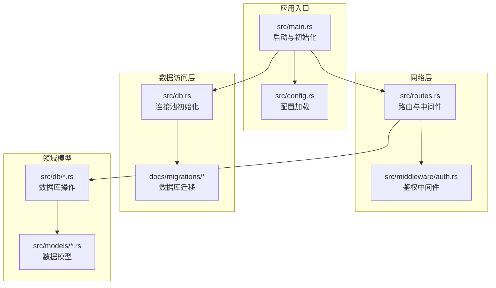
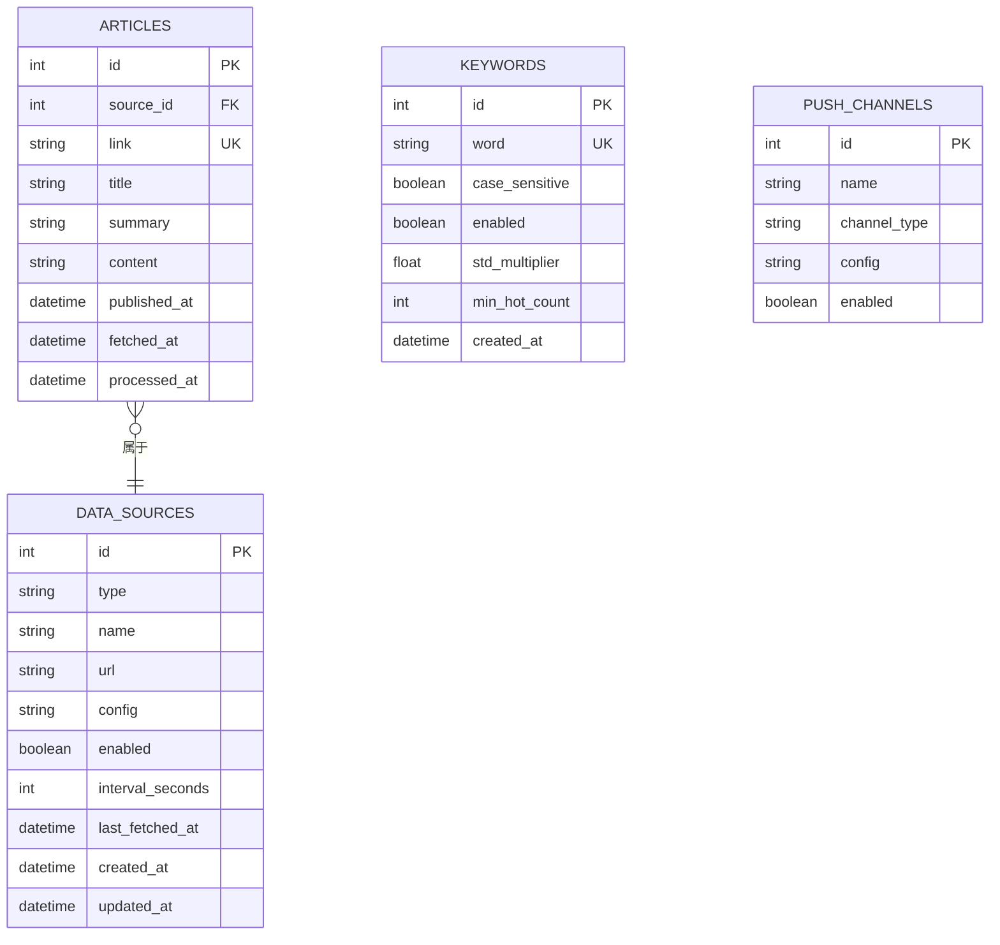
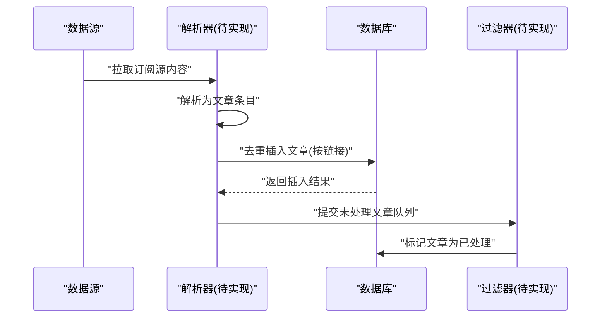
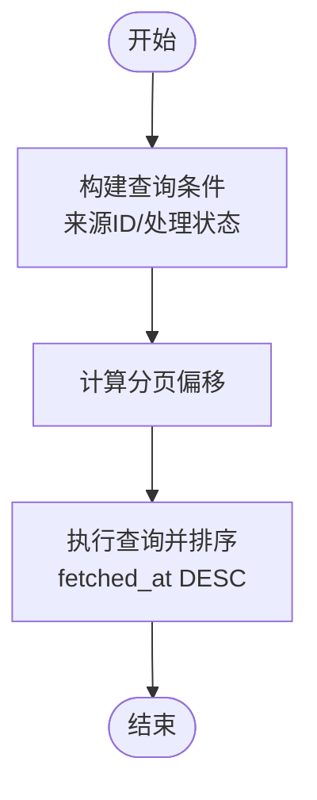
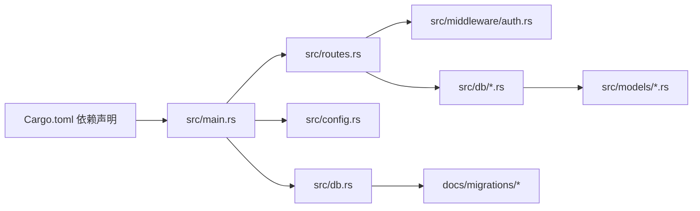

# 文章聚合系统

<cite>
**本文引用的文件**
- [src/main.rs](file://src/main.rs)
- [src/routes.rs](file://src/routes.rs)
- [src/db.rs](file://src/db.rs)
- [src/config.rs](file://src/config.rs)
- [src/middleware/auth.rs](file://src/middleware/auth.rs)
- [src/models/article.rs](file://src/models/article.rs)
- [src/db/article.rs](file://src/db/article.rs)
- [src/models/source.rs](file://src/models/source.rs)
- [src/models/channel.rs](file://src/models/channel.rs)
- [src/db/channel.rs](file://src/db/channel.rs)
- [src/models/keyword.rs](file://src/models/keyword.rs)
- [src/db/keyword.rs](file://src/db/keyword.rs)
- [docs/migrations/20260607044921_init.sql](file://docs/migrations/20260607044921_init.sql)
- [config.toml](file://config.toml)
- [Cargo.toml](file://Cargo.toml)
</cite>

## 目录
1. [简介](#简介)
2. [项目结构](#项目结构)
3. [核心组件](#核心组件)
4. [架构总览](#架构总览)
5. [详细组件分析](#详细组件分析)
6. [依赖关系分析](#依赖关系分析)
7. [性能考虑](#性能考虑)
8. [故障排查指南](#故障排查指南)
9. [结论](#结论)
10. [附录](#附录)

## 简介
本项目是一个基于 Rust 的文章聚合系统，支持从多种数据源（RSS/Atom/JSON Feed 等）抓取文章，进行去重、分类与排序，并提供关键词热度检测与实时推送能力。系统采用 SQLite 作为持久化存储，Axum 提供 REST API，通过令牌鉴权保护接口；后台模块在后续阶段将实现解析器、过滤器与推送器。

## 项目结构
系统采用按领域分层的模块组织方式：入口程序负责初始化配置、数据库连接池与迁移；路由模块定义 API；处理器模块承载业务逻辑；模型与数据库模块分别描述数据结构与 SQL 操作；中间件提供认证；配置模块管理运行参数；迁移脚本定义数据库结构。



图表来源
- [src/main.rs:63-95](file://src/main.rs#L63-L95)
- [src/routes.rs:14-61](file://src/routes.rs#L14-L61)
- [src/db.rs:11-25](file://src/db.rs#L11-L25)
- [docs/migrations/20260607044921_init.sql:1-118](file://docs/migrations/20260607044921_init.sql#L1-L118)

章节来源
- [src/main.rs:1-96](file://src/main.rs#L1-L96)
- [src/routes.rs:1-61](file://src/routes.rs#L1-L61)
- [src/db.rs:1-26](file://src/db.rs#L1-L26)
- [docs/migrations/20260607044921_init.sql:1-118](file://docs/migrations/20260607044921_init.sql#L1-L118)

## 核心组件
- 应用入口与生命周期
  - 初始化日志、加载配置、创建数据库目录、建立连接池、执行迁移、确保初始令牌存在、构建路由并启动服务。
- 路由与中间件
  - 定义 /api/v1 下的资源 API（令牌、数据源、关键词、频道），统一启用鉴权中间件，开放健康检查端点。
- 数据模型与数据库操作
  - 文章、数据源、关键词、推送频道等模型与对应的 CRUD 操作；文章表支持按来源与处理状态过滤、分页查询与去重插入。
- 配置管理
  - 支持服务器、数据库、鉴权、解析器、过滤器、推送器等模块的参数配置。
- 迁移脚本
  - 定义完整的数据库表结构、索引与约束，涵盖文章、数据源、关键词、热点事件、推送通道与记录。

章节来源
- [src/main.rs:63-95](file://src/main.rs#L63-L95)
- [src/routes.rs:14-61](file://src/routes.rs#L14-L61)
- [src/models/article.rs:1-25](file://src/models/article.rs#L1-L25)
- [src/db/article.rs:1-136](file://src/db/article.rs#L1-L136)
- [src/config.rs:52-59](file://src/config.rs#L52-L59)
- [docs/migrations/20260607044921_init.sql:1-118](file://docs/migrations/20260607044921_init.sql#L1-L118)

## 架构总览
系统采用“请求驱动 + 后台模块”的演进式架构：当前已实现 API 与基础数据模型，后续阶段将引入解析器、过滤器与推送器三大后台服务，形成“抓取 → 解析 → 去重 → 分类 → 排序 → 热点检测 → 推送”的完整链路。

```mermaid
graph TB
CLIENT["客户端/调用方"]
AXUM["Axum 服务"]
AUTHM["鉴权中间件"]
HANDLERS["处理器模块"]
DB["SQLite 数据库"]
MIGR["迁移脚本"]
CLIENT --> AXUM
AXUM --> AUTHM
AUTHM --> HANDLERS
HANDLERS --> DB
DB <- --> MIG
```

图表来源
- [src/routes.rs:14-61](file://src/routes.rs#L14-L61)
- [src/middleware/auth.rs:18-59](file://src/middleware/auth.rs#L18-L59)
- [src/db.rs:11-25](file://src/db.rs#L11-L25)
- [docs/migrations/20260607044921_init.sql:1-118](file://docs/migrations/20260607044921_init.sql#L1-L118)

## 详细组件分析

### 数据模型设计
- 文章模型
  - 字段：自增主键、来源 ID 外键、唯一链接、标题、摘要、正文、发布时间、抓取时间、处理完成时间。
  - 查询参数：页码、每页数量、来源 ID、是否已处理。
- 数据源模型
  - 字段：类型（rss/atom/json_feed 等）、名称、地址、配置 JSON、启用状态、抓取周期、最近抓取时间、创建/更新时间。
- 关键词模型
  - 字段：关键词、大小写敏感、启用状态、标准差倍数、最小热度阈值、创建时间。
- 推送频道模型
  - 字段：名称、类型（默认 webhook）、配置 JSON、启用状态。



图表来源
- [src/models/article.rs:5-24](file://src/models/article.rs#L5-L24)
- [src/models/source.rs:5-18](file://src/models/source.rs#L5-L18)
- [src/models/keyword.rs:5-14](file://src/models/keyword.rs#L5-L14)
- [src/models/channel.rs:4-11](file://src/models/channel.rs#L4-L11)
- [docs/migrations/20260607044921_init.sql:17-43](file://docs/migrations/20260607044921_init.sql#L17-L43)

章节来源
- [src/models/article.rs:1-25](file://src/models/article.rs#L1-L25)
- [src/models/source.rs:1-38](file://src/models/source.rs#L1-L38)
- [src/models/keyword.rs:1-32](file://src/models/keyword.rs#L1-L32)
- [src/models/channel.rs:1-26](file://src/models/channel.rs#L1-L26)
- [docs/migrations/20260607044921_init.sql:1-118](file://docs/migrations/20260607044921_init.sql#L1-L118)

### 抓取、解析与存储流程
- 抓取与解析（后台模块）
  - 使用 feed-rs 解析 RSS/Atom/JSON Feed，按配置并发抓取多个数据源，设置默认 UA 与超时。
  - 将解析后的条目转换为文章实体，调用去重插入函数。
- 去重与存储
  - 以文章链接为唯一键，使用 SQLite 的冲突忽略策略避免重复入库。
  - 插入后返回新记录或空值，便于上层判断是否新增。
- 后续处理
  - 后台模块将读取未处理文章，标记处理完成，触发关键词匹配与热点事件计算。



图表来源
- [src/db/article.rs:6-29](file://src/db/article.rs#L6-L29)
- [src/config.rs:31-35](file://src/config.rs#L31-L35)
- [Cargo.toml:29-30](file://Cargo.toml#L29-L30)

章节来源
- [src/db/article.rs:6-29](file://src/db/article.rs#L6-L29)
- [src/config.rs:31-35](file://src/config.rs#L31-L35)
- [Cargo.toml:29-30](file://Cargo.toml#L29-L30)

### 文章分类、去重与排序算法
- 去重策略
  - 基于文章链接的唯一性约束，插入时使用冲突忽略，避免重复。
- 分类与筛选
  - 支持按来源 ID 与处理状态（已处理/未处理）组合过滤。
- 排序与分页
  - 默认按抓取时间降序排列，支持页码与每页数量控制，最大每页 100 条。
- 索引优化
  - 对处理状态、来源 ID、抓取时间建立索引，提升查询性能。



图表来源
- [src/db/article.rs:31-75](file://src/db/article.rs#L31-L75)
- [docs/migrations/20260607044921_init.sql:45-47](file://docs/migrations/20260607044921_init.sql#L45-L47)

章节来源
- [src/db/article.rs:31-95](file://src/db/article.rs#L31-L95)
- [docs/migrations/20260607044921_init.sql:45-47](file://docs/migrations/20260607044921_init.sql#L45-L47)

### API 接口规范
- 认证
  - 所有 /api/v1 资源接口需携带 Bearer 令牌，支持过期校验与撤销校验。
- 健康检查
  - GET /health 返回服务状态。
- 令牌管理
  - POST /api/v1/tokens 创建令牌
  - GET /api/v1/tokens 列出令牌
  - POST /api/v1/tokens/revoke/{id} 撤销令牌
- 数据源管理
  - GET/POST /api/v1/sources 列表/创建
  - POST /api/v1/sources/{id}/update 更新
  - POST /api/v1/sources/{id}/delete 删除
  - POST /api/v1/sources/{id}/fetch 触发抓取
- 关键词管理
  - GET/POST /api/v1/keywords 列表/创建
  - POST /api/v1/keywords/{id}/update 更新
  - POST /api/v1/keywords/{id}/delete 删除
- 频道管理
  - GET/POST /api/v1/channels 列表/创建
  - POST /api/v1/channels/{id}/update 更新
  - POST /api/v1/channels/{id}/delete 删除

章节来源
- [src/routes.rs:20-44](file://src/routes.rs#L20-L44)
- [src/middleware/auth.rs:18-59](file://src/middleware/auth.rs#L18-L59)

### 与外部数据源的集成与同步机制
- 数据源类型
  - 支持 RSS、Atom、JSON Feed 等常见订阅格式。
- 抓取策略
  - 基于配置的抓取周期与并发限制，定时或手动触发抓取任务。
- 同步机制
  - 以链接唯一性保证幂等；抓取完成后标记处理状态，避免重复处理。

章节来源
- [src/models/source.rs:5-18](file://src/models/source.rs#L5-L18)
- [src/config.rs:31-35](file://src/config.rs#L31-L35)

### 错误处理与安全
- 鉴权中间件
  - 缺失或无效 Authorization 头、无效或撤销令牌、过期令牌均返回未授权错误。
  - 成功后异步更新令牌最近使用时间。
- 数据库错误
  - 统一通过 sqlx::Error 返回，上层可映射为应用错误。
- CORS
  - 允许跨域请求，便于前端直连。

章节来源
- [src/middleware/auth.rs:18-59](file://src/middleware/auth.rs#L18-L59)
- [src/routes.rs:49](file://src/routes.rs#L49)

### 性能优化方案
- 数据库连接池
  - 最大连接数 5，开启 WAL 模式与外键约束，提升并发与一致性。
- 查询优化
  - 为文章表的关键字段建立索引，减少排序与过滤成本。
- 分页与限制
  - 默认每页 20 条，最大 100 条，降低单次查询负载。
- 并发抓取
  - 解析器配置最大并发抓取数，避免对上游源造成压力。

章节来源
- [src/db.rs:11-25](file://src/db.rs#L11-L25)
- [docs/migrations/20260607044921_init.sql:45-47](file://docs/migrations/20260607044921_init.sql#L45-L47)
- [src/config.rs:31-35](file://src/config.rs#L31-L35)

### 实际使用示例与最佳实践
- 示例：创建数据源并触发抓取
  - POST /api/v1/sources 创建数据源（指定类型、URL、抓取周期）
  - POST /api/v1/sources/{id}/fetch 触发一次抓取
- 示例：列出文章并按来源过滤
  - GET /api/v1/sources 获取数据源列表
  - GET /api/v1/articles?page=1&per_page=20&source_id={id} 获取文章
- 最佳实践
  - 为每个数据源设置合理的抓取周期，避免频繁抓取
  - 使用关键词规则设定合适的阈值，平衡误报与漏报
  - 定期清理历史数据，保持数据库规模可控

章节来源
- [src/routes.rs:25-40](file://src/routes.rs#L25-L40)
- [src/db/article.rs:31-75](file://src/db/article.rs#L31-L75)

## 依赖关系分析
- 外部依赖
  - web 框架：axum、tower、tower-http
  - 数据库：sqlx（SQLite）
  - 序列化：serde、serde_json、toml
  - 时间：chrono
  - 日志：tracing、tracing-subscriber
  - 解析与匹配：feed-rs、aho-corasick
  - HTTP 客户端：reqwest
  - 工具：rand、hex、clap
- 内部模块耦合
  - 路由依赖处理器与中间件；处理器依赖数据库模块；数据库模块依赖模型模块；入口依赖配置与迁移。



图表来源
- [Cargo.toml:6-44](file://Cargo.toml#L6-L44)
- [src/main.rs:63-95](file://src/main.rs#L63-L95)
- [src/routes.rs:14-61](file://src/routes.rs#L14-L61)
- [src/db.rs:11-25](file://src/db.rs#L11-L25)

章节来源
- [Cargo.toml:6-44](file://Cargo.toml#L6-L44)
- [src/main.rs:63-95](file://src/main.rs#L63-L95)
- [src/routes.rs:14-61](file://src/routes.rs#L14-L61)
- [src/db.rs:11-25](file://src/db.rs#L11-L25)

## 性能考虑
- 数据库层面
  - WAL 模式提升读写并发；外键约束保障数据一致性；索引覆盖高频查询字段。
- 应用层面
  - 限制每页最大数量与最大并发抓取数；分页查询避免一次性载入过多数据。
- 网络层面
  - 设置合理的超时与用户代理，避免上游限流或阻断。

## 故障排查指南
- 无法连接数据库
  - 检查数据库路径是否存在且可写；确认迁移已成功执行。
- 令牌无效或过期
  - 通过 /api/v1/tokens 列表确认令牌状态；必要时重新生成。
- 抓取失败
  - 检查数据源 URL 可达性与格式；调整抓取周期与并发数。
- 查询性能差
  - 确认是否使用了来源 ID 或处理状态过滤；避免无限制的大页码。

章节来源
- [src/main.rs:70-80](file://src/main.rs#L70-L80)
- [src/middleware/auth.rs:36-46](file://src/middleware/auth.rs#L36-L46)
- [src/config.rs:31-35](file://src/config.rs#L31-L35)

## 结论
该文章聚合系统以清晰的模块划分与完善的数据库设计为基础，提供了可扩展的 API 与后台模块演进空间。通过链接去重、索引优化与分页限制，系统在可维护性与性能之间取得良好平衡。建议在后续阶段完善解析器、过滤器与推送器模块，以实现完整的自动化文章聚合与分发闭环。

## 附录
- 配置文件示例位置与关键参数
  - 服务器监听地址与端口
  - 数据库存储路径
  - 初始令牌（首次启动自动生成）
  - 解析器并发与超时
  - 过滤器批处理与历史窗口
  - 推送器重试策略

章节来源
- [config.toml:1-27](file://config.toml#L1-L27)
- [src/config.rs:52-59](file://src/config.rs#L52-L59)