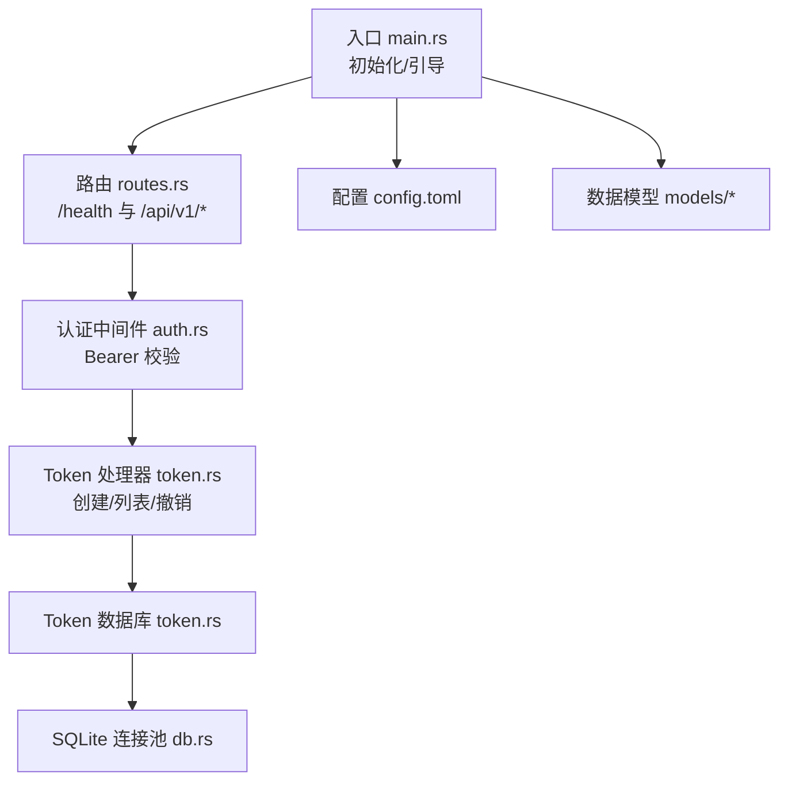
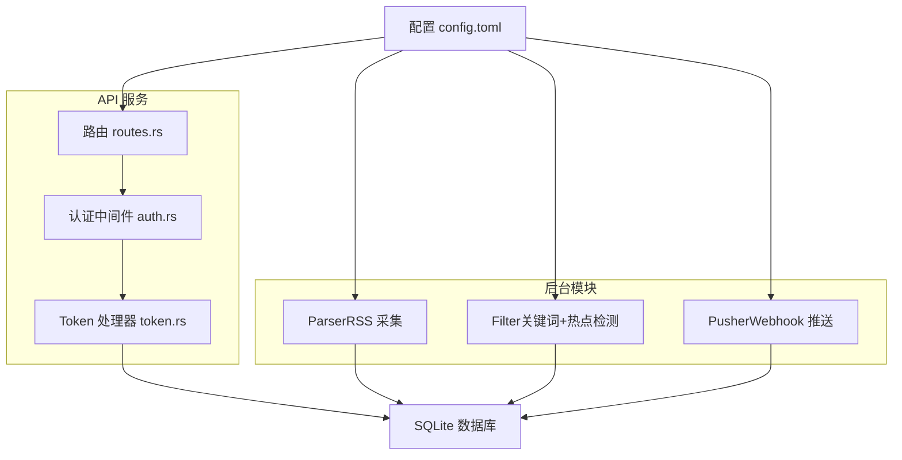
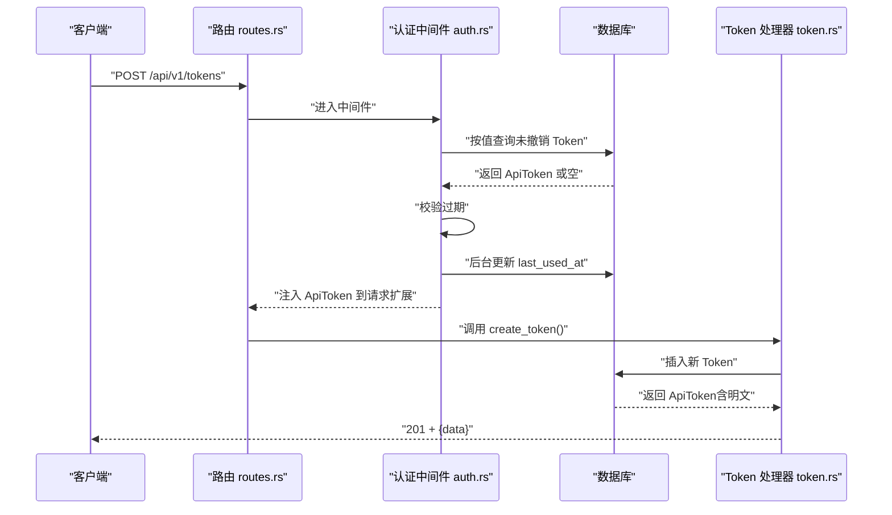
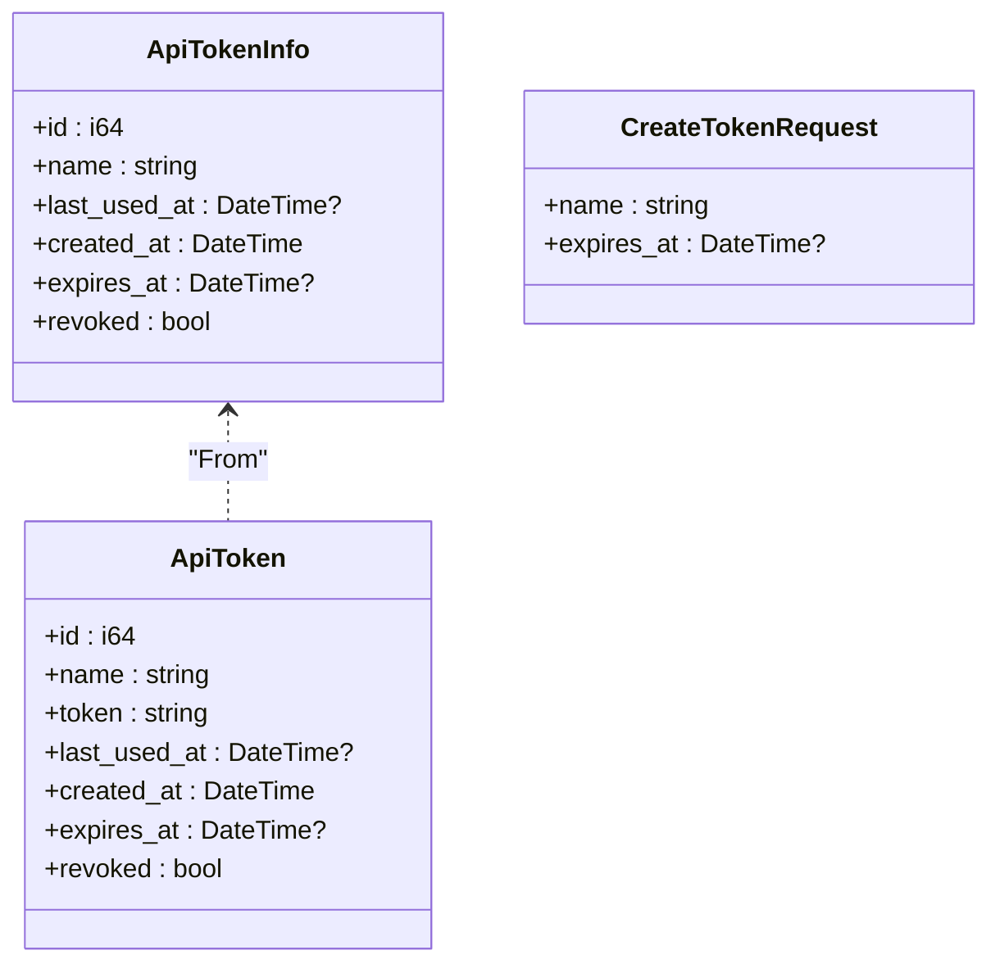
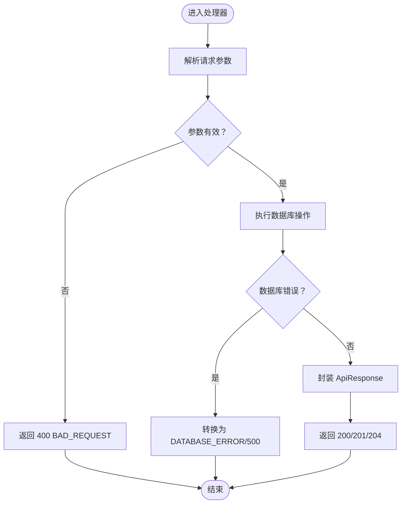
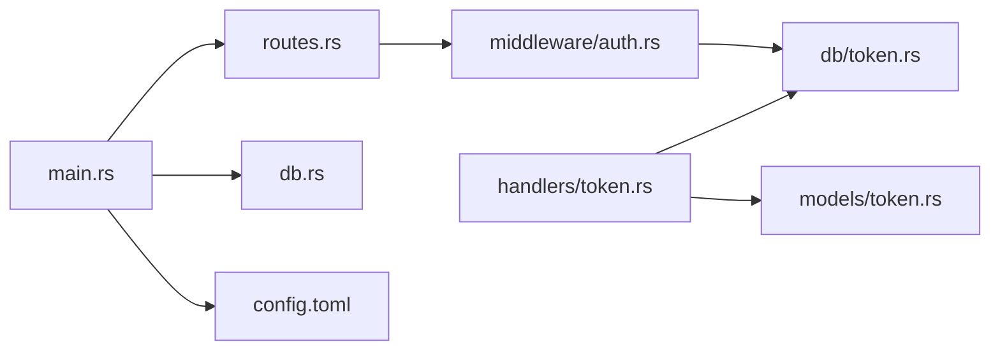

# 核心功能

<cite>
**本文引用的文件**
- [README.md](file://README.md)
- [src/main.rs](file://src/main.rs)
- [src/db.rs](file://src/db.rs)
- [src/routes.rs](file://src/routes.rs)
- [src/error.rs](file://src/error.rs)
- [src/models.rs](file://src/models.rs)
- [src/middleware/auth.rs](file://src/middleware/auth.rs)
- [src/handlers.rs](file://src/handlers.rs)
- [src/handlers/token.rs](file://src/handlers/token.rs)
- [src/db/token.rs](file://src/db/token.rs)
- [src/models/token.rs](file://src/models/token.rs)
- [src/models/article.rs](file://src/models/article.rs)
- [src/models/keyword.rs](file://src/models/keyword.rs)
- [src/models/hot_event.rs](file://src/models/hot_event.rs)
- [src/models/push_record.rs](file://src/models/push_record.rs)
- [src/models/source.rs](file://src/models/source.rs)
- [src/models/channel.rs](file://src/models/channel.rs)
- [config.toml](file://config.toml)
</cite>

## 目录
1. [简介](#简介)
2. [项目结构](#项目结构)
3. [核心组件](#核心组件)
4. [架构总览](#架构总览)
5. [详细组件分析](#详细组件分析)
6. [依赖关系分析](#依赖关系分析)
7. [性能考量](#性能考量)
8. [故障排查指南](#故障排查指南)
9. [结论](#结论)
10. [附录](#附录)

## 简介
本项目是一个基于 Rust 的 AI 热点监控平台，采用“管道模式（Pipeline）”组织三大后台模块：RSS 采集（Parser）、关键词与热点检测（Filter）、Webhook 推送（Pusher）。系统通过 Aho-Corasick 多模式匹配与统计突发检测识别热点，并以钉钉/飞书等 Webhook 渠道进行告警推送。后端使用 Axum + SQLite，提供基于 Bearer Token 的认证与授权，支持 Token 的创建、查询与撤销。

- 系统目标：自动化采集、关键词热点识别、可靠推送与安全认证
- 技术要点：Rust、Axum、SQLite、feed-rs、Aho-Corasick、reqwest、clap、tracing
- 运行方式：支持单模块或全模块组合运行，便于开发与运维

**章节来源**
- [README.md:1-293](file://README.md#L1-L293)

## 项目结构
项目采用模块化分层组织，核心目录与职责如下：
- src/main.rs：入口点、CLI 参数解析、数据库初始化、迁移、初始 Token 引导、路由构建与服务器启动
- src/routes.rs：路由注册、CORS 层、认证中间件挂载、健康检查
- src/middleware/auth.rs：Bearer Token 认证中间件，校验 Token、过期与撤销状态，异步更新最近使用时间
- src/handlers/token.rs：Token 管理 API 的处理器（创建、列表、撤销）
- src/db/token.rs：Token 相关数据库操作（增删改查、计数、首个可用 Token 查询）
- src/models/token.rs：Token 数据模型与请求/响应结构体
- src/db.rs：数据库连接池初始化（SQLite WAL、外键约束）
- src/error.rs：统一错误与响应封装
- src/models/*：数据模型（文章、关键词、热点事件、推送记录、数据源、推送渠道）
- config.toml：应用配置（服务器、数据库、认证、采集、过滤、推送）
- docs/migrations：数据库迁移 SQL

**图示来源**
- [src/main.rs:63-96](file://src/main.rs#L63-L96)
- [src/routes.rs:14-48](file://src/routes.rs#L14-L48)
- [src/middleware/auth.rs:18-60](file://src/middleware/auth.rs#L18-L60)
- [src/handlers/token.rs:18-66](file://src/handlers/token.rs#L18-L66)
- [src/db/token.rs:6-107](file://src/db/token.rs#L6-L107)
- [src/db.rs:11-26](file://src/db.rs#L11-L26)
- [config.toml:1-27](file://config.toml#L1-L27)

**章节来源**
- [src/main.rs:1-96](file://src/main.rs#L1-L96)
- [src/routes.rs:14-48](file://src/routes.rs#L14-L48)
- [src/db.rs:11-26](file://src/db.rs#L11-L26)
- [README.md:216-257](file://README.md#L216-L257)

## 核心组件
本节聚焦四大核心功能模块及其子模块：

- 认证与 Token 管理
  - 认证中间件：从 Authorization 头提取 Bearer Token，数据库校验（非撤销）、过期检查，后台更新最近使用时间，注入 ApiToken 至请求扩展
  - Token API：创建 Token（返回明文一次）、列出 Token（隐藏明文）、撤销 Token（软删除）
  - 初始化 Token：首次启动时，若数据库为空则根据配置或自动生成初始管理员 Token 并打印提示

- AI 热点事件监测（计划中）
  - 关键词匹配：Aho-Corasick 多模式匹配，扫描未处理文章
  - 突发检测：小时桶计数，滑动窗口统计均值与标准差，结合阈值判断热点
  - 去重与事件生成：同一关键词在同一小时仅生成一条热点事件

- 文章聚合（计划中）
  - RSS 采集：按数据源配置周期拉取，去重写入 articles 表
  - 处理追踪：processed_at 字段用于追踪过滤状态

- 推送记录管理（计划中）
  - 渠道配置：Webhook URL 等配置
  - 推送记录：每热点每渠道的推送状态、重试次数与下次重试时间
  - 指数退避：最大重试次数限制，退避公式按指数增长，乐观锁防重复

- 关键词分析（计划中）
  - 关键词模型：支持大小写敏感、启用状态、标准差倍数与最小热点计数等参数
  - 突发判定：结合历史统计与阈值参数决定热点

以上模块均通过统一的错误处理与响应封装，确保一致的 API 行为与可观测性。

**章节来源**
- [src/middleware/auth.rs:18-60](file://src/middleware/auth.rs#L18-L60)
- [src/handlers/token.rs:18-66](file://src/handlers/token.rs#L18-L66)
- [src/db/token.rs:6-107](file://src/db/token.rs#L6-L107)
- [src/main.rs:29-61](file://src/main.rs#L29-L61)
- [README.md:273-289](file://README.md#L273-L289)

## 架构总览
系统采用“管道模式”，三类后台模块可独立或组合运行。API 服务通过 Axum 提供 REST 接口，认证中间件保护所有 /api/v1/* 路由（/health 除外）。

**图示来源**
- [README.md:7-24](file://README.md#L7-L24)
- [src/routes.rs:14-48](file://src/routes.rs#L14-L48)
- [src/middleware/auth.rs:18-60](file://src/middleware/auth.rs#L18-L60)
- [src/handlers/token.rs:18-66](file://src/handlers/token.rs#L18-L66)
- [config.toml:1-27](file://config.toml#L1-L27)

## 详细组件分析

### 认证与 Token 管理
- 认证流程
  - 提取 Authorization 头中的 Bearer Token
  - 数据库查询有效（未撤销）Token
  - 校验过期时间
  - 异步更新 last_used_at
  - 将 ApiToken 注入请求扩展，供后续处理器使用

- Token API
  - 创建：生成 64 字节随机十六进制 Token，插入数据库并返回明文一次
  - 列表：返回 ApiTokenInfo（隐藏明文），按创建时间倒序
  - 撤销：软删除（revoked=1），若不存在返回 404

- 初始化 Token
  - 首次启动时，若 api_tokens 表为空：
    - 若配置了 initial_token，则使用该值
    - 否则自动生成 64 位随机 hex 字符串
  - 启动日志打印初始 Token，便于复制保存

**图示来源**
- [src/routes.rs:20-31](file://src/routes.rs#L20-L31)
- [src/middleware/auth.rs:18-60](file://src/middleware/auth.rs#L18-L60)
- [src/handlers/token.rs:18-30](file://src/handlers/token.rs#L18-L30)
- [src/db/token.rs:6-28](file://src/db/token.rs#L6-L28)

**章节来源**
- [src/middleware/auth.rs:18-60](file://src/middleware/auth.rs#L18-L60)
- [src/handlers/token.rs:18-66](file://src/handlers/token.rs#L18-L66)
- [src/db/token.rs:6-107](file://src/db/token.rs#L6-L107)
- [src/main.rs:29-61](file://src/main.rs#L29-L61)

### 数据模型与业务逻辑
- Token 模型与 API
  - ApiToken：包含标识、名称、明文 Token、最近使用时间、创建时间、过期时间与撤销标记
  - ApiTokenInfo：列表响应隐藏明文字段
  - CreateTokenRequest：创建请求体（名称、可选过期时间）

- 文章模型
  - Article：包含来源、链接（去重）、标题、摘要、正文、发布时间、抓取时间与处理时间
  - ArticleQuery：分页、来源与处理状态查询参数

- 关键词模型
  - Keyword：关键词、大小写敏感、启用状态、标准差倍数、最小热点计数与创建时间
  - Create/Update 请求体：支持部分字段更新

- 热点事件模型
  - HotEvent：关键词、小时桶、计数、历史均值与标准差、创建时间

- 推送记录模型
  - PushRecord：热点事件、推送渠道、状态、重试次数、下次重试时间、创建与更新时间

- 数据源与推送渠道
  - DataSource：类型、名称、URL、配置、启用状态、拉取间隔、最近抓取时间与时间戳
  - PushChannel：名称、类型、配置（JSON 字符串，如 Webhook URL）、启用状态
  - Create/Update 请求体：支持部分字段更新

**图示来源**
- [src/models/token.rs:5-46](file://src/models/token.rs#L5-L46)

**章节来源**
- [src/models/token.rs:5-46](file://src/models/token.rs#L5-L46)
- [src/models/article.rs:5-25](file://src/models/article.rs#L5-L25)
- [src/models/keyword.rs:5-32](file://src/models/keyword.rs#L5-L32)
- [src/models/hot_event.rs:5-15](file://src/models/hot_event.rs#L5-L15)
- [src/models/push_record.rs:5-16](file://src/models/push_record.rs#L5-L16)
- [src/models/source.rs:5-38](file://src/models/source.rs#L5-L38)
- [src/models/channel.rs:4-26](file://src/models/channel.rs#L4-L26)

### 统一错误处理与响应
- 错误类型覆盖常见 HTTP 状态码：400（请求无效）、401（未认证/已撤销/过期）、404（资源不存在）、409（冲突）、500（内部错误/数据库错误）
- 响应体统一为包含错误码与消息的对象
- 成功响应统一为 { "data": ... }，创建接口返回 201，无内容接口返回 204

**图示来源**
- [src/error.rs:8-79](file://src/error.rs#L8-L79)

**章节来源**
- [src/error.rs:8-79](file://src/error.rs#L8-L79)

## 依赖关系分析
- 组件耦合与内聚
  - 认证中间件与 Token 处理器强耦合于数据库层（db/token.rs），但通过 models/token.rs 抽象数据结构
  - 路由层仅负责注册与中间件挂载，业务逻辑集中在处理器与数据库模块
  - 数据模型集中于 models/*，便于跨模块复用

- 外部依赖与集成点
  - Axum + Tower：路由与中间件
  - sqlx + SQLite：持久化存储（WAL 模式 + 外键约束）
  - feed-rs：RSS 解析（计划中）
  - Aho-Corasick：多模式关键词匹配（计划中）
  - reqwest：Webhook 推送（计划中）
  - tracing：日志
  - clap：CLI 参数解析

**图示来源**
- [src/routes.rs:14-48](file://src/routes.rs#L14-L48)
- [src/middleware/auth.rs:18-60](file://src/middleware/auth.rs#L18-L60)
- [src/handlers/token.rs:18-66](file://src/handlers/token.rs#L18-L66)
- [src/db/token.rs:6-107](file://src/db/token.rs#L6-L107)
- [src/models/token.rs:5-46](file://src/models/token.rs#L5-L46)
- [src/db.rs:11-26](file://src/db.rs#L11-L26)
- [src/main.rs:63-96](file://src/main.rs#L63-L96)
- [config.toml:1-27](file://config.toml#L1-L27)

**章节来源**
- [src/routes.rs:14-48](file://src/routes.rs#L14-L48)
- [src/middleware/auth.rs:18-60](file://src/middleware/auth.rs#L18-L60)
- [src/handlers/token.rs:18-66](file://src/handlers/token.rs#L18-L66)
- [src/db/token.rs:6-107](file://src/db/token.rs#L6-L107)
- [src/db.rs:11-26](file://src/db.rs#L11-L26)
- [src/main.rs:63-96](file://src/main.rs#L63-L96)
- [config.toml:1-27](file://config.toml#L1-L27)

## 性能考量
- 数据库连接池：最大连接数限制，SQLite WAL 模式提升并发写入性能，外键约束保障一致性
- 认证中间件：后台异步更新 last_used_at，避免阻塞请求主路径
- 推送重试：指数退避与乐观锁，降低并发重复推送风险并控制重试频率
- 关键词匹配：Aho-Corasick 支持大规模关键词集合的高效多模式匹配（计划中）

**章节来源**
- [src/db.rs:11-26](file://src/db.rs#L11-L26)
- [src/middleware/auth.rs:48-53](file://src/middleware/auth.rs#L48-L53)
- [README.md:282-289](file://README.md#L282-L289)
- [README.md:273-281](file://README.md#L273-L281)

## 故障排查指南
- 认证失败
  - 检查 Authorization 头是否为 Bearer 格式
  - 确认 Token 未被撤销且未过期
  - 查看数据库中是否存在对应 Token 记录

- Token 管理异常
  - 创建 Token 返回明文一次，注意安全存储
  - 列表接口不返回明文，仅用于审计与管理
  - 撤销后仍可查询确认状态

- 数据库相关
  - 首次启动会自动执行迁移，确保数据库结构正确
  - 如遇数据库错误，查看统一错误响应中的 DATABASE_ERROR 与日志

- 启动与配置
  - 确认配置文件路径与权限
  - 初始 Token 会在首次启动时打印，请妥善保存

**章节来源**
- [src/middleware/auth.rs:23-46](file://src/middleware/auth.rs#L23-L46)
- [src/handlers/token.rs:18-66](file://src/handlers/token.rs#L18-L66)
- [src/error.rs:31-38](file://src/error.rs#L31-L38)
- [src/main.rs:29-61](file://src/main.rs#L29-L61)
- [config.toml:1-27](file://config.toml#L1-L27)

## 结论
本项目以清晰的模块划分与统一的错误处理为基础，提供了完整的认证与 Token 管理能力，并为 RSS 采集、关键词热点检测与 Webhook 推送预留了完善的数据库模型与配置接口。通过 Aho-Corasick 与统计突发检测的组合，系统具备高扩展性的热点识别能力；通过指数退避与乐观锁，确保推送的可靠性与一致性。建议在后续迭代中逐步完善 Parser、Filter、Pusher 三大模块的实现，并补充前端管理界面与可视化仪表盘。

## 附录
- 使用场景示例（路径参考）
  - 创建 Token：POST /api/v1/tokens（请求体参考 [src/models/token.rs:40-44](file://src/models/token.rs#L40-L44)）
  - 列出 Token：GET /api/v1/tokens（处理器参考 [src/handlers/token.rs:36-43](file://src/handlers/token.rs#L36-L43)）
  - 撤销 Token：POST /api/v1/tokens/revoke/{id}（处理器参考 [src/handlers/token.rs:49-65](file://src/handlers/token.rs#L49-L65)）
  - 健康检查：GET /health（路由参考 [src/routes.rs:39-41](file://src/routes.rs#L39-L41)）
  - 配置项：服务器、数据库、认证、采集、过滤、推送（参考 [config.toml:1-27](file://config.toml#L1-L27)）