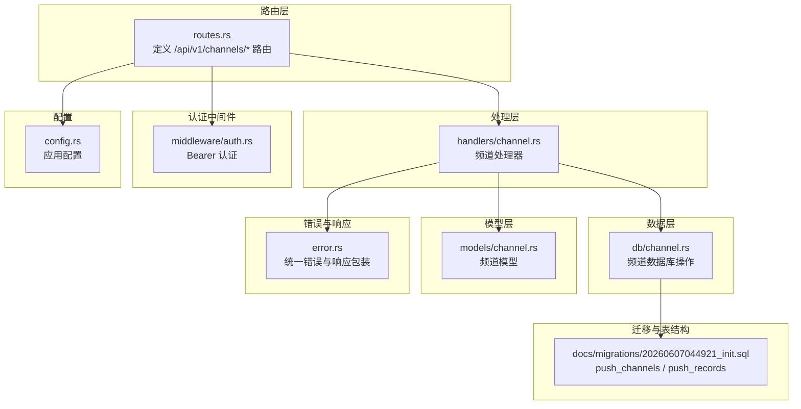
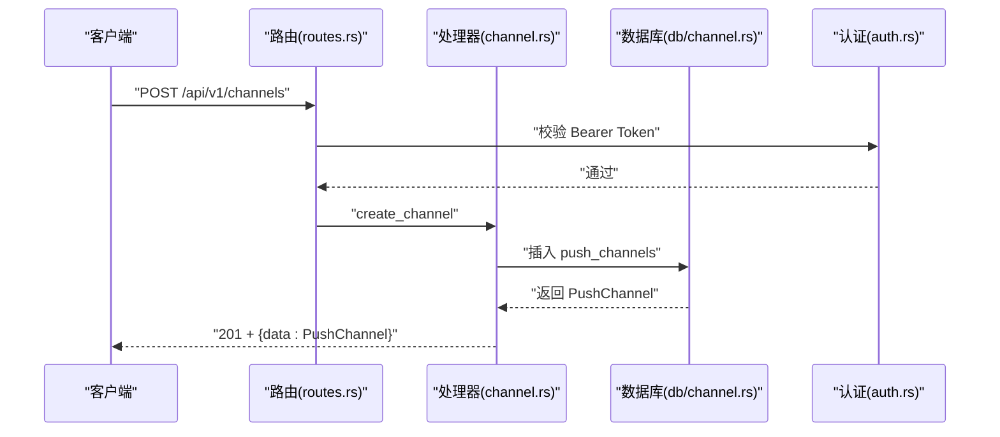
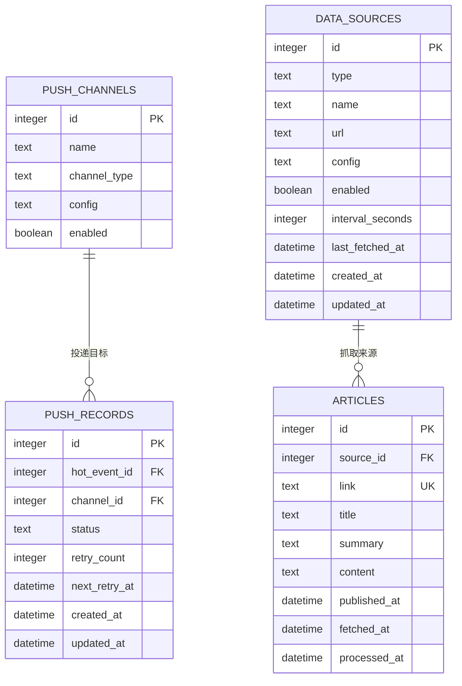
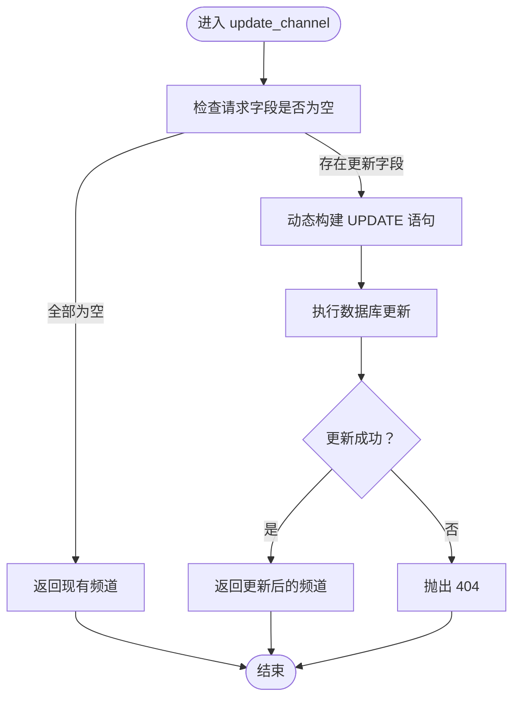
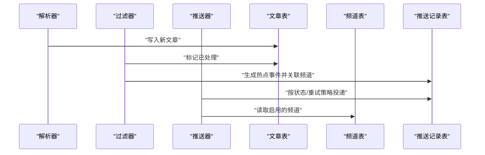
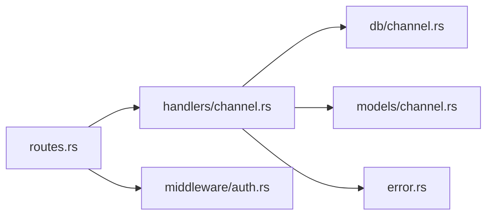

# 频道管理

<cite>
**本文引用的文件**
- [src/models/channel.rs](file://src/models/channel.rs)
- [src/db/channel.rs](file://src/db/channel.rs)
- [src/handlers/channel.rs](file://src/handlers/channel.rs)
- [src/routes.rs](file://src/routes.rs)
- [src/middleware/auth.rs](file://src/middleware/auth.rs)
- [src/error.rs](file://src/error.rs)
- [src/config.rs](file://src/config.rs)
- [src/services.rs](file://src/services.rs)
- [docs/migrations/20260607044921_init.sql](file://docs/migrations/20260607044921_init.sql)
- [src/models/article.rs](file://src/models/article.rs)
- [src/db/article.rs](file://src/db/article.rs)
- [src/models/source.rs](file://src/models/source.rs)
- [src/db/source.rs](file://src/db/source.rs)
</cite>

## 目录
1. [简介](#简介)
2. [项目结构](#项目结构)
3. [核心组件](#核心组件)
4. [架构总览](#架构总览)
5. [详细组件分析](#详细组件分析)
6. [依赖关系分析](#依赖关系分析)
7. [性能考虑](#性能考虑)
8. [故障排查指南](#故障排查指南)
9. [结论](#结论)
10. [附录](#附录)

## 简介
本文件系统性地文档化“频道管理”功能，围绕推送频道（Channel）的数据模型、创建/编辑/删除/状态管理、与文章的关联与筛选、订阅/退订与个性化推荐、分类与标签、统计与质量监控、配置与自定义属性、以及多租户隔离与权限控制进行深入说明。当前实现以“推送频道”为核心实体，采用 Webhook 类型作为默认通道，并通过独立的推送记录表实现热点事件到频道的投递跟踪。

## 项目结构
频道管理功能在后端采用清晰的分层设计：
- 路由层：定义 REST API 路径与中间件
- 处理层：实现业务逻辑，调用数据库层
- 数据层：封装 SQL 操作，提供类型安全的 CRUD
- 模型层：定义请求/响应与数据库实体
- 配置与错误：统一配置项与错误响应格式
- 迁移脚本：定义频道、推送记录等核心表结构

图表来源
- [src/routes.rs:14-50](file://src/routes.rs#L14-L50)
- [src/handlers/channel.rs:1-70](file://src/handlers/channel.rs#L1-L70)
- [src/db/channel.rs:1-94](file://src/db/channel.rs#L1-L94)
- [src/models/channel.rs:1-26](file://src/models/channel.rs#L1-L26)
- [src/middleware/auth.rs:14-59](file://src/middleware/auth.rs#L14-L59)
- [src/error.rs:61-79](file://src/error.rs#L61-L79)
- [src/config.rs:52-59](file://src/config.rs#L52-L59)
- [docs/migrations/20260607044921_init.sql:92-118](file://docs/migrations/20260607044921_init.sql#L92-L118)

章节来源
- [src/routes.rs:14-50](file://src/routes.rs#L14-L50)
- [src/handlers/channel.rs:1-70](file://src/handlers/channel.rs#L1-L70)
- [src/db/channel.rs:1-94](file://src/db/channel.rs#L1-L94)
- [src/models/channel.rs:1-26](file://src/models/channel.rs#L1-L26)
- [src/middleware/auth.rs:14-59](file://src/middleware/auth.rs#L14-L59)
- [src/error.rs:61-79](file://src/error.rs#L61-L79)
- [src/config.rs:52-59](file://src/config.rs#L52-L59)
- [docs/migrations/20260607044921_init.sql:92-118](file://docs/migrations/20260607044921_init.sql#L92-L118)

## 核心组件
- 频道数据模型
  - 实体：PushChannel（包含标识、名称、类型、配置、启用状态）
  - 请求模型：CreateChannelRequest（创建）、UpdateChannelRequest（更新）
- 数据库操作
  - create_channel、list_channels、list_enabled_channels、get_channel_by_id、update_channel、delete_channel
- 处理器
  - list_channels、create_channel、update_channel、delete_channel
- 路由与中间件
  - /api/v1/channels* 路由，统一 Bearer 认证中间件
- 错误与响应
  - 统一错误码与响应包装 ApiResponse

章节来源
- [src/models/channel.rs:4-26](file://src/models/channel.rs#L4-L26)
- [src/db/channel.rs:5-94](file://src/db/channel.rs#L5-L94)
- [src/handlers/channel.rs:1-70](file://src/handlers/channel.rs#L1-L70)
- [src/routes.rs:36-44](file://src/routes.rs#L36-L44)
- [src/middleware/auth.rs:14-59](file://src/middleware/auth.rs#L14-L59)
- [src/error.rs:61-79](file://src/error.rs#L61-L79)

## 架构总览
频道管理遵循“路由 → 处理器 → 数据库”的标准分层，所有写操作均受 Bearer Token 认证保护。频道实体与文章、关键词、热点事件之间通过独立的推送记录表建立弱耦合关联，便于扩展订阅/退订与个性化推荐能力。

图表来源
- [src/routes.rs:36-44](file://src/routes.rs#L36-L44)
- [src/handlers/channel.rs:1-33](file://src/handlers/channel.rs#L1-L33)
- [src/db/channel.rs:5-18](file://src/db/channel.rs#L5-L18)
- [src/middleware/auth.rs:18-59](file://src/middleware/auth.rs#L18-L59)

## 详细组件分析

### 数据模型与表结构
- 频道实体（push_channels）
  - 字段：id、name、channel_type（默认 webhook）、config（JSON 字符串）、enabled
  - 用途：定义推送目标（如 Webhook 地址等），支持启用/禁用
- 推送记录（push_records）
  - 字段：id、hot_event_id、channel_id、status（pending/success/failed）、retry_count、next_retry_at、created_at、updated_at
  - 用途：跟踪热点事件向各频道的投递状态与重试策略
- 文章与数据源
  - 文章表包含 source_id 外键，用于与数据源关联；频道与文章无直接外键，通过热点事件/关键词间接关联

图表来源
- [docs/migrations/20260607044921_init.sql:92-118](file://docs/migrations/20260607044921_init.sql#L92-L118)
- [docs/migrations/20260607044921_init.sql:17-48](file://docs/migrations/20260607044921_init.sql#L17-L48)

章节来源
- [docs/migrations/20260607044921_init.sql:92-118](file://docs/migrations/20260607044921_init.sql#L92-L118)
- [src/models/channel.rs:4-11](file://src/models/channel.rs#L4-L11)
- [src/models/article.rs:5-16](file://src/models/article.rs#L5-L16)
- [src/models/source.rs:5-19](file://src/models/source.rs#L5-L19)

### 创建、编辑、删除与状态管理
- 创建频道
  - 默认 channel_type 为 webhook；config 以 JSON 字符串形式存储
  - 返回 201 与频道对象
- 编辑频道
  - 支持部分字段更新（名称、配置、启用状态）
  - 若未提供任何字段，则返回原频道
- 删除频道
  - 存在性检查后执行删除，不存在则返回 404
- 状态管理
  - enabled 字段控制是否参与后续推送

图表来源
- [src/handlers/channel.rs:34-53](file://src/handlers/channel.rs#L34-L53)
- [src/db/channel.rs:48-85](file://src/db/channel.rs#L48-L85)

章节来源
- [src/handlers/channel.rs:1-70](file://src/handlers/channel.rs#L1-L70)
- [src/db/channel.rs:5-94](file://src/db/channel.rs#L5-L94)
- [src/models/channel.rs:13-25](file://src/models/channel.rs#L13-L25)

### 与文章的关联与内容筛选
- 当前结构
  - 频道与文章无直接外键关联；文章与数据源有关联
  - 推送记录表连接热点事件与频道，用于投递跟踪
- 建议扩展
  - 在推送记录中增加文章 ID 或热点事件与文章的映射，以支持按频道查看命中文章
  - 在查询接口中增加按频道过滤的参数（例如通过热点事件/关键词维度）

图表来源
- [src/db/article.rs:107-125](file://src/db/article.rs#L107-L125)
- [src/db/channel.rs:28-36](file://src/db/channel.rs#L28-L36)
- [docs/migrations/20260607044921_init.sql:105-115](file://docs/migrations/20260607044921_init.sql#L105-L115)

章节来源
- [src/db/article.rs:107-125](file://src/db/article.rs#L107-L125)
- [src/db/channel.rs:28-36](file://src/db/channel.rs#L28-L36)
- [docs/migrations/20260607044921_init.sql:105-115](file://docs/migrations/20260607044921_init.sql#L105-L115)

### 订阅、退订与个性化推荐
- 当前实现
  - 未提供频道订阅/退订的专用实体或接口
- 建议方案
  - 新增用户-频道订阅表，记录订阅关系与偏好
  - 在推送时按订阅关系筛选目标频道
  - 结合关键词/热度指标实现个性化推荐

[本节为概念性建议，不直接对应具体源码文件]

### 分类体系与标签管理
- 当前实现
  - 频道模型未包含分类字段
  - 关键词表提供分类/标签能力，但与频道无直接关联
- 建议方案
  - 在频道模型中增加分类字段或引入标签表/中间表
  - 将关键词与频道关联，实现基于关键词的频道分类

章节来源
- [src/models/channel.rs:4-11](file://src/models/channel.rs#L4-L11)
- [docs/migrations/20260607044921_init.sql:52-74](file://docs/migrations/20260607044921_init.sql#L52-L74)

### 统计分析、活跃度评估与内容质量监控
- 可观测性
  - 推送记录表可统计投递成功率、失败率、重试次数与时序
  - 结合热点事件表可评估关键词热度与传播趋势
- 建议指标
  - 频道级：投递成功率、平均延迟、失败原因分布
  - 内容级：命中文章数、去重后文章数、处理时延

章节来源
- [docs/migrations/20260607044921_init.sql:78-86](file://docs/migrations/20260607044921_init.sql#L78-L86)
- [docs/migrations/20260607044921_init.sql:105-115](file://docs/migrations/20260607044921_init.sql#L105-L115)

### 配置选项与自定义属性
- 应用配置
  - 包含服务器、数据库、认证、解析器、过滤器、推送器等配置项
  - 推送器配置可用于控制重试策略与频率
- 频道配置
  - config 字段为 JSON 字符串，可用于存放 Webhook URL、鉴权头、超时等自定义属性

章节来源
- [src/config.rs:46-50](file://src/config.rs#L46-L50)
- [src/models/channel.rs:9](file://src/models/channel.rs#L9)
- [docs/migrations/20260607044921_init.sql:98](file://docs/migrations/20260607044921_init.sql#L98)

### 多租户隔离与权限控制
- 权限控制
  - 全部写操作受 Bearer Token 认证中间件保护
  - 中间件校验令牌有效性、过期时间与撤销状态
- 多租户隔离
  - 当前数据库为单实例 SQLite，未见租户字段
  - 建议在频道、推送记录等表增加租户标识字段，并在查询/写入时强制带租户上下文

章节来源
- [src/middleware/auth.rs:18-59](file://src/middleware/auth.rs#L18-L59)
- [src/routes.rs:44](file://src/routes.rs#L44)

## 依赖关系分析
- 路由 → 处理器：/api/v1/channels* 路由绑定至频道处理器
- 处理器 → 数据库：频道处理器调用 db/channel.rs 的 CRUD 函数
- 处理器 → 模型：使用 models/channel.rs 的请求/响应模型
- 路由 → 中间件：统一注入认证中间件
- 错误处理：统一转换为标准错误响应

图表来源
- [src/routes.rs:14-50](file://src/routes.rs#L14-L50)
- [src/handlers/channel.rs:1-70](file://src/handlers/channel.rs#L1-L70)
- [src/db/channel.rs:1-94](file://src/db/channel.rs#L1-L94)
- [src/models/channel.rs:1-26](file://src/models/channel.rs#L1-L26)
- [src/middleware/auth.rs:14-59](file://src/middleware/auth.rs#L14-L59)
- [src/error.rs:61-79](file://src/error.rs#L61-L79)

章节来源
- [src/routes.rs:14-50](file://src/routes.rs#L14-L50)
- [src/handlers/channel.rs:1-70](file://src/handlers/channel.rs#L1-L70)
- [src/db/channel.rs:1-94](file://src/db/channel.rs#L1-L94)
- [src/models/channel.rs:1-26](file://src/models/channel.rs#L1-L26)
- [src/middleware/auth.rs:14-59](file://src/middleware/auth.rs#L14-L59)
- [src/error.rs:61-79](file://src/error.rs#L61-L79)

## 性能考虑
- 查询优化
  - 列表接口按 id 排序，适合分页
  - 启用的频道查询可减少推送器扫描范围
- 并发与后台任务
  - 推送器与解析器为后台模块，应结合配置项控制并发与重试
- 索引与统计
  - 推送记录表按 status 建立索引，有利于失败重试扫描

章节来源
- [src/db/channel.rs:20-36](file://src/db/channel.rs#L20-L36)
- [src/config.rs:46-50](file://src/config.rs#L46-L50)
- [docs/migrations/20260607044921_init.sql:117](file://docs/migrations/20260607044921_init.sql#L117)

## 故障排查指南
- 401 未授权
  - 检查 Authorization 头是否为 Bearer Token，令牌是否有效、未撤销、未过期
- 404 未找到
  - 更新/删除频道前先查询是否存在；确认 id 正确
- 500 内部错误
  - 查看日志中的数据库错误信息；确认表结构与迁移一致

章节来源
- [src/middleware/auth.rs:23-46](file://src/middleware/auth.rs#L23-L46)
- [src/error.rs:23-49](file://src/error.rs#L23-L49)
- [src/handlers/channel.rs:44-66](file://src/handlers/channel.rs#L44-L66)

## 结论
频道管理功能以“推送频道”为核心，具备基础的创建、编辑、删除与启用控制，并通过推送记录实现投递跟踪。当前未包含订阅/退订、个性化推荐、分类/标签、多租户隔离等高级能力。建议在保持现有分层架构的前提下，逐步引入订阅关系、频道分类/标签、租户隔离与更丰富的统计分析能力。

## 附录
- 相关表结构与索引
  - push_channels：频道定义与配置
  - push_records：投递状态与重试
  - data_sources / articles：内容来源与文章
- 相关背景服务
  - 解析器、过滤器、推送器为后台模块入口

章节来源
- [docs/migrations/20260607044921_init.sql:92-118](file://docs/migrations/20260607044921_init.sql#L92-L118)
- [src/services.rs:1-6](file://src/services.rs#L1-L6)