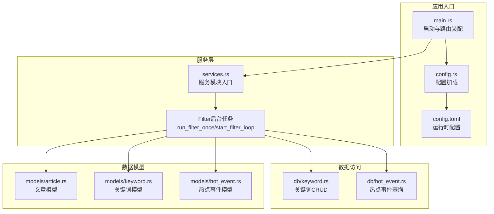
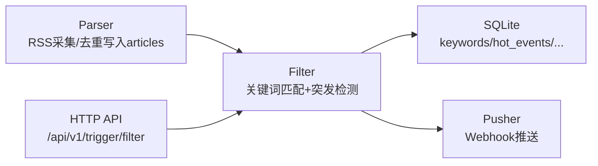
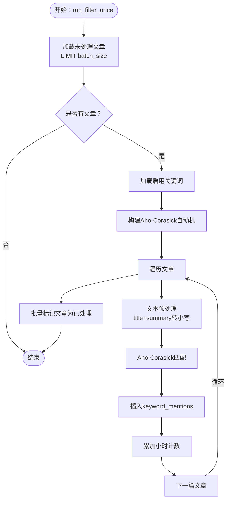
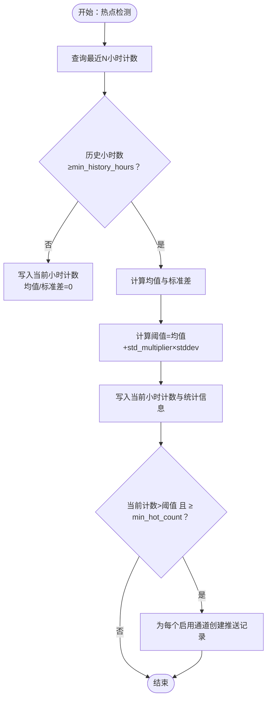
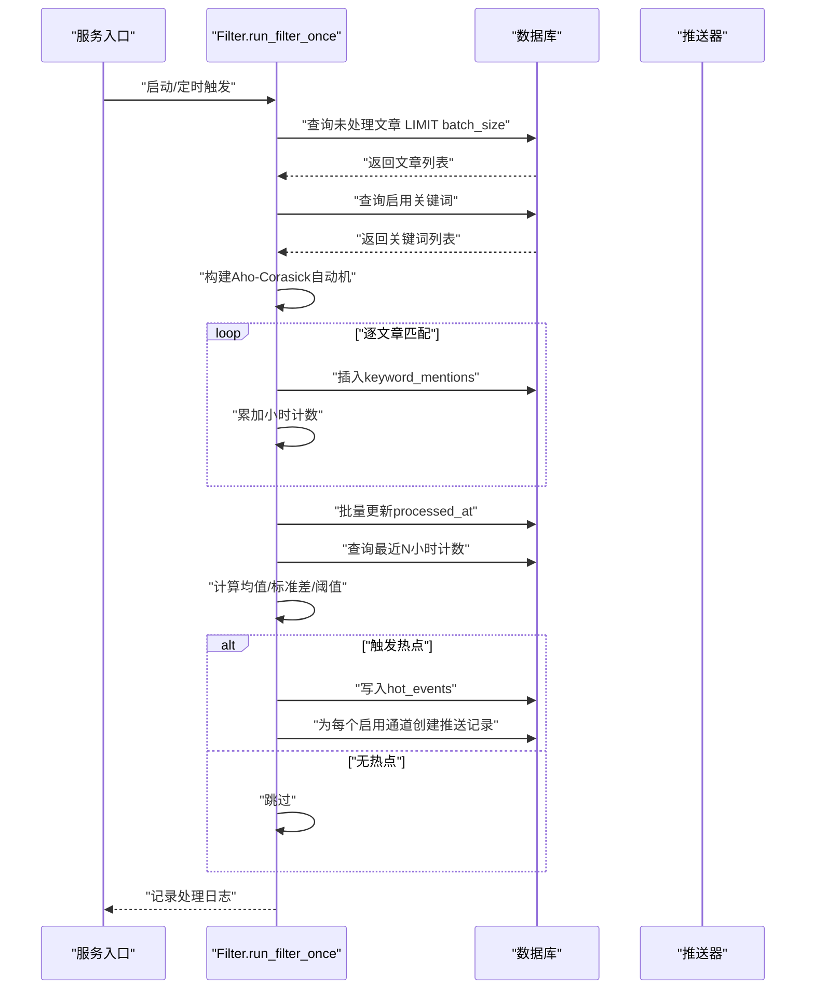
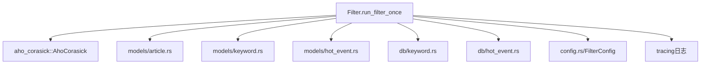

# Filter过滤模块

<cite>
**本文引用的文件**
- [main.rs](file://src/main.rs)
- [config.rs](file://src/config.rs)
- [config.toml](file://config.toml)
- [routes.rs](file://src/routes.rs)
- [services.rs](file://src/services.rs)
- [README.md](file://README.md)
- [spec.md](file://openspec/changes/query-apis-and-background-modules/specs/filter-module/spec.md)
- [05-query-apis-and-background-modules.md](file://docs/plans/05-query-apis-and-background-modules.md)
- [database-schema.spec.md](file://openspec/specs/database-schema/spec.md)
- [article.rs](file://src/models/article.rs)
- [keyword.rs](file://src/models/keyword.rs)
- [hot_event.rs](file://src/models/hot_event.rs)
- [keyword_db.rs](file://src/db/keyword.rs)
- [hot_event_db.rs](file://src/db/hot_event.rs)
</cite>

## 目录
1. [简介](#简介)
2. [项目结构](#项目结构)
3. [核心组件](#核心组件)
4. [架构总览](#架构总览)
5. [详细组件分析](#详细组件分析)
6. [依赖关系分析](#依赖关系分析)
7. [性能考虑](#性能考虑)
8. [故障排查指南](#故障排查指南)
9. [结论](#结论)
10. [附录](#附录)

## 简介
本文件为Filter过滤模块的全面技术文档，聚焦以下目标：
- 关键词匹配算法：Aho-Corasick多模式匹配的构建与应用、大小写敏感控制、命中记录与计数。
- 统计突发检测：时间窗口划分（小时桶）、历史频次统计、均值与标准差计算、阈值设定与热点事件识别。
- 数据处理流程：从文章表读取未处理条目、批量关键词匹配、命中明细入库、小时级计数与热点检测、标记处理完成。
- 性能优化与内存管理：批量查询与更新、SQLite批处理技巧、索引与查询优化。
- 配置与调优：关键词权重与阈值参数、Filter批大小与调度间隔、历史窗口与最小历史要求。
- 错误处理与监控：日志记录、异常捕获、健康检查与API路由。

## 项目结构
Filter模块位于服务层，作为独立后台任务与API触发器协同工作，配合Parser采集与Pusher推送形成完整的数据流水线。

图表来源
- [main.rs:63-96](file://src/main.rs#L63-L96)
- [config.rs:52-59](file://src/config.rs#L52-L59)
- [services.rs:1-6](file://src/services.rs#L1-L6)
- [keyword_db.rs:1-115](file://src/db/keyword.rs#L1-L115)
- [hot_event_db.rs:1-81](file://src/db/hot_event.rs#L1-L81)
- [article.rs:1-25](file://src/models/article.rs#L1-L25)
- [keyword.rs:1-32](file://src/models/keyword.rs#L1-L32)
- [hot_event.rs:1-15](file://src/models/hot_event.rs#L1-L15)

章节来源
- [README.md:1-23](file://README.md#L1-L23)
- [main.rs:63-96](file://src/main.rs#L63-L96)
- [config.rs:52-59](file://src/config.rs#L52-L59)
- [services.rs:1-6](file://src/services.rs#L1-L6)

## 核心组件
- Filter后台任务：定时执行run_filter_once，负责批量抓取未处理文章、构建Aho-Corasick自动机、进行关键词匹配、累计小时计数、统计突发检测、生成热点事件与推送记录，并标记文章为已处理。
- 配置系统：FilterConfig定义批大小、调度间隔、历史小时数与最小历史小时数等参数。
- 数据模型：Article、Keyword、HotEvent支撑文章采集、关键词配置与热点事件存储。
- 数据访问层：关键词与热点事件的增删改查接口，支持按小时桶聚合查询。

章节来源
- [05-query-apis-and-background-modules.md:531-740](file://docs/plans/05-query-apis-and-background-modules.md#L531-L740)
- [config.rs:37-44](file://src/config.rs#L37-L44)
- [article.rs:1-25](file://src/models/article.rs#L1-L25)
- [keyword.rs:1-32](file://src/models/keyword.rs#L1-L32)
- [hot_event.rs:1-15](file://src/models/hot_event.rs#L1-L15)
- [keyword_db.rs:1-115](file://src/db/keyword.rs#L1-L115)
- [hot_event_db.rs:1-81](file://src/db/hot_event.rs#L1-L81)

## 架构总览
Filter模块在整体流水线中的职责与交互如下：

图表来源
- [README.md:7-23](file://README.md#L7-L23)
- [05-query-apis-and-background-modules.md:921-959](file://docs/plans/05-query-apis-and-background-modules.md#L921-L959)

## 详细组件分析

### Aho-Corasick关键词匹配算法
- 自动机构建：从启用的关键词集合构建Aho-Corasick自动机，支持大小写不敏感匹配；对大小写敏感关键词按原词构建。
- 文本预处理：将标题与摘要拼接后统一转小写以适配自动机构建策略。
- 命中记录：每次匹配命中即插入keyword_mentions明细表，同时累加当前小时的关键词计数。
- 批量处理：文章按批次读取，避免一次性占用过多内存。

图表来源
- [05-query-apis-and-background-modules.md:543-725](file://docs/plans/05-query-apis-and-background-modules.md#L543-L725)

章节来源
- [05-query-apis-and-background-modules.md:531-740](file://docs/plans/05-query-apis-and-background-modules.md#L531-L740)
- [spec.md:31-49](file://openspec/changes/query-apis-and-background-modules/specs/filter-module/spec.md#L31-L49)

### 统计突发检测算法
- 时间窗口：以“年月日时”格式的hour_bucket作为小时级时间窗口。
- 历史统计：从hot_events表按keyword_id与最近N小时聚合计数，计算均值与标准差。
- 阈值设定：阈值 = 均值 + 关键词标准差倍数 × 标准差。
- 触发条件：当前小时计数超过阈值且不低于最小热点计数，则判定为热点事件，写入hot_events并为每个启用通道创建推送记录。

图表来源
- [05-query-apis-and-background-modules.md:617-704](file://docs/plans/05-query-apis-and-background-modules.md#L617-L704)
- [database-schema.spec.md:125-167](file://openspec/specs/database-schema/spec.md#L125-L167)

章节来源
- [05-query-apis-and-background-modules.md:617-704](file://docs/plans/05-query-apis-and-background-modules.md#L617-L704)
- [hot_event_db.rs:62-80](file://src/db/hot_event.rs#L62-L80)

### 数据处理流程与性能优化
- 批量读取：按配置的batch_size限制每次处理的文章数量，避免内存峰值。
- 批量更新：由于SQLite不支持大批量IN参数，采用分批（如每批100）更新processed_at。
- 索引利用：hot_events表对keyword_id与hour_bucket建立索引，加速热点查询与聚合。
- 日志与监控：使用tracing记录处理进度与错误，便于运维观察。

图表来源
- [05-query-apis-and-background-modules.md:543-725](file://docs/plans/05-query-apis-and-background-modules.md#L543-L725)
- [database-schema.spec.md:125-167](file://openspec/specs/database-schema/spec.md#L125-L167)

章节来源
- [05-query-apis-and-background-modules.md:543-725](file://docs/plans/05-query-apis-and-background-modules.md#L543-L725)
- [database-schema.spec.md:125-167](file://openspec/specs/database-schema/spec.md#L125-L167)

### 关键词配置管理与匹配规则定制
- 关键词字段：word、case_sensitive、enabled、std_multiplier、min_hot_count。
- 创建与更新：支持按需更新关键词的大小写敏感性、阈值倍数与最小热点计数。
- 匹配规则：大小写敏感关键词按原词匹配；否则统一转小写后匹配；命中即记录明细并累加计数。

章节来源
- [keyword.rs:1-32](file://src/models/keyword.rs#L1-L32)
- [keyword_db.rs:5-115](file://src/db/keyword.rs#L5-L115)
- [05-query-apis-and-background-modules.md:571-612](file://docs/plans/05-query-apis-and-background-modules.md#L571-L612)

### 检测参数调优
- FilterConfig参数：batch_size、interval_seconds、history_hours、min_history_hours。
- 关键词参数：std_multiplier（标准差倍数）、min_hot_count（最小热点计数）。
- 调优建议：
  - 提高batch_size可提升吞吐，但需关注内存峰值与SQLite批处理上限。
  - 延长history_hours可提高统计稳定性，但会增加查询与聚合开销。
  - 提升min_history_hours可降低噪声，但可能延迟热点发现。
  - 调整std_multiplier平衡误报与漏报，结合min_hot_count限定最低强度。

章节来源
- [config.rs:37-44](file://src/config.rs#L37-L44)
- [config.toml:17-21](file://config.toml#L17-L21)
- [05-query-apis-and-background-modules.md:648-671](file://docs/plans/05-query-apis-and-background-modules.md#L648-L671)

### 代码示例路径（不含具体代码内容）
- 添加新的匹配算法（替换Aho-Corasick）：参考[run_filter_once函数:543-725](file://docs/plans/05-query-apis-and-background-modules.md#L543-L725)，在关键词加载与匹配阶段替换为新算法实现。
- 调整检测阈值：修改关键词的std_multiplier与min_hot_count字段，参考[关键词更新接口:57-106](file://src/db/keyword.rs#L57-L106)。
- 扩展热点识别规则：在热点检测逻辑中增加额外条件（如时间窗口内峰值、相对增长率等），参考[热点检测与写入逻辑:617-704](file://docs/plans/05-query-apis-and-background-modules.md#L617-L704)。

## 依赖关系分析
Filter模块的关键依赖与耦合关系如下：

图表来源
- [05-query-apis-and-background-modules.md:543-725](file://docs/plans/05-query-apis-and-background-modules.md#L543-L725)
- [config.rs:37-44](file://src/config.rs#L37-L44)
- [article.rs:1-25](file://src/models/article.rs#L1-L25)
- [keyword.rs:1-32](file://src/models/keyword.rs#L1-L32)
- [hot_event.rs:1-15](file://src/models/hot_event.rs#L1-L15)
- [keyword_db.rs:1-115](file://src/db/keyword.rs#L1-L115)
- [hot_event_db.rs:1-81](file://src/db/hot_event.rs#L1-L81)

章节来源
- [05-query-apis-and-background-modules.md:543-725](file://docs/plans/05-query-apis-and-background-modules.md#L543-L725)
- [config.rs:37-44](file://src/config.rs#L37-L44)

## 性能考虑
- 批处理与分片：文章与更新均采用分批处理，避免单次SQL参数过多导致的性能问题。
- 索引优化：hot_events表对keyword_id与hour_bucket建立索引，显著提升按时间窗口与关键词的查询效率。
- 内存管理：Aho-Corasick自动机构建与匹配在内存中完成，关键词数量应合理控制；文章与计数结构使用哈希映射，注意键空间增长。
- I/O优化：批量写入与查询减少数据库往返次数；WAL模式与外键约束在保证一致性的同时提升并发能力。

## 故障排查指南
- 无文章可处理：当未处理文章为空时，Filter会直接返回，属于正常行为。
- 无关键词可用：若启用关键词为空，Filter将直接标记所有文章为已处理。
- 热点检测无告警：当历史小时数不足时，仅写入当前计数而不触发告警，属预期行为。
- 错误日志：Filter在定时循环中捕获错误并记录，可通过日志定位问题。
- 健康检查：提供/health端点用于基础健康探测。

章节来源
- [05-query-apis-and-background-modules.md:552-569](file://docs/plans/05-query-apis-and-background-modules.md#L552-L569)
- [05-query-apis-and-background-modules.md:727-739](file://docs/plans/05-query-apis-and-background-modules.md#L727-L739)
- [routes.rs:52-54](file://src/routes.rs#L52-L54)

## 结论
Filter模块通过Aho-Corasick高效匹配与统计学方法实现热点识别，具备良好的可配置性与可观测性。通过合理的批处理、索引与参数调优，可在资源受限环境下稳定运行，并为后续扩展（如引入更复杂的匹配算法或检测规则）提供清晰的接入点。

## 附录
- API与触发器
  - 手动触发Filter：POST /api/v1/trigger/filter（需要有效Bearer Token）。
  - 健康检查：GET /health。
- 关键表结构要点
  - hot_events：按小时桶存储关键词计数与历史统计，支持按keyword_id与hour_bucket高效查询。
  - push_channels与push_records：用于配置推送通道与跟踪推送状态。

章节来源
- [spec.md:1-30](file://openspec/changes/query-apis-and-background-modules/specs/trigger-apis/spec.md#L1-L30)
- [database-schema.spec.md:125-167](file://openspec/specs/database-schema/spec.md#L125-L167)